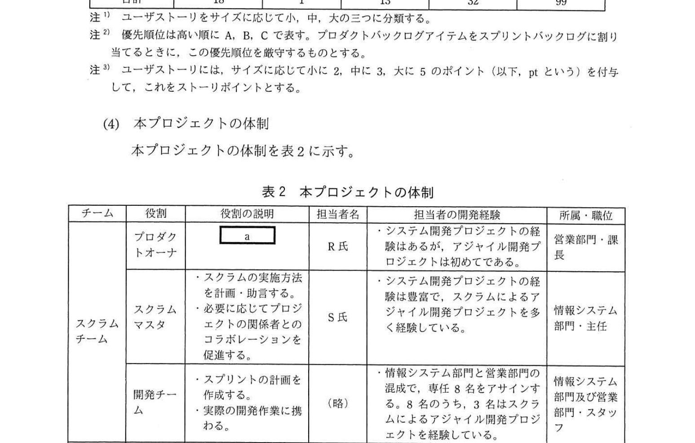
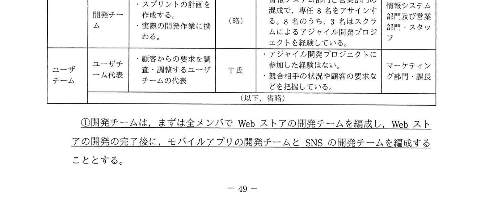
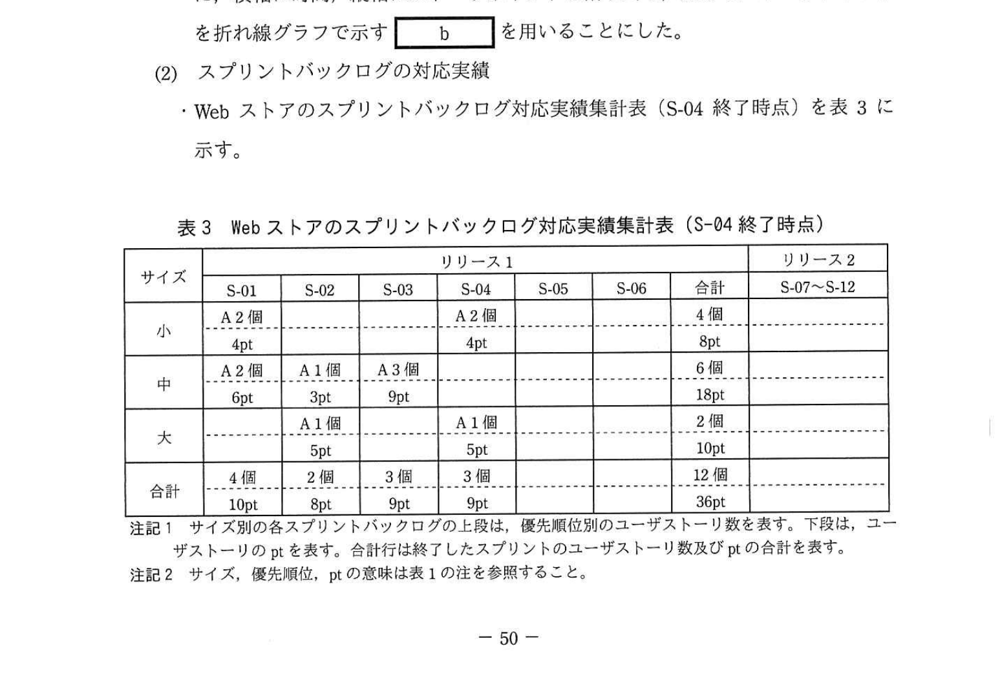

# 2021年秋期（令和3年度秋期）応用情報技術者試験 午後 問9（選択）
## プロジェクトマネジメント：家電メーカでのアジャイル開発（スクラム）

---

## 問題文

**問9** 家電メーカでのアジャイル開発に関する次の記述を読んで、設問1〜3に答えよ。

P社は、中堅の家電メーカである。従来、家電量販店を通じた拡大販売戦略で事業を伸ばしてきたが、ここ数年の競争激化によって収益性が急速に悪化している。そこで、P社は、ビジネスモデルを、家電量販店を通じた間接販売から、顧客となる消費者へ直接販売するインターネット販売へ転換する戦略を打ち出した。これを受けて、消費者向けのシステムの整備が急務となり、CDO（Chief Digital Officer）は、インターネット販売システム開発プロジェクト（以下、本プロジェクトという）を発足させた。

---

### 〔本プロジェクトの計画〕

**(1) 本プロジェクトの目的**
- インターネット販売は競合相手が多く、インターネット販売システムへの要求が満たされないと顧客は簡単に競合相手に移ってしまうので、P社として、顧客からの要求に対して、競合相手と比べてより迅速に対応できるようにする。
- これまで一部のプロジェクトだけで用いていたスクラムによるアジャイル開発を採用し、今後同社での利用を拡大させていく端緒とする。

**(2) 本プロジェクトの方針**
- P社にはスクラムの経験者が少ない。そこで試行開発の段階を設けて、スクラム開発の理解を深め、スクラムの開発要員を育成し、プロセスを確立しながら本プロジェクトを遂行する。
- 試行開発を経て、本格的なスクラム開発の人材を確保し、顧客からの要求に迅速に対応できるようにする。

**(3) 本プロジェクトのスコープ**
- インターネット販売システムは、Webストア、モバイルアプリケーションソフトウェア（以下、モバイルアプリという）及びSNSの三つのサブシステムから構成される。Webストアから開発に着手することにして、これを試行開発と位置付ける。
- Webストアのプロダクトバックログアイテムのうち、本プロジェクトの開始時点で洗い出した要件をユーザーストーリーの形式で記述して、開発の規模、難易度、複雑さなどによる開発作業の量（以下、サイズという）と優先順位で分類し、ストーリーポイントを算出した。Webストアのユーザーストーリーとサイズごとのストーリーポイントの合計を表1に示す。

### 表1 Webストアのユーザーストーリーとサイズごとのストーリーポイントの合計

> | サイズ | 優先順位A（ユーザーストーリー数） | 優先順位B | 優先順位C | 合計 | ストーリーポイントの合計 |
> |------|------|------|------|------|------|
> | 小 | 9 | 0 | 4 | 13 | 26 |
> | 中 | 7 | 0 | 4 | 11 | 33 |
> | 大 | 2 | 1 | 5 | 8 | 40 |
> | 合計 | 18 | 1 | 13 | 32 | 99 |
>
> 注記1 ユーザーストーリーをサイズに応じて小、中、大の三つに分類する。
> 注記2 優先順位とは優先度が高い順にA、B、Cで表す。プロダクトバックログアイテムをスプリントバックログに割り当てるときに、この優先順位を厳守するものとする。
> 注記3 ユーザーストーリーには、サイズに応じて小に2、中に3、大に5のポイント（以下、ptという）を付与し、これをストーリーポイントとする。

**(4) 本プロジェクトの体制**

本プロジェクトの体制を表2に示す。

### 表2 本プロジェクトの体制

> | チーム | 役割名 | 担当者 | 担当業務 |
> |------|------|------|------|
> | スクラムチーム | プロダクトオーナー | T氏 | プロダクトバックログアイテムの優先順位付けを行う。スプリントレビューで開発成果物を確認する。 |
> | スクラムチーム | スクラムマスター | R氏 | システム開発部門のスクラム経験者。スクラムに則ってチームを支援する。 `[　a　]` |
> | スクラムチーム | 開発チーム | 開発要員 | スクラムに則って開発を進める。 |
> | ユーザー | ユーザー担当 | S氏（CDOの補佐） | スクラムの支援をする。 |
>
> 注記: 開発チームは、まず全メンバでWebストアの開発チームを構成し、Webストアの開発が完了したら、モバイルアプリの開発チームとSNSの開発チームを構成することにした。（**下線①**）

---

### 〔本プロジェクトの実行と管理〕

スクラムチームは、本プロジェクトを次のように進めることになった。

**(1) スケジュールとその管理方法**

- 競合相手のWebストアは、1年に1〜2回程度のリリースであるのに対して、P社のWebストアは、**②リリースのサイクルを3か月に1回とした。**
- Webストアのリリースは、リリース1とリリース2から成る。プロダクトバックログアイテムを優先順位によって次の計画でリリースする。
  - 優先順位A…リリース1
  - 優先順位B…リリース1（ただし、今後の進捗状況でリリース2でも可）
  - 優先順位C…リリース2

- リリース内では一連のスプリントを繰り返し実施し、各スプリントはS-01, S-02というように連番を付けて表す。
- スプリントは2週間を1単位とする。
- 本プロジェクトの進捗状況が計画からどのくらい離れているかを管理するために、横軸に時間、縦軸にストーリーポイントを割り当て、残りのストーリーポイントを折れ線グラフで示す `[　b　]` を用いることにした。

**(2) スプリントバックログの対応実績**

WebストアのスプリントバックログアイテムS-04終了時点を表3に示す。

### 表3 WebストアのスプリントバックログアイテムS-04終了時点

> | サイズ | S-01 | S-02 | S-03 | S-04 | 合計 | リリース2 S-07〜S-12 |
> |------|------|------|------|------|------|------|
> | 小 | A 2個 / 4pt | - | A 2個 / 4pt | - | 4個 / 8pt | |
> | 中 | A 2個 / 6pt | A 1個 / 3pt | A 3個 / 9pt | - | 6個 / 18pt | |
> | 大 | - | A 1個 / 5pt | - | A 1個 / 5pt | 2個 / 10pt | |
> | 合計 | 4個 / 10pt | 2個 / 8pt | 3個 / 9pt | 3個 / 9pt | 12個 / 36pt | |
>
> 注記1 サイズ別の各スプリントの上段は、優先順位別のユーザーストーリー数を表す。下段は、ユーザーストーリーの ptを表す。合計行は終了したスプリントのユーザーストーリー数及びptの合計を表す。
> 注記2 サイズ、優先順位の意味は表1の注を参照すること。

**(3) プロダクトバックログアイテムの追加依頼**

S-04の途中で、T氏とR氏の間で次の会話が交わされていた。

T氏：重要な新規要件を優先順位Aとして追加することがビジネス上必須となった。

R氏：その要件が重要なことは理解したが、サイズ大のプロダクトバックログアイテム1個を新規追加することになるので、リリース1でリリースする計画のプロダクトバックログアイテムを見直すことになる。

T氏：アジャイル開発なので、要件の柔軟な追加や変更ができると思っていた。新規追加のアイテムは優先順位Aなので、必ずリリース1に入れてほしい。その上で、アジャイルの作業生産性は高いはずだから、計画したプロダクトバックログアイテムも全てリリース1に入れられるのではないか。

R氏：依頼については理解したが、リリース1でリリースするプロダクトバックログアイテムの見直しは不可避だ。

T氏：納得できないので、別途調査させてほしい。別件だが、類似の頻似する要件を、今後数件追加させてもらう可能性が高い。

R氏：了解した。その件については、プログラムの外部から見た動作を変えずにソースコードの内部構造を整理する `[　c　]` を実施することで、今後の拡張性・柔軟性を高めたいと思う。

---

### 〔プロセスの確立と実施〕

**(1) S-04終了時のレトロスペクティブ**

開発チームは、人、関係、プロセス及びツールの観点からS-04のレトロスペクティブを実施し、うまくいった項目とうまくいかなかった項目を特定・整理した。

- 開発チームは、S氏の助言を得て、**③R氏とT氏との今回のプロダクトバックログアイテムの追加依頼の会話を踏まえて、関係者間でのプロセスの確立について検討することにした。**
- R氏は、S氏の支援のもと、アジャイル開発は作業生産性の向上を目的とするものではないことをT氏に認識してもらうことにした。

**(2) S-05開始時のスプリントプランニング**

- S-05、S-06及びリリース2のベロシティとして、S-01〜S-04の各スプリントで測定したベロシティの平均値を用いる。
- R氏は、確立したプロセスに則って調整した結果、リリース1については、T氏依頼のプロダクトバックログアイテム1個を新規追加した上で、優先順位Aのプロダクトバックログアイテムのリリース日を守り、リリース2については、残りの全てのプロダクトバックログアイテムをリリース日までに完了することでT氏と合意した。このとき、リリース2に対応予定のストーリーポイントは `[　d　]` ptとなり、ベロシティ上の問題はない。

---

## 設問

### 設問1 〔本プロジェクトの計画〕について、(1)、(2)に答えよ。

**(1)** 表2中の `[　a　]` に入れる最も適切な字句を解答群の中から選び、記号で答えよ。

**解答群：**
- ア S-04におけるスプリントバックログを作成する。
- イ ガントチャートで本プロジェクトのスケジュールを管理する。
- ウ 情報システム部門へのスクラムの導入を指導、トレーニング及びコーチングする。
- エ 本プロジェクトのプロダクトバックログアイテムを作成・管理する。

**(2)** 本文中の下線①の体制とした狙いは何か。本プロジェクトの方針に沿った人材育成の観点から、40字以内で述べよ。

### 設問2 〔本プロジェクトの実行と管理〕について、(1)、(2)に答えよ。

**(1)** 本文中の下線②の狙いは何か。顧客の特性を考慮し、30字以内で述べよ。

**(2)** 本文中の `[　b　]`、`[　c　]` に入れる適切な字句を、解答群の中から選び、記号で答えよ。

**解答群：**
- ア アーンドバリュー
- イ アローダイアグラム
- ウ インクリメンタル
- エ スパイラル
- オ バーンダウンチャート
- カ プロトタイピング
- キ マイルストーン
- ク リファクタリング

### 設問3 〔プロセスの確立と実施〕について、(1)、(2)に答えよ。

**(1)** 本文中の下線③について、誰とどのようなプロセスを確立しておくべきか。40字以内で述べよ。

**(2)** 本文中の `[　d　]` に入れる適切な数値を整数で答えよ。

---

## 解答と解説

### 設問1

**(1) 正解：ウ（情報システム部門へのスクラムの導入を指導、トレーニング及びコーチングする）**

スクラムマスターの本来の役割：
- スクラムのプロセスを遵守できるようチームを支援する
- 開発チームの障害を除去する
- **ウ**: 本プロジェクトの方針「スクラムの利用を拡大させていく端緒とする」に合致。スクラムマスターとして、他部門への普及・教育を担う。

他の選択肢：
- ア: スプリントバックログ作成は開発チームの役割
- イ: ガントチャートはウォーターフォール型の管理手法でアジャイルには不適切
- エ: プロダクトバックログ管理はプロダクトオーナーの役割

**IPA公式：ウ**

**(2) 正解：全メンバがWebストアの開発でスクラムを経験してから各サブシステムの開発チームに展開するため（46字）**

本プロジェクトの方針「スクラムの開発要員を育成し、プロセスを確立しながら進める」に基づく。

- まず全メンバでWebストア（試行開発）に集中してスクラムを習得
- 全員がスクラム経験を積んだ後、モバイルアプリ・SNSの開発チームに分散配置
- → スクラム未経験者が多い環境でのリスクを低減しながら、全体のスクラム活用能力を向上

**IPA公式：全メンバでWebストアの開発を行い、スクラム開発を習得させた上で他の開発チームに配置するため**

---

### 設問2

**(1) 正解：顧客の要求に競合相手より早く対応するため（21字）**

競合相手は1年に1〜2回のリリース。P社が3か月に1回（年4回）にすることで：
- より頻繁に新機能・改善をリリース
- 顧客の要求に迅速対応 → 顧客離れ防止（顧客は競合相手に簡単に移ってしまうため）

**IPA公式：顧客の要求に競合相手より早く対応するため**

**(2) 正解：b = オ（バーンダウンチャート）、c = ク（リファクタリング）**

- **b = オ（バーンダウンチャート）**：横軸=時間、縦軸=残りストーリーポイント、残作業量を折れ線グラフで可視化するアジャイル進捗管理ツール。残りptが減っていく（burn down）様子を示す。

- **c = ク（リファクタリング）**：「プログラムの外部から見た動作を変えずにソースコードの内部構造を整理する」→ リファクタリングの定義そのもの。将来の要件追加に備えて内部構造を改善する。

**IPA公式：b = オ（バーンダウンチャート）/ c = ク（リファクタリング）**

---

### 設問3

**(1) 正解：T氏との間で、プロダクトバックログアイテムの追加・変更依頼の受付と対応のプロセスを確立する（46字）**

問題の本質：T氏は「アジャイル = 要件変更が自由」と誤解していた。R氏は追加により既存計画の見直しが必要になることを説明したが、齟齬が生じた。

確立すべきプロセス（誰と・どのように）：
- 誰と：プロダクトオーナー（T氏）との間で
- どのようなプロセス：スプリント途中でのバックログアイテム追加・変更時の手順（依頼方法、スケジュール・スコープへの影響確認、承認プロセス等）

**IPA公式：T氏との間で、プロダクトバックログアイテムを追加・変更するときの依頼と対応のプロセス**

**(2) 正解：d = 50（pt）**

計算手順：

**平均ベロシティ（S-01〜S-04）：**
= (10 + 8 + 9 + 9) ÷ 4 = 9pt/スプリント

**表1から優先順位別のpt：**
- 優先順位A: 小9個(18pt) + 中7個(21pt) + 大2個(10pt) = 18個、49pt
- 優先順位B: 大1個(5pt)
- 優先順位C: 小4個(8pt) + 中4個(12pt) + 大5個(25pt) = 13個、45pt

**T氏追加依頼：** 優先順位A、大1個 = 5pt追加
- 新優先順位Aのpt合計：49 + 5 = 54pt

**S-04終了時点での完了：**（表3）
- 全て優先順位A：12個、36pt

**リリース1残り（S-05、S-06の2スプリント）：**
- 残り優先順位A = 54 - 36 = 18pt
- S-05(9pt) + S-06(9pt) = 18pt → ちょうど完了可能

**リリース2対応予定pt：**
- 優先順位B：5pt
- 優先順位C：45pt
- **合計：50pt**

検証（リリース2ベロシティ）：
- S-07〜S-12 = 6スプリント × 9pt = 54pt ≥ 50pt → 問題なし

**IPA公式：d = 50**

---

## 参考：主要キーワード

| 用語 | 説明 |
|------|------|
| スクラム | アジャイル開発フレームワーク。スプリントを繰り返し、顧客との協調を重視 |
| プロダクトバックログ | 開発するべき機能・要件のリスト。優先順位付きでプロダクトオーナーが管理 |
| スプリント | スクラムの反復単位（通常1〜4週間）。各スプリントで動くソフトウェアを完成させる |
| スプリントバックログ | 1スプリントで実施するタスクリスト（プロダクトバックログから選択） |
| ベロシティ | 1スプリントで完了できるストーリーポイントの量。将来の見積もりに使用 |
| バーンダウンチャート | 横軸=時間、縦軸=残作業量で進捗を可視化するグラフ。残量が減少していく |
| ストーリーポイント | ユーザーストーリーの相対的な開発規模・複雑さを表す単位 |
| リファクタリング | 外部から見た動作を変えずに内部コード構造を改善する技術的作業 |
| レトロスペクティブ | スプリント終了後に行うチームの振り返り（うまくいったこと・改善点を特定） |
| プロダクトオーナー | スクラムの役割。プロダクトバックログを管理し、ビジネス価値を最大化する |
| スクラムマスター | スクラムの役割。チームがスクラムを正しく実践できるよう支援・教育・コーチング |
| CDO（Chief Digital Officer） | 最高デジタル責任者。デジタル変革（DX）を推進する経営幹部 |
