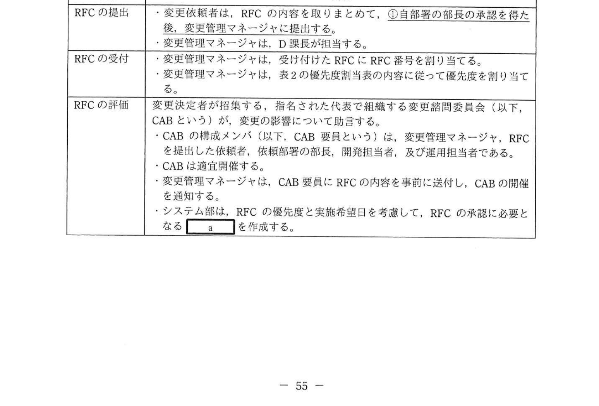
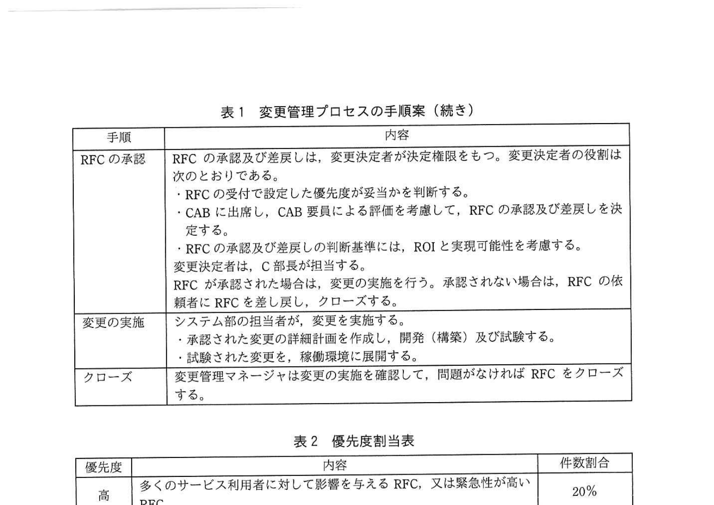
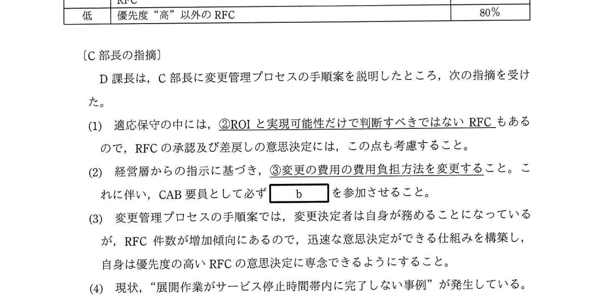

# 2021年秋期（令和3年度秋期）応用情報技術者試験 午後 問10（選択）
## サービスマネジメント：変更管理プロセスの改善（B社物流管理システム）

---

## 問題文

**問10** 変更管理に関する次の記述を読んで、設問1〜3に答えよ。

B社は、中堅の物流企業である。B社のシステム部は、物流管理システムを開発・保守・運用している。物流管理システムは、物流管理サービスとして、B社のサービス利用部署に提供されている。物流管理サービスは、週1回設けているサービス停止時間帯以外であれば、休日、夜間も利用可能である。近年、事業の拡大に伴い、物流管理サービスへの変更要求（以下、RFCという）の件数が増加し、変更管理に関する問題が顕在化してきた。

---

### 〔変更管理の現状〕

システム部では、RFCに基づいて、物流管理サービスの変更を行っている。変更を適用するリリースを稼働環境に展開する作業（以下、展開作業という）は、サービス停止時間帯に行われる。RFCは、事業環境の変化などに対応する適応保守と不具合の修正などの是正保守に大別される。適応保守には、売上げや利益を改善するための修正や法規制対応などが含まれる。変更の費用は、変更管理部署であるシステム部が一旦負担し、その費用をB社の全部署に人数割りで配賦している。

現在顕在化している変更管理に関する主な問題点は、次のとおりである。

(1) RFCの依頼者は、決められた書式の文書を電子メールに添付してシステム部の変更管理担当に提出する。RFCの依頼者は、依頼部署の上司を写し受信者として、電子メールで提出すればよいので、依頼者の個人的な見解に基づくRFCもある。

(2) 適応保守のうち、法規制対応のRFCは、RFCの依頼者が法規制の施行に基づいて設定した実施希望日に変更が実施されるが、法規制対応以外のRFCは、RFCを受け付けた順に対応しており、システム部の要員の稼働状況によって変更実施日が決められる。RFC件数の増加によって、システム部の要員はひっ迫しており、重要なRFCの変更実施日がRFCの実施希望日を過ぎてしまう場合があって、依頼者からクレームが発生している。

(3) 展開作業の計画が不十分であったり、展開作業中に障害が発生したりするなどの要因で、予定時間内に展開作業が完了しない場合がある。また、展開作業が予定時間に完了しない場合を想定しておらず、終了予定時刻を超過しても展開作業を継続し、サービス開始を遅延させてしまうことがある。

(4) 経営層からは、変更管理について次の指示が出ているが、対応できていない。
   - (a) 変更決定者を定め、売上げや利益を改善するための修正は、ROIを考慮してRFCの承認を行うこと。
   - (b) 変更の費用は、変更の実施によって利益を受ける受益者が負担すること。その場合、関係する部署でRFCを協議して、費用の取扱いを決定すること。
   - (c) 変更実施後の実現効果を利害関係者と確認し、必要に応じて利害関係者と合意した処置をとること。

---

### 〔変更管理プロセスの手順案の作成〕

システム部のC部長は、変更管理の問題点を解決するため、システムの保守・運用の管理を担当しているD課長に、変更管理の改善に着手するよう指示した。D課長は、表1に示す変更管理プロセスの手順案を作成した。

### 表1 変更管理プロセスの手順案

> | 手順 | 内容 |
> |-----|------|
> | RFCの提出 | ・変更依頼者は、RFCの内容を取りまとめて、**①自部署の部長の承認を得た後、変更管理マネージャに提出する**。 ・変更管理マネージャは、D課長が担当する。 |
> | RFCの受付 | ・変更管理マネージャは、受け付けたRFCにRFC番号を割り当てる。 ・変更管理マネージャは、表2の優先度割当表の内容に従って優先度を割り当てる。 |
> | RFCの評価 | 変更決定者が招集する、指名された代表で組織する変更諮問委員会（以下、CABという）が、変更の影響について助言する。 ・CABの構成メンバ（以下、CAB要員という）は、変更管理マネージャ、RFCを提出した依頼者、依頼部署の部長、開発担当者、及び運用担当者である。 ・CABは適宜開催する。 ・変更管理マネージャは、CAB要員にRFCの内容を事前に送付し、CABの開催を通知する。 ・システム部は、RFCの優先度と実施希望日を考慮して、RFCの承認に必要となる `[　a　]` を作成する。 |
> | RFCの承認 | RFCの承認及び差戻しは、変更決定者が決定権限をもつ。変更決定者の役割は次のとおりである。 ・RFCの受付で設定した優先度が妥当かを判断する。 ・CABに出席し、CAB要員による評価を考慮して、RFCの承認及び差戻しを決定する。 ・RFCの承認及び差戻しの判断基準には、ROIと実現可能性を考慮する。 変更決定者は、C部長が担当する。 RFCが承認された場合は、変更の実施を行う。承認されない場合は、RFCの依頼者にRFCを差し戻し、クローズする。 |
> | 変更の実施 | システム部の担当者が、変更を実施する。 ・承認された変更の詳細計画を作成し、開発（構築）及び試験する。 ・試験された変更を、稼働環境に展開する。 |
> | クローズ | 変更管理マネージャは変更の実施を確認して、問題がなければRFCをクローズする。 |

### 表2 優先度割当表

> | 優先度 | 内容 | 件数割合 |
> |-------|------|--------|
> | 高 | 多くのサービス利用者に対して影響を与えるRFC、又は緊急性が高いRFC | 20% |
> | 低 | 優先度"高"以外のRFC | 80% |

---

### 〔C部長の指摘〕

D課長は、C部長に変更管理プロセスの手順案を説明したところ、次の指摘を受けた。

1. 適応保守の中には、**②ROIと実現可能性だけで判断すべきではないRFC**もあるので、RFCの承認及び差戻しの意思決定には、この点も考慮すること。

2. 経営層からの指示に基づき、**③変更の費用の費用負担方法を変更する**こと。これに伴い、CAB要員として必ず `[　b　]` を参加させること。

3. 変更管理プロセスの手順案では、変更決定者は自身が務めることになっているが、RFC件数が増加傾向にあるので、迅速な意思決定ができる仕組みを構築し、自身は優先度の高いRFCの意思決定に専念できるようにすること。

4. 現状、「展開作業がサービス停止時間帯内に完了しない事例」が発生している。変更管理プロセスの手順案の `[　a　]` では、サービス開始を遅延させないための**④展開作業時に実施する可能性のある作業を計画する**こと。

5. 変更を実施した後に、**⑤変更実施後のレビュー**（以下、PIRという）を行い、変更の有効性をレビューすること。PIRの実施時期については、RFCの承認の際に決定すること。

6. 現状の変更管理の問題点が解決されたかを確認するために、変更管理プロセスを評価するKPIを設定すること。KPIは、依頼者からのクレームが減ったことが確認できるものとすること。

---

### 〔変更管理プロセスの手順案の修正〕

D課長は、C部長の指摘に漏れなく対応するように、変更管理プロセスの手順案を修正した。そのうち、迅速な意思決定に関する修正、及びKPIの設定は次のとおりである。

1. 迅速な意思決定については、表2に示す優先度が"低"のRFCの承認及び差戻しの決定は、`[　c　]` とする。

2. 変更管理プロセスを評価するKPIとして、次の(a)〜(c)を設定する。
   - (a) 失敗した展開作業数の削減率
   - (b) 変更に起因するインシデント数の削減率
   - (c) 実施希望日どおりに変更が実施できたRFCの割合の増加率

---

## 設問

### 設問1 〔変更管理プロセスの手順案の作成〕について、(1)、(2)に答えよ。

**(1)** 表1中の下線①の狙いを、25字以内で答えよ。

**(2)** 表1中の `[　a　]` に入れる適切な字句を解答群の中から選び、記号で答えよ。

**解答群：**
- ア エスカレーションフロー
- イ サービスカタログ
- ウ トレーニング資料
- エ 変更スケジュール

### 設問2 〔C部長の指摘〕について、(1)〜(4)に答えよ。

**(1)** 本文中の下線②について、該当するRFCを本文中の字句を用いて、10字以内で答えよ。

**(2)** 本文中の下線③の費用負担方法について、現在の方法をどのように変更するのか。変更前と変更後の方法を含めて、40字以内で述べよ。また、本文中の `[　b　]` に入れる適切な字句を解答群の中から選び、記号で答えよ。

**解答群：**
- ア インフラ構築担当者
- イ サービスデスク要員
- ウ 変更の実施によって利益を受ける部署の代表者
- エ 変更の内容に応じた専門技術をもつシステム部員

**(3)** 本文中の下線④の内容を、20字以内で答えよ。

**(4)** 本文中の下線⑤で実施するPIRの目的として、経営層からの指示を踏まえ、最も適切な内容を解答群の中から選び、記号で答えよ。

**解答群：**
- ア 変更による実現効果を利害関係者と確認するため
- イ 変更の作業を通じて要員の育成が行われたかを確認するため
- ウ 変更の実施に伴うインシデントが発生していないかを確認するため
- エ 変更の詳細計画どおりに変更の実施が行われたかを確認するため

### 設問3 〔変更管理プロセスの手順案の修正〕について、本文中の `[　c　]` に入れる適切な修正内容を30字以内で答えよ。

---

## 解答と解説

### 設問1

**(1) 正解：依頼者の個人的な見解に基づくRFCの撲滅（19字）**

下線①「自部署の部長の承認を得た後に変更管理マネージャに提出する」の狙い：
- 現状の問題点(1)にあるとおり、依頼者は上司を写し受信者にして電子メールで提出すればよいため、依頼者の個人的な見解に基づくRFCが混入している
- 自部署の部長の正式な承認を必須とすることで、こうした個人的見解に基づくRFCを排除（撲滅）する

**IPA公式：依頼者の個人的な見解に基づくRFCの撲滅**

**(2) 正解：エ（変更スケジュール）**

「システム部は、RFCの優先度と実施希望日を考慮して、RFCの承認に必要となる `[a]` を作成する。」

- RFCの優先度と実施希望日を考慮して作成するもの → **変更スケジュール**
- 変更スケジュールは: いつ・誰が・どのシステムを変更するかを計画した文書
- CABの承認判断において、スケジュール上の実施可能性を確認するために使用される

**IPA公式：エ（変更スケジュール）**

---

### 設問2

**(1) 正解：法規制対応のRFC（9字）**

本文は一貫して「**法規制対応**」（適応保守には売上げや利益を改善するための修正や法規制対応などが含まれる／法規制対応のRFCは法規制の施行に基づいて実施される）と記述している。
- 売上げ・利益改善の修正 → ROIで判断できる
- **法規制対応** → 義務的に実施しなければならない変更（ROIがマイナスでも実施必須）

設問2(1)は本文中の字句を用いて答える問題なので、字句は「法規制対応のRFC」。

**IPA公式：法規制対応のRFC**

**(2) 正解（費用負担変更方法）：全部署への人数割り配賦を、利益を受ける受益者負担に変更する。（30字）**

現状は「変更の費用は、変更管理部署であるシステム部が一旦負担し、その費用をB社の全部署に人数割りで配賦している」。
- 変更前: システム部が一旦負担し、**全部署に人数割りで配賦**
- 変更後: 変更によって利益を受ける**受益者が負担**

**b = ウ（変更の実施によって利益を受ける部署の代表者）**

費用を負担する主体（受益部署の代表者）がCABに参加することで、費用分担についての合意が形成できる。

**IPA公式：b = ウ / 全部署への人数割り配賦を、利益を受ける受益者負担に変更する。**

**(3) 正解：切り戻し計画の作成（8字）**

下線④「展開作業時に実施する可能性のある作業を計画する」の内容：
- 「展開作業がサービス停止時間内に完了しない事例」が発生している
- 停止時間内に完了しなかった場合に備え、変更を元の状態に戻す（切り戻し／バックアウト）計画を作成しておく
- これにより終了予定時刻までに元に戻し、サービス開始の遅延を防ぐ

**IPA公式：切り戻し計画の作成**

**(4) 正解：ア（変更による実現効果を利害関係者と確認するため）**

PIR（Post Implementation Review）= 変更実施後レビュー
- 「変更の有効性をレビューする」= 変更が計画通りの効果を実現したかを確認する
- 経営層の指示(c): 「変更実施後の実現効果を利害関係者と確認し、必要に応じて合意した処置をとること」

→ ア「変更による実現効果を利害関係者と確認するため」が最も適切

**IPA公式：ア**

---

### 設問3

**正解：c = 変更管理マネージャが承認及び差戻しを決定する（24字）**

現状の問題: RFC件数が増加し、C部長（変更決定者）が全てのRFCについて承認・差戻しを判断 → 優先度の高いRFCに専念できない。

修正内容:
- 優先度「高」のRFC（20%）: 引き続きC部長（変更決定者）が決定
- 優先度「低」のRFC（80%）: **変更管理マネージャ（D課長）が承認及び差戻しを決定する**

これにより:
- C部長は優先度の高いRFCへの意思決定に専念できる
- 低優先度のRFCは迅速に処理できる

**IPA公式：変更管理マネージャに権限委譲すること**

---

## 参考：主要キーワード

| 用語 | 説明 |
|------|------|
| RFC（Request for Change） | 変更要求。サービスや設備への変更を正式に依頼するための記録・文書 |
| CAB（Change Advisory Board） | 変更諮問委員会。RFCの評価・承認に助言する組織横断の委員会 |
| 適応保守 | システムを事業環境の変化に合わせるための変更（法令対応、機能追加等） |
| 是正保守 | システムの不具合を修正するための変更（バグ修正等） |
| ROI（Return on Investment） | 投資利益率。変更のコストに対して得られる利益の割合 |
| 変更スケジュール | 承認済みRFCをいつ実施するかを定めたスケジュール文書 |
| PIR（Post Implementation Review） | 変更実施後レビュー。変更の有効性・実現効果を利害関係者と確認するレビュー |
| バックアウト | 変更実施後に問題が発生した際に元の状態に戻す手順・計画 |
| 変更決定者 | RFCの承認・差戻しの決定権限を持つ人物（本問ではC部長） |
| 変更管理マネージャ | 変更管理プロセスの運営・調整を行う担当者（本問ではD課長） |
| KPI（Key Performance Indicator） | 重要業績評価指標。プロセスの有効性を評価するための測定指標 |
