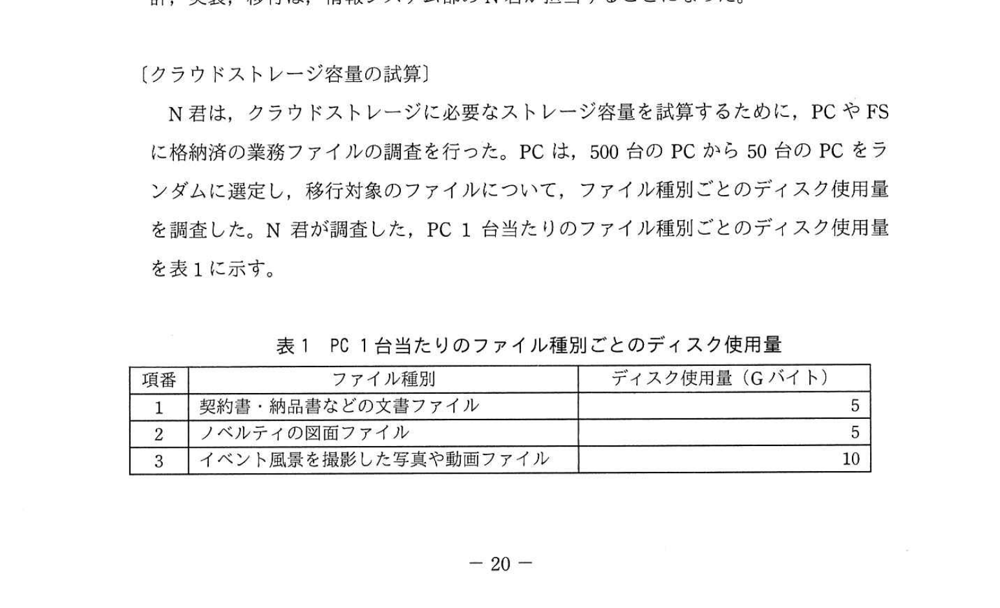
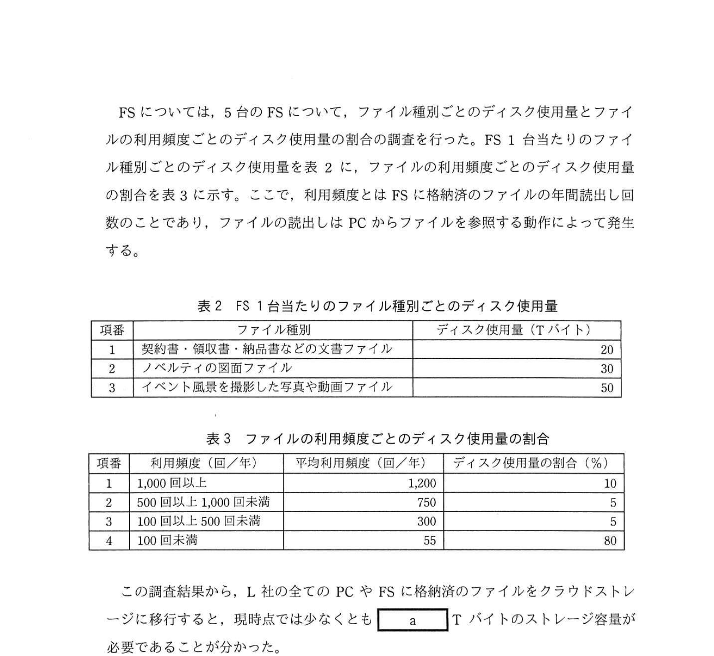
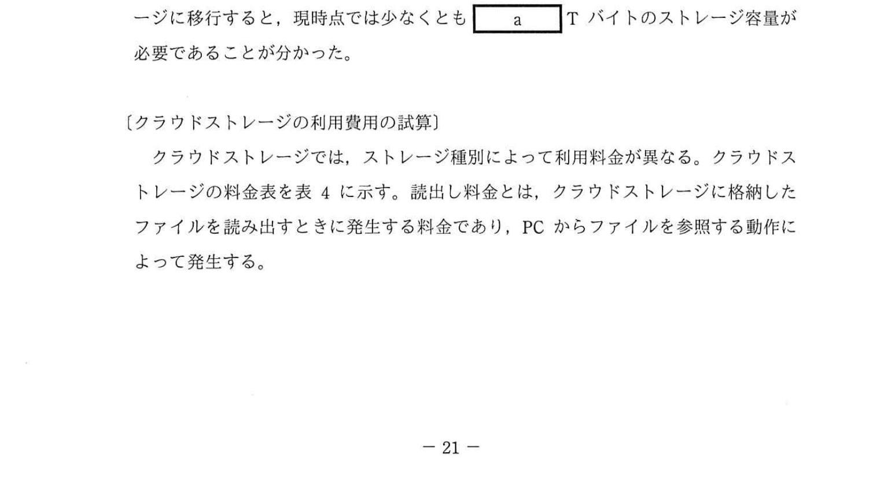
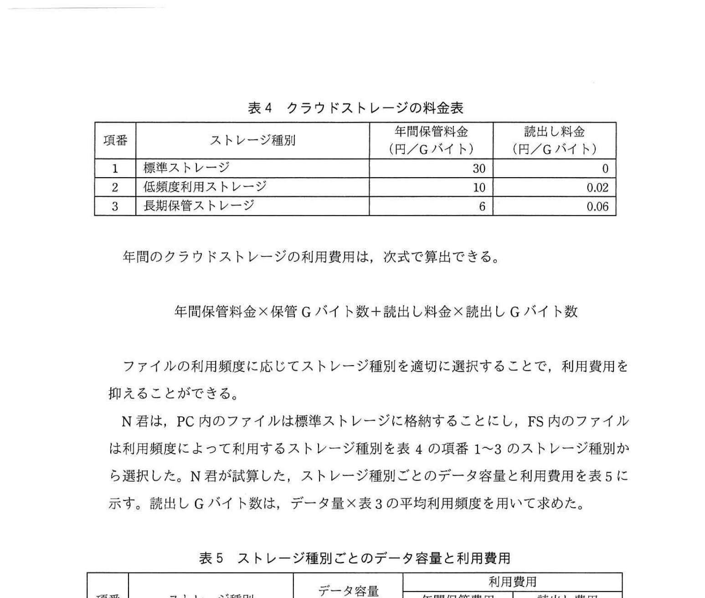
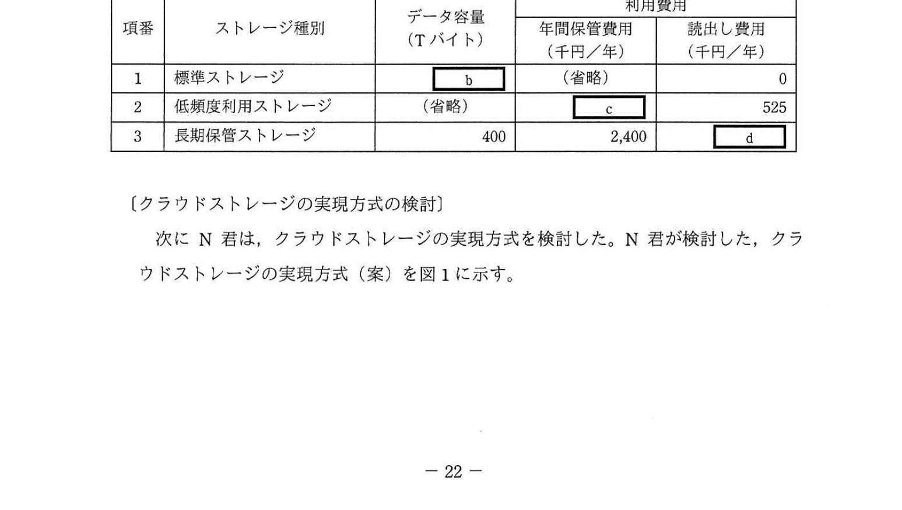
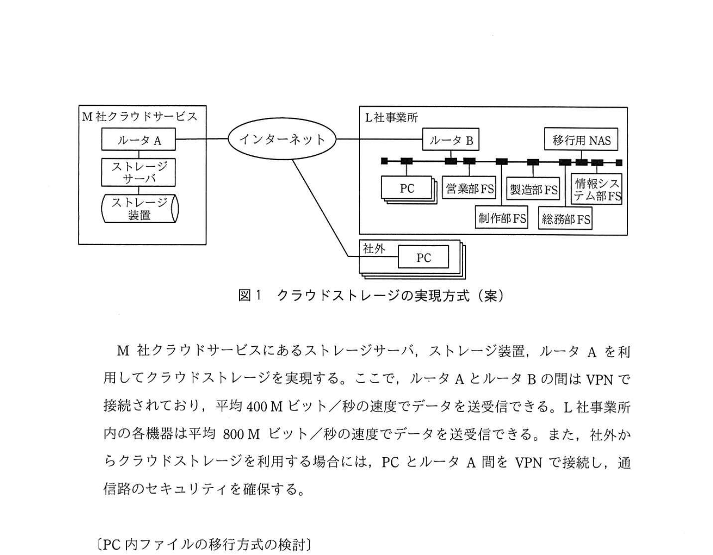
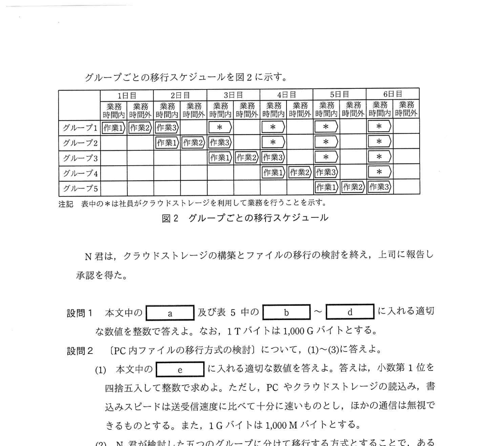

# 2021年秋期（令和3年度秋期）応用情報技術者試験 午後 問4（選択）
## システムアーキテクチャ：クラウドストレージの利用（容量試算・コスト最適化・移行設計）

---

## 問題文

**問4** クラウドストレージの利用に関する次の記述を読んで、設問1、2に答えよ。

L社は、企業のイベントなどで配布するノベルティの制作会社である。L社には、営業部、制作部、製造部、総務部、情報システム部の五つの部があり、500名の社員が勤務している。また、社員の業務時間は平日の9時から18時までである。L社では、各社員が作成した業務ファイルは各社員に1台ずつ配布されているPCに格納してあり、部内の社員間のファイル共有には部ごとに1台のファイル共有サーバ（以下、FSという）を利用している。

L社では、社員の働き方改革として、リモートワークの勤務形態を導入することにした。リモートワークでは、社外から秘密情報にアクセスするので、セキュリティを確保する必要がある。

そこで、L社では業務ファイルをPCに格納しない業務環境を構築することにした。PC内の業務ファイルをM社クラウドサービスのストレージ（以下、クラウドストレージという）に移行し、各PCからクラウドストレージにアクセスして、クラウドストレージ内のファイルを直接読み書きすることにした。また、FS内のファイルについてもクラウドストレージに移行することにした。クラウドストレージを利用した設計、実装、移行は、情報システム部のN君が担当することになった。

---

### 〔クラウドストレージ容量の試算〕

N君は、クラウドストレージに必要なストレージ容量を試算するために、PCやFSに格納済の業務ファイルの調査を行った。PCは、500台のPCから50台のPCをランダムに選定し、移行対象のファイルについて、ファイル種別ごとのディスク使用量を調査した。N君が調査した、PC1台当たりのファイル種別ごとのディスク使用量を表1に示す。

### 表1 PC1台当たりのファイル種別ごとのディスク使用量

> | 項番 | ファイル種別 | ディスク使用量（Gバイト） |
> |-----|-----------|----------------------|
> | 1 | 契約書・納品書などの文書ファイル | 5 |
> | 2 | ノベルティの図面ファイル | 5 |
> | 3 | イベント風景を撮影した写真や動画ファイル | 10 |

FSについては、5台のFSについて、ファイル種別ごとのディスク使用量とファイルの利用頻度ごとのディスク使用量の割合の調査を行った。FS1台当たりのファイル種別ごとのディスク使用量を表2に、ファイルの利用頻度ごとのディスク使用量の割合を表3に示す。ここで、利用頻度とはFSに格納済のファイルの年間読出し回数のことであり、ファイルの読出しはPCからファイルを参照する動作によって発生する。

### 表2 FS1台当たりのファイル種別ごとのディスク使用量

> | 項番 | ファイル種別 | ディスク使用量（Tバイト） |
> |-----|-----------|----------------------|
> | 1 | 契約書・領収書・納品書などの文書ファイル | 20 |
> | 2 | ノベルティの図面ファイル | 30 |
> | 3 | イベント風景を撮影した写真や動画ファイル | 50 |

### 表3 ファイルの利用頻度ごとのディスク使用量の割合

> | 項番 | 利用頻度（回/年） | 平均利用頻度（回/年） | ディスク使用量の割合（%） |
> |-----|----------------|------------------|----------------------|
> | 1 | 1,000回以上 | 1,200 | 10 |
> | 2 | 500回以上1,000回未満 | 750 | 5 |
> | 3 | 100回以上500回未満 | 300 | 5 |
> | 4 | 100回未満 | 55 | 80 |

この調査結果から、L社の全てのPCやFSに格納済のファイルをクラウドストレージに移行すると、現時点では少なくとも `[　a　]` Tバイトのストレージ容量が必要であることが分かった。

---

### 〔クラウドストレージの利用費用の試算〕

クラウドストレージでは、ストレージ種別によって利用料金が異なる。クラウドストレージの料金表を表4に示す。読出し料金とは、クラウドストレージに格納したファイルを読み出すときに発生する料金であり、PCからファイルを参照する動作によって発生する。

### 表4 クラウドストレージの料金表

> | 項番 | ストレージ種別 | 年間保管料金（円/Gバイト） | 読出し料金（円/Gバイト） |
> |-----|-------------|----------------------|---------------------|
> | 1 | 標準ストレージ | 30 | 0 |
> | 2 | 低頻度利用ストレージ | 10 | 0.02 |
> | 3 | 長期保管ストレージ | 6 | 0.06 |

年間のクラウドストレージの利用費用は次の式で算出できる。

**年間利用費用 = 年間保管料金 × 保管Gバイト数 + 読出し料金 × 読出しGバイト数**

ファイルの利用頻度に応じてストレージ種別を適切に選択することで、利用費用を抑えることができる。

N君は、PCのファイルは標準ストレージに格納することにし、FSのファイルはファイルの利用頻度によって利用するストレージ種別を表4の項番1〜3のストレージ種別から選択した。N君が試算した、ストレージ種別ごとのデータ容量と利用費用を表5に示す。読出しGバイト数は、データ量×表3の平均利用頻度を用いて求めた。

### 表5 ストレージ種別ごとのデータ容量と利用費用

> | 項番 | ストレージ種別 | データ容量（Tバイト） | 年間保管費用（千円/年） | 読出し費用（千円/年） |
> |-----|-------------|------------------|-------------------|------------------|
> | 1 | 標準ストレージ | `[　b　]` | （省略） | 0 |
> | 2 | 低頻度利用ストレージ | （省略） | `[　c　]` | 525 |
> | 3 | 長期保管ストレージ | 400 | 2,400 | `[　d　]` |

---

### 〔クラウドストレージの実現方式の検討〕

次にN君は、クラウドストレージの実現方式を検討した。N君が検討した、クラウドストレージの実現方式（案）を図1に示す。

### 図1 クラウドストレージの実現方式（案）

M社クラウドサービスにあるストレージサーバ、ストレージ装置、ルータAを利用してクラウドストレージを実現する。ここで、ルータAとルータBの間はVPNで接続されており、平均400Mビット/秒の速度でデータを送受信できる。L社事業所内の各機器は平均800Mビット/秒の速度でデータを送受信できる。また、社外からクラウドストレージを利用する場合には、PCとルータA間をVPNで接続し、通信路のセキュリティを確保する。

---

### 〔PC内ファイルの移行方式の検討〕

N君はPC内のクラウドストレージへの移行方式を検討した。社員全員が一斉にPC内のファイルを移行すると時間が掛かる。例えば、500名の社員が自分のPCに格納済の20Gバイトのデータをそれぞれクラウドストレージにコピーする場合、各社員のデータが均等に伝送されるものとすると、社員がPCでファイルのコピーの開始を指示してから全ファイルのコピーが完了するまでの時間は `[　e　]` 時間となる。

そこでN君は、業務繁忙月を避けて1週間の移行期間を設定し、L社事業所内に移行用NASを設置して移行する方式を検討した。移行期間には、500名の社員を100名ずつ五つのグループに分け、グループごとに次の三つの作業を行うことでデータを移行する。

- 作業1 業務時間内に各社員がPC内のファイルを移行用NASにコピー
- 作業2 業務時間外に移行用NASのファイルをクラウドストレージに移動
- 作業3 各社員がクラウドストレージのファイルを確認しPCのファイルを削除

グループごとの移行スケジュールを図2に示す。

### 図2 グループごとの移行スケジュール

> 注記 表中の＊は社員がクラウドストレージを利用して業務を行うことを示す。

N君は、クラウドストレージの構築とファイルの移行の検討を終え、上司に報告し承認を得た。

---

## 設問

### 設問1

本文中の `[　a　]` 及び表5中の `[　b　]` 〜 `[　d　]` に入れる適切な数値を整数で答えよ。なお、1Tバイトは1,000Gバイトとする。

### 設問2

〔PC内ファイルの移行方式の検討〕について、(1)〜(3)に答えよ。

**(1)** 本文中の `[　e　]` に入れる適切な数値を答えよ。答えは、小数第1位を四捨五入して整数で求めよ。ただし、PCやクラウドストレージの読込み、書込みスピードは送受信速度に比べて十分に速いものとし、ほかの通信は無視できるものとする。また、1Gバイトは1,000Mバイトとする。

**(2)** N君が検討した五つのグループに分けて移行する方式とすることで、ある社員がファイルのコピーの開始を指示してから移行用NASに全ファイルのコピーが完了するまでの時間は、500名の社員がクラウドストレージに直接コピーする場合と比べて、何分の1に短縮されるかを分数で答えよ。ただし、PCやクラウドストレージ、移行用NASの読込み、書込みスピードは送受信速度に比べて十分に速いものとし、ほかの通信は無視できるものとする。また、1Gバイトは1,000Mバイトとする。

**(3)** 移行用NASからクラウドストレージへのファイルの移動を業務時間外に行う理由を、35字以内で述べよ。ただし、移行用NASのデータ容量は十分に大きいものとする。

---

## 解答と解説

### 設問1

**a = 510（Tバイト）**

必要な最低ストレージ容量を算出：
- PC分: 500台 × 20GB = 10,000GB = **10TB**
- FS分: 5台 × (20+30+50)TB = 5 × 100TB = **500TB**
- 合計: 10 + 500 = **510TB**

**IPA公式：a=510**

---

**b = 60（Tバイト）**

N君はPCファイルを標準ストレージへ、FSファイルは利用頻度で選択。

コスト比較（f=年間利用頻度、Sバイト単価）：
- 標準 vs 低頻度の損益分岐: 30 = 10 + 0.02f → **f = 1,000回**
- 低頻度 vs 長期の損益分岐: 10+0.02f = 6+0.06f → **f = 100回**

よって：
- 1,000回以上/年 → **標準ストレージ**（10% of FS）
- 100〜999回/年 → **低頻度利用ストレージ**（5+5=10% of FS）
- 100回未満/年 → **長期保管ストレージ**（80% of FS）

標準ストレージのデータ容量:
- PC分: 10TB
- FS分（1,000回以上）: 10% × 500TB = 50TB
- 合計: 10 + 50 = **60TB**

**IPA公式：b=60**

---

**c = 500（千円/年）**

低頻度利用ストレージのFS分：
- 10% × 500TB = 50TB = 50,000GB
- 年間保管費用: 10円/GB × 50,000GB = 500,000円 = **500千円**

（読出し費用は表中に525千円と記載されており確認）：
- 500〜999グループ(5%, 25,000GB): 25,000 × 750回 × 0.02円 = 375,000円
- 100〜499グループ(5%, 25,000GB): 25,000 × 300回 × 0.02円 = 150,000円
- 合計読出し費用: 525,000円 = 525千円 ✓

**IPA公式：c=500**

---

**d = 1,320（千円/年）**

長期保管ストレージのFS分：
- 80% × 500TB = 400TB = 400,000GB（表中と一致）
- 平均利用頻度: 55回/年
- 読出しGバイト数: 400,000GB × 55回 = 22,000,000GB/年
- 読出し費用: 22,000,000 × 0.06円 = 1,320,000円 = **1,320千円**

**IPA公式：d=1,320**

---

### 設問2

**(1) 正解：e = 56（時間）**

500名全員が同時にクラウドストレージへコピーする場合：
- 総転送量: 500名 × 20GB = 10,000GB = 10,000,000MB = 80,000,000Mbit
- VPN帯域（ボトルネック）: 400Mbit/秒
- 転送時間: 80,000,000 ÷ 400 = 200,000秒
- 時間換算: 200,000 ÷ 3,600 ≈ 55.6時間 → 四捨五入で**56時間**

**IPA公式：e=56**

**(2) 正解：1/10**

グループ方式（100名が移行用NASへコピー）の場合：
- 転送量: 100名 × 20GB = 2,000GB = 2,000,000MB = 16,000,000Mbit
- LAN帯域: 800Mbit/秒
- 転送時間: 16,000,000 ÷ 800 = 20,000秒

直接クラウドコピーの転送時間: 200,000秒

短縮率: 20,000 / 200,000 = **1/10**

**IPA公式：1/10**

**(3) 正解：業務時間内は前のグループがクラウドストレージを利用するから（32字）**

移行スケジュール（図2）から、業務時間内はすでに移行が完了したグループの社員がクラウドストレージを利用して業務を行っている（`*`マーク）。この時間帯にNAS→クラウドへの大容量データ転送を行うと、VPN帯域を占有してしまい、既移行グループのクラウドアクセスに支障が出る。そのため、業務時間外（夜間・休日）に実施する。

**IPA公式：業務時間内は前のグループがクラウドストレージを利用するから**

---

## 参考：主要キーワード

| 用語 | 説明 |
|------|------|
| クラウドストレージ | クラウド上に提供されるオンラインストレージサービス。PC等からネットワーク経由でアクセス |
| 標準ストレージ | アクセス頻度が高いファイル向け。保管料高め・読出し無料（年1,000回以上が最適） |
| 低頻度利用ストレージ | 中程度のアクセス頻度向け。保管料低め・読出し料金あり（年100〜999回が最適） |
| 長期保管ストレージ | アクセス頻度が低いファイル向け。保管料最低・読出し料金高め（年100回未満が最適） |
| VPN（Virtual Private Network） | 公衆ネットワーク上に暗号化された仮想専用線を構築する技術。セキュリティ確保に使用 |
| FS（File Server/ファイル共有サーバ） | 部門内でファイルを共有するためのサーバ。本問では各部に1台設置 |
| NAS（Network Attached Storage） | ネットワークに直接接続するストレージ。本問では移行用の一時的な格納先として使用 |
| 損益分岐点（コスト比較） | ストレージ選択において、コストが等しくなる利用頻度の閾値（100回/年、1000回/年） |
| リモートワーク | 自宅や外出先から業務を行う就業形態。セキュリティ確保が重要課題 |
