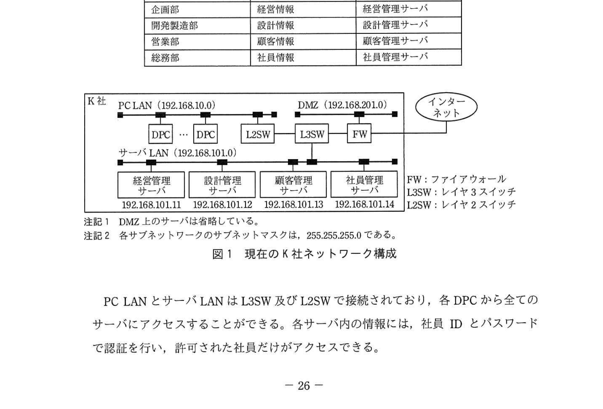
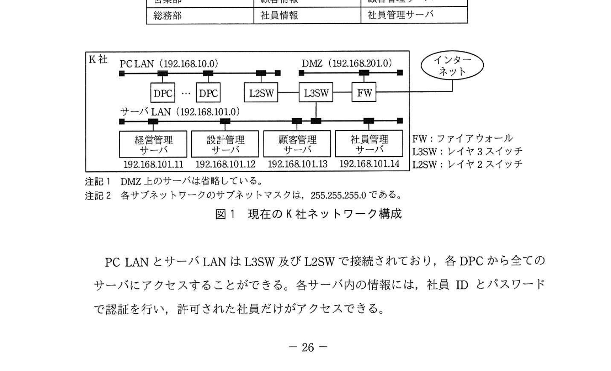
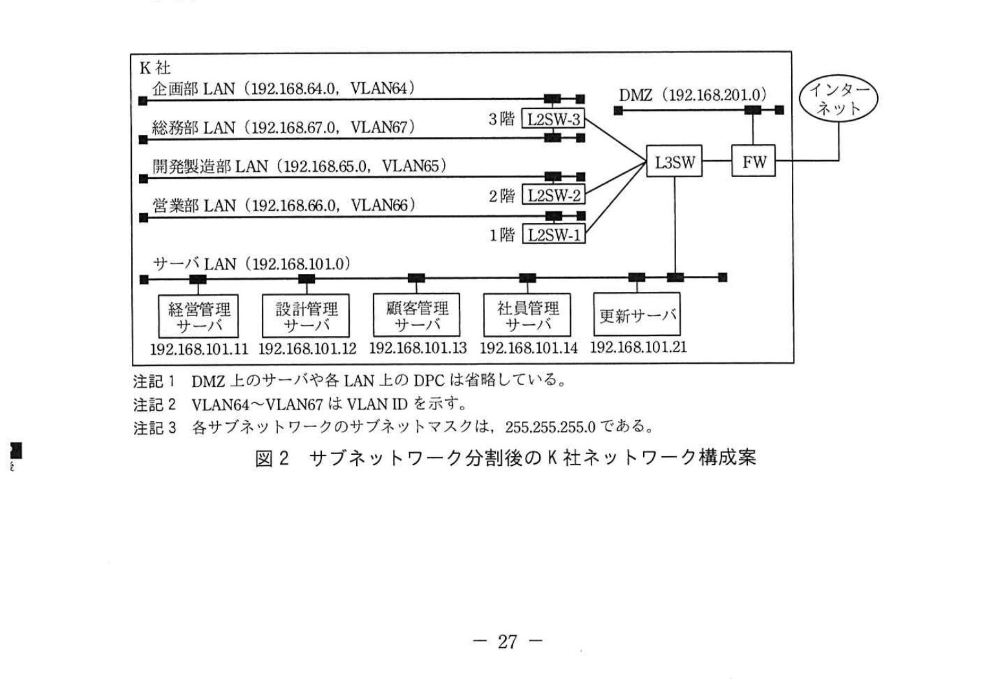
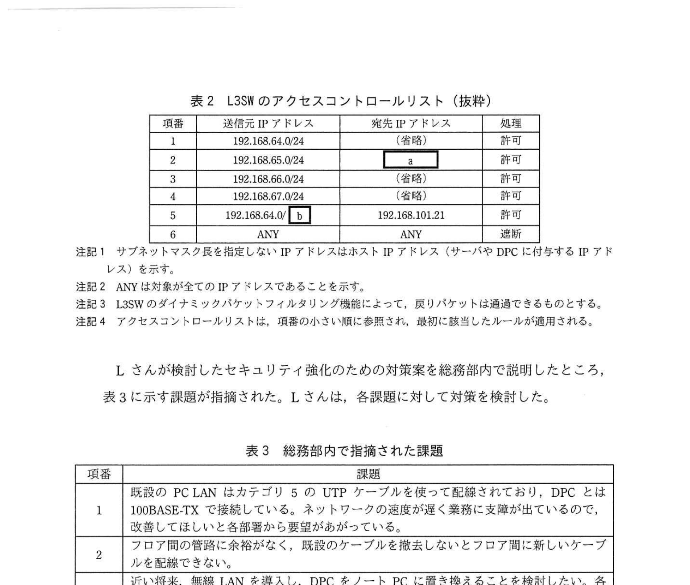
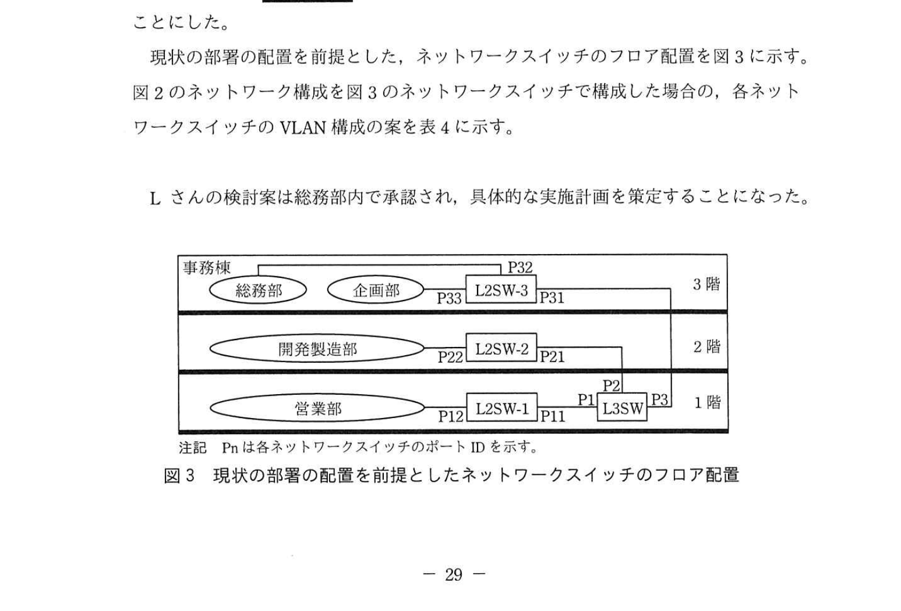
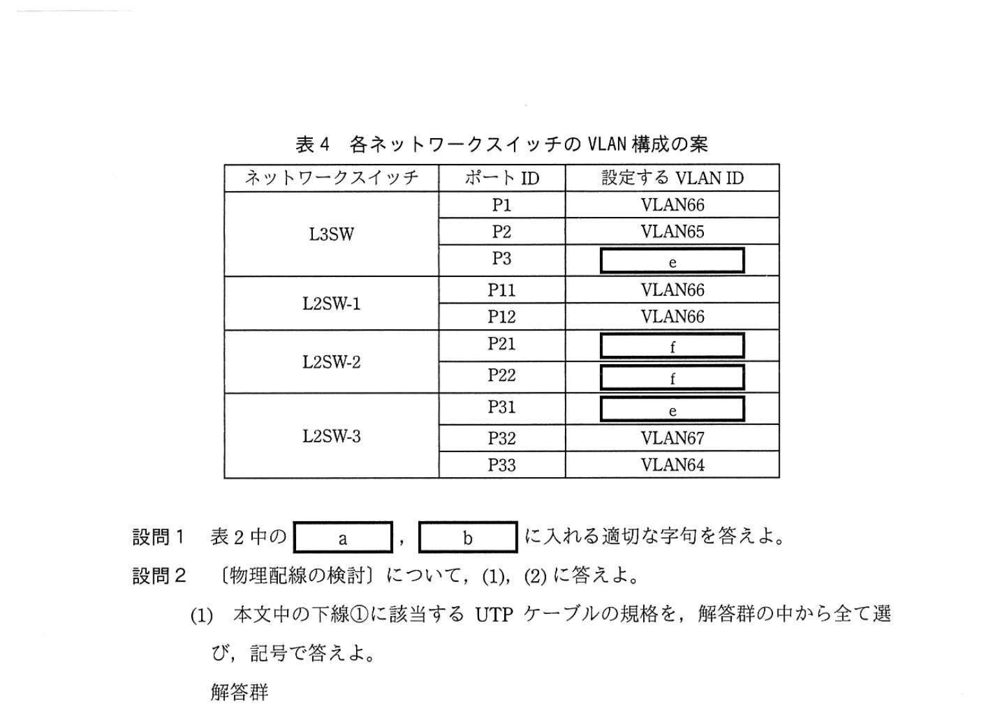

# 2021年秋期（令和3年度秋期）応用情報技術者試験 午後 問5（選択）
## ネットワーク：LANのネットワーク構成変更（VLAN・ACL・無線LAN・光ファイバ）

---

## 問題文

**問5** LANのネットワーク構成変更に関する次の記述を読んで、設問1〜4に答えよ。

K社は、従業員約200名の自動車部品製造会社である。主に国内自動車メーカから注文を受けて、駆動系部品の開発・設計・製造を行っている。K社の事務所は、工場敷地内の3階建ての事務棟に置かれており、各フロアに企画部、開発製造部、営業部及び総務部の、事務所勤務を行う社員約100名が業務を行っている。

事務棟にはK社LANが敷設されており、社員は一人1台のデスクトップPC（以下、DPCという）を使って各自の業務を行っている。現在のK社LANは、サーバを接続するサーバLAN、DPCを接続するPC LAN、及びDMZの三つのサブネットワークで構成されている。無線LANは未導入で、DPCは有線LANで接続されている。各部署の業務で扱っている重要情報と、それを管理するサーバを表1に示す。また、現在のK社ネットワーク構成を図1に示す。

### 表1 K社が各部署で扱っている重要情報とそれを管理するサーバ

> | 部署名 | 重要情報名 | サーバ名 |
> |-------|----------|---------|
> | 企画部 | 経営情報 | 経営管理サーバ |
> | 開発製造部 | 設計情報 | 設計管理サーバ |
> | 営業部 | 顧客情報 | 顧客管理サーバ |
> | 総務部 | 社員情報 | 社員管理サーバ |

### 図1 現在のK社ネットワーク構成

> PC LAN (192.168.10.0) / DMZ (192.168.201.0) / サーバLAN (192.168.101.0)
> L3SW（レイヤ3スイッチ）、L2SW（レイヤ2スイッチ）、FW（ファイアウォール）
>
> 注記1 DMZ上のサーバは省略している。
> 注記2 各サブネットワークのサブネットマスクは、255.255.255.0である。

PC LANとサーバLANはL3SW及びL2SWで接続されており、各DPCから全てのサーバにアクセスすることができる。各サーバ内の情報には、社員IDとパスワードで認証を行い、許可された社員だけがアクセスできる。

---

### 〔セキュリティ強化のための対策〕

K社では、サーバの認証情報の設定ミスによって、総務部の一部の社員が顧客情報を入手して閲覧できる状態になっていたというインシデントが発生した。K社では同種のインシデントへの対策として、セキュリティの強化を行うことになった。まず、PC LANを部署ごとに異なるサブネットワークに分割し、サブネットワークごとに接続可能なサーバを定め、それ以外のサーバへのアクセスを遮断することにした。また、ランサムウェアなどの新たな脅威に対できるウイルス対策ソフトを全てのDPCに導入することにした。サーバLAN上にウイルス対策ソフトの更新サーバを導入し、全てのDPCから定期的にアクセスして、ウイルス定義ファイルを最新の状態にすることにした。更新サーバのIPアドレスは192.168.101.21とした。

ネットワーク構成の変更を担当することになった総務部のLさんは、各フロアに設置されているL2SWを利用して、既設のPC LANを部署ごとに異なるサブネットワークに分割し、各サブネットワークにVLANを割り当てることを考えた。分割後のK社ネットワーク構成案を図2に、L3SWのアクセスコントロールリストを表2に示す。

### 図2 サブネットワーク分割後のK社ネットワーク構成案

> - 企画部LAN: 192.168.64.0/24, VLAN64
> - 総務部LAN: 192.168.67.0/24, VLAN67
> - 開発製造部LAN: 192.168.65.0/24, VLAN65
> - 営業部LAN: 192.168.66.0/24, VLAN66
> - サーバLAN: 192.168.101.0/24
>
> 注記1 DMZ上のサーバや各LAN上のDPCは省略している。
> 注記2 VLAN64〜VLAN67はVLAN IDを示す。
> 注記3 各ネットワークのサブネットマスクは、255.255.255.0である。

### 表2 L3SWのアクセスコントロールリスト（抜粋）

> | 項番 | 送信元IPアドレス | 宛先IPアドレス | 処理 |
> |-----|--------------|-------------|-----|
> | 1 | 192.168.64.0/24 | （省略） | 許可 |
> | 2 | 192.168.65.0/24 | `[　a　]` | 許可 |
> | 3 | 192.168.66.0/24 | （省略） | 許可 |
> | 4 | 192.168.67.0/24 | （省略） | 許可 |
> | 5 | 192.168.64.0/`[　b　]` | 192.168.101.21 | 許可 |
> | 6 | ANY | ANY | 遮断 |
>
> 注記1 サブネットマスク長を指定したIPアドレスはホストIPアドレス（サーバやDPCに付与するIPアドレス）を示す。
> 注記2 ANYは全てのIPアドレスであることを示す。
> 注記3 L3SWのダイナミックパケットフィルタリング機能によって、戻りパケットは通過できるものとする。
> 注記4 アクセスコントロールリストは、項番の小さい順に参照し、最後に該当したルールが適用される。

Lさんが検討したセキュリティ強化のための対策案を総務部内で説明したところ、表3に示す課題が指摘された。Lさんは、各課題に対して対策を検討した。

### 表3 総務部内で指摘された課題

> | 項番 | 課題 |
> |-----|------|
> | 1 | 既設のPC LANはカテゴリ5のUTPケーブルを使って配線されており、DPCとは100BASE-TXで接続している。ネットワークの速度が遅く業務に支障が出ているので、改善してほしいという部署からの要望がある。 |
> | 2 | フロア間の管路に余裕がなく、既設のケーブルを撤去しないとフロア間に新しいケーブルを配線できない。 |
> | 3 | 近い将来、無線LANを導入し、DPCをノートPCに置き換えることを検討したい。各フロアに無線LANアクセスポイント（以下、無線APという）を設置する準備をしておきたい。 |
> | 4 | 部署ごとの人員増減に伴って、近い将来部署を配置するフロアが変更となる可能性がある。その際にもケーブルの配線変更を最小限にしたい。 |

---

### 〔物理配線の検討〕

表3の項番1、項番2の課題に対応して、既設のPC LAN用のケーブルを撤去し、新たなケーブルを配線することにした。フロア内のL2SWからDPCまでの配線は、**①1000BASE-T方式に対応した**UTPケーブルとした。また、1階のサーバルームに設置したL3SWから各フロアのL2SWまでは、**②最大10Gビット/秒で通信可能な光ファイバケーブル**とした。

---

### 〔無線LAN導入の検討〕

表3の項番3の課題に対して、事務棟の各フロアで無線APの設置に適した場所の調査を行った。その結果、電源の確保が困難な設置場所が判明した。また、事務棟が東西方向に約50mと細長く、部屋を仕切る壁が厚いことや金属製の扉が多いことも確認した。

そこで、各フロアに設置するL2SWを今後リプレースする場合には、UTPケーブルで無線APに電力供給が可能な `[　c　]` 機能を備える機器を導入することにした。また、**③導入予定の無線APと各DPCの設置箇所での電波強度の調査を行う**こととにした。

---

### 〔VLAN構成の検討〕

表3の項番4の課題に対して、一つのフロアに複数部署が混在したり、部署がフロア内やフロア間で移動する可能性を考慮して、ネットワークスイッチのポート単位にVLANを設定するポートベースVLANではなく、一つのポートに複数のVLANを同時に設定できる `[　d　]` VLANの機能を備えるネットワークスイッチを導入することにした。

現状の部署の配置を前提とした、ネットワークスイッチのフロア配置を図3に示す。図2のネットワーク構成を図3のネットワークスイッチで構成した場合の、各ネットワークスイッチのVLAN構成の案を表4に示す。

### 図3 現状の部署の配置を前提としたネットワークスイッチのフロア配置

> 1階: 営業部、L2SW-1(P11, P12)、L3SW(P1,P2,P3)
> 2階: 開発製造部、L2SW-2(P21, P22)
> 3階: 総務部＋企画部、L2SW-3(P31, P32, P33)

### 表4 各ネットワークスイッチのVLAN構成の案

> | ネットワークスイッチ | ポートID | 設定するVLAN ID |
> |------------------|---------|-------------|
> | L3SW | P1 | VLAN66 |
> | L3SW | P2 | VLAN65 |
> | L3SW | P3 | `[　e　]` |
> | L2SW-1 | P11 | VLAN66 |
> | L2SW-1 | P12 | VLAN66 |
> | L2SW-2 | P21 | `[　f　]` |
> | L2SW-2 | P22 | `[　f　]` |
> | L2SW-3 | P31 | `[　e　]` |
> | L2SW-3 | P32 | VLAN67 |
> | L2SW-3 | P33 | VLAN64 |

---

## 設問

### 設問1

表2中の `[　a　]`、`[　b　]` に入れる適切な字句を答えよ。

### 設問2 〔物理配線の検討〕について、(1)、(2)に答えよ。

**(1)** 本文中の下線①に該当するUTPケーブルの規格を、解答群の中から全て選び、記号で答えよ。

**解答群：**
- ア カテゴリ3
- イ カテゴリ5e
- ウ カテゴリ6
- エ カテゴリ6a

**(2)** 本文中の下線②について、光ファイバケーブルを採用した理由を、UTPケーブルの伝送特性と比較して、20字以内で述べよ。

### 設問3 〔無線LAN導入の検討〕について、(1)、(2)に答えよ。

**(1)** 本文中の `[　c　]` に入れる適切な字句を、アルファベット3字で答えよ。

**(2)** 本文中の下線③について、電波強度の調査を実施せずに無線APを導入した場合に、発生するおそれのある不具合を、Lさんの調査結果を踏まえて、30字以内で述べよ。

### 設問4 〔VLAN構成の検討〕について、(1)〜(3)に答えよ。

**(1)** 本文中の `[　d　]` に入れる適切な字句を5字以内で答えよ。

**(2)** 表4中の `[　e　]`、`[　f　]` に入れる適切なVLAN IDを全て答えよ。

**(3)** 図3のフロア配置に対して、総務部が1階に移動した場合、VLAN構成に変更を加える必要がある。このうち、変更を加えるべきL3SWのポートのポートIDを全て答えよ。また、変更内容を30字以内で述べよ。

---

## 解答と解説

### 設問1

**a = 192.168.101.12**

ACLの各項番は各部署が自部署のサーバのみにアクセスできるよう制限する：
- 項番1: 企画部(192.168.64.0/24) → 経営管理サーバ(192.168.101.11)
- 項番2: 開発製造部(192.168.65.0/24) → **設計管理サーバ(192.168.101.12)** = a
- 項番3: 営業部(192.168.66.0/24) → 顧客管理サーバ(192.168.101.13)
- 項番4: 総務部(192.168.67.0/24) → 社員管理サーバ(192.168.101.14)

**b = 22**

192.168.64.0/22 は 192.168.64.0〜192.168.67.255 をカバーし、4つの部署LANすべてを含む。全部署が更新サーバ(192.168.101.21)にアクセス可能にするため。

**IPA公式：a=192.168.101.12、b=22**

---

### 設問2

**(1) 正解：イ、ウ、エ（カテゴリ5e、カテゴリ6、カテゴリ6a）**

1000BASE-T（ギガビットイーサネット）に対応するには、**カテゴリ5e以上**が必要。
- カテゴリ3：最大100Mbpsの10BASE-Tまで対応 → 1000BASE-T不可（ア は不正解）
- カテゴリ5e：1000BASE-Tに対応 ✓（イ）
- カテゴリ6：1000BASE-Tに対応（さらに10GBASE-Tにも対応）✓（ウ）
- カテゴリ6a：10GBASE-Tに完全対応 ✓（エ）

**IPA公式：イ、ウ、エ**

**(2) 正解：電磁ノイズの影響を受けにくいから（18字）**

光ファイバはガラス繊維で信号を光として伝送するため：
- 金属製の扉や厚い壁による電磁ノイズの影響を受けない（UTPケーブルは電磁ノイズの影響を受ける）
- 長距離伝送でも減衰が少ない

---

### 設問3

**(1) 正解：PoE（3字）**

**PoE（Power over Ethernet）**：UTPケーブルを通じてイーサネット接続機器に電力を供給する技術。電源の確保が困難な場所にある無線APに、ネットワークケーブル1本で通信と電力を供給できる。

**IPA公式：PoE**

**(2) 正解：壁や扉が電波を遮り、一部のDPCに電波が届かない場合がある（30字）**

事務棟の調査結果：
- 東西方向に約50mと細長い
- 部屋を仕切る壁が厚い
- 金属製の扉が多い

これらが電波の障害（減衰・遮蔽）となり、調査なしに導入すると無線APの電波が届かないデッドゾーンが生じる可能性がある。

---

### 設問4

**(1) 正解：トランク（4字）**

**トランクVLAN**（タグVLAN）：1つのポートに複数のVLANのトラフィックを混在させる機能。IEEE 802.1Qタグで各フレームにVLAN IDを付与して識別する。部署移動時もケーブル配線変更なくVLAN設定変更のみで対応できる。

**IPA公式：トランク**

**(2) 正解：e = VLAN64、VLAN67　　f = VLAN65**

- **e（L3SW P3 と L2SW-3 P31）**：3階には企画部(VLAN64)と総務部(VLAN67)が混在するため、両VLANをトランク伝送する → VLAN64、VLAN67
- **f（L2SW-2 P21 と P22）**：2階は開発製造部のみ(VLAN65)→ VLAN65

**IPA公式：e=VLAN64、VLAN67　f=VLAN65**

**(3) 正解：P1、P3　変更内容：P1にVLAN67を追加し、P3からVLAN67を削除する（30字）**

総務部が3階→1階に移動した場合：
- 1階：営業部(VLAN66) + 総務部(VLAN67)が混在
- 3階：企画部(VLAN64)のみ

L3SWの変更：
- **P1**（現在VLAN66のみ）：VLAN67を追加してトランクポートに変更
- **P3**（現在VLAN64、VLAN67）：VLAN67を削除してVLAN64のみに変更

---

## 参考：主要キーワード

| 用語 | 説明 |
|------|------|
| L3SW（レイヤ3スイッチ） | IPアドレスに基づくルーティング機能を持つスイッチ。VLAN間通信やACL適用が可能 |
| VLAN（Virtual LAN） | 物理配線に関係なく論理的に分割された仮想ネットワーク。IEEE 802.1Q準拠 |
| トランクVLAN（タグVLAN） | 1ポートで複数VLANのトラフィックを伝送する方式。802.1Qタグで識別 |
| ACL（アクセスコントロールリスト） | IPアドレスやポート番号に基づいてパケットの通過・遮断を制御するルールリスト |
| 1000BASE-T | 1Gbps対応の有線LAN規格。カテゴリ5e以上のUTPケーブルが必要 |
| PoE（Power over Ethernet） | UTPケーブルで電力と通信を同時供給する技術（IEEE 802.3af/at） |
| 光ファイバ | ガラス繊維で光信号を伝送。電磁ノイズ耐性が高く長距離伝送に適する |
| カテゴリ5e | 1000BASE-Tに対応するUTPケーブルの最低規格 |
| 更新サーバ | ウイルス定義ファイルなどを配布するサーバ。全DPCからアクセスできる必要がある |
| サブネット分割 | ネットワークをより小さなサブネットに分けてセキュリティ・管理性を向上させること |
