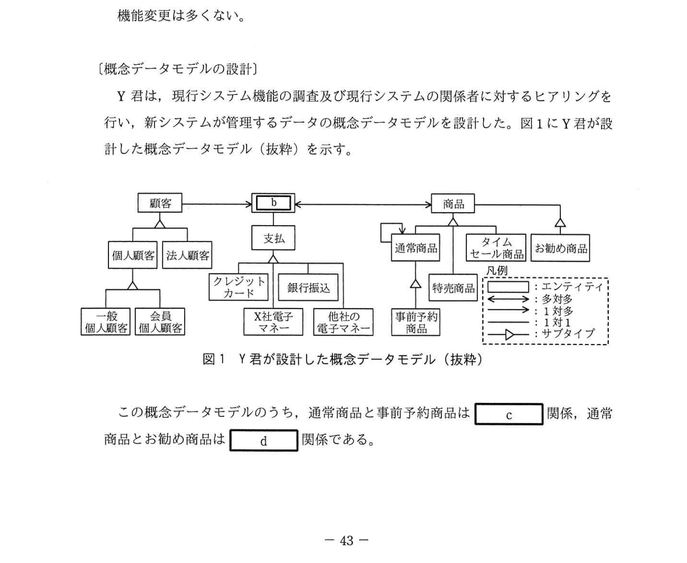
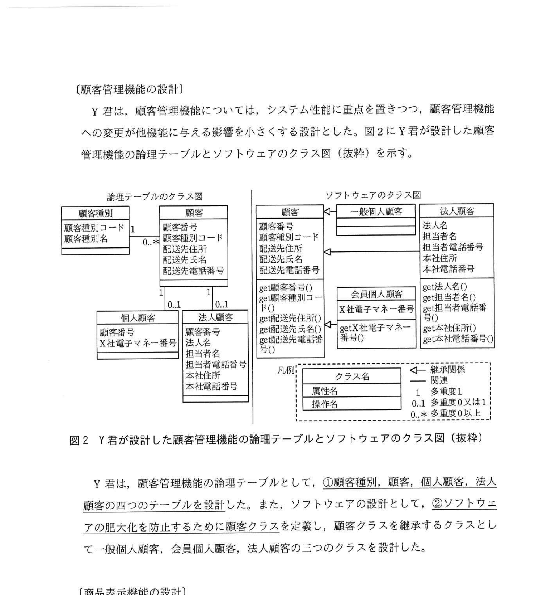
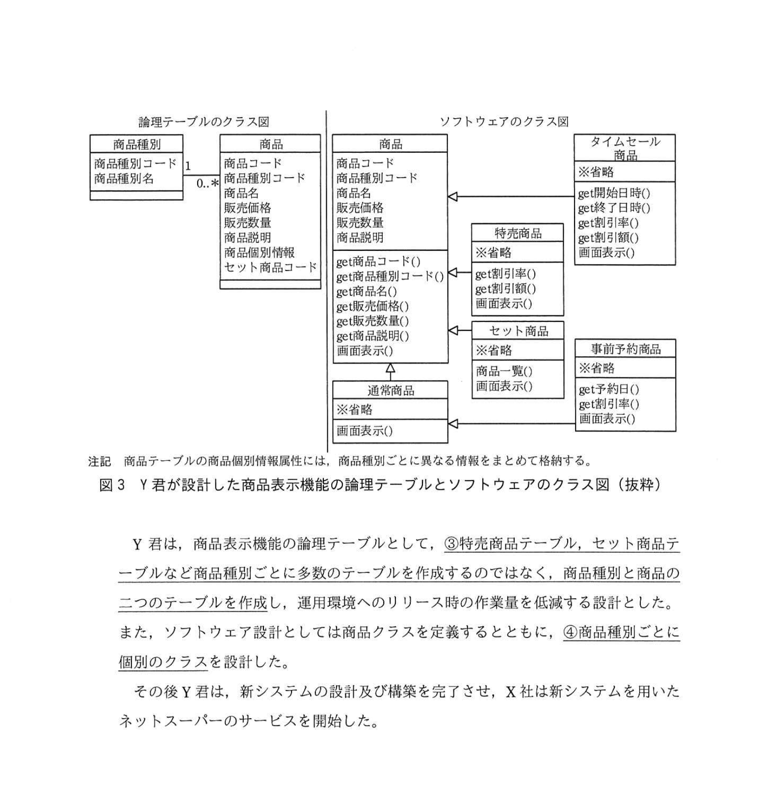

# 2021年秋期（令和3年度秋期）応用情報技術者試験 午後 問8（選択）
## 情報システム開発：データ中心設計（ネットスーパーシステム）

---

## 問題文

**問8** データ中心設計に関する次の記述を読んで、設問1〜4に答えよ。

X社は、30店舗をもつスーパーマーケットチェーンである。X社の店舗は、地域の顧客ニーズに合わせた商品選定、販売戦略によって、売上げを伸ばしている。

X社では、Webサイトで購入した商品を自宅に配送するサービス（以下、ネットスーパーという）を3年前から開始している。近年、他社も同様のサービスを開始し、競争が加熱している。

X社のネットスーパーを支える情報システム（以下、現行システムという）は、システム機能の追加や変更（以下、機能変更という）が多く、ソフトウェアが肥大化、複雑化している。そこで、X社では、顧客や店舗スタッフからの機能変更の要求に迅速に対応することを目的に、新しいネットスーパーシステム（以下、新システムという）を構築することにした。新システムの開発は、システム部門のY君が担当することになった。

---

### 〔システム設計方法の調査〕

Y君は、機能変更を繰り返しても、ソフトウェアの構造が複雑になりにくく、変更容易性の高いシステムが構築可能なデータ中心設計について調査した。

X社がこれまで採用してきた `[　a　]` 中心設計は、データの設計に先行して機能を設計し、機能に合わせて必要なデータを設計する手法である。この手法を用いると、業務要件が変わると機能もデータも変更が必要となる。

一方で、データ中心設計は、データの構造は機能と比較して変わりにくいという点に注目し、機能の設計に先行してデータを設計する手法である。データを中心に設計することで、機能変更時にもデータの変更を少なくできる。

---

### 〔現行システム機能の調査〕

Y君は、現行システムの三つの機能と機能変更の頻度について調査した。

**(1) 顧客管理機能**

顧客情報を登録、更新するための機能。顧客には、顧客種別として、個人顧客と法人顧客があり、個人顧客には一般個人顧客とX社電子マネー会員である会員個人顧客がある。この機能は、過去3年間に顧客種別の追加に関する機能変更が1回だけあった。

**(2) 商品表示機能**

顧客へ商品を表示する機能。商品には、商品種別として、通常商品のほか、通常商品を束ねたセット商品、特売商品、タイムセール商品、事前に予約することによって通常商品を割引価格で購入できる事前予約商品、及び顧客の購入履歴から算出したお勧めの商品がある。商品種別ごとに画面の表示方法が異なる。この機能は、顧客にX社のネットスーパーを選択してもらうための重要な機能であり、商品種別の追加に関する機能変更が多い。

**(3) 購入機能**

顧客が商品を購入し、料金を支払う機能。料金支払には、X社電子マネー、クレジットカード、銀行振込、3種類の他社の電子マネーが利用できる。この機能への機能変更は多くない。

---

### 〔概念データモデルの設計〕

Y君は、現行システム機能の調査及び現行システムの関係者に対するヒアリングを行い、新システムが管理するデータの概念データモデルを設計した。図1にY君が設計した概念データモデル（抜粋）を示す。

### 図1 Y君が設計した概念データモデル（抜粋）

> エンティティ: 顧客 ─── `[　b　]` ─── 商品
>
> 顧客の下位: 個人顧客、法人顧客
> 個人顧客の下位: 一般個人顧客、会員個人顧客
>
> 支払の下位: クレジットカード、銀行振込、X社電子マネー、他社の電子マネー
>
> 商品の下位: 通常商品、タイムセール商品、お勧め商品
> 通常商品の下位: セット商品、特売商品
> 特売商品の下位: 事前予約商品、セット商品（※）
>
> 通常商品 ──(1対多)→ 通常商品 （自己参照）
>
> 凡例: エンティティ / 多対多 / 1対多 / 1対1 / サブタイプ

この概念データモデルのうち、通常商品と事前予約商品は `[　c　]` 関係、通常商品とお勧め商品は `[　d　]` 関係である。

---

### 〔顧客管理機能の設計〕

Y君は、顧客管理機能については、システム性能に重点を置きつつ、顧客管理機能への変更が他機能に与える影響を小さくする設計とした。図2にY君が設計した顧客管理機能の論理テーブルとソフトウェアのクラス図（抜粋）を示す。

### 図2 Y君が設計した顧客管理機能の論理テーブルとソフトウェアのクラス図（抜粋）

> **論理テーブルのクラス図（左）:**
> - 顧客種別（顧客種別コード, 顧客種別名）
> - 顧客（顧客番号, 顧客種別コード, 配送先住所, 配送先氏名, 配送先電話番号）→ 0..* 個人顧客
> - 個人顧客（顧客番号, X社電子マネー番号）
> - 法人顧客（顧客番号, 法人名, 担当者名, 担当者電話番号, 本社住所, 本社電話番号）
>
> **ソフトウェアのクラス図（右）:**
> - 顧客クラス（顧客番号, 顧客種別コード, ...）← 継承
>   - 一般個人顧客
>   - 会員個人顧客（X社電子マネー番号）
>   - 法人顧客（法人名, ...）

Y君は、顧客管理機能の論理テーブルとして、**①顧客種別、顧客、個人顧客、法人顧客の四つのテーブルを設計した**。また、ソフトウェアの設計として、**②ソフトウェアの肥大化を防止するために顧客クラスを定義し**、顧客クラスを継承するクラスとして一般個人顧客、会員個人顧客、法人顧客の三つのクラスを設計した。

---

### 〔商品表示機能の設計〕

Y君は、商品表示機能は機能変更の頻度が高いことを考慮し、システム性能よりも変更容易性に重点をおいた設計とした。図3にY君が設計した商品表示機能の論理テーブルとソフトウェアのクラス図（抜粋）を示す。

### 図3 Y君が設計した商品表示機能の論理テーブルとソフトウェアのクラス図（抜粋）

> **論理テーブルのクラス図（左）:**
> - 商品種別（商品種別コード, 商品種別名）
> - 商品（商品コード, 商品種別コード, 商品名, 販売価格, 販売数量, 商品説明, 商品個別情報, セット商品コード）
>   - 注記: 商品テーブルの商品個別情報属性には、商品種別ごとに異なる情報をまとめて格納する。
>
> **ソフトウェアのクラス図（右）:**
> - 商品クラス（商品コード, 商品種別コード, ...）
>   - 通常商品（画面表示()）
>   - タイムセール商品（得開始日時(), 得終了日時(), get割引率(), 画面表示()）
>   - セット商品（商品一覧(), 画面表示()）
>   - 特売商品（get割引率(), 画面表示()）
>     - 事前予約商品（get予約日(), get割引率(), 画面表示()）

Y君は、商品表示機能の論理テーブルとして、**③特売商品テーブル、セット商品テーブルなど商品種別ごとに多数のテーブルを作成するのではなく、商品種別と商品の二つのテーブルを作成し**、運用環境へのリリース時の作業量を低減する設計とした。また、ソフトウェア設計としては商品クラスを定義するとともに、**④商品種別ごとに個別のクラスを設計した**。

---

## 設問

### 設問1

本文中の `[　a　]` に入れる、データ中心設計と対比される適切な字句を答えよ。

### 設問2 〔概念データモデルの設計〕について、(1)〜(3)に答えよ。

**(1)** 図1中の `[　b　]` に入れる適切な字句を〔現行システム機能の調査〕内の字句を使って答えよ。

**(2)** 図1中の通常商品を始点とし通常商品を終点とする1対多の関連は何を意味するか〔現行システム機能の調査〕内の字句を使って答えよ。

**(3)** 本文中の `[　c　]`、`[　d　]` に入れる適切な字句を、解答群の中から選び、記号で答えよ。

**解答群：**
- ア 共存
- イ 排他
- ウ 包含

### 設問3 〔顧客管理機能の設計〕について、(1)、(2)に答えよ。

**(1)** 本文中の下線①について、一般個人顧客と会員個人顧客を二つのテーブルに分けるのではなく個人顧客というテーブルとした理由として、**ふさわしくないもの**を解答群の中から選び、記号で答えよ。

**解答群：**
- ア 一般個人顧客と会員個人顧客で属性に大きな差がないから
- イ 顧客種別には、多くの変更が入らないことが予想されるから
- ウ テーブルへの列追加時に顧客管理機能のソフトウェアの影響調査の範囲が小さくなるから
- エ 販売実績の集計などを行う場合に、二つのテーブルではテーブル結合が多くなり、データベースサーバの負荷が大きくなるから

**(2)** 本文中の下線②について、顧客クラスを定義することでソフトウェアの肥大化が防止できるのはなぜか。30字以内で述べよ。

### 設問4 〔商品表示機能の設計〕について、(1)、(2)に答えよ。

**(1)** 本文中の下線③の設計とすることで、商品種別を追加した際に、運用環境へのリリース時にどのような作業を低減できるか。20字以内で述べよ。

**(2)** 本文中の下線④について、Y君が商品種別ごとにクラスを定義した理由を、商品表示機能の特徴の観点から20字以内で述べよ。

---

## 解答と解説

### 設問1

**正解：a = プロセス（または機能）**

データ中心設計（DOA: Data Oriented Approach）と対比される設計手法：
- **プロセス中心設計**（POA: Process Oriented Approach）= 機能中心設計
- 機能から先に設計し、機能に必要なデータを後から決める
- 業務要件が変わると機能・データとも変更が必要になる（変更容易性が低い）

**IPA公式：a = プロセス**

---

### 設問2

**(1) 正解：b = 購入**

顧客（Customer）と商品（Product）の間には「購入（Purchase）」という関連がある。現行システム機能の調査の「(3)購入機能」に対応。多対多（顧客は複数商品を購入でき、商品も複数顧客に購入される）の関連。

**IPA公式：b = 購入**

**(2) 正解：お勧め商品の関連（顧客の購入履歴から推奨する商品を示す関連）**

通常商品を始点とし通常商品を終点とする1対多の自己参照関連は「**お勧め商品**」を表す。ある通常商品（例: 商品A）から複数のお勧め通常商品（商品B, C, D...）へのリンク。顧客の購入履歴から算出したお勧めの商品を示す。

**IPA公式：顧客の購入履歴から算出したお勧めの商品を示す（または：お勧め商品の関連）**

**(3) 正解：c = イ（排他）、d = ウ（包含）**

- **c = イ（排他）**：通常商品と事前予約商品は排他関係。一つの商品は通常商品か事前予約商品かのいずれか一方であり、同時には両方に属せない（異なるサブタイプ）。

- **d = ウ（包含）**：通常商品とお勧め商品は包含関係。お勧め商品は通常商品の中から選ばれるもので、お勧め商品 ⊆ 通常商品という包含関係になる。

**IPA公式：c = イ / d = ウ**

---

### 設問3

**(1) 正解：イ**

「ふさわしくない」理由を選ぶ：

| 選択肢 | 評価 | 根拠 |
|-------|------|------|
| ア 属性に大きな差がない | ○ふさわしい | 一般個人顧客と会員個人顧客はX社電子マネー番号があるかどうかの差のみで、ほぼ同じ属性構成 |
| **イ 顧客種別に変更が少ない** | **✗ふさわしくない** | 変更頻度はテーブル設計の理由と無関係。変更頻度が低くても統合する・しないの根拠にはならない |
| ウ 列追加時の影響範囲が小さい | ○ふさわしい | 1テーブルなら列追加の変更箇所が少なくなる |
| エ 結合が少なくパフォーマンス向上 | ○ふさわしい | 2テーブルだと常にJOINが必要になりDB負荷増大 |

**IPA公式：イ**

**(2) 正解：顧客に共通する属性とメソッドを顧客クラスに集約できるから（30字）**

顧客クラスを定義し継承させる利点（オブジェクト指向の継承）：
- 顧客番号・配送先住所・配送先氏名など共通の属性を親クラスに1回だけ定義
- getCustomerNumber()などの共通メソッドも親クラスに定義
- 各サブクラス（一般個人顧客・会員個人顧客・法人顧客）では差分だけを実装
- 共通コードの重複を排除 → ソフトウェアの肥大化防止

**IPA公式：顧客に共通する属性やメソッドを顧客クラスに集約できるから**

---

### 設問4

**(1) 正解：データベースのテーブルを追加するDDLの実行作業（23字）**

下線③の設計（商品種別と商品の2テーブルのみ）の場合：
- 新しい商品種別を追加するときは、**商品種別テーブルにレコードを追加するだけ**でよい
- テーブルそのものの追加（CREATE TABLE）が不要
- 運用環境でDDL（テーブル定義変更）を実行する作業が不要になる

**IPA公式：データベーステーブルの追加作業（またはDDL実行作業）**

**(2) 正解：商品種別ごとに画面の表示方法が異なるから（22字）**

商品表示機能の特徴：「商品種別ごとに画面の表示方法が異なる」（本文中に明記）。

- 各商品種別クラス（通常商品、タイムセール商品、セット商品、特売商品、事前予約商品）が独自の画面表示()メソッドを持つ
- ポリモーフィズム（多態性）により、商品種別に応じた表示処理を各クラスで実装可能
- 機能変更時も対象クラスのみを修正すれば済む（変更容易性が向上）

**IPA公式：商品種別ごとに画面の表示方法が異なるから**

---

## 参考：主要キーワード

| 用語 | 説明 |
|------|------|
| データ中心設計（DOA） | データ構造を先行して設計し、機能はデータを使う形で設計。変更容易性が高い |
| プロセス中心設計（POA） | 機能（プロセス）を先行して設計し、必要なデータを後から決める。機能変更時にデータ変更も必要になりやすい |
| 概念データモデル | 現実世界のデータ概念とその関係を表現したモデル（E-R図等）。実装に依存しない |
| サブタイプ（is-a関係） | 上位エンティティの特殊化。例: 個人顧客 is-a 顧客 |
| 排他関係 | あるエンティティが複数のサブタイプのうちただ一つに属する関係 |
| 共存関係 | 複数のサブタイプが同時に成立しうる関係 |
| 包含関係 | 一方が他方のサブセットである関係 |
| 継承（inheritance） | 親クラスの属性・メソッドをサブクラスが引き継ぐオブジェクト指向の機能 |
| ポリモーフィズム | 同じメソッド名でクラスごとに異なる振る舞いを実現する機能 |
| DDL（Data Definition Language） | CREATE/ALTER/DROP等、DBスキーマを操作するSQL文 |
| 論理テーブル | 関係データベース設計における表の論理的定義（主キー・外部キー・属性の定義）|
