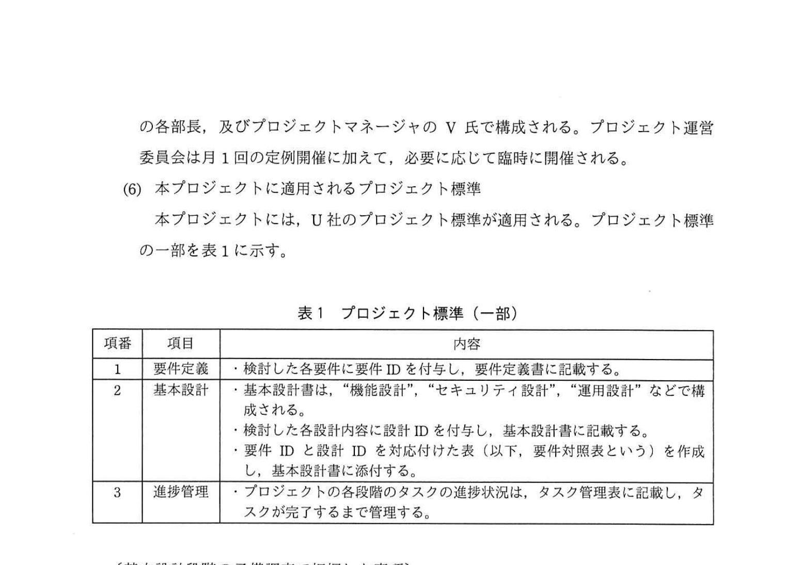
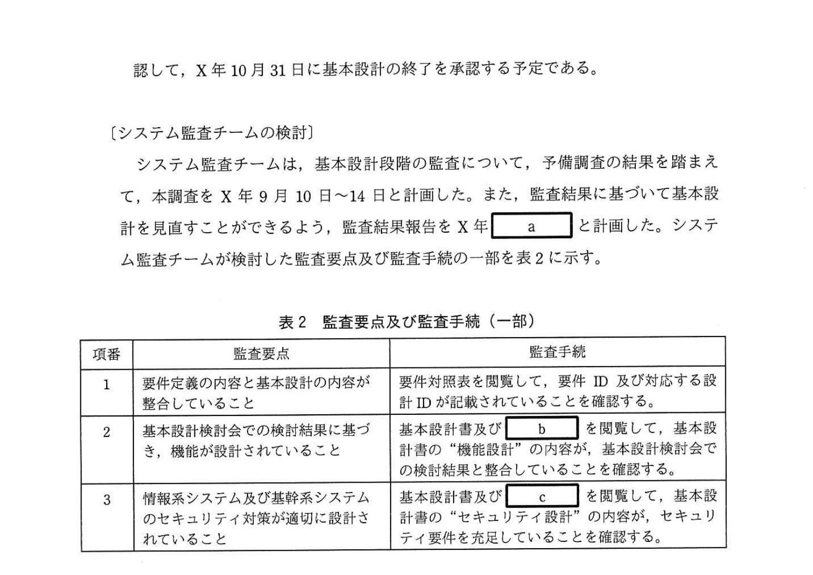
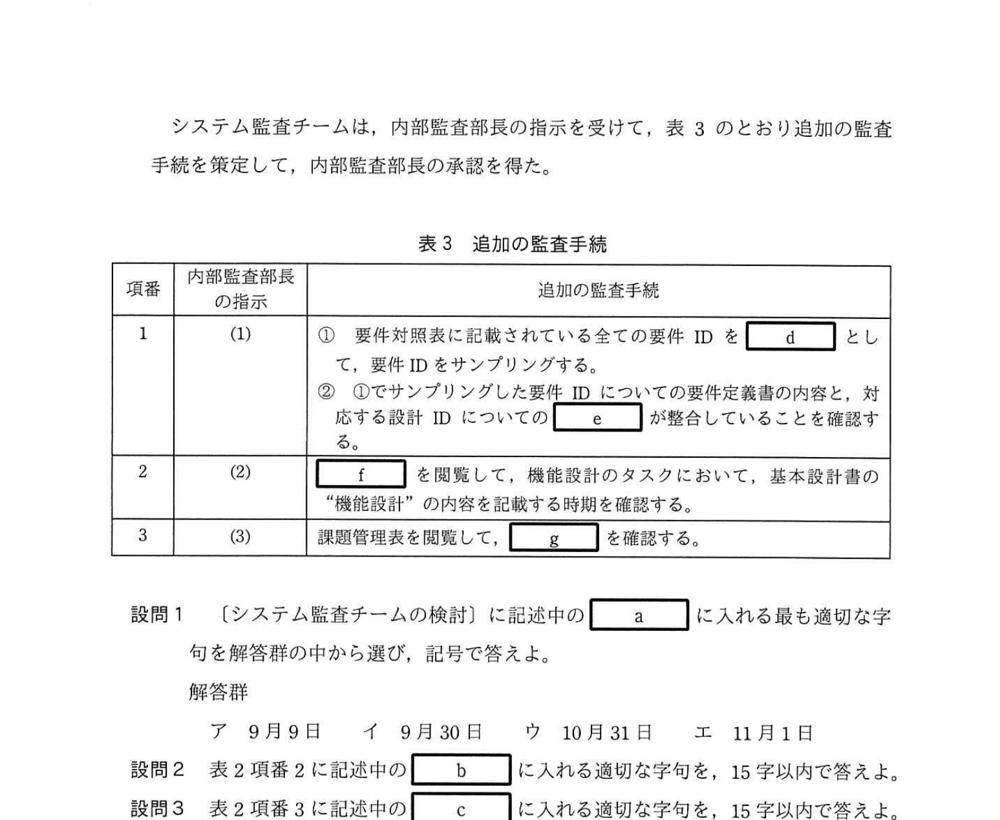

# 2021年秋期（令和3年度秋期）応用情報技術者試験 午後 問11（必須）
## システム監査：システム構築プロジェクトの基本設計段階の監査（U社クレジットカード）

---

## 問題文

**問11** システム構築プロジェクトの監査に関する次の記述を読んで、設問1〜6に答えよ。

クレジットカード会社のU社では、顧客利便性の向上、コストの削減などを目的として、インターネットを通じて各種情報を顧客に提供するシステムの構築プロジェクト（以下、本プロジェクトという）を推進している。

U社の内部監査部長は、年度監査計画に基づき、システム監査チームに対して、本プロジェクトの各段階の適切性を監査するよう指示した。

---

### 〔要件定義段階の監査で把握した事項〕

システム監査チームは、要件定義段階の監査をX年5月に行い、本プロジェクトに関して、次のことを把握した。なお、監査の結果、監査報告書に記載すべき重要な指摘事項はなかった。

**(1) 要件の区分**

要件は、機能要件、セキュリティ要件、運用要件などに区分される。

**(2) 機能要件**

従来、クレジットカード利用明細などの顧客向けの情報（以下、カード利用情報という）は、基幹系システムで作成して出力し、広告用パンフレットなどとともに、顧客宛に送付していた。本プロジェクトでは、カード利用情報、広告情報などを顧客がWebブラウザで閲覧できるよう、情報系システムを開発するとともに、基幹系システムを改修する。

**(3) セキュリティ要件**

情報系システム及び基幹系システムの基本設計で定めるセキュリティ対策は、U社の情報セキュリティ対策基準に準拠する。

**(4) 要件の管理**

要件定義段階で未確定の要件（以下、未確定要件という）は、課題管理表に記載し、確定するまで管理する。未確定要件は、基本設計の開始日から2か月以内に確定させる予定である。

**(5) 本プロジェクトの運営体制**

本プロジェクトの重要事項を決定する会議体であるプロジェクト運営委員会は、U社のシステム部の部長を議長とし、業務管理部、顧客サービス部などのユーザ部門の各部長、及びプロジェクトマネージャのV氏で構成される。プロジェクト運営委員会は月1回の定例開催に加えて、必要に応じて臨時に開催される。

**(6) 本プロジェクトに適用されるプロジェクト標準**

本プロジェクトには、U社のプロジェクト標準が適用される。プロジェクト標準の一部を表1に示す。

### 表1 プロジェクト標準（一部）

> | 項番 | 項目 | 内容 |
> |-----|------|------|
> | 1 | 要件定義 | ・検討した各要件に要件IDを付与し、要件定義書に記載する。 |
> | 2 | 基本設計 | ・基本設計書は、"機能設計"、"セキュリティ設計"、"運用設計"などで構成される。 ・検討した各設計内容に設計IDを付与し、基本設計書に記載する。 ・要件IDと設計IDを対応付けた表（以下、要件対照表という）を作成し、基本設計書に添付する。 |
> | 3 | 進捗管理 | ・プロジェクトの各段階のタスクの進捗状況は、タスク管理表に記載し、タスクが完了するまで管理する。 |

---

### 〔基本設計段階の予備調査で把握した事項〕

システム監査チームは、要件定義段階の監査に続いて、基本設計段階の監査を行うこととした。まず、予備調査をX年8月下旬に行い、プロジェクト計画書の確認などによって、次のことを把握した。

1. **基本設計は、X年7月1日に開始した。**

2. **基本設計検討会は、V氏を議長とし、システム部及びユーザ部門の各部を代表する部員で構成される。** 基本設計検討会の議事録には、開催日時、出席者、検討事項、検討結果などが記載される。

3. **機能設計では、Webページの構成、情報系システムと基幹系システムとのインタフェースなどを検討し、その結果を基本設計書に記載する。** 予備調査の時点では、機能設計に関する複数のタスクが未完了であった。

4. **セキュリティ設計では、アクセスの制御、データの暗号化などを検討し、その結果を基本設計書に記載する。**

5. **要件対照表は、X年8月31日までに作成を完了する予定である。**

6. **プロジェクト運営委員会は、プロジェクト標準の内容を充足していることを確認して、X年10月31日に基本設計の終了を承認する予定である。**

---

### 〔システム監査チームの検討〕

システム監査チームは、基本設計段階の監査について、予備調査の結果を踏まえて、本調査をX年9月10日〜14日と計画した。また、監査結果に基づいて基本設計を見直すことができるよう、監査結果報告書をX年 `[　a　]` と計画した。システム監査チームが検討した監査要点及び監査手続の一部を表2に示す。

### 表2 監査要点及び監査手続（一部）

> | 項番 | 監査要点 | 監査手続 |
> |-----|---------|---------|
> | 1 | 要件定義の内容と基本設計の内容が整合していること | 要件対照表を閲覧して、要件ID及び対応する設計IDが記載されていることを確認する。 |
> | 2 | 基本設計検討会での検討結果に基づき、機能が設計されていること | 基本設計書及び `[　b　]` を閲覧して、基本設計書の"機能設計"の内容が、基本設計検討会での検討結果と整合していることを確認する。 |
> | 3 | 情報系システム及び基幹系システムのセキュリティ対策が適切に設計されていること | 基本設計書及び `[　c　]` を閲覧して、基本設計書の"セキュリティ設計"の内容が、セキュリティ要件を充足していることを確認する。 |

---

### 〔内部監査部長の指示〕

内部監査部長は、システム監査チームが検討した監査スケジュール、監査要点及び監査手続をレビューし、次のとおり指示した。

1. **表2項番1の監査手続だけでは、監査要点を確かめるための十分な監査証拠を入手できないので、追加の監査手続を検討すること。**

   なお、要件対照表には多数の要件IDと設計IDが記載されているが、監査要員、監査時間などには制約があるので、効果的な監査手続とすること。

2. **〔基本設計段階の予備調査で把握した事項〕の(3)を考慮すると、表2項番2の監査手続では、監査要点を確かめるための十分な監査証拠を入手できない可能性がある。その場合に備えて、追加の監査手続を検討すること。**

3. **〔要件定義段階の監査で把握した事項〕の(4)を考慮して、本プロジェクトの未確定要件に関して、表2項番1〜3の監査手続以外に、追加の監査手続を検討すること。**

---

システム監査チームは、内部監査部長の指示を受けて、表3のとおり追加の監査手続を策定し、内部監査部長の承認を得た。

### 表3 追加の監査手続

> | 項番 | 内部監査部長の指示 | 追加の監査手続 |
> |-----|---------|---------|
> | 1 | (1) | ① 要件対照表に記載されている全ての要件IDを `[　d　]` として、要件IDをサンプリングする。 ② ①でサンプリングした要件IDについての要件定義書の内容と、対応する設計IDについての `[　e　]` が整合していることを確認する。 |
> | 2 | (2) | `[　f　]` を閲覧して、機能設計のタスクにおいて、基本設計書の"機能設計"の内容を記載する時期を確認する。 |
> | 3 | (3) | 課題管理表を閲覧して、`[　g　]` を確認する。 |

---

## 設問

### 設問1 〔システム監査チームの検討〕に記述中の `[　a　]` に入れる最も適切な字句を解答群の中から選び、記号で答えよ。

**解答群：**
- ア 9月9日
- イ 9月30日
- ウ 10月31日
- エ 11月1日

### 設問2 表2項番2に記述中の `[　b　]` に入れる適切な字句を、15字以内で答えよ。

### 設問3 表2項番3に記述中の `[　c　]` に入れる適切な字句を、15字以内で答えよ。

### 設問4 表3項番1について、(1)、(2)に答えよ。

**(1)** `[　d　]` に入れる適切な字句を、5字以内で答えよ。

**(2)** `[　e　]` に入れる適切な字句を、10字以内で答えよ。

### 設問5 表3項番2に記述中の `[　f　]` に入れる適切な字句を、10字以内で答えよ。

### 設問6 表3項番3に記述中の `[　g　]` に入れる適切な字句を、20字以内で答えよ。

---

## 解答と解説

### 設問1

**正解：イ（9月30日）**

監査結果報告書の提出時期の条件：
- 本調査: X年9月10日〜14日
- 基本設計終了承認: X年10月31日（プロジェクト運営委員会が承認予定）
- 「監査結果に基づいて基本設計を見直すことができるよう」報告書を提出

→ 基本設計を見直すためには、X年10月31日の終了承認より**前**に報告書が届く必要がある。
→ 本調査終了（9月14日）後で、基本設計終了承認（10月31日）前の日付 = **9月30日**

- ア 9月9日: 本調査開始前 → 不可
- イ 9月30日: 本調査終了後かつ基本設計終了承認前 → 正解
- ウ 10月31日: 基本設計終了承認日当日 → 見直す余地がない
- エ 11月1日: 基本設計終了後 → 手遅れ

**IPA公式：イ（9月30日）**

---

### 設問2

**正解：基本設計検討会の議事録（12字）**

監査要点: 「基本設計検討会での検討結果に基づき、機能が設計されていること」
監査手続: 「基本設計書及び `[b]` を閲覧して、基本設計書の"機能設計"の内容が、基本設計検討会での検討結果と整合していることを確認する」

→ 検討結果がどこに記録されているか？
→ 「基本設計検討会の議事録には、開催日時、出席者、**検討事項、検討結果**などが記載される」（把握事項2）

**IPA公式：基本設計検討会の議事録**

---

### 設問3

**正解：情報セキュリティ対策基準（14字）**

監査要点: 「情報系システム及び基幹系システムのセキュリティ対策が適切に設計されていること」
監査手続: 「基本設計書及び `[c]` を閲覧して、基本設計書の"セキュリティ設計"の内容が、**セキュリティ要件を充足していること**を確認する」

→ セキュリティ要件の基準となる文書は？
→ 「情報系システム及び基幹系システムの基本設計で定めるセキュリティ対策は、**U社の情報セキュリティ対策基準に準拠する**」（把握事項3）

**IPA公式：情報セキュリティ対策基準**

---

### 設問4

**(1) 正解：母集団（3字）**

表3項番1①: 「要件対照表に記載されている全ての要件IDを `[d]` として、要件IDをサンプリングする」

→ サンプリング（標本抽出）を行う際、抽出元となる集合全体を**母集団**という。
→ 「全ての要件ID」を母集団として、その中からサンプリング（抜き取り）する。

**IPA公式：母集団**

**(2) 正解：基本設計書の内容（9字）**

表3項番1②: 「サンプリングした要件IDについての要件定義書の内容と、対応する設計IDについての `[e]` が整合していることを確認する」

→ 設計IDが記載されているのは「基本設計書」（表1 項番2）
→ 設計IDに対応する内容を確認するには「基本設計書の内容」を閲覧する

監査手順:
1. 要件定義書で要件IDの内容を確認
2. 対応する設計IDの基本設計書の内容を確認
3. 両者が整合しているかを確認

**IPA公式：基本設計書の内容**

---

### 設問5

**正解：タスク管理表（6字）**

内部監査部長の指示(2): 「把握事項(3)を考慮すると、表2項番2の監査手続では十分な監査証拠を入手できない可能性がある」

把握事項(3): 「予備調査の時点では、**機能設計に関する複数のタスクが未完了**であった」

→ 問題: 本調査時点でも機能設計タスクが完了していない場合、基本設計書の"機能設計"の内容自体が未記載の可能性がある。
→ 追加監査: 「`[f]` を閲覧して、機能設計のタスクにおいて、**基本設計書の"機能設計"の内容を記載する時期**を確認する」

→ タスクの完了時期（内容記載時期）を確認できる文書 = **タスク管理表**（表1 項番3）

**IPA公式：タスク管理表**

---

### 設問6

**正解：全ての要件が確定していること（16字）**

内部監査部長の指示(3): 「把握事項(4)（未確定要件）を考慮して、未確定要件に関して追加の監査手続を検討すること」

把握事項(4): 「未確定要件は、基本設計の開始日（7月1日）から**2か月以内**（= 9月1日まで）に確定させる予定」

→ 追加監査の目的: 未確定要件が全て確定したかを確認する
→ 「課題管理表を閲覧して、`[g]` を確認する」

→ 課題管理表には「未確定要件」が記載されている。全て確定済みかを確認することが監査のポイント。

**IPA公式：全ての要件が確定していること**

---

## 参考：主要キーワード

| 用語 | 説明 |
|------|------|
| システム監査 | 組織のITシステムの適切性・有効性・効率性を客観的に評価・検証する活動 |
| 予備調査 | 本調査前に行う事前調査。プロジェクト計画書や関連文書の確認、リスクの洗い出しを行う |
| 本調査 | 監査証拠を収集するための詳細な調査。文書閲覧、インタビュー、観察などを実施 |
| 監査要点 | 監査で確認すべき重要なポイント（何を確かめるか） |
| 監査手続 | 監査要点を確認するための具体的な手順・方法（どうやって確かめるか） |
| 監査証拠 | 監査要点を裏付けるための証拠。文書、記録、インタビュー結果など |
| 要件対照表 | 要件IDと設計IDの対応関係を示す表。要件定義と基本設計の整合性確認に使用 |
| 母集団 | サンプリング（標本抽出）における抽出元の全体集合 |
| サンプリング | 母集団から一部のサンプル（標本）を抽出して検査する手法。全数検査の代替 |
| 課題管理表 | プロジェクトの未解決事項・未確定要件などを記録し管理する表 |
| タスク管理表 | プロジェクトの各タスクの進捗状況・完了予定日などを記録・管理する表 |
| 基本設計検討会 | 基本設計の内容を検討する会議体。議事録に検討事項・検討結果が記録される |
| 情報セキュリティ対策基準 | 組織が定めるセキュリティ対策の基準・ポリシー文書。設計の準拠性確認に使用 |
| プロジェクト標準 | 組織が定めるプロジェクト運営上の標準的な手続き・ルールをまとめた文書 |
