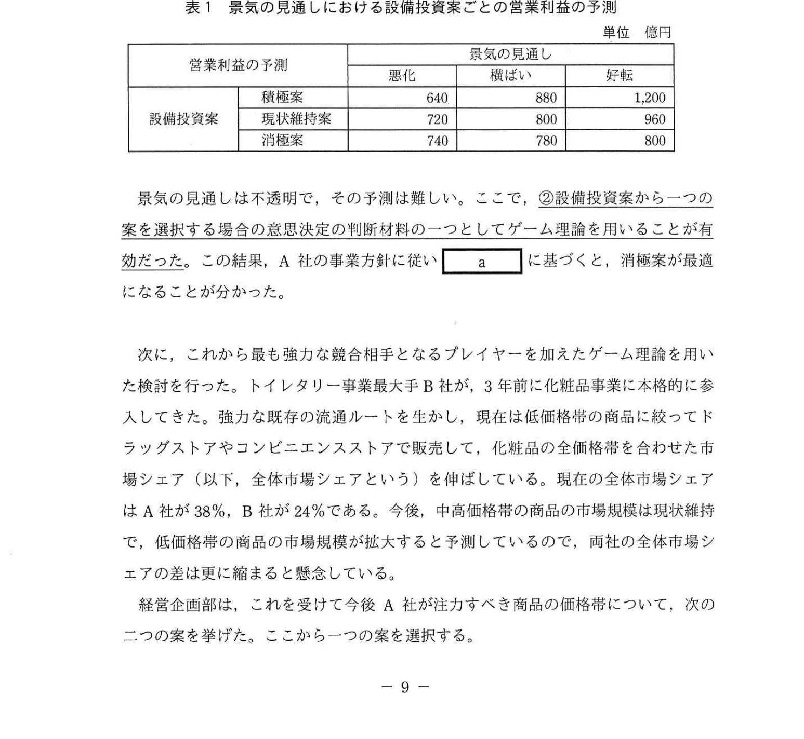
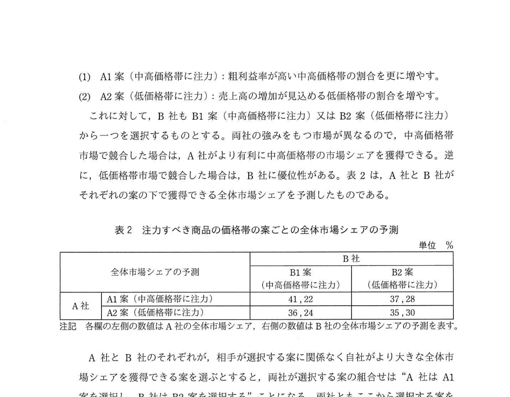

# 2022年春期（令和4年度春期）応用情報技術者試験 午後 問2（選択）
## 経営戦略：化粧品製造販売会社でのゲーム理論を用いた事業戦略の検討

---

## 問題文

**問2** 化粧品製造販売会社でのゲーム理論を用いた事業戦略の検討に関する次の記述を読んで、設問1〜3に答えよ。

A社は、国内大手の化粧品製造販売会社である。国内に八つの工場をもち、自社で企画した商品の製造を行っている。販売チャネルとして、全国の都市に約30の販売子会社と約200の直営店をもち、更に加盟店契約を結んだ約2万の化粧品販売店（以下、加盟店という）がある。卸売会社を通さずに販売子会社から加盟店への流通チャネルを一本化して、販売価格を維持してきた。加盟店から加盟店料を徴収する見返りに、販売棚などの什器の無償貸出やA社の美容販売員の加盟店への派遣などのA社独自の手厚い支援を通じて、共存共栄の関係を築いてきた。化粧品販売では実際に商品を試してから購入したいという顧客ニーズが強く、A社の事業は加盟店の販売網による店舗販売が支えていた。また、各工場に隣接された物流倉庫から各店舗への配送は、外部の運送会社に従量課金制の契約で業務委託している。

A社の主な顧客層は、20〜60代の女性だが、近年は10代の若者層が増えている。取扱商品は、スキンケアを中心にヘアケア、フレグランスなど、幅広く揃えており、粗利益率の高い中高価格帯の商品が売上全体の70%以上を占めている。

---

### 〔A社の事業の状況と課題〕

A社の昨年度の売上高は7,600億円、営業利益は800億円であった。A社は、戦略的な観点から高品質なイメージとブランド力の維持に努め、工場及び直営店を自社で保有し、積極的に広告宣伝及び研究開発を行ってきた。A社では、売上高にかかわらず、これらの設備に係る費用、広告宣伝費及び研究開発費に毎年多額の費用を投入してきたので、総費用に占める固定費の割合が高い状態であった。

A社の過去3年の売上高及び営業利益は微増だったが、今年度は、売上高は横ばい、営業利益は微減の見通しである。A社は、これまで規模の経済を生かして市場シェアを拡大し、売上高を増やすことによって営業利益を増やすという事業戦略を採ってきたが、景気の見通しが不透明であることから、景気が悪化しても安定した営業利益を確保することを今後の経営の事業方針とした。①**これまでの事業戦略は今後の経営の事業方針に適合しない**ので、主に固定費と変動費の割合の観点から費用構造を見直し、これに従った事業戦略の策定に着手した。

---

### 〔ゲーム理論を用いた事業戦略の検討〕

事業戦略の検討を指示された経営企画部は、まず固定費の中で金額が大きい自社の工場への設備投資に着目し、今後の設備投資に関して次の三つの案を挙げた。

(1) 積極案：全8工場の生産能力を拡大し、更に新工場を建設する。
(2) 現状維持案：全8工場の生産能力を現状維持する。
(3) 消極案：主要6工場の生産能力を現状維持し、それ以外の2工場を閉鎖する。

表1は、景気の見通しにおける設備投資案ごとの営業利益の予測である。それぞれの営業利益の予測は、過去の知見から信頼性の高いデータに基づいている。

### 表1 景気の見通しにおける設備投資案ごとの営業利益の予測

> 単位：億円
>
> | 設備投資案 | 悪化 | 横ばい | 好転 |
> |---|---|---|---|
> | 積極案 | 640 | 880 | 1,200 |
> | 現状維持案 | 720 | 800 | 960 |
> | 消極案 | 740 | 780 | 800 |

景気の見通しは不透明で、その予測は難しい。ここで、②**設備投資案から一つの案を選択する場合の意思決定の判断材料の一つとしてゲーム理論を用いることが有効だった**。この結果、A社の事業方針に従い `[　a　]` に基づくと、消極案が最適になることが分かった。

次に、これから最も強力な競合相手となるプレイヤーを加えたゲーム理論を用いた検討を行った。トイレタリー事業最大手B社が、3年前に化粧品事業に本格的に参入してきた。強力な既存の流通ルートを生かし、現在は低価格帯の商品に絞ってドラッグストアやコンビニエンスストアで販売して、化粧品の全価格帯を合わせた市場シェア（以下、全体市場シェアという）を伸ばしている。現在の全体市場シェアは A社が38%、B社が24%である。今後、中高価格帯の商品の市場規模は現状維持で、低価格帯の商品の市場規模が拡大すると予測しているので、両社の全体市場シェアの差は更に縮まると懸念している。

経営企画部は、これを受けて今後A社が注力すべき商品の価格帯について、次の二つの案を挙げた。ここから一つの案を選択する。

- A1案（中高価格帯に注力）：粗利益率が高い中高価格帯の割合を更に増やす。
- A2案（低価格帯に注力）：売上高の増加が見込める低価格帯の割合を増やす。

これに対して、B社もB1案（中高価格帯に注力）又はB2案（低価格帯に注力）から一つを選択するものとする。両社の強みをもつ市場が異なるので、中高価格帯市場で競合した場合は、A社がより有利に中高価格帯の市場シェアを獲得できる。逆に、低価格帯市場で競合した場合は、B社に優位性がある。表2は、A社とB社がそれぞれの案の下で獲得できる全体市場シェアを予測したものである。

### 表2 注力すべき商品の価格帯の案ごとの全体市場シェアの予測

> 単位：%
>
> |  | | B1案（中高価格帯に注力） | B2案（低価格帯に注力） |
> |--|--|----------------------|---------------------|
> | A社 | A1案（中高価格帯に注力） | 41, 22 | 37, 28 |
> | | A2案（低価格帯に注力） | 36, 24 | 35, 30 |

注記：各欄の左側の数値はA社の全体市場シェア、右側の数値はB社の全体市場シェアの予測を表す。

A社とB社のそれぞれが、相手が選択する案に関係なく自社がより大きな全体市場シェアを獲得できる案を選ぶとすると、両社が選択する案の組合せは "A社はA1案を選択し、B社はB2案を選択する" ことになる。両社ともここから選択する案を変更すると全体市場シェアは減ってしまうので、あえて案を変更する理由がない。これをゲーム理論では `[　b　]` の状態と呼び、A社はA1案を選択すべきであるという結果になった。"A1案とB2案" の組合せでのA社の全体市場シェアは37%で、現状よりも減少すると予測されたものの、③**A社の全体の営業利益は増加する可能性が高い**と考えた。

後日、経営企画部は、設備投資及び注力すべき商品の価格帯の検討結果を事業戦略案としてまとめ、経営会議で報告し、その内容についておおむね賛同を得た。一方、設備投資に関して `[　a　]` に基づくと消極案が最適となったことに対し、"景気好転のケースを想定して、顧客チャネルを拡充したらどうか。" という意見が出た。また、注力すべき商品の価格帯に関して中高価格帯を選択することに対し、"更に中高価格帯に注力することには同意するが、低価格帯市場はB社の独壇場になり、将来的に中高価格帯市場までも脅かされるのではないか。" という意見が出た。

---

### 〔事業戦略案の策定〕

経営企画部は、前回の経営会議での意見に従って事業戦略案を策定し、再び経営会議で報告した。

(1) 売上高重視から収益性重視への転換
- 低価格帯中心の商品であるヘアケア分野から撤退する。
- 主要6工場の生産能力は現状維持とし、主にヘアケア商品を生産している2工場を閉鎖する。
- 不採算の直営店を閉鎖し、直営店数を現在の約200から半減させる。

(2) 新たな商品ラインの開発
- 若者層向けのエントリモデルとして低価格帯の商品を拡充する。中高価格帯の商品とは異なるブランドを作り、販売チャネルも変える。具体的には、自社製造ではなく④**OEM メーカに製造を委託**して需要の変動に応じて生産する。また、直営店や加盟店では販売せずに⑤**ドラッグストアやコンビニエンスストアで販売**し、A社の美容販売員の派遣を行わない。

(3) デジタル技術を活用した新たな事業モデルの開発
- インターネットを介した中高価格帯の商品販売などのサービス（以下、ECサービスという）を開始する。2年後のECサービスによる売上高の割合を30%台にすることを目標にする。
- 店舗サービスとECサービスとを連動させて、顧客との接点を増やす顧客統合システムを開発する。

新たな事業モデルにおけるECサービスでは、例えば、顧客が ECサービスを利用して気になる商品があったら、顧客の同意を得て Web 上で希望する加盟店を紹介する。顧客がその加盟店に訪れるのが初めての場合でも、美容販売員は、顧客が ECサービスを利用した際に登録した顧客情報を参照して的確なカウンセリングやアドバイスを行うことができるので、効果的な商品販売が期待できる。⑥**この事業モデルであれば店舗サービスとECサービスとが両立できる**ことを加盟店に理解してもらう。

経営企画部の事業戦略案は承認され、実行計画の策定に着手することになった。

---

## 設問

### 設問1 〔A社の事業の状況と課題〕について、(1)、(2)に答えよ。

**(1)** A社として固定費に分類される費用を解答群の中から選び、記号で答えよ。

**解答群：**
- ア 化粧品の原材料費
- イ 正社員の人件費
- ウ 製造ラインで作業する外注費
- エ 配送を委託する外注費

**(2)** 本文中の下線①のように、これまでの事業戦略が今後の経営の事業方針に適合しないのは、総費用に占める固定費の割合が高い状況が営業利益にどのような影響を及ぼすか。30字以内で述べよ。

### 設問2 〔ゲーム理論を用いた事業戦略の検討〕について、(1)〜(3)に答えよ。

**(1)** 本文中の下線②について、設備投資案の選択にゲーム理論を用いることが有効だったが、それは表1中の景気の見通し及び営業利益の予測がそれぞれどのような状態で与えられていたからか。30字以内で述べよ。

**(2)** 本文中の `[　a　]`、`[　b　]` に入れる適切な字句を解答群の中から選び、記号で答えよ。

**解答群：**
- ア 混合戦略
- イ ナッシュ均衡
- ウ パレート最適
- エ マクシマックス原理
- オ マクシミン原理

**(3)** 本文中の下線③のように考えた理由を25字以内で述べよ。

### 設問3 〔事業戦略案の策定〕について、(1)、(2)に答えよ。

**(1)** 本文中の下線④及び下線⑤の施策について、固定費と変動費の割合の観点から費用構造の変化に関する共通点を15字以内で答えよ。

**(2)** 本文中の下線⑥について、A社の経営企画部が新たな事業モデルにおいて店舗サービスとECサービスとが両立できると判断した化粧品販売の特性を、本文中の字句を用いて25字以内で述べよ。

---

## 解答と解説

### 設問1

**(1) 正解：イ（正社員の人件費）**

固定費 = 売上高に関係なく一定額が発生する費用。正社員の人件費は売上に関わらず毎月固定で発生する。ア（原材料費）・ウ（外注製造費）・エ（配送外注費）は売上・生産量に応じて変動する変動費。

**IPA公式：イ**

**(2) 正解：売上高の増減に対して営業利益の増減幅が大きくなる。（27字）**

固定費割合が高いと、損益分岐点が高くなり、売上が減少した場合に営業利益が急激に悪化する（営業レバレッジが高い）。景気悪化で売上が落ちると、大きな損失が発生するリスクがある。

---

### 設問2

**(1) 正解：景気の見通しの予測は難しいが営業利益は予測できる。（25字）**

ゲーム理論は「相手の行動が不確実な状況」での意思決定に有効。景気の見通しは予測困難だが、各景気シナリオ下での営業利益は表1のとおり予測できる。このような不確実性がある意思決定に有効。

**(2) 正解：a = オ（マクシミン原理）、b = イ（ナッシュ均衡）**

- **a = オ（マクシミン原理）**：景気が悪化しても安定した営業利益を確保するという方針に基づき、各案の最悪値（景気悪化時）を比較して最大のものを選ぶ。表1より景気悪化時の営業利益は積極案640・現状維持案720・消極案740であり、最大の**消極案（740）**が選ばれる＝マクシミン原理。

- **b = イ（ナッシュ均衡）**：一方が戦略を変えても利益が増えない均衡状態。A1案・B2案の組み合わせでは、どちらも戦略変更の動機がない。

**IPA公式：a = オ（マクシミン原理）、b = イ（ナッシュ均衡）**

**(3) 正解：中高価格帯の商品は粗利益率が高いから。（21字）**

A1案（中高価格帯注力）を選択した場合、市場シェアがA1案でのシェア（37%→41%方向）に留まっても、粗利益率の高い中高価格帯の販売増加により営業利益が増加する可能性がある。

---

### 設問3

**(1) 正解：固定費の割合の減少（9字）**

- OEM委託（⑤）：自社工場での生産を委託することで、工場固定費（設備投資・人件費）を削減し、変動費化できる。
- ドラッグストア・コンビニ（⑥）：自社直営店・加盟店網の維持コスト（固定費）を削減し、流通コストを変動費化できる。
→ 両者の共通点：**固定費の割合が減少する**。

**(2) 正解：顧客は実際に商品を試してから購入したい。（22字）**

化粧品は実際に試してみてから購入する特性（体験・カウンセリングの重要性）があるため、店舗サービス（試用・カウンセリング）とECサービス（事前情報収集・購入）を組み合わせたモデルが成立する。

---

## 参考：主要キーワード

| 用語 | 説明 |
|------|------|
| ゲーム理論 | 複数のプレイヤーが戦略的に行動する状況の数学的分析手法 |
| マクシミン原理 | 各選択肢の最悪結果の中で最良のものを選ぶ意思決定基準（リスク回避型） |
| マクシマックス原理 | 各選択肢の最良結果の中で最良のものを選ぶ意思決定基準（楽観型） |
| ナッシュ均衡 | どのプレイヤーも単独では戦略を変えることで利益を増やせない均衡状態 |
| 固定費 | 売上高・生産量に関係なく一定額発生する費用（人件費・設備減価償却等） |
| 変動費 | 売上高・生産量に比例して変動する費用（原材料費・外注費等） |
| 営業レバレッジ | 固定費割合が高いほど売上変動が営業利益に大きく影響すること |
| OEM（Original Equipment Manufacturing） | 他社ブランドの製品を受託製造すること。委託側は固定費を削減できる |
| 損益分岐点 | 売上高＝費用（固定費＋変動費）となる売上高。固定費が高いほど高くなる |
