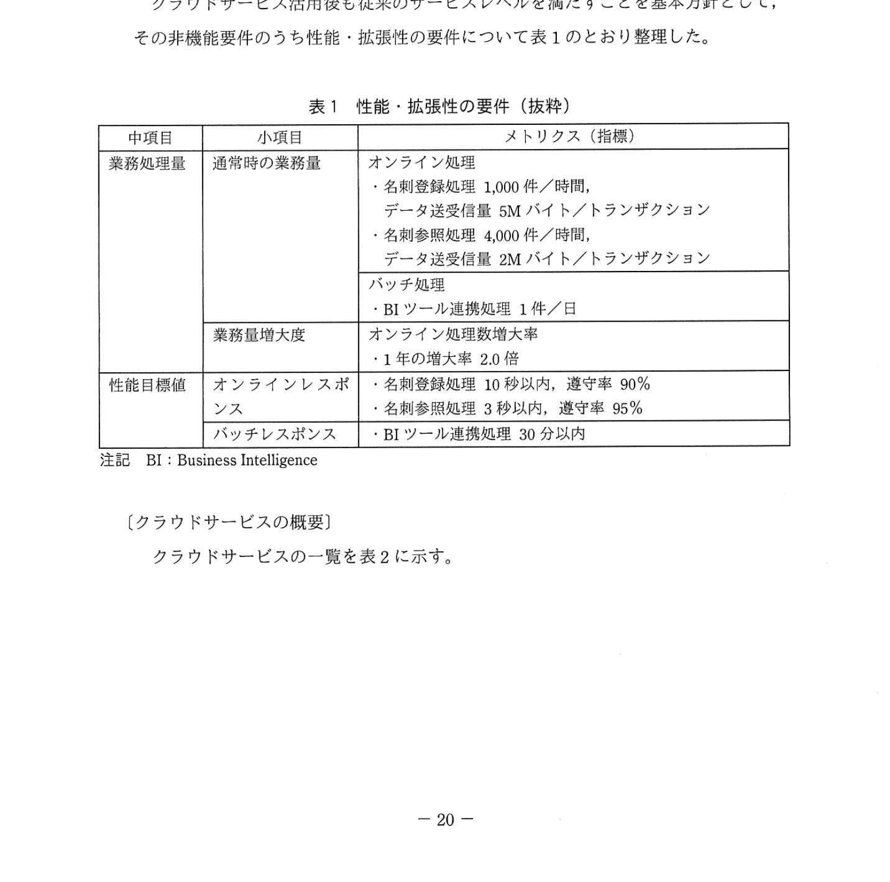
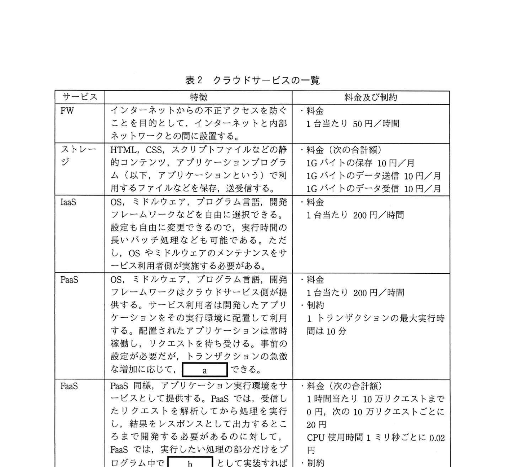
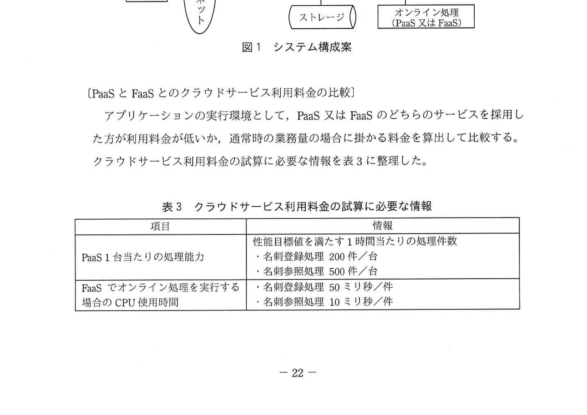
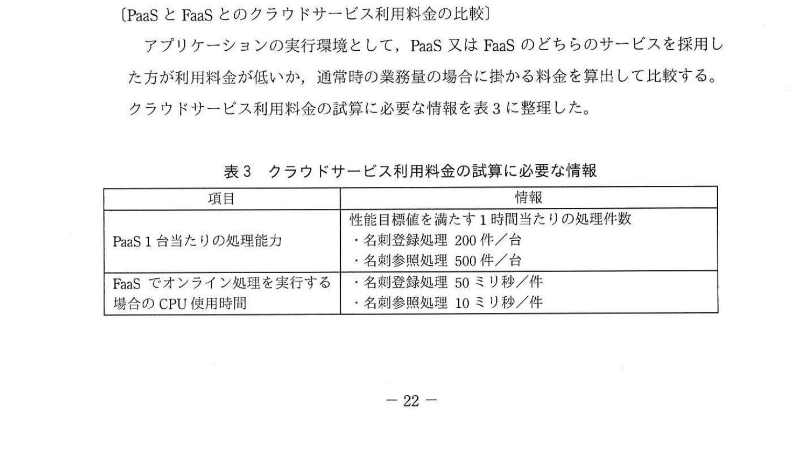

# 2022年春期（令和4年度春期）応用情報技術者試験 午後 問4（選択）
## システムアーキテクチャ：クラウドサービスの活用（名刺管理サービス・PaaS/FaaS/CDN）

---

## 問題文

**問4** クラウドサービスの活用に関する次の記述を読んで、設問1〜4に答えよ。

J社は、自社のデータセンタからインターネットを介して名刺管理サービスを提供している。このたび、運用コストの削減を目的として、クラウドサービスの活用を検討することにした。

---

### 〔非機能要件の確認〕

クラウドサービス活用後も従来のサービスレベルを満たすことを基本方針として、その非機能要件のうち性能・拡張性の要件について表1のとおり整理した。

### 表1 性能・拡張性の要件（抜粋）

> | 中項目 | 小項目 | メトリクス（指標） |
> |--------|--------|-----------------|
> | 業務処理量 | 通常時の業務量 | オンライン処理：名刺登録処理 1,000件/時、データ送受信量 5Mバイト/トランザクション／名刺参照処理 4,000件/時、データ送受信量 2Mバイト/トランザクション。バッチ処理：BIツール連携処理 1件/日 |
> | | 業務量増大度 | オンライン処理数増大率：1年の増大率 2.0倍 |
> | 性能目標値 | オンラインレスポンス | 名刺登録処理 10秒以内、遵守率90%。名刺参照処理 3秒以内、遵守率95% |
> | | バッチレスポンス | BIツール連携処理 30分以内 |
>
> 注記 BI：Business Intelligence

---

### 〔クラウドサービスの概要〕

クラウドサービスの一覧を表2に示す。

### 表2 クラウドサービスの一覧

> | サービス | 特徴 | 料金及び制約 |
> |---------|------|------------|
> | FW | インターネットからの不正アクセスを防ぐことを目的として、インターネットと内部ネットワークとの間に設置する。 | 料金：1台当たり 50円/時間 |
> | ストレージ | HTML、CSS、スクリプトファイルなどの静的コンテンツ、アプリケーションプログラム（以下、アプリケーションという）で利用するファイルなどを保存、送受信する。 | 料金（次の合計額）：1Gバイトの保存 10円/月、1Gバイトのデータ送信 10円/月、1Gバイトのデータ受信 10円/月 |
> | IaaS | OS、ミドルウェア、プログラム言語、開発フレームワークなどを自由に選択できる。設定も自由に変更できるので、実行時間の長いバッチ処理なども可能である。ただし、OSやミドルウェアのメンテナンスをサービス利用者側が実施する必要がある。 | 料金：1台当たり 200円/時間 |
> | PaaS | OS、ミドルウェア、プログラム言語、開発フレームワークはクラウドサービス側が提供する。サービス利用者は開発したアプリケーションをその実行環境に配置して利用する。配置されたアプリケーションは常時稼働し、リクエストを待ち受ける。事前の設定が必要だが、トランザクションの急激な増加に応じて、 `[　a　]` できる。 | 料金：1台当たり 200円/時間。制約：1トランザクションの最大実行時間は 10分 |
> | FaaS | PaaS 同様、アプリケーション実行環境をサービスとして提供する。PaaSでは、受信したリクエストを解析してから処理を実行し、結果をレスポンスとして出力するところまで開発する必要があるのに対して、FaaSでは、実行したい処理の部分だけをプログラム中で `[　b　]` として実装すればよい。また、 `[　a　]` は事前の設定が不要である。 | 料金（次の合計額）：1時間当たり10万リクエストまで 0円、次の10万リクエストごとに 20円、CPU使用時間 1ミリ秒ごとに 0.02円。制約：1トランザクションの最大実行時間は 10分。20分間一度も実行されない場合、応答が10秒以上掛かる場合がある。 |
> | CDN | ストレージ、IaaS、PaaS又はFaaSからのコンテンツをインターネットに配信する。ストレージからの静的コンテンツは、一度読み込むと、更新されるまで `[　c　]` して再利用される。 | 料金（次の合計額）：1万リクエストまで 0円、次の1万リクエストごとに 10円、1Gバイトのデータ送信 20円/月 |
>
> 注記 FW：ファイアウォール、CDN：Content Delivery Network

---

### 〔システム構成の検討〕

現在運用中のサービスは、OS やミドルウェアが PaaS や FaaS の実行環境のものよりも1世代古いバージョンである。アプリケーションに改変を加えずに、そのままの OS やミドルウェアを利用する場合、利用するクラウドサービスは IaaS となる。

しかし、①**運用コストを抑えるためにオンライン処理はPaaS又はFaaSを利用する**ことを検討する。PaaS又はFaaSでのアプリケーションは、WebAPIとして実装する。その WebAPI は、ストレージに保存されたスクリプトファイルが `[　d　]` とFWを介してWebブラウザへ配信され、実行されて呼び出される。

バッチ処理については、登録データ量が増加した場合、②**PaaSやFaaSを利用することには問題がある**ことから、IaaS を利用することにした。

検討したシステム構成案を図1に示す。

### 図1 システム構成案

> Web ブラウザ → インターネット → FW → 内部ネットワーク
> 内部ネットワークに接続：FW、CDN、ストレージ、オンライン処理（PaaS又はFaaS）、バッチ処理（IaaS）
> - CDN はストレージに接続

---

### 〔PaaSとFaaSのクラウドサービス利用料金の比較〕

アプリケーションの実行環境として、PaaS 又は FaaS のどちらのサービスを採用した方が利用料金が低いか、通常時の業務量の場合に掛かる料金を算出して比較する。クラウドサービス利用料金の試算に必要な情報を表3に整理した。

### 表3 クラウドサービス利用料金の試算に必要な情報

> | 項目 | 情報 |
> |------|------|
> | PaaS 1台当たりの処理能力 | 性能目標値を満たす1時間当たりの処理件数：名刺登録処理 200件/台、名刺参照処理 500件/台 |
> | FaaSでオンライン処理を実行する場合のCPU使用時間 | 名刺登録処理 50ミリ秒/件、名刺参照処理 10ミリ秒/件 |

PaaS の場合、通常時の業務量から、オンライン処理で必要な最小必要台数を求めると、名刺登録処理では5台、名刺参照処理では `[　e　]` 台となる。したがって、1時間当たりの費用は `[　f　]` 円と試算できる。

FaaS の場合、通常時の業務量から1時間当たりのリクエスト数と CPU 使用時間を求め、1時間当たりの費用を試算すると、その費用は `[　g　]` 円となる。

試算結果を比較した結果、FaaS を採用した。

---

### 〔オンラインレスポンスの課題と対策〕

クラウドサービスを活用したシステムの運用が始まるとすぐに、早朝や深夜にシステムを利用した際、はじめの画面は表示されるが名刺登録や名刺参照を実行すると、データが表示されるまでに10秒以上の時間を要することがある、との課題が報告された。クラウドサービスで提供されている各サービスのログを確認したところ、 `[　h　]` の制約が原因であることが判明した。そこで、採用したクラウドサービスを別のものには変更せずに、③**ある回避策を施した**ことで、課題を解消することができた。

---

## 設問

### 設問1 表2中の `[　a　]` 〜 `[　c　]` に入れる適切な字句を答えよ。

### 設問2 〔システム構成の検討〕について、(1)〜(3)に答えよ。

**(1)** 本文中の下線①について、IaaS と比較して運用コストを抑えられるのはなぜか。40字以内で述べよ。

**(2)** 本文中の `[　d　]` に入れる適切な字句を、表2中のサービスの中から答えよ。

**(3)** 本文中の下線②にある問題とは何か。30字以内で述べよ。

### 設問3 本文中の `[　e　]` 〜 `[　g　]` に入れる適切な数値を答えよ。

### 設問4 〔オンラインレスポンスの課題と対策〕について、(1)、(2)に答えよ。

**(1)** 本文中の `[　h　]` に入れる適切な字句を、表2中のサービスの中から答えよ。

**(2)** 本文中の下線③の回避策とは何か。40字以内で述べよ。

---

## 解答と解説

### 設問1 正解：a = スケールアウト、b = 関数、c = キャッシュ

- **a = スケールアウト**：FaaSはリクエスト増加に応じて自動的にスケールアウト（インスタンス数を増やすことで処理能力を拡張）する。事前のサーバ台数設定が不要。
- **b = 関数**：FaaSは「Function as a Service」の略。実行したい処理を「関数」の形でアップロードし、リクエスト受信時に実行する。
- **c = キャッシュ**：CDN はコンテンツを一度取得した後、変更されるまでキャッシュ（一時保存）して配信する。

**IPA公式：a=スケールアウト、b=関数、c=キャッシュ**

---

### 設問2

**(1) 正解：PaaSやFaaSでは、OSやミドルウェアのメンテナンスが不要だから。（33字）**

IaaS では OS・ミドルウェアの管理・パッチ適用などの運用作業を利用者が行う必要がある。PaaS・FaaS では、プロバイダが OS・ミドルウェアを管理するため、その運用コストが削減できる。

**IPA公式：PaaSやFaaSでは、OSやミドルウェアのメンテナンスが不要だから**

**(2) 正解：d = CDN**

WebAPI の WebブラウザからのアクセスでFW経由でスクリプトファイルを読み込む際に使用するサービス。CDNはコンテンツを広く配信するサービスであり、ストレージのスクリプトファイルを CDN 経由で配信する。

**IPA公式：d = CDN**

**(3) 正解：バッチ実行時間が上限の10分を超えてしまう問題。（24字）**

表2の PaaS・FaaS の制約として「1トランザクションの最大実行時間 10分」がある。BIツール連携処理（バッチ）の要件は「30分以内」であり、10分の制限を超える可能性があり制約に違反する。

**IPA公式：バッチ実行時間が上限の10分を超えてしまう問題**

---

### 設問3

**e = 8（台）**

名刺参照処理：通常時の業務量は4,000件/時。PaaS 1台の名刺参照処理能力は500件/台。必要台数 = 4,000 ÷ 500 = **8台**

**f = 2,600（円）**

PaaS 必要台数＝名刺登録5台＋名刺参照8台＝13台。1時間当たりの費用 = 13台 × 200円/時間 = **2,600円**（FWは含めない）。

**g = 1,800（円）**

FaaSの1時間のリクエスト数と CPU 使用時間：
- リクエスト数 = 1,000 + 4,000 = 5,000件/時 → 10万リクエストまで0円なので**0円**
- CPU使用時間 = 名刺登録1,000件×50ms + 名刺参照4,000件×10ms = 50,000 + 40,000 = 90,000ms
- CPU料金 = 90,000ms × 0.02円/ms = **1,800円**
- 合計 = 0 + 1,800 = **1,800円**

**IPA公式：e=8、f=2,600、g=1,800**

---

### 設問4

**(1) 正解：h = FaaS**

早朝・深夜の利用時に処理が遅くなる（10秒以上）のは、FaaS の「コールドスタート問題」が原因。FaaS インスタンスが一定時間利用されないと停止し、次のリクエスト時に起動に時間がかかる。

**IPA公式：h = FaaS**

**(2) 正解：20分未満の間隔でFaaS上のアプリケーションを定期的に呼び出す。（32字）**

FaaS は利用されない時間が続くとインスタンスが停止する（コールドスタート）。20分未満の間隔で定期的に FaaS を呼び出すことで、インスタンスを常にウォーム状態に保ち、コールドスタートを防ぐ。

**IPA公式：20分未満の間隔でFaaS上のアプリケーションを定期的に呼び出す**

---

## 参考：主要キーワード

| 用語 | 説明 |
|------|------|
| IaaS（Infrastructure as a Service） | サーバ・ネットワーク等のインフラをサービス提供。OSの管理は利用者が行う |
| PaaS（Platform as a Service） | アプリ実行環境（OS・MW含む）を提供。アプリのデプロイに集中できる |
| FaaS（Function as a Service） | 関数単位でコードを実行。イベント駆動型で自動スケール・従量課金 |
| CDN（Content Delivery Network） | 静的コンテンツをキャッシュして地理的に分散配信するサービス |
| コールドスタート | FaaSインスタンスが非稼働状態から起動する際に発生する遅延 |
| スケールアウト | サーバ台数を増やして処理能力を拡張する方法 |
| BI（Business Intelligence） | データ分析・可視化ツール。大量データ処理はバッチ向き |
| キャッシュ | コンテンツを一時保存して配信速度を高める技術 |
