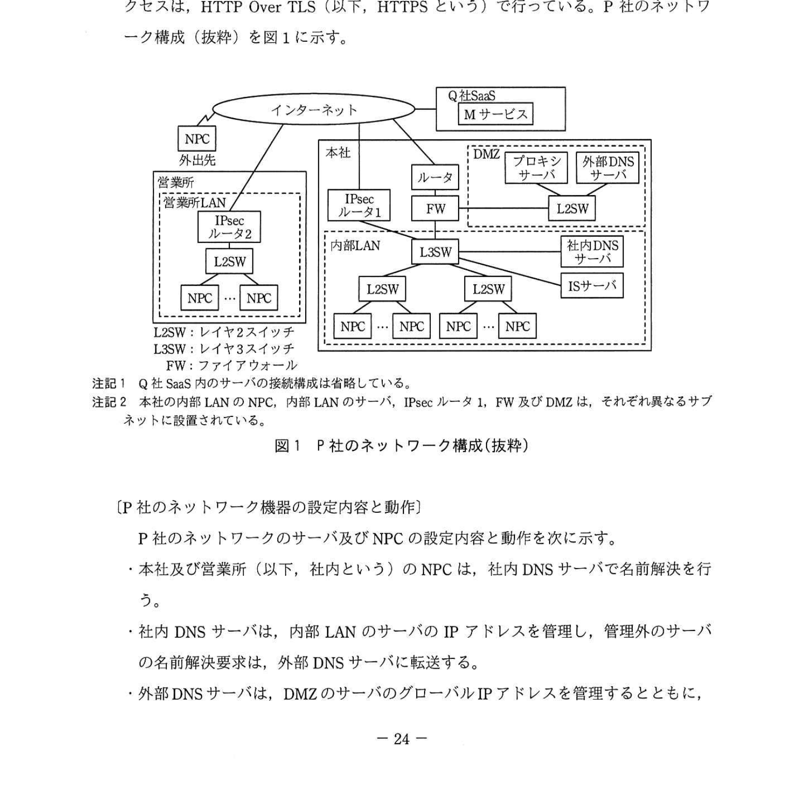
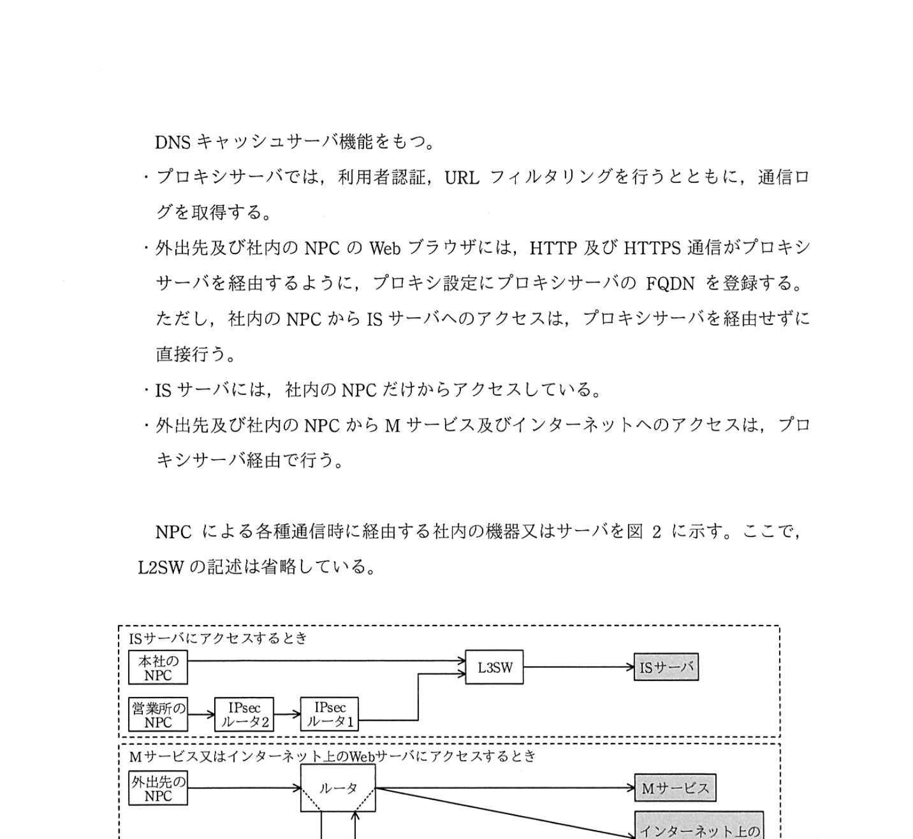
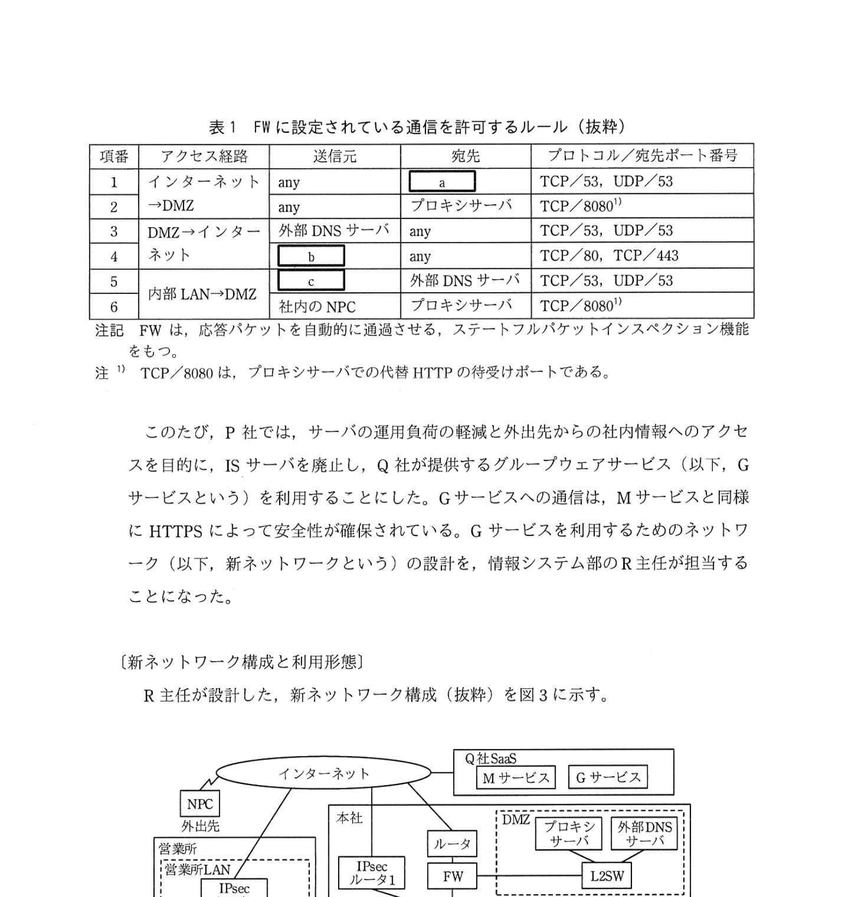
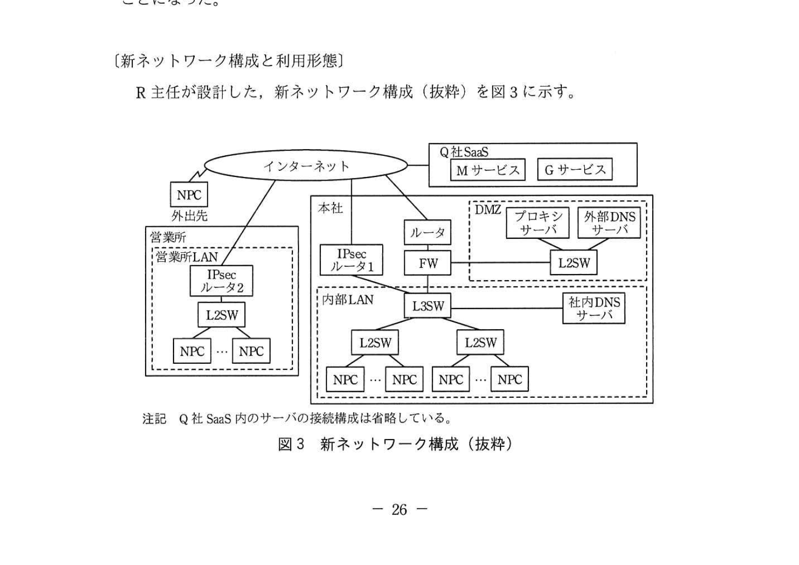
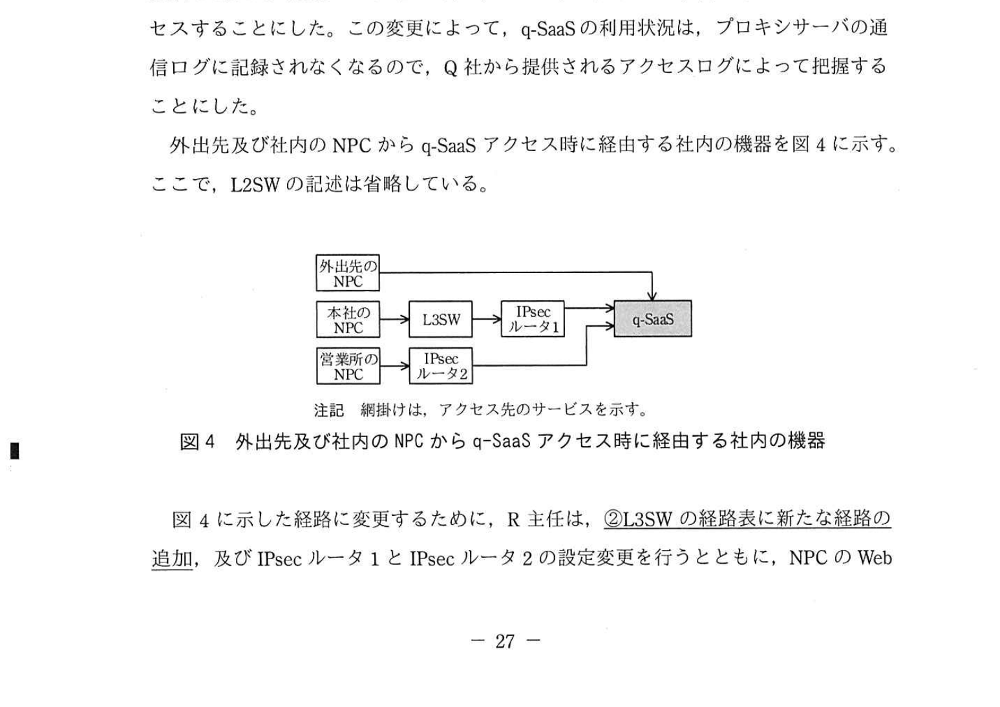
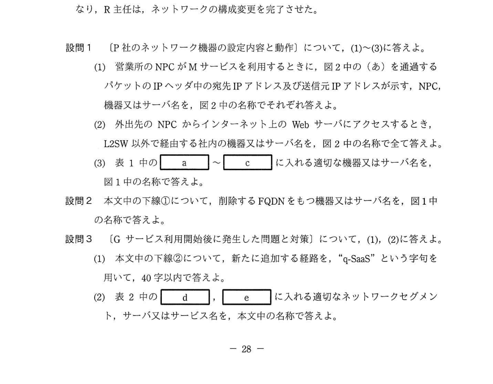

# 2022年春期（令和4年度春期）応用情報技術者試験 午後 問5（選択）
## ネットワーク：ネットワークの構成変更（IPsec VPN・プロキシ・q-SaaS）

---

## 問題文

**問5** ネットワークの構成変更に関する次の記述を読んで、設問1〜3に答えよ。

P社は、本社と営業所をもつ中堅商社である。P社では、本社と営業所の間を、IPsec ルータを利用してインターネット VPN で接続している。本社では、情報共有のためのサーバ（以下、ISサーバという）を運用している。電子メールの送受信には、SaaS事業者のQ社が提供する電子メールサービス（以下、Mサービスという）を利用している。ノートPC（以下、NPCという）からISサーバ及びMサービスへのアクセスは、HTTP Over TLS（以下、HTTPSという）で行っている。P社のネットワーク構成（抜粋）を図1に示す。

### 図1 P社のネットワーク構成（抜粋）

---

### 〔P社のネットワーク機器の設定内容と動作〕

P社のネットワークのサーバ及び NPC の設定内容と動作を次に示す。

- 本社及び営業所（以下、社内という）の NPC は、社内 DNS サーバで名前解決を行う。
- 社内 DNS サーバは、内部 LAN のサーバの IP アドレスを管理し、管理外のサーバの名前解決要求は、外部 DNS サーバに転送する。
- 外部 DNS サーバは、DMZ のサーバのグローバル IP アドレスを管理するとともに、DNS キャッシュサーバ機能をもつ。
- プロキシサーバでは、利用者認証、URL フィルタリングを行うとともに、通信ログを取得する。
- 外出先及び社内の NPC の Web ブラウザは、HTTP 及び HTTPS 通信がプロキシサーバを経由するように、プロキシ設定にプロキシサーバの FQDN を登録する。ただし、社内の NPC から IS サーバへのアクセスは、プロキシサーバを経由せずに直接行う。
- IS サーバは、社内の NPC だけからアクセスしている。
- 外出先及び社内の NPC から M サービス及びインターネットへのアクセスは、プロキシサーバ経由で行う。

NPC による各種通信時に経由する社内の機器又はサーバを図2に示す。ここで、L2SW の記述は省略している。

### 図2 NPCによる各種通信時に経由する社内の機器又はサーバ

FW に設定されている通信を許可するルール（抜粋）を表1に示す。

### 表1 FWに設定されている通信を許可するルール（抜粋）

> | 項番 | アクセス経路 | 送信元 | 宛先 | プロトコル/宛先ポート番号 |
> |------|------------|--------|------|------------------------|
> | 1 | インターネット→DMZ | any | `[　a　]` | TCP/53, UDP/53 |
> | 2 | （インターネット→DMZ） | any | プロキシサーバ | TCP/8080 (注1) |
> | 3 | DMZ→インターネット | 外部 DNSサーバ | any | TCP/53, UDP/53 |
> | 4 | （DMZ→インターネット） | `[　b　]` | any | TCP/80, TCP/443 |
> | 5 | 内部 LAN→DMZ | `[　c　]` | 外部 DNS サーバ | TCP/53, UDP/53 |
> | 6 | （内部 LAN→DMZ） | 社内の NPC | プロキシサーバ | TCP/8080 (注1) |
>
> 注記 FWは、応答パケットを自動的に通過させる、ステートフルパケットインスペクション機能をもつ。  
> 注1 TCP/8080は、プロキシサーバでの代替 HTTP の待受けポートである。

このたび、P社では、サーバの運用負荷の軽減と外出先からの社内情報へのアクセスを目的に、IS サーバを廃止し、Q社が提供するグループウェアサービス（以下、Gサービスという）を利用することにした。Gサービスへの通信は、Mサービスと同様にHTTPSによって安全性が確保されている。Gサービスを利用するためのネットワーク（以下、新ネットワークという）の設計を、情報システム部のR主任が担当することになった。

---

### 〔新ネットワーク構成と利用形態〕

R主任が設計した、新ネットワーク構成（抜粋）を図3に示す。

### 図3 新ネットワーク構成（抜粋）

新ネットワークでは、サービスとインターネットの利用状況を管理するために、外出先及び社内の NPC から M サービス、G サービス及びインターネットへのアクセスは、プロキシサーバ経由で行うことにした。

R主任は、IS サーバの廃止に伴って不要になる次の設定情報を削除した。

- ①**NPC の Web ブラウザの、プロキシ例外設定に登録されているFQDN**
- 社内 DNS サーバのリソースレコード中の、IS サーバの A レコード

---

### 〔Gサービス利用開始後に発生した問題と対策〕

G サービス利用開始後、インターネットを経由する通信の応答速度が、時間帯によって低下するという問題が発生した。FWのログの調査によって、FWが管理するセッション情報が大量になったことによる、FWの負荷増大が原因であることが判明した。そこで、FWを通過する通信量を削減するために、Mサービス及びGサービス（以下、二つのサービスを合わせて q-SaaS という）には、プロキシサーバを経由せず、外出先の NPC はHTTPS でアクセスし、本社の NPC はIPsec ルータ1から、営業所の NPC はIPsec ルータ2から、インターネットVPNを経由せずHTTPSでアクセスすることにした。この変更によって、q-SaaSの利用状況は、プロキシサーバの通信ログに記録されなくなるので、Q社から提供されるアクセスログによって把握することにした。

外出先及び社内の NPC から q-SaaS アクセス時に経由する社内の機器を図4に示す。ここで、L2SW の記述は省略している。

### 図4 外出先及び社内のNPCからq-SaaSアクセス時に経由する社内の機器

図4に示した経路に変更するために、R主任は、②**L3SW の経路表に新たな経路の追加**、及び IPsec ルータ1と IPsec ルータ2の設定変更を行うとともに、NPC の Web ブラウザでは、q-SaaS 利用時にプロキシサーバを経由しないよう、プロキシ例外設定に、Mサービス及びGサービスの FQDN を登録した。

設定変更後の IPsec ルータ1の処理内容（抜粋）を表2に示す。IPsec ルータ1は、受信したパケットと表2中の照合する情報とを比較し、パケット転送時に一致した項番の処理を行う。

### 表2 設定変更後のIPsecルータ1の処理内容（抜粋）

> | 項番 | 照合する情報 | | プロトコル | 処理 |
> |------|------------|--|-----------|------|
> | | 送信元 | 宛先 | | |
> | 1 | 内部 LAN | `[　d　]` | HTTPS | NAPT後にインターネットに転送 |
> | 2 | 内部 LAN | `[　e　]` | any | インターネットVPN に転送 |

IPsec ルータ2もIPsec ルータ1と同様の設定変更を行う。この追加設定と設定変更によってFWの負荷が軽減し、インターネット利用時の応答速度の低下がなくなり、R主任は、ネットワークの構成変更を完了させた。

---

## 設問

### 設問1 〔P社のネットワーク機器の設定内容と動作〕について、(1)〜(3)に答えよ。

**(1)** 営業所の NPC が M サービスを利用するときに、図2中の（あ）を通過するパケットの IP ヘッダ中の宛先 IP アドレス及び送信元 IP アドレスが示す、NPC、機器又はサーバ名を、図2中の名称でそれぞれ答えよ。

**(2)** 外出先の NPC からインターネット上のWebサーバにアクセスするとき、L2SW 以外で経由する社内の機器又はサーバ名を、図2中の名称で全て答えよ。

**(3)** 表1中の `[　a　]` 〜 `[　c　]` に入れる適切な機器又はサーバ名を、図1中の名称で答えよ。

### 設問2 本文中の下線①について、削除するFQDNをもつ機器又はサーバ名を、図1中の名称で答えよ。

### 設問3 〔Gサービス利用開始後に発生した問題と対策〕について、(1)、(2)に答えよ。

**(1)** 本文中の下線②について、新たに追加する経路は "q-SaaS" という字句を用いて、40字以内で述べよ。

**(2)** 表2中の `[　d　]`、`[　e　]` に入れる適切なネットワークセグメントを、サーバ又はサービス名を、本文中の名称で答えよ。

---

## 解答と解説

### 設問1

**(1)** （あ）はFW→プロキシサーバ間の矢印。営業所のNPCがMサービスを利用するときの、（あ）を通過するパケットのIPヘッダが示すもの：
- **宛先 IP アドレスが示すもの**：プロキシサーバ（プロキシ宛のリクエスト）
- **送信元 IP アドレスが示すもの**：営業所のNPC（IPsec VPNで転送されてもIPヘッダは変わらない）

**IPA公式：宛先=プロキシサーバ、送信元=営業所のNPC**

**(2)** 外出先NPCがインターネットWebサーバへアクセスするときにL2SW以外で経由する社内の機器・サーバ（全て）：  
**ルータ、FW、プロキシサーバ**

外出先NPC→（インターネット）→ルータ→FW→プロキシサーバ→FW→ルータ→（インターネット）→Webサーバ、の経路をたどる。

**IPA公式：ルータ、FW、プロキシサーバ**

**(3)** 表1中の空欄a〜cに入れる機器・サーバ名（図1中の名称）：
- **a = 外部DNSサーバ**：インターネットからDMZへの名前解決（TCP/53, UDP/53）を受ける。
- **b = プロキシサーバ**：DMZからインターネットへHTTP/HTTPS（TCP/80, TCP/443）でアクセスする。
- **c = 社内DNSサーバ**：内部LANからDMZの外部DNSサーバへ、管理外の名前解決要求を転送する。

**IPA公式：a=外部DNSサーバ、b=プロキシサーバ、c=社内DNSサーバ**

---

### 設問2（削除するFQDNをもつ機器）

**IS サーバ**

プロキシ設定の例外（直接アクセス）に登録されていた IS サーバの FQDN を、IS サーバ廃止に伴い削除する。

---

### 設問3

**(1) 正解：q-SaaS宛ての通信のネクストホップがIPsecルータ1となる経路（32字）**

下線②「L3SWの経路表に新たな経路の追加」の内容：q-SaaS宛のパケットのネクストホップをIPsecルータ1とする経路を、L3SWの経路表に追加する。

**IPA公式：q-SaaS宛ての通信のネクストホップがIPsecルータ1となる経路**

**(2) 正解：d = q-SaaS、e = 営業所LAN**

- **d = q-SaaS**：q-SaaS宛のパケットは対象。
- **e = 営業所LAN**：営業所LAN宛のパケットはインターネットVPN（IPsec）で転送する。

**IPA公式：d=q-SaaS、e=営業所LAN**

---

## 参考：主要キーワード

| 用語 | 説明 |
|------|------|
| IPsec VPN | IPsecプロトコルを使用してインターネット経由で安全な通信を行うVPN |
| プロキシサーバ | クライアントに代わってWebサーバにアクセスする中継サーバ。URLフィルタリング・ログ収集機能をもつ |
| FQDN（Fully Qualified Domain Name） | ホスト名を含む完全修飾ドメイン名 |
| ステートフルパケットインスペクション | セッション状態を追跡してパケットを検査するFW機能。応答パケットを自動許可 |
| NAPT（Network Address Port Translation） | 1つのグローバルIPとポート番号で複数の内部IPを変換する技術 |
| DMZ（DeMilitarized Zone） | インターネットと内部LANの中間に置くセキュリティゾーン |
| プロキシ例外設定 | プロキシサーバを経由せずに直接アクセスするFQDN・IPを登録する設定 |
| SaaS（Software as a Service） | ソフトウェアをインターネット経由でサービスとして提供する形態 |
| q-SaaS | M サービス（メール）と G サービス（グループウェア）を合わせた呼称 |
