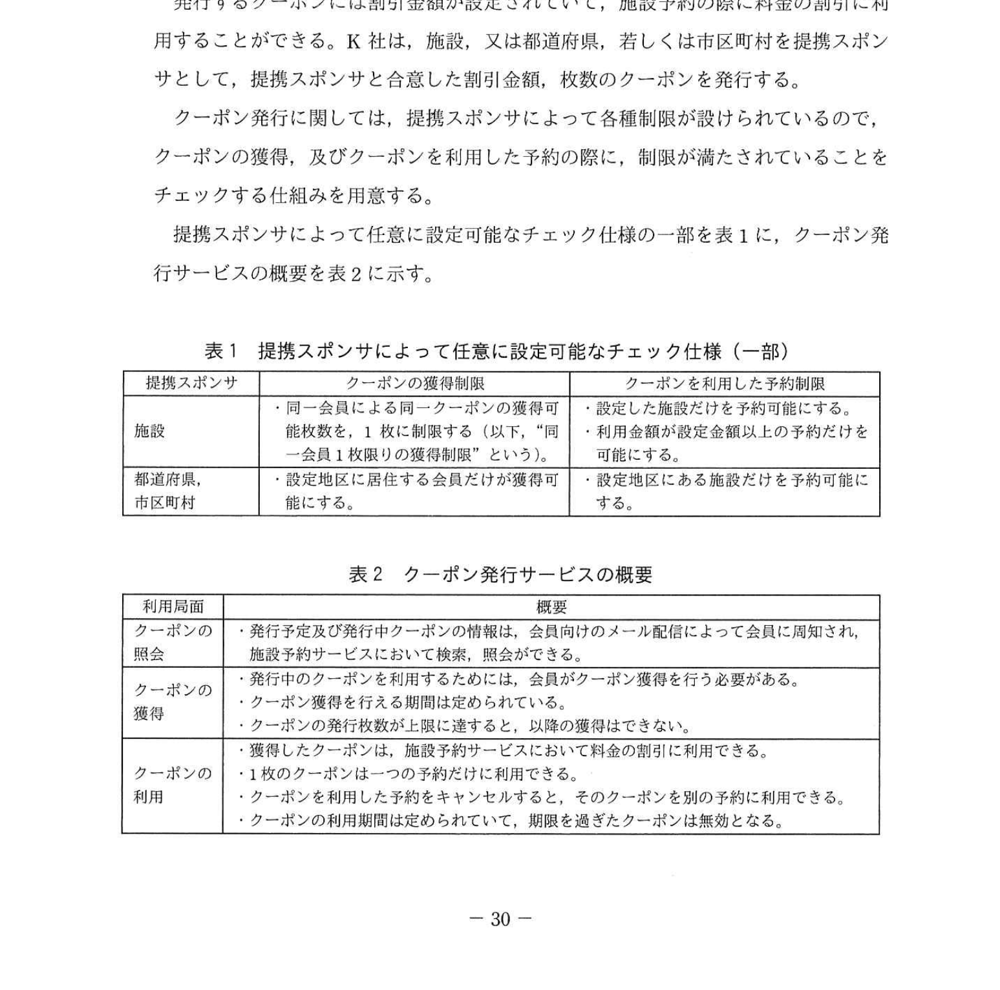
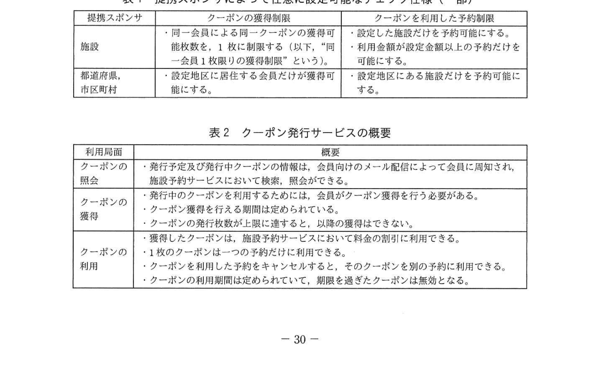
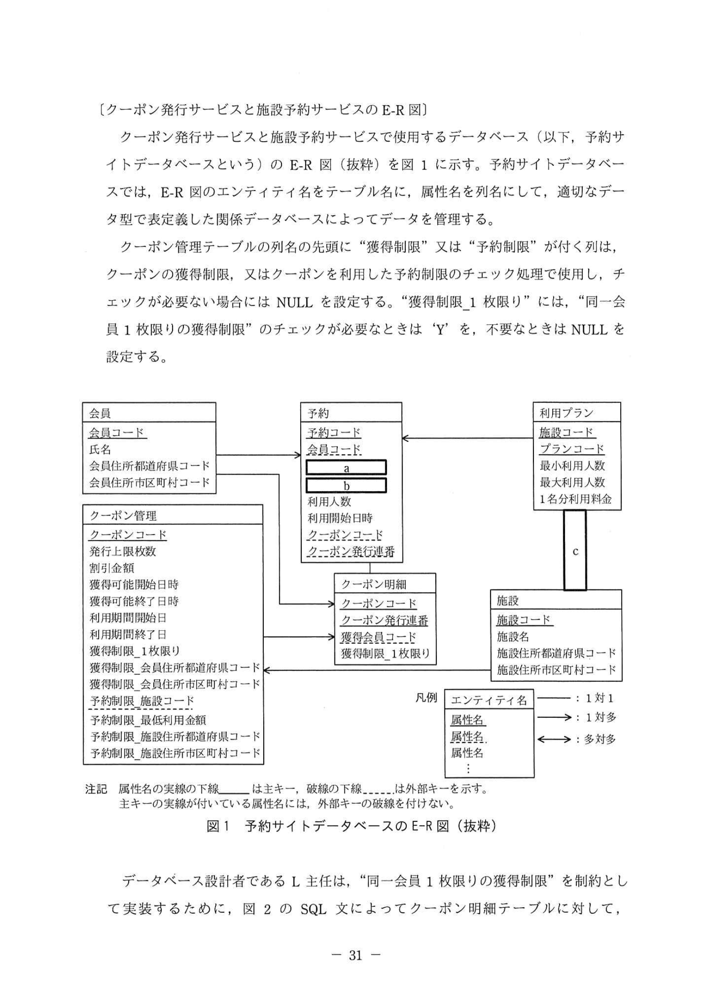
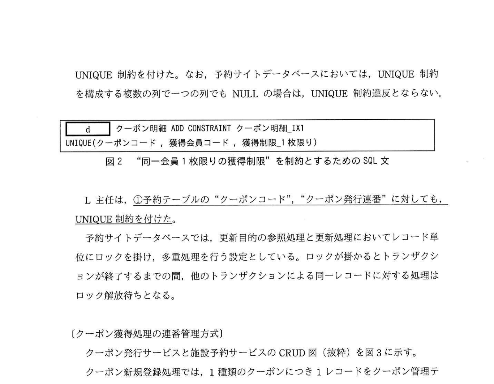
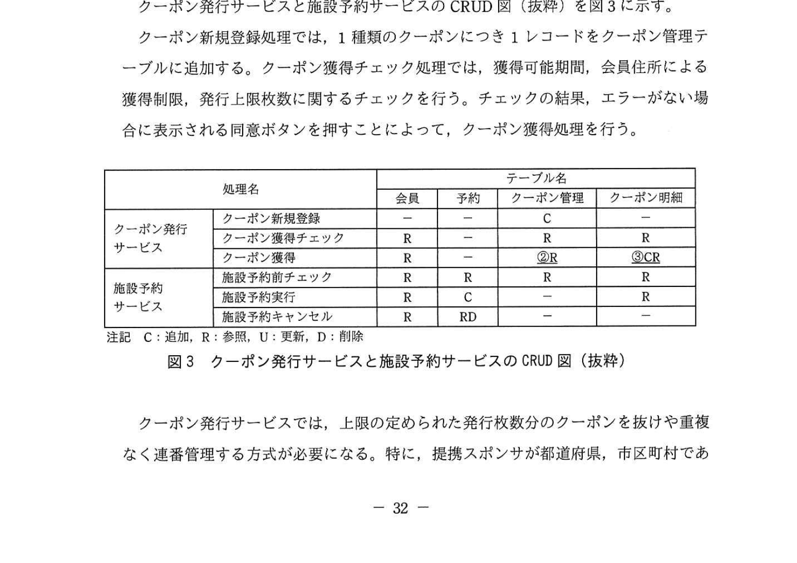
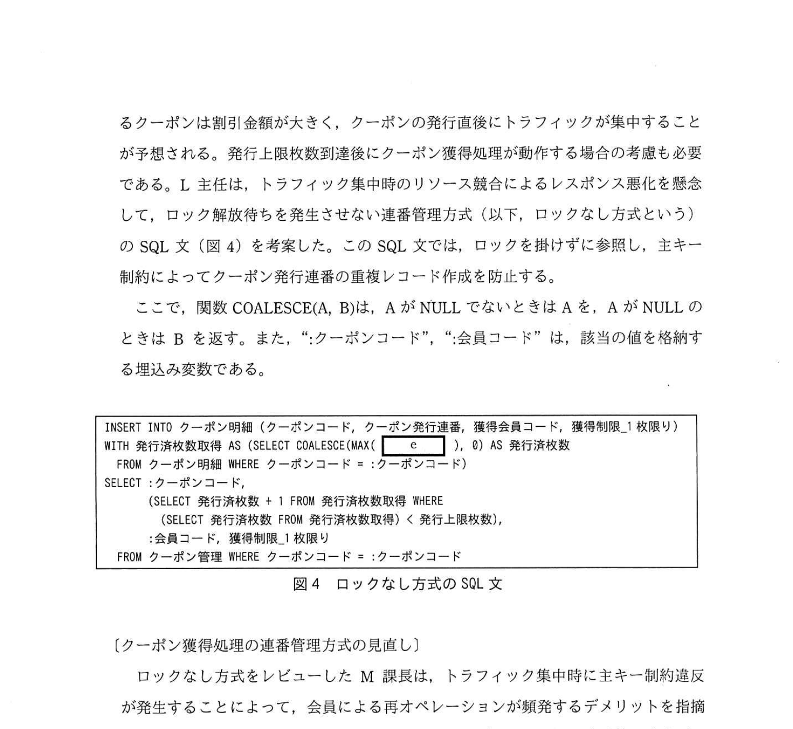
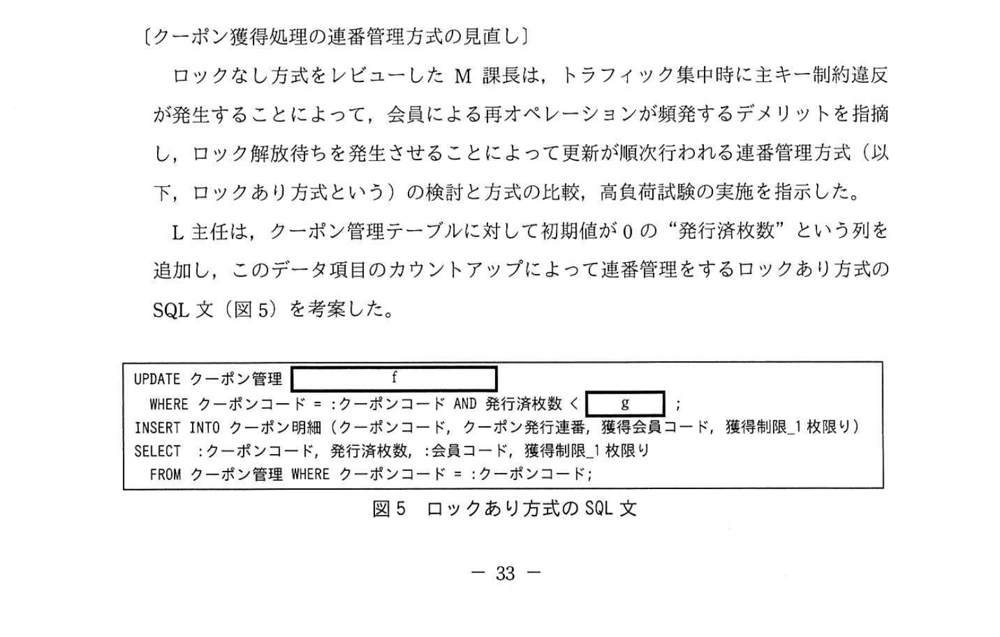
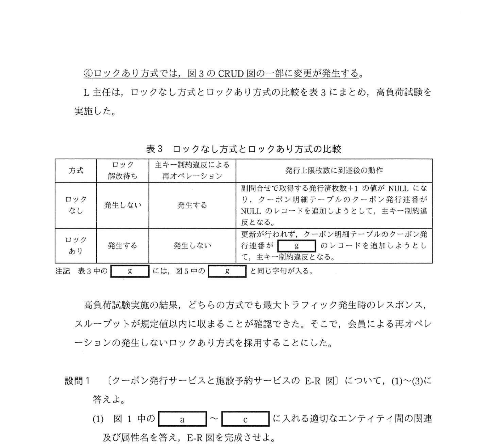

# 2022年春期（令和4年度春期）応用情報技術者試験 午後 問6（選択）
## データベース：クーポン発行サービス（排他制御・連番管理・UNIQUE制約）

---

## 問題文

**問6** クーポン発行サービスに関する次の記述を読んで、設問1〜4に答えよ。

K社は、インターネットでホテル、旅館及びレストラン（以下、施設という）の予約を取り扱う施設予約サービスを運営している。各施設は幾つかの利用プランを提供していて、利用者はその中から好みのプランを選んで予約する。会員向けサービスの拡充施策として、現在稼働している施設予約サービスに加え、クーポン発行サービスを開始することにした。

発行するクーポンには割引金額が設定されていて、施設予約の際に料金の割引に利用することができる。K社は、施設、又は都道府県、若しくは市区町村を提携スポンサとして、提携スポンサと合意した割引金額、枚数のクーポンを発行する。

クーポン発行に関しては、提携スポンサによって各種制限が設けられているので、クーポンの獲得、及びクーポンを利用した予約の際に、制限が満たされていることをチェックする仕組みを用意する。

提携スポンサによって任意に設定可能なチェック仕様の一部を表1に、クーポン発行サービスの概要を表2に示す。

### 表1 提携スポンサによって任意に設定可能なチェック仕様（一部）



> | 提携スポンサ | クーポンの獲得制限 | クーポンを利用した予約制限 |
> |-----------|----------------|------------------------|
> | 施設 | ・同一会員による同一クーポンの獲得可能枚数を、1枚に制限する（以下、"同一会員1枚限りの獲得制限" という）。 | ・設定した施設だけを予約可能にする。<br>・利用金額が設定金額以上の予約だけを可能にする。 |
> | 都道府県、市区町村 | ・設定地区に居住する会員だけが獲得可能にする。 | ・設定地区にある施設だけを予約可能にする。 |

### 表2 クーポン発行サービスの概要



> | 利用局面 | 概要 |
> |---------|------|
> | クーポンの照会 | ・発行予定及び発行中クーポンの情報は、会員向けのメール配信によって会員に周知され、施設予約サービスにおいて検索、照会ができる。 |
> | クーポンの獲得 | ・発行中のクーポンを利用するためには、会員がクーポン獲得を行う必要がある。<br>・クーポン獲得を行える期間は定められている。<br>・クーポンの発行枚数が上限に達すると、以降の獲得はできない。 |
> | クーポンの利用 | ・獲得したクーポンは、施設予約サービスにおいて料金の割引に利用できる。<br>・1枚のクーポンは一つの予約だけに利用できる。<br>・クーポンを利用した予約をキャンセルすると、そのクーポンを別の予約に利用できる。<br>・クーポンの利用期間は定められていて、期限を過ぎたクーポンは無効となる。 |

---

### 〔クーポン発行サービスと施設予約サービスのE-R図〕

クーポン発行サービスと施設予約サービスで使用するデータベース（以下、予約サイトデータベースという）の E-R図（抜粋）を図1に示す。予約サイトデータベースは、E-R図のエンティティ名をテーブル名に、属性名を列名にして、適切なデータ型で表定義した関係データベースによってデータを管理する。

クーポン管理テーブルの列名の先頭に "獲得制限" 又は "予約制限" が付く列は、クーポンの獲得制限、又はクーポンを利用した予約制限のチェック処理で使用し、チェックが必要ない場合には NULL を設定する。"獲得制限_1枚限り" には、"同一会員1枚限りの獲得制限" のチェックが必要なときは 'Y' を、不要なときは NULL を設定する。

### 図1 予約サイトデータベースのE-R図（抜粋）



> 主なエンティティと属性（下線は主キー、破線下線は外部キー）:
> - **会員**：<u>会員コード</u>、氏名、会員住所都道府県コード、会員住所市区町村コード
> - **予約**：<u>予約コード</u>、会員コード、`[　a　]`、`[　b　]`、利用人数、利用開始日時、クーポンコード、クーポン発行連番
> - **利用プラン**：<u>施設コード</u>、<u>プランコード</u>、最小利用人数、最大利用人数、1名分利用料金
> - **クーポン管理**：<u>クーポンコード</u>、発行上限枚数、割引金額、獲得可能開始日時、獲得可能終了日時、利用期間開始日、利用期間終了日、獲得制限_1枚限り、獲得制限_会員住所都道府県コード、獲得制限_会員住所市区町村コード、予約制限_施設コード、予約制限_最低利用金額、予約制限_施設住所都道府県コード、予約制限_施設住所市区町村コード
> - **クーポン明細**：<u>クーポンコード</u>、<u>クーポン発行連番</u>、獲得会員コード、獲得制限_1枚限り
> - **施設**：<u>施設コード</u>、施設名、施設住所都道府県コード、施設住所市区町村コード
> - 利用プランと施設の間の関連が `[　c　]`。
>
> 凡例 ── : 1対1、→ : 1対多、←→ : 多対多
> 注記 属性名の実線の下線は主キー、破線の下線は外部キーを示す。主キーの実線が付いている属性名には、外部キーの破線を付けない。

データベース設計者である L 主任は、"同一会員1枚限りの獲得制限" を制約として実装するために、図2の SQL 文によってクーポン明細テーブルに対して、UNIQUE 制約を付けた。なお、予約サイトデータベースにおいては、UNIQUE 制約を構成する複数の列で一つの列でも NULL の場合は、UNIQUE 制約違反とならない。

### 図2 "同一会員1枚限りの獲得制限" を制約とするためのSQL文



```sql
[　d　] クーポン明細 ADD CONSTRAINT クーポン明細_IX1
UNIQUE(クーポンコード, 獲得会員コード, 獲得制限_1枚限り)
```

L主任は、①**予約テーブルの "クーポンコード"、"クーポン発行連番" に対しても、UNIQUE 制約を付けた**。

予約サイトデータベースでは、更新目的の参照処理と更新処理においてレコード単位にロックを掛け、多重処理を行う設定としている。ロックが掛かるとトランザクションが終了するまでの間、他のトランザクションによる同一レコードに対する処理はロック解放待ちとなる。

---

### 〔クーポン獲得処理の連番管理方式〕

クーポン発行サービスと施設予約サービスの CRUD図（抜粋）を図3に示す。

クーポン新規登録処理では、1種類のクーポンにつき1レコードをクーポン管理テーブルに追加する。クーポン獲得チェック処理では、獲得可能期間、会員住所による獲得制限、発行上限枚数に関するチェックを行う。チェックの結果、エラーがない場合に表示される同意ボタンを押すことによって、クーポン獲得処理を行う。

### 図3 クーポン発行サービスと施設予約サービスのCRUD図（抜粋）



> | | 処理名 | 会員 | 予約 | クーポン管理 | クーポン明細 |
> |------|------|:---:|:---:|:---:|:---:|
> | クーポン発行サービス | クーポン新規登録 | − | − | C | − |
> | | クーポン獲得チェック | R | − | R | R |
> | | クーポン獲得 | R | − | ②R | ③CR |
> | 施設予約サービス | 施設予約前チェック | R | R | R | R |
> | | 施設予約実行 | R | C | − | R |
> | | 施設予約キャンセル | R | RD | − | − |
>
> 注記 C：追加、R：参照、U：更新、D：削除

クーポン発行サービスでは、上限の定められた発行枚数分のクーポンを抜けや重複なく連番管理する方式が必要になる。特に、提携スポンサが都道府県、市区町村であるクーポンは割引金額が大きく、クーポンの発行直後にトラフィックが集中することが予想される。発行上限枚数到達後にクーポン獲得処理が動作する場合の考慮も必要である。L 主任は、トラフィック集中時のリソース競合によるレスポンス悪化を懸念して、ロック解放待ちを発生させない連番管理方式（以下、ロックなし方式という）の SQL 文（図4）を考案した。この SQL 文では、ロックを掛けずに参照し、主キー制約によってクーポン発行連番の重複レコード作成を防止する。

ここで、関数 COALESCE(A, B)は、A が NULL でないときは A を、A が NULL のときは B を返す。また、":クーポンコード"、":会員コード" は、該当の値を格納する埋込み変数である。

### 図4 ロックなし方式のSQL文



```sql
INSERT INTO クーポン明細 (クーポンコード, クーポン発行連番, 獲得会員コード, 獲得制限_1枚限り)
WITH 発行済枚数取得 AS (SELECT COALESCE(MAX( [　e　] ), 0) AS 発行済枚数
  FROM クーポン明細 WHERE クーポンコード = :クーポンコード)
SELECT :クーポンコード,
       (SELECT 発行済枚数 + 1 FROM 発行済枚数取得 WHERE
         (SELECT 発行済枚数 FROM 発行済枚数取得) < 発行上限枚数),
       :会員コード, 獲得制限_1枚限り
  FROM クーポン管理 WHERE クーポンコード = :クーポンコード
```

---

### 〔クーポン獲得処理の連番管理方式の見直し〕

ロックなし方式をレビューした M 課長は、トラフィック集中時に主キー制約違反が発生することによって、会員による再オペレーションが頻発するデメリットを指摘し、ロック解放待ちを発生させることによって更新が順次行われる連番管理方式（以下、ロックあり方式という）の検討と方式の比較、高負荷試験の実施を指示した。

L主任は、クーポン管理テーブルに対して初期値が0の "発行済枚数" という列を追加し、このデータ項目のカウントアップによって連番管理をするロックあり方式の SQL 文（図5）を考案した。

### 図5 ロックあり方式のSQL文



```sql
UPDATE クーポン管理 [　f　]
  WHERE クーポンコード = :クーポンコード AND 発行済枚数 < [　g　] ;
INSERT INTO クーポン明細 (クーポンコード, クーポン発行連番, 獲得会員コード, 獲得制限_1枚限り)
SELECT :クーポンコード, 発行済枚数, :会員コード, 獲得制限_1枚限り
  FROM クーポン管理 WHERE クーポンコード = :クーポンコード;
```

④**ロックあり方式では、図3のCRUD図の一部に変更が発生する**。

L 主任は、ロックなし方式とロックあり方式の比較を表3にまとめ、高負荷試験を実施した。

### 表3 ロックなし方式とロックあり方式の比較



> | 方式 | ロック解放待ち | 主キー制約違反による再オペレーション | 発行上限枚数に到達後の動作 |
> |------|-----------------|-------------------|--------------------------------|
> | ロックなし | 発生しない | 発生する | 副問合せで取得する発行済枚数+1の値がNULLになり、クーポン明細テーブルのクーポン発行連番がNULLのレコードを追加しようとして、主キー制約違反となる。 |
> | ロックあり | 発生する | 発生しない | 更新が行われず、クーポン明細テーブルのクーポン発行連番が `[　g　]` のレコードを追加しようとして、主キー制約違反となる。 |
>
> 注記 表3中の `[　g　]` には、図5中の `[　g　]` と同じ字句が入る。

高負荷試験実施の結果、どちらの方式でも最大トラフィック発生時のレスポンス、スループットが規定値以内に収まることが確認できた。そこで、会員による再オペレーションの発生しない**ロックあり方式**を採用することにした。

---

## 設問

### 設問1 〔クーポン発行サービスと施設予約サービスのE-R図〕について、(1)〜(3)に答えよ。

**(1)** 図1中の `[　a　]` 〜 `[　c　]` に入れる適切なエンティティ間の関連及び属性名を答え、E-R図を完成させよ。なお、エンティティ間の関連及び属性名の表記は、図1の凡例及び注記に倣うこと。

**(2)** 図2中の `[　d　]` に入れる適切な字句を答えよ。

**(3)** 本文中の下線①は、どのような業務要件を実現するために行ったものか。30字以内で述べよ。

### 設問2 図4中の `[　e　]` に入れる適切な字句を答えよ。

### 設問3 図5中の `[　f　]`、`[　g　]` に入れる適切な字句を答えよ。

### 設問4 本文中の下線④について、図3中の下線②、下線③の変更後のレコード操作内容を、注記に従いそれぞれ答えよ。

---

## 解答と解説

### 設問1

**(1) 正解：a = 施設コード、b = プランコード、c = ↑（1対多の関連）**

- **a = 施設コード**、**b = プランコード**：予約エンティティが利用プランを参照する外部キー。利用プランの主キーは（施設コード、プランコード）の複合キーなので、予約側にもこの2列を外部キーとして持つ。
- **c = ↑（1対多）**：利用プランと施設の間の関連。1つの施設は複数の利用プランをもつので、施設→利用プランが1対多。

**IPA公式：a=施設コード、b=プランコード、c=↑（a・bは順不同）**

**(2) 正解：d = ALTER TABLE**

図2のSQL文は既存テーブルにUNIQUE制約を追加するもの。`ALTER TABLE テーブル名 ADD CONSTRAINT 制約名 UNIQUE(列名...)` の構文。

**IPA公式：d = ALTER TABLE**

**(3) 正解：1枚のクーポンは一つの予約だけに利用できる。（23字）**

予約テーブルの「クーポンコード」「クーポン発行連番」にUNIQUE制約を付けることで、同一クーポン（同じコードと連番の組み合わせ）が複数の予約に使われることを防ぐ。1クーポン＝1予約のみ利用可能という業務ルールを実現する。

**IPA公式：1枚のクーポンは一つの予約だけに利用できる。**

---

### 設問2 正解：e = クーポン発行連番

ロックなし方式のSQLは、既存の最大発行連番に1を加算した値を新しい連番として INSERT する。  
`COALESCE(MAX(クーポン発行連番), 0)` で、レコードがない場合（NULL）は0とし、+1して1番から始まる連番を生成する。

**IPA公式：e = クーポン発行連番**

---

### 設問3

**f = SET 発行済枚数 = 発行済枚数 + 1**

UPDATE文のSET句で、クーポン管理テーブルの発行済枚数をカウントアップする。更新後の発行済枚数がそのままクーポン発行連番になる。

**g = 発行上限枚数**

WHERE条件の `発行済枚数 < 発行上限枚数` で上限チェックを行い、上限に達していれば更新されない（以降の獲得ができない）。

**IPA公式：f = SET 発行済枚数 = 発行済枚数 + 1、g = 発行上限枚数**

---

### 設問4 正解：下線②（変更後）= RU、下線③（変更後）= C

- **下線②（クーポン獲得×クーポン管理）= RU**：ロックあり方式では、クーポン管理テーブルの発行済枚数を参照（R）した上で、カウントアップの更新（U）が発生する。変更前は R のみ。
- **下線③（クーポン獲得×クーポン明細）= C**：ロックあり方式では、クーポン明細テーブルへはレコードの追加（C）だけを行う。変更前は CR。

**IPA公式：下線②=RU、下線③=C**

---

## 参考：主要キーワード

| 用語 | 説明 |
|------|------|
| UNIQUE制約 | 指定列（または列の組み合わせ）に重複した値を持つ行の挿入・更新を禁止する制約。構成列にNULLを含む場合は制約違反とならない |
| 主キー制約（PRIMARY KEY） | テーブルの各行を一意に識別する列の制約。NULL不可・一意性保証 |
| ロックなし方式 | ロックを掛けずに参照し、主キー制約で重複を防ぐ方式。トラフィック集中時は主キー制約違反による再オペレーションが発生し得る |
| ロックあり方式 | レコードをロックしてから更新する方式。ロック解放待ちは発生するが主キー制約違反による再オペレーションは発生しない |
| COALESCE(A, B) | AがNULL以外ならA、NULLならBを返す関数 |
| 排他制御 | 複数のトランザクションが同一データを同時更新しないための仕組み |
| CRUD図 | Create/Read/Update/Delete の操作をプロセスとデータの関係で表す図 |
| ALTER TABLE | 既存テーブルの定義を変更するSQL文（列追加・制約追加等） |
| 連番管理 | トランザクション環境でも重複や欠番なしに連番を発行する仕組み |
