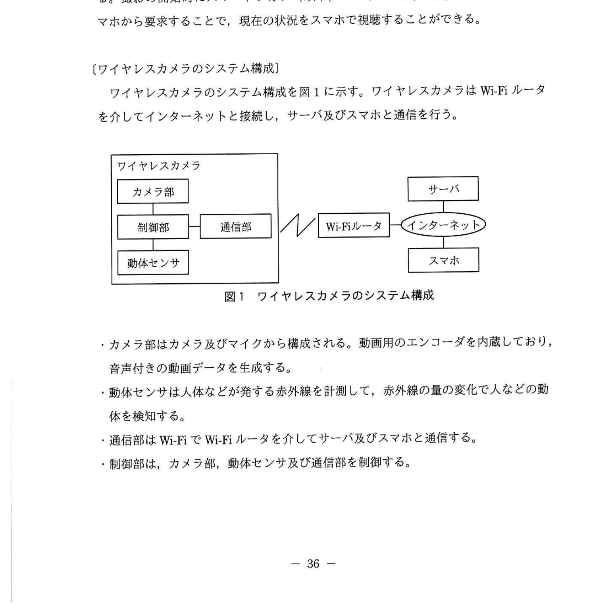
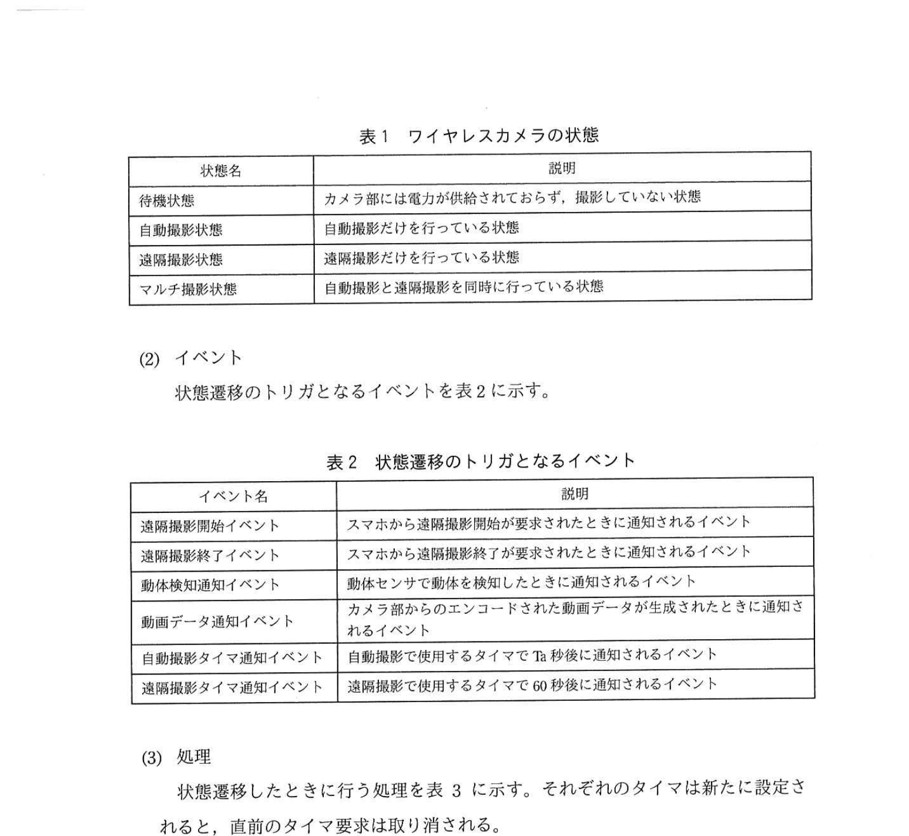
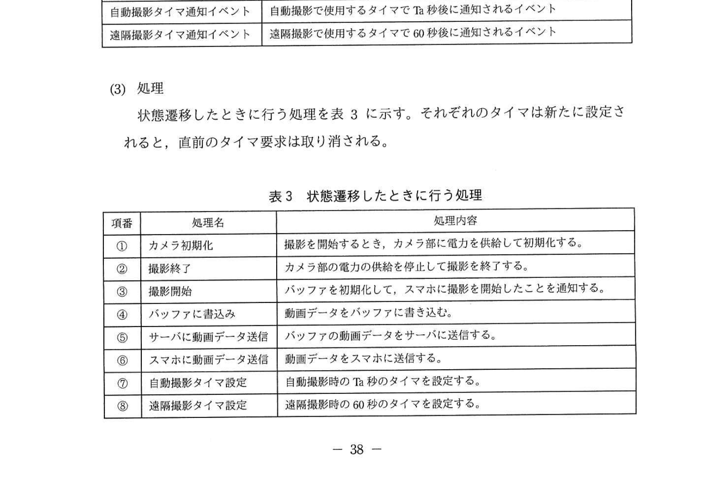
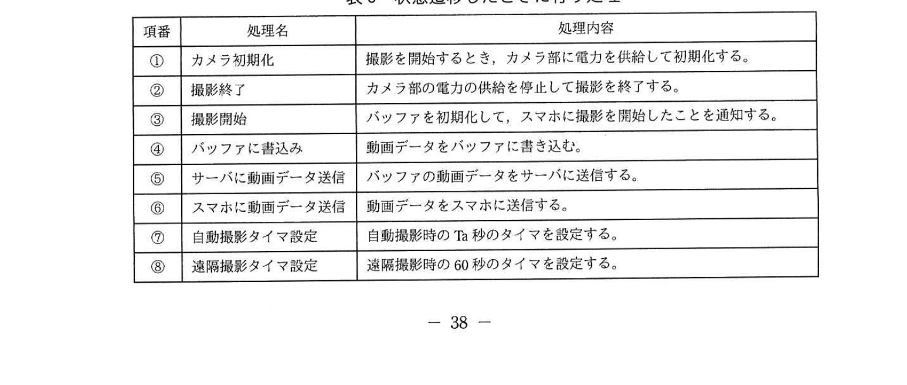
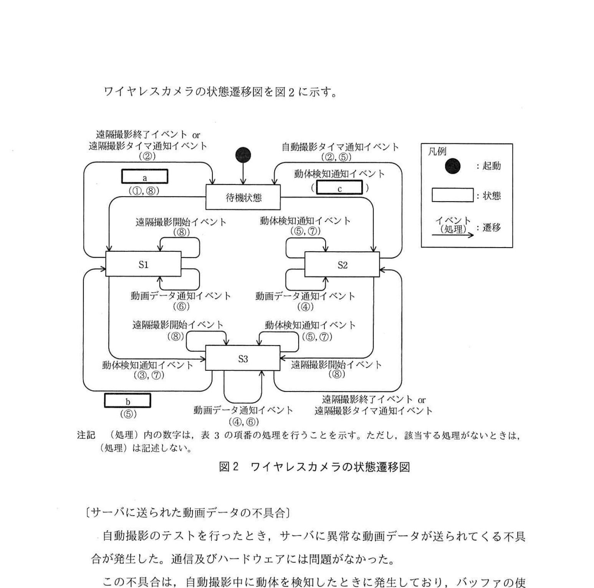

# 2022年春期（令和4年度春期）応用情報技術者試験 午後 問7（選択）
## 組込みシステム開発：ワイヤレス防犯カメラの設計（状態遷移・リングバッファ）

---

## 問題文

**問7** ワイヤレス防犯カメラの設計に関する次の記述を読んで、設問1〜4に答えよ。

I社は、有線の防犯カメラを製造している。有線の防犯カメラの設置には通信ケーブルの配線、電源の電気工事などが必要である。そこで、充電可能な電池を内蔵して、太陽電池と接続することで、外部からの電力の供給が不要なワイヤレス防犯カメラ（以下、ワイヤレスカメラという）を設計することになった。

ワイヤレスカメラは、人などの動体を検知したときだけ、一定時間動画を撮影する。撮影の開始時にはスマートフォン（以下、スマホという）に通知する。また、スマホから要求することで、現在の状況をスマホで視聴することができる。

---

### 〔ワイヤレスカメラのシステム構成〕

ワイヤレスカメラのシステム構成を図1に示す。ワイヤレスカメラはWi-Fiルータを介してインターネットに接続する。サーバ及びスマホと通信を行う。

### 図1 ワイヤレスカメラのシステム構成

- カメラ部はカメラ及びマイクから構成される。動画用のエンコーダを内蔵しており、音声付きの動画データを生成する。
- 動体センサは人体などが発する赤外線を計測して、赤外線の量の変化で人などの動体を検知する。
- 通信部はWi-Fiで Wi-Fiルータを介してサーバ及びスマホと通信する。
- 制御部は、カメラ部、動体センサ及び通信部を制御する。

---

### 〔ワイヤレスカメラの機能〕

ワイヤレスカメラは、自動撮影及び遠隔撮影の機能がある。

**(1) 自動撮影**
- 動体を検知すると撮影を開始する。撮影を開始したとき、スマホに撮影を開始したことを通知する。
- 撮影を開始してから Ta 秒間撮影する。ここで Ta はパラメータである。
- 撮影した動画データは、一時的に制御部のバッファに書き込まれる。このとき、動画データはバッファの先頭から書き込まれる。Ta 秒間の撮影が終わるとバッファの動画データはサーバに送信される。
- 撮影中に新たに動体を検知すると、バッファにあるその時点までの動画データをサーバに送信し始めると同時に、更に Ta 秒間撮影を行う。このとき、動画データはバッファの先頭から書き込まれる。

**(2) 遠隔撮影**
- スマホから遠隔撮影開始が要求されると撮影を開始する。
- 撮影した動画データはスマホに送信され、そのままスマホで視聴することができる。
- スマホから遠隔撮影終了が要求される、又は撮影を開始してから60秒経過すると撮影を終了する。
- 撮影中に再度、遠隔撮影開始が要求されると、その時点から60秒間又は遠隔撮影終了が要求されるまで、撮影を続ける。
- ワイヤレスカメラとスマホが通信するときに通信障害が発生すると、データの再送は行わず、障害発生中の送受信データは消滅するが、撮影は続ける。

---

### 〔ワイヤレスカメラの状態遷移〕

**(1) 状態**

ワイヤレスカメラの状態を表1に示す。

### 表1 ワイヤレスカメラの状態

> | 状態名 | 説明 |
> |--------|------|
> | 待機状態 | カメラ部には電力が供給されておらず、撮影していない状態 |
> | 自動撮影状態 | 自動撮影だけを行っている状態 |
> | 遠隔撮影状態 | 遠隔撮影だけを行っている状態 |
> | マルチ撮影状態 | 自動撮影と遠隔撮影を同時に行っている状態 |

**(2) イベント**

状態遷移のトリガとなるイベントを表2に示す。

### 表2 状態遷移のトリガとなるイベント

> | イベント名 | 説明 |
> |-----------|------|
> | 遠隔撮影開始イベント | スマホから遠隔撮影開始が要求されたときに通知されるイベント |
> | 遠隔撮影終了イベント | スマホから遠隔撮影終了が要求されたときに通知されるイベント |
> | 動体検知通知イベント | 動体センサで動体を検知したときに通知されるイベント |
> | 動画データ通知イベント | カメラ部からの動画エンコードされた動画データが生成されたときに通知されるイベント |
> | 自動撮影タイマ通知イベント | 自動撮影で使用するタイマで Ta 秒後に通知されるイベント |
> | 遠隔撮影タイマ通知イベント | 遠隔撮影で使用するタイマで 60 秒後に通知されるイベント |

**(3) 処理**

状態遷移したときに行う処理を表3に示す。それぞれのタイマは新たに設定されると、直前のタイマ要求は取り消される。

### 表3 状態遷移したときに行う処理

> | 項番 | 処理名 | 処理内容 |
> |------|--------|---------|
> | ① | カメラ初期化 | 撮影を開始するとき、カメラ部に電力を供給して初期化する。 |
> | ② | 撮影終了 | カメラ部の電力の供給を停止して撮影を終了する。 |
> | ③ | 撮影開始 | バッファを初期化して、スマホに撮影を開始したことを通知する。 |
> | ④ | バッファに書込み | 動画データをバッファに書き込む。 |
> | ⑤ | サーバに動画データ送信 | バッファの動画データをサーバに送信する。 |
> | ⑥ | スマホに動画データ送信 | 動画データをスマホに送信する。 |
> | ⑦ | 自動撮影タイマ設定 | 自動撮影時の Ta 秒のタイマを設定する。 |
> | ⑧ | 遠隔撮影タイマ設定 | 遠隔撮影時の60秒のタイマを設定する。 |

ワイヤレスカメラの状態遷移図を図2に示す。

### 図2 ワイヤレスカメラの状態遷移図

---

### 〔サーバに送られた動画データの不具合〕

自動撮影のテストをするとき、サーバに異常な動画データが送られてくる不具合が発生した。通信部及びハードウェアには問題がなかった。

その不具合は、自動撮影したときに動体を検知したときに発生しており、バッファの使い方に問題があることが判明した。

そこで、撮影中に新たに動体を検知した時点で、書き込まれているバッファの続きから動画データを書き込み、バッファの `[　d　]` まで書き込んだ場合は、バッファの `[　e　]` に戻る方式の `[　f　]` に変更した。

---

## 設問

### 設問1 時刻 t₁ に動体を検知して自動撮影を開始した。時刻 t₁ から時刻 t₂ まで途切れることなく自動撮影を続けており、時刻 t₂ に最後の動体を検知した。このときの自動撮影は何秒間行われたか。時間を表す式を答えよ。ここで、処理の遅延及び通信の遅延は無視できるものとする。

### 設問2 スマホから要求を行い動画の視聴を開始した。その10秒後に送受信の通信障害が20秒間発生した。通信障害が発生してから5秒後にスマホから遠隔撮影開始を要求した。スマホでの視聴が終了するのは視聴を開始してから何秒後か。整数で答えよ。ここで、処理の遅延及び通信の遅延は無視できるものとする。

### 設問3 〔ワイヤレスカメラの状態遷移〕について、(1)〜(3)に答えよ。

**(1)** 図2の状態遷移の状態 S1、S2 に入れる適切な状態名を、表1中の状態名から答えよ。

**(2)** 図2中の `[　a　]`、`[　b　]` に入れる適切なイベント名を、表2中のイベント名から答えよ。

**(3)** 図2中の `[　c　]` に入れる処理を、表3中の項番の全てを答えよ。

### 設問4 〔サーバに送られた動画データの不具合〕について、(1)〜(3)に答えよ。

**(1)** 不具合が発生した原因を40字以内で述べよ。

**(2)** 本文中の `[　d　]`、`[　e　]` に入れる適切な字句を答えよ。

**(3)** 本文中の `[　f　]` に入れるバッファの名称を答えよ。

---

## 解答と解説

### 設問1 正解：(t₂ - t₁) + Ta（秒）

自動撮影は t₁ に開始し、最後の動体検知（t₂）から更に Ta 秒間撮影が続く。途中の動体検知ではタイマがリセットされ延長される。自動撮影の総時間 = (t₂ - t₁) + Ta 秒。

**IPA公式：(t₂-t₁)+Ta**

---

### 設問2 正解：60（秒後）

- 視聴開始（＝遠隔撮影開始）を t=0 とすると、60秒タイマが設定され t=60 に遠隔撮影タイマ通知イベントで終了予定。
- t=10 から通信障害が20秒間（t=10〜30）発生。
- t=15（障害発生から5秒後）に「遠隔撮影開始」を要求するが、**通信障害中の送受信データは消滅する**ため、この要求はワイヤレスカメラに届かず、60秒タイマはリセットされない。
- したがって撮影・視聴は当初の t=60 で終了する。障害回復（t=30）後は残り期間の映像が視聴できる。

**IPA公式：60**

---

### 設問3

**(1) 正解：S1 = 遠隔撮影状態、S2 = 自動撮影状態**

状態遷移図より：
- S1：待機状態から遠隔撮影開始イベントで遷移する状態＝**遠隔撮影状態**
- S2：待機状態から動体検知通知イベントで遷移する状態＝**自動撮影状態**
（S3は両者から遷移するマルチ撮影状態）

**IPA公式：S1=遠隔撮影状態、S2=自動撮影状態**

**(2) 正解：a = 遠隔撮影開始イベント、b = 自動撮影タイマ通知イベント**

- **a = 遠隔撮影開始イベント**：待機状態→遠隔撮影状態のトリガ
- **b = 自動撮影タイマ通知イベント**：自動撮影状態→待機状態のトリガ（Ta秒経過）

**IPA公式：a=遠隔撮影開始イベント、b=自動撮影タイマ通知イベント**

**(3) 正解：c = ①，③，⑦**

cは待機状態→S2（自動撮影状態）への遷移「動体検知通知イベント（c）」の処理。撮影を開始するので**①カメラ初期化、③撮影開始（バッファ初期化＋スマホ通知）、⑦自動撮影タイマ設定**を行う（待機→S1の遷移の(①,⑧)と対をなす）。

**IPA公式：c=①，③，⑦**

---

### 設問4

**(1) 正解：書込みと読込みが同時に行われ、バッファの先頭のデータが上書きされた。（37字）**

撮影中に新たな動体を検知した場合、バッファへの書き込みがバッファ先端（先頭）から再開されるため、既に書き込まれたデータを上書きしてしまう不具合が発生した。

**(2) 正解：d = 終端、e = 始端**

リングバッファの動作：バッファの「終端」まで書き込んだら、「始端」（先頭）に戻って書き続ける。

**IPA公式：d=終端、e=始端**

**(3) 正解：f = リングバッファ**

リングバッファ（循環バッファ）：バッファの末尾まで達したら先頭に戻り、循環して使用するデータ構造。連続するデータストリームの一時保存に適している。

**IPA公式：f=リングバッファ**

---

## 参考：主要キーワード

| 用語 | 説明 |
|------|------|
| 状態遷移図 | システムの状態とイベントによる遷移を図で表したもの |
| 状態遷移表 | 状態×イベントの組み合わせで遷移先と処理を表す表 |
| リングバッファ（循環バッファ） | 末尾まで達したら先頭に戻って使用するバッファ。連続データ処理に最適 |
| 自動撮影 | 動体検知をトリガとして一定時間自動で撮影する機能 |
| 遠隔撮影 | スマホからの要求で撮影開始・終了を制御する機能 |
| マルチ撮影状態 | 自動撮影と遠隔撮影が同時進行している状態 |
| IoT（Internet of Things） | モノがインターネットに接続され、データ通信・制御を行う仕組み |
| Wi-Fi | IEEE 802.11規格の無線LAN技術 |
| バッファ | データを一時的に保持するメモリ領域 |
