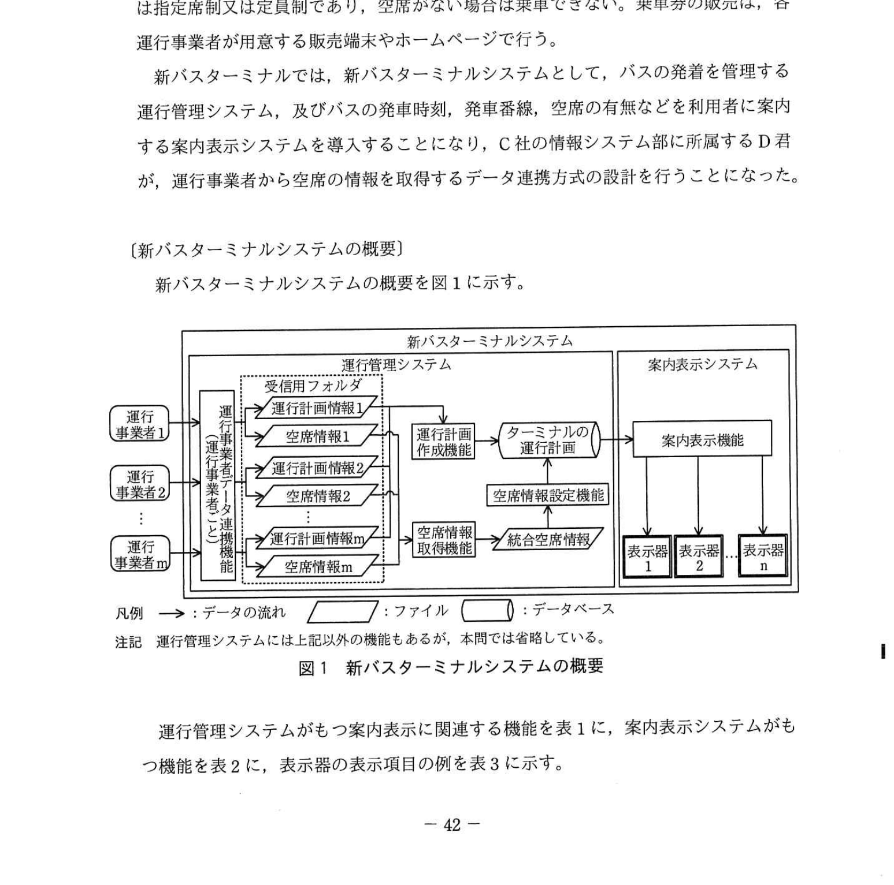
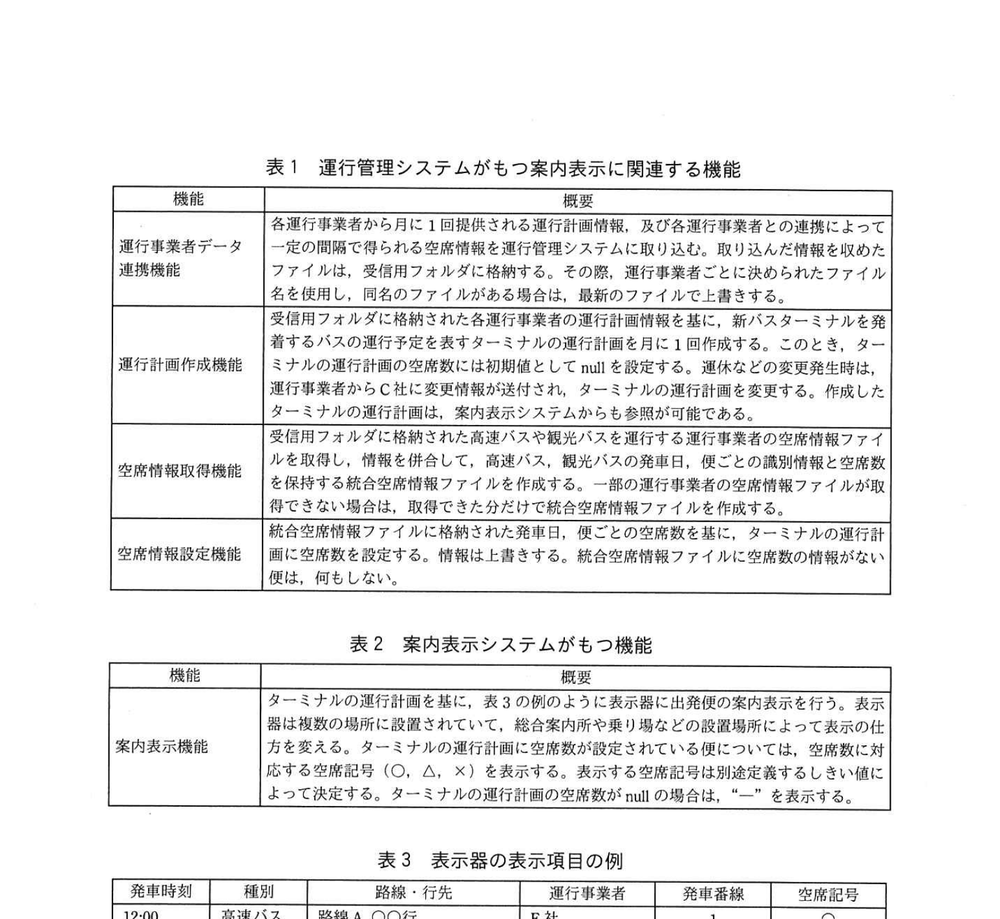
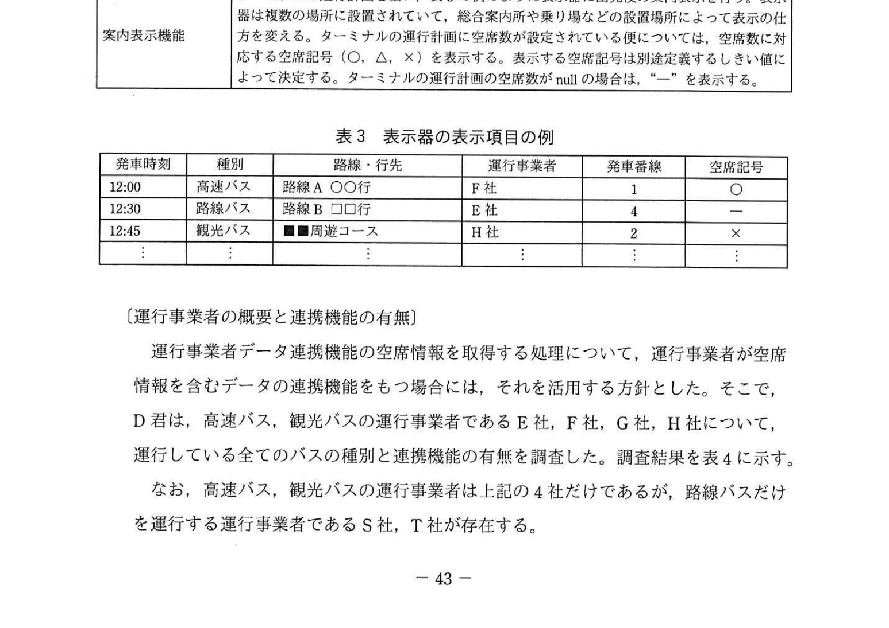
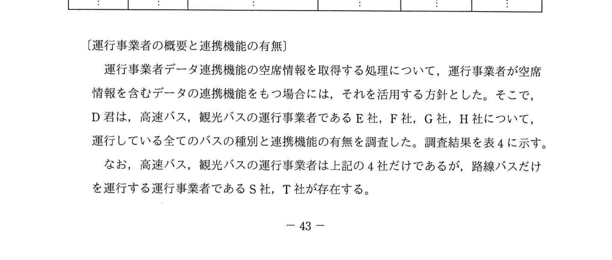
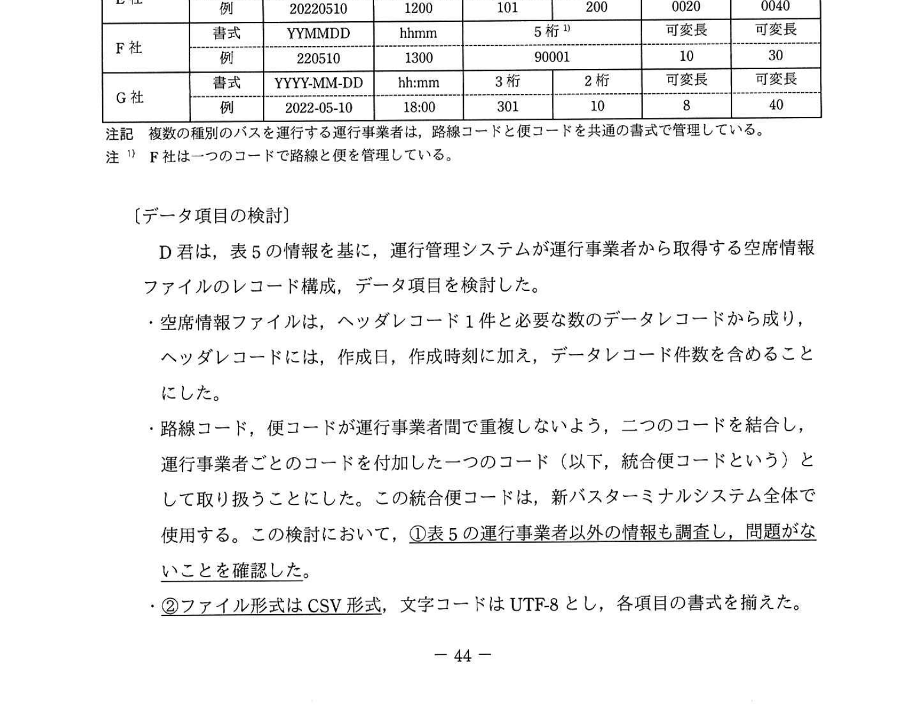
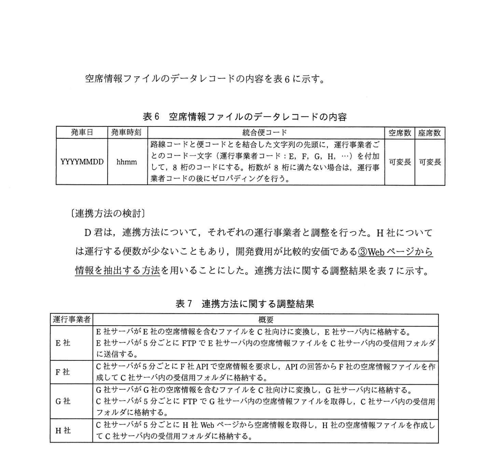
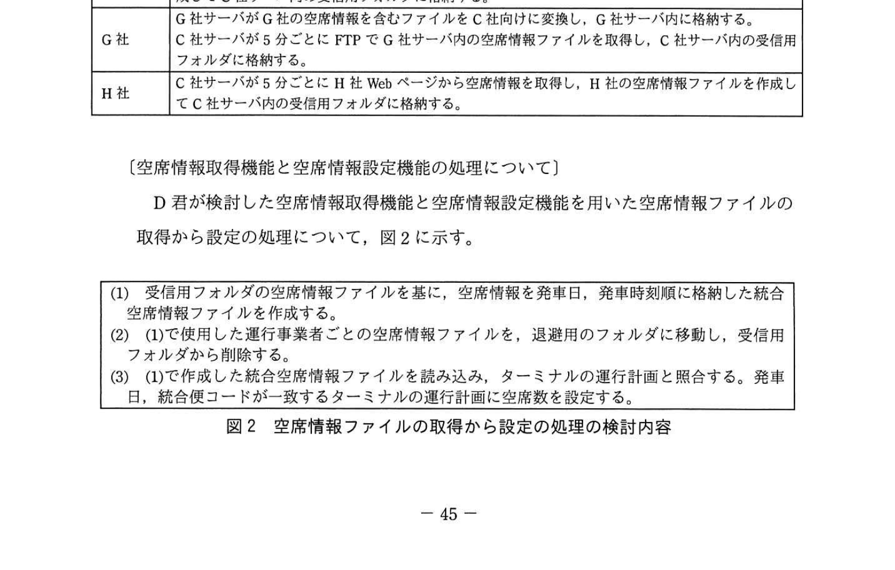
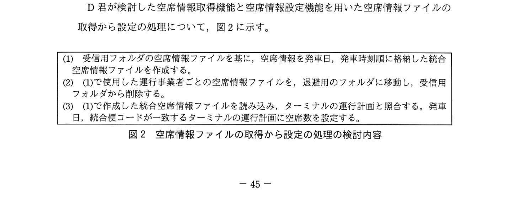
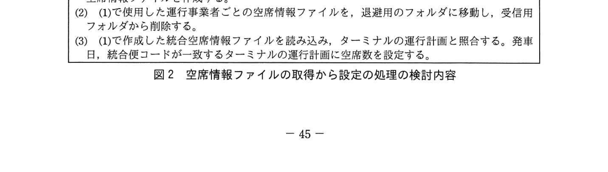

# 2022年春期（令和4年度春期）応用情報技術者試験 午後 問8（選択）
## 情報システム開発：システム間のデータ連携方式（バスターミナル・空席情報連携）

---

## 問題文

**問8** システム間のデータ連携方式に関する次の記述を読んで、設問1〜5に答えよ。

バスターミナルを運営するC社は、再開発に伴い、これまで散在していた小規模なバスターミナルを統合した、新たなバスターミナル（以下、新バスターミナルという）を運営することになった。

C社が運営する新バスターミナルには、複数のバス運行事業者（以下、運行事業者という）の高速バス、観光バス、路線バスが発着する。このうち高速バスと観光バスは指定席制又は定員制であり、空席がない場合は乗車できない。乗車券の販売は、各運行事業者が用意する販売端末やホームページで行う。

新バスターミナルでは、新バスターミナルシステムとして、バスの発着を管理する運行管理システム、及びバスの発車時刻、発車番線、空席の有無などを利用者に案内する案内表示システムを導入することになり、C社の情報システム部に所属するD君が、運行事業者から空席の情報を取得するデータ連携方式の設計を行うことになった。

---

### 〔新バスターミナルシステムの概要〕

新バスターミナルシステムの概要を図1に示す。

### 図1 新バスターミナルシステムの概要

> **構成の概要**
> - 運行事業者1〜m → **運行事業者データ連携機能**（運行事業者ごと） → **受信用フォルダ**（運行計画情報1〜m、空席情報1〜m のファイルを格納）
> - 運行管理システム内：運行計画情報 → **運行計画作成機能** → **ターミナルの運行計画**（データベース）
> - 空席情報 → **空席情報取得機能** → **統合空席情報**（ファイル） → **空席情報設定機能** → ターミナルの運行計画
> - **案内表示システム**：ターミナルの運行計画 → **案内表示機能** → 表示器1〜n
>
> 凡例 → : データの流れ、平行四辺形 : ファイル、円筒 : データベース
> 注記 運行管理システムには上記以外の機能もあるが、本問では省略している。

運行管理システムがもつ案内表示に関連する機能を表1に、案内表示システムがもつ機能を表2に、表示器の表示項目の例を表3に示す。

### 表1 運行管理システムがもつ案内表示に関連する機能

> | 機能 | 概要 |
> |------|------|
> | 運行事業者データ連携機能 | 各運行事業者から月に1回提供される運行計画情報、及び各運行事業者との連携によって一定の間隔で得られる空席情報を運行管理システムに取り込む。取り込んだ情報を収めたファイルは、受信用フォルダに格納する。その際、運行事業者ごとに決められたファイル名を使用し、同名のファイルがある場合は、最新のファイルで上書きする。 |
> | 運行計画作成機能 | 受信用フォルダに格納された各運行事業者の運行計画情報を基に、新バスターミナルを発着するバスの運行予定を表すターミナルの運行計画を月に1回作成する。このとき、ターミナルの運行計画の空席数には初期値としてnullを設定する。運休などの変更発生時は、運行事業者からC社に変更情報が送付され、ターミナルの運行計画を変更する。作成したターミナルの運行計画は、案内表示システムからも参照が可能である。 |
> | 空席情報取得機能 | 受信用フォルダに格納された高速バスや観光バスを運行する運行事業者の空席情報ファイルを取得し、情報を併合して、高速バス、観光バスの発車日、便ごとの識別情報と空席数を保持する統合空席情報ファイルを作成する。一部の運行事業者の空席情報ファイルが取得できない場合は、取得できた分だけで統合空席情報ファイルを作成する。 |
> | 空席情報設定機能 | 統合空席情報ファイルに格納された発車日、便ごとの空席数を基に、ターミナルの運行計画に空席数を設定する。情報は上書きする。統合空席情報ファイルに空席数の情報がない便は、何もしない。 |

### 表2 案内表示システムがもつ機能

> | 機能 | 概要 |
> |------|------|
> | 案内表示機能 | ターミナルの運行計画を基に、表3の例のように表示器に出発便の案内表示を行う。表示器は複数の場所に設置されていて、総合案内所や乗り場などの設置場所によって表示の仕方を変える。ターミナルの運行計画に空席数が設定されている便については、空席数に対応する空席記号（○、△、×）を表示する。表示する空席記号は別途定義するしきい値によって決定する。ターミナルの運行計画の空席数がnullの場合は、"—"を表示する。 |

### 表3 表示器の表示項目の例

> | 発車時刻 | 種別 | 路線・行先 | 運行事業者 | 発車番線 | 空席記号 |
> |---------|------|------------|-----------|---------|---------|
> | 12:00 | 高速バス | 路線A ○○行 | F社 | 1 | ○ |
> | 12:30 | 路線バス | 路線B □□行 | E社 | 4 | — |
> | 12:45 | 観光バス | ■■周遊コース | H社 | 2 | × |

---

### 〔運行事業者の概要と連携機能の有無〕

運行事業者データ連携機能の空席情報を取得する処理について、運行事業者が空席情報を含むデータの連携機能をもつ場合には、それを活用する方針とした。そこで、D君は、高速バス、観光バスの運行事業者であるE社、F社、G社、H社について、運行している全てのバスの種別と連携機能の有無を調査した。調査結果を表4に示す。

なお、高速バス、観光バスの運行事業者は上記の4社だけであるが、路線バスだけを運行する運行事業者であるS社、T社が存在する。

### 表4 E社、F社、G社、H社の調査結果

> | 運行事業者 | 種別 | 空席情報に関する連携機能の有無 |
> |-----------|------|---------------------|
> | E社 | 高速バス、路線バス | 高速バスについて、空席情報を含むファイルを作成し、ファイル転送を行う機能がある。ファイル形式は固定長、ファイルの文字コードはシフトJISコードである。 |
> | F社 | 高速バス | 要求を受け付け、便ごとの空席数を回答するAPIを提供している。回答の形式はXML、文字コードはUTF-8である。 |
> | G社 | 高速バス、観光バス | 高速バス、観光バスについて、空席情報を含むファイルを作成する機能がある。ファイル形式はCSV、ファイルの文字コードはUTF-8である。 |
> | H社 | 観光バス | 空席情報に関するファイル作成やAPIの機能はない。ただし、H社Webページに便ごとの空席情報を掲載している。 |

E社、F社、G社の空席情報の連携機能が提供しているデータ項目の書式と例を表5に示す。

### 表5 空席情報の連携機能が提供しているデータ項目の書式と例（抜粋）

> | 運行事業者 | 書式/例 | 発車日 | 発車時刻 | 路線コード | 便コード | 空席数 | 座席数 |
> |-----------|--------|--------|---------|---------|---------|--------|------|
> | E社 | 書式 | YYYYMMDD | hhmm | 3桁 | 3桁 | 4桁 | 4桁 |
> | E社 | 例 | 20220510 | 1200 | 101 | 200 | 0020 | 0040 |
> | F社 | 書式 | YYMMDD | hhmm | 5桁 注1)（路線コードと便コードで一つ） | | 可変長 | 可変長 |
> | F社 | 例 | 220510 | 1300 | 90001 | | 10 | 30 |
> | G社 | 書式 | YYYY-MM-DD | hh:mm | 3桁 | 2桁 | 可変長 | 可変長 |
> | G社 | 例 | 2022-05-10 | 18:00 | 301 | 10 | 8 | 40 |
>
> 注記 複数の種別のバスを運行する運行事業者は、路線コードと便コードを共通の書式で管理している。  
> 注1) F社は一つのコードで路線と便を管理している。

---

### 〔データ項目の検討〕

D君は、表5の情報を基に、運行管理システムが運行事業者から取得する空席情報ファイルのレコード構成、データ項目を検討した。

- 空席情報ファイルは、ヘッダレコード1件と必要な数のデータレコードから成り、ヘッダレコードには、作成日、作成時刻に加え、データレコード件数を含めることにした。
- 路線コード、便コードが運行事業者間で重複しないよう、二つのコードを結合し、運行事業者ごとのコードを付加した一つのコード（以下、統合便コードという）として取り扱うことにした。この統合便コードは、新バスターミナルシステム全体で使用する。この検討において、①**表5の運行事業者以外の情報も調査し、問題がないことを確認した**。
- ②**ファイル形式はCSV形式、文字コードはUTF-8**とし、各項目の書式を揃えた。

空席情報ファイルのデータレコードの内容を表6に示す。

### 表6 空席情報ファイルのデータレコードの内容

> | 発車日 | 発車時刻 | 統合便コード | 空席数 | 座席数 |
> |--------|---------|------------|--------|-------|
> | YYYYMMDD | hhmm | 路線コードと便コードとを結合した文字列の先頭に、運行事業者ごとのコード一文字（運行事業者コード：E、F、G、H、…）を付加して、8桁のコードにする。桁数が8桁に満たない場合は、運行事業者コードの後にゼロパディングを行う。 | 可変長 | 可変長 |

---

### 〔連携方法の検討〕

D君は、連携方法について、それぞれの運行事業者と調整を行った。H社については運行する便数が少ないこともあり、開発費用が比較的安価である③**Webページから情報を抽出する方法**を用いることにした。連携方法に関する調整結果を表7に示す。

### 表7 連携方法に関する調整結果

> | 運行事業者 | 概要 |
> |-----------|---------|
> | E社 | E社サーバがE社の空席情報を含むファイルをC社向けに変換し、E社サーバ内に格納する。E社サーバが5分ごとにFTPでE社サーバ内の空席情報ファイルをC社サーバ内の受信用フォルダに送信する。 |
> | F社 | C社サーバが5分ごとにF社APIで空席情報を要求し、APIの回答からF社の空席情報ファイルを作成してC社サーバ内の受信用フォルダに格納する。 |
> | G社 | G社サーバがG社の空席情報を含むファイルをC社向けに変換し、G社サーバ内に格納する。C社サーバが5分ごとにFTPでG社サーバ内の空席情報ファイルを取得し、C社サーバ内の受信用フォルダに格納する。 |
> | H社 | C社サーバが5分ごとにH社Webページから空席情報を取得し、H社の空席情報ファイルを作成してC社サーバ内の受信用フォルダに格納する。 |

---

### 〔空席情報取得機能と空席情報設定機能の処理について〕

D君が検討した空席情報取得機能と空席情報設定機能を用いた空席情報ファイルの取得から設定の処理について、図2に示す。

### 図2 空席情報ファイルの取得から設定の処理の検討内容

> (1) 受信用フォルダの空席情報ファイルを基に、空席情報を発車日、発車時刻順に格納した統合空席情報ファイルを作成する。
> (2) (1)で使用した運行事業者ごとの空席情報ファイルを、退避用のフォルダに移動し、受信用フォルダから削除する。
> (3) (1)で作成した統合空席情報ファイルを読み込み、ターミナルの運行計画と照合する。発車日、統合便コードが一致するターミナルの運行計画に空席数を設定する。

表7及び図2で検討した処理について、情報システム部内でレビューを実施したところ、次のような指摘があった。

- (i) 運行事業者とのデータ連携において FTP によるファイル転送を用いる場合は、ファイル全体が正しく転送されたことを確認する必要がある。
- (ii) 特定の運行事業者から空席情報が取得できなかった場合、その運行事業者のバスについて表示器に古い空席記号が表示され続けてしまう。

D君は、(i)の指摘に対して運行事業者データ連携機能に空席情報ファイルの `[　a　]` と `[　b　]` が一致することを確認する処理を追加する対策案、及び(ii)の指摘に対して④**図2の処理(3)の最初に新たな処理を追加する**対策案の検討を行い、再度レビューを実施した。

D君は対策案が承認された後、後続の開発作業に着手した。

---

## 設問

### 設問1 〔データ項目の検討〕について、(1)、(2)に答えよ。

**(1)** 本文中の下線①について、表5以外に調査した運行事業者を全て答えよ。

**(2)** 表5のG社の例について、発車日、発車時刻、統合便コード、空席数を表6に合わせて変換した場合の変換後の値を答えよ。

### 設問2 本文中の下線②について、CSVファイルの特徴として適切なものを解答群の中から全て選び、記号で答えよ。

**解答群：**
- ア XMLファイルと比較して、1レコード当たりのデータサイズが小さい。
- イ XMLファイルと比較して、処理速度が遅い。
- ウ 固定長ファイルと比較して、項目の桁数や文字数に関する自由度が低い。
- エ 固定長ファイルと比較して、処理速度が遅い。

### 設問3 本文中の下線③の名称として適切な字句を解答群の中から選び、記号で答えよ。

**解答群：**
- ア WAI
- イ Web API
- ウ Webコンテンツ
- エ Webスクレイピング

### 設問4 本文中の `[　a　]`、`[　b　]` に入れる適切な字句を、20字以内で答えよ。

### 設問5 本文中の下線④で追加した処理の内容を35字以内で述べよ。

---

## 解答と解説

### 設問1

**(1) 正解：H社、S社、T社**

統合便コードが運行事業者間で重複しないことを確認するには、表5に記載のE社・F社・G社以外の運行事業者も調査する必要がある。表5に載っていないのは、Webページ掲載のH社と、路線バスだけを運行するS社・T社。

**IPA公式：H社、S社、T社**

**(2) 正解：発車日=20220510、発車時刻=1800、統合便コード=G0030110、空席数=8**

G社の例（2022-05-10、18:00、路線コード301、便コード10、空席数8）を表6の書式へ変換する：
- 発車日：YYYY-MM-DD → YYYYMMDD ＝ **20220510**
- 発車時刻：hh:mm → hhmm ＝ **1800**
- 統合便コード：路線コード301＋便コード10を結合し「30110」（5桁）。先頭に運行事業者コード「G」を付加し、8桁に満たない分は運行事業者コードの後にゼロパディング → **G0030110**
- 空席数：可変長 ＝ **8**

**IPA公式：20220510／1800／G0030110／8**

---

### 設問2 正解：ア、エ

CSV形式の特徴：
- **ア（正）**：XMLのタグ（開始・終了タグ）が不要なため、1レコード当たりのデータサイズが小さい。
- **エ（正）**：固定長ファイルは位置で項目を切り出せるが、CSVは区切り文字の解析が必要なため、固定長と比較して処理速度が遅い。
- イ・ウは誤り（XMLより処理は速く、固定長より桁数・文字数の自由度は高い）。

**IPA公式：ア、エ**

---

### 設問3 正解：エ（Webスクレイピング）

H社への対応：C社サーバがH社のWebページから空席情報を取得する方式。WebページのHTMLを解析してデータを抽出する技術は「**Webスクレイピング**」。

**IPA公式：エ（Webスクレイピング）**

---

### 設問4 正解：a = ヘッダレコードのデータレコード件数、b = 処理したデータレコードの件数

FTPで転送されたファイルが正しく（全体が）転送されたことを確認するために：
- **a = ヘッダレコードのデータレコード件数**：ファイルのヘッダに記録されたレコード件数
- **b = 処理したデータレコードの件数**：実際に処理したデータレコード数

この2つが一致することで、ファイルが完全に転送されたことを確認する（順不同）。

**IPA公式：a=ヘッダレコードのデータレコード件数、b=処理したデータレコードの件数（順不同）**

---

### 設問5 正解：ターミナルの運行計画に設定された空席数をnullにする。（28字）

空席情報が取得できなかった便について、古い空席記号が表示され続けないよう、統合空席情報ファイルの読込みに先立ち、ターミナルの運行計画に設定済みの空席数を一旦 null に戻す。これにより、更新されなかった便は "—" 表示になる。

**IPA公式：ターミナルの運行計画に設定された空席数をnullにする。**

---

## 参考：主要キーワード

| 用語 | 説明 |
|------|------|
| CSV（Comma-Separated Values） | カンマ区切りのテキスト形式。軽量でシステム間データ交換に広く使われる |
| XML（eXtensible Markup Language） | タグで構造を表現するデータ形式。CSVより冗長だが自己記述性が高い |
| 固定長ファイル | 各項目を固定桁数で並べる形式。位置で切り出せるため解析が速い |
| FTP（File Transfer Protocol） | ファイル転送プロトコル。サーバ間のファイル受け渡しに使用 |
| Webスクレイピング | WebページのHTMLを解析してデータを自動抽出する技術 |
| Web API | HTTPを通じてデータや機能を提供するインタフェース |
| ヘッダレコード | ファイルの先頭に置かれ、作成日・件数等のメタ情報を含むレコード |
| 統合便コード | 複数事業者間で重複しないよう路線コードと便コードを統合した一意コード |
| UTF-8 | Unicodeの可変長文字エンコーディング。多言語対応の標準形式 |
