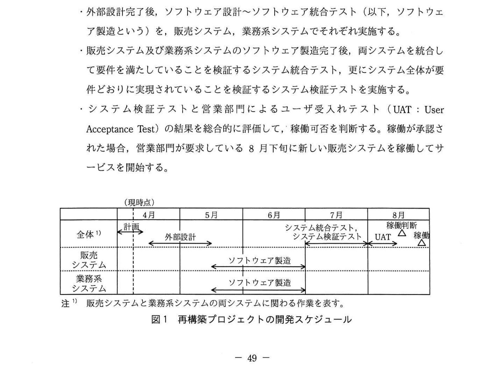

# 2022年春期（令和4年度春期）応用情報技術者試験 午後 問9（選択）
## プロジェクトマネジメント：販売システム再構築プロジェクトにおける調達とリスク

---

## 問題文

**問9** 販売システムの再構築プロジェクトにおける調達とリスクに関する次の記述を読んで、設問1〜3に答えよ。

D社は、若者向け衣料品の製造・インターネット販売業を営む企業である。売上の拡大を目的に、販売システムを再構築することになった。再構築では、営業部門が販売促進の観点で要望した、購買傾向を分析した商品の絞込み機能、及びお薦め商品の紹介機能を追加する。あわせて、販売システムとデータ接続している現行の在庫管理システム、生産管理システムなどのシステム群（以下、業務系システムという）を新しいデータ接続仕様に従って改修する。また、スマートフォン向けの画面デザインや操作性を向上させる。これらを実現するために、販売システムの再構築及び業務系システムの改修を行うプロジェクト（以下、再構築プロジェクトという）を立ち上げた。

再構築プロジェクトのプロジェクトマネージャにはシステム部のE課長が任命された。D社の要員はE課長と開発担当のF君の2名である。業務系システムの改修は、このシステムの保守を担当しているY社に依頼する。販売システムの再構築の要員は、Y社以外の外部委託先から調達する。

---

### 〔販売システムの要件定義〕

販売システムの要件定義を3月に開始した。実現する機能を整理するため、営業部門にヒアリングした上で要求事項を確定する。この作業を実施するために、E課長から外部委託先の選定を指示されたF君は、衣料品販売業のシステム開発実績はないが他業種での販売システムの開発実績が豊富であるZ社から派遣契約で要員を調達することにした。派遣労働者の指揮命令者に任命されたF君は、次の条件をZ社に提示したいとE課長に報告した。

- (a) 作業場所はD社内であること
- (b) F君が派遣労働者への作業指示を直接行うこと
- (c) 派遣労働者に衣料品販売業務に関するD社の社内研修をD社の費用負担で受講してもらうこと
- (d) F君が事前に候補者と面接して評価し、派遣労働者を選定すること

これに対してE課長から、①**これらの条件のうち労働者派遣法に抵触する条件がある**と指摘されたので、これを是正した上でZ社に依頼し、要員を調達した。

E課長は、要件定義作業を始めてから、営業部門が新機能を盛り込んだ業務フローのイメージを十分につかめていないことに気がついた。営業部門に紙ベースの画面デザインだけを用いて説明していることが原因であった。そこで、②**システムが提供する機能と利用者との関係を利用者の視点でシステムの動作や利用例を使って表現した、UMLで記述する際に使用される図法で作成した図**を使って説明し、営業部門と合意して要件定義作業は3月末に終了した。

---

### 〔開発スケジュールの作成〕

要件定義作業を終えたF君は、次の項目を考慮して図1に示す再構築プロジェクトの開発スケジュールを作成した。

- 外部設計で、画面レイアウト、画面遷移と操作方法、ユーザインタフェースなどを定義した画面設計書を作成する。また、販売システムと業務系システムとのデータ接続仕様を決定する。
- 外部設計完了後、ソフトウェア設計〜ソフトウェア統合テスト（以下、ソフトウェア製造という）を、販売システム、業務系システムでそれぞれ実施する。
- 販売システム及び業務系システムのソフトウェア製造完了後、両システムを統合して要件を満たしていることを検証するシステム統合テスト、更にシステム全体が要件どおりに実現されていることを検証するシステム検証テストを実施する。
- システム検証テストと営業部門によるユーザ受入れテスト（UAT：User Acceptance Test）の結果を総合的に評価して、稼働可否を判断する。稼働が承認された場合、営業部門が要求している8月下旬に新しい販売システムを稼働してサービスを開始する。

### 図1 再構築プロジェクトの開発スケジュール

> | | 4月 | 5月 | 6月 | 7月 | 8月 |
> |------|------|------|------|------|------|
> | 全体 注1) | 計画 → 外部設計 | 外部設計 | | システム統合テスト、システム検証テスト | UAT／稼働判断△／稼働△ |
> | 販売システム | | ソフトウェア製造 | ソフトウェア製造 | | |
> | 業務系システム | | ソフトウェア製造 | ソフトウェア製造 | | |
>
> （現時点：4月）  
> 注1) 販売システムと業務系システムの両システムに関わる作業を表す。

---

### 〔外部委託先との開発委託契約〕

販売システムの再構築作業は、要件定義作業で派遣労働者を調達したZ社に開発委託することにした。F君は、③**Z社との開発委託契約を、次のとおり作業ごとに締結**しようと考え、E課長から承認された。

- 外部設計は、作業量に応じて報酬を支払う履行割合型の準委任契約を結ぶ。
- ソフトウェア製造は、請負契約を結ぶ。Z社に図1のソフトウェア製造の詳細なスケジュールを作成してもらい、週次の進捗確認会議で進捗状況を報告してもらう。
- ソフトウェア製造作業を終了したZ社からの納品物（設計書、プログラム、テスト報告書など）に対して、D社は6月最終週に `[　a　]` し、その後、支払手続に入る。
- ソフトウェア製造でZ社が開発した販売システムのソフトウェアをD社が他のプロジェクトで再利用できるように、開発委託契約の条文中に "ソフトウェアの `[　b　]` はD社に帰属する" という条項を加える。
- システム統合テスト及びシステム検証テストは、履行割合型の準委任契約を結ぶ。

一方、業務系システムの改修作業は、Z社と同様の開発委託契約にすることをY社と合意しており、現在の業務系システムの保守に支障を来さないことも確認済みである。

---

### 〔開発リスクの特定と対応策〕

E課長は、F君が作成した開発スケジュールをチェックして、販売システムの再構築に関するリスクを三つ特定し、それらを回避又は軽減する対応策を検討した。

一つ目に、外部設計で作成した画面設計書を提示された営業部門が、画面操作のイメージをつかむのにかなりの時間を要し、後続のソフトウェア製造の期間になってから仕様変更要求が相次いで、外部設計に手戻りが発生するリスクを挙げた。この対応策として、外部設計でプロトタイピング手法を活用して開発することにした。D社が調査したところ、Z社にはプロトタイピング手法による開発実績が多数あり、Z社の開発標準は今回の販売システムの開発でも適用できることが分かった。プロトタイピング手法による開発は、営業部門が理解しやすく、意見の吸収に有効である。しかし、営業部門の意見に際限なく耳を傾けると外部設計の完了が遅れるという新たなリスクが生じる。E課長はF君に、追加・変更の要求事項の `[　c　]`、提出件数の上限、及び対応工数の上限を定め、提出された追加・変更の要求事項の優先度を考慮した上でスコープを決定するルールを事前に営業部門と合意しておくように指示した。

二つ目に、Z社の製造したプログラムの品質が悪いというリスクを挙げた。外部設計書に正しく記載されているにもかかわらず、Z社での業界慣習の理解不足でプログラムが適切に製造されず、後続の工程で多数の品質不良が発覚すると、不良の改修が8月下旬のサービス開始に間に合わなくなる。これに対し、E課長はF君に、Z社に対して業界慣習に関する教育を行うように指示した。さらに、④**ソフトウェア製造は請負契約であるが、D社として実行可能な品質管理のタスクを追加し、このタスクを実施することを契約条項に記載するように指示した**。

三つ目に、スマートフォン向けの特定のWebブラウザ（以下、ブラウザという）では正しく表示されるが、他のブラウザでは文字ずれなどの問題が生じるリスクを挙げた。E課長は、利用が想定される全てのブラウザで動作確認することで問題発生のリスクを軽減することにした。しかし、利用が想定されるブラウザは5種類以上あるが、開発スケジュール内では最大2種類のブラウザの動作確認しかできないことが分かった。現状のスマートフォン向けのブラウザの国内利用シェアを調べると、上位2種類のブラウザで約95%を占めることが分かった。E課長は、営業部門と8月下旬のサービス開始前に⑤**ある情報を公表することを前提に、上位2種類のブラウザに絞って動作確認すること**で合意した。

---

## 設問

### 設問1 〔販売システムの要件定義〕について、(1)、(2)に答えよ。

**(1)** 本文中の下線①について、E課長が指摘した条件を、本文中の(a)〜(d)の中から選び、記号で答えよ。

**(2)** 本文中の下線②の図を一般的に何と呼ぶか。10字以内で答えよ。

### 設問2 〔外部委託先との開発委託契約〕について、(1)、(2)に答えよ。

**(1)** 本文中の下線③について、D社が本文のとおりにZ社と契約を締結した場合、D社の立場として正しいものを解答群の中から選び、記号で答えよ。

**解答群：**
- ア 外部設計に携わったZ社要員を、引き続きソフトウェア製造に従事させることができる。
- イ 合意した外部設計に基づいたソフトウェア製造は、Z社に完成責任を問える。
- ウ システム統合テスト時にはZ社が製造したプログラムの不良を知り速やかに通知しても、Z社に契約不適合責任を問えない。
- エ ソフトウェア製造時にZ社が携わった外部設計の不良が発覚した場合、Z社に契約不適合責任を問える。

**(2)** 本文中の `[　a　]`、`[　b　]` に入れる適切な字句を5字以内で答えよ。

### 設問3 〔開発リスクの特定と対応策〕について、(1)〜(3)に答えよ。

**(1)** 本文中の `[　c　]` に入れる適切な字句を5字以内で答えよ。

**(2)** 本文中の下線④について、追加すべき品質管理のタスクを、20字以内で述べよ。

**(3)** 本文中の下線⑤について、8月下旬のサービス開始前に公表する情報とは何か。35字以内で述べよ。

---

## 解答と解説

### 設問1

**(1) 正解：(d)**

派遣先（D社）が派遣労働者を事前に面接・評価して特定する行為（事前面接などの特定行為）は、労働者派遣法で禁止されている。派遣労働者の選定は派遣元（Z社）の権限。よって(d)が抵触する。（(a)(b)(c)は適法）

**IPA公式：(d)**

**(2) 正解：ユースケース図（7字）**

「システムが提供する機能と利用者との関係を利用者の視点で表現し、UMLで記述する図法」＝**ユースケース図**。アクターとユースケースの関係を表す。

**IPA公式：ユースケース図**

---

### 設問2

**(1) 正解：イ**

外部設計は準委任契約、ソフトウェア製造は請負契約。請負契約ではZ社に成果物の完成責任があるため、合意した外部設計に基づくソフトウェア製造についてはZ社に完成責任を問える。
- ア：派遣ではないため要員の従事継続は保証されない。
- ウ：請負では不具合を速やかに通知すれば契約不適合責任を問える。
- エ：外部設計は準委任であり完成責任・契約不適合責任は問えない。

**IPA公式：イ**

**(2) 正解：a = 検収、b = 著作権**

- **a = 検収**：D社が納品物を受け入れ確認（検収）した後に支払手続に入る。
- **b = 著作権**：他プロジェクトでの再利用を可能にするため、ソフトウェアの著作権がD社に帰属する条項を加える。

**IPA公式：a=検収、b=著作権**

---

### 設問3

**(1) 正解：c = 提出期限**

際限ない意見取込みで外部設計完了が遅れるリスクへの対応として、追加・変更の要求事項の**提出期限**、提出件数の上限、対応工数の上限を定め、優先度を考慮してスコープを決定するルールを営業部門と事前に合意しておく。

**IPA公式：c=提出期限**

**(2) 正解：作業の途中で品質レビューを行う。（15字）**

請負契約では製造完了後の検収でしか品質を確認できないが、それでは手戻りが大きい。D社として実行可能なタスクとして、ソフトウェア製造の途中で品質レビューを行い、早期に品質を確認する。

**IPA公式：作業の途中で品質レビューを行う。**

**(3) 正解：上位2種類以外のブラウザでは問題が生じる場合があること（27字）**

動作確認を上位2ブラウザに絞るため、それ以外のブラウザでは問題が生じる場合があることを事前に公表し、利用者への周知とリスク軽減を図る。

**IPA公式：上位2種類以外のブラウザでは問題が生じる場合があること**

---

## 参考：主要キーワード

| 用語 | 説明 |
|------|------|
| 労働者派遣法 | 派遣労働者の保護・適正雇用を規定する法律。派遣先による事前面接などの特定行為は禁止 |
| ユースケース図（UML） | システムが提供する機能とアクター（利用者）の関係を利用者視点で表すUML図 |
| 履行割合型の準委任契約 | 作業の遂行（履行割合）に応じて報酬を支払う委任型契約。完成責任なし |
| 請負契約 | 成果物の完成を約する契約。完成責任・契約不適合責任あり |
| 検収 | 納品物が契約どおりか確認し受け入れる行為。支払の前提となる |
| 著作権 | プログラム等の創作物に対する知的財産権。契約で帰属先を定める必要がある |
| プロトタイピング | 試作品（プロトタイプ）を早期に作成してユーザと確認する開発手法 |
| スコープ管理 | プロジェクトで実施する作業・成果物の範囲を定義・管理すること |
| UAT（User Acceptance Test） | 発注者・ユーザが最終的に要件を満たすかを検証する受入テスト |
