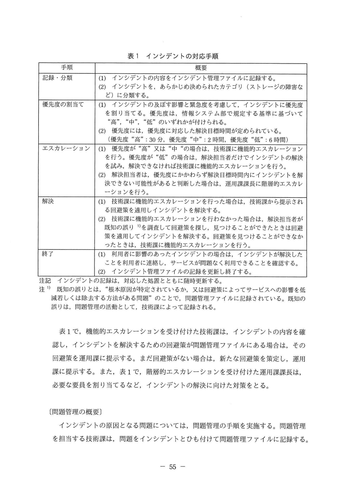
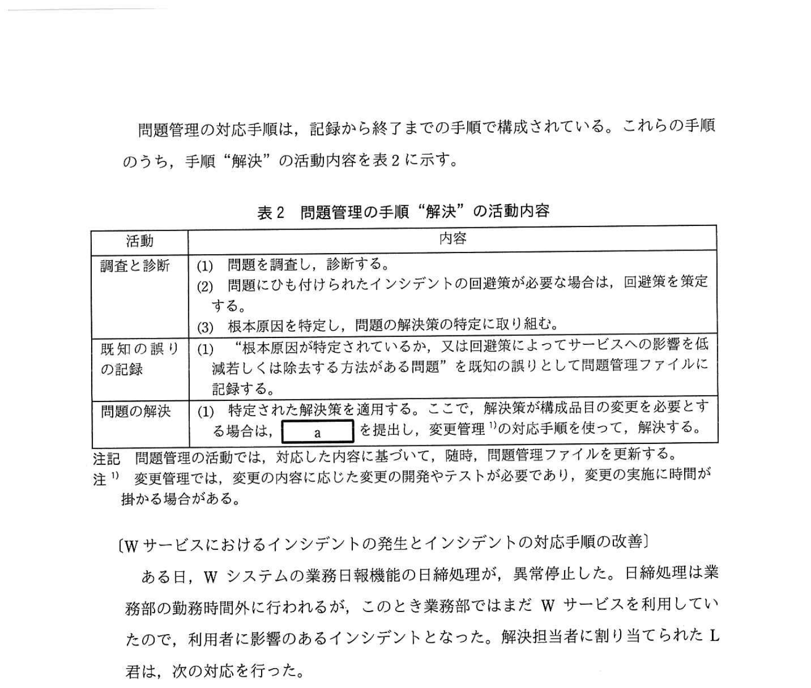

# 2022年春期（令和4年度春期）応用情報技術者試験 午後 問10（選択）
## サービスマネジメント：インシデント管理と問題管理（Wサービス・ITILプロセス）

---

## 問題文

**問10** サービスマネジメントにおけるインシデント管理と問題管理に関する次の記述を読んで、設問1〜3に答えよ。

団体Xは、職員数200名からなる公益法人で、県内の企業に対して、新規事業の創出や販路開拓の支援を行っている。団体Xの情報システム部は、団体Xの業務部部員の業務遂行に必要な業務目用情報共有機能もつ業務システム（以下、WシステムというJ）を開発・保守・運用し、業務部部員（以下、利用者という）に対してWサービスを提供している。

団体Xの情報システム部は、H部長の下、システムの開発・保守及び技術サポートを担当する技術課と、システムの運用を担当する運用課がある。運用課員、管理者のJ課長、運用業務のとりまとめを行うK主任及びK主任が複数の担当者で構成される。Wシステムの運用を行っている。また、運用課は、監視システムを使ってWシステムの機能及びを監視している。監視システムは、Wサービスの提供に影響を与える変化を検知し、監視メッセージとして運行担当者に送信している。

運用課の担当者は、インシデント管理と変更管理を担当している。また、技術課は、主に、問題管理及び変更管理を担当している。

---

### 〔インシデント管理の概要〕

運用担当者は、監視メッセージの通知や利用者からの問合せ内容から、インシデントの発生を認識し、K主任に報告する。K主任は、運用担当者の中から解決担当者を割り当てる。解決担当者は、情報システム部で定めたインシデントの対応手順に従って、インシデントを解決し、サービスを回復する。インシデントの対応手順を表1に示す。

### 表1 インシデントの対応手順

> | 手順 | 概要 |
> |------|------|
> | 記録・分類 | (1)インシデントの内容をインシデント管理ファイルに記録する。(2)インシデントを、あらかじめ定めたカテゴリに分類する（ストレージの障害など） |
> | 優先度の割当て | (1)インシデントの及ぼす影響と緊急度を考慮して、インシデントに優先度を割り当てる。(2)優先度は、情報システム部で規定する基準に従い「高」「中」「低」のいずれかで割り当てられる。(3)解決目標時間が設けられている |
> | エスカレーション | (1)優先度が「高」又は「中」の場合は、技術課のエスカレーションを行う。優先度が「低」の場合は、解決担当者だけでインシデントの解決を試みる。(2)技術課に機能的エスカレーションを行った場合は、解決担当者だけではインシデントの解決できない可能性があると判断した場合は、運用課長に階層的エスカレーションを行う |
> | 解決 | (1)技術課に機能的エスカレーションを行った場合は、技術課から提示される回避策に従って解決担当者が対処する。(2)技術課のエスカレーションを受けた後も解決できない場合は、解決担当者が他の技術員からも意見を聞いてインシデントの解決を試みる |
> | 終了 | (1)利用者に影響を及ぼしていたインシデントが解決したことを利用者に通知する。(2)インシデント管理ファイルの記録を更新して終了する |

注記 インシデントの対応手順のうち「根本原因は明らかにされているが、解決策はない場合」のことを、問題管理ファイルに記録されている。既知の誤りとして、問題管理に記載されている。既知の誤りとして解決策を見つけるまでの間の一時的な処置を回避策という。

表1で、機能的エスカレーションを受け付けた技術課は、インシデントの内容を確認し、インシデントを解決するための回避策を問題管理ファイルにある場合は、その回避策と運用方法を提示する。また、表に回避策がない場合は、新たな回避策を策定し、運用課に提示する。また、表に、階層的エスカレーションを受け付けた運用課長は、インシデントの解決に向けた対策を立案するなど、インシデントの解決向けた対処を行う。

---

### 〔問題管理の概要〕

インシデントの原因となる問題については、問題管理の手順を実施する。問題管理を担当する技術課は、問題をインシデントと紐付けて問題管理ファイルに記録する。

問題管理の対応手順は、記録から終了までの手順で構成されている。これらの手順のうち、手順「解決」の活動内容を表2に示す。

### 表2 問題管理の手順「解決」の活動内容

> | 活動 | 内容 |
> |------|------|
> | 調査と診断 | (1)問題を調査し、診断する。(2)問題にひもつけられたインシデントを把握し、根本原因の究明が必要な場合は、回避策を策定する。(3)根本原因を特定し、問題の解決方法を技術的に見出す |
> | 既知の誤りの記録 | (1)優先度が「高」又は「中」の場合は、解決担当者目標時間が2時間となった。(2)優先度"高"：30分、優先度"中"：6時間 |
> | 問題の解決 | (1)技術課に機能的エスカレーションを行った場合は、技術課から提示される回避策を適用する。(2)技術課のエスカレーションを受けた場合、変更管理の手順に従い対応する |

---

### 〔Wサービスにおけるインシデントの発生とインシデントの対応手順の改善〕

ある日、Wシステムの業務日常機能の日常管理が利用者に影響を及ぼすインシデントが発生した。解決担当者に割り当てられた L 君は次の対応を行った。

(1) インシデントの内容をインシデント管理ファイルに記録し、インシデントをあらかじめ定めたカテゴリに分類した。
(2) 規定の基準に基づき優先度を「中」と判定し、解決担当者目標時間が2時間となった。
(3) 運用担当者が機能的エスカレーションを行い、技術課のM君が対応した。
(4) インシデント発生から1時間経過してもM君からL君への回答がないので、L君は他の技術員からも意見を求めた。今回のインシデント対応する際に、M君は他の技術員に助けを求めることで解決に時間が掛かっていることにつき、L君は解決の状況を確認した。今回のインシデントは、過去に類似した問題が発生した再発インシデントと内容を調べると、今回のインシデントに対してレビューを行いインシデントの解決を防止するための対応を先行して行うことで利用者への影響を早期に解消した。
(5) L君は、技術課から提示された回避策の適用は少なくとも30分掛かると判断し、解決目標時間を超えてしまう可能性を考慮に入れて、直に回避策を適用してインシデントを解決した。結局、インシデント発生から2時間40分が経過していた。
(6) L君は、インシデントの対応手順の手順「終了」を行い、その後、状況をJ課長に報告した。

インシデント対応についての報告を受けたJ課長は、①**L君の対応に、インシデントの対応手順に沿っていない問題点がある**ことを指摘した。そこで、J課長は、今回のインシデント対応において解決の可能性があると考えた対策として、優先度が「中」の場合は、技術課に速やかに通知し、技術課は解決担当者と情報を共有し、連携してインシデント対応を行うという結論が得られ、運用課と技術課で `[　b　]` を取り交わした。

J課長は、今回のインシデント対応においてK君が運用課の業務を優先させた点について、運用課と技術課の協議を踏まえ、技術課に改善目標を設定するよう指示を受け、改善目標を設定することにした。

今回のインシデント対応において、技術課は、改善活動に取り組むこととした。

また、技術課は、問題管理ファイルの内容を調査して、問題管理の活動実態を分析した。分析の結果、技術課で問題管理の活動実態を分析したが、問題管理ファイルには回避策が記載されていたにもかかわらず問題管理ファイルに回避策が記録されるまでタイムラグが発生しているという問題点が存在することが明らかになった。技術課は、回避策が記録されている問題については、早急に問題管理ファイルに記録することとした。

次に、技術課は、今回のインシデントが再発インシデントであったことを踏まえ、再インシデントの発生状況を調査した。調査した結果、第2の活動「問題の解決」を行っているが、解決率が適正率を下回っていた。そこで、技術課は、再インシデントが多数発生している状況を解消するために、③**習慣的問題管理ファイルから早期に解決できる見込みの問題を抽出し、解決に必要なリソースを見直した**。

さらに、技術課は、問題管理として今まで実施していなかった④**プロアクティブな活動を継続的に行っていくべきだ**と考え、改善活動を進めていくことにした。

---

## 設問

### 設問1 表2中の `[　a　]` 及び本文中の `[　b　]` に入れる最も適切な字句を解答群の中から選び、記号で答えよ。

**解答群：**
- ア RFC
- イ RFI
- ウ 傾向分析
- エ 契約書
- オ 合意文書
- カ 予防処置

### 設問2 〔Wサービスにおけるインシデントの発生とインシデントの対応手順の改善〕について、(1)、(2)に答えよ。

**(1)** 本文中の下線①について、「インシデントの対応手順に沿っていない問題点」について、30字以内で述べよ。

**(2)** 本文中の下線②について、表1の手順「エスカレーション」に追加する手順の内容を、25字以内で述べよ。

### 設問3 〔問題管理の課題と改善策〕について、(1)〜(3)に答えよ。

**(1)** 本文中の下線③について、問題管理ファイルから抽出すべき問題の抽出条件を、表2中の字句を使って、30字以内で答えよ。

**(2)** 本文中の `[　c　]` に入れる適切な字句を5字以内で答えよ。

**(3)** 本文中の下線④の活動として正しいものを解答群の中から選び、記号で答えよ。

**解答群：**
- ア 発生したインシデントの解決を早めるために、機能的エスカレーションされたインシデントの回避策を策定する。
- イ 発生したインシデントの傾向を分析し、将来のインシデントを予防する万策を立案する。
- ウ 問題解決策の有効性を評価するために、解決策を実施した後にレビューを行う。
- エ 優先度"低"のインシデントが発生した場合においても、直ちに運用課から技術課に連絡する。

---

## 解答と解説

### 設問1 正解：a = ア（RFC）、b = オ（合意文書）

- **a = ア（RFC）**：表2中の「問題の解決」活動内容。問題の解決策を変更として実施するために「RFC（Request For Change：変更要求書）」を発行する。問題管理での変更実施には正式な変更管理プロセスへの入力としてRFCを使う。
- **b = オ（合意文書）**：運用課と技術課が連携するための合意内容を文書化したもの。SLA・OLA（運用レベル合意書）などに相当する「合意文書」。

**IPA公式：a=ア（RFC）、b=オ（合意文書）**

---

### 設問2

**(1) 正解：L君が階層的エスカレーションを行わなかった。（24字）**

問題点の分析：
- 優先度「中」でインシデントが解決目標時間（2時間）を超えそうになった時点で、L君は**J課長（上位）への階層的エスカレーション**を行うべきだったが行わなかった。
- 表1「エスカレーション」手順(2)に「解決担当者だけではインシデントの解決できない可能性があると判断した場合は、運用課長に階層的エスカレーションを行う」とある。

**IPA公式：L君が階層的エスカレーションを行わなかった**

**(2) 正解：既知の誤りを調査し回避策を見つける・解決担当者だけでインシデントの解決を試みる（IPA公式複数）**

エスカレーション手順への追加：
- 技術課に機能的エスカレーション後、技術課が速やかに回答しない場合の処置として、**「解決担当者だけでインシデントの解決を試みる」**手順を追加する。
- または既知の誤り（問題管理ファイル）を確認して回避策を適用する手順。

**IPA公式：既知の誤りを調査し回避策を見つける / 解決担当者だけでインシデントの解決を試みる**

---

### 設問3

**(1) 正解：根本原因と解決策が特定されている未解決な問題（23字）**

問題管理ファイルから早期解決できる見込みの問題を抽出する条件：
表2の「既知の誤りの記録」と「問題の解決」の活動から、**根本原因が特定され、解決策も判明しているが、まだ解決（変更適用）が完了していない問題**を抽出する。

**IPA公式：根本原因と解決策が特定されている未解決な問題**

**(2) 正解：c = 運用課だけでインシデントを解決する（IPA公式）**

表1「エスカレーション」の空欄c：優先度「低」の場合は技術課へのエスカレーションを行わず、「運用課だけでインシデントを解決する」という内容が入る。

**IPA公式：c=運用課だけでインシデントを解決する**

**(3) 正解：イ**

プロアクティブな問題管理の活動：
- **イ（正）**：「発生したインシデントの傾向を分析し、将来のインシデントを予防する万策を立案する」→ まだ発生していないインシデントを予防するための先手の活動＝プロアクティブ問題管理の本質。
- ア・ウ：リアクティブ（発生後の対応）な活動。
- エ：インシデント管理の活動であり問題管理ではない。

**IPA公式：イ**

---

## 参考：主要キーワード

| 用語 | 説明 |
|------|------|
| ITIL（IT Infrastructure Library） | ITサービスマネジメントのベストプラクティス集。インシデント管理・問題管理等のプロセスを定義 |
| インシデント管理 | サービスへの影響を最小化し、迅速にサービスを回復させるプロセス |
| 問題管理 | インシデントの根本原因を特定・解決し、再発を防止するプロセス |
| 既知の誤り（Known Error） | 根本原因は判明しているが、恒久解決策はまだない問題。回避策が存在する |
| 回避策（Workaround） | 恒久解決策が適用されるまでの一時的な処置 |
| 機能的エスカレーション | 専門知識や技術を持つ上位グループへの引き継ぎ |
| 階層的エスカレーション | 管理権限を持つ上位管理職への報告・承認依頼 |
| RFC（Request For Change） | 変更管理プロセスへの変更実施依頼書 |
| プロアクティブな問題管理 | インシデントが発生する前に傾向を分析して予防策を講じる先手の活動 |
| OLA（Operational Level Agreement） | 組織内部の部門間で締結する運用レベル合意書 |
