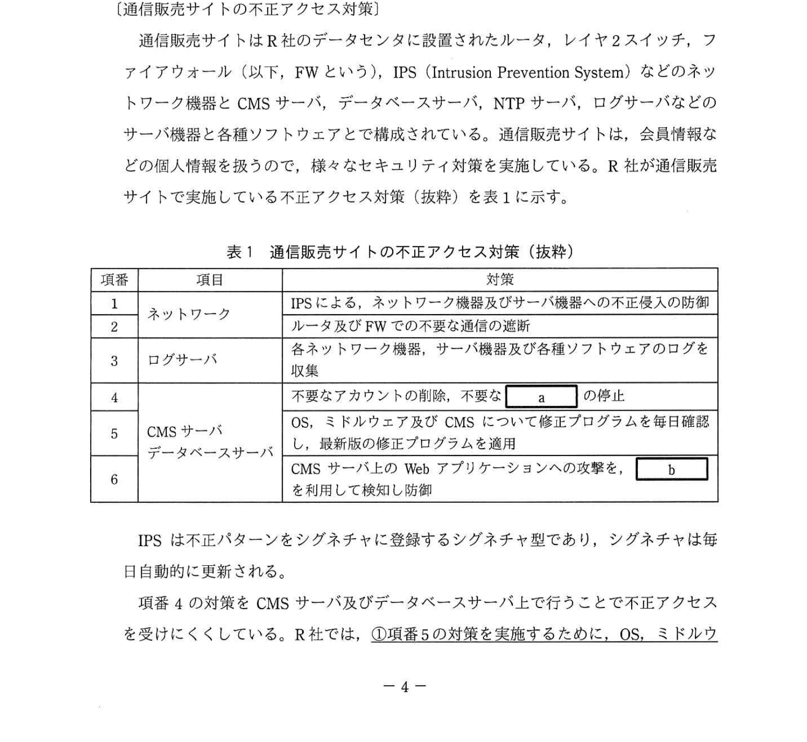
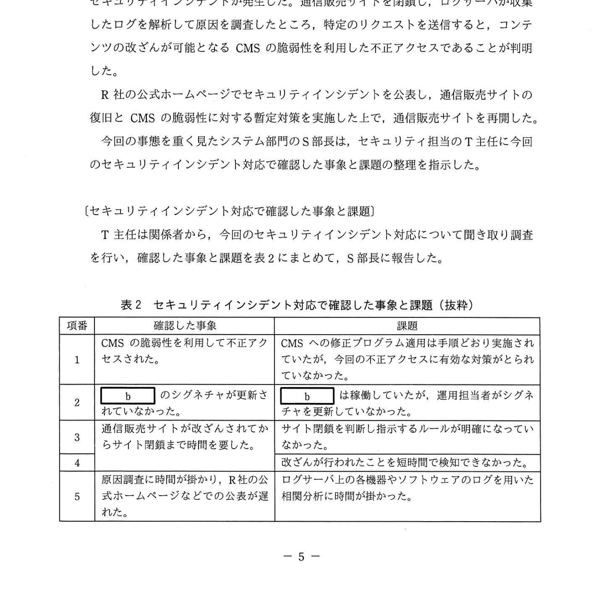

# 2022年春期（令和4年度春期）応用情報技術者試験 午後 問1（必須）
## 情報セキュリティ：通信販売サイトのセキュリティインシデント対応

---

## 問題文

**問1** 通信販売サイトのセキュリティインシデント対応に関する次の記述を読んで、設問1〜4に答えよ。

R社は、文房具やオフィス家具を製造し、店舗及び通信販売サイトで販売している。通信販売サイトでの購入には会員登録が必要である。通信販売サイトは EC サイト用 CMS（Content Management System）を利用して構築している。通信販売サイトの管理及び運用は、R社システム部門の運用担当者が実施している。通信販売サイトに関するお客様からの問合せは、システム部門のサポート担当者が対応している。

---

### 〔通信販売サイトの不正アクセス対策〕

通信販売サイトはR社のデータセンタに設置されたルータ、レイヤ2スイッチ、ファイアウォール（以下、FWという）、IPS（Intrusion Prevention System）などのネットワーク機器と CMS サーバ、データベースサーバ、NTP サーバ、ログサーバなどのサーバ機器と各種ソフトウェアとで構成されている。通信販売サイトは、会員情報などの個人情報を扱うので、様々なセキュリティ対策を実施している。R社が通信販売サイトで実施している不正アクセス対策（抜粋）を表1に示す。

### 表1 通信販売サイトの不正アクセス対策（抜粋）

> | 項番 | 対策 | 対策内容 |
> |------|------|---------|
> | 1 | ネットワーク | IPSによる、ネットワーク機器及びサーバ機器への不正侵入の防御、ルータ及びFWでの不要な通信の遮断 |
> | 2 | — | 各ネットワーク機器、サーバ機器及び各種ソフトウェアのログを収集 |
> | 3 | ログサーバ | 各ネットワーク機器、サーバ機器及び各種ソフトウェアのログを収集 |
> | 4 | — | 不要なアカウントの削除、不要な `[　a　]` の無効化 |
> | 5 | CMSサーバ・データベースサーバ | OS、ミドルウェア及びCMSについて修正プログラムを毎日確認し、最新版の修正プログラムを適用 |
> | 6 | — | CMSサーバのWebアプリケーションへの攻撃を、 `[　b　]` を利用して防御 |

IPS は不正パターンをシグネチャに登録するシグネチャ型であり、シグネチャは毎日自動的に更新される。

項番4の対策を CMS サーバ及びデータベースサーバに行うことで不正アクセスを受けにくくしている。R社では、①**項番5の対策を実施するために**、OS、ミドルウェア及びCMSについて修正プログラムの有無を確認している。また、項番6の対策で R社が利用しているのは `[　b　]` は、ソフトウェア型を導入しており、シグネチャは R社の運用担当者が、システムへの影響がないことを確認した上で更新している。

---

### 〔セキュリティインシデントの発生〕

ある日、通信販売サイトが改ざんされ、会員が不適切なサイトに誘導されるというセキュリティインシデントが発生した。ログサーバが収集したログを解析して原因を調査したところ、特定のリクエストを送ると、コンテンツの改ざんが可能となる CMS の脆弱性を利用した不正アクセスであることが判明した。

R社の公式ホームページをセキュリティインシデントを公表し、通信販売サイトの復旧と CMS の脆弱性に対する暫定対応を実施した上で、通信販売サイトを再開した。

今回の事態を重く見たシステム部門のS部長は、セキュリティインシデントを専門に扱い、インシデント発生時の情報収集と各担当へのインシデント対応の指示を行うランシデント対応チームを設置するとともに、今回確認した課題に対する再発防止策の立案をT主任に指示した。

---

### 〔セキュリティインシデント対応で確認した事象と課題〕

T主任は関係者から、今回のセキュリティインシデント対応について聞き取り調査を行い、確認した事象と課題を表2にまとめて、S部長に報告した。

### 表2 セキュリティインシデント対応で確認した事象と課題（抜粋）

> | 項番 | 確認した事象 | 課題 |
> |------|------------|------|
> | 1 | CMSの脆弱性を利用した不正アクセスを受けた | CMSサーバへの不正アクセスを今回の修正プログラム適用済みの状態で行っても有効な対策がとられていなかった |
> | 2 | `[　b　]` のシグネチャが更新されていたが、運用担当者がシグネチャを更新してしまった | — |
> | 3 | 通信販売サイトが改ざんされてからサイトを閉鎖するまで時間を要した | サイト修復のルールが明確になっていなかった |
> | 4 | 攻撃の改ざんが行われたことが分からなかった | — |
> | 5 | 原因調査時に情報が少なく、R社公式ホームページなどの公表が遅くなった | ログサーバが各ネットワーク機器、サーバ機器及び各種ソフトウェアからログを収集し情報分析に時間がかかった |

---

### 〔再発防止策〕

T主任は、再発防止策を、表2の各項目の対策を策定することとした。

項番1については、CMS サーバを模範とする OS、ミドルウェア及びCMSの脆弱性情報の収集や修正プログラムの適用は実施していたが、②**今回の不正アクセスのきっかけとなった**。このような場合、OS、ミドルウェア及びCMSに対する③**暫定対策を実施可能とするために**、暫定対策を策定することとした。

項番2については、 `[　b　]` の運用において、新しいシグネチャに更新した際に、デフォルト設定のセキュリティレベルが高い過ぎて正常な通信を遮断してしまうことがあることが判明した。運用担当者のスキルを考慮して、運用担当者はシグネチャ更新が不要となるクラウド型 `[　b　]` サービスを利用することにした。

項番3については、 `[　d　]` がセキュリティインシデントの影響度を判断し、サイト閉鎖を指示するルールを作成して、サイト閉鎖までの時間を短縮するようにした。

項番4については、サイトの改ざんが行われたことを検知する対策として、様々な検知方法の中から未知の改ざんに対してもサイトを改ざんを検知可能であること、加えて検知することができないことから、ハッシュリスト比較型を利用することにした。

項番5については、④**各ネットワーク機器、サーバ機器及び各種ソフトウェアからログを収集し、時系列などで利用分野が行い**、セキュリティインシデントの予兆や痕跡を検出して早期原因究明を通知するシステムの導入を検討することにした。

T主任は対策をまとめてS部長に報告し、了承された。

---

## 設問

### 設問1 表1中の `[　a　]` に入れる適切な字句を5字以内で答えよ。

### 設問2 本文及び表1、2中の `[　b　]` に入れる適切な字句をアルファベット3字で答えよ。

### 設問3 本文中の下線①で管理するべき内容を解答群の中から全て選び、記号で答えよ。

**解答群：**
- ア 販売価格
- イ バージョン
- ウ 名称
- エ ライセンス

### 設問4 〔再発防止策〕について、(1)〜(5)に答えよ。

**(1)** 本文中の下線②の状況を利用した攻撃の名称を8字以内で答えよ。

**(2)** 本文中の下線③について、暫定対策を策定可能かどうかを判断するために必要な対応を解答群の中から全て選び、記号で答えよ。

**解答群：**
- ア 過去の修正プログラムの内容を確認
- イ 修正プログラムの提供予定日を確認
- ウ 脆弱性の回避策を選定
- エ 同様の脆弱性が存在するソフトウェアを確認

**(3)** 本文中の `[　c　]` に入れる適切な字句を解答群の中から選び、記号で答えよ。

**解答群：**
- ア 過検知
- イ 機器故障
- ウ 未検知
- エ 予兆検知

**(4)** 本文中の `[　d　]` に入れる適切な組織名称を本文中の字句を用いて15字以内で答えよ。

**(5)** 本文中の下線④のシステム名称をアルファベット4字で答えよ。

---

## 解答と解説

### 設問1 正解：a = サービス

不要なアカウントの削除と並んで、不要な「サービス」の無効化がOS・サーバのセキュリティ強化の基本対策。攻撃面（アタックサーフェス）を減らす目的。

**IPA公式：a = サービス**

---

### 設問2 正解：b = WAF

WAF（Web Application Firewall）：Webアプリケーションへの攻撃（SQLインジェクション・XSS等）を検知・防御するファイアウォール。シグネチャ型のルールで攻撃パターンを識別する。

**IPA公式：b = WAF**

---

### 設問3 正解：イ（バージョン）

修正プログラムの適用管理では、OS・ミドルウェア・CMSの「バージョン」を把握しておくことが必要。どのバージョンに脆弱性が存在し、どの修正プログラムが必要かを特定するため。

---

### 設問4

**(1) 正解：ゼロデイ攻撃（6字）**

下線②「今回の不正アクセスのきっかけとなった」状況とは、修正プログラムが未リリースの状態でCMSの脆弱性が悪用されたこと。修正プログラムがリリースされる前（ゼロデイ）に攻撃が行われた。

**IPA公式：ゼロデイ攻撃**

**(2) 正解：ア（過去の修正プログラムの内容を確認）**

ゼロデイ脆弱性に対する暫定対策の策定には、過去の修正プログラムの内容を参照して回避可能な手段（WAFルール追加・設定変更等）を検討する必要がある。

**(3) 正解：c = ア（過検知）**

WAFのシグネチャを更新した際に、正常な通信が攻撃と誤って判断され遮断されてしまうのは「過検知（False Positive）」。

**IPA公式：c = ア（過検知）**

**(4) 正解：d = インシデント対応チーム（12字）**

本文に「インシデント対応チームを設置する」とある。このチームがセキュリティインシデントの影響度を判断し、サイト閉鎖指示を行う役割を担う。

**IPA公式：d = インシデント対応チーム**

**(5) 正解：SIEM（4字）**

SIEM（Security Information and Event Management）：各種機器・ソフトウェアのログを集中収集し、時系列分析・相関分析でセキュリティインシデントの予兆や痕跡を検出するシステム。

**IPA公式：SIEM**

---

## 参考：主要キーワード

| 用語 | 説明 |
|------|------|
| CMS（Content Management System） | Webサイトのコンテンツを管理するソフトウェア |
| IPS（Intrusion Prevention System） | 不正侵入を検知・防御するネットワーク機器。シグネチャで攻撃パターンを識別 |
| WAF（Web Application Firewall） | Webアプリケーション層の攻撃（SQLi・XSS等）を防御するファイアウォール |
| シグネチャ | 既知の攻撃パターンを定義したルール。定期更新が必要 |
| ゼロデイ攻撃 | 修正プログラムがリリースされる前に脆弱性を悪用する攻撃 |
| 過検知（False Positive） | 正常な通信を攻撃と誤って検知・遮断してしまうこと |
| SIEM | ログ集中管理・分析によりインシデント予兆・痕跡を検出するシステム |
| インシデント対応チーム | セキュリティインシデントの対応・調整を専門に行う組織 |
| ハッシュリスト比較型 | ファイルのハッシュ値を保存しておき、改ざんを検知する方式 |
