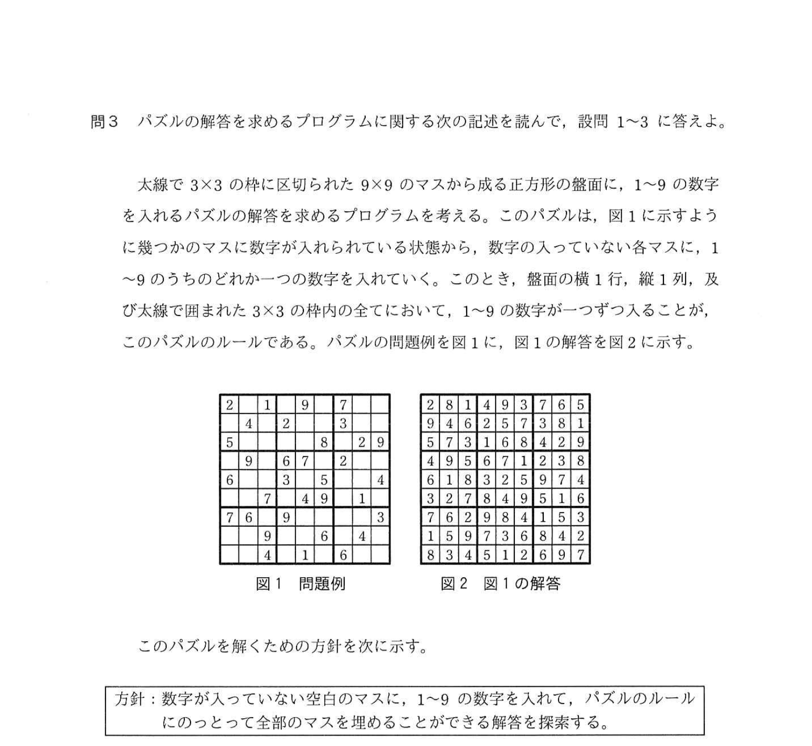
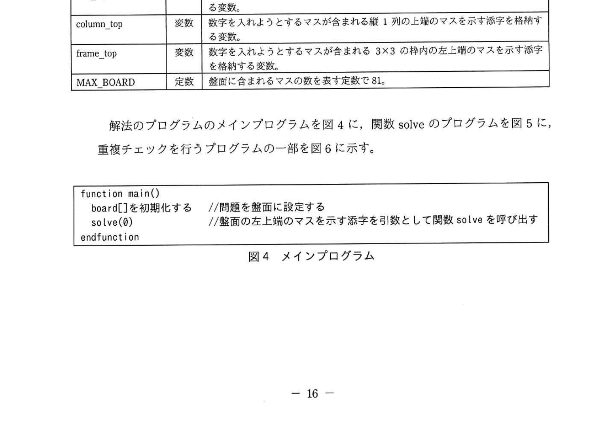
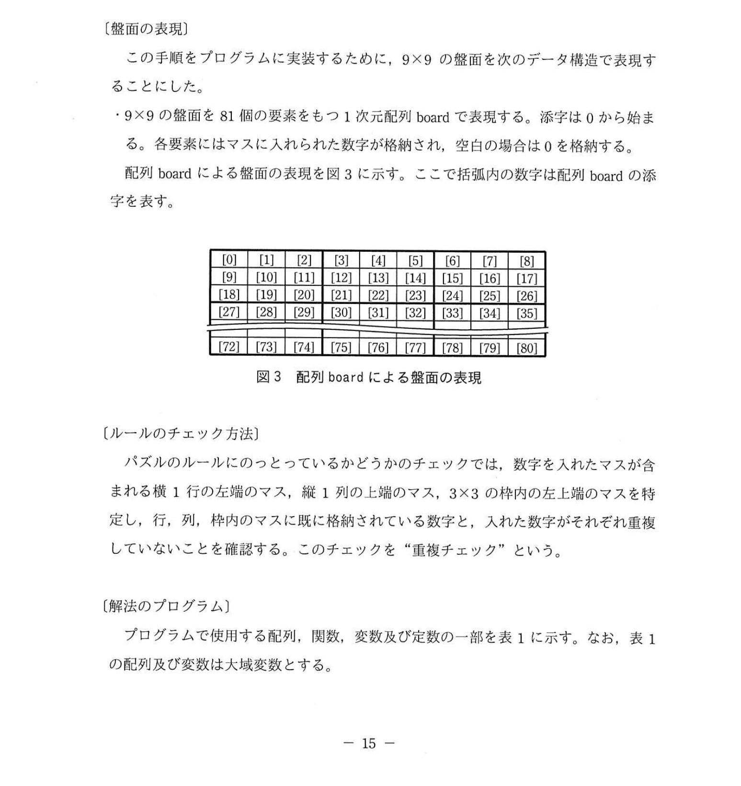
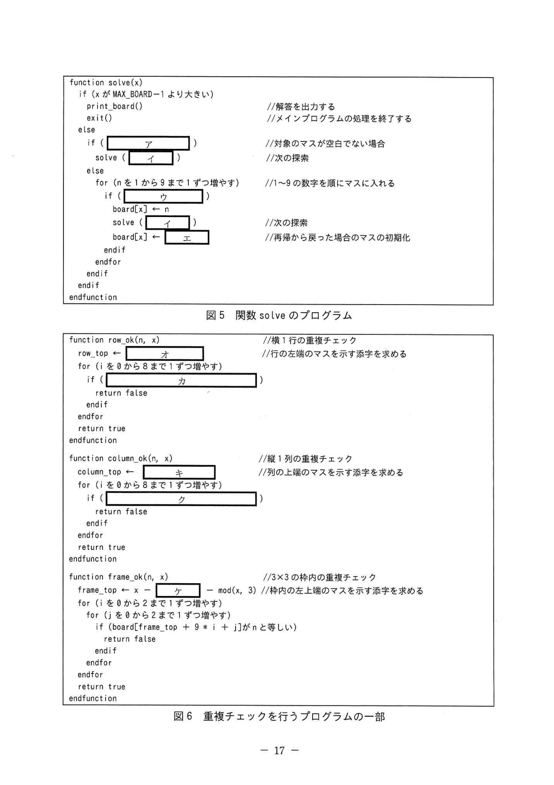
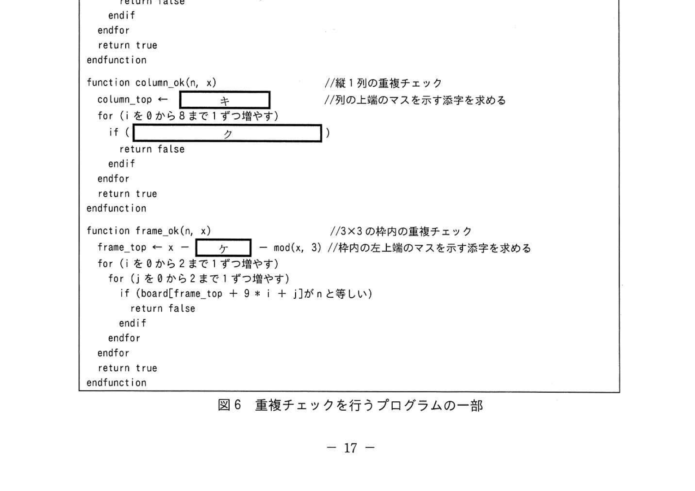
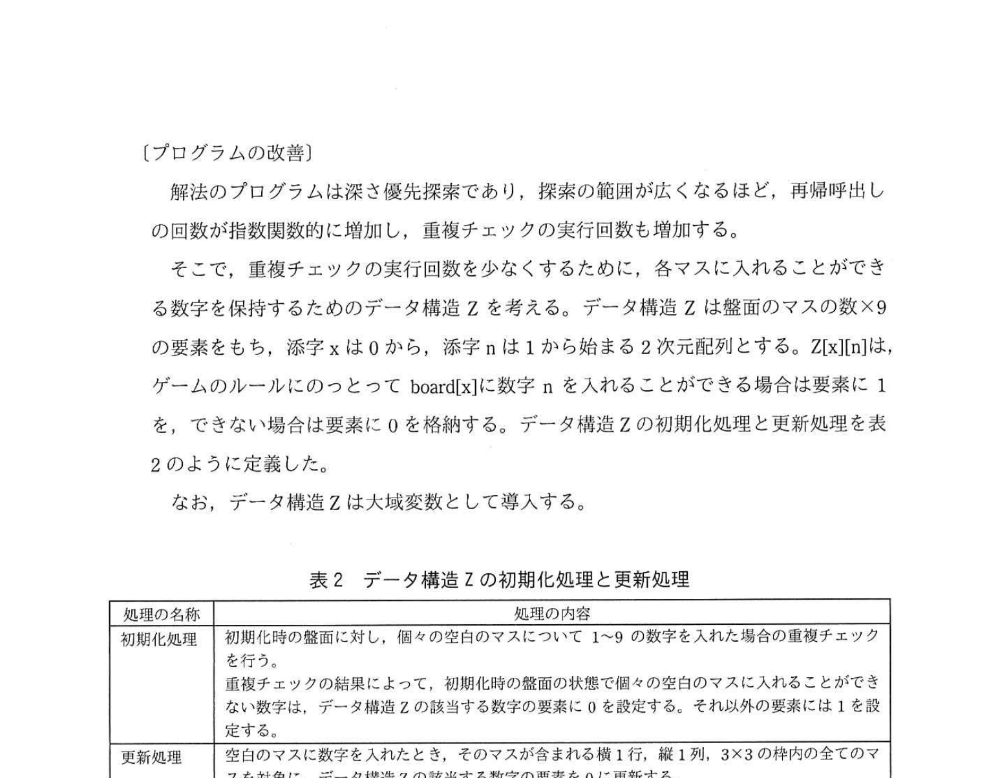

# 2022年春期（令和4年度春期）応用情報技術者試験 午後 問3（選択）
## プログラミング：パズルの解答を求めるプログラム（数独・深さ優先探索）

---

## 問題文

**問3** パズルの解答を求めるプログラムに関する次の記述を読んで、設問1〜3に答えよ。

太線で3×3の枠に区切られた9×9のマスから成る正方形の盤面に、1〜9の数字を入れるパズルの解答を求めるプログラムを考える。このパズルは、9×9のマスを使うように数字が埋め込まれている状態から、数字の入っていない各マスに、1〜9のうちのどれか一つの数字を入れていく。このことを、整数の配列とする。図1及び太線で囲まれた3×3の枠内の全てにおいて、1〜9の数字が一つずつ入ることが、このパズルのルールである。パズルの問題例を図1に、図1の解答を図2に示す。

### 図1・図2 問題例と解答



このパズルを解くための方針を次に示す。

> **方針：** 数字が入っていない空白のマスに、1〜9の数字を入れて、パズルのルールにのっとって全部のマスを埋めることができる解答を探索する。

この方針に沿ってパズルを解く手順を考える。

---

### 〔パズルを解く手順〕

(1) 盤面の左上端から探索を開始する。マスは左端から順に右方向に探索し、右端に達したら一行下がり、左端から探索する。
(2) 空白のマスを見つける。
(3) 見つけた空白のマスに、1〜9の数字を順番に入れる。
(4) 数字を入れたとき、その状態がパズルのルールにのっとっているかどうかをチェックする。
- (4-1) ルールにのっとっている場合は、(2)に進んで次の空白のマスを見つける。
- (4-2) ルールにのっとっていない場合は、(3)に戻って次の数字を入れる。このとき、入れる数字がない場合には、マスを空白に戻して一つ前に数字を入れたマスに戻り、(3)から再開する。
(5) 最後のマスまで数字が入り、空白のマスがなくなったら、それが解答となる。

---

### 〔盤面の表現〕

この手順をプログラムに実装するために、9×9の盤面を次のデータ構造で表現することにした。

- 9×9の盤面を81個の要素をもつ1次元配列 board で表現する。添字は0から始まる。
- 各要素にはマスには0から始まり9まで格納され、空白の場合は0を格納する。
- 配列 board による盤面の表現を図3に示す。この中で括弧内の数字は配列 board の添字を表す。

### 図3 配列 board による盤面の表現



---

### 〔ルールのチェック方法〕

パズルのルールにのっとっているかどうかのチェックでは、数字を入れたマスが含まれる横1行の左端のマス、縦1列の上端のマス、3×3の枠内の左上端のマスを特定し、行、列、枠内のマスに既に格納されている数字と、入れた数字がそれぞれ重複していないことを確認する。このチェックを"**重複チェック**"という。

---

### 〔解法のプログラム〕

プログラムで使用する配列、関数、変数及び定数の一部を表1に示す。なお、表1の配列及び変数は大域変数とする。

### 表1 プログラムで使用する配列、関数、変数及び定数の一部



> | 名称 | 種類 | 説明 |
> |------|------|------|
> | board[] | 配列 | 盤面の情報を格納する配列。初期化時には問題に合わせて盤面に数字が設定される |
> | solve(x) | 関数 | パズルを解く処理を実行する関数 |
> | row_ok(n, x) | 関数 | 1行の重複チェックを行う関数。チェック対象のマス x。チェック対象のマスを含む行で n が重複していない場合は true を返す |
> | column_ok(n, x) | 関数 | 縦1列の重複チェックを行う関数。チェック対象のマス x。チェック対象のマスを含む列で n が重複していない場合は true を返す |
> | frame_ok(n, x) | 関数 | 3×3の枠内の重複チェックを行う関数。チェック対象のマス x。チェック対象のマスを含む3×3の枠内で n が重複していない場合は true を返す |
> | check_ok(n, x) | 関数 | row_ok、column_ok、frame_ok を呼び出し、全ての重複チェックを実行する関数。重複がない場合は true を返す |
> | div(a, m) | 関数 | a を m で割った商を求める関数 |
> | mod(a, m) | 関数 | a を m で割った余りを求める関数 |
> | print_board() | 関数 | board[] の内容を9×9の形式に出力する関数 |
> | row_top | 変数 | 数字を入れようとするマスが含まれる横1行の上端のマスを示す添字 |
> | column_top | 変数 | 数字を入れようとするマスが含まれる縦1列の上端のマスを示す添字 |
> | frame_top | 変数 | 数字を入れようとするマスが含まれる3×3の枠内の左上端のマスを示す添字 |
> | MAX_BOARD | 定数 | 盤面に含まれるマスの数 |

解法のプログラムのメインプログラムを図4に、関数 solve のプログラムを図5に、重複チェックを行うプログラムの一部を図6に示す。

```
function main()
  board[]を初期化する    //問題を盤面に設定する
  solve(0)              //盤面の左上端のマスを示す添字を引数として関数 solve を呼び出す
endfunction
```
**図4 メインプログラム**

### 図5 関数 solve のプログラム



```
function solve(x)
  if (x が MAX_BOARD-1 より大きい)
    print_board()           //解答を出力する
    exit()                  //メインプログラムの処理を終了する
  else
    if ( ア )              //対象のマスが空白でない場合
      solve( イ )          //次の探索
    else
      for (n を1から9まで1ずつ増やす)
        if ( ウ )
          board[x] ← n
          solve( エ )      //次の探索
          board[x] ← 0    //再帰から戻った場合の空白マスの初期化
        endif
      endfor
    endif
  endif
endfunction
```

### 図6 重複チェックを行うプログラムの一部



```
function row_ok(n, x)              //横1行の重複チェック
  row_top ← ア                    //行の左端のマスを示す添字を求める
  for (i を0から8まで1ずつ増やす)
    if ( オ )
      return false
    endif
  endfor
  return true
endfunction

function column_ok(n, x)           //縦1列の重複チェック
  column_top ← カ                 //列の上端のマスを示す添字を求める
  for (i を0から8まで1ずつ増やす)
    if ( キ )
      return false
    endif
  endfor
  return true
endfunction

function frame_ok(n, x)            //3×3の枠内の重複チェック
  frame_top ← x ― ク  ― mod(x, 3)  //枠内の左上端のマスを示す添字を求める
  for (i を0から2まで1ずつ増やす)
    for (j を0から2まで1ずつ増やす)
      if (board[frame_top + 9 * i + j]がnと等しい)
        return false
      endif
    endfor
  endfor
  return true
endfunction
```

---

### 〔プログラムの改善〕

解法のプログラムは深さ優先探索であり、探索の範囲が広くなるほど、再帰呼び出しの回数が指数関数的に増加し、重複チェックの実行回数も増加する。

そこで、空白のマスに入れることができる数字を保持するデータ構造Zを考える。データ構造Zは盤面のマスの数×9の2次元配列とする。添字[x][n]は盤面の位置xのマスにnを入れることができるときは1を格納する。データ構造Zの初期化処理と更新処理を表2のように定義した。

### 表2 データ構造Zの初期化処理と更新処理



> | 処理の名称 | 処理の内容 |
> |-----------|----------|
> | 初期化処理 | 初期化時に盤面に関連する全てのマスについて、1〜9の数字を入れた場合の重複チェックを行う。重複がなければ1、重複があれば0を空白のマスに格納する。初期化の結果、データ構造Zの空白でないマスについて、そのマスの数字のみが1となるように設定する |
> | 更新処理 | 空白のマスに数字を入れたとき、そのマスと同じ行、列、3×3の枠内の全てのマスについて、データ構造Zの数字のエントリを0に更新する |

〔パズルを解く手順〕の(2)〜(5)を次の(2)〜(4)のように変えた。

(2) 空白のマスを見つける。
(3) データ構造Zを参照し、(2)で見つけた空白のマスに入れることができる数字のリストの先頭に入れる。
- (3-1) 入れる数字がある場合、**①処理Aを行った**後、マスに数字を入れる。その後、データ構造Zの更新処理を行い、(2)に進んで次の空白のマスを見つける。
- (3-2) 入れる数字がない場合、マスを空白に戻し、**②処理Bを行った**後、一つ前に数字を入れたマスに戻り、戻ったマスで取得したリストの次の数字から再開する。
(4) 最後のマスまで数字が入り、空白のマスがなくなったら、それが解答となる。

---

## 設問

### 設問1 図5中の `[　ア　]` 〜 `[　エ　]` に入れる適切な字句を答えよ。

### 設問2 図6中の `[　オ　]` 〜 `[　ク　]` に入れる適切な字句を答えよ。

### 設問3 〔プログラムの改善〕について、下線①の処理A及び下線②の処理Bの内容を、"データ構造Z"という字句を含めて、それぞれ20字以内で述べよ。

---

## 解答と解説

### 設問1 正解

| 空欄 | 正解 | 解説 |
|------|------|------|
| **ア** | board[x] が0でない | 空白でないマス（0以外が入っている）の判定 |
| **イ** | x + 1 | 現在のマスの次のマス（インデックスを1増やす） |
| **ウ** | check ok(n, x) が true と等しい | n がルールにのっとって入れられるか確認 |
| **エ** | x + 1 | 数字を入れた後、次のマスへ再帰する |

**IPA公式：ア=board[x]が0でない、イ=x+1、ウ=check ok(n,x)がtrueと等しい、エ=θ（0）**

---

### 設問2 正解

| 空欄 | 正解 | 解説 |
|------|------|------|
| **オ** | div(x, 9) + 9 | 行の左端添字：x ÷ 9 の商 × 9（例：x=14なら div(14,9)=1 → row_top=9） |
| **カ** | board[row_top + i] が n と等しい | 行の左端から i番目のマスと n の比較 |
| **キ** | mod(x, 9) | 列の上端添字：x mod 9 が列番号（例：x=14なら mod(14,9)=5 → column_top=5） |
| **ク** | board[column_top + 9 * i] が n と等しい | 列の上端から i行下のマスと n の比較 |

**IPA公式（設問2）：**
- オ = div(x, 9) + 9 → row_top = 行番号×9 （行の左端）
- カ = board[row_top + i] が n と等しい
- キ = mod(x, 9) → column_top = 列番号
- ク = board[column_top + 9+i] が n と等しい

frame_ok での `ク`：`mod(x, 3)` の前に引くのは `mod(x, 9) - mod(x, 3)` →  
frame_top = x - (mod(x, 9) - mod(x, 3)) - (div(x, 9) - mod(div(x, 9), 3)) × 9

**IPA公式：オ=div(x,9)×9、カ=board[row_top+i]がnと等しい、キ=mod(x,9)、ク=board[column_top+9×i]がnと等しい**

---

### 設問3 正解

| | 正解 | 解説 |
|---|------|------|
| **処理A（下線①）** | データ構造Zを逆遷する（逆順のリストを保存） | 数字を入れる前のデータ構造Zの状態を保存する（バックトラック時に復元するため） |
| **処理B（下線②）** | 逆遷したデータ構造Zを取り出す | バックトラック時に、処理Aで保存した前の状態のデータ構造Zを復元する |

**IPA公式：処理A=データ構造Zを逆遷する、処理B=逆遷したデータ構造Zを取り出す**

---

## 参考：主要キーワード

| 用語 | 説明 |
|------|------|
| 深さ優先探索（DFS） | 探索木を深い方向に優先して探索するアルゴリズム |
| バックトラック | 行き詰まった際に一つ前の状態に戻り、別の候補を試す手法 |
| 再帰関数 | 自分自身を呼び出す関数。パズル探索の実装に多用される |
| 1次元配列による2次元表現 | 9×9を81要素の1次元配列で表現。添字変換で行・列を特定 |
| 重複チェック | 行・列・3×3枠内に同じ数字がないかを確認する検証処理 |
| データ構造Z | 各マスに入れられる数字の候補リスト。更新で枝刈りを実現 |
| div(a,m) | 整数除算（商を返す） |
| mod(a,m) | 剰余演算（余りを返す） |
