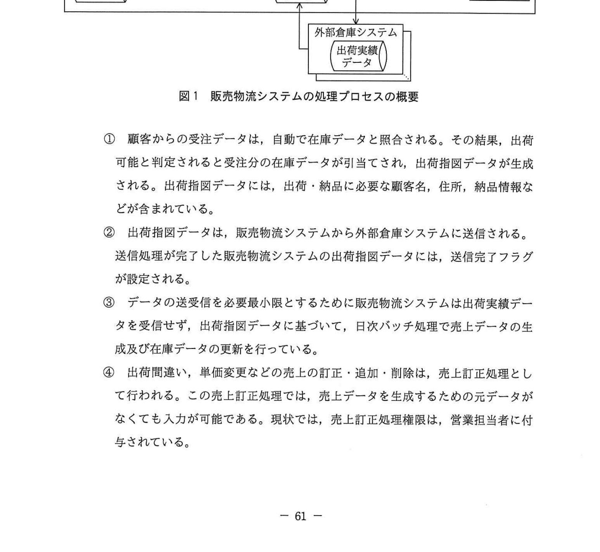
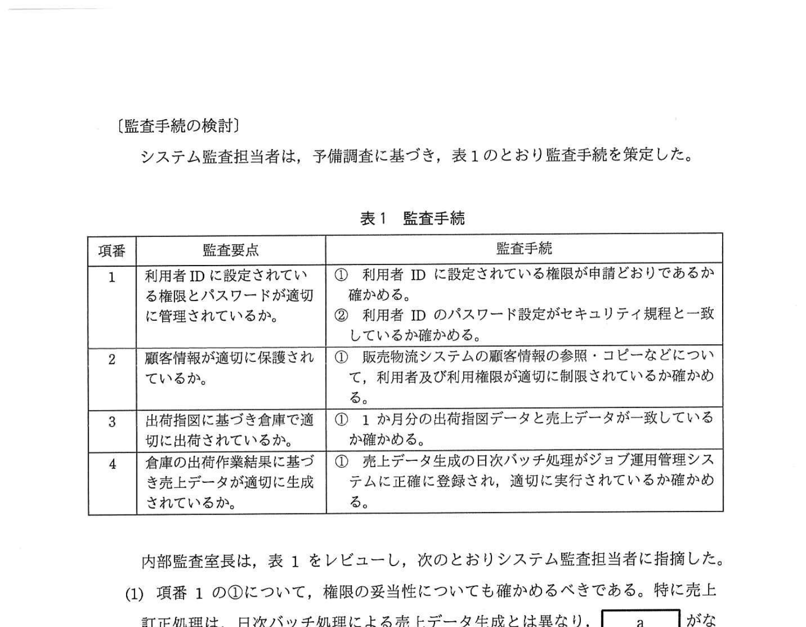
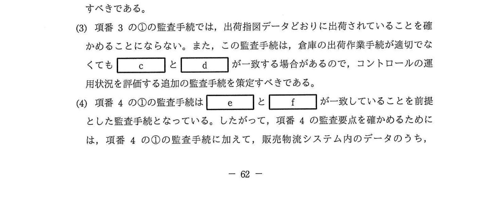

# 2022年春期（令和4年度春期）応用情報技術者試験 午後 問11（必須）
## システム監査：販売物流システムのシステム監査

---

## 問題文

**問11** 販売物流システムの監査に関する次の記述を読んで、設問1〜4に答えよ。

食品製造販売会社であるU社は、全国に10カ所の製品出荷用の倉庫があり、複数の物流会社に倉庫業務を委託している。U社では、健康食品などの個人顧客向けの通信販売が拡大していることから、倉庫業務における出荷データの信頼性が求められている。

そこで、U社の内部監査室では、主として販売物流システムに係るコントロールの運用状況についてシステム監査を実施することにした。

---

### 〔予備調査の概要〕

U社の販売物流システムについて、予備調査で入手した情報は次のとおりである。

**(1) 販売物流システムの概要**

① 販売物流システムは、顧客からの受注情報の管理、倉庫への出荷指図、売上・請求管理、在庫管理、及び顧客属性などの顧客情報管理の機能を有している。

② 物流会社は、会社ごとに独自の倉庫システム（以下、外部倉庫システムという）を導入し、倉庫業務を行っている。外部倉庫システムは、物流会社や倉庫の規模などによって、システムや通信の品質・性能・機能などに大きな違いがある。したがって、販売物流システムと外部倉庫システムとの送受信の頻度などは必要最小限としている。

③ 販売物流システムのバッチ処理は、ジョブ運用管理システムにより自動実行され、実行結果はジョブ運用管理システムに保管される。

④ 販売物流システムは、現在の承認済の承認された ID 申請書に基づいて登録された利用者 ID ごとに入力・照合などの利用権限が適切に制限されている。また、利用者IDのパスワードは、セキュリティ規程に準拠して設定されている。

⑤ 倉庫残高データは、日次の出荷作業後に外部倉庫システムから販売物流システムに送信されている。倉庫残高データは、倉庫ごとの当日作業終了後の翌日別の在庫残高数量を表したものである。当初はこの倉庫残高データを受信した際に出荷可能な受注データの出荷可否判定処理を行っていた。しかし、2年前から販売物流システムの在庫データに基づいて出荷可否判定が可能になったのである。現状の倉庫残高データは製品の実地棚卸などで利用されているだけである。

**(2) 販売物流システムの処理プロセスの概要**

販売物流システムの処理プロセスの概要は、図1のとおりである。

### 図1 販売物流システムの処理プロセスの概要

① 顧客からの受注データは、自動で在庫データと照合される。その結果、出荷可能と判定された受注分の在庫データを引当する。出荷指図データが生成される。出荷指図データには、出荷・納品に必要な顧客名、住所、品品情報などが含まれている。

② 出荷指図データは、販売物流システムから外部倉庫システムに送信される。送信完了した販売物流システムの出荷指図データには、送信完了フラグが設定される。

③ データの送受信を最低限にするため、販売物流システムは出荷実績データを受信し、日次バッチ処理で毎日上半処理で売上データの生成及び在庫データの更新を行っている。

④ 出荷問題は、単価変更などその売上上の訂正・追加・削除は、売上訂正処理として行われる。この売上訂正処理では、売上データを生成するためのデータが必要なデータである。現状では、売上訂正処理権限は、営業担当者に付与されている。

---

### 〔監査手続の検討〕

システム監査担当者は、予備調査に基づき、表1のとおり監査手続を策定した。

### 表1 監査手続

> | 項番 | 監査要点 | 監査手続 |
> |------|---------|---------|
> | 1 | 利用者 ID に設定されている権限とパスワードが適切に管理されている。 | ①利用者IDに設定されている権限が承認済み申請書どおりであるか確認する。②利用者IDのパスワード設定がセキュリティ規程と一致しているか確認する。 |
> | 2 | 顧客情報が適切に保護されている。 | ①販売物流システムの顧客情報の参照・コピーなどについて、`[　b　]` について確認すべき事項を検討する。 |
> | 3 | 出荷指図に基づき倉庫で適切に出荷されていることが確認できる。 | ①出荷指図データおどりに出荷されていることを確認するために販売物流システムの出荷帳票処理が適切に行われているか確認する。さらに、台帳の出荷作業件数が適切にならない場合があるとき、コントロールの運用状況を評価する追加の監査手続を策定する。 |
> | 4 | 倉庫の在庫残高が適切に管理されている。 | ①1カ月分の出荷指図データと売上データが一致しているかを確認する小規模な棚卸の監査手続を策定する。 |

内部監査室長は、表1をレビューし、次のとおりシステム監査担当者に指摘した。

(1) 項番1の①について、権限の妥当性についても確認べきである。特に売上訂正処理は、日次バッチ処理による売上データ生成とは異なり、`[　a　]` がなくても可能なので、不正のリスクが高い。このリスクに対してコントロールの運用は①**このコントロールの運用では対応できない可能性があるので**、運用の妥当性について本項番で確認する必要がある。

(2) 項番2の監査要点を絞めるためには、販売物流システムだけを監査対象とすることでは不十分で、`[　b　]` についても検討すべきである。

(3) 項番3の監査手続では、出荷指図データおどりに出荷されていることを確認するだけにとどまらず、台帳の出荷作業件数が適切にならない場合があっても、コントロールの運用状況を評価するため、追加の監査手続を策定する必要がある。なお、`[　c　]` と `[　d　]` が一致する場合がある。コントロールの運用状況を評価する追加の監査手続を策定する必要がある。

(4) 項番4の監査手続では、`[　e　]` と `[　f　]` が一致していることを照合することで、コントロールが整備され、有効に運用されているかを確認できる。さらに、項番4の①の監査手続に加えて、販売物流システム内のデータのうち、`[　g　]` と `[　h　]` を照合するコントロールが整備され、有効に運用されているかを本調査で確認すべきである。

---

## 設問

### 設問1 〔監査手続の検討〕の `[　a　]`、`[　b　]` に入れる適切な字句をそれぞれ10字以内で答えよ。

### 設問2 〔監査手続の検討〕の(1)について、内部監査室長が下線①と指摘した理由を25字以内で述べよ。

### 設問3 〔監査手続の検討〕の `[　c　]`、`[　d　]` に入れる適切な字句をそれぞれ10字以内で答えよ。

### 設問4 〔監査手続の検討〕の `[　e　]` 〜 `[　h　]` に入れる最も適切な字句を解答群の中から選び、記号で答えよ。

**解答群：**
- ア ID申請書
- イ 売上訂正処理
- ウ 売上データ
- エ 在庫データ
- オ 受注データ
- カ 出荷指図データ
- キ 出荷実績データ
- ク 倉庫残高データ
- ケ 利用者IDの権限

---

## 解答と解説

### 設問1 正解：a = 出荷指図データ、b = 各部倉庫システム

- **a = 出荷指図データ**：売上訂正処理は「日次バッチ処理による売上データ生成とは異なり、出荷指図データがなくても可能」という文脈。売上訂正は出荷実績に基づかず手動で行えるため不正リスクが高い。
- **b = 各部倉庫システム（外部倉庫システム）**：顧客情報の保護を確認するためには、販売物流システムだけでなく、顧客情報を取り扱う**各部倉庫システム**も監査対象とする必要がある。

**IPA公式：a=出荷指図データ、b=各部倉庫システム**

---

### 設問2 正解：業務担当者に売上訂正処理権限があるから。（23字）

売上訂正処理権限は「営業担当者（業務担当者）」に付与されている。この権限を利用すれば、承認なしに売上データを修正できてしまう。項番1の利用者ID権限確認コントロールでは、「権限が正しく設定されているか」を確認するだけで、「業務担当者が不正な売上訂正を行っていないか」という運用上のリスクには対応できない。

---

### 設問3 正解：c と d（IPA公式による）

出荷指図データが外部倉庫システムに送信された後、外部倉庫システムから出荷実績データが返送される流れを照合する監査手続。

- **c = 出荷指図データ**：送信した出荷指図
- **d = 出荷実績データ**：外部倉庫システムから受信した実績データ

この2つが一致することを確認することで、出荷指図どおりに倉庫で出荷が行われたことを確認できる。

---

### 設問4 正解：e = カ（出荷指図データ）、f = キ（出荷実績データ）、g = ク（倉庫残高データ）、h = エ（在庫データ）

- **e = カ（出荷指図データ）**：倉庫に送った出荷指示
- **f = キ（出荷実績データ）**：実際の出荷結果。e（出荷指図）とf（出荷実績）を照合することで出荷の完全性を確認
- **g = ク（倉庫残高データ）**：外部倉庫システムから送られる在庫残高。現状は実地棚卸にのみ利用
- **h = エ（在庫データ）**：販売物流システム内の在庫データ。g（倉庫残高）とh（在庫データ）を照合することで在庫管理の正確性を確認

**IPA公式：e=カ、f=キ、g=ク、h=エ**

---

## 参考：主要キーワード

| 用語 | 説明 |
|------|------|
| システム監査 | 情報システムのコントロール（内部統制）が適切に整備・運用されているかを評価する活動 |
| 予備調査 | 監査対象の概要把握・リスク評価を行う監査の準備段階 |
| 監査要点 | 監査で確認すべき内部統制上のポイント・コントロール目標 |
| 監査手続 | 監査証拠を入手するための具体的な手順・方法 |
| 出荷指図データ | 顧客受注に基づいて倉庫への出荷を指示するデータ |
| 出荷実績データ | 外部倉庫システムから送信される実際の出荷完了データ |
| 倉庫残高データ | 外部倉庫システムが保持する実際の在庫残高データ |
| 在庫データ | 販売物流システム内で管理される在庫データ |
| 売上訂正処理 | 出荷後に売上データを手動で修正・追加・削除する処理 |
| コントロール（内部統制） | 不正・誤謬・システム障害等のリスクを低減するための仕組みや規程 |
| 権限の分離 | 申請・承認・実行を異なる担当者が行う職務分離による不正防止策 |
