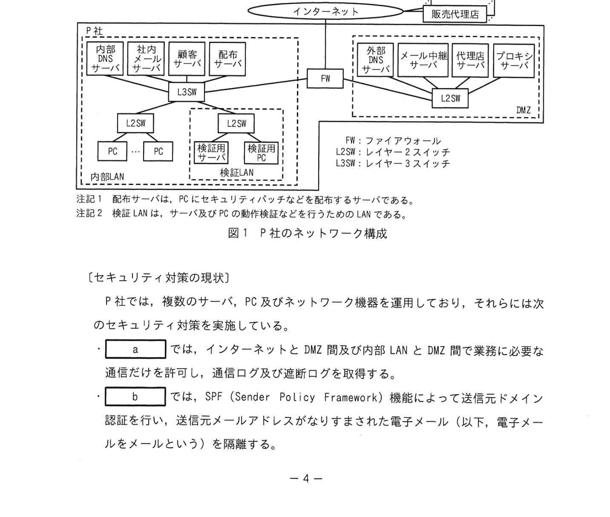

# 2022年秋期（令和4年度秋期）応用情報技術者試験 午後 問1（必須）
## 情報セキュリティ：マルウェアへの対応策（EMOTET・EDR）

---

## 問題文

**問1** マルウェアへの対応策に関する次の記述を読んで、設問に答えよ。

P社は、従業員数400名のIT関連製品の卸売会社であり、300社の販売代理店をもっている。P社では、販売代理店向けに、インターネット経由で商品情報の提供、見積書の作成を行う代理店サーバを運用している。また、業務系向けに、代理店ごとの卸価格や担当者の情報を管理する顧客サーバを運用している。代理店サーバ及び顧客サーバには、HTTP Over TLS でアクセスする。

P社のネットワーク及び情報セキュリティインシデント対応は、情報システム部（以下、システム部という）の運用グループが行っている。

P社のネットワーク構成を図1に示す。

### 図1 P社のネットワーク構成

> **内部LAN：**PC、PC群（認証端末）  
> **DMZ：**メールサーバ、配布サーバ、代理店サーバ、プロキシサーバ  
> **外部DNS（インターネット側）**  
> FW：ファイアウォール、L2SW：レイヤー2スイッチ、L3SW：レイヤー3スイッチ  
>
> 注記1：配布サーバは、PCにセキュリティパッチなどを配布するサーバである。  
> 注記2：検証LANは、サーバ故障などの動作検証を行うためのLANである。

---

### 〔セキュリティ対策の現状〕

P社では、複数のサーバ、PC及びネットワーク機器を運用しており、それらには次のセキュリティ対策を実施している。

- `[　a　]` では、インターネットとDMZ間及び内部LAN間で通信に必要な通信だけを許可し、通信ログ及び遮断ログを取得する。
- `[　b　]` では、SPF（Sender Policy Framework）機能によって送信元ドメイン認証を行い、送信元メールアドレスが正当なドメインから生成されたものでないメールをメールという）を隔離する。
- 外部DNSサーバでは、DMZのゾーン情報の管理のほか、キャッシュサーバの機能を搭載させており、外部DNSサーバを③**DNS踏み台攻撃**への対策を行う。
- P社はインターネット上のWebサーバのアクセスは、DMZのプロキシサーバを経由し、通信ログを取得する。
- PCやサーバで稼働するマルウェア対策ソフトをチェックし、毎日、決められた時刻にベンダーのWebサイトをチェックし、マルウェア定義ファイルが新たに登録されている場合は、ダウンロードして更新する。
- システム部の担当者は、毎日、ベンダーのWebサイトをチェックし、OSのセキュリティパッチやアップデート版の最新版が確認された場合、最新版が更新された場合、`[　c　]` に登録し、サーバ向けのものは、休日に担当者が各サーバに対して更新作業を行う。
- PCは、電源投入時に `[　c　]` にアクセスし、更新が必要な新しい版が登録されている場合は、ダウンロードして更新処理を行う。
- FWやプロキシサーバの検査は、担当者が週に1回実施する。

---

### 〔マルウェアXの調査〕

ある日、システム部のQ課長は、マルウェアXの被害が社外で多発していることを知り、R主任にマルウェアXの調査を指示した。R主任による調査結果を次に示す。

(1) 攻撃者は、不正なマクロを含む文書ファイル（以下、マクロ付き文書ファイルAという）をメールに添付して送付する。

(2) 受信者が、添付されたマクロ付き文書ファイルAを開きマクロを実行させると、マルウェアXの指令や不正アクセスの制御を行うインターネット上のC&Cサーバと通信し、マルウェアXの本体がダウンロードされる。

(3) PCに侵入したマルウェアXは、内部ネットワークの探索、情報の収集・窃取した情報のC&Cサーバへの送受信及び感染拡大などを、次の(a)〜(d)の手順で試みる。

- (a) ②**PCが接続するセグメント及び対社内の他のセグメントの全てのホストアドレス宛に、別のアドレスを変えながらICMPエコー要求パケットを送信し、稼働ホスト情報を取得する。**
- (b) (a)によって情報を取得できたホストに対して、攻撃対象のポート番号をセットしたTCPのSYNパケットを送信し、応答内容を確認する。
- (c) (b)でポート番号の応答があったサービスの脆弱性を悪用して個人情報や秘密情報などを窃取し、C&Cサーバに送信する。
- (d) 侵入したPCにマクロ付き文書ファイルAを添付した返信メールを作成し、このメールを取り引き先などに送信し感染拡大を図る。

R主任が調査結果をQ課長に報告したとき、2人の会話を次に示す。

Q課長：マルウェアXについて、現在の対策で十分か考えなさい。  
R主任：十分ではないと考えます。添付文書ファイルに組み込まれたマクロは、容易に処理内容が分析できない複雑な構造になっており、マルウェア対策ソフトで発見できない場合もあります。また、④**マルウェアXに感染した社外のPCから送付されたメールは、SPF機能ではなりすまし判定ができません。**  
Q課長：それでは、有効な対応策を考えなさい。  
R主任：分かりました。セキュリティサービス会社のS社に相談します。

---

### 〔マルウェアXへの対策〕

R主任は、S社に対してのセキュリティ対策の内容をS社に説明し、マルウェアXに対する対応策の提案を求めた。S社から、セキュリティパッチの適用やログの検査が迅速に行われていないという問題が指摘された。マルウェアX侵入後の早期発見及び侵入後の活動を抑止するための方策として、EDR（Endpoint Detection and Response）システム（以下、EDRという）の導入を提案した。

S社が提案したEDRの構成及び機能の概要を次に示す。

- EDRは、管理サーバ、及びPCに導入するエージェントから構成される。
- 管理サーバは、エージェントの設定、エージェントから受信したログの保存、分析及び分析結果の可視化などの機能をもつ。
- エージェントは、次の(i)、(ii)の処理を行うことができる。
  - (i) PCで実行されるコマンド、通信内容、ファイル操作などのイベントのログを管理サーバに送信する。
  - (ii) PCのプロセスを監視し、あらかじめ設定した条件に合致した動作が行われたことを検知した場合に、設定した対応策を実施する。例えば、EDRは、(a)に示した⑤**マルウェアXの活動を検知した場合に**、⑥**内部ネットワークの探索を防ぐなどの緊急措置をPCに即時実施**することができる。

R主任は、S社の提案を基に、マルウェアXの侵入時の対応策をまとめ、Q課長に提案した。提案内容は承認された。EDRの導入が決定した。

---

## 設問

### 設問1 〔セキュリティ対策の現状〕について答えよ。

**(1)** 本文中の `[　a　]` 〜 `[　c　]` に入れる適切な機器を、解答群の中から選び記号で答えよ。

**解答群：**
- ア FW
- イ L2SW
- ウ L3SW
- エ 外部DNSサーバ
- オ 検証用サーバ
- カ 社内メールサーバ
- キ 代理店サーバ
- ク 配布サーバ
- ケ 内部DNSサーバ
- コ メール中継サーバ

**(2)** 本文中の下線③の攻撃名を、解答群の中から選び記号で答えよ。

**解答群：**
- ア DNSリフレクション攻撃
- イ セッションハイジャック攻撃
- ウ メール不正中継攻撃

### 設問2 〔マルウェアXの調査〕について答えよ。

**(1)** 本文中の下線②の処理によって取得できる情報を、20字以内で答えよ。

**(2)** 本文中の下線②の処理を行う目的を、解答群の中から選び記号で答えよ。

**解答群：**
- ア DoS攻撃を行うため
- イ 稼働中のOSのバージョンを知るため
- ウ 攻撃対象のサービスの稼働状況を知るため
- エ ホストの稼働状態を知るため

**(3)** 本文中の下線④について、発見できない理由として最も適切なものを解答群の中から選び、記号で答えよ。

**解答群：**
- ア 送信者のドメインが詐称されたものでないから
- イ 添付ファイルが暗号化されているので、チェックできないから
- ウ メールに付与された署名が正規のドメインで生成されたものだから
- エ メール本文に不審な箇所がないから

### 設問3 〔マルウェアXへの対策〕について答えよ。

**(1)** 本文中の下線⑤について、どのような事象を検知した場合に、マルウェアXの侵入を疑うことができるのかを、25字以内で答えよ。

**(2)** 本文中の下線⑥について、緊急措置の内容を25字以内で答えよ。

**(3)** EDR導入後にマルウェアXの被害が発生したとき、被害内容を早期に明らかにするために実施すべきことは何か。本文中の字句を用いて20字以内で答えよ。

---

## 解答と解説

### 設問1

**(1) 正解：a = ア（FW）、b = ケ（内部DNSサーバ）... IPA公式はa=ア、b=ケ、c=ク**

| 空欄 | 正解 | 解説 |
|------|------|------|
| **a** | ア（FW） | インターネット↔DMZ、内部LAN間で必要な通信のみ許可しログ取得するのはFW |
| **b** | ケ（内部DNSサーバ）... | SPF機能で送信元ドメイン認証を行い不審メールを隔離するのはメール中継/内部サーバ |
| **c** | ク（配布サーバ） | セキュリティパッチや新版ソフトを配布するサーバ。PCが起動時にアクセスして更新取得 |

※IPA公式解答：a=ア（FW）、b=ケ（内部DNSサーバ？）... IPA公式では a=ア, b=ケ, c=ク

**(2) 正解：ウ（メール不正中継攻撃）**

外部DNSサーバをキャッシュDNSとして社外に公開すると、攻撃者が踏み台にして大量のDNSクエリを投げる「DNSリフレクション攻撃」が可能になる。対策として、再帰的問い合わせを社内のみに制限する設定が必要。

---

### 設問2

**(1) 正解：稼働中のホストのIPアドレス**

ICMPエコー要求（ping）を各セグメントの全ホストアドレスに送信すると、応答が返ってきたホストのIPアドレス（稼働中のホスト情報）が取得できる。

**(2) 正解：エ（ホストの稼働状態を知るため）**

ICMPエコー要求（ping sweep）はネットワーク上で稼働しているホストを発見するための技術。感染拡大や攻撃対象を見つけるために、まず稼働ホストの一覧を取得する。

**(3) 正解：ウ（メールに付与された署名が正規のドメインで生成されたものだから）**

感染した社外PCからのメールは、送信元が正規のドメインに属するアドレスから正当に送信されている。SPFは送信元IPとドメインの整合性を確認するが、正規のドメインから送られたメールはSPF検証をパスしてしまう。

---

### 設問3

**(1) 正解：ICMPエコー要求パケットの連続した送信（22字）**

マルウェアXの活動(a)「各セグメントの全ホストアドレスに連続してICMPエコー要求を送信する」という挙動をEDRが検知した場合に、マルウェアXの侵入を疑うことができる。

**(2) 正解：内部ネットワークの探索を防ぐなどの緊急措置 → マルウェアに感染したPCから送受信される通信を遮断する。**

IPA公式：内部ネットワークの探索を防ぐためのネットワーク遮断。具体的には感染PCのネットワーク接続を切断し、C&CサーバへのアクセスやICMPによるスキャンを阻止する。

**(3) 正解：EDRが保存するログの分析（13字）**

EDRのエージェントはPCの全イベント（コマンド実行・通信・ファイル操作）を管理サーバに送信・保存している。被害発生後に管理サーバに蓄積されたログを分析することで、侵入経路・被害範囲・影響範囲を早期に特定できる。

---

## 参考：主要キーワード

| 用語 | 説明 |
|------|------|
| EMOTET | マクロ付きWord文書を添付メールで配布する多機能マルウェア。感染拡大・情報窃取が特徴 |
| EDR（Endpoint Detection and Response） | エンドポイントの脅威を検知・対応するセキュリティツール |
| SPF（Sender Policy Framework） | 送信元メールサーバのIPアドレスとドメインの整合性を確認する技術 |
| C&Cサーバ（Command and Control） | マルウェアに指令を送り制御するサーバ |
| ICMPエコー要求 | ホストの稼働確認（ping）に使われるIPプロトコル |
| DNSリフレクション攻撃 | オープンリゾルバを踏み台にしてDNS応答を攻撃対象に集中させるDDoS手法 |
| FW（ファイアウォール） | 通信を許可・拒否し、ログを記録するネットワーク制御機器 |
| 配布サーバ | セキュリティパッチなどを社内PCに配布するサーバ |
| マクロ付き文書ファイル | VBAマクロを含むOfficeファイル。悪用されると任意コード実行が可能 |
| プロキシサーバ | 社内PCからのWebアクセスを仲介し通信ログを取得するサーバ |
