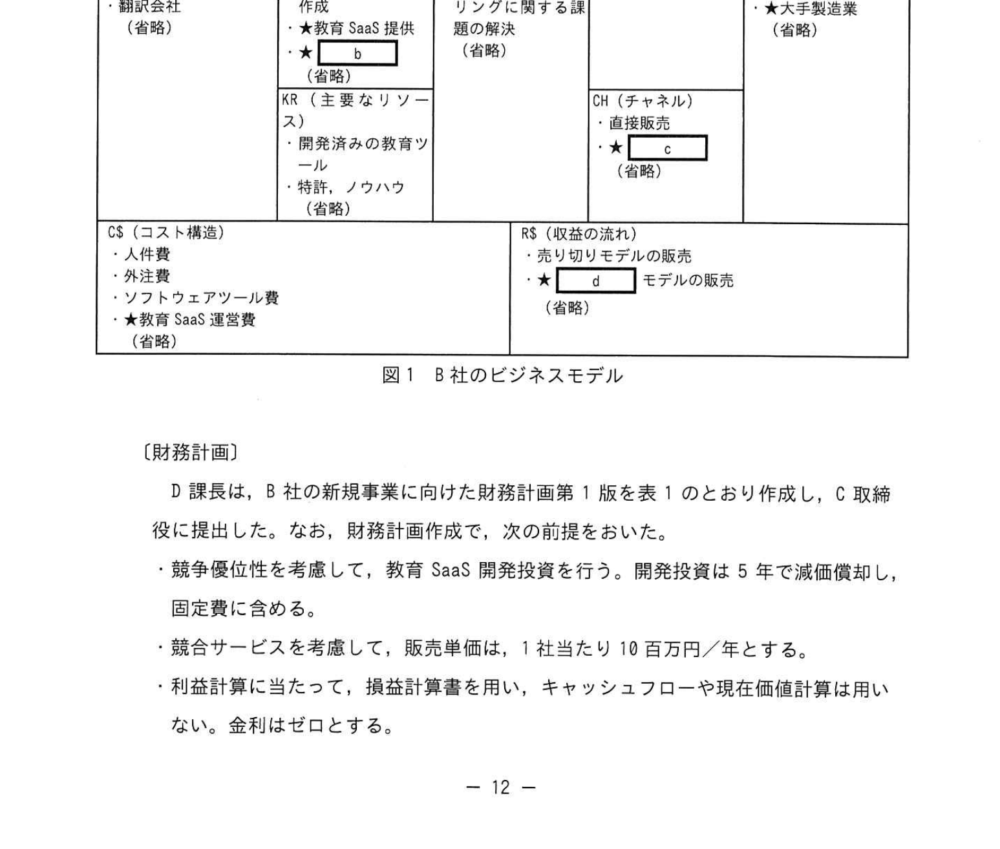
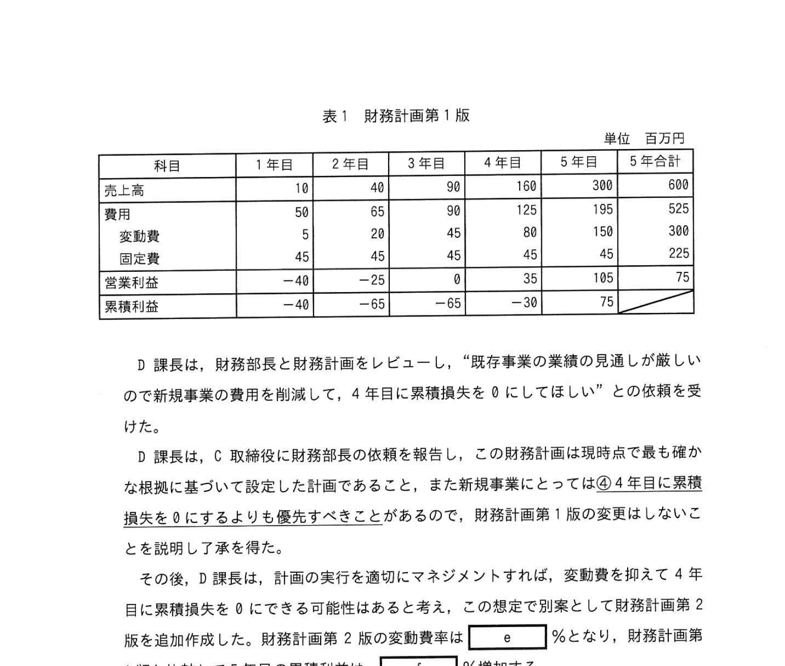

# 2022年秋期（令和4年度秋期）応用情報技術者試験 午後 問2（選択）
## 経営戦略：教育サービス業の新規事業開発（DX・教育SaaS・ビジネスモデルキャンバス）

---

## 問題文

**問2** 教育サービス業の新規事業開発に関する次の記述を読んで、設問に答えよ。

B社は、教育サービス業の会社であり、中高生を対象とした教育サービスを提供している。B社では有名講師を抱えており、生徒の能力レベルに合った分かりやすく良質な教育コンテンツを多数有している。しかしこれらを生徒向けに塾や通信教育などの事業を中心にしてきたが、ここ数年、売上高が減少しており、今後も法人企業向けの教育市場の成長が期待できる。

最近、法人向けの教育サービス業において、異業種から参入した企業による競合サービスが出現し始めており、価格競争が激化している。

教育サービス業に対する他社の新規事業の成功事例を調査したところ、特定の業界で他企業に対して影響力が強い企業を最初の顧客として新たなサービスの実績を築いていくと、その業界の他の企業に展開するケースが多いことが分かった。

B社では、海外の教育関連企業との提携、及び大学の研究室との共同研究を通じて、データサイエンス、先進的なプログラム言語などに関する教育コンテンツの拡充や、AIを用いて個人の能力レベルに合わせた教育コンテンツを提供できる教育ツールの研究開発に取り組み始めた。この教育ツールは実証を終えた段階である。

---

### 〔新規事業の戦略立案〕

D課長は、内外の環境分析を行い、B社の新規事業の戦略を次のとおり立案し、C取締役の承認を得た。

- 新規事業のミッションは、"未来に向けて挑戦するすべての人に、変革の機会を提供すること" と設定した。
- B社は、新規事業領域として、①**法人業務向けの個人の能力カレベルに合わせたオンライン教育サービスを選定**し、SaaSの形態（以下、教育SaaSという）で顧客に提供する。
- 中高生向けの塾の通信教育などのノウハウをDXの推進によって活用し、販売チャネルや業界における認知度を高め、法人向けの販売力を強化するために、F社と販売店契約約結ぶ。F社は販売店向け教育サービス業に精通した人材育成や教育を行う会社であり、大手製造業の顧客を多く抱えている。
- 最初に攻略する顧客セグメントは、データサイエンス教育の需要が高まっている大手製造業の人事教育担当部門と G社にすることとし、G社の製品との連携を図ることで、社内部門が必要とする必要な教育コンテンツを提供できるようにする。
- 対象の顧客セグメントに対して、従業員が一定の企業数を考えて選定し、毎月定額で、提示するカタログの中から好きな教育コンテンツを選べるサービスを提供することで、競合サービスよりも利用しやすい価格設定とする。
- Web セミナーやイベントを通じて B社の教育 SaaS の認知度を高める。また、法人向けの販売を強化するために、F社と販売店契約約結ぶ。
- D課長は、戦略に基づき新規事業の計画を策定した。

---

### 〔顧客実証〕

D課長は、新規事業の戦略の実効性を検証する顧客実証を行うこととして、その方針を次のように定めた。

- 教育ニーズが高く、商談中の⑤**G社を最初に攻略する顧客とする**。G社は製造業の大手企業であり、同業他社への影響力が高い。
- G社への提案前に、B社が提供するサービスが適合するかを確認するために、 `[　a　]` にはF社にも参加してもらう。

---

### 〔ビジネスモデルの策定〕

D課長は、ビジネスモデルキャンバスの手法を用いて、B社のビジネスモデルを図1のとおりに作成した。なお、新規事業について要素を "★" で、既存事業についての要素を細字で記す。（省略）ほかに要素があることを示す。

### 図1 B社のビジネスモデル

> **KP（主要なパートナー）：** XA（生産的活動）海外教育関連企業、教育コンテンツの作成、★教育SaaS提供  
> **VP（価値提案）：** 教育ニーズのリスキリングに関する問題解決  
> **C4（顧客との関係）：** `[　b　]` なしで、個人の能力に合わせた教育提供  
> **C5（顧客セグメント）：** 中高生、大手製造業の人事教育担当（省略）  
> **KR（主要なリソース）：** 特許・ノウハウ、教育コンテンツ  
> **CH（チャネル）：** `[　d　]` モデルの販売  
> **C$（コスト構造）：** 人件費、外注費、ソフトウェアツール費、★教育SaaS運営費  
> **R$（収益の流れ）：** モデルの販売、★売り切りモデルの販売  

---

### 〔財務計画〕

D課長は、B社の新規事業に向けた財務計画第1版を表1のとおり作成し、C取締役に提出した。

### 表1 財務計画第1版

> （単位：百万円）
>
> | 科目 | 1年目 | 2年目 | 3年目 | 4年目 | 5年目 | 5年合計 |
> |------|-------|-------|-------|-------|-------|---------|
> | 売上高 | 10 | 40 | 90 | 160 | 300 | 600 |
> | 費用 | 50 | 65 | 98 | 125 | 190 | 528 |
> | 変動費 | 5 | 20 | 45 | 80 | 150 | 300 |
> | 固定費 | 45 | 45 | 45 | 45 | 45 | 225（？） |
> | 営業利益 | -40 | -25 | -8 | 35 | 110 | 75 |
> | 累積利益 | -40 | -65 | -73 | -38 | 75 | — |
>
> 注：競争優位性を考慮して、教育SaaS開発投資を行い、開発投資は5年で減価償却し、固定費に含める。
> 競合サービスを考慮して、販売単価は1社当たり年10百万円/年とする。
> 損益計算に当たって、損益計算書を用いる。キャッシュフローや現在価値計算は用いない。金利はゼロとする。

D課長は、財務部長及び財務部員をレビューし、"既存事業の業績の見通しが厳しいので、4年目に累積損失を0にしてほしい" との依頼を受けた。

D課長は、C取締役から財務部長に報告し、また新規事業にとっての④**4年目に累積損益を0にすることよりも優先すべきこと**があるので、財務計画第1版の変更はしないことにした。

その後、D課長は、計画の実行を適切にマネジメントすれば、変動費を抑えて4年目に累積損失を0にできる可能性はあると考え、この想定で別案として財務計画第2版を追加作成した。財務計画第2版の変動費率は `[　e　]` %となり、財務計画第1版と比較して5年目の累積利益は `[　f　]` %増加する。

---

## 設問

### 設問1 〔新規事業の戦略立案〕について答えよ。

**(1)** 本文中の下線①について、この事業領域を選定した理由は何か。強みと機会の観点から、それぞれ20字以内で答えよ。

**(2)** 本文中の下線②について、留意すべきことは何か。最も適切な文章を解答群の中から選び、記号で答えよ。

**解答群：**
- ア B社のDXにおいては、データドリブン経営はAIなしで人手で行うので十分である。
- イ B社のDXの戦略立案に際しては、自社のあるべき姿の達成に向け、デジタル技術を活用し事業を改革することが必要とされる。
- ウ B社のDXは、デジタル技術を用いて製品やサービスの付加価値を高める後、教育コンテンツのデジタル化に取り組む必要がある。
- エ B社のDXは、ニーズの不確実性が高い状況下で推進するので、一度決めた計画は遵守する必要がある。

### 設問2 〔顧客実証〕について答えよ。

**(1)** 本文中の下線③について、この方針の目的は何か。20字以内で答えよ。

**(2)** 本文中の `[　a　]` に入れる最も適切な字句を解答群の中から選び、記号で答えよ。

**解答群：**
- ア KPI
- イ LTV
- ウ PoC
- エ UAT

### 設問3 〔ビジネスモデルの策定〕について答えよ。

**(1)** 図1中の `[　b　]`、`[　c　]` に入れる最も適切な字句を解答群の中から選び、記号で答えよ。

**解答群：**
- ア E大学
- イ F社
- ウ G社
- エ 教育
- オ コンサルティング
- カ プロモーション

**(2)** 図1中の `[　d　]` には販売の方式を示す字句が入る。仮名を示す字句で答えよ。

### 設問4 〔財務計画〕について答えよ。

**(1)** 本文中の下線④について、新規事業にとって4年目に累積損益を0にすることよりも優先すべきことは何か。20字以内で答えよ。

**(2)** 本文中の `[　e　]`、`[　f　]` に入れる適切な数値を整数で答えよ。

---

## 解答と解説

### 設問1

**(1) 正解**

- **強み**：業界に先駆けた教育コンテンツの整備力（20字）
- **機会**：リスキリングのニーズの高まり（16字）

B社の強みは有名講師・高品質な教育コンテンツ・AIを用いた個人最適化技術。機会は法人での人材育成・リスキリング需要の拡大（特にデータサイエンス）。

**(2) 正解：イ（B社のDXの戦略立案に際しては、自社のあるべき姿の達成に向け、デジタル技術を活用し事業を改革することが必要とされる。）**

DXの本質は「デジタル技術を使って事業そのものを変革すること」。単なるデジタル化（ウ）や、AIに頼り切り（ア）、固定計画への固執（エ）は誤り。

---

### 設問2

**(1) 正解：大手製造業の同業他社へ展開するため（20字）**

G社は大手製造業で影響力が高い。G社での実証実績を得ることで、同業他社への展開が容易になる（最初の顧客戦略）。

**(2) 正解：a = ウ（PoC）**

PoC（Proof of Concept：概念実証）。本格導入前にサービスが顧客ニーズに適合するかを検証する試験的取り組み。顧客実証 = PoC。

---

### 設問3

**(1) 正解：b = カ（プロモーション）、c = イ（F社）（順不同）**

- **b（C4：顧客との関係）**：「プロモーション」なしで個人の能力に合わせた教育を提供する関係（セルフサービス型）。
- **c（CH：チャネル）**：F社（販売パートナー）経由でのチャネル。

**(2) 正解：d = サブスクリプション**

毎月定額で教育コンテンツを選べる販売モデル = サブスクリプション（定額制）モデル。

---

### 設問4

**(1) 正解：新規事業のミッションを遂行すること・競争優位性のある教育SaaSの提供（38字）**

4年目に累積損益を0にするために変動費（開発投資）を削減すると、教育ツールの品質低下や競争優位性の喪失につながる。新規事業のミッション達成・競争力強化を優先すべきである。

**(2) 正解：e = 40、f = 80**

**計算根拠：**

財務計画第1版の変動費率は各年50%（5年合計 変動費300／売上高600）。累積利益は 1年目−40／2年目−65／3年目−65／4年目−30／5年目75。

- **e（第2版の変動費率）**：4年目に累積損失を0にするには累積−30を+30改善する必要がある。1〜4年目の売上合計は10+40+90+160＝300。この間の変動費を30削減すればよいので、変動費率＝(150−30)/300＝120/300＝**40%**。
- **f（5年目累積利益の増加率）**：第2版（変動費率40%）の5年間の変動費は600×40%＝240で、第1版（300）より60減少する。5年目の累積利益は75+60＝135となり、増加率＝60/75＝**80%**。

**IPA公式：e = 40、f = 80**

---

## 参考：主要キーワード

| 用語 | 説明 |
|------|------|
| DX（デジタルトランスフォーメーション） | デジタル技術を使って事業・組織・ビジネスモデルを変革すること |
| SaaS（Software as a Service） | ソフトウェアをクラウド経由でサービスとして提供するビジネスモデル |
| ビジネスモデルキャンバス | KP/KA/KR/VP/CH/CS/C$/R$の9要素でビジネスモデルを可視化するフレームワーク |
| PoC（Proof of Concept） | 概念実証。本格導入前に小規模で実現可能性を検証する取り組み |
| サブスクリプション | 月額・年額などの定額制で継続的にサービスを提供するビジネスモデル |
| リスキリング | 変化する環境に対応するために従業員が新たなスキルを習得すること |
| 変動費率 | 売上高に対する変動費の割合。製品・サービスの原価効率を示す |
| 累積利益（損失） | 事業開始からの利益（損失）の累計額。損益分岐点の把握に使用 |
| 販売代理店戦略 | 自社の販売力補完のためにパートナー企業を経由して販売する戦略 |
| SWOT分析 | 強み（S）・弱み（W）・機会（O）・脅威（T）を分析するフレームワーク |
