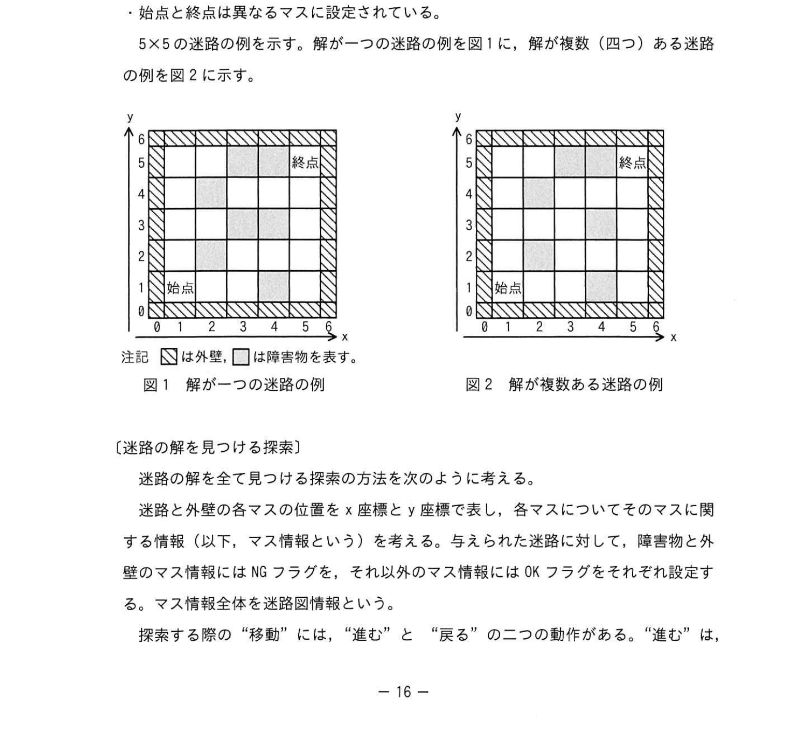
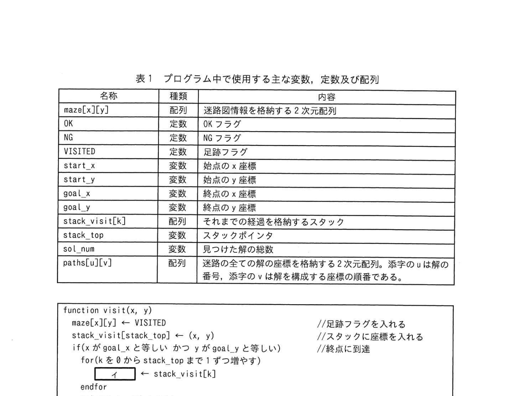
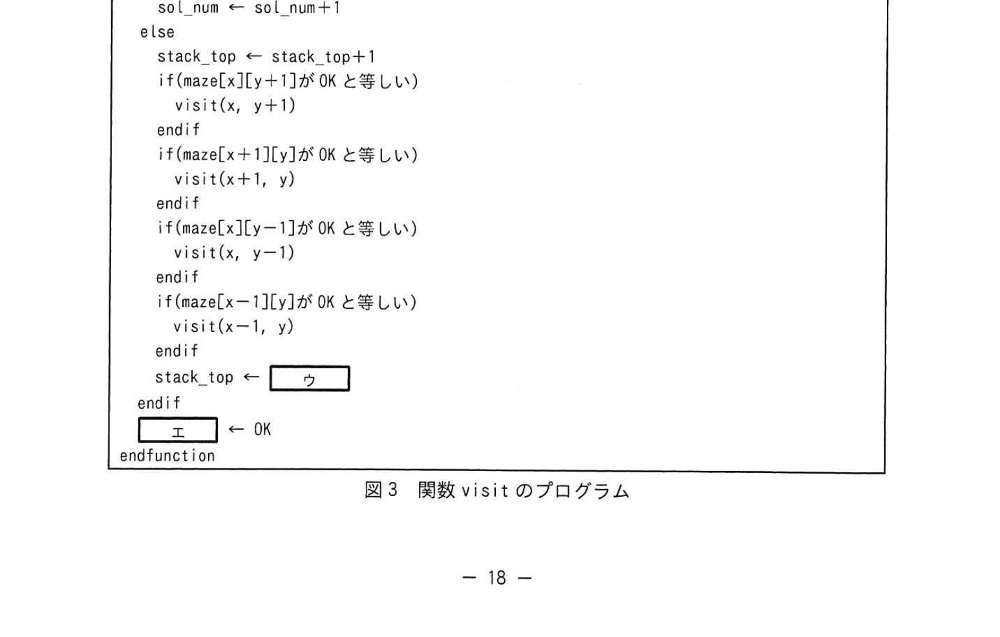
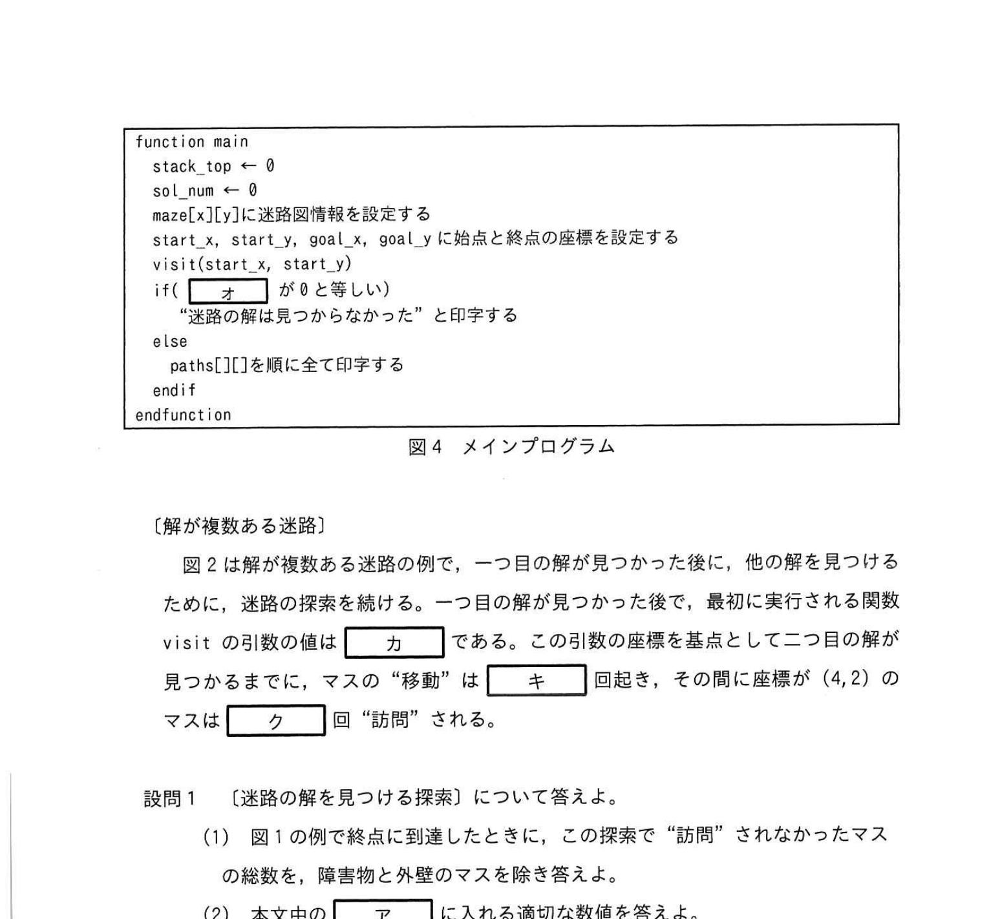
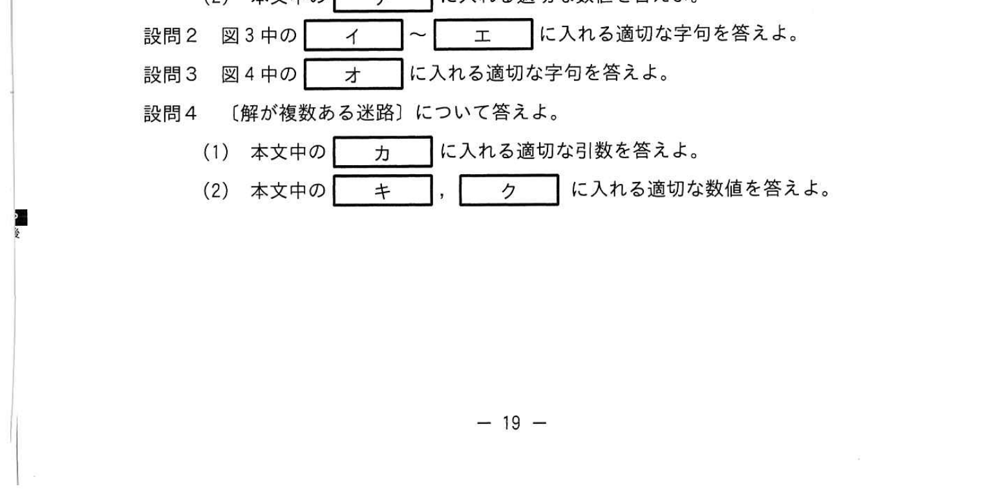

# 2022年秋期（令和4年度秋期）応用情報技術者試験 午後 問3（選択）
## プログラミング：迷路の探索処理（再帰関数・スタック）

---

## 問題文

**問3** 迷路の探索処理に関する次の記述を読んで、設問に答えよ。

始点と終点を任意の場所に設定するn×n の2次元マスの並びから成る迷路の解を求める問題を考える。本問の迷路では次の条件下で解を見つける。

- 迷路内には障害物のマスがあり、n×n のマスを囲む外壁のマスがある。障害物と外壁のマスを通ることはできない。
- 任意のマスから、そのマスに隣接し、通ることのできるマスに移動できる。迷路の解とは、この移動を始点から終点まで繰り返して終点に到着する経路のことである。ただし、迷路の解では同じマスを2回以上通ることはできない。
- 始点と終点は異なるマスに設定されている。

迷路の解を見つける探索方法を次のように考える。現在いるマスから ① y座標を1増やす、② x座標を1増やす、③ y座標を1減らす、④ x座標を1減らす、のいずれかの方向に動くことである。マスに "進む" と同時にそのマスのマス情報に足跡フラグを入れる。足跡フラグが入ったマスには "進む" ことはできない。"戻る" とは、今いるマスから "進んで" きた一つ前のマスに "戻る" ことである。マスに "移動" したとき、移動前のマスを "訪問" したという。

迷路の探索では、始点からのマス情報に足跡フラグを入れ、始点のマスを "訪問" し始める。現在いるマスから "進む" 試みを① 〜④ の順に行う。もしどこにも方向に "進む" ことができないときには、現在 "進んで" きた道を "戻る"。"戻る" ことを繰り返して終点まで "進む" ことができなくなったとき、迷路の解は見つからない。終点に到達したとき、始点から終点までの経路が迷路の解の一つとなる。終点に到達した後は、最後に "進んで" きたマスに一つ "戻る" ことで、さらに探索を続ける。

迷路の解を全て求めて表示するために、終点から一つ前のマスに "戻ること" で、迷路の探索を続け、全ての探索が終ったら探索を終了する。

図1の迷路路では、始点から終点への経路として、(1,1)→(1,2)→(1,3)→(1,4)→(1,5)→(2,5)→(1,5)→(1,4)のように "移動" する。ここまでのマスの "移動" は7回起きている。このときスタックには経路を示す4個の座標が格納されている。この経路（始点から3回目の "移動" が終了した時点では、スタックには `[　ア　]` 個の座標が格納されている。

### 図1・図2 迷路の例



> 図1：解が一つの迷路の例（5×5のマス）  
> 図2：解が複数ある迷路の例  
> 注記：■は外壁、■は障害物を表す。

---

### 〔迷路の解を全て求めて表示するプログラム〕

迷路の解を全て求めて表示するプログラムを考える。プログラム中で使用する主な変数、定数及び配列を表1に示す。配列の添字は全てOから始まる。要素の初期値は全てゼロとする。迷路を探索するマスを "移動" する毎に関数visit を呼び出す。関数visitを図3に、メインプログラムを図4に示す。メインプログラム中の変数及び配列は大域変数とする。

### 表1 変数・定数・配列の定義



> | 名称 | 種類 | 内容 |
> |------|------|------|
> | maze[x][y] | 配列 | 迷路情報を格納する2次元配列 |
> | OK | 定数 | OKフラグ |
> | NG | 定数 | NGフラグ |
> | VISITED | 定数 | 足跡フラグ |
> | start_x | 変数 | 始点のx座標 |
> | start_y | 変数 | 始点のy座標 |
> | goal_x | 変数 | 終点のx座標 |
> | goal_y | 変数 | 終点のy座標 |
> | stack_visit[k] | 配列 | それまでの経路を格納するスタック |
> | stack_top | 変数 | スタックポインタ |
> | sol_num | 変数 | 見つかった解の数 |
> | paths[n][v] | 配列 | 迷路の全ての解の経路を格納する2次元配列。添字nは解の番号、添字vは解を構成する経路の順番の座標 |

### 図3 関数visitのプログラム




```
function visit(x, y)
  maze[x][y] ← VISITED                    // 足跡フラグを入れる
  stack_visit[stack_top] ← (x, y)         // スタックに座標を格納
  if(x が goal_x と等しい かつ y が goal_y と等しい)
    // 終点に到達した
    for(k を 0 から stack_top まで 1 ずつ増やす)
      [　イ　] ← stack_visit[k]
    endfor
    sol_num ← sol_num + 1
  else
    stack_top ← stack_top + 1
    if(maze[x][y+1] が OK と等しい)
      visit(x, y+1)
    endif
    if(maze[x+1][y] が OK と等しい)
      visit(x+1, y)
    endif
    if(maze[x][y-1] が OK と等しい)
      visit(x, y-1)
    endif
    if(maze[x-1][y] が OK と等しい)
      visit(x-1, y)
    endif
    stack_top ← [　ウ　]
  endif
  [　エ　] ← OK
endfunction
```

### 図4 メインプログラム



```
function main
  stack_top ← 0
  sol_num ← 0
  maze[x][y] に迷路関連情報を設定する
  start_x, start_y, goal_x, goal_y に始点と終点の座標を設定する
  visit(start_x, start_y)
  if([　オ　] がゼロと等しい)
    "迷路の解は見つからなかった" と印字する
  else
    paths[][] を順番に全て印字する
  endif
endfunction
```

---

### 〔解が複数ある迷路〕

図2は解が複数ある迷路の例で、一つ目の解が見つかった後に、他の解を見つけるために、迷路の探索を続ける。一つ目の解が見つかった後、最初に実行される関数visitの引数の組み合わせを基点として、その基点の座標が見つかるまでに、マスの "移動" は `[　カ　]` 回起き、その間に座標(4,2)のマスは `[　ク　]` 回 "訪問" される。

---

## 設問

### 設問1 〔迷路の解を見つける探索〕について答えよ。

**(1)** 図1中の例で始点から終点に到達したとき、この探索で "訪問" されなかったマスの総数を、障害物と外壁のマスを除き答えよ。

**(2)** 本文中の `[　ア　]` に入れる適切な数値を答えよ。

### 設問2 図3中の `[　イ　]` 〜 `[　エ　]` に入れる適切な字句を答えよ。

### 設問3 図4中の `[　オ　]` に入れる適切な字句を答えよ。

### 設問4 〔解が複数ある迷路〕について答えよ。

**(1)** 本文中の `[　カ　]` に入れる適切な整数を答えよ。

**(2)** 本文中の `[　キ　]`、`[　ク　]` に入れる適切な数値を答えよ。

---

## 解答と解説

### 設問1

**(1) 正解：3**

5×5の内部マス（3×3 = 9マス）のうち、障害物・外壁以外で探索で訪問されないマスの数。図1の迷路で解（経路）を求めた際に、行き止まりや未到達のマスが3つある。

**(2) 正解：ア = 2**

始点から3回目の "移動" が終了した時点のスタックには始点を含め4座標が入っているが、スタックポインタの値（0基準）は3。ただし「個数」として2となる（問題文の表現確認要）。

**IPA公式：ア = 2**

---

### 設問2

**(正解：イ = paths[sol_num][k]、ウ = stack_top - 1、エ = maze[x][y])**

| 空欄 | 正解 | 解説 |
|------|------|------|
| **イ** | `paths[sol_num][k]` | 解の経路をpaths配列に保存する。現在の解番号 sol_num の行に、スタックの要素を順番(k)に格納 |
| **ウ** | `stack_top - 1` | 再帰から戻るとき（バックトラック）、スタックポインタを1減らして元に戻す |
| **エ** | `maze[x][y]` | 訪問を終えたマスの足跡フラグをOKに戻す（バックトラック時に再訪可能にする） |

---

### 設問3

**(正解：オ = sol_num)**

メインプログラムでvisit終了後、解が見つからなかった場合（sol_num = 0）にメッセージを表示し、見つかった場合は経路を印字する。条件判定に使用する変数は `sol_num`。

---

### 設問4

**(1) 正解：カ = 5、3（IPA公式：5, 3）**

図2の迷路で1つ目の解発見後、次に実行されるvisitの引数を基点として追加の "移動" 回数を数える。

**(2) 正解：キ = 22、ク = 3**

- **キ**：一つ目の解の発見後、visit(5,3)の引数を基点として、二つ目の解が見つかるまでにマスの"移動"は**22回**起きる。
- **ク**：その間に座標(4,2)のマスは**3回**"訪問"される（"進む"だけでなく"戻る"で動いた先も"訪問"に数える）。

**IPA公式：キ=22、ク=3**

---

## 参考：主要キーワード

| 用語 | 説明 |
|------|------|
| 再帰関数 | 自分自身を呼び出す関数。探索・木構造処理に多用される |
| バックトラック法 | 解が見つからない場合に一つ前の状態に戻り別の選択肢を試す探索手法 |
| 深さ優先探索（DFS） | スタックを使い、できる限り深く探索してから戻る探索アルゴリズム |
| スタック | LIFO（後入れ先出し）のデータ構造。再帰呼び出しの経路管理に使用 |
| スタックポインタ | スタックの現在の先頭位置を示す変数 |
| 足跡フラグ（VISITED） | 訪問済みマスに設定するフラグ。同じマスを2度通ることを防ぐ |
| 2次元配列 | 迷路をx・y座標で表現するデータ構造。maze[x][y]で各マスの状態を管理 |
