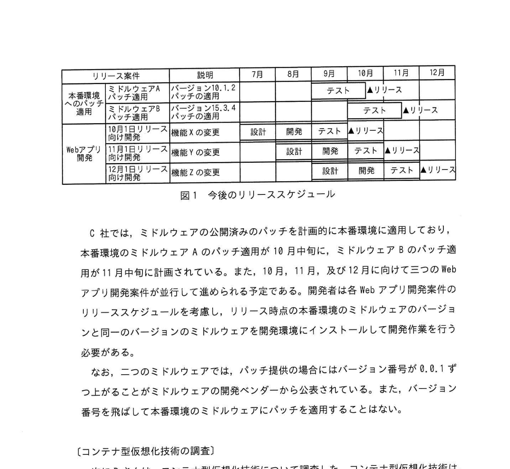
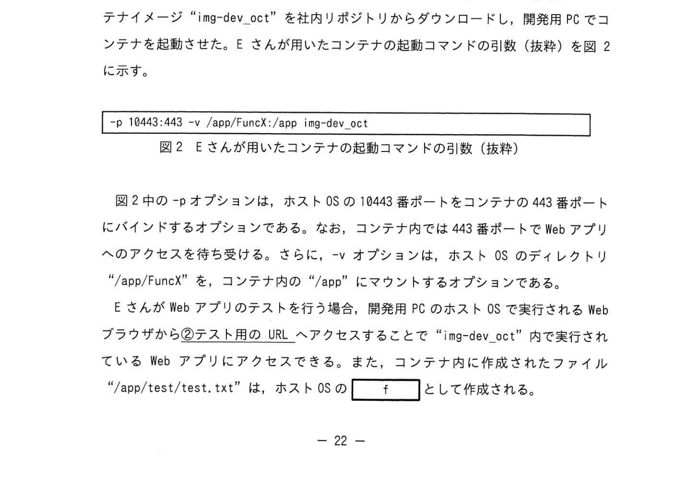
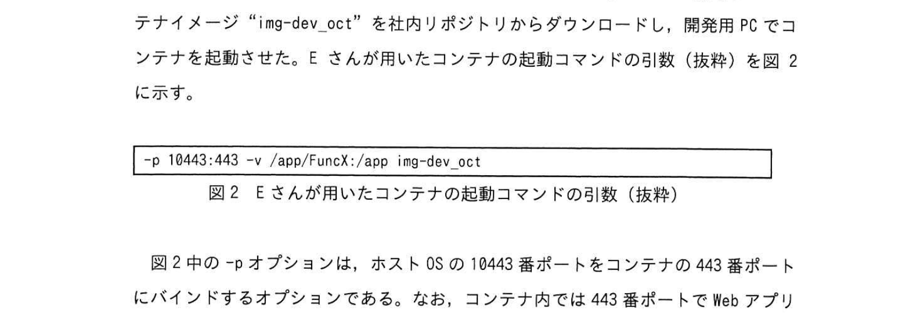

# 2022年秋期（令和4年度秋期）応用情報技術者試験 午後 問4（選択）
## システムアーキテクチャ：コンテナ型仮想化技術による開発環境の構築

---

## 問題文

**問4** コンテナ型仮想化技術に関する次の記述を読んで、設問に答えよ。

C社は、レストランの予約サービスを提供する会社である。C社のレストランの予約サービスを提供するWebアプリケーションソフトウェア（以下、Webアプリという）は、20名の開発者が在籍するWebアプリ開発部で開発、保守されている。C社のWebアプリにアクセスするURLは、"https://www.example.jp/" である。

Webアプリには、機能X、機能Y、機能Zの三つの機能があり、そのソースコードやコンパイル済みロードモジュールは、開発期間中に頻繁に更新されるので、バージョン管理システムを利用してバージョン管理している。また、Webアプリは、外部のベンダーが提供するミドルウェアA及びミドルウェアBを利用しており、各ミドルウェアには開発ベンダーから不定期にアップデートパッチ（以下、パッチという）が提供される。パッチが提供された場合、C社ではテスト環境で一定期間テストを行った後、顧客向けにサービスを提供する本番環境のミドルウェアにパッチを適用している。

このため、Webアプリの開発者は、本番環境に適用されるパッチにあわせて、自分の開発用PCの開発環境のミドルウェアにもパッチを適用する必要がある。開発環境へのパッチは、20台の開発用PC全てに適用する必要があり、作業工数が掛かる。

そこで、Webアプリ開発部では、Webアプリの動作に必要なソフトウェアをイメージファイルにまとめて配布することができるコンテナ型仮想化技術を用いて、パッチ適用済みのコンテナイメージを開発者の開発用PCに配布することで、開発環境へのミドルウェアのパッチ適用工数を削減することについて検討を開始した。コンテナ型仮想化技術を用いた開発環境の構築は、Webアプリ開発部のDさんが担当することになった。

---

### 〔Webアプリのリリーススケジュール〕

まずDさんは、今後のミドルウェアへのパッチ適用とWebアプリのリリーススケジュールを確認した。今後のリリーススケジュールを図1に示す。

### 図1 今後のリリーススケジュール



> | 区分 | リリース案件 | 説明 | 7月 | 8月 | 9月 | 10月 | 11月 | 12月 |
> |------|------------|------|-----|-----|-----|------|------|------|
> | 本番環境へのパッチ適用 | ミドルウェアAパッチ適用 | バージョン10.1.2パッチの適用 | | | テスト | ▲リリース | | |
> | | ミドルウェアBパッチ適用 | バージョン15.3.4パッチの適用 | | | | テスト | ▲リリース | |
> | Webアプリ開発 | 10月1日リリース向け開発 | 機能Xの変更 | 設計 | 開発 | テスト | ▲リリース | | |
> | | 11月1日リリース向け開発 | 機能Yの変更 | | 設計 | 開発 | テスト | ▲リリース | |
> | | 12月1日リリース向け開発 | 機能Zの変更 | | | 設計 | 開発 | テスト | ▲リリース |
>
> （▲はリリース時点。ミドルウェアAは10月中旬、ミドルウェアBは11月中旬にリリース）

C社では、ミドルウェアの公開済みのパッチを計画的に本番環境に適用しており、本番環境のミドルウェアAのパッチ適用が10月中旬に、ミドルウェアBのパッチ適用が11月中旬に計画されている。また、10月、11月、及び12月に向けて三つのWebアプリ開発案件が並行して進められる予定である。開発者は各Webアプリ開発案件のリリーススケジュールを考慮し、リリース時点の本番環境のミドルウェアのバージョンと同一のバージョンのミドルウェアを開発環境にインストールして開発作業を行う必要がある。

なお、二つのミドルウェアでは、パッチ提供の場合にはバージョン番号が0.0.1ずつ上がることがミドルウェアの開発ベンダーから公表されている。また、バージョン番号を飛ばして本番環境のミドルウェアにパッチを適用することはない。

---

### 〔コンテナ型仮想化技術の調査〕

次にDさんは、コンテナ型仮想化技術について調査した。コンテナ型仮想化技術は、一つのOS上に独立したアプリケーションの動作環境を構成する技術であり、`[　a　]` や `[　b　]` 上に仮想マシンを動作させるサーバ型仮想化技術と比較して、`[　c　]` が不要となり、CPUやメモリを効率良く利用できる。C社の開発環境で用いる場合には、Webアプリの開発に必要な指定バージョンのミドルウェアをコンテナイメージにまとめ、それを開発者に配布する。

---

### 〔コンテナイメージの作成〕

まずDさんは、基本的なライブラリを含むコンテナイメージをインターネット上の公開リポジトリからダウンロードし、Webアプリの開発に必要な二つのミドルウェアの指定バージョンをコンテナ内にインストールした。次に、コンテナイメージを作成し社内リポジトリへ登録して、C社の開発者がダウンロードできるようにした。

なお、Webアプリのソースコードやロードモジュールは、バージョン管理システムを利用してバージョン管理し、①**コンテナイメージにWebアプリのソースコードやロードモジュールは含めない**ことにした。Dさんが作成したコンテナイメージの一覧を表1に示す。

### 表1 Dさんが作成したコンテナイメージの一覧



> | コンテナイメージ名 | 説明 | ミドルウェアAバージョン | ミドルウェアBバージョン |
> |-------------|------|-----------------------|-----------------------|
> | img-dev_oct | 10月1日リリース向け開発用 | （省略） | （省略） |
> | img-dev_nov | 11月1日リリース向け開発用 | `[　d　]` | `[　e　]` |
> | img-dev_dec | 12月1日リリース向け開発用 | 10.1.2 | 15.3.4 |

---

### 〔コンテナイメージの利用〕

Webアプリ開発部のEさんは、機能Xの変更を行うために、Dさんが作成したコンテナイメージ "img-dev_oct" を社内リポジトリからダウンロードし、開発用PCでコンテナを起動させた。Eさんが用いたコンテナの起動コマンドの引数（抜粋）を図2に示す。

### 図2 Eさんが用いたコンテナの起動コマンドの引数（抜粋）



```
-p 10443:443 -v /app/FuncX:/app img-dev_oct
```

図2中の `-p` オプションは、ホストOSの10443番ポートをコンテナの443番ポートにバインドするオプションである。なお、コンテナ内では443番ポートでWebアプリへのアクセスを待ち受ける。さらに、`-v` オプションは、ホストOSのディレクトリ "/app/FuncX" を、コンテナ内の "/app" にマウントするオプションである。

EさんがWebアプリのテストを行う場合、開発用PCのホストOSで実行されるWebブラウザから②**テスト用のURL**へアクセスすることで "img-dev_oct" 内で実行されているWebアプリにアクセスできる。また、コンテナ内に作成されたファイル "/app/test/test.txt" は、ホストOSの `[　f　]` として作成される。

12月1日リリース向け開発案件をリリースした後の12月中旬に、10月1日リリース向け開発で変更を加えた機能Xに処理ロジックの誤りが検出された。この誤りを12月中に修正して本番環境へリリースするために、Eさんは③**あるコンテナイメージ**を開発用PC上で起動させて、機能Xの誤りを修正した。

その後、Dさんはコンテナ型仮想化技術を活用した開発環境の構築を完了させ、開発者の開発環境へのパッチ適用作業を軽減した。

---

## 設問

### 設問1 〔コンテナ型仮想化技術の調査〕について答えよ。

**(1)** 本文中の `[　a　]` 〜 `[　c　]` に入れる適切な字句を解答群の中から選び、記号で答えよ。

**解答群：**
- ア アプリケーション
- イ ゲストOS
- ウ ハイパーバイザー
- エ ホストOS
- オ ミドルウェア

**(2)** 今回の開発で、サーバ型仮想化技術と比較したコンテナ型仮想化技術を用いるメリットとして、最も適切なものを解答群の中から選び、記号で答えよ。

**解答群：**
- ア 開発者間で差異のない同一の開発環境を構築できる。
- イ 開発用PC内で複数Webアプリ開発案件用の開発環境を実行できる。
- ウ 開発用PCのOSバージョンに依存しない開発環境を構築できる。
- エ 配布するイメージファイルのサイズを小さくできる。

### 設問2 〔コンテナイメージの作成〕について答えよ。

**(1)** 本文中の下線①について、なぜDさんはソースコードやロードモジュールについてはコンテナイメージに含めずに、バージョン管理システムを利用して管理するのか、20字以内で答えよ。

**(2)** 表1中の `[　d　]`、`[　e　]` に入れる適切なミドルウェアのバージョンを答えよ。

### 設問3 〔コンテナイメージの利用〕について答えよ。

**(1)** 本文中の下線②について、Webブラウザに入力するURLを解答群の中から選び、記号で答えよ。

**解答群：**
- ア https://localhost/
- イ https://localhost:10443/
- ウ https://www.example.jp/
- エ https://www.example.jp:10443/

**(2)** 本文中の `[　f　]` に入れる適切な字句を、パス名/ファイル名の形式で答えよ。

**(3)** 本文中の下線③について、起動するコンテナイメージ名を表1中の字句を用いて答えよ。

---

## 解答と解説

### 設問1

**(1) 正解：a = ウ（ハイパーバイザー）、b = エ（ホストOS）、c = イ（ゲストOS）**

- **a・b = ハイパーバイザー／ホストOS（順不同）**：サーバ型仮想化技術は、ハイパーバイザー上、又はホストOS上に仮想マシンを動作させる。
- **c = ゲストOS**：コンテナ型はホストOSのカーネルを共有するため、仮想マシンごとのゲストOSが不要となり、CPUやメモリを効率良く利用できる。

**IPA公式：a=ウ、b=エ（順不同）、c=イ**

**(2) 正解：エ（配布するイメージファイルのサイズを小さくできる。）**

サーバ型仮想化と比較したコンテナ型のメリットは、ゲストOSを含まないためイメージファイルが小さいこと（エ）。ア（同一環境の構築）・イ（複数案件の開発環境実行）・ウ（OSバージョン非依存）は、サーバ型仮想化でも実現できるため「サーバ型と比較したメリット」にはならない。

**IPA公式：エ**

---

### 設問2

**(1) 正解：開発期間中に頻繁に更新されるから（16字）**

ソースコード・ロードモジュールは開発期間中に頻繁に更新される。コンテナイメージに含めると更新のたびにイメージの再作成・再配布が必要になり非効率。バージョン管理システムで管理する方が効率的。

**IPA公式：開発期間中に頻繁に更新されるから**

**(2) 正解：d = 10.1.2、e = 15.3.3**

img-dev_nov（11月1日リリース向け開発用）のミドルウェアバージョンを求める。11月1日リリース時点の本番環境は：
- **d（ミドルウェアA）= 10.1.2**：ミドルウェアAは10月中旬にパッチ適用済みなので 10.1.2。
- **e（ミドルウェアB）= 15.3.3**：ミドルウェアBのパッチ適用は11月中旬であり、11月1日時点では未適用。したがってパッチ前の 15.3.3（15.3.4の一つ前）。

**IPA公式：d = 10.1.2、e = 15.3.3**

---

### 設問3

**(1) 正解：イ（https://localhost:10443/）**

`-p 10443:443` でホストOSの10443番ポートがコンテナの443番へバインドされる。EさんはローカルPC（localhost）のポート10443にブラウザでアクセスする。

**IPA公式：イ**

**(2) 正解：f = /app/FuncX/test/test.txt**

`-v /app/FuncX:/app` でホストの "/app/FuncX" がコンテナ内の "/app" にマウントされている。コンテナ内の "/app/test/test.txt" は、ホストOSの "/app/FuncX/test/test.txt" として作成される。

**IPA公式：/app/FuncX/test/test.txt**

**(3) 正解：img-dev_dec**

12月中旬の修正時点で本番環境は12月リリース後の状態（ミドルウェアA: 10.1.2、ミドルウェアB: 15.3.4）。この本番環境と同一バージョンのミドルウェアをもつ `img-dev_dec` を起動して修正する。

**IPA公式：img-dev_dec**

---

## 参考：主要キーワード

| 用語 | 説明 |
|------|------|
| コンテナ型仮想化 | ホストOSのカーネルを共有し、アプリを独立した環境（コンテナ）で実行する技術。ゲストOS不要 |
| ハイパーバイザー | サーバ型仮想化においてハードウェアを仮想化し複数のゲストOSを管理するソフトウェア |
| ゲストOS | 仮想マシン上で動作するOS。コンテナ型では不要 |
| コンテナイメージ | コンテナを起動するための設定・ソフトウェア・ライブラリをまとめたテンプレート |
| -p オプション | ポートバインディング。ホストOSのポートをコンテナのポートに転送する |
| -v オプション | ボリュームマウント。ホストOSのディレクトリをコンテナ内にマウントする |
| バージョン管理システム | ソースコードの変更履歴を管理するシステム（Git等） |
| 社内リポジトリ | コンテナイメージや成果物を社内で共有するためのストレージ |
