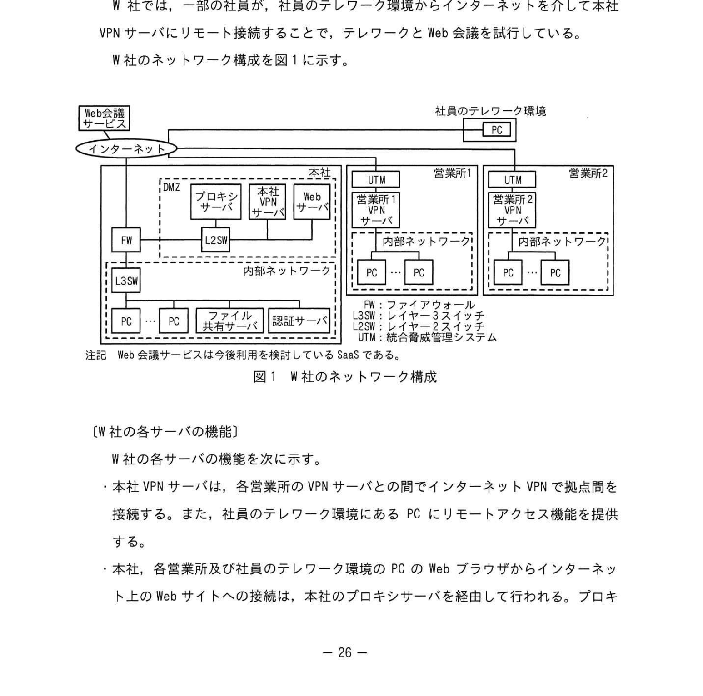

# 2022年秋期（令和4年度秋期）応用情報技術者試験 午後 問5（選択）
## ネットワーク：テレワーク環境への移行（VPN・Web会議・UTM）

---

## 問題文

**問5** テレワーク環境への移行に関する次の記述を読んで、設問に答えよ。

W社は、東京に本社があり、全国に2か所の営業所をもつ。社員数200名のホームページ制作会社である。W社では本社と各営業所との間をVPNサーバを利用してインターネットVPNで接続している。

本社のDMZには、プロキシサーバ、VPNサーバ及びWebサーバが、本社の内部ネットワークにはファイル共有サーバ及び認証サーバを運用している。

W社では、一部の社員が、社員のテレワーク環境からインターネットを介して本社VPNサーバにリモート接続することで、テレワークとWeb会議を試行している。

W社のネットワーク構成を図1に示す。

### 図1 W社のネットワーク構成

> **本社：**FW、L2SW、プロキシサーバ、VPNサーバ、Webサーバ（DMZ）  
> **内部ネットワーク：**ファイル共有サーバ、認証サーバ、PC群  
> **営業所1・営業所2：**UTM、内部ネットワーク、PC群  
> FW：ファイアウォール、UTM：統合脅威管理システム  
> 注記：Web会議サービスは近々利用を検討している SaaS である。

---

### 〔W社の各サーバの機能〕

W社の各サーバの機能を次に示す。

- **本社VPNサーバ**は、各営業所のVPNサーバとの間でインターネットVPNで拠点間を接続する。また、社員のテレワーク環境にあるPCにリモートアクセス機能を提供する。
- **本社**では、各営業所及び社員のテレワーク環境のPCのWebブラウザからインターネット上のWebサイトへの接続は、本社のプロキシサーバを経由して行われる。プロキシサーバは、インターネット上のWebサイトへのアクセス時のコンテンツフィルタリングやログの取得を行う。
- **ファイル共有サーバ**には、社員ごとや組織ごとに保存領域があり、PCにはファイルを保存しない運用をしている。
- **認証サーバ**では、社員のID、パスワードなどを管理して、PCやファイル共有サーバへのログイン認証を行っている。

現在利用している本社のインターネット接続回線は、契約帯域が100Mビット/秒（上り/下り）で帯域非保証型である。

---

### 〔テレワークの拡大〕

W社では、テレワークを拡大することになり、情報システム部のX部長の指示でYさんがテレワーク環境への移行を担当することになった。

Yさんが移行計画を検討したところ、テレワークに必要なPC（以下、リモートPCという）、VPNサーバがリモートアクセス機能が必要なソフトウェアとそのライセンス費用は即時可能であることが分かった。そこでYさんは、ネットワークの帯域増強工事が完了するまでの間、ネットワークに流れる通信量を監視しながら移行を進めることにした。

---

### 〔W社が採用したリモートアクセス方式〕

今回Yさんが採用したリモートアクセス方式は、`[　a　]` で暗号化された `[　b　]` 通信を用いたインターネットVPN接続機能により、社員がリモートPCからWebブラウザからVPNサーバを経由して本社と各営業所の内部ネットワークのPCを遠隔操作する方式である。ここで、リモートPCから内部PCを遠隔操作し、ネットワーク経由で内部PCのデスクトップ画面情報をリモートPCが受け取って表示し、リモートPCから内部PCのデスクトップ操作が電子して行うことで実現する。

この方式では、リモートPCから内部PCを遠隔操作することになるので、従来の社内作業をそのままリモートPCに行うことができる。業務データをファイル共有サーバに保存するので、社員が出社した際にも業務データをそのまま利用できる。

なお、本社VPNサーバと各営業所のVPNサーバとの間を接続する通信で用いられている暗号化機能は、`[　a　]` とは異なり、ネットワーク層で暗号化する `[　c　]` を用いている。

---

### 〔リモートアクセスの認証処理〕

Web サーバにリモートアクセス認証で必要なソフトウェアをインストールして、あらかじめ社員ごとに払い出されたリモートアクセス用IDなどを登録しておく。また、①**リモートPCには、リモートアクセスに必要な2種類の証明書をダウンロードする。**

テレワークの社員がリモートアクセスするときの認証処理は、次の二段階で行われる。

第一段階の認証処理は、本社VPNサーバにリモートPCのWebブラウザからVPN接続をする際の認証である。まず、社員はWebサーバ上の認証のためのページでリモートアクセス用IDを入力することにより、VPN接続に必要な一定時間だけ有効な `[　d　]` を入手する。このリモートログイン専用のページにアクセスした際に、リモートPC上の証明書と合わせてVPN接続の認証が行われる。

第二段階の認証処理は、通常社内で内部PCにログインするために利用するIDとパスワードを用いて `[　e　]` で行われる。

---

### 〔テレワークで利用するWeb会議サービス〕

テレワークで利用するWeb会議サービスは、インターネット上でSaaSとして提供されている社外のWeb会議サービスを採用することになった。このWeb会議サービスは、内部PCのWebブラウザがSaaSとしてのWeb会議サービスと接続して利用する。Web会議サービスでは、同時に複数のPCが参加することができ、ビデオ映像と音声が参加しているPC間で共有される。利用者はマイクとカメラの利用の要否をそれぞれ選択することができる。

---

### 〔テレワーク移行中に発生したシステムトラブルの原因と対策〕

テレワークへの移行を進めていたある日、リモートPCから内部PCにリモート接続するPC数が増えたことで、リモートPCでは画面応答やファイル操作などの反応が遅くなったり、Web会議サービスでは画面の映像や音声が中断したりする事象が発現した。

社員から業務に支障を来す申告を受けたYさんは、直ちに原因を調査した。

Yさんが原因を調査した結果、次のことが分かった。

(1) 社内のインターネット接続回線を流れる通信量を複数箇所で測定したところ、本社のインターネット接続回線の契約帯域使用率が異常に高い。この原因を通信種類ごとに調べたところ、Web会議サービスの通信量が特に高い。このWeb会議サービスの②**通信経路に関する要因**の他に、**社員の60%がWeb会議サービスを利用する**という要因があったからだと考えた。

利用者1人当たりの10分間の平均転送データ量を実測した。この結果は、映像と音声を用いた通信方式の場合で120Mバイトであった。これを通信帯域に換算すると `[　f　]` Mビット/秒となり、この通信だけで本社のインターネット接続回線の契約帯域を超える通信帯域域を使用すると計算した。社員200名のうち60%の社員が同時にこのWeb会議サービスを通信方式を利用する場合、使用する通信帯域は `[　g　]` Mビット/秒となり、このインターネット接続回線の通信量だけで本社のインターネット接続回線の契約帯域の帯域幅を超える。

(2) Yさんは、本社のインターネット接続回線を流れる通信量を減らす方策として、営業所1と営業所2に設置された②**UTMを利用してインターネットの特定サイトへアクセスする設定と営業所PCのWebブラウザに例外設定とを追加した。**

Yさんは、この原因調査の結果と対策をX部長に報告しトラブル対策を実施した。その後、本社のインターネット接続回線の帯域増強工事が完了したため、UTMと営業所PCのWebブラウザの設定を元に戻し、テレワーク環境への移行が完了した。

---

## 設問

### 設問1 本文中の `[　a　]` 〜 `[　c　]` に入れる適切な字句を解答群の中から選び、記号で答えよ。

**解答群：**
- ア FTP
- イ HTTPS
- ウ IPSec
- エ Kerberos
- オ LDAP
- カ TLS

### 設問2 〔リモートアクセスの認証処理〕について答えよ。

**(1)** 本文中の下線①について、どのサーバの認証機能を利用するために必要な証明書か。図1中のサーバ名を用いて全て答えよ。

**(2)** 本文中の `[　d　]` に入れる適切な字句を片仮名10字以内で答えよ。

**(3)** 本文中の `[　e　]` に入れる適切な字句を、図1中のサーバ名を用いて8字以内で答えよ。

### 設問3 〔テレワーク移行中に発生したシステムトラブルの原因と対策〕について答えよ。

**(1)** 本文中の下線②について、要因となるのはどのようなことかを解答群の中から選び、適切な記述を選び記号で答えよ。

**解答群：**
- ア Web会議サービスの全ての通信が営業所1のUTMを通る。
- イ Web会議サービスの全ての通信が本社のインターネット接続回線を通る。
- ウ 社員の60%がWeb会議サービスを利用する。
- エ 本社VPNサーバの認証処理を利用しない。
- オ 本社のファイル共有サーバと本社の内部PCとの通信は本社の内部ネットワーク内を通る。

**(2)** 本文中の `[　f　]`、`[　g　]` に入れる適切な数値を整数で答えよ。

**(3)** 本文中の下線③の設定によって、UTMに設定されたアクセスを許可する、FW以外の接続先を図1中の用語を用いて全て答えよ。

---

## 解答と解説

### 設問1

**(正解：a = カ（TLS）、b = イ（HTTPS）、c = ウ（IPSec）)**

| 空欄 | 正解 | 解説 |
|------|------|------|
| **a** | カ（TLS） | リモートアクセスVPN接続時に使用する暗号化プロトコル。WebブラウザからVPNに接続する際に使われる |
| **b** | イ（HTTPS） | TLSで暗号化されたHTTP通信。WebブラウザからのVPN接続に使用 |
| **c** | ウ（IPSec） | 本社と営業所間の拠点間VPN接続で使用。ネットワーク層（IP層）で暗号化する |

---

### 設問2

**(1) 正解：Webサーバ、本社VPNサーバ**

リモートアクセスの第一段階認証では、リモートログイン専用ページを提供するWebサーバの証明書と、VPN接続のための本社VPNサーバの証明書の2種類が必要。

**(2) 正解：d = ワンタイムパスワード（9字）**

一定時間だけ有効な使い捨てパスワード。リモートアクセスID入力後に発行されるVPN接続用の認証コード。

**(3) 正解：e = 認証サーバ（4字）**

第二段階認証は社内での通常ログインと同じID・パスワードで認証サーバを使って行われる。

---

### 設問3

**(1) 正解：イ（Web会議サービスの全ての通信が本社のインターネット接続回線を通る。）**

リモートPCはVPN経由で本社に接続しているため、Web会議サービス（インターネット上のSaaS）へのアクセスも一旦本社のインターネット接続回線を経由する。営業所PCも同様にVPN経由で本社を通るため、全員の通信が本社回線に集中する。

**(2) 正解：f = 1、g = 192（IPA公式）**

**f の計算：**
- 120Mバイト ÷ 600秒（10分）= 0.2Mバイト/秒
- 0.2Mバイト/秒 × 8ビット = 1.6Mビット/秒 ≒ **1** Mビット/秒（IPA公式：1）

**g の計算：**
- 200名 × 60% = 120名
- 120名 × 1.6Mビット/秒 = **192** Mビット/秒（契約帯域100Mbit/秒を超える）

**(3) 正解：Web会議サービス、本社VPNサーバ**

UTMに「インターネットの特定サイト（Web会議サービス）へ直接アクセスする」設定を追加することで、営業所PCのWeb会議通信が本社経由をバイパスして直接インターネットに出る。FW以外の接続先は「Web会議サービス（SaaS）」と「本社VPNサーバ（リモートアクセス）」。

---

## 参考：主要キーワード

| 用語 | 説明 |
|------|------|
| TLS（Transport Layer Security） | トランスポート層で通信を暗号化するプロトコル。HTTPSの基盤 |
| IPSec | ネットワーク層でパケットを暗号化するプロトコル。拠点間VPNに多用 |
| HTTPS | TLSで暗号化されたHTTP。Webブラウザ経由のVPN接続に使用 |
| VPN（Virtual Private Network） | 公衆回線上に仮想的な専用線を構築する技術 |
| ワンタイムパスワード | 一定時間・一度だけ有効なパスワード。不正利用リスクを低減 |
| UTM（Unified Threat Management） | ファイアウォール・フィルタリング等を統合した総合セキュリティ機器 |
| ハイパーバイザー | 仮想化環境の管理ソフトウェア |
| SaaS（Software as a Service） | クラウド経由でソフトウェアを提供するサービス形態 |
| リモートデスクトップ | ネットワーク経由で遠隔のPCを操作する技術 |
| スプリットトンネリング | VPN接続時に社外向け通信とVPN向け通信を分けてルーティングする設定 |
