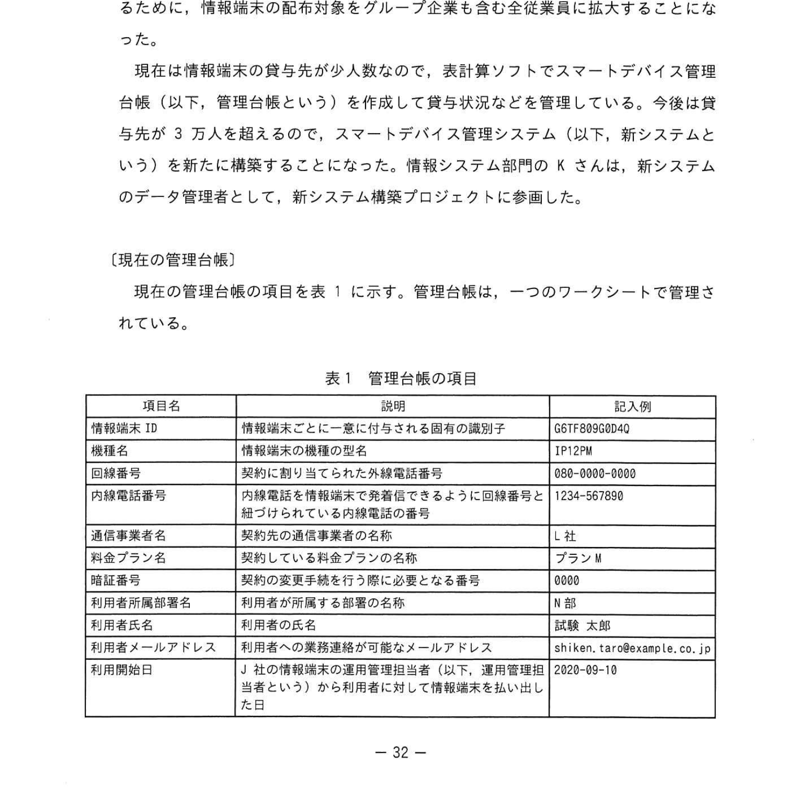
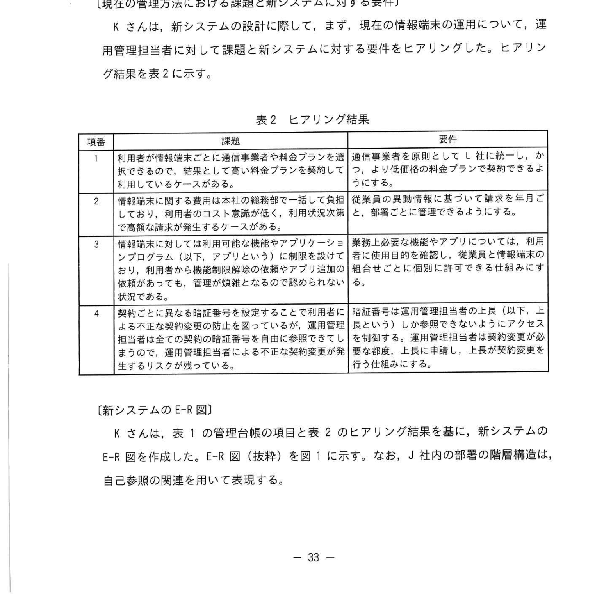
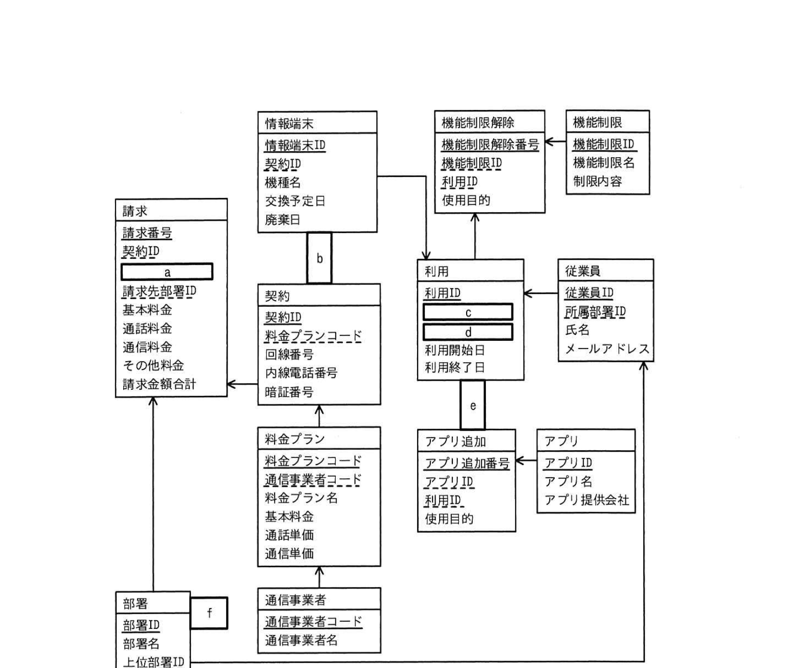
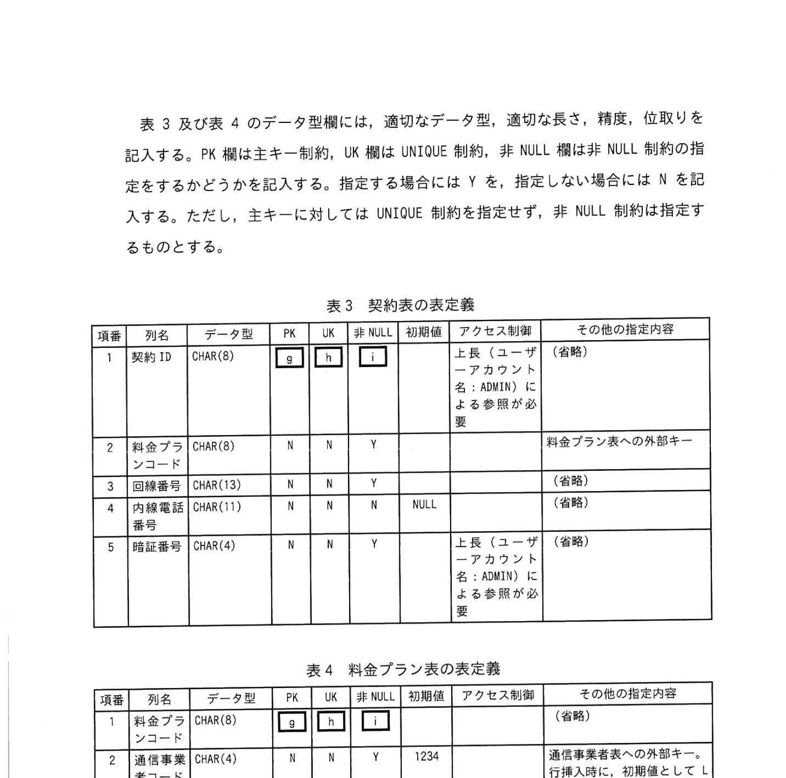
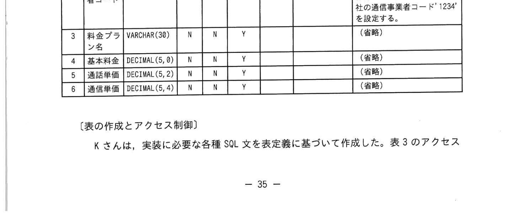
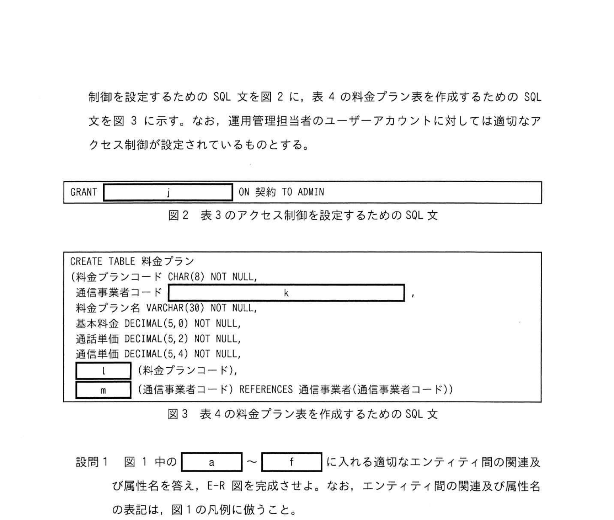
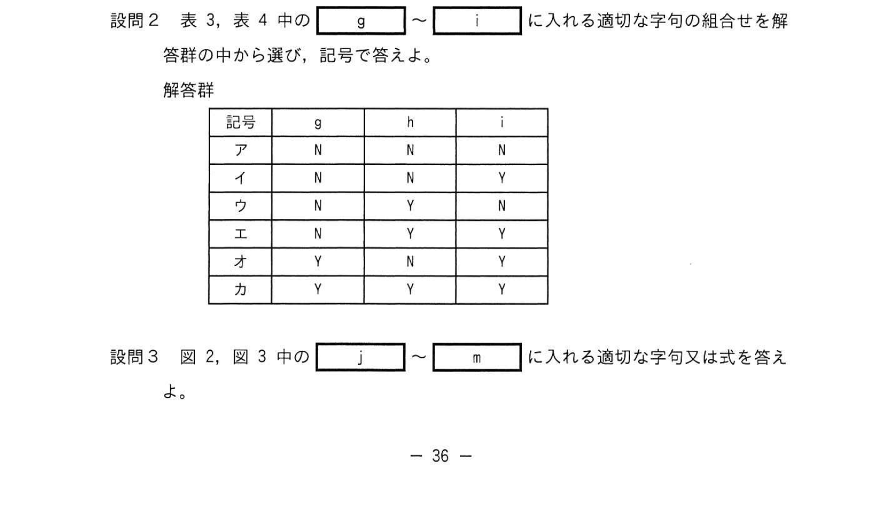

# 2022年秋期（令和4年度秋期）応用情報技術者試験 午後 問6（選択）
## データベース：スマートデバイス管理システムのデータベース設計（E-R図・SQL）

---

## 問題文

**問6** スマートデバイス管理システムのデータベース設計に関する次の記述を読んで、設問に答えよ。

J社は、グループ連結で従業員約3万人を抱える自動車メーカーである。従来は事業継続性・災害時対応施策の一環として、本社の部長職以上にスマートフォン及びタブレットなどのスマートデバイスを貸与していた。今回の働き方改革の一環として、従業員全員がいつでも・どこでも作業できるように、情報端末のグループ全従業員への配布対象をグループ企業も含む全従業員に拡大することになった。

現在は情報端末の貸与先が少ない数のため、計算ソフトでスマートデバイス管理（以下、管理台帳という）を作成して貸与や返却状況などを管理していた。今後は貸与台数が3万人を超えるため、スマートデバイス管理システム（以下、新システムという）を新たに構築することになった。情報システム部のKさんは、新システムのデータ管理者として、新システム構築プロジェクトに参画した。

---

### 〔現在の管理台帳〕

現在の管理台帳の項目を表1に示す。管理台帳は、一つのワークシートで管理されている。

### 表1 管理台帳の項目



> | 項目名 | 説明 | 記入例 |
> |--------|------|--------|
> | 情報端末ID | 情報端末ごとに一意に付与される固有の識別子 | GET78890A42 |
> | 機種名 | 情報端末の機種の名称 | LP12P |
> | 回線番号 | 契約に割り当てられた外線電話番号 | 080-8000-8000 |
> | 確認番号 | 内線番号を記載している内線管理台帳の回線番号に紐づくための番号 | 24-56780 |
> | 通信事業者名 | 契約の通信事業者の名前 | L社 |
> | 契約プラン名 | 料金プランの名称 | プランM |
> | 利用者所属部署名 | 利用者が所属する組織の名前 | N部 |
> | 利用者名 | 利用者の名前 | 鈴木 太郎 |
> | 利用者メールアドレス | 利用者への業務連絡が可能なメールアドレス | shiken.taro@example.co.jp |
> | 利用開始日 | J社の情報端末の運用管理担当者（上長）が、運用管理担当者（ユーザ）から利用者に対して情報端末末を貸し出した日 | 2020-09-10 |
> | 利用終了日 | 利用者への運用管理担当者（上長）に対して情報端末末を返却した日 | — |
> | 交換予定日 | J社で情報セキュリティ対策の観点から2〜3年ごとに一回、情報端末の交換をおこなっており、新しい情報端末との交換を予定している日 | 2022-09-10 |
> | 廃日 | 情報端末を廃棄事業者に引き渡した日 | — |

---

### 〔現在の管理台帳の課題と新システムに対する要件〕

Kさんは、新システムの設計に際して、まず、現在の情報端末の運用について、運用管理担当者に対して課題と新システムに対する要件をヒアリングした。ヒアリング結果を表2に示す。

### 表2 ヒアリング結果



> | 項番 | 課題・要件 |
> |------|-----------|
> | 1 | 利用者が端末ごとに通信費や料金プランを知らべるとともに、選択したプランの変更や更新ができるようにする |
> | 2 | 情報端末に関する本社の社規経費や料金プランを業種別に確認でき・管理できる必要がある。また、利用者は機能制限部分の閲覧やアプリ追加法が適切に確保されていることが望ましい |
> | 3 | 情報端末に関する可視化モバイルアプリを提供することで、利用者がどこからでもアクセスできる仕組みにする。ただし、情報端末管理は個人に許可できる仕組みにする必要がある |
> | 4 | 契約ごとに異なる回線番号を契約ごとに利用者のIDと照合して参照できる仕組みを構築する必要があり（以下略）。運用管理担当者（上長）による不正な契約変更が発生するリスクを防止するために対策を講じる |

---

### 〔新システムのE-R図〕

Kさんは、表1の管理台帳の項目と表2のヒアリング結果を基に、新システムのE-R図を作成した。E-R図（抜粋）を図1に示す。なお、J社内部の部署の階層構造は、自己参照の関係を用いて表現する。

### 図1 新システムのE-R図（抜粋）



> **主なエンティティ：**
> - **情報端末**（情報端末ID, 機種名, 機能名, 交換予定日, 廃棄日）
> - **契約**（契約ID, 料金プランコード, 回線番号, 確認番号, 内線番号情報番号, 暗証番号）
> - **機能制限設定**（機能制限設定ID, 利用可否, 機能制限設定名）
> - **機能制限**（機能制限ID, 利用禁止日）
> - **利用**（利用ID, 利用開始日, 利用終了日）
> - **従業員**（従業員ID, 従業員名, メールアドレス）
> - **部署**（部署ID, 部署名, 上位部署ID）
> - **料金プラン**（料金プランコード, 料金プラン名, 基本料金, 通話単価, 通信単価）
> - **アプリ追加**（アプリ追加ID, アプリID, アプリ名, 利用日, 使用料）
> - **通信事業者**（通信事業者コード, 通信事業者名）
>
> 凡例：エンティティ名 ─── 1対1 ─── 1対多 ─── 多対多

---

### 〔表定義〕

このデータベースでは、E-R図のエンティティ名を表名にし、属性名を列名にして、適切なデータ型で表定義した関係データベースによって、データを管理する。Kさんは、図1のE-R図を実装するために、詳細設計として表定義の内容を検討した。

### 表3 契約表の表定義



> | 項番 | 列名 | データ型 | PK | UX | 非NULL | アクセス制限 | その他の指定内容 |
> |------|------|---------|----|----|-------|------------|----------------|
> | 1 | 契約ID | CHAR(8) | Y | □ | □ | 上長（ユーザアカウント名：ADMIN）による参照が必要 | |
> | 2 | 料金プランコード | CHAR(8) | N | N | Y | — | 料金プラン表への外部キー |
> | 3 | 回線番号 | CHAR(13) | N | N | Y | NULL | |
> | 4 | 確認番号 | CHAR(11) | N | `[　g　]` | `[　h　]` | | |
> | 5 | 暗証番号 | CHAR(4) | N | N | `[　i　]` | SELECT（契約ID, 暗証番号）とする | |

### 表4 料金プラン表の表定義



> | 項番 | 列名 | データ型 | PK | UX | 非NULL | アクセス制限 | その他の指定内容 |
> |------|------|---------|----|----|-------|------------|----------------|
> | 1 | 料金プランコード | CHAR(8) | Y | □ | □ | — | |
> | 2 | 通信事業者コード | CHAR(4) | N | N | Y | — | 通信事業者表への外部キー。初期値として '1234' を設定する |
> | 3 | 料金プラン名 | VARCHAR(38) | N | N | Y | — | |
> | 4 | 基本料金 | DECIMAL(5,0) | N | N | Y | — | |
> | 5 | 通話単価 | DECIMAL(5,2) | N | N | Y | — | |
> | 6 | 通信単価 | DECIMAL(5,4) | N | N | Y | — | |

---

### 〔表の作成とアクセス制御〕

Kさんは、実装に必要な各種 SQL 文を表定義に基づいて作成した。表3のアクセス制御を設定するためのSQL文を図2に、表4の料金プラン表を作成するためのSQL文を図3に示す。

### 図2 表3のアクセス制御を設定するためのSQL文



```sql
GRANT [　j　] ON 契約 TO ADMIN
```

### 図3 表4の料金プラン表を作成するためのSQL文



```sql
CREATE TABLE 料金プラン表 (
  料金プランコード CHAR(8) NOT NULL,
  [　k　]  CHAR(4) [　l　] NOT NULL,
  料金プラン名 VARCHAR(38) NOT NULL,
  基本料金 DECIMAL(5,0) NOT NULL,
  通話単価 DECIMAL(5,2) NOT NULL,
  通信単価 DECIMAL(5,4) NOT NULL,
  [　m　] (料金プランコード),
  (通信事業者コード) REFERENCES 通信事業者表（通信事業者コード）
)
```

---

## 設問

### 設問1 図1中の `[　a　]` 〜 `[　f　]` に入れる適切なエンティティ間の関連及び属性名を答え、E-R図を完成させよ。なお、エンティティ間の関連及び属性名の表記は、図1の凡例に倣うこと。

### 設問2 表3、表4中の `[　g　]` 〜 `[　i　]` に入れる適切な字句の組合せを解答群の中から選び、記号で答えよ。

**解答群：**

| 記号 | g | h | i |
|------|---|---|---|
| ア | N | N | N |
| イ | N | N | Y |
| ウ | N | Y | N |
| エ | N | Y | Y |
| オ | Y | N | Y |
| カ | Y | Y | Y |

### 設問3 図2、図3中の `[　j　]` 〜 `[　m　]` に入れる適切な字句又は式を答えよ。

---

## 解答と解説

### 設問1 正解（E-R図の属性・関連）

E-R図の空欄には以下が入る（IPA公式）：

| 空欄 | 正解 | 解説 |
|------|------|------|
| **a** | 年月 | 利用状況をまとめる月次集計の属性。年月が必要 |
| **b** | ↑（1対1） | 情報端末と契約の関係（1台の端末に1つの契約） |
| **c** | 従業員ID | 利用エンティティと従業員エンティティを結ぶ属性 |
| **d** | 情報端末ID | 利用エンティティと情報端末エンティティを結ぶ外部キー |
| **e** | ↓（1対多） | 部署と従業員の関係（1つの部署に複数の従業員） |
| **f** | ←（自己参照） | 部署の上位部署を示す自己参照関係 |

順不同の場合：c=従業員ID、d=情報端末ID

---

### 設問2 正解：オ（g = Y、h = N、i = Y）

| 空欄 | 正解 | 解説 |
|------|------|------|
| **g（確認番号 UX）** | Y | 確認番号は内線番号情報番号に紐付けるための番号で、一意（UNIQUE）であるべき |
| **h（確認番号 非NULL）** | N | 確認番号はNULL可（内線を持たない端末もある） |
| **i（暗証番号 非NULL）** | Y | 暗証番号はSECURITYの観点から必須（NOT NULL）。初期値として '1234' が設定される |

---

### 設問3

**(正解：j = SELECT (契約ID, 暗証番号)、k = CHAR(4) DEFAULT '1234' NOT NULL、l = PRIMARY KEY、m = FOREIGN KEY)**

図3の料金プラン表のCREATE TABLE文における空欄。通信事業者コード列の定義（k）、主キー制約行（l）、外部キー制約行（m）に対応する。

| 空欄 | 正解 | 解説 |
|------|------|------|
| **j** | SELECT (契約ID, 暗証番号) | GRANT文でADMINユーザに付与する権限。表3の仕様から特定列（契約ID・暗証番号）のみのSELECT権限 |
| **k** | CHAR(4) DEFAULT '1234' NOT NULL | 通信事業者コード列の定義。初期値'1234'（L社）を設定し、NOT NULL制約を指定 |
| **l** | PRIMARY KEY | 料金プランコードを主キーとする制約行「PRIMARY KEY (料金プランコード)」 |
| **m** | FOREIGN KEY | 通信事業者コードの外部キー制約行「FOREIGN KEY (通信事業者コード) REFERENCES 通信事業者(通信事業者コード)」 |

**IPA公式：**
- j = SELECT (契約ID, 暗証番号)
- k = CHAR(4) DEFAULT '1234' NOT NULL
- l = PRIMARY KEY
- m = FOREIGN KEY

---

## 参考：主要キーワード

| 用語 | 説明 |
|------|------|
| E-R図（Entity-Relationship Diagram） | エンティティとその関連を図で表現するデータモデリング手法 |
| 主キー（PRIMARY KEY） | テーブルの各行を一意に識別するための列または列の組合せ |
| 外部キー（FOREIGN KEY） | 別テーブルの主キーを参照する制約 |
| UNIQUE制約 | 列の値が重複しないことを保証する制約 |
| NOT NULL制約 | 列にNULL値を禁止する制約 |
| DEFAULT制約 | 値が指定されなかった場合のデフォルト値を設定する制約 |
| GRANT文 | データベースオブジェクトへのアクセス権限を付与するSQL文 |
| 自己参照 | 同一テーブルの列が同テーブルの主キーを参照する構造（部署の上位部署など） |
| CHAR vs VARCHAR | CHAR：固定長文字列。VARCHAR：可変長文字列 |
| DECIMAL(p,s) | 精度p、小数桁数sの固定小数点数型 |
