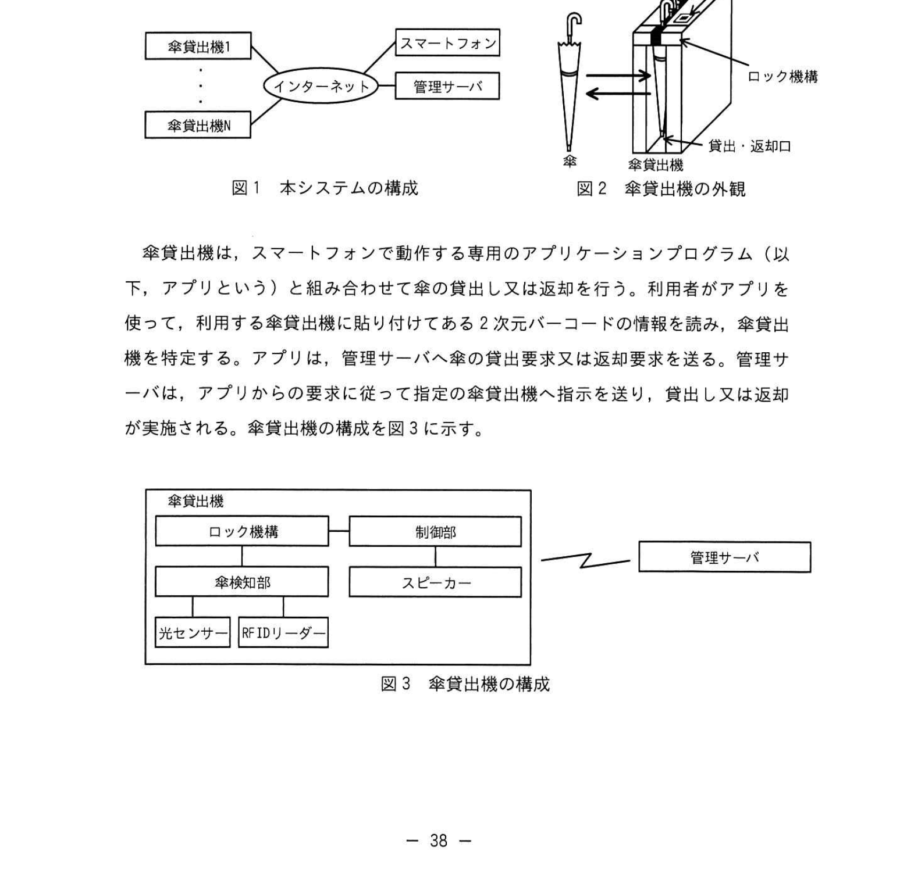
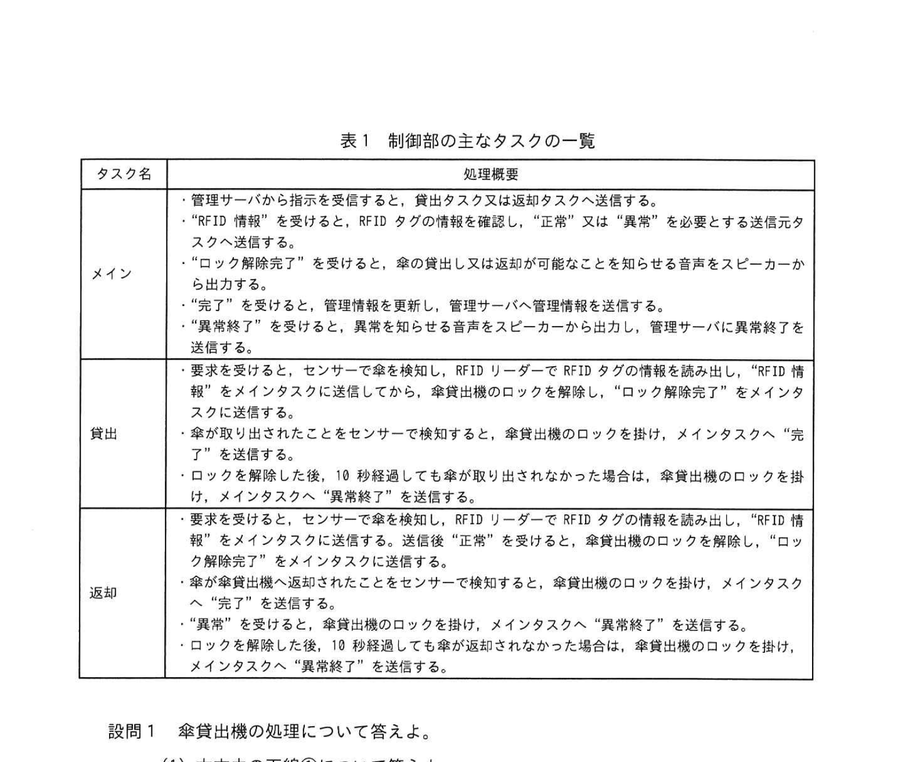
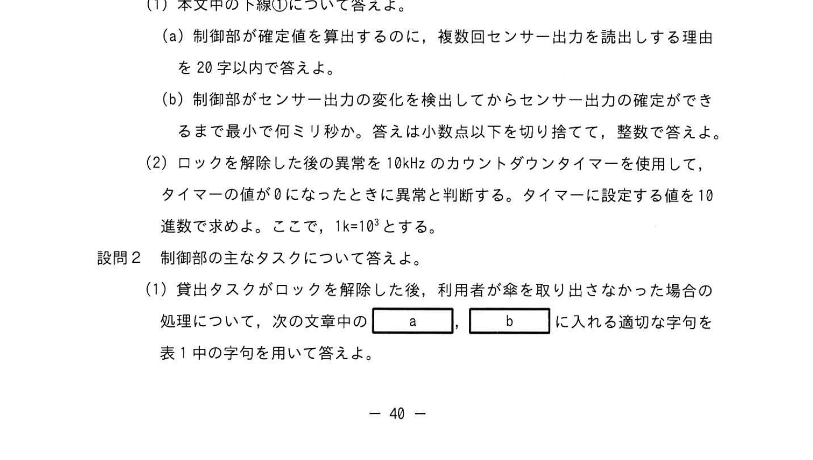

# 2022年秋期（令和4年度秋期）応用情報技術者試験 午後 問7（選択）
## 組込みシステム開発：傘シェアリングシステム（RTOS・センサー・ロック制御）

---

## 問題文

**問7** 傘シェアリングシステムに関する次の記述を読んで、設問に答えよ。

I社は、鉄道駅、商業施設、公共施設などに無人の傘貸出機を設置し、利用者に傘を貸し出す、傘シェアリングシステム（以下、本システムという）を開発している。本システムの構成を図1に、傘貸出機の外観を図2に示す。

### 図1 本システムの構成／図2 傘貸出機の外観

> 図1：傘貸出機1〜傘貸出機N ── インターネット ── スマートフォン／管理サーバ
> 図2：傘貸出機には貸出・返却口、ロック機構、2次元バーコードがあり、傘を貸出・返却する。

傘貸出機は、スマートフォンで動作する専用のアプリケーションプログラム（以下、アプリという）と組み合わせて傘の貸出し又は返却を行う。利用者がアプリを使って、利用する傘貸出機に貼り付けてある2次元バーコードの情報を読み、傘貸出機を特定する。アプリは、管理サーバへ傘の貸出要求又は返却要求を送る。管理サーバは、アプリからの要求に従って指定の傘貸出機へ指示を送り、貸出し又は返却が実施される。傘貸出機の構成を図3に示す。

### 図3 傘貸出機の構成

> 傘貸出機 ── 制御部 ⇜ 管理サーバ
> - ロック機構 ── 制御部
> - ロック機構 ── 傘検知部 ──（光センサー、RFIDリーダー）
> - 制御部 ── スピーカー

---

### 〔傘貸出機の処理〕

- 貸出・返却口に内蔵されているロック機構は、制御部からの指示で貸出・返却口のロックを制御する。ロック機構は、1度の操作で傘貸出機から1本の傘の貸出し、又は、1本の傘の返却ができる。ロックが解除されると、制御部はスピーカーから音声を出力して、ロックが解除されたことを利用者に知らせる。また、ロック機構は、貸出時と返却時とでロックの解除方法が異なっており、貸出時のロックの解除では、傘の貸出しだけが可能となり、返却時のロックの解除では、傘の返却だけが可能となる。
- ロック機構の傘検知部は、傘検知部を通過する傘を検知する光センサー（以下、センサーという）及び傘に付与される識別情報を記録したRFIDタグを読み取るRFIDリーダーで構成される。①**制御部は、傘検知部のセンサー出力の変化を検出すると10ミリ秒周期で出力を読み出し、5回連続で同じ値が読み出されたときに、確定と判断し、その値を確定値とする。** 傘の特定には、RFIDリーダーで読み出した情報（以下、RFIDタグの情報という）が使用される。傘貸出機が貸出し、返却を行うためのロックを解除した後10秒経過しても傘の貸出し、返却が行われなかった場合は、異常と判断し、ロックを掛ける。異常の際は、制御部がスピーカーから音声を出力して、異常が発生したことを利用者に知らせる。
- 傘貸出機内の傘の本数は、制御部で管理する。本システムの管理者は、初回の傘設置の際、管理サーバ経由で傘の本数の初期値を傘貸出機に登録する。
- 傘貸出機は、利用者への傘の貸出し又は返却が終了すると、自機が保有する傘の本数及び傘を識別するRFIDタグの情報（以下、これらを管理情報という）を更新し、管理サーバに送信する。傘貸出機は、全ての管理情報を管理サーバから受信し、記憶する。

---

### 〔制御部のソフトウェア構成〕

制御部のソフトウェアには、リアルタイムOSを使用する。制御部の主なタスクの一覧を表1に示す。

### 表1 制御部の主なタスクの一覧

> **メイン**
> - 管理サーバから指示を受信すると、貸出タスク又は返却タスクへ送信する。
> - "RFID情報"を受けると、RFIDタグの情報を確認し、"正常"又は"異常"を必要とする送信元タスクへ送信する。
> - "ロック解除完了"を受けると、傘の貸出し又は返却が可能なことを知らせる音声をスピーカーから出力する。
> - "完了"を受けると、管理情報を更新し、管理サーバへ管理情報を送信する。
> - "異常終了"を受けると、異常を知らせる音声をスピーカーから出力し、管理サーバに異常終了を送信する。
>
> **貸出**
> - 要求を受けると、センサーで傘を検知し、RFIDリーダーでRFIDタグの情報を読み出し、"RFID情報"をメインタスクに送信してから、傘貸出機のロックを解除し、"ロック解除完了"をメインタスクに送信する。
> - 傘が取り出されたことをセンサーで検知すると、傘貸出機のロックを掛け、メインタスクへ"完了"を送信する。
> - ロックを解除した後、10秒経過しても傘が取り出されなかった場合は、傘貸出機のロックを掛け、メインタスクへ"異常終了"を送信する。
>
> **返却**
> - 要求を受けると、センサーで傘を検知し、RFIDリーダーでRFIDタグの情報を読み出し、"RFID情報"をメインタスクに送信する。送信後"正常"を受けると、傘貸出機のロックを解除し、"ロック解除完了"をメインタスクに送信する。
> - 傘が傘貸出機へ返却されたことをセンサーで検知すると、傘貸出機のロックを掛け、メインタスクへ"完了"を送信する。
> - "異常"を受けると、傘貸出機のロックを掛け、メインタスクへ"異常終了"を送信する。
> - ロックを解除した後、10秒経過しても傘が返却されなかった場合は、傘貸出機のロックを掛け、メインタスクへ"異常終了"を送信する。

---

## 設問

### 設問1 傘貸出機の処理について答えよ。

**(1)** 本文中の下線①について答えよ。

**(a)** 制御部が確定値を算出するのに、複数回センサー出力を読出しする理由を20字以内で答えよ。

**(b)** 制御部がセンサー出力の変化を検出してからセンサー出力の確定ができるまで最小で何ミリ秒か。答えは小数点以下を切り捨てて、整数で答えよ。

**(2)** ロックを解除した後の異常を10kHzのカウントダウンタイマーを使用して、タイマーの値が0になったときに異常と判断する。タイマーに設定する値を10進数で求めよ。ここで、1k=10³とする。

### 設問2 制御部の主なタスクについて答えよ。

**(1)** 貸出タスクがロックを解除した後、利用者が傘を取り出さなかった場合の処理について、次の文章中の `[　a　]`、`[　b　]` に入れる適切な字句を表1中の字句を用いて答えよ。

> 貸出タスクがロックを解除したにもかかわらず、利用者が傘を取り出さなかった場合は、貸出タスクが異常と判断し、 `[　a　]` タスクに送信する。"異常終了"を受けた `[　a　]` タスクは、 `[　b　]` に異常終了を送信する。

**(2)** 返却時のタスクの処理について記述した次の文章中の `[　c　]`、`[　d　]` に入れる適切な字句を解答群の中から選び、記号で答えよ。

> メインタスクは、不正な傘を返却させないように、返却タスクが傘から読み出した `[　c　]` に対し、 `[　d　]` と異なっていないか確認し、異なっていなければ、返却タスクに "正常" を送信する。返却タスクはメインタスクから"正常"を受けるまで、ロックを解除しない。

**解答群：**
- ア RFIDタグの情報
- イ RFIDリーダー
- ウ 傘の本数
- エ 貸出中の傘
- オ センサー出力
- カ 不正な傘
- キ 返却タスク
- ク メインタスク

### 設問3 制御部のタスクの処理について答えよ。

**(1)** 次の文章中の `[　e　]` 〜 `[　h　]` に入れる適切な字句を答えよ。

> 傘の貸出しを行う場合、メインタスクから要求を受けた貸出タスクは、傘検知部のセンサーを起動し、傘を検知する。傘が検知されたらRFIDリーダーでRFIDタグの情報を読み出し、"RFID情報"をメインタスクに送信する。"RFID情報"を送信後、傘貸出機のロックを解除し、"`[　e　]`"をメインタスクに送信する。傘が傘貸出機から取り出されたことを `[　f　]` すると、傘貸出機の `[　g　]` 、メインタスクへ"`[　h　]`"を送信する。

**(2)** "完了"を受けた場合のメインタスクの処理を25字以内で答えよ。

---

## 解答と解説

### 設問1

**(1)(a) 正解：ノイズなどによる誤動作を防ぐため（20字以内）**

センサー出力はノイズや振動で瞬間的に変化することがある。10ミリ秒周期で読み出し、5回連続で同じ値のときに確定とすることで、ノイズなどによる誤動作（誤検知・チャタリング）を防ぎ、正しい確定値を得る。

**IPA公式：ノイズなどによる誤動作を防ぐため**

**(1)(b) 正解：40（ミリ秒）**

変化を検出した時点を1回目の読み出しとすると、以降10ミリ秒周期で読み出す。5回連続で同じ値が読み出されたときに確定するので、確定までに要する最小時間は、2回目〜5回目までの4周期分＝10ミリ秒 × 4 ＝ **40ミリ秒**。

**IPA公式：40**

**(2) 正解：100,000**

10kHz＝10×10³＝10,000Hz、すなわち1秒間に10,000回カウントダウンする。異常判断はロック解除後10秒なので、設定値＝10,000カウント/秒 × 10秒 ＝ **100,000**。

**IPA公式：100,000**

---

### 設問2

**(1) 正解：a = メイン、b = 管理サーバ**

貸出タスクは異常（利用者が傘を取り出さなかった）と判断すると、メインタスクへ"異常終了"を送信する。"異常終了"を受けたメインタスクは、管理サーバに異常終了を送信する。

**(2) 正解：c = ア（RFIDタグの情報）、d = エ（貸出中の傘）**

返却タスクが傘から読み出したRFIDタグの情報が、貸出中の傘（の情報）と異なっていないかをメインタスクが確認する。異なっていなければ正規の傘の返却であり、返却タスクに"正常"を送信してロック解除を許可する。

---

### 設問3

**(1) 正解：e = ロック解除完了、f = センサーで検知、g = ロックを掛け、h = 完了**

| 空欄 | 正解 | 解説 |
|------|------|------|
| **e** | ロック解除完了 | ロック解除後にメインタスクへ状態を報告する |
| **f** | センサーで検知 | 傘が取り出されたことをセンサーで検知する |
| **g** | ロックを掛け | 傘が取り出された後、傘貸出機のロックを掛ける |
| **h** | 完了 | 貸出処理完了をメインタスクへ通知する |

**(2) 正解：管理情報を更新し、管理サーバへ送信する。（20字）**

"完了"を受けたメインタスクは、傘の本数とRFIDタグの情報（管理情報）を更新し、管理サーバへ管理情報を送信して同期する。

---

## 参考：主要キーワード

| 用語 | 説明 |
|------|------|
| RTOS（Real-Time OS） | リアルタイム処理のためのOS。タスク管理・割込み処理を時間制約内で行う |
| タスク | RTOSにおける処理単位。優先度に基づいてスケジューリングされる |
| センサーデバウンス | ノイズによる誤検知を防ぐため、複数回読み取って確定させる処理 |
| チャタリング | 機械的スイッチやセンサーがON/OFFを短時間に繰り返す現象 |
| RFIDタグ | 無線で識別情報を送受信するタグ。傘に付与して識別に使用 |
| カウントダウンタイマー | 一定周波数でカウントダウンし、0に達したときにイベントを発生させる回路 |
| ロック機構 | 傘の貸出・返却口を物理的に制御する機構。制御部から指示を受ける |
| シェアリングシステム | 物品を複数利用者で共有するシステム。IoT機器で管理する |

---
*出典: 独立行政法人情報処理推進機構(IPA) 令和4年度 秋期 応用情報技術者試験 午後 問7*
*本ファイルは個人の学習・研究目的で、視覚的に読み取り書き起こしたものです。*
