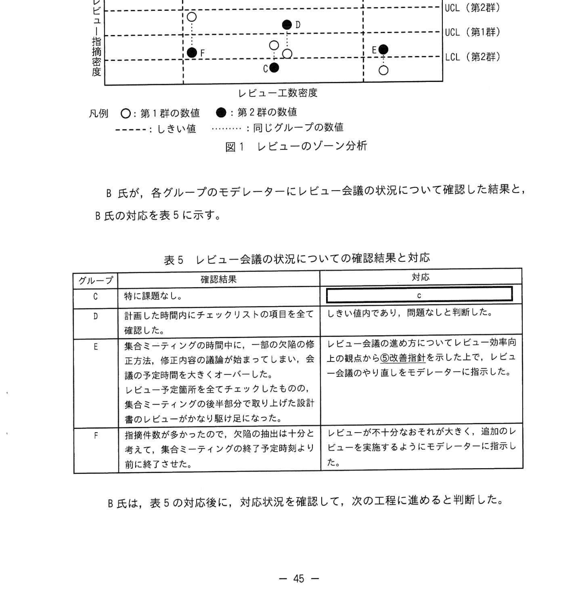

# 2022年秋期（令和4年度秋期）応用情報技術者試験 午後 問8（選択）
## 情報システム開発：設計レビュー（インスペクション・ゾーン分析）

---

## 問題文

**問8** 設計レビューに関する次の記述を読んで、設問に答えよ。

A社は、中堅のSI企業である。A社は、先頃、取引先のH社の情報共有システムの刷新を請け負うことになった。A社は、H社の情報共有システムの刷新プロジェクトを立ち上げ、B氏がプロジェクトマネージャとしてシステム開発を取り仕切ることになった。H社の情報共有システムは、開発予定規模が同程度の四つのサブシステムから成る。

A社では、プロジェクトの開発メンバーをグループに分けて管理することにしている。B氏は、それにのっとり、開発メンバーを、サブシステムごとにCグループ、Dグループ、Eグループ、Fグループに振り分け、グループごとに十分な経験があるメンバーをリーダーに選定した。

---

### 〔A社の品質管理方針〕

設計上の欠陥がテスト工程で見つかった場合、修正工数が膨大になるので、A社では、設計上の欠陥を早期に検出できる設計レビューを重視している。また、レビューで見つかった欠陥の修正において、新たな欠陥である二次欠陥が生じないように確認することを徹底している。

---

### 〔A社のレビュー形態〕

A社の設計工程でのレビュー形態を表1に示す。

### 表1 設計工程でのレビュー形態

| 実施時期 | レビュー実施方法 |
|---------|---------------|
| 設計途中（グループのリーダーが進捗状況を考慮して決定） | グループのメンバーがレビューアとなる。①設計者が設計書（作成途中の物も含む）を複数のレビューアに配布又は回覧して、レビューアが欠陥を指摘する。誤字、脱字、表記ルール違反は、この段階でできるだけ排除する。誤字、脱字、表記ルール違反のチェックには、修正箇所の候補を抽出するツールを利用する。 |
| 外部設計、内部設計が完了した時点 | グループ単位でレビュー会議を実施する。必要に応じて別グループのリーダーの参加を求める。レビュー会議の目的は、設計上の欠陥（矛盾、不足、重複など）を検出することである。検出した欠陥の対策は、欠陥の検出とは別のタイミングで議論する。設計途中のレビューで対応が漏れた誤字、脱字、表記ルール違反もレビュー会議で検出する。②レビュー会議の主催者（以下、モデレーターという）が全体のコーディネートを行う。参加者が明確な役割を受けもち、チェックリストなどに基づいた指摘を行い、正式な記録を残す。レビュー会議の結果は、次の工程に進む判断基準の一つになっている。 |

外部設計や内部設計が完了した時点で行うレビュー会議の手順を表2に示す。

### 表2 レビュー会議の手順

| 項番 | 項目 | 内容 |
|------|------|------|
| 1 | 必要な文書の準備 | 設計者が設計書を作成してモデレーターに送付する。モデレーターがチェックリストなどを準備する。 |
| 2 | キックオフミーティング | モデレーターは、設計書、チェックリストを配布し、参加者がレビューの目的を達成できるように、設計内容の背景、前提、重要機能などを説明する。モデレーターは、集合ミーティングにおける設計書の評価について、次の基準に基づいて定性的に判断することを説明する。 ・"合格"……軽微な修正が必要かもしれないが、フォローアップミーティングは不要である。 ・"条件付合格"……小規模な修正が必要で、フォローアップミーティングで修正を検証する。 ・"やり直し"……大規模な修正が必要、又は、欠陥や課題の検出が十分でないのでレビュー会議をやり直す。 評価を導く意思決定のルール（モデレーターによる決定、多数決、全員一致）についても、参加者全員の合意を得る。モデレーターは、集合ミーティングにおける読み手、記録係、レビューアを指名する。 |
| 3 | 参加者の事前レビュー | 集合ミーティングまでに、レビューアが各自でチェックリストに従って設計書のレビューを行い、欠陥を洗い出す。 |
| 4 | 集合ミーティング | 読み手がレビュー対象の設計書を参加者に説明して、レビューアから指摘された欠陥を記録係が記録する。`[　a　]` は、集合ミーティングの終了時に、意思決定のルールに従い"合格"、"条件付合格"、"やり直し"の評価を導く。 |
| 5 | 発見された欠陥の解決 | 集合ミーティングで発見された欠陥を設計者が解決する。 |
| 6 | フォローアップミーティング | 評価が"条件付合格"の場合に、モデレーターと設計者を含めたメンバーとで実施する。欠陥が全て解決されたことを確認する。設計書の修正が `[　b　]` を生じさせることなく正しく行われたことを確認する。 |

---

### 〔モデレーターの選定〕

B氏は、グループのリーダーにモデレーターの経験を積ませたいと考えた。しかし、グループのリーダーは自グループの開発内容に精通しているので、自グループのレビュー会議にはモデレーターではなく、レビューアとして参加させることにした。

また、B氏自身は開発メンバーの査定に関わっており、参加者が欠陥の指摘をためらうおそれがあると考え、レビュー会議には参加しないことにした。

B氏は、これらの考え方に基づいて、各グループのレビュー会議の③**モデレーターを選定した。**

---

### 〔レビュー会議におけるレビュー結果の評価〕

A社の品質管理のための基本測定量（抜粋）を表3に示す。

### 表3 基本測定量（抜粋）

| 対象工程 | 基本測定量 | 単位 | 補足 |
|---------|-----------|------|------|
| 設計工程 | 設計書の規模 | ページ | |
| | レビュー工数 | 人時 | 表2のレビュー会議の手順の項番3と項番4に要した工数の合計を測定する。工数を標準化するために、育成目的などで標準的なスキルをもたないレビューアを参加させる場合は、その工数は含めない。 |
| | レビュー指摘件数（第1群） | 件 | 誤字、脱字、表記ルール違反の件数を測定する。 |
| | レビュー指摘件数（第2群） | 件 | 誤字、脱字、表記ルール違反以外の、設計上の欠陥の件数を測定する。 |

レビュー会議における設計書のレビュー結果を、基本測定量から導出される指標を用いて分析する。設計書のレビュー結果の指標を表4に示す。

### 表4 設計書のレビュー結果の指標

| 指標 | 説明 |
|------|------|
| レビュー工数密度 | 1ページ当たりのレビュー工数 |
| レビュー指摘密度（第1群） | 1ページ当たりの第1群のレビュー指摘件数 |
| レビュー指摘密度（第2群） | 1ページ当たりの第2群のレビュー指摘件数 |

レビュー工数密度には、下方管理限界（以下、LCLという）と上方管理限界（以下、UCLという）を適用する。

④レビュー指摘密度（第1群）にはUCLだけ適用する。レビュー指摘密度（第2群）には、LCLとUCLを適用する。レビュー指摘密度（第1群）が高い場合、設計途中に実施したグループのメンバーによるレビューが十分に行われていないことが多く、レビュー指摘密度（第2群）も高くなる傾向にある。

H社の情報共有システムの内部設計が完了して、内部設計書のレビュー会議の集合ミーティングの結果は、全てのグループについて"条件付合格"であった。指標の集計が完了して、フォローアップミーティングも終了した段階で、B氏は、次の開発工程に進むかどうかを判断するために、内部設計書のレビュー結果の詳細、及び指標を確認した。

開発グループごとに、レビュー工数密度を横軸に、レビュー指摘密度を縦軸にとった、レビューのゾーン分析のグラフを図1に示す。

### 図1 レビューのゾーン分析

> 横軸：レビュー工数密度（縦の破線でLCL・UCLのしきい値）、縦軸：レビュー指摘密度（横の破線で上からUCL(第2群)・UCL(第1群)・LCL(第2群)）。
> - **グループC**：第1群○はLCL(第2群)付近、第2群●はLCL(第2群)を下回る（指摘密度が下限未満）。
> - **グループD**：第1群○は中位、第2群●はUCL(第1群)〜UCL(第2群)付近（しきい値内）。
> - **グループE**：レビュー工数密度がUCL付近（右端）、第2群●はLCL(第2群)付近。
> - **グループF**：レビュー工数密度がLCLを下回る（左端）、第1群○はUCL(第2群)付近と高い。
> 凡例：○＝第1群の数値、●＝第2群の数値、破線＝しきい値、点線＝同じグループの数値。

B氏が、各グループのモデレーターにレビュー会議の状況について確認した結果と、B氏の対応を表5に示す。

### 表5 レビュー会議の状況についての確認結果と対応

| グループ | 確認結果 | 対応 |
|---------|---------|------|
| C | 特に課題なし。 | `[　c　]` |
| D | 計画した時間内にチェックリストの項目を全て確認した。 | しきい値内であり、問題なしと判断した。 |
| E | 集合ミーティングの時間中に、一部の欠陥の修正方法、修正内容の議論が始まってしまい、会議の予定時間を大きくオーバーした。レビュー予定箇所を全てチェックしたものの、集合ミーティングの後半部分で取り上げた設計書のレビューがかなり駆け足になった。 | レビュー会議の進め方についてレビュー効率向上の観点から⑤改善指針を示した上で、レビュー会議のやり直しをモデレーターに指示した。 |
| F | 指摘件数が多かったので、欠陥の抽出は十分と考えて、集合ミーティングの終了予定時刻より前に終了させた。 | レビューが不十分なおそれが大きく、追加のレビューを実施するようにモデレーターに指示した。 |

B氏は、表5の対応後に、対応状況を確認して、次の工程に進めると判断した。

---

## 設問

### 設問1 〔A社のレビュー形態〕について答えよ。

**(1)** 表1中の下線①及び下線②で採用されているレビュー技法の種類をそれぞれ解答群の中から選び、記号で答えよ。

**解答群：**
- ア インスペクション
- イ ウォークスルー
- ウ パスアラウンド
- エ ラウンドロビン

**(2)** 表2中の `[　a　]` に入れる適切な役割を本文中の字句を用いて答えよ。

**(3)** 表2中の `[　b　]` に入れる適切な字句を本文中の字句を用いて答えよ。

### 設問2 本文中の下線③において、モデレーターに選定した人物を、本文中又は表中に登場する人物の中から20字以内で答えよ。

### 設問3 〔レビュー会議におけるレビュー結果の評価〕について答えよ。

**(1)** 本文中の下線④でLCLを不要とした理由を20字以内で答えよ。

**(2)** 表5中の `[　c　]` に入れる最も適切な対応を解答群の中から選び、記号で答えよ。

**解答群：**
- ア しきい値内であり、問題なしと判断した。
- イ 設計不良なので、再レビューをモデレーターに指示した。
- ウ レビューが不十分なおそれが大きく、追加のレビューを実施するようにモデレーターに指示した。
- エ レビュー指摘密度（第2群）がUCL（第2群）より十分に小さいので、設計上の欠陥はないと判断した。
- オ レビューの進め方、体制に問題がないか点検するようにモデレーターに指示した。

**(3)** 表5中の下線⑤の改善指針を、25字以内で答えよ。

---

## 解答と解説

### 設問1

**(1) 正解：下線① = ウ（パスアラウンド）、下線② = ア（インスペクション）**

| 下線 | 正解 | 解説 |
|------|------|------|
| **① 設計途中（設計書を複数のレビューアに配布・回覧）** | ウ（パスアラウンド） | 設計書を参加者に配布・回覧してレビューアが個別に欠陥を指摘する、集合しない非同期型のレビュー技法 |
| **② 設計完了後（モデレーター主催のレビュー会議）** | ア（インスペクション） | モデレーター主導、明確な役割分担、チェックリスト、正式な記録、フォローアップまで含む最も公式なレビュー技法 |

**(2) 正解：a = モデレーター**

集合ミーティングの終了時に、意思決定のルールに従い評価を導くのは、レビュー会議の主催者であるモデレーターである。

**(3) 正解：b = 二次欠陥**

〔A社の品質管理方針〕より、欠陥の修正で新たな欠陥（二次欠陥）が生じないよう確認を徹底している。フォローアップミーティングでは、修正が二次欠陥を生じさせずに正しく行われたことを確認する。

---

### 設問2 正解：別グループのリーダー（9字）

グループのリーダーは自グループのレビュー会議にはレビューアとして参加させ、モデレーターにはしない。またB氏自身も参加しない。したがって、各グループのモデレーターには、そのグループとは別のグループのリーダーを選定した。

**IPA公式：別グループのリーダー**

---

### 設問3

**(1) 正解：ツールの利用で抽出可能だから／設計途中のレビューで排除されているから（いずれか、20字以内）**

第1群（誤字・脱字・表記ルール違反）は、設計途中のレビュー（下線①）で排除され、かつ修正箇所の候補を抽出するツールで検出できる。指摘は少ないほど望ましく下限を下回っても問題にならないため、LCL（下限）を適用しない。

**IPA公式：ツールの利用で抽出可能だから／設計途中のレビューで排除されているから**

**(2) 正解：オ（レビューの進め方、体制に問題がないか点検するようにモデレーターに指示した。）**

グループCの確認結果は「特に課題なし」だが、図1ではレビュー指摘密度（第2群）がLCL（第2群）を下回っている。指摘密度が下限を下回るのは、設計上の欠陥が十分に検出できていない（レビューが不足している）おそれを示す。したがって「問題なし」ではなく、レビューの進め方・体制に問題がないか点検させる対応（オ）が適切。

**(3) 正解：集合ミーティングでは欠陥の指摘だけ行う。（20字）**

グループEは集合ミーティングで欠陥の修正方法・修正内容の議論を始めてしまい、予定時間を大幅にオーバーした。レビュー会議の目的は欠陥の検出であり、対策（修正方法・内容）の議論は別のタイミングで行う。集合ミーティングでは欠陥の指摘だけを行うのが改善指針となる。

**IPA公式：集合ミーティングでは欠陥の指摘だけ行う。**

---

## 参考：主要キーワード

| 用語 | 説明 |
|------|------|
| インスペクション | モデレーター主導の公式なレビュー。役割分担・チェックリスト・フォローアップを含む最も厳格なレビュー技法 |
| パスアラウンド | レビュー対象を参加者に配布・回覧して個別にレビューする非同期型のレビュー技法 |
| ウォークスルー | 設計者が主催し、レビュー内容を説明しながら進めるレビュー |
| ラウンドロビン | 参加者が持ち回りで役割を交代しながら行うレビュー |
| モデレーター | レビュー会議を主催し、プロセスを管理・進行する役割 |
| 二次欠陥 | 欠陥修正の過程で新たに発生した欠陥 |
| レビュー工数密度 | 1ページ当たりのレビューに要した工数（人時/ページ） |
| レビュー指摘密度 | 1ページ当たりのレビューで指摘された欠陥件数 |
| LCL（下方管理限界） | 値がこれを下回ったら異常と判断するしきい値 |
| UCL（上方管理限界） | 値がこれを上回ったら異常と判断するしきい値 |
| ゾーン分析 | レビュー工数密度と指摘密度を2軸のグラフで表示してレビューの状態を評価する手法 |

---
*出典: 独立行政法人情報処理推進機構(IPA) 令和4年度 秋期 応用情報技術者試験 午後 問8*
*本ファイルは個人の学習・研究目的で、視覚的に読み取り書き起こしたものです。*
