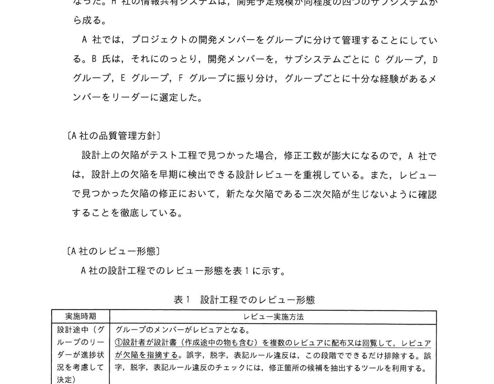
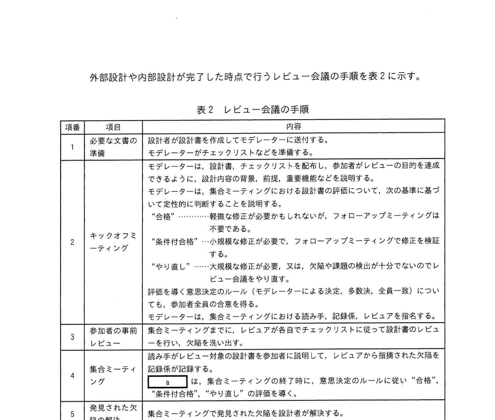
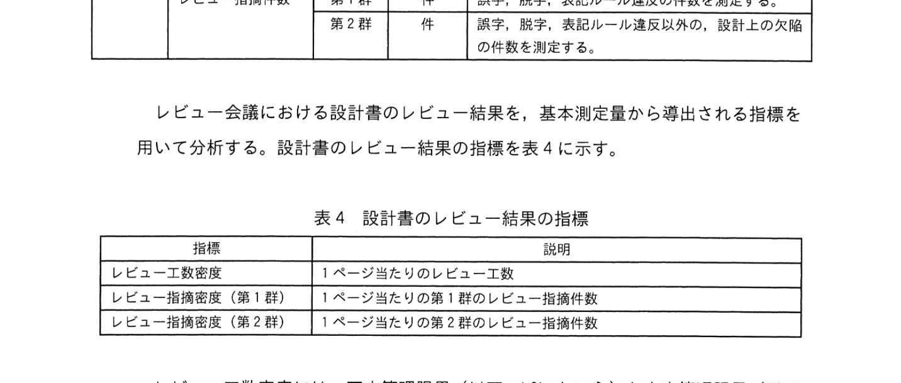
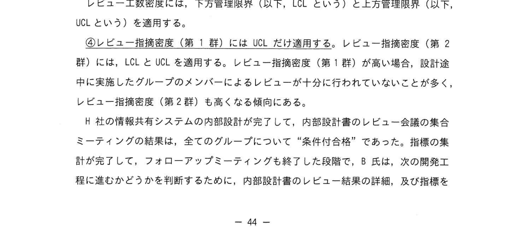
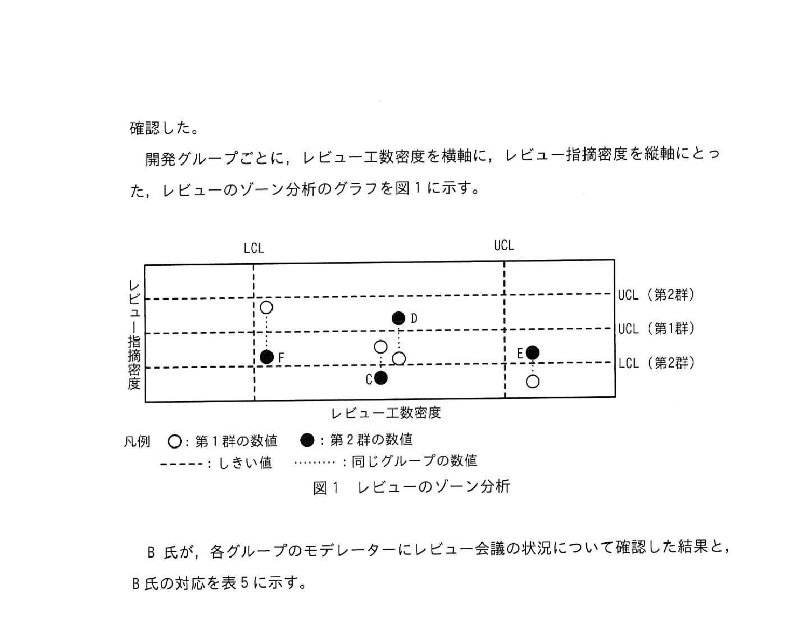

# 2022年秋期（令和4年度秋期）応用情報技術者試験 午後 問8（選択）
## 情報システム開発：設計レビュー（インスペクション・ゾーン分析）

---

## 問題文

**問8** 設計レビューに関する次の記述を読んで、設問に答えよ。

A社は、中堅のSI企業である。A社は、先端・最先端のH社の情報共有システムの革新を請け負うことになった。B氏がプロジェクトマネージャとしてシステム開発を取り仕切ることになった。H社の情報共有システムは、開発予定規模が同程度の四つのサブシステムから成る。

A社では、プロジェクトの開発メンバーをグループに分けて管理することにしている。B氏は、それにのっとり、開発メンバーを、サブシステムごとにCグループ、Dグループ、Eグループ、Fグループに振り分け、グループごとに十分な経験があるメンバーをリーダーに選定した。

---

### 〔A社のレビュー形態〕

A社の設計工程でのレビュー形態を表1に示す。

### 表1 設計工程でのレビュー形態

> | 実施時期 | レビュー実施方法 |
> |---------|---------------|
> | 設計中（グループのリーダーが実施） | ①**作成途中のもの**も含め、参加者がレビューに配布又は回覧して、レビューアが欠陥を指摘する。誤字、脱字、表記ルール違反はこの段階でできるだけ排除する。審査基準として質問のみを行う。 |
> | 外部設計・内部設計が完了した時点 | グループ単位でレビュー会議を実施する。必要に応じてグループのリーダー以外のグループリーダーをレビュー参加者としてレビュー会議に招聘する。 |

外部設計や内部設計が完了した時点で行うレビュー会議の手順を表2に示す。

### 表2 レビュー会議の手順

> | 項番 | 項目 | 内容 |
> |------|------|------|
> | 1 | 必要な文書の準備 | 設計者が設計書を作成してモデレーターに送付する。モデレーターがチェックリストなどを準備する。 |
> | 2 | キックオフミーティング | 設計者が説明（作成途中のものも含む）を行い、参加者のレビューの目的達成のために必要なものを説明する。前後にフォローアップミーティングを実施する前の段階。"条件付合格"：欠陥が必ずしもないが、フォローアップミーティングが必要。"やり直し"：欠陥や問題の指摘が十分でないと思われる。 |
> | 3 | 参加者の審前レビュー | 集合ミーティングに先立って参加者が欠陥チェックを実施する |
> | 4 | 集合ミーティング | 読み手がレビュー対象の設計書を参加者に説明して、レビューから発見された欠陥を記録し。 |
> | 5 | 見られた欠陥の処置 | 集合ミーティングで見られた欠陥は、"合格"：欠陥の修正が必要ないもの、"条件付合格"：欠陥の修正が必要だが、フォローアップミーティングには参加する必要がない。 |
> | 6 | フォローアップミーティング | 欠陥の処置を "合格" とするために、設計者が欠陥を修正したことを確認する。 |

---

### 〔モデレーターの選定〕

B氏は、グループのリーダーにモデレーターの経験を積ませたいと考えた。しかし、グループのリーダーは自グループの開発内容に精通しているので、自グループのレビュー会議にはモデレーターとしてではなく、レビューアとして参加させることにした。

また、B氏は自身が開発メンバーの直責に関わっており、参加者が欠陥の指摘をためらうおそれがある。そのため、レビュー会議は上から目線での指摘ではなく、対等に意見を述べる場であると考えた。B氏は、これらの考え方を基として、各グループのレビュー会議の③**モデレーターを**選定した。

---

### 〔レビュー会議におけるレビュー結果の評価〕

A社の品質管理のための基本測定量（抜粋）を表3に示す。

### 表3 基本測定量（抜粋）

> | 対象工程 | 基本測定量 | 単位 | 補足 |
> |---------|-----------|------|------|
> | 設計工程 | 設計書の規模 | ページ | — |
> | | レビュー工数 | 人時 | 表2のレビュー会議の手順の項番3と項番4に要した工数 |
> | | レビュー指摘件数（第1群） | 件 | 誤字、脱字、表記ルール違反と表記される件数 |
> | | レビュー指摘件数（第2群） | 件 | 誤字、脱字、表記ルール違反以外の、設計上の欠陥の件数 |

### 表4 設計書のレビュー結果の指標

> | 指標 | 説明 |
> |------|------|
> | レビュー工数密度 | 1ページあたりのレビュー工数 |
> | レビュー指摘密度（第1群） | 1ページあたりの第1群のレビュー指摘件数 |
> | レビュー指摘密度（第2群） | 1ページあたりの第2群のレビュー指摘件数 |

レビュー工数密度には、下方管理限界（以下、LCL）と上方管理限界（以下、UCL）を適用する。

④**レビュー指摘密度（第1群）にはUCLだけ適用する**。レビュー指摘密度（第2群）には、LCLとUCLを適用する。レビュー指摘密度（第2群）が高い場合、設計途中に実施したグループのメンバーによるレビューが十分に行われていないことが多く、レビュー指摘密度（第2群）が高くなる傾向がある。

H社の情報共有システムの内部設計が完了して、内部設計書のレビュー会議の集合ミーティングの結果について "条件付合格" の状態になった場合は、全てのグループについて "条件付合格" を集計して、フォローアップミーティングへ移行して段階で、B氏は、次の開発工程に進むかどうかを判断するために、内部設計書のレビュー結果の記述及び各指標を表5のグループの確認状況にまとめた。

### 図1 レビューのゾーン分析

> 横軸：レビュー工数密度、縦軸：レビュー指摘密度  
> - グループC：第1群○（LCL付近）、第2群●（LCL付近）  
> - グループD：第1群○（UCL/LCL内）、第2群●（UCL付近上）  
> - グループE：第1群○（UCL付近）、第2群●（LCL付近）  
> - グループF：第1群○（LCL付近）、第2群●（LCL〜UCL内）  
> 凡例：○：第1群の数値、●：第2群の数値

---

### 表5 レビュー会議の状況についての確認結果と対応

> | グループ | 確認結果 | 対応 |
> |---------|---------|------|
> | C | 特に課題なし。 | しきい値内であり、問題なしと判断した。 |
> | D | 計画した時間内にチェックリストの項目を全て確認した。 | レビュー会議の進め方についてレビュー効率向上の観点から上長から確認するようにモデレーターに指示した。 |
> | E | 集合ミーティングの時間内に、一部の欠陥の修正工数の見積もりの確認と、集合ミーティングの予定時間を大幅にオーバーした。 | （⑤**改善指針**） |
> | F | 設計書の内容で欠陥チェックしたものの、設計書の半数分を取り上げるレビューができなかった。 | レビューが十分でない大きなおそれが大きく、追加のレビューを実施するようにモデレーターに指示した。 |

---

## 設問

### 設問1 〔A社のレビュー形態〕について答えよ。

**(1)** 表1中の下線①及び下線②で採用されているレビュー技法の種類をそれぞれ解答群の中から選び、記号で答えよ。

**解答群：**
- ア インスペクション
- イ ウォークスルー
- ウ パスアラウンド
- エ ラウンドロビン

**(2)** 表2中の `[　a　]` に入れる適切な役割を本文中の字句を用いて答えよ。

**(3)** 表2中の `[　b　]` に入れる適切な字句を本文中の字句を用いて答えよ。

### 設問2 本文中の下線③において、モデレーターに選定した人物を、本文中の表記に従い20字以内で答えよ。

### 設問3 〔レビュー会議におけるレビュー結果の評価〕について答えよ。

**(1)** 本文中の下線④でLCLを不要とした理由を20字以内で答えよ。

**(2)** 本文中の `[　c　]` に入れる最も適切な対応を解答群の中から選び、記号で答えよ。

**解答群：**
- ア しきい値内であり、問題なしと判断した。
- イ 設計不良なので、再レビューをモデレーターに指示した。
- ウ レビューが不十分なおそれが大きく、追加のレビューを実施するようにモデレーターに指示した。
- エ レビュー指摘密度（第2群）がUCL（第2群）より十分に小さいので、設計上の欠陥はないと判断した。
- オ レビューの進め方、体制に問題がないか点検するようにモデレーターに指示した。

**(3)** 表5中の下線⑤の改善指針を、25字以内で答えよ。

---

## 解答と解説

### 設問1

**(1) 正解：下線① = ウ（パスアラウンド）、下線② = ア（インスペクション）**

| 下線 | 正解 | 解説 |
|------|------|------|
| **① 設計中（作成途中のものを配布・回覧）** | ウ（パスアラウンド） | 設計書を参加者に回覧・配布してレビューアが個別に欠陥を指摘する。集合しない非同期型のレビュー手法 |
| **② 外部・内部設計完了後（グループ単位のレビュー会議）** | ア（インスペクション） | モデレーター主導、チェックリスト使用、役割分担、フォローアップまで含む正式なレビュー手法 |

**(2) 正解：a = モデレーター**

キックオフミーティングやフォローアップミーティングを主導する役割。インスペクションのプロセスを管理する。

**(3) 正解：b = 二次欠陥**

フォローアップミーティングでは、設計者が欠陥を修正したことを確認するだけでなく、修正によって新たな欠陥（二次欠陥）が発生していないことも確認する。

---

### 設問2 正解：別グループのリーダー（10字）

B氏は各グループのリーダーを自グループ外のレビュー会議のモデレーターに選定した。理由：自グループの内容に詳しすぎると客観的なレビューができない（自グループはレビューアとして参加）。また、B氏自身は上下関係から除外するため、グループリーダーをモデレーターに据えた。

---

### 設問3

**(1) 正解：ツールの利用で抽出可能だから、設計途中のレビューで排除されているから（27字 → 20字以内）**

第1群（誤字・脱字・表記ルール違反）は、設計途中のパスアラウンド（下線①）や機械的なチェックツールで自動的に排除されるため、下限値（LCL）を設ける必要がない。

**IPA公式：ツールの利用で抽出可能だから、設計途中のレビューで排除されているから**

**(2) 正解：オ（レビューの進め方、体制に問題がないか点検するようにモデレーターに指示した。）**

グループDは、計画した時間内にチェックリストを全て確認できていた（効率は良い）が、レビュー工数密度が高くレビュー指摘密度（第2群）もUCL付近（高い）。計画通り進んでいるのに指摘が多い → レビューの進め方・体制に問題がある可能性を点検させる。

**(3) 正解：集合ミーティングでは欠陥の指摘だけ行う。（23字）**

グループEは集合ミーティングで欠陥の修正工数の見積もりまで行い、予定時間を大幅にオーバーした。集合ミーティングは欠陥の特定・指摘に専念し、修正方法の議論や工数見積もりは別の場で行うべきである（インスペクションの原則）。

---

## 参考：主要キーワード

| 用語 | 説明 |
|------|------|
| インスペクション | モデレーター主導の正式なレビュー。役割分担・チェックリスト・フォローアップを含む最も厳格なレビュー手法 |
| パスアラウンド | レビュー対象を参加者に配布・回覧して個別にレビューする非同期型のレビュー手法 |
| ウォークスルー | 設計者がレビュー内容を説明しながら進めるレビュー。設計者主導 |
| モデレーター | インスペクションのプロセスを管理・進行する役割 |
| 二次欠陥 | 欠陥修正の過程で新たに発生した欠陥 |
| レビュー工数密度 | 1ページあたりのレビューに要した工数（人時/ページ） |
| レビュー指摘密度 | 1ページあたりのレビューで指摘された欠陥件数 |
| LCL（下方管理限界） | 品質管理において、値がこれを下回ったら異常と判断するしきい値 |
| UCL（上方管理限界） | 品質管理において、値がこれを上回ったら異常と判断するしきい値 |
| ゾーン分析 | レビュー工数密度と指摘密度を2軸のグラフで表示してレビューの状態を評価する手法 |
