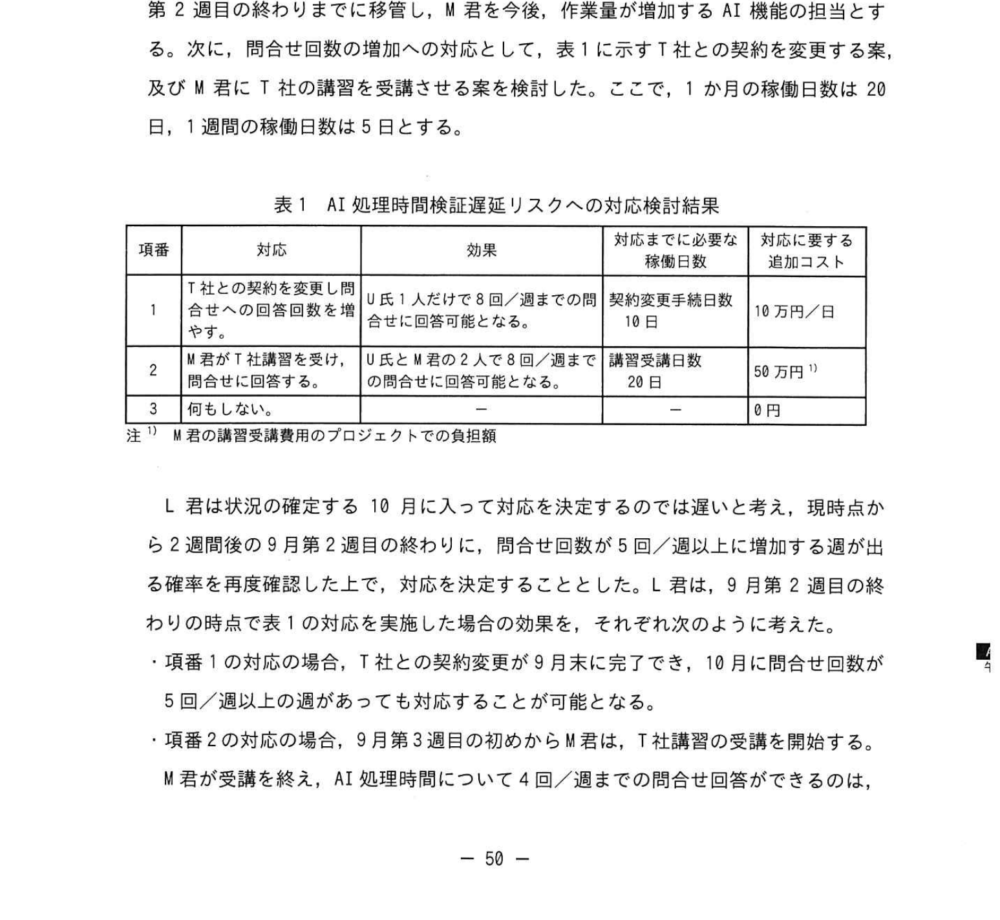
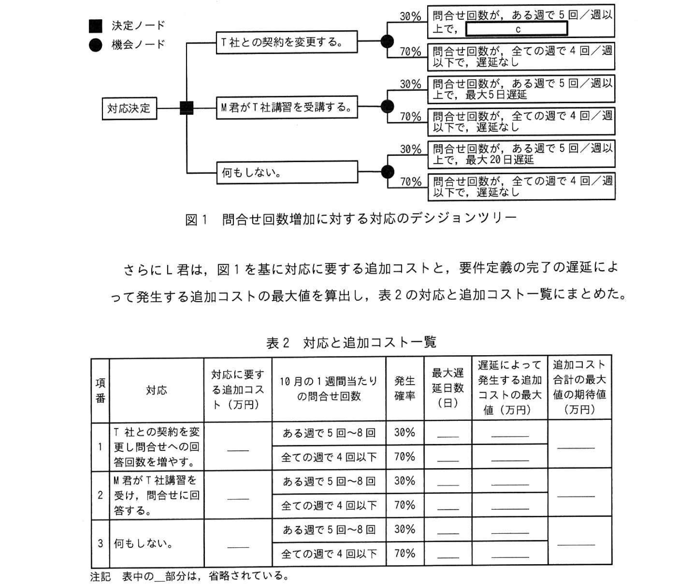

# 2022年秋期（令和4年度秋期）応用情報技術者試験 午後 問9（選択）
## プロジェクトマネジメント：機械部品製造会社の生産計画システム導入・リスクマネジメント

---

## 問題文

**問9** プロジェクトのリスクマネジメントに関する次の記述を読んで、設問に答えよ。

K社は機械部品を製造販売する中堅企業であり、昨今の市場の変化に対応するために新生産計画システムを導入することになった。K社は、この新生産計画システムに、T社の生産計画アプリケーションソフトウェアを採用し、新生産計画システム導入プロジェクト（以下、本プロジェクトという）を立ち上げた。本プロジェクトのプロジェクトマネージャに、情報システム部のL君が任命された。

本プロジェクトのチームは、業務チーム及び基幹チームで構成される。

本年7月に本プロジェクトの計画を作成し、8月初めから10月末まで要件定義を行い、11月から基本設計を開始して、来年6月に本番稼動を予定する。T社の生産計画アプリケーションソフトウェアには、生産計画の作成を支援するためのAI機能があり、K社はこのAI機能を利用する。ただし、生産計画を含む日次バッチ処理時間内にAI処理時間が収まるかどうかの検証が要件定義のクリティカルパスである。

このAI処理時間の検証において、AI処理時間検証（以下、AI処理時間という）の検証を基幹チームが担当する。K社にとってAI機能を利用した実績がないので、要件定義の期間中に、T社に技術支援の契約を結んでK社のプロジェクト参加してもらい、AI処理時間検証が要件定義のクリティカルパスである。

---

### 〔リスクマネジメント計画の作成〕

L君は、リスクマネジメント計画を作成し、特定されたリスクへの対応に備えてコンティンジェンシー予備を設定し、それを使用する際のルールを記録した。また、リスクカテゴリに関して、特定された全てのリスクを要因別に分類し、そこから更に個々のリスクが特定できるよう詳細化していくことでリスクを系統的に整理するために `[　a　]` を作成することとした。

---

### 〔リスクの特定〕

L君は、プロジェクトの計画段階での方法でリスクの特定を行うこととした。

(1) 本プロジェクトのK社メンバーによるブレーンストーミング
(2) K社の過去のプロジェクトを基に作成したリスク一覧を用いたチェック
(3) 業務チーム、基幹チームとのミーティングによる整備

この方法について上司に報告したところ、上司から①**K社の現状を考えると**、この方法ではAI機能の利用に関するリスクの特定ができないので見直しが必要であると指摘された。また、上司から次のアドバイスを受けた。

- リスクの原因の候補が複数想定されることがしばしばある。その場合、`[　b　]` を用いることで、リスクの原因の候補の間の系統的な関係を整理して分類し、整理することが、リスクに関する情報収集や原因の分析に有効である。

L君は、上司の指摘やアドバイスを受け入れて、方法を見直して7月末までにリスクを特定した。リスクマネジメントの進捗として、プロジェクトの遂行に沿ってリスクへの対応の進捗をレビューすることとした。これは、リスクのモニタリング及びコントロールの活動に追加することとした。

L君は8月末までに要件定義業務の進捗をレビューして以下の状態とした。基幹チームからは、"AI 処理時間検証は10月に予定している作業が難しそうで、AIの処理時間の検証期間内で収まらない可能性が大きい" という懸念が示された。L君は、この懸念が、現在実施中の要件定義で顕在化する可能性があることから、対応の緊急性が高いと判断し、新たなリスクとして特定した。

---

### 〔リスク対策の検討〕

L君は、このリスクについて詳細を確認した結果、次のことが分かった。

- AI処理時間検証に当たっては、技術支援の契約的基づきT社製AIの専門家であるT社のU氏に AI処理時間について問合せをしながら作成している。問合せの回答数をプロジェクト開始時点から最大で4回/週まで見積もっている。U氏の実績は4回/週であった。U氏に4回から4回の問合せしか対応できない契約なので、問合せ回答 5回/週以上になると別の対応が必要となる。今見通しでは、9月は問合せ回数の最大で4回/週、5回/週以上に増加する可能性が38%と見込まれる。なお、10月に問合せ回数が増加したとしても、8回/週を超える可能性はなく、10月初めから8週の逆数の完了まで月ごとの問合せ回数の合計は最大で32回と見込まれる。
- AI処理時間の問合せへの回答には、T社製AIに関する専門知識を要する。K社内にその専門知識を持つ要員はおらず、習得するにはT社の講習の受講が必要で、受講には稼働日で20日を要する。
- AI処理時間検証が遅延すると、要件定義全体のスケジュールが遅延する。要件定義の完了が予定される10月末から遅延すると、その後の要件定義回収のために要員追加などが必要になり、遅延する稼働日1日当たりで20万円の追加コストが発生する。
- 何も対策をしない場合、仮に10月以降、問合せ回答が5回/週以上の週が出ると、要件定義の完了が5回/週以上に増加してしまうことになる。
- AI機能の利用に関する作業量は想定よりも増加している。T社の技術支援が終了する基本設計に遅延が生じて早めに対応することに懸念がある。

L君は、このリスクについて効果を検討するために、まず基幹チームのメンバーのM君の担当作業の回数が一番よりも多く、他のメンバーに作業を移管する余裕があるかどうかは、9月第2週目の残り時間の仕事量がやりきれるかを確認する。次に、問合せ回数の増加への対応として、表1に示すT社との契約を変更する案及びM君がT社講習を受講する案を表1に示した。

### 表1 AI処理時間検証リスクへの対応検討結果

> | 項番 | 対応 | 効果 |
> |------|------|------|
> | 1 | T社との契約を変更し、U氏への問合せ回数を増やす | T社との契約が9月末に完了したら、10月に問合せ回数の最大 5回/週以上に増加する確率が低下する |
> | 2 | M君がT社の講習を受講する | M君とU氏が問合せ対応することで、T社講習の受講率が向上し、問合せに4回/週以上の問合せも対応できる |
> | 3 | 何もしない | — |

L君は現状の確定するために10月に入っての選択では最善の選択が出来ないと考え、現在時点での回答が5回/週以上の発生確率の今の見通しを基に、9月第2週目の終わりの時点で対応策を実施した場合の効果を、それぞれ対応に実施した場合の効果をまとめた。そして L君は、9月第2週目の終わりに対応策を実施した場合の効果を、図1に示すデシジョンツリーで表した。

### 図1 問合せ回数増加に対する対応のデシジョンツリー

> 決定ノード（■）と機会ノード（●）で表現。  
> 各分岐に発生確率・費用が記述されている。

さらにL君は、図1を基に対応に要する追加コスト、及び要件定義の完了の遅延によって発生する追加コストの最大値の期待値を算出し、表2の対応と追加コスト一覧にまとめた。

### 表2 対応と追加コスト一覧

> | 項番 | 対応 | 対応に必要な追加コスト（万円） | 10月1ヶ月間・問合せ回数 | 発生確率 | 遅延によるコストの最大値（日） | 追加コスト合計の期待値（万円） |
> |------|------|------|------|------|------|------|
> | 1 | T社との契約変更 | ある選択で5〜8回 | 70% | | | |
> | | | 全ての選択で4回以下 | 70% | | | |
> | 2 | M君が講習受講 | M君とU氏で5〜8回 | 70% | | | |
> | | | 全て4回以下 | 70% | | | |
> | 3 | 何もしない | | ある選択で5〜8回 | 70% | | |
> | | | | 全て4回以下 | 70% | | |
> 注：表中の省略部分は省略されている。

9月第2週目の終わりに、問合せ回数増加の発生確率が今の見通しから変わらない場合、コンティンジェンシー予備の範囲内に収まることを確認した上で、追加コスト合計の最大値の期待値が最も小さい対応を選択することにした。

---

### 〔リスクマネジメントの実施〕

L君は、これまでの特定されたリスクを対象に整理したことで、本プロジェクトのリスクの特定を完了させたと考え、しかし上司からは、⑤**ある活動をリスクマネジメントの進め方に追加する**ことを指摘した。

---

## 設問

### 設問1 〔リスクマネジメント計画の作成〕について、本文中の `[　a　]` に入れる適切な字句をアルファベット3字で答えよ。

### 設問2 〔リスクの特定〕について答えよ。

**(1)** 本文中の下線①の理由は何か。25字以内で答えよ。

**(2)** 本文中の `[　b　]` に入れる適切な字句を解答群の中から選び、記号で答えよ。

**解答群：**
- ア 管理図
- イ 散布図
- ウ 特性要因図
- エ パレート図

### 設問3 〔リスク対策の検討〕について答えよ。

**(1)** 図1中の `[　c　]` に入れる適切な字句を答えよ。

**(2)** 9月第2週目の終わりに、問合せ回数増加の発生確率が今の見通しから変わらない場合、L君が選択する対応は何か。表2の対応から選び、記号で答えよ。また、そのときの追加コスト合計の最大値の期待値（万円）を答えよ。

### 設問4 〔リスクマネジメントの実施〕の本文中の下線⑤について、リスクマネジメントの進め方に追加する活動は何か。35字以内で答えよ。

---

## 解答と解説

### 設問1 正解：a = RBS（リスクブレークダウンストラクチャ）

RBS（Risk Breakdown Structure）：リスクを階層的に分類・整理するツール。リスクカテゴリを上位から詳細に展開していく構造。WBS（作業分解構造図）のリスク版。

---

### 設問2

**(1) 正解：AIに知見のあるT社が参画していないから（20字）**

K社はAI機能の利用実績がなく、T社のAI技術に関する知見を持つメンバーがプロジェクトに参画していない段階では、AIに特有のリスクをブレーンストーミングや過去事例チェックで特定することができない。

**(2) 正解：b = ウ（特性要因図）**

特性要因図（フィッシュボーン図・石川図）：問題（特性）の原因を系統的に分類・整理する図。リスクの原因候補が複数ある場合に、それらの因果関係を整理するのに適している。

---

### 設問3

**(1) 正解：c = 2（IPA公式：2）**

デシジョンツリー上の対応選択後、問合せが5回/週以上になった場合の遅延日数は最大2日。

**(2) 正解：項番2（M君が講習受講）、期待値 = 80万円（IPA公式）**

各対応の追加コスト合計の最大値の期待値を比較：
- 項番1：T社契約変更の追加コスト + 遅延コスト期待値
- 項番2：M君講習受講の追加コスト（20日×稼働コスト）+ 遅延コスト期待値 = 最小
- 項番3：何もしない場合の遅延コスト期待値が最大

IPA公式：項番2を選択、期待値80万円。

---

### 設問4 正解：プロジェクトの遂行に従ってリスクの特定を継続して行う。（27字）

L君は計画段階でのリスク特定で完了と判断したが、プロジェクト進行中に新たなリスク（AI処理時間問題）が顕在化した事例のように、プロジェクトの遂行に沿って継続的にリスクを特定し続けることが必要。これがリスクマネジメントの「継続的監視」の活動。

---

## 参考：主要キーワード

| 用語 | 説明 |
|------|------|
| RBS（Risk Breakdown Structure） | リスクをカテゴリ別に階層的に分解・整理したリスク分解構造図 |
| コンティンジェンシー予備 | 特定されたリスクに備えて確保する予算・スケジュールの予備 |
| デシジョンツリー | 複数の選択肢とその結果を木構造で表現し、期待値計算に使用する意思決定ツール |
| 期待値 | 各結果の値 × 発生確率の総和。意思決定の基準として使用 |
| 特性要因図（フィッシュボーン図） | 問題の原因を骨格状の図で系統的に分類・整理する品質管理ツール |
| ブレーンストーミング | 参加者が自由にアイデアを出し合うアイデア発想法 |
| リスク特定 | プロジェクトに影響を与えうるリスクを洗い出す活動 |
| リスクのモニタリング・コントロール | 特定したリスクの状況を継続的に監視し、対応策の実施状況を管理する活動 |
| クリティカルパス | プロジェクト全体のスケジュールを決定する最長経路 |
