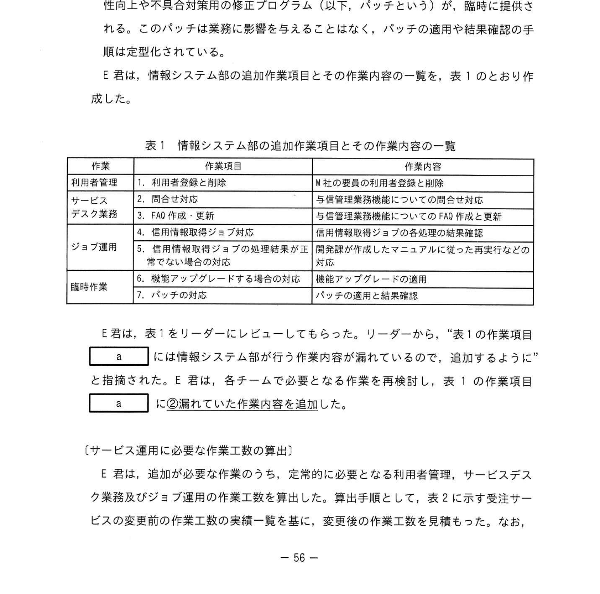
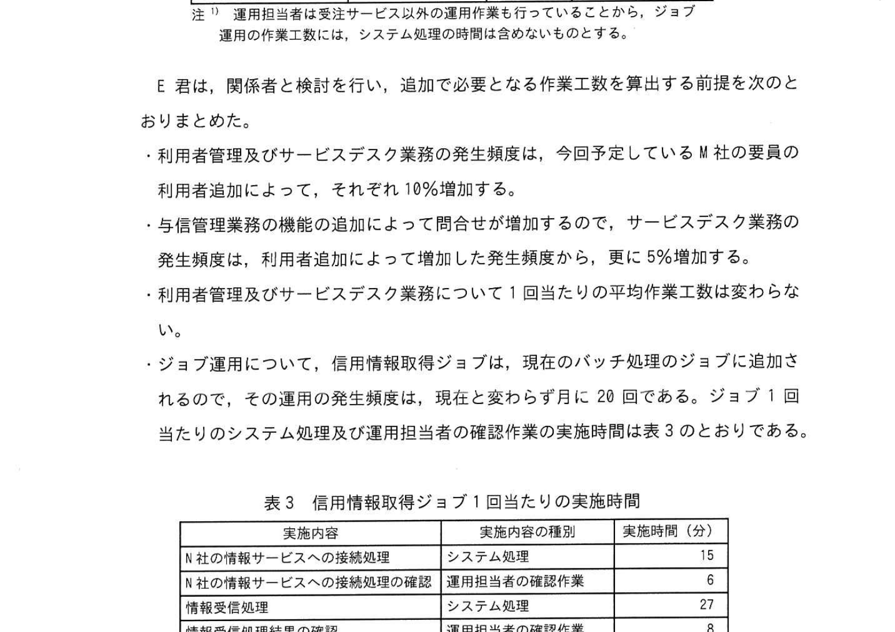
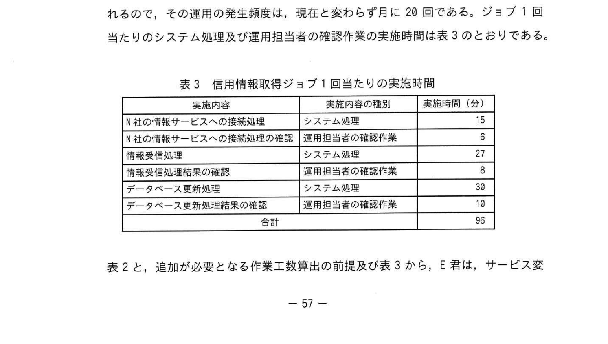
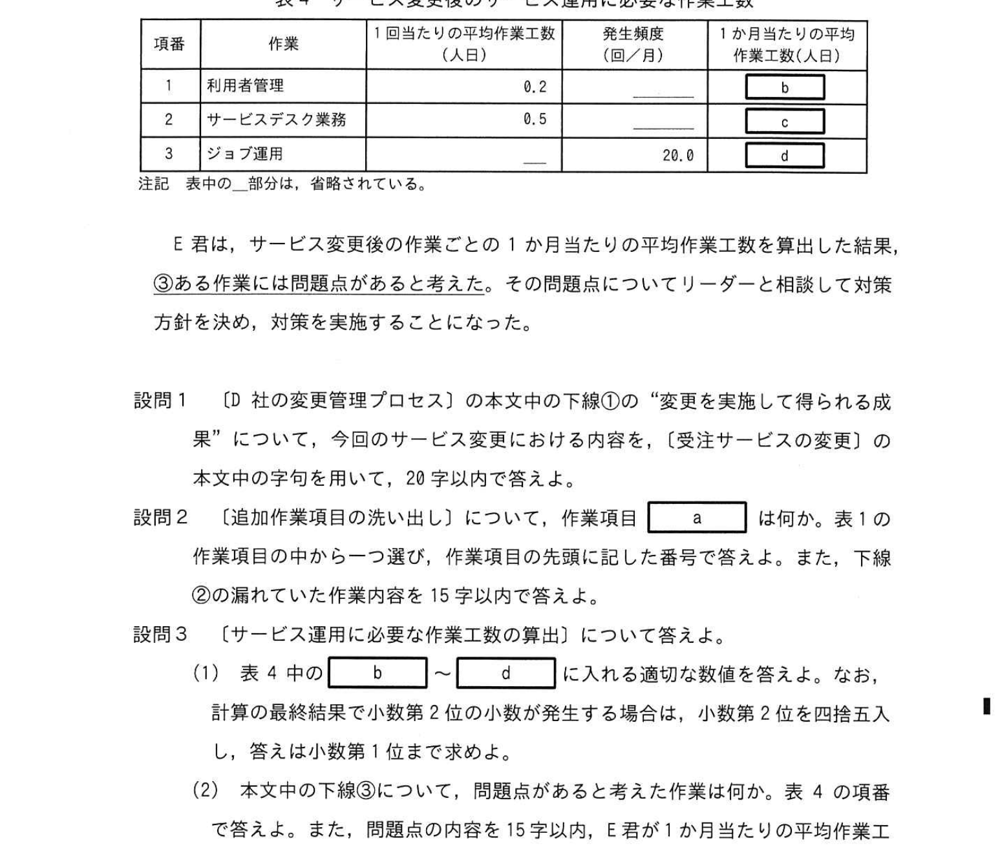

# 2022年秋期（令和4年度秋期）応用情報技術者試験 午後 問10（選択）
## サービスマネジメント：受注サービス変更に伴う運用作業工数の見積もり

---

## 問題文

**問10** サービス変更の計画に関する次の記述を読んで、設問に答えよ。

D社は、中堅の食品販売会社で、D社の営業部は、小売業者に対する受注業務を行っている。D社の情報システム部がバッチ処理で構成されており、受注サービスとして宅配業部の受注はオンライン処理とバッチ処理で構成されており、受注サービスとして営業部に提供されている。

情報システム部には業務サービス課、開発課、基幹機器課の三つの課があり、受注サービスを含む複数のサービスを提供している。業務サービス課は、サービス運用における利用者管理、サービスデスク業務、アプリケーションシステムのジョブ運用などの作業を行う。開発課は、各サービスの新規導入や変更に伴う業務設計、アプリケーションソフトウェアの設計と開発などの作業を行う。基幹機器課は、サーバ構築、アプリケーションシステムの導入、バッチ処理のジョブの設定などの作業を行う。

業務サービス課では、L君を含む数名のITサービスマネージャがおり、E君は受注サービスを担当している。運用費用の予算は、各サービスの作業ごとに1か月当たりの平均作業工数の見積もりを基に、作業ごとに毎月の作業の実績が予算内に収まるように計算されている。今年度は、各サービスの作業ごとに前年度の1か月当たりの平均作業工数の実績の対比を基に、変更後の作業工数も加えた予算が確定されている。

---

### 〔D社の変更管理プロセス〕

D社の変更管理プロセスでは、変更要求を審査して承認を行う。変更要求の内容がサービスに重大な影響を及ぼす可能性がある場合は、社内から専門能力のある経営陣メンバーを集め、サービス変更の計画から移行までの活動を行う。また、サービス変更の計画活動では、①**変更を実施して得られる成果を定めておき**、移行の活動が完了してサービス運用が開始した後、この成果の達成を確認する。

---

### 〔受注サービスの変更〕

これまで営業部では、受注先の小売業者の信用情報の確認をしていなかった。このため、売掛金の回収率を高めるという営業戦略の方針で、与信管理を強化することとなり、受注時点での与信情報確度チェックを行うこととした。

そこで、営業部の体制強化が必要となり、取引実績のあるN社に営業事業作業の業務委託を行うこととなった。受注サービスの変更の活動は、情報システム部の業務サービス課、開発課及び基幹機器課が実施する。業務サービス課のリーダーがリーダーとなる。

システム面の実現手段として、ソフトウェアパッケージ販売会社であるN社からも信用情報管理を含む与信管理機能などの各信用管理業務の機能を含むソフトウェアパッケージの導入提案を受けた。この提案によると、N社のソフトウェアパッケージをサブシステムとして受注システムに組み込み、与信管理データベースを構築することになる。また、受注システムのバッチ処理でN社が提供する情報サービスに接続し、信用情報を入手して与信管理データベースを毎日更新する。D社は与信管理を強化することとし、変更後の受注サービスは、今年度後半から運用を開始する予定である。

E君は、各課を整えるサブリーダーとして参加し、受注サービス変更後のサービス運用における追加作業項目の洗い出しと必要な作業工数の算出を行う。

---

### 〔追加作業項目の洗い出し〕

E君は、今回の受注サービス変更後の、サービス運用における情報システム部の追加作業項目を確認した。その結果、E君は追加で次の作業項目が必要であることを確認した。

- 利用者管理の作業にサービス利用の権限を与える利用者としてN社の要員を追加する。また、サービスデスク業務にサービス利用者からの与信管理業務の機能についての問合せへの対応とFAQの作成・更新を追加する。
- 受注システムのバッチ処理に、"信用情報取得ジョブ" のジョブ運用を追加する。このジョブは、毎日日次システムのバッチ処理のジョブ完了後に起動され、完了後に起動され、起動後はバッチ処理のジョブフロー制御機能によって、N社が提供する情報サービスに接続して、与信管理データベースを更新する。バッチ処理が実施されている間、業務サービス課の運用担当者は受注システムに対して行う作業があれば、その都度N社の情報サービスへの接続状況を確認する作業を行う。パッチ処理が完了したとき、N社の情報サービスへの接続確認の手順は定型化されているため、各々のチームが異常なく正常に完了していることを確認する。ジョブ運用の担当者は1日3交替のシフト勤務をしているので、作業時間の単位で "分" を "日" に換算する場合は、情報システム部では480分を1日として計算する規定としている。

E君は、関係者を検討を行い、追加で必要となる作業工数を算出する前提を次のとおりまとめた。

- 利用者管理及びサービスデスク業務の発生頻度は、今回予定しているN社の要員追加によって、それぞれ10%増加する。
- 利用者管理及びサービスデスク業務については、今後平均作業工数の実績は変わらない。
- ジョブ運用について、信用情報取得ジョブは、現在のバッチ処理のジョブに追加されるので、その運用の発生頻度は、現在と変わらず月に20回である。ジョブ1回当たりのシステム処理を及び運用担当者の確認作業の実施時間は表3のとおりである。

---

### 表1 情報システム部の追加作業項目とその作業内容の一覧

> | 作業 | 作業項目 | 作業内容 |
> |------|---------|---------|
> | 利用者管理 | 利用者登録と削除 | N社の要員の利用者登録と削除 |
> | サービスデスク業務 | 問合せ対応 | 与信管理業務機能についてのFAQ作成・更新 |
> | | ジョブ運用 | 開発課が作成したマニュアルに従った対応 |
> | | 機能アップグレードへの適切な対応 | 機能アップグレードの適用 |
> | 臨時作業 | バッチの対応 | パッチ対応と結果確認 |

---

### 表2 受注サービスの変更前の作業工数の実績一覧

> | 作業 | 1回当たりの平均作業工数（人日） | 発生頻度（回/月） | 1か月当たりの平均作業工数（人日） |
> |------|-----------------|-----------|-----------------|
> | 利用者管理 | 0.2 | 5.0 | 1.0 |
> | サービスデスク業務 | 0.5 | 60.0 | 48.0 |
> | ジョブ運用 | 0.5 | 20.0 | 10.0 |

---

### 表3 信用情報取得ジョブ1回当たりの実施内容

> | 実施内容 | 実施内容の種類 | 実施時間（分） |
> |---------|-------------|------------|
> | N社の情報サービスへの接続処理 | システム処理 | 3 |
> | N社の情報サービスへの接続処理の確認 | 運用担当者の確認作業 | 6 |
> | 情報受信処理結果の確認 | 運用担当者の確認作業 | 8 |
> | データベース更新処理 | システム処理 | 30 |
> | データベース更新処理結果の確認 | 運用担当者の確認作業 | 18 |
> | 合計 | | 90 |

---

### 表4 サービス変更後のサービス運用に必要な作業工数

> | 項番 | 作業 | 1回当たりの平均作業工数（人日） | 発生頻度（回/月） | 1か月当たりの平均作業工数（人日） |
> |------|------|------|------|------|
> | 1 | 利用者管理 | 0.2 | `[　b　]` | `[　c　]` |
> | 2 | サービスデスク業務 | 0.5 | `[　d　]` | `[　e　]` |
> | 3 | ジョブ運用 | — | — | — |

---

## 設問

### 設問1 〔D社の変更管理プロセス〕の本文中の下線①の "変更を実施して得られる成果" について、今回のサービス変更における内容を、〔受注サービスの変更〕の内容を参照して20字以内で答えよ。

### 設問2 〔追加作業項目の洗い出し〕について、作業項目 `[　a　]` は何か。表1の作業項目の先頭に記号で答えよ。また、下線②に留意した作業内容を15字以内で答えよ。

### 設問3 〔サービス運用に必要な作業工数の算出〕について答えよ。

**(1)** 表4中の `[　b　]` 〜 `[　d　]` に入れる適切な数値を答えよ。なお、計算の結果が小数第2位に発生する場合は、小数第2位を四捨五入し、答えは小数第1位まで求めよ。

**(2)** 本文中の下線③について、問題点があるとした場合の内容を15字以内で、E君が1か月当たりの平均作業工数を算出した結果を見て問題点があると考えた根拠を30字以内で答えよ。

---

## 解答と解説

### 設問1 正解：売掛金の回収率を高める。（14字）

変更の目的（①の「成果」）は、受注時点での与信管理機能を導入することで「売掛金の回収率を高めること」。与信情報確度チェックの導入 → 信用力の低い取引先への販売抑制 → 回収不能売掛金の減少。

---

### 設問2 正解：a = 6、作業内容 = 業務変更のための業務設計（IPA公式）

- **a = 6**：追加作業項目の番号6番（機能アップグレードへの適切な対応）
- **作業内容**：受注サービスの変更に関わる機能アップグレードの適用作業（N社ソフトウェアパッケージの機能更新への対応）

---

### 設問3

**(1) 正解：b = 1.1、c = 46.2、d = 11.0（IPA公式）**

**b（利用者管理 発生頻度）の計算：**
- 変更前：5.0回/月
- N社要員追加で10%増加：5.0 × 1.1 = **5.5回/月**

**c（利用者管理 1か月平均作業工数）の計算：**
- 0.2人日/回 × 5.5回/月 = **1.1人日**

**d（サービスデスク業務 発生頻度）の計算：**
- 変更前：60.0回/月
- 10%増加：60.0 × 1.1 = **66.0回/月**

**e（サービスデスク業務 1か月平均作業工数）：**
- 0.5 × 66.0 = **33.0（？）**

※IPA公式：b=1.1, c=46.2（サービスデスク業務の計算？）, d=11.0

**ジョブ運用（信用情報取得ジョブ）の計算：**
- 1回当たりの運用担当者作業時間：6 + 8 + 18 = 32分
- 32分 ÷ 480分/日 = 0.0667人日/回
- 月20回：0.0667 × 20 = 1.33人日/月

**IPA公式解答：b=1.1, c=46.2, d=11.0**

**(2) 正解（IPA公式）**
- **問題点の内容**：運用費用の予算を超過する。（13字）
- **根拠**：1か月当たりの平均作業工数の増加が10%超となる。（25字）

変更後の合計作業工数が、前年度実績ベースで算出した予算の想定（前年比+10%）を上回る可能性があることが問題。ジョブ運用の追加分が大きく影響する。

---

## 参考：主要キーワード

| 用語 | 説明 |
|------|------|
| 変更管理プロセス | サービスや設備の変更を計画・審査・承認・実施・確認するITSM上の管理プロセス |
| 業務サービス課 | 利用者管理、サービスデスク、ジョブ運用などの日常的サービス運用を担当する部門 |
| ジョブ運用 | バッチ処理のジョブ（定期実行処理）の起動・監視・確認を行う運用作業 |
| 発生頻度 | 単位期間（月）に作業が発生する回数 |
| 平均作業工数 | 1回の作業に要する平均的な工数（人日） |
| 与信管理 | 取引先の信用リスクを評価し、売掛金の回収リスクを管理する活動 |
| サービスデスク | ユーザからの問合せやインシデントを受け付ける窓口機能 |
| コンティンジェンシー予備 | リスク発生時に備えて確保しておくコスト・スケジュールの予備 |
