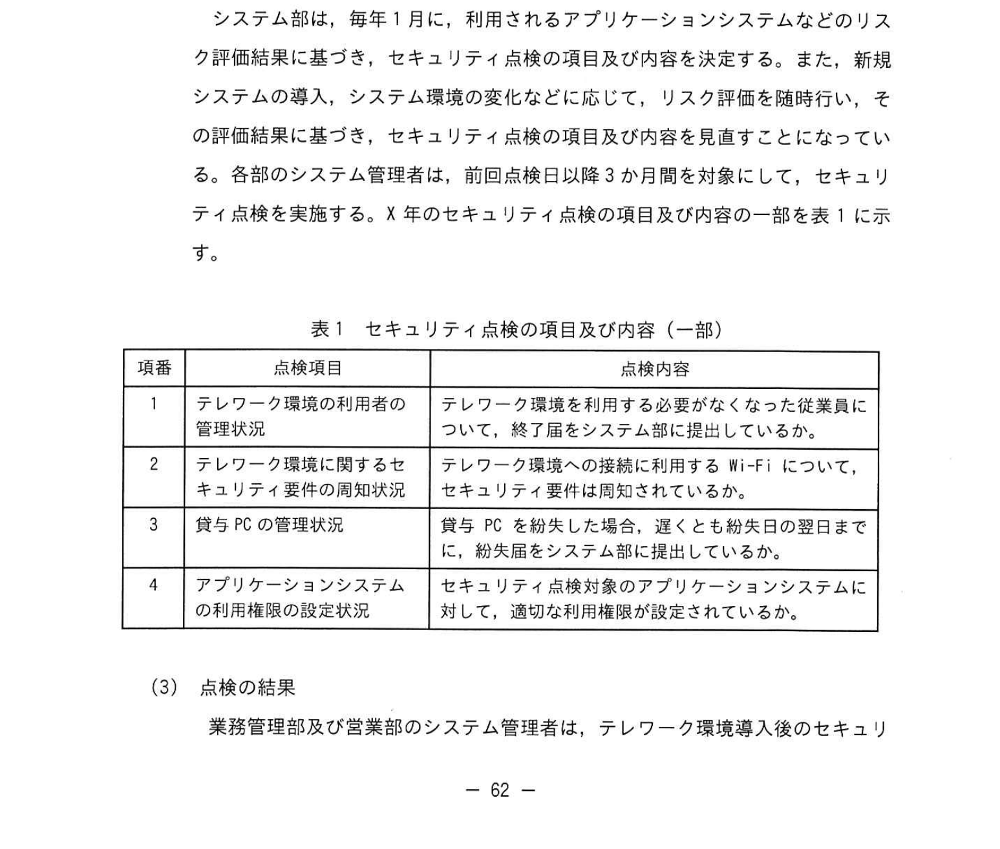

# 2022年秋期（令和4年度秋期）応用情報技術者試験 午後 問11（選択）
## システム監査：テレワーク環境の情報セキュリティ管理（貸与PC・個人情報漏えい）

---

## 問題文

**問11** テレワーク環境の監査に関する次の記述を読んで、設問に答えよ。

大手のマンション管理会社であるY社は、業務改革の推進、感染症拡大への対応などを背景として、X年4月からテレワーク環境を導入し、全従業員の約半数が業務内容に応じて利用している。このような状況の下、テレワーク環境の不適切な利用に起因して、情報漏えいなどを発生するおそれがあり、情報セキュリティ管理の重要性は増大している。

Y社の内部監査室長は、このような状況に鑑みえて、テレワーク環境の情報セキュリティ管理をテーマとして、監査を行うよう指示した。システム監査チームは、X年9月に予備調査を行い、次の事項を把握した。

---

### 〔テレワーク環境の利用状況〕

**(1) テレワーク環境で利用する PC の管理**

Y社の従業員は、貸与された PC（以下、貸与PCという）を、Y社の社内及びテレワーク環境の両方で利用している。

システム部は、全従業員分の貸与PCについて、貸与PC管理台帳に、PC管理番号、利用する従業員名、テレワーク環境の利用有無などを登録する。貸与PC管理台帳は、貸与PCを利用する従業員が所属する各部門に配置されているシステム管理者も閲覧可能である。

**(2) テレワーク環境の利用者の管理**

従業員は、テレワーク環境の利用を申請する場合に、テレワーク環境利用開始届（以下、利用届という）を作成し、所属する部のシステム管理者の承認を得て、及び部長の承認を得て、システム部に提出する。利用届には、申請する従業員の氏名、利用開始希望日、Y社の情報セキュリティ基準の遵守についての誓約なども記載する。システム部は、利用届に基づき、貸与PCをテレワーク環境でも利用できるよう、VPN接続ソフトのインストールなどを行う。

各部のシステム管理者は、従業員が異動、退職などに伴いテレワーク環境の利用を終了する場合も、テレワーク環境利用終了届（以下、終了届という）を作成し、システム部に提出する。終了届には、テレワーク環境の利用を終了する従業員の氏名、事由などを記載する。システム部は、終了届に基づき、貸与PCをテレワーク環境で利用できないようにする。終了届の写しをシステム管理者に返却する。

**(3) テレワーク環境のアプリケーションシステム**

テレワーク環境では、従業員の利用権限に応じて、基幹業務システム、社内ポータルサイト、Web会議システムなど、様々なアプリケーションシステムを利用することができる。これらのアプリケーションシステムのうち、Web会議システムは、X年6月から社外及びテレワーク環境で利用可能となっている。また、従業員は、基幹業務システムなどを利用して、顧客の個人情報、業者などにアクセスし、貸与PCのハードディスクに一時的にダウンロードして、加工・編集する場合がある。

---

### 〔テレワーク環境に関して発生した問題〕

**(1) 顧客の個人情報の漏えい**

Y社の情報セキュリティ管理基準では、テレワーク環境への接続に利用するY社の従業員の貸与PCへのパスワードの入力を必須とすることなど、セキュリティ要件を定めている。

X年5月20日に、業務管理部の従業員が、セキュリティ要件を満たさない Wi-Fi を利用してテレワーク環境に接続したことによって、貸与PCのハードディスクにダウンロードされた顧客の個人情報が漏えいする事象が発生した。

**(2) 貸与PCの紛失・盗難**

テレワーク環境の導入後、貸与PCを社外で利用する機会が増えたことから、貸与PCの紛失・盗難の事案が生じていた。

各部のシステム管理者は、従業員が貸与PCを紛失した場合、貸与PCの管理台帳に、貸与PC管理番号、紛失日、最終利用日、システム部への届出日などを記録し、速やかに貸与PCの届出日などをシステム部に提出する。システム部は、届出後に基づき、貸与PCをネットワークから遮断などの対応を行う。貸与PCの紛失の際の届け出が届出手順では、初期対応として実施した後、初期対応の写しをシステム管理者に返却するよう定めている。

営業部のZ氏は、X年8月9日に業務先から自宅に戻る途中で貸与PCを紛失した。紛失の翌日から1週間の休暇を取得し、同部のシステム管理者は、Z氏から X年8月17日に報告を受け、同日中に当該PCの紛失届をシステム部に提出した。

---

### 〔情報セキュリティ管理状況の点検〕

**(1) 点検の体制及び時期**

システム部は毎年1月に、各部における情報セキュリティ管理状況の点検（以下、セキュリティ点検という）について、年間計画を策定する。各部のシステム管理者は、年間計画に基づき、セキュリティ点検を実施し、点検結果、及び不備事項の是正状況をシステム部に報告する。また、不備事項の是正状況をモニタリングする。X年の年間計画では、2月、5月、8月、11月の最終営業日にセキュリティ点検を実施することになっている。

**(2) 点検の項目・内容及び対象**

システム部は、毎年1月に、利用されるアプリケーションシステムなどのリスク評価結果に基づき、セキュリティ点検の項目及び内容を決定する。また、新規システムの導入、システム環境の変化などに応じて、リスク評価を随時行う。その評価結果を基に、セキュリティ点検の項目及び内容の一部を表1に示す。

### 表1 セキュリティ点検の項目及び内容（一部）

> | 項番 | 点検項目 | 点検内容 |
> |------|---------|---------|
> | 1 | テレワーク環境の利用者の管理状況 | テレワーク環境への接続に利用するY社の従業員について、終了届をシステム部に届け出ているかどうか |
> | 2 | テレワーク環境に関するセキュリティ要件の周知状況 | テレワーク環境の接続に利用するWi-Fi について、セキュリティ要件の遵守が適切に行われているかどうか |
> | 3 | 貸与PCの管理状況 | 貸与PCを紛失した場合、速やかに紛失日をシステム部に届け出ているかどうか |
> | 4 | アプリケーションシステムの利用権限の設定状況 | セキュリティ点検対象のアプリケーションシステムに対して、適切な利用権限が設定されているかどうか |

**(3) 点検の結果**

業務管理部及び営業部のシステム管理者は、テレワーク環境導入後のセキュリティ点検の結果、表1の項番2及び項番3について、不備事項を報告していなかった。

---

### 〔内部監査室長の指示〕

内部監査室長は、システム監査チームから予備調査で把握した事項について報告を受け、X年11月実施予定のシステム調査で、テレワークに関するセキュリティ点検について重点的に確認する方針を決定した。次のとおり指示した。

(1) 表1項番1について、 `[　a　]`、`[　b　]` を照合した結果と、セキュリティ点検の結果との整合性を確認すること。

(2) 表1項番2について、業務管理部のシステム管理者が `[　c　]` をセキュリティ点検を適切に実施しているかどうか、確認すること。

(3) 表1項番3について、紛失届の `[　d　]` と `[　e　]` を照合した結果と、セキュリティ点検の結果との整合性を確認すること。

(4) 表1項番4について、システム部が `[　f　]` を、X年8月のセキュリティ点検対象のアプリケーションシステムとして、 `[　g　]` の追加をするかどうか、確認すること。

(5) セキュリティ点検で不備事項が発見された場合、システム管理者が不備事項の是正状況を報告しているかどうかを確認するだけでは、監査手続として不十分である。システム部が `[　h　]` しているかどうかについても確認すること。

---

## 設問

### 設問1 〔内部監査室長の指示〕(1)の `[　a　]`、`[　b　]` に入れる適切な字句を、それぞれ15字以内で答えよ。

### 設問2 〔内部監査室長の指示〕(2)の `[　c　]` に入れる適切な字句を15字以内で答えよ。

### 設問3 〔内部監査室長の指示〕(3)の `[　d　]`、`[　e　]` に入れる適切な字句を、それぞれ10字以内で答えよ。

### 設問4 〔内部監査室長の指示〕(4)の `[　f　]`、`[　g　]` に入れる適切な字句を、それぞれ10字以内で答えよ。

### 設問5 〔内部監査室長の指示〕(5)の `[　h　]` に入れる適切な字句を20字以内で答えよ。

---

## 解答と解説

### 設問1 正解：a = 従業員の異動・退職などの状況（15字）、b = 退職などの記載内容（10字）

- **a**：テレワーク環境の利用者管理では、従業員が退職・異動した際に終了届が提出されているかが重要。照合元として「従業員の異動・退職などの状況（人事情報）」と終了届の内容を照合する。
- **b**：終了届に記載されている退職などの事由・内容を、実際の人事異動・退職情報と照合する。

**IPA公式：a = 従業員の異動・退職などの状況、b = 退職などの記載内容**

---

### 設問2 正解：c = セキュリティ点検を適切に実施（15字）

業務管理部では5月20日に Wi-Fi セキュリティ要件違反による情報漏えいが発生したにもかかわらず、セキュリティ点検で不備を報告していなかった。「セキュリティ点検を適切に実施しているかどうか」を確認する。

---

### 設問3 正解：d = 貸与PCの紛失日（8字）、e = システム部への届出日（11字）

Z氏の事例では、8月9日に紛失し、8月17日にシステム部へ届出（紛失翌日から1週間休暇のため遅延）。

- **d = 貸与PCの紛失日**：いつ紛失したかを記録した日付
- **e = システム部への届出日**：システム部に紛失届を提出した日付

この2つを照合することで、紛失から届出までの日数（遅延の有無）を確認できる。

---

### 設問4 正解：f = リスク評価（6字）、g = Web会議システム（8字）

- **f = リスク評価**：システム部は新規システム導入やシステム環境変化に応じてリスク評価を随時実施する。Web会議システムがX年6月から導入された際に、セキュリティ点検対象に追加するかどうかのリスク評価を実施したかを確認する。
- **g = Web会議システム**：X年6月から新たに利用開始されたアプリケーションシステム。8月のセキュリティ点検対象に追加されているかを確認する。

**IPA公式：f = リスク評価、g = Web会議システム**

---

### 設問5 正解：不備事項の是正状況をモニタリング（17字）

システム部は、各部からの是正状況報告を受けるだけでなく、不備事項が実際に是正されているかどうかをモニタリング（継続的監視）する責任がある。監査では「システム部が不備事項の是正状況をモニタリングしているかどうか」を確認する必要がある。

**IPA公式：不備事項の是正状況をモニタリング**

---

## 参考：主要キーワード

| 用語 | 説明 |
|------|------|
| セキュリティ点検 | 情報セキュリティ管理基準への適合状況を定期的に確認する活動 |
| 利用届・終了届 | テレワーク環境の利用開始・終了の際に作成・提出する申請書 |
| 貸与PCの管理台帳 | 貸与PCの管理番号・利用者・利用有無などを記録する台帳 |
| Wi-Fiセキュリティ要件 | テレワーク接続時に使用するWi-Fiに求められるセキュリティ基準 |
| リスク評価 | システムや環境の変化に応じてリスクの大きさを評価する活動 |
| モニタリング | 是正措置の実施状況を継続的に監視・確認する活動 |
| 不備事項の是正 | セキュリティ点検で発見された不備を修正・改善する対応 |
| システム監査 | 情報システムの信頼性・安全性・効率性を客観的に評価する活動 |
| 内部監査室 | 組織内部で監査業務を行う部門。独立性が重要 |
