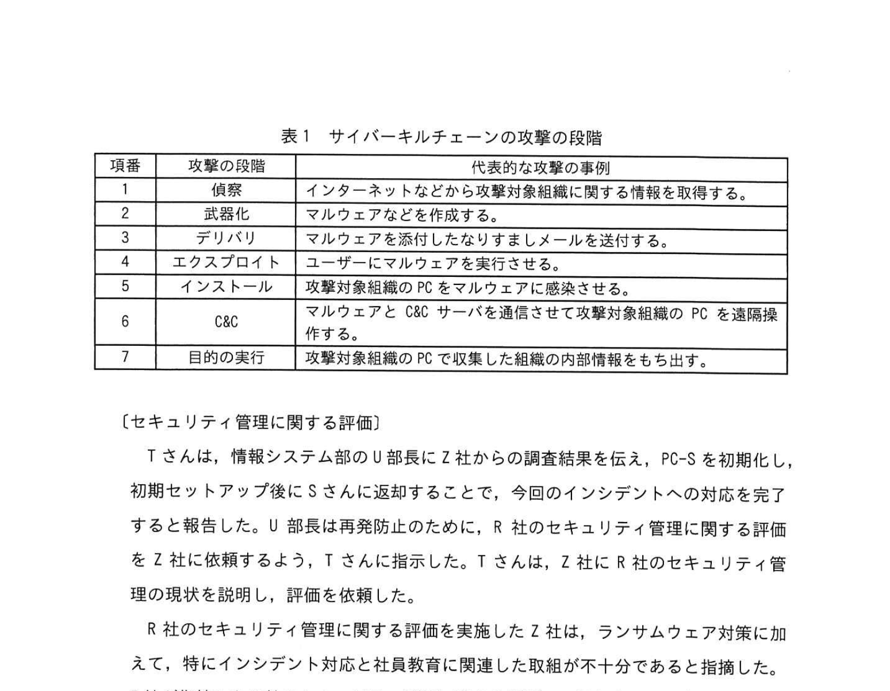
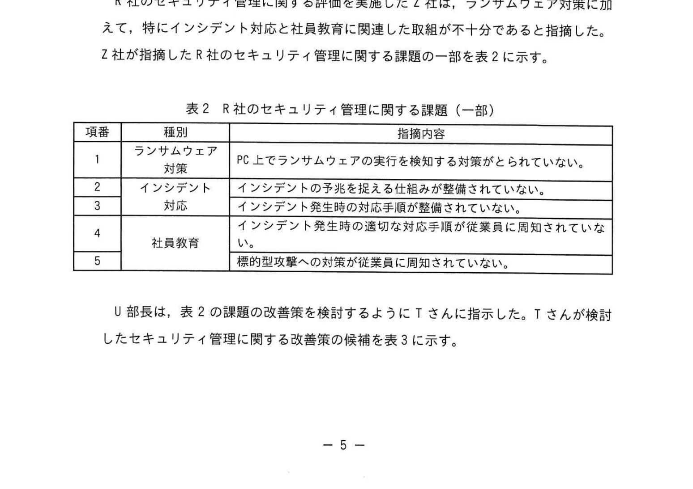
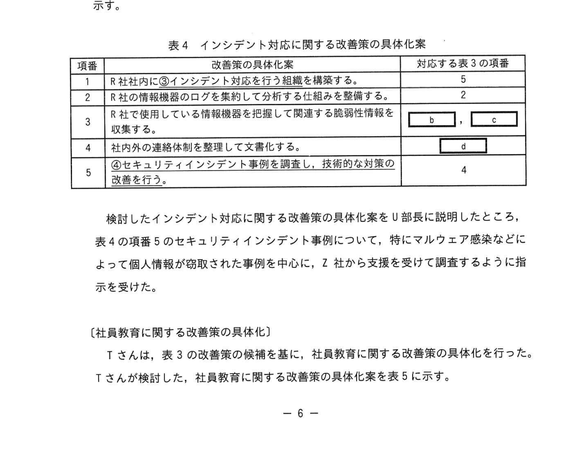
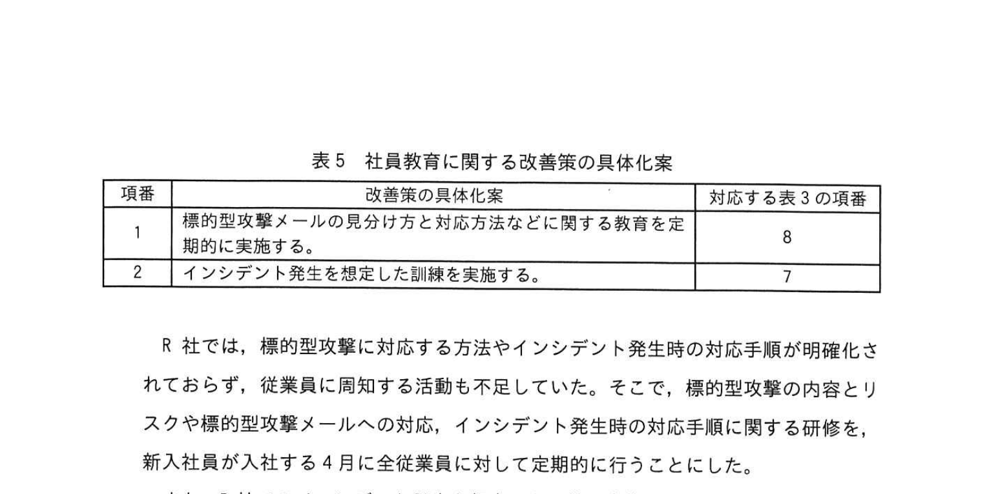
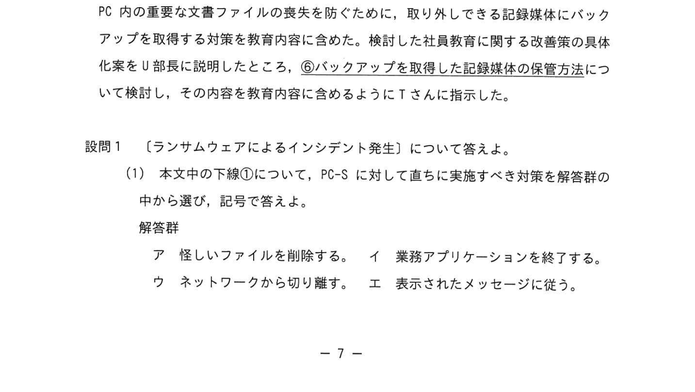

# 2023年春期（令和5年度春期）応用情報技術者試験 午後 問1（必須）
## 情報セキュリティ：マルウェア対策（ランサムウェアインシデント対応・社員教育）

---

## 問題文

**問1** マルウェア対策に関する次の記述を読んで、設問に答えよ。

R社は、全国に支店・営業所をもつ、従業員約150名の旅行代理店である。国内の宿泊と交通手段を旅行パッケージとして、法人と個人の双方に販売している。R社は、旅行パッケージ利用者の個人情報を扱うので、個人情報保護法で定める個人情報取扱事業者である。

---

### 〔ランサムウェアによるインシデント発生〕

ある日、R社従業員のSさんが新しい旅行パッケージの検討のために、R社からSさんに支給されているPC（以下、PC-Sという）を用いて業務を行っていたところ、PC-Sに身の代金を要求するメッセージが表示された。Sさんは連絡すべき窓口が分からず、数時間後に連絡が取れた上司からの指示によって、R社の情報システム部に連絡した。連絡を受けた情報システム部のTさんは、PCがランサムウェアに感染したと考え、①**PC-Sに対して直ちに実施すべき対策**を伝えるとともに、PC-Sを情報システム部に提出するようにSさんに指示した。

Tさんは、セキュリティ対策支援サービスを提供しているZ社に、提出されたPC-S及びR社LANの調査を依頼した。数日後にZ社から受け取った調査結果の一部を次に示す。

- PC-Sから、国内で流行しているランサムウェアが発見された。
- ランサムウェアが、取引先を装った電子メールの添付ファイルに含まれていて、Sさんが当該ファイルを開いた結果、PC-Sにインストールされた。
- PC-S内の文書ファイルが暗号化されていて、復号できなかった。
- PC-Sから、インターネットに向けて不審な通信が行われた痕跡はなかった。
- PC-Sから、R社LAN上のIPアドレスをスキャンした痕跡はなかった。
- ランサムウェアによる今回のインシデントは、表1に示すサイバーキルチェーンの攻撃の段階では `[　a　]` まで完了したと考えられる。

### 表1 サイバーキルチェーンの攻撃の段階

> | 項番 | 攻撃の段階 | 代表的な攻撃の事例 |
> |---|---|---|
> | 1 | 偵察 | インターネットなどから攻撃対象組織に関する情報を取得する。 |
> | 2 | 武器化 | マルウェアなどを作成する。 |
> | 3 | デリバリ | マルウェアを添付したなりすましメールを送付する。 |
> | 4 | エクスプロイト | ユーザーにマルウェアを実行させる。 |
> | 5 | インストール | 攻撃対象組織のPCをマルウェアに感染させる。 |
> | 6 | C&C | マルウェアとC&Cサーバを通信させて攻撃対象組織のPCを遠隔操作する。 |
> | 7 | 目的の実行 | 攻撃対象組織のPCで収集した組織の内部情報をもち出す。 |

---

### 〔セキュリティ管理に関する評価〕

Tさんは、情報システム部のU部長にZ社からの調査結果を伝え、PC-Sを初期化し、初期セットアップ後にSさんに返却することで、今回のインシデントへの対応を完了すると報告した。U部長は再発防止のために、R社のセキュリティ管理に関する評価をZ社に依頼するよう、Tさんに指示した。Tさんは、Z社にR社のセキュリティ管理の現状を説明し、評価を依頼した。

R社のセキュリティ管理に関する評価を実施したZ社は、ランサムウェア対策に加えて、特にインシデント対応と社員教育に関連した取組が不十分であると指摘した。Z社が指摘したR社のセキュリティ管理に関する課題の一部を表2に示す。

### 表2 R社のセキュリティ管理に関する課題（一部）

> | 項番 | 種別 | 指摘内容 |
> |---|---|---|
> | 1 | ランサムウェア対策 | PC上でランサムウェアの実行を検知する対策がとられていない。 |
> | 2 | インシデント対応 | インシデントの予兆を捉える仕組みが整備されていない。 |
> | 3 | インシデント対応 | インシデント発生時の対応手順が整備されていない。 |
> | 4 | 社員教育 | インシデント発生時の適切な対応手順が従業員に周知されていない。 |
> | 5 | 社員教育 | 標的型攻撃への対策が従業員に周知されていない。 |

Ｕ部長は、表2の課題の改善策を検討するようにTさんに指示した。Tさんが検討したセキュリティ管理に関する改善策の候補を表3に示す。

### 表3 Tさんが検討したセキュリティ管理に関する改善策の候補

> | 項番 | 種別 | 改善策の候補 |
> |---|---|---|
> | 1 | ランサムウェア対策 | ②**PC上の不審な挙動を監視する仕組み**を導入する。 |
> | 2 | インシデント対応 | PCやサーバ機器、ネットワーク機器のログからインシデントの予兆を捉える仕組みを導入する。 |
> | 3 | インシデント対応 | PCやサーバ機器の資産目録を随時更新する。 |
> | 4 | インシデント対応 | 新たな脅威を把握して対策の改善を行う。 |
> | 5 | インシデント対応 | インシデント発生時の対応体制や手順を検討して明文化する。 |
> | 6 | インシデント対応 | 脆弱性情報の収集方法を確立する。 |
> | 7 | 社員教育 | インシデント発生時の対応手順を従業員に定着させる。 |
> | 8 | 社員教育 | 標的型攻撃への対策についての社員教育を行う。 |

---

### 〔インシデント対応に関する改善策の具体化〕

Tさんは、表3の改善策の候補を基に、インシデント対応に関する改善策の具体化を行った。Tさんが検討した、インシデント対応に関する改善策の具体化案を表4に示す。

### 表4 インシデント対応に関する改善策の具体化案

> | 項番 | 改善策の具体化案 | 対応する表3の項番 |
> |---|---|---|
> | 1 | R社社内に③**インシデント対応を行う組織**を構築する。 | 5 |
> | 2 | R社の情報機器のログを集約して分析する仕組みを整備する。 | 2 |
> | 3 | R社で使用している情報機器を把握して関連する脆弱性情報を収集する。 | `[　b　]`, `[　c　]` |
> | 4 | 社内外の連絡体制を整理して文書化する。 | `[　d　]` |
> | 5 | ④**セキュリティインシデント事例を調査し、技術的な対策の改善を行う。** | 4 |

検討したインシデント対応に関する改善策の具体化案をU部長に説明したところ、表4の項番5のセキュリティインシデント事例について、特にマルウェア感染などによって個人情報が窃取された事例を中心に、Z社から支援を受けて調査するように指示を受けた。

---

### 〔社員教育に関する改善策の具体化〕

Tさんは、表3の改善策の候補を基に、社員教育に関する改善策の具体化を行った。Tさんが検討した、社員教育に関する改善策の具体化案を表5に示す。

### 表5 社員教育に関する改善策の具体化案

> | 項番 | 改善策の具体化案 | 対応する表3の項番 |
> |---|---|---|
> | 1 | 標的型攻撃メールの見分け方と対応方法などに関する教育を定期的に実施する。 | 8 |
> | 2 | インシデント発生を想定した訓練を実施する。 | 7 |

R社では、標的型攻撃に対応する方法やインシデント発生時の対応手順が明確化されておらず、従業員に周知する活動も不足していた。そこで、標的型攻撃の内容とリスクや標的型攻撃メールへの対応、インシデント発生時の対応手順に関する研修を、新入社員が入社する4月に全従業員に対して定期的に行うことにした。

また、R社でのインシデント発生を想定した訓練の実施を検討した。図1に示す一連のインシデント対応フローのうち、⑤**全従業員を対象に実施すべき対応**と、経営者を対象に実施すべき対応を中心に、ランサムウェアによるインシデントへの対応を含めたシナリオを作成することにした。

### 図1 一連のインシデント対応フロー

> ア. 検知／通報（受付） → イ. トリアージ → ウ. インシデントレスポンス → エ. 報告／情報公開

Tさんは、今回のインシデントの教訓を生かして、ランサムウェアに感染した際にPC内の重要な文書ファイルの喪失を防ぐために、取り外しできる記録媒体にバックアップを取得する対策を教育内容に含めた。検討した社員教育に関する改善策の具体化案をU部長に説明したところ、⑥**バックアップを取得した記録媒体の保管方法**について検討し、その内容を教育内容に含めるようにTさんに指示した。

---

## 設問

### 設問1 〔ランサムウェアによるインシデント発生〕について答えよ。

**(1)** 本文中の下線①について、PC-Sに対して直ちに実施すべき対策を解答群の中から選び、記号で答えよ。

**解答群：**
- ア 怪しいファイルを削除する。
- イ 業務アプリケーションを終了する。
- ウ ネットワークから切り離す。
- エ 表示されたメッセージに従う。

**(2)** 本文中の `[　a　]` に入れる適切な攻撃の段階を表1の中から選び、表1の項番で答えよ。

### 設問2 〔セキュリティ管理に関する評価〕について答えよ。

**(1)** 表2中の項番3の課題に対応する改善策の候補を表3の中から選び、表3の項番で答えよ。

**(2)** 表3中の下線②について、PC上の不審な挙動を監視する仕組みの略称を解答群の中から選び、記号で答えよ。

**解答群：** ア APT　イ EDR　ウ UTM　エ WAF

### 設問3 〔インシデント対応に関する改善策の具体化〕について答えよ。

**(1)** 表4中の下線③について、インシデント対応を行う組織の略称を解答群の中から選び、記号で答えよ。

**解答群：** ア CASB　イ CSIRT　ウ MITM　エ RADIUS

**(2)** 表4中の `[　b　]` 〜 `[　d　]` に入れる適切な表3の項番を答えよ。

**(3)** 表4中の下線④について、調査すべき内容を解答群の中から全て選び、記号で答えよ。

**解答群：**
- ア 使用された攻撃手法
- イ 被害によって被った損害金額
- ウ 被害を受けた機器の種類
- エ 被害を受けた組織の業種

### 設問4 〔社員教育に関する改善策の具体化〕について答えよ。

**(1)** 本文中の下線⑤について、全従業員を対象に訓練を実施すべき対応を図1の中から選び、図1の記号で答えよ。

**(2)** 本文中の下線⑥について、記録媒体の適切な保管方法を20字以内で答えよ。

---

## 解答と解説

### 設問1

**(1) 正解：ウ（ネットワークから切り離す）**

ランサムウェア感染時は、まず感染PCをネットワーク（LAN）から切り離して感染拡大・外部通信を防ぐことが最優先。

**(2) 正解：a=5（インストール）**

調査結果から：
- PC-Sにランサムウェアがインストールされた（段階5：インストール完了）
- R社LAN上のIPアドレスをスキャンした痕跡なし、外部への不審通信なし（段階6 C&C・段階7 目的の実行 は未到達）

→ 攻撃はインストール（段階5）まで完了したと判断する。

---

### 設問2

**(1) 正解：5**

表2項番3の課題「インシデント発生時の対応手順が整備されていない」に対応する改善策は、表3項番5「インシデント発生時の対応体制や手順を検討して明文化する」。

**(2) 正解：イ（EDR）**

EDR（Endpoint Detection and Response）は、エンドポイント（PC・サーバ）上の不審な挙動を検知・対応するセキュリティ製品。

---

### 設問3

**(1) 正解：イ（CSIRT）**

CSIRT（Computer Security Incident Response Team）は、組織内でインシデント対応を行うチーム。

**(2) 正解：b=3、c=6、d=5**（b・cは順不同）

- **b・c（表4項番3）**：「情報機器を把握して関連する脆弱性情報を収集する」→ 表3項番3（資産目録を随時更新）と項番6（脆弱性情報の収集方法を確立）。
- **d（表4項番4）**：「社内外の連絡体制を整理して文書化する」→ 表3項番5（インシデント発生時の対応体制や手順を検討して明文化する）。

**(3) 正解：ア、ウ（使用された攻撃手法、被害を受けた機器の種類）**

技術的な対策の改善につながるのは、攻撃手法と被害を受けた機器の種類。損害金額・業種は技術的対策に直結しない。

---

### 設問4

**(1) 正解：ア（検知／通報（受付））**

全従業員が実施すべきは、インシデントの「検知／通報（受付）」。トリアージ以降は専門チーム（CSIRT）や経営者が担当する。

**(2) 正解：PCから取り外して保管する（13字）**

バックアップメディアをPCに接続したままにすると、ランサムウェアがバックアップも暗号化してしまう。使用後はPCから取り外して保管する必要がある。

---

## 参考：主要キーワード

| 用語 | 説明 |
|------|------|
| ランサムウェア | ファイルを暗号化し、復号と引き換えに身の代金を要求するマルウェア |
| サイバーキルチェーン | サイバー攻撃を7段階で表したフレームワーク（偵察〜目的の実行） |
| EDR（Endpoint Detection and Response） | エンドポイント上の不審な挙動を検知・対応するセキュリティ製品 |
| CSIRT（Computer Security Incident Response Team） | 組織内のインシデント対応チーム |
| 標的型攻撃 | 特定の組織を狙った、なりすましメールなどを使った攻撃 |
| インシデントレスポンス | インシデント発生時の対応活動全般 |
| トリアージ | インシデントの優先度・深刻度を評価・分類する作業 |
| バックアップの分離保管 | バックアップ媒体をPCから取り外して保管し、暗号化被害を避けること |
| 個人情報取扱事業者 | 個人情報保護法に基づき個人情報を取り扱う事業者 |
| APT（Advanced Persistent Threat） | 高度かつ持続的な標的型サイバー攻撃 |
