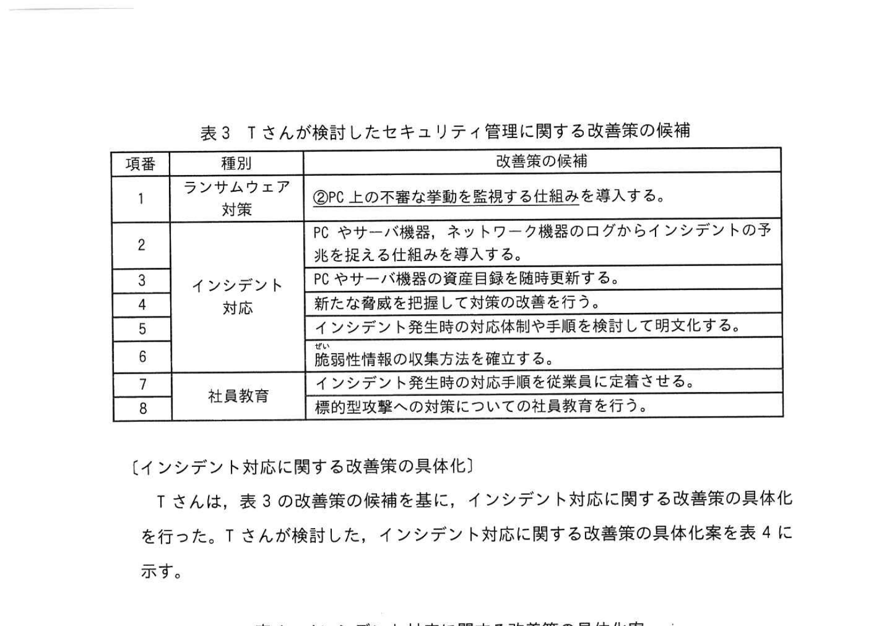

# 2023年春期（令和5年度春期）応用情報技術者試験 午後 問1（必須）
## 情報セキュリティ：旅行代理店へのランサムウェアインシデント対応・社員教育

---

## 問題文

**問1** マルウェア対策に関する次の記述を読んで、設問に答えよ。

R社は、全国に支店・営業所をもつ、従業員約150名の旅行代理店である。国内の宿泊と交通手段を旅行パッケージとして、法人と個人の双方に販売している。R社は、旅行パッケージ利用者の個人情報を扱うので、個人情報保護法で定める個人情報取扱事業者である。

---

### 〔ランサムウェアによるインシデント発生〕

あるとき、R社従業員の S さんが新しい旅行パッケージの検討のために、R社から S さんに支給されている PC（以下、PC-S という）を用いて業務を行っていたところ、PC-S に多額の金を要求するメッセージが表示された。S さんは連絡すべき窓口が分からなかったため、数時間後に連絡が来た上司からの指示によって、R社の情報システム部門に連絡した。T さんは、セキュリティ対策支援サービスを提供している Z 社に、提出された PC-S 及び R社 LAN の調査を依頼した。数日後に Z 社から受け取った調査結果の一部を示す。

- PC-S から、国内で流行しているランサムウェアが発見された。
- ランサムウェアが、取引先を装った電子メールの添付ファイルに含まれていた。S さんが当該ファイルを開いた結果、PC-S にインストールされた。
- PC-S から、内文書ファイルが暗号化されていた。復号できなかった。
- PC-S から、インターネットに向けて不審な通信が行われた痕跡はなかった。
- PC-S から、R社 LAN 上の IP アドレスをスキャンした痕跡はなかった。
- ランサムウェアによる今回のインシデントは、表1に示すサイバーキルチェーンの攻撃の段階では `[　a　]` まで完了したと考えられる。

### 表1 サイバーキルチェーンの攻撃の段階

> | 項番 | 攻撃の段階 | 代表的な攻撃の概要 |
> |---|---|---|
> | 1 | 偵察 | インターネットなどから攻撃対象組織に関する情報を収集する |
> | 2 | 武器化 | マルウェアなどを作成する |
> | 3 | デリバリ | マルウェアを忍び込ませたりパッケージに含めて配信する |
> | 4 | エクスプロイト | ユーザにマルウェアを実行させる |
> | 5 | インストール | 攻撃対象組織の PC にマルウェアをインストールさせる |
> | 6 | C&C | 攻撃対象組織の PC から C&C サーバを通じて攻撃対象組織の PC を遠隔操作する |
> | 7 | 目的の実行 | 攻撃対象組織の PC で収集した組織内部情報をもち出す |

---

### 〔セキュリティ管理に関する評価〕

T さんは、表2の課題に対応する改善策の検補を表3の中から選び、表3の項番で答えるように指示された。

T さんが確認した、Z社から示された R社のセキュリティ管理の評価を踏まえて、T さんは Z 社に R 社のセキュリティ管理の現状を説明し、評価を依頼した。

### 表2 R社のセキュリティ管理に関する課題（一部）

> | 項番 | 種別 | 指摘内容 |
> |---|---|---|
> | 1 | ランサムウェア対策 | PC 上でランサムウェアの実行を検知する対策が取られていない。 |
> | 2 | インシデント対応 | インシデントの発見を伝える仕組みが整備されていない。 |
> | 3 | インシデント対応 | インシデント発生時の対処手順が整備されていない。 |
> | 4 | インシデント対応 | インシデント発生時の適切な対処手順を従業員に周知されていない。 |
> | 5 | 社員教育 | 標的型攻撃への対策が従業員に周知されていない。 |

### 表3 T さんが検討したセキュリティ管理に関する改善策の検補

> | 項番 | 種別 | 改善策の検補 |
> |---|---|---|
> | 1 | ランサムウェア対策 | ①PC 上で不審な挙動を監視する仕組みを導入する。 |
> | 2 | ランサムウェア対策 | PC やサーバ機器、ネットワーク機器のログなどインシデントの予兆を探せる仕組みを導入する。 |
> | 3 | インシデント対応 | PC やサーバ機器の資産目録を随時更新する。 |
> | 4 | インシデント対応 | 新たな脅威を把握して以前に宣告予測すべき問題を整理する。 |
> | 5 | インシデント対応 | インシデント発生時の対応体制と手順書を検討して明文化する。 |
> | 6 | インシデント対応 | インシデント発生時の適切な対処手順を従業員に周知する。 |
> | 7 | 社員教育 | 施設性情報などを気安く取り出せるように意識を高める。 |
> | 8 | 社員教育 | インシデント対応事例を検索し、技術的な対策の改善を行う。 |

---

### 〔インシデント対応に関する改善策の具体化〕

T さんは、表3の改善策の検補を基に、インシデント対応に関する改善策の具体化を行った。T さんが検討した、インシデント対応に関する改善策の具体化案を表4に示す。

### 表4 インシデント対応に関する改善策の具体化案

> | 項番 | 改善策の具体化案 | 対応する表3の項番 |
> |---|---|---|
> | 1 | R社各拠点のインシデント対応を行う担当者を明確にする。 | 5 |
> | 2 | R社の情報機器のログを集断して分析する仕組みを整備する。 | 2 |
> | 3 | R社で使用している情報機器を把握して整理する組織情報を収集する。 | `[　b　]` |
> | 4 | `[　c　]` | `[　d　]` |
> | 5 | ②セキュリティインシデント事例を確認し、技術的な対策の改善を行う。 | 4 |

検討したインシデント対応に関する改善策の具体化を U 部長に説明したところ、表4の項番5の事項について、特にマルウェア感染などによって個人情報が取り扱われた事例を中に、Z社から支援を受けて調査するように指示があった。

---

### 〔社員教育に関する改善策の具体化〕

T さんは、表3の改善策の検補を基に、社員教育に関する改善策の具体化を行った。T さんが検討した、社員教育に関する改善策の具体化案を表5に示す。

### 表5 社員教育に関する改善策の具体化案

> | 項番 | 改善策の具体化案 | 対応する表3の項番 |
> |---|---|---|
> | 1 | 標的型攻撃メールの見分け方と対応方法などに関する教育を定期的に実施する。 | 8 |
> | 2 | インシデント発生を想定した訓練を実施する。 | 7 |

R社では、標的型攻撃に対する方法やインシデント発生時の対応手順が明確化されておらず、従業員に周知する活動も不足していた。そこで、標的型攻撃の内容とリスクや標的型攻撃メールへの具体的な対応手法を記載したリーフレットを作成して、新入社員が入社する4月に企業全員に対して以前の期間に行うことにした。

また、R社はインシデント発生を想定した訓練の実施方法の具体化を検討した。図1に示す一連のインシデント対応フローのうち、③**全従業員を対象に実施すべき対応**と、経営者を対象に実施すべき対応を中心に、ランサムウェアによるインシデントへの対応を含めたシナリオを検討した。

### 図1 インシデント対応フロー

> ア 発見/通報（初） → イ トリアージ → ウ インシデントレスポンス → エ 報告/情報共有 → オ 証拠保全

T さんは、今回のインシデントの教訓を生かして、ランサムウェアに感染した際に PC 内の重要な文書ファイルの消失を防ぐため、取り外しできる記録媒体にバックアップを取得する対策を教育内容に含めることにした。検討した全員教育に関する改善策の具体化案を U 部長に説明したところ、④**バックアップを取得した記録媒体の保管方法**について、その内容を教育内容に含めるように T さんに指示した。

---

## 設問

### 設問1 〔ランサムウェアによるインシデント発生〕について答えよ。

**(1)** 本文中の下線①について、PC-S に対して直ちに実施すべき対策を解答群の中から選び、記号で答えよ。

**解答群：**
- ア 怪しいファイルを削除する
- イ 業務アプリケーションを終了する
- ウ ネットワークから切り離す
- エ 表示されたメッセージに従う

**(2)** 本文中の `[　a　]` に入れる適切な攻撃の段階を表1の中から選び、表1の項番で答えよ。

### 設問2 〔セキュリティ管理に関する評価〕について答えよ。

**(1)** 表2の課題に対応する改善策の検補を表3の中から選び、表3の項番で答えよ。

**(2)** 表3の下線②について、PC 上の不審な挙動を監視する仕組みの略称を解答群の中から選び、記号で答えよ。

**解答群：** ア APT  イ EDR  ウ UTM  エ WAF

### 設問3 〔インシデント対応に関する改善策の具体化〕について答えよ。

**(1)** 表4中の下線③について、インシデント対応を行う組織の略称を解答群の中から選べ。

**解答群：** ア CASB  イ CSIRT  ウ MITM  エ RADIUS

**(2)** 表4中の `[　b　]`、`[　c　]`、`[　d　]` に入れる適切な字句を答えよ。

**(3)** 表4の下線④について、調査すべき内容を解答群の中から全て選び、記号で答えよ。

**解答群：**
- ア 使用された攻撃手法
- イ 被害によって被った損害金額
- ウ 被害を受けた機器の種類
- エ 被害を受けた組織の業種

### 設問4 〔社員教育に関する改善策の具体化〕について答えよ。

**(1)** 本文中の下線⑤について、全従業員を対象に訓練を実施すべき対応を図1の中から選び、図1の記号で答えよ。

**(2)** 本文中の下線⑥について、記録媒体の適切な保管方法を20字以内で答えよ。

---

## 解答と解説

### 設問1

**(1) 正解：ウ（ネットワークから切り離す）**

ランサムウェアに感染した場合、まず LAN から切り離して感染拡大を防ぐことが最優先。

**(2) 正解：a=5（インストール）**

今回の調査結果から：
- PC-S にランサムウェアがインストールされた（5：インストール完了）
- 社内 LAN スキャンの痕跡なし（6：C&C 未実行）
- 外部への不審通信なし（7：目的の実行 未完）

→ 攻撃はインストール（5段階）まで完了したと判断。

---

### 設問2

**(1) 正解：**

| 表2項番 | 表3項番 |
|---|---|
| 1（ランサムウェア対策） | 1 |
| 2（インシデント発見） | 5 |
| 3（対処手順整備） | 5 |
| 4（対処手順周知） | 6 |
| 5（社員教育） | 8 |

**(2) 正解：イ（EDR）**

EDR（Endpoint Detection and Response）は、エンドポイント（PC・サーバ）上で不審な挙動をリアルタイムに検知・対応するセキュリティ製品。

---

### 設問3

**(1) 正解：イ（CSIRT）**

CSIRT（Computer Security Incident Response Team）は、組織内でインシデント対応を行うセキュリティチーム。

**(2)**

| 空欄 | 正解 |
|---|---|
| **b** | 3 |
| **c** | インシデント発生時の対処手順を整備して周知する |
| **d** | 6 |

**(3) 正解：ア、ウ（使用された攻撃手法、被害を受けた機器の種類）**

セキュリティインシデント事例から学ぶべきは「技術的な対策の改善」につながる情報。攻撃手法と被害機器の種類が直接技術対策に活用できる。損害金額・業種は別の目的。

---

### 設問4

**(1) 正解：ア（発見/通報）**

全従業員が実施すべきはインシデントの「発見と通報」。トリアージ以降は専門チーム（CSIRT）や経営者が担当する。

**(2) 正解：PCから切り離して保管する。**

バックアップメディア（外付けHDD・USB メモリ等）を PC に繋いだままにすると、ランサムウェアがバックアップデータも暗号化してしまうため、使用後は PC から取り外して保管する必要がある。

---

## 参考：主要キーワード

| 用語 | 説明 |
|------|------|
| ランサムウェア | ファイルを暗号化して復号と引き換えに身代金を要求するマルウェア |
| サイバーキルチェーン | サイバー攻撃を7段階で表したフレームワーク（偵察〜目的の実行） |
| EDR（Endpoint Detection and Response） | エンドポイント上の不審な挙動を検知・対応するセキュリティ製品 |
| CSIRT（Computer Security Incident Response Team） | 組織内のインシデント対応チーム |
| 標的型攻撃 | 特定の組織を狙った、フィッシングメールなどを使った攻撃 |
| インシデントレスポンス | インシデント発生時の対応活動全般 |
| トリアージ | インシデントの優先度・深刻度を評価・分類する作業 |
| バックアップ分離保管 | ランサムウェア対策でバックアップを PC から切り離して保管すること |
| 個人情報取扱事業者 | 個人情報保護法に基づき個人情報を取り扱う事業者 |
| APT（Advanced Persistent Threat） | 高度かつ持続的なサイバー攻撃。特定の組織を長期間狙う |
