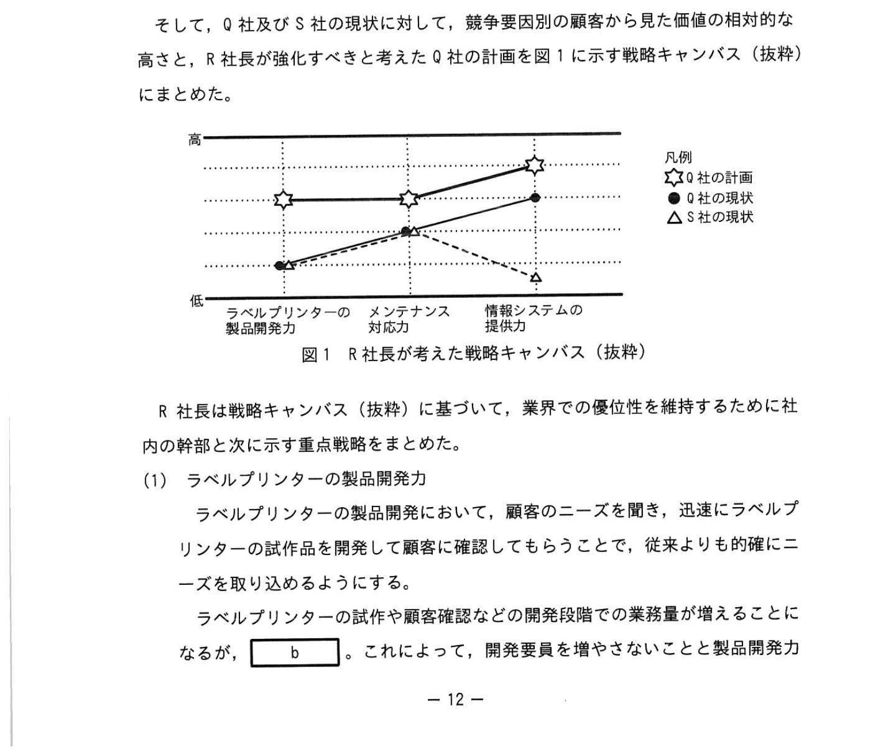

# 2023年春期（令和5年度春期）応用情報技術者試験 午後 問2（選択）
## 経営戦略：中堅の電子機器製造販売会社の経営戦略（ブルーオーシャン戦略・戦略キャンバス）

---

## 問題文

**問2** 中堅の電子機器製造販売会社の経営戦略に関する次の記述を読んで、設問に答えよ。

Q社は、中堅の電子機器製造販売会社で、中小のスーパーマーケット（以下、スーパーという）を顧客としている。Q社の主力製品は、商品管理に使用するバーコードを印字するラベルプリンター、及びバーコードを印字する商品管理用のラベル（以下、バーコードラベルという）などの消耗品である。さらに、技術を転用してバーコード読取装置（以下、バーコードリーダーという）も製造販売している。

顧客がバーコードラベルを使用する場合は、商品に合った大きさ、厚さ、及び材質のバーコードラベルが必要になり、これに対応してラベルプリンターの設定が必要になる。商品ごとに顧客の従業員がマニュアルを見ながら各店舗でラベルプリンターの画面から操作して設定しているが、続々と新商品が出てくる現在、この設定のスキルの習得は、慢性的な人手不足に悩む顧客にとって負担となっている。

---

### 〔現在の経営戦略〕

Q社では、ラベルプリンターの機種を多数そろえるとともに、ラベルプリンター及びバーコードリーダーと連携して商品管理や消耗品の使用量管理などを支援するソフトウェアパッケージ（以下、Q社パッケージという）を業界で初めて開発して市場に展開し、①**競合がない市場を切り開く経営戦略**を掲げ、次に示す施策に基づき積極的に事業展開して業界での優位性を保っている。

- 顧客の従業員がQ社パッケージのガイド画面から操作して、接続されている全ての店舗のラベルプリンターの設定を一度に変更することで、これまでと比べて負担を軽減できる。さらに②**顧客の依頼に応じて、ラベルプリンターの設定作業を受託する**。
- ラベルプリンターの販売価格は他社より抑え、バーコードラベルなどの消耗品の料金体系は、Q社パッケージで集計した使用量に応じたものとする。
- 毎年、従来機種を改良したラベルプリンターを開発し、ラベルプリンターが有する様々な便利な機能を最大限活用できるように、Q社パッケージの機能を拡充する。

これらの施策の実施によって、Q社は `[　a　]` ビジネスモデルを実現し、価格設定や顧客への対応などが受け入れられて、リピート受注を確保でき、業界平均以上の収益性を維持している。

---

### 〔現在の問題点〕

一方で、今後も業界での優位性を維持するには次の問題もある。

- 最近開発したラベルプリンターで、設置される環境や操作性などについて、顧客ニーズの変化を十分に把握しきれておらず、顧客満足度が低い機種がある。
- ラベルプリンターは定期的に予防保守を行い、部品を交換しているが、交換する前に故障が発生してしまうことがある。故障が発生した場合のメンテナンスは、顧客の担当者から故障連絡を受けて、高い頻度で発生する故障の修理に必要な部品を持って要員が現場で対応している。しかし、故障部位の詳細な情報は事前に把握できず、修理に必要な部品を持っていない場合は、1回の訪問で修理が完了せず、顧客の業務に影響が出たことがある。また、複数の故障連絡が重なるなど、要員の作業の繁閑が予測困難で、要員が計画的に作業できずに苦慮している。
- 多くの顧客では、消費期限が近くなった商品の売れ残りが発生しそうな場合には、消費期限と売れ残りの見通しから予測した時刻に、値引き価格を印字したバーコードラベルを重ねて貼っている。食品の取扱いが多い顧客からは、顧客の戦略目標の一つである食品廃棄量削減を達成するために、値引き価格を印字したバーコードラベルを貼る適切な時刻を通知する機能を情報システムで提供するよう要望を受けているが、現在のQ社パッケージで管理するデータだけでは対応できない。
- ラベルプリンターの製造コストは業界では平均的だが、バーコードリーダーは、開発に多くの要員を割かれていて製造コストは業界での平均よりも高い。バーコードリーダーの製造販売において、他社と差別化できておらず、販売価格を上げられないので利益を確保できていない。
- ラベルプリンターでは、スーパーを顧客とする市場が飽和状態になりつつある中で、大手の事務機器製造販売会社のS社がラベルプリンターを開発して、スーパーを顧客とする事務機器の商社を通して大手のスーパーに納入した。S社は、スーパーとの直接的な取引はないが、今後、Q社が事業を展開している中小のスーパーを顧客とする市場にも進出するおそれが出てきた。

将来に備えて経営戦略を強化することを考えたQ社のR社長は、外部企業へ依頼して、Q社が製造販売する製品と提供するサービスに関する調査を行った。

---

### 〔経営戦略の強化〕

調査の結果、R社長は次のことを確認した。

- ラベルプリンターの開発において、顧客ニーズの変化に素早く対応して他社との差別化を図らなければ、顧客満足度が下がり業界での優位性が失われる。
- メンテナンス対応において、故障による顧客業務への影響を減らせば顧客満足度が上がる。顧客満足度を上げれば、既存顧客からのリピート受注率が高まる。
- 顧客満足度を上げるためには、製品開発力及びメンテナンス対応力を強めることに加えて、顧客が情報システムに求める機能の提供力を強めることが必要である。
- バーコードリーダーは、Q社のラベルプリンターやQ社パッケージの製造販売と競合せず、POS端末及び中小のスーパーで定評のある販売管理ソフトウェアパッケージを製造販売するU社から調達できる。

そして、Q社及びS社の現状に対して、競争要因別の顧客から見た価値の相対的な高さと、R社長が強化すべきと考えたQ社の計画を図1に示す戦略キャンバス（抜粋）にまとめた。

### 図1 R社長が考えた戦略キャンバス（抜粋）

> 競争要因（横軸）：ラベルプリンターの製品開発力、メンテナンス対応力、情報システムの提供力／縦軸：顧客から見た価値の高さ（高〜低）
> 凡例：☆ Q社の計画、● Q社の現状、△ S社の現状
> - Q社の計画は3要因とも高い水準に位置づけ、特に情報システムの提供力を大きく引き上げる。

R社長は戦略キャンバス（抜粋）に基づいて、業界での優位性を維持するために社内の幹部と次に示す重点戦略をまとめた。

**(1) ラベルプリンターの製品開発力**

ラベルプリンターの製品開発において、顧客のニーズを聞き、迅速にラベルプリンターの試作品を開発して顧客に確認してもらうことで、従来よりも的確にニーズを取り込めるようにする。ラベルプリンターの試作や顧客確認などの開発段階での業務量が増えることになるが、`[　b　]`。これによって、開発要員を増やさないことと製品開発力を強化することとの整合性を確保する。

**(2) メンテナンス対応力**

R社長は、メンテナンス対応の要員数を変えず、③**メンテナンス対応力を強化**して顧客満足度を上げることを考えた。具体的には、④**Q社パッケージが、インターネット経由で、Q社のラベルプリンターの稼働に関するデータ、及びモーターなどの部品の劣化の兆候を示す電圧変化などのデータを収集して適宜Q社に送信する機能を実現する**。

**(3) 情報システムの提供力**

Q社の業界での優位性を更に高めるために、⑤**SDGsの一つである"つくる責任、つかう責任"**に関して、顧客が食品の廃棄量の削減を達成するための支援機能など、Q社パッケージの機能追加を促進する。このために、U社と連携して、Q社パッケージとU社の販売管理ソフトウェアパッケージとを連動させる。

---

## 設問

### 設問1 〔現在の経営戦略〕について答えよ。

**(1)** 本文中の下線①について、Q社が実行している戦略を解答群の中から選び、記号で答えよ。

**解答群：**
- ア コストリーダーシップ戦略
- イ 市場開拓戦略
- ウ フォロワー戦略
- エ ブルーオーシャン戦略

**(2)** 本文中の下線②について、Q社が設定作業を受託する背景にある顧客の課題は何か。25字以内で答えよ。

**(3)** 本文中の `[　a　]` に入れる適切な字句を解答群の中から選び、記号で答えよ。

**解答群：**
- ア Q社パッケージの販売利益でバーコードラベルなどの消耗品の赤字を補填する
- イ バーコードラベルなどの消耗品で利益を確保する
- ウ バーコードラベルなどの消耗品を安く販売し、リピート受注を確保する
- エ ラベルプリンターの販売利益でバーコードラベルなどの消耗品の赤字を補填する

### 設問2 〔経営戦略の強化〕について答えよ。

**(1)** 本文中の `[　b　]` に入れる適切な字句を解答群の中から選び、記号で答えよ。

**解答群：**
- ア Q社パッケージの販売を中止し、開発要員をラベルプリンターの開発に振り向ける
- イ バーコードリーダーの開発を中止し、開発要員をラベルプリンターの開発に振り向ける
- ウ メンテナンス要員をラベルプリンターの開発に振り向ける
- エ ラベルプリンターの機種を減らし、開発要員を減らす

**(2)** 本文中の下線③について、R社長の狙いは何か。〔経営戦略の強化〕中の字句を用い、15字以内で答えよ。

**(3)** 本文中の下線④について、顧客の業務への影響を減らすために、Q社において可能となることを二つ挙げ、それぞれ15字以内で答えよ。また、それらによって、Q社にとって、どのようなメリットがあるか。〔現在の問題点〕を参考に、15字以内で答えよ。

**(4)** 本文中の下線⑤の支援機能として、情報システムで提供する機能は何か。35字以内で答えよ。

---

## 解答と解説

### 設問1

**(1) 正解：エ（ブルーオーシャン戦略）**

競合のない新市場を開拓する戦略がブルーオーシャン戦略。Q社は業界初のQ社パッケージ（ラベルプリンター・バーコードリーダー連携ソフト）で競合のない市場を切り開いた。

**(2) 正解：設定スキルの習得に人手を割けないこと（18字）**

商品ごとに異なるラベルプリンター設定のスキル習得が、慢性的な人手不足に悩む顧客にとって負担となっており、その習得に人手を割けないことが背景の課題。

**IPA公式：設定スキルの習得に人手を割けないこと**

**(3) 正解：a=イ（バーコードラベルなどの消耗品で利益を確保する）**

ラベルプリンター本体は他社より安く販売し、消耗品（バーコードラベル）の使用量に応じた継続課金で利益を確保する、いわゆる「替刃モデル」型のビジネスモデル。

---

### 設問2

**(1) 正解：b=イ（バーコードリーダーの開発を中止し、開発要員をラベルプリンターの開発に振り向ける）**

バーコードリーダーは他社と差別化できず利益を確保できていない。その開発を中止して開発要員をラベルプリンターに振り向けることで、要員を増やさずに製品開発力を強化できる。

**(2) 正解：リピート受注率を高めること（13字）**

メンテナンス対応力を強化して顧客満足度を上げ、既存顧客からのリピート受注率を高めることがR社長の狙い。

**IPA公式：リピート受注率を高めること**

**(3) 正解：**
- 可能となること①：タイムリーな予防保守
- 可能となること②：詳細な故障部位の把握
- メリット：要員が計画的に作業できる。

④の機能でラベルプリンターの稼働データや部品劣化の兆候を収集することで、交換前の故障を防ぐタイムリーな予防保守や、詳細な故障部位の把握が可能になる。これにより必要な部品を持って訪問でき、故障連絡の繁閑を見通せるので、要員が計画的に作業できる（〔現在の問題点〕の「要員が計画的に作業できずに苦慮している」を参考）。

**IPA公式：①タイムリーな予防保守／②詳細な故障部位の把握／メリット＝要員が計画的に作業できる。**

**(4) 正解：値引き価格を印字したバーコードラベルを貼る適切な時刻を通知する機能（33字）**

U社の販売管理データと連動して消費期限・売れ残りを予測し、食品廃棄量削減のために値引きラベルを貼る適切な時刻を通知する機能を提供する。

---

## 参考：主要キーワード

| 用語 | 説明 |
|------|------|
| ブルーオーシャン戦略 | 競争相手のいない新市場（ブルーオーシャン）を開拓する経営戦略 |
| レッドオーシャン | 既存の競争が激しい市場。ブルーオーシャンの対義語 |
| コストリーダーシップ戦略 | 業界最低コストを実現して競争優位を確立する戦略 |
| 戦略キャンバス | 競争要因ごとに自社と競合の価値水準を可視化するフレームワーク（ブルーオーシャン戦略のツール） |
| 替刃モデル | 本体を低価格で提供し、消耗品・サービスで継続収益を得るビジネスモデル |
| 予防保守 | 故障が発生する前に異常を検知して保守対応するアプローチ |
| SDGs | 持続可能な開発目標。目標12が「つくる責任 つかう責任」 |
| リピート受注 | 同じ顧客からの継続的な注文。顧客満足度向上が鍵 |
| POS端末 | 販売時点情報管理を行うレジ端末 |
