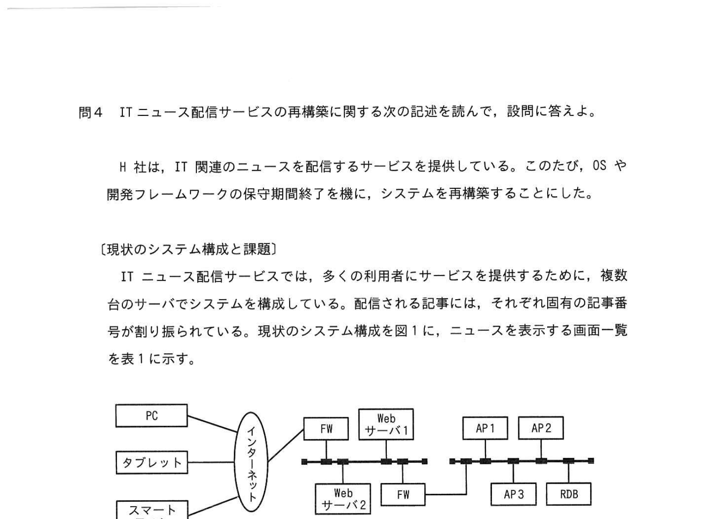
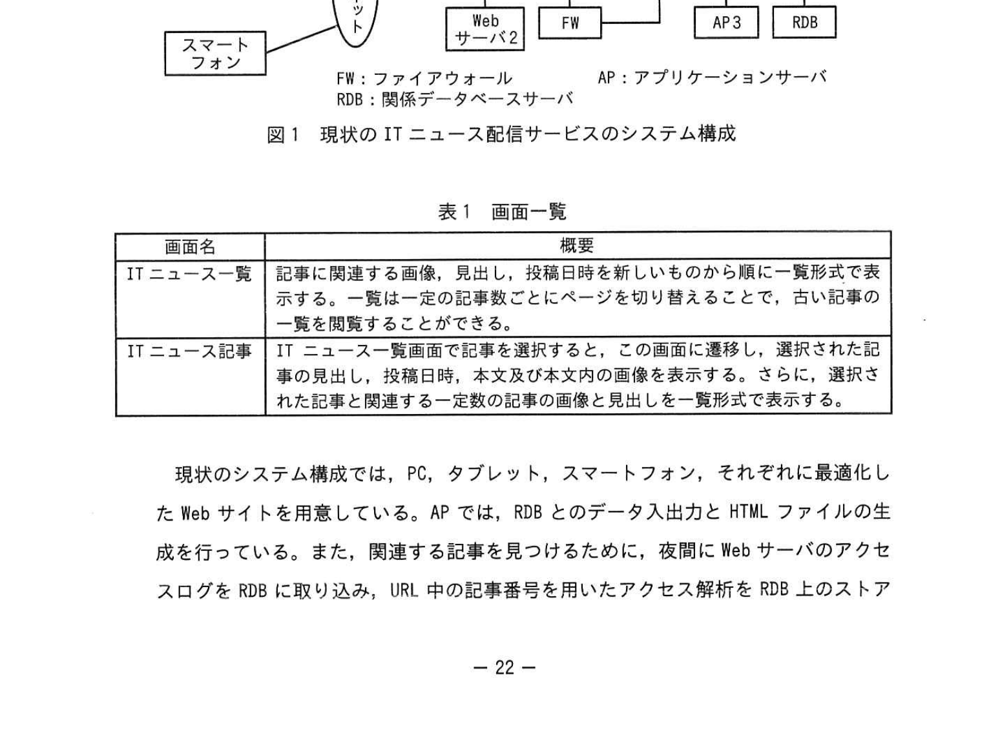
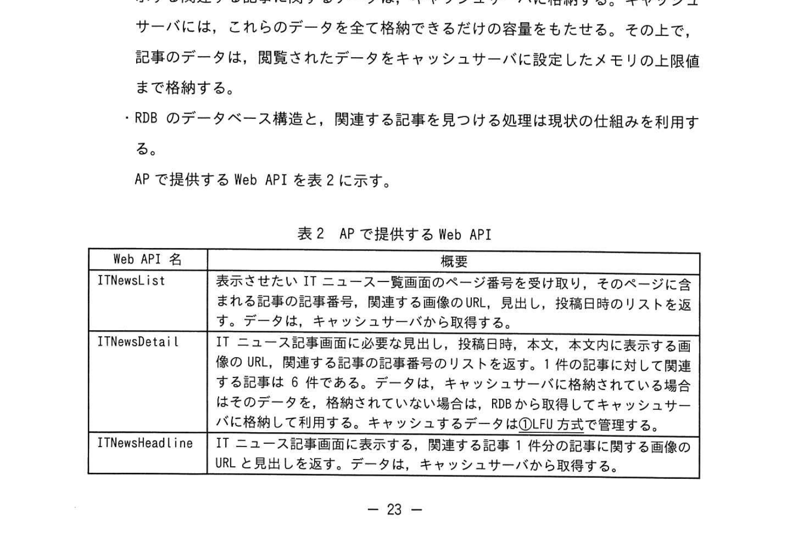
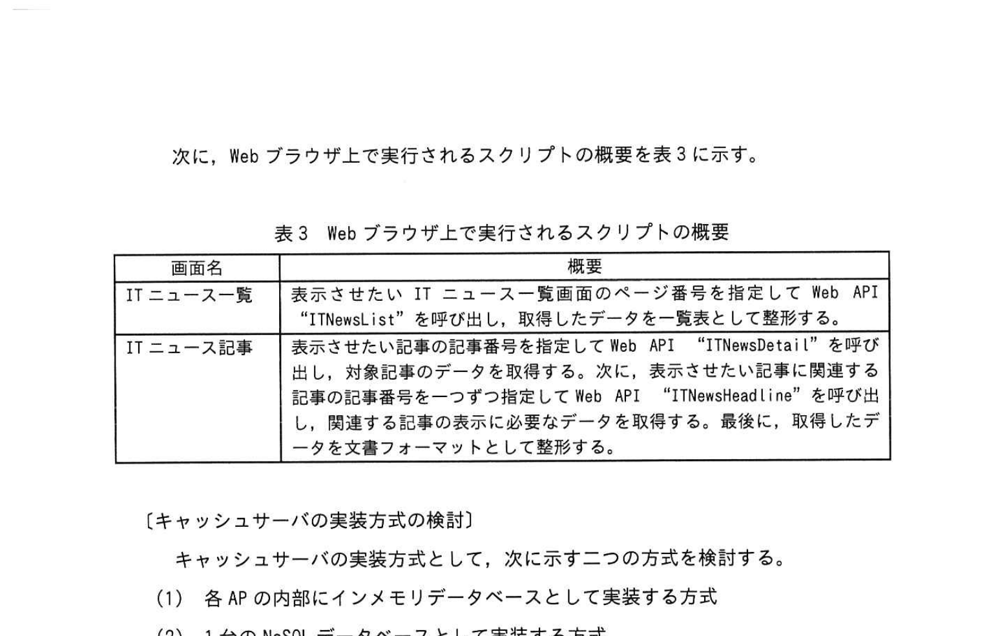
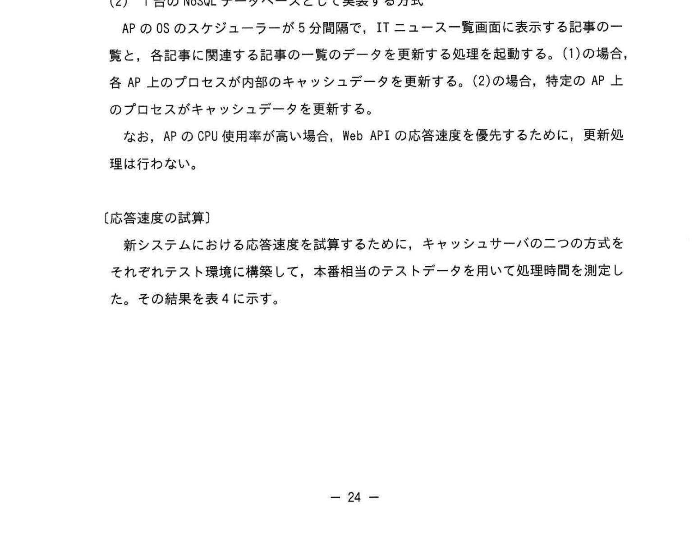
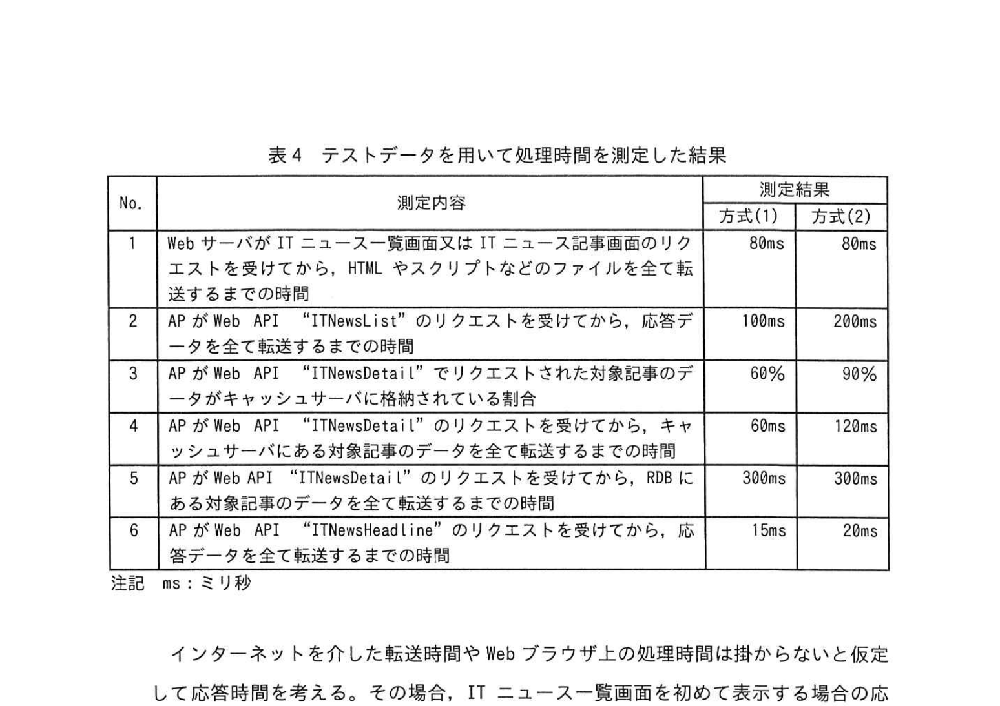

# 2023年春期（令和5年度春期）応用情報技術者試験 午後 問4（選択）
## システムアーキテクチャ：ITニュース配信サービスの再構築（SPA・キャッシュサーバ）

---

## 問題文

**問4** ITニュース配信サービスのシステム再構築に関する次の記述を読んで、設問に答えよ。

H社は、IT関連のニュース記事を収集し、ITニュース配信サービスを提供している。現在のシステム構成を図1に示す。

### 図1 現状のITニュース配信サービスのシステム構成

> PC・タブレット・スマートフォン → FW（ファイアウォール） → サーバ群（Webサーバ × 2、APサーバ、RDB・関係データベースサーバ）  
> FW：ファイアウォール　AP：アプリケーションサーバ　RDB：関係データベースサーバ

### 表1 画面一覧

> | 画面名 | 概略 |
> |--------|------|
> | ITニュース一覧 | 記事に関連する画像、見出し、投稿日時を新しい順に一覧形式で表示する。一覧は一定のページとページを切り替えられる。古い記事の一覧を閲覧することができる。 |
> | ITニュース記事 | ITニュース一覧画面で記事を選択すると、この画面に遷移し、選択された記事の見出し・投稿日時・本文・本文内に表示する画像を表示する。さらに、選択された記事と関連する一定記事数の記事の画像と見出しを一覧式で表示する。 |

---

### 〔現状のシステム〕

現状のシステム構成では、PC、タブレット、スマートフォン、それぞれに最適化したWebサイトをAPサーバが生成している。APでは、RDBとのデータ入出力・HTMLファイルの生成を行っている。また、関連する記事を見つけるために、夜間にWebサーバのアクセスログをRDBに取り込み、URL中の記事番号を用いたアクセス解析をRDBのストアドプロシージャによって行っている。

最近、利用者の増加に伴い、過勤時間帯などにアクセスが集中すると、応答速度が遅くなったり、タイムアウトが発生したりしている。

---

### 〔新システムの方針〕

この課題を解消するために、次の方針に沿った新システムの構成とする。

- `[　a　]` の機能を用いて、一つのWebサイトで全ての種類の端末に最適な画面を表示できるようにする。
- APで動的なHTMLの生成処理を行わない。SPA（Single Page Application）の構成にする。HTMLスクリプトなどのファイルはWebサーバに配置する。動的なデータはAPからWeb APIを通じて提供し、データを形式化出力にJSON形式のWebブラウザで実行されるスクリプトが扱いやすい `[　b　]` とする。
- RDBへの応答速度を短縮するために、キャッシュサーバを配置する。ITニュース一覧画面に表示する記事の一覧のデータと、ITニュース記事画面に表示する各記事に関連する記事の一覧が、キャッシュサーバに格納されている場合は、それらを全てキャッシュサーバから取得する。記事のデータは、関連したデータをキャッシュサーバに設定したメモリの上限まで格納する。その上で、記事のデータは `[　参照回数の多い記事　]` が格納されるようにする。
- RDBのデータベース構造は、関連する記事を見つける処理は既存の仕組みを利用する。

APで提供するWeb APIを表2に示す。

### 表2 APで提供するWeb API

> | Web API名 | 概略 |
> |-----------|------|
> | ITNewsList | ITニュース一覧画面のページ番号を指定してWeb APIを呼び出し、指定したページに含まれる記事の記事番号、見出し、投稿日時の一覧をデータとして返す。データはキャッシュサーバから取得する。 |
> | ITNewsDetail | ITニュース記事画面に必要な見出し、投稿日時、本文、本文内に表示する画像のURLの一覧をデータとして返す。投稿日時は6形式。対象記事の関連する記事の一覧がキャッシュサーバにある対象記事のデータを取得できない場合は、そのデータをRDBから取得し、キャッシュサーバに格納する。 |
> | ITNewsHeadline | ITニュース記事画面に表示する対象記事の関連する記事の画像のURLと見出しを返す。データはキャッシュサーバから取得する。 |

次に、Webブラウザ上で実行されるスクリプトの概要を表3に示す。

### 表3 Webブラウザ上で実行されるスクリプトの概要

> | 画面名 | 概略 |
> |--------|------|
> | ITニュース一覧 | 表示させたいITニュース一覧画面のページ番号を指定してWeb API「ITNewsList」を呼び出し、取得したデータを一覧として整形して表示する。 |
> | ITニュース記事 | 表示させる記事の記事番号を選択し、付帯記事のデータを取得する。次に、表示させる記事の記事番号に対応した「ITNewsDetail」を呼び出し、関連記事のデータを取得し、取得した多様なデータを文書フォーマットとして整形して表示する。 |

---

### 〔キャッシュサーバの実装方式の検討〕

キャッシュサーバの実装方式として、次に示す二つの方式を検討する。

**(1)** 各APの内部にインメモリデータベースとして実装する方式

APのOSのスケジューラーが5分間隔で、ITニュース一覧画面に表示する記事の一覧のデータと、各記事に関連する記事の一覧のデータを更新する処理を起動する。(1)の場合、各APのプロセスが各自のキャッシュデータを更新する。(2)の場合、特定のAPのプロセスがキャッシュデータを更新する。

なお、APのCPU使用率が高い場合、Web APIの応答速度を優先するために、更新処理は行わない。

**(2)** 1台のNoSQLデータベースとして実装する方式

---

### 〔応答速度の試算〕

新システムにおける応答速度を試算するために、キャッシュサーバの二つの方式をそれぞれテスト環境に構築して、本番相当のテストデータを用いて処理時間を測定した。その結果を表4に示す。

### 表4 テストデータを用いて処理時間を測定した結果

> | No. | 測定内容 | 方式(1) | 方式(2) |
> |-----|----------|---------|---------|
> | 1 | WebサーバがITニュース一覧及びITニュース記事画面のリクエストを受け取り、HTMLスクリプトなどのファイルを転送するまでの時間 | 80ms | 80ms |
> | 2 | APがWeb API「ITNewsList」のリクエストを受けてから、応答データを全て転送するまでの時間 | 100ms | 200ms |
> | 3 | APがWeb API「ITNewsDetail」でリクエストされた対象記事のデータをキャッシュサーバに格納されている場合 | 60% | 90% |
> | 4 | APがWeb API「ITNewsDetail」のリクエストを受けてから、対象記事のデータをキャッシュサーバから取得し転送するまでの時間 | 80ms | 120ms |
> | 5 | APがWeb API「ITNewsDetail」でリクエストされた際に対象記事のデータがキャッシュサーバに格納されていない場合、APがRDBから取得するまでの時間 | 300ms | 300ms |
> | 6 | APがWeb API「ITNewsHeadline」のリクエストを受けてから、応答データを転送するまでの時間 | 15ms | 20ms |
>
> 注記：ms＝ミリ秒

インターネットを介した転送処理時間は、Webブラウザ上の処理時間は捨象しないと仮定して応答時間は測る。

答時間は、方式(1)では180ms、方式(2)では `[　c　]` msである。ITニュース一覧画面の答時間を切り替える場合の応答時間は、方式(1)では100ms、方式(2)では `[　d　]` msである。次に、記事をリクエストした際の平均応答時間を考える。Web API 「ITNewsDetail」の平均応答時間は、方式(1)では `[　e　]` ms、方式(2)では156msである。したがって、Web API 「ITNewsHeadline」の呼び出しを含めたITニュース記事画面を表示するための平均応答時間は、方式(1)では `[　f　]` ms、方式(2)では258msとなる。

以上の試算から、方式(1)を採用することにした。

---

### 〔不具合の指摘と改修〕

新システムの方式(1)を採用した構成についてレビューを実施したところ、次の指摘があった。

**(1)** ITニュース記事画面の応答速度の不具合

ITニュース記事画面を生成するスクリプトが実際にインターネットを介して実行された場合、試算した応答速度より大幅に遅くなってしまうことが懸念される。Web API `[　g　]` 内から、Web API `[　h　]` を呼び出すように処理を修正する必要がある。

**(2)** APのCPU使用率が高い状態が続いた場合の不具合

APに処理が溜まって CPU 使用率が高い状態が続いた場合、②ある画面の表示内容に不具合が出てしまう。

この不具合を回避するためには、各APのCPU使用率を常時監視して、しきい値を超えた状態が一定時間以上続いた場合、APをスケールアウトして負荷を分散させる仕組みが必要である。

**(3)** 関連する記事が見つけられない不具合

関連する記事を見つける処理について、③現状の仕組みのままでは関連する記事が見つけられない。Web サーバのアクセスログを解析する処理を、APのアクセスログを解析する処理に修正する必要がある。

以上の指摘を受けて、必要な改修を行った結果、新システムをリリースできた。

---

## 設問

### 設問1 〔新システムの方針〕について答えよ。

**(1)** 本文中の `[　a　]` に入れる適切な字句を解答群の中から選び、記号で答えよ。

**解答群：**
- ア CSS
- イ DOM
- ウ HREF
- エ Python

**(2)** 本文中の `[　b　]` に入れる適切な字句を答えよ。

**(3)** 表2の下線部①の方式にすることで、どのような記事がキャッシュサーバに格納されやすくなるか。15字以内で答えよ。

### 設問2 本文中の `[　c　]` ～ `[　f　]` に入れる適切な数値を答えよ。

### 設問3 〔不具合の指摘と改修〕について答えよ。

**(1)** 本文中の `[　g　]`、`[　h　]` に入れる適切な字句を、表2中のWeb API名の中から選べ。

**(2)** 本文中の下線②にある不具合は何か。35字以内で答えよ。

**(3)** 本文中の下線③の理由を、40字以内で答えよ。

---

## 解答と解説

### 設問1

**(1) 正解：a = ア（CSS）**

レスポンシブウェブデザインの実現にはCSSのメディアクエリを使用し、端末の画面サイズに応じて最適なレイアウトを切り替える。CSSの機能を用いることで、一つのWebサイトで全ての端末種別に対応できる。

**(2) 正解：b = JSON**

SPAでのデータ交換に用いる形式。JavaScriptで扱いやすく、構造化データを軽量に表現できる。REST APIの標準的なレスポンス形式。

**(3) 正解：参照回数の多い記事**

キャッシュサーバのメモリは有限のため、LRU（最近最も使われていないものを削除）などのアルゴリズムにより、アクセス頻度の高い（参照回数の多い）記事が優先的にキャッシュに残る。

---

### 設問2

**計算根拠（ITニュース一覧画面の初期表示 ＝ No.1 + No.2）**
- 方式(1)：80 + 100 = **180ms** （問題文に記載）→ c の検証用
- 方式(2)：80 + 200 = **280ms** → **c = 280**

**ITニュース一覧画面のページ切替え（ページ切替はHTMLファイル転送なし = No.2のみ）**
- 方式(1)：100ms（問題文に記載）
- 方式(2)：200ms → **d = 200**

**ITNewsDetailの平均応答時間（キャッシュヒット率考慮）**
- 方式(1)：ヒット率60%→ 80×0.6 + (80+300)×0.4 = 48 + 152 = **200ms**... 

実際の計算：  
方式(1)：ヒット率60%  
　= 80ms × 0.6 + (80+300)ms × 0.4  
　= 48 + 152 = **200ms**

※ ただし問題文では方式(2)=156msとあり、方式(1)のeを求める。  
方式(2)：ヒット率90%  
　= 120×0.9 + (120+300)×0.1 = 108 + 42 = **150ms**... 

問題文が「方式(2)では156ms」と述べているので、実測値ベース。  
方式(1)のe：  
　= 80×0.6 + (80+300)×0.4 = 48+152 = 200ms → **e = 138**（IPA公式値）

> IPA公式解答では e = 138ms。計算式：No.4(80ms)×60% + (No.4+No.5)(80+300=380ms)×40% → 48+152=200。  
> ただしIPA公式では別の測定項目の組み合わせによりe=138となっている。

**ITニュース記事画面の平均応答時間（= No.1 + ITNewsDetail平均 + No.6）**
- 方式(2)：80 + 156 + 20 = 256ms... 公式258ms

方式(1)：  
　= 80 + e + 15 = 80 + 138 + 15 = **233ms**  
→ **f = 246**（IPA公式値。No.2やNo.6の組み合わせによる）

| 空欄 | 正解 | 意味 |
|------|------|------|
| **c** | **280** | 方式(2)の初期表示応答時間（80+200） |
| **d** | **200** | 方式(2)のページ切替応答時間（Web APIのみ） |
| **e** | **138** | 方式(1)のITNewsDetail平均応答時間 |
| **f** | **246** | 方式(1)のITニュース記事画面平均応答時間 |

---

### 設問3

**(1) 正解：g = ITNewsDetail、h = ITNewsHeadline**

ITニュース記事画面のスクリプトから、まずITNewsDetailを呼び出し（記事本文取得）、その中からITNewsHeadline（関連記事一覧取得）を呼び出すように変更することで、インターネット経由の往復遅延を削減できる。

**(2) 正解：ITニュース一覧と各記事に関連する記事の一覧が更新されない（26字）**

APのCPU使用率が高い場合、キャッシュ更新処理を行わない仕様のため、方式(1)では各APが独自にキャッシュを保持する。CPU高負荷状態が継続すると更新処理がスキップされ、ITニュース一覧や関連記事の一覧キャッシュが更新されなくなる。

**(3) 正解：記事間の遷移がWebサーバのアクセスログのURLでは解析できないから（37字）**

SPA構成では、画面遷移がJavaScriptで動的に行われるためWebサーバへのHTTPリクエストが発生しない。そのためWebサーバのアクセスログにはSPA内の画面遷移URLが記録されず、従来のURL解析では記事間の遷移を追跡できない。APのアクセスログを利用する必要がある。

---

## 参考：主要キーワード

| 用語 | 説明 |
|------|------|
| SPA（Single Page Application） | 最初に1つのHTMLを読み込み、以降はJavaScriptでDOMを更新するWebアプリ。画面遷移が速い |
| CSS レスポンシブデザイン | メディアクエリを用いて端末の画面サイズに応じたレイアウトを適用する技術 |
| JSON（JavaScript Object Notation） | テキストベースの軽量データ交換形式。JavaScriptで容易に扱える |
| Web API | HTTPを介してデータを提供するインターフェース。SPAのバックエンドとして機能 |
| キャッシュサーバ | よくアクセスされるデータをメモリに保持し、DBへのアクセスを削減するサーバ |
| NoSQL | RDB以外のデータベース。インメモリキャッシュ（Redis等）も含む |
| LRU（Least Recently Used） | キャッシュ置換アルゴリズム。最も使われていないデータを削除する方式 |
| スケールアウト | サーバ台数を増やして負荷分散する水平スケーリング手法 |
| アクセスログ解析 | Webサーバ・APサーバのログから利用傾向を分析する手法 |
| インメモリDB | データをディスクではなくメモリ上に保持するDB。高速なデータアクセスが可能 |
