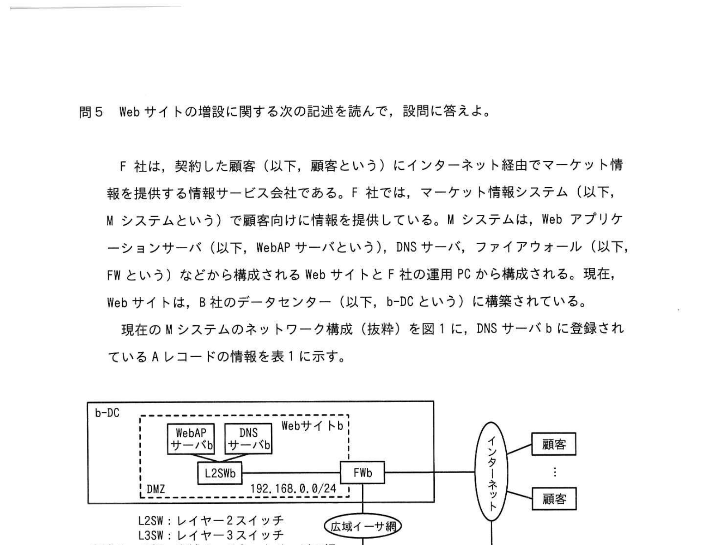
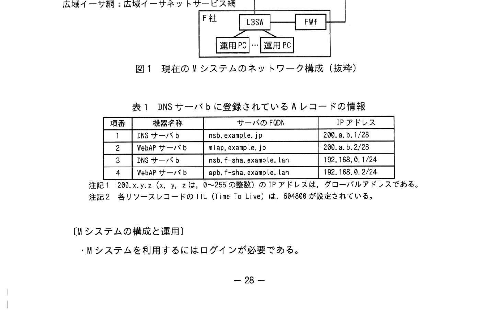
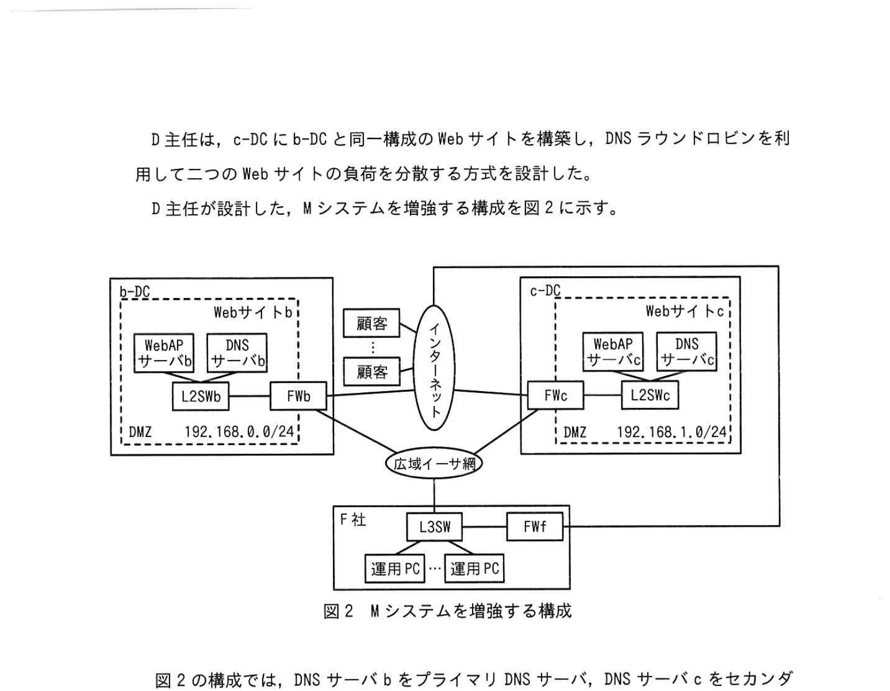
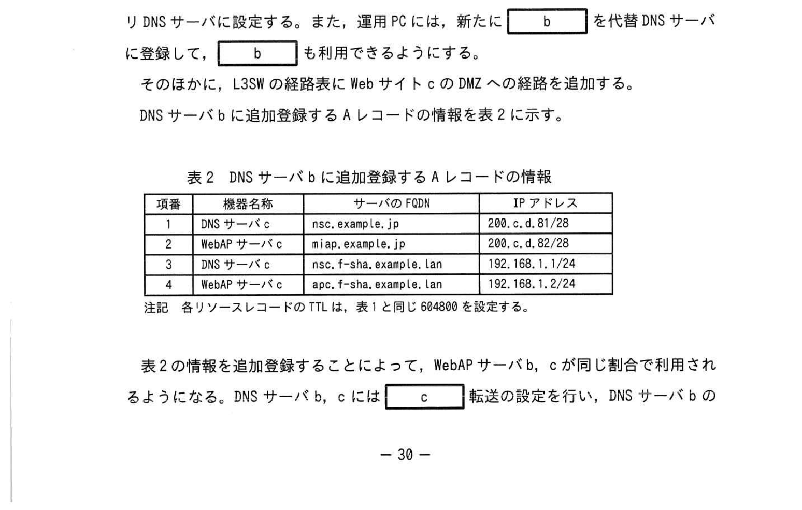

# 2023年春期（令和5年度春期）応用情報技術者試験 午後 問5（選択）
## ネットワーク：Webサイトの増設（DNSラウンドロビン・ゾーン転送）

---

## 問題文

**問5** Webサイトの増設に関する次の記述を読んで、設問に答えよ。

F社は、契約した顧客（以下、顧客という）にインターネット経由でマーケット情報を提供する情報サービス会社である。F社では、マーケット情報システム（以下、Mシステムという）で顧客向けに情報を提供している。Mシステムは、Webアプリケーションサーバ（以下、WebAPサーバという）、DNSサーバ、ファイアウォール（以下、FWという）などから構成されるWebサイトとF社の運用PCから構成される。現在、Webサイトは、B社のデータセンター（以下、b-DCという）に構築されている。

現在のMシステムのネットワーク構成（抜粋）を図1に、DNSサーバbに登録されているAレコードの情報を表1に示す。

### 図1 現在のMシステムのネットワーク構成（抜粋）

> - b-DC：Webサイトb（DMZ 192.168.0.0/24）… WebAPサーバb／DNSサーバb → L2SWb → FWb
> - FWb → インターネット → 顧客
> - FWb → 広域イーサ網 → F社のL3SW → FWf → インターネット
> - F社：L3SW → 運用PC・運用PC
> - L2SW：レイヤー2スイッチ　L3SW：レイヤー3スイッチ　広域イーサ網：広域イーサネットサービス網

### 表1 DNSサーバbに登録されているAレコードの情報

> | 項番 | 機器名称 | サーバのFQDN | IPアドレス |
> |---|---|---|---|
> | 1 | DNSサーバb | nsb.example.jp | 200.a.b.1/28 |
> | 2 | WebAPサーバb | miap.example.jp | 200.a.b.2/28 |
> | 3 | DNSサーバb | nsb.f-sha.example.lan | 192.168.0.1/24 |
> | 4 | WebAPサーバb | apb.f-sha.example.lan | 192.168.0.2/24 |
>
> 注記1：200.x.y.z（x, y, z は、0〜255の整数）のIPアドレスは、グローバルアドレスである。
> 注記2：各リソースレコードのTTL（Time To Live）は、604800が設定されている。

---

### 〔Mシステムの構成と運用〕

- Mシステムを利用するにはログインが必要である。
- FWbには、DMZに設定されたプライベートアドレスとインターネット向けのグローバルアドレスを1対1で静的に変換するNATが設定されており、表1に示した内容で、WebAPサーバb及びDNSサーバbのIPアドレスの変換を行う。
- DNSサーバbは、インターネットに公開するドメインexample.jpとF社の社内向けのドメインf-sha.example.lanの二つのドメインのゾーン情報を管理する。
- F社のL3SWの経路表には、b-DCのWebサイトbへの経路と①**デフォルトルート**が登録されている。
- 運用PCには、②**優先DNSサーバとして、FQDNがnsb.f-sha.example.lanのDNSサーバbが登録されている**。
- F社の運用担当者は、運用PCを使用してMシステムの運用作業を行う。

---

### 〔Mシステムの応答速度の低下〕

最近、顧客から、Mシステムの応答が遅くなることがあるという苦情が、Mシステムのサポート窓口に入ることが多くなった。そこで、F社の情報システム部（以下、システム部という）の運用担当者のD主任は、運用PCを使用して次の手順で原因究明を行った。

- （ⅰ）顧客と同じURLである `https://` `[　a　]` `/` でWebAPサーバbにアクセスし、顧客からの申告と同様の事象が発生することを確認した。
- （ⅱ）FWbのログを検査し、異常な通信は記録されていないことを確認した。
- （ⅲ）SSHを使用し、③**広域イーサ網経由でWebAPサーバbにログインしてCPU使用率を調べた**ところ、設計値を超えた値が継続する時間帯のあることを確認した。

この結果から、D主任は、WebAPサーバbの処理能力不足が応答速度低下の原因であると判断した。

---

### 〔Webサイトの増設〕

D主任の判断を基に、システム部では、これまでのシステムの構築と運用の経験を生かすことができる、現在と同一構成のWebサイトの増設を決めた。システム部のE課長は、C社のデータセンター（以下、c-DCという）にWebサイトcを構築してMシステムを増強する方式の設計を、D主任に指示した。

D主任は、c-DCにb-DCと同一構成のWebサイトを構築し、DNSラウンドロビンを利用して二つのWebサイトの負荷を分散する方式を設計した。D主任が設計した、Mシステムを増強する構成を図2に示す。

### 図2 Mシステムを増強する構成

> - b-DC：Webサイトb（DMZ 192.168.0.0/24）… WebAPサーバb／DNSサーバb → L2SWb → FWb
> - c-DC：Webサイトc（DMZ 192.168.1.0/24）… WebAPサーバc／DNSサーバc → L2SWc → FWc
> - FWb・FWc → インターネット → 顧客／広域イーサ網 → F社（L3SW → FWf、運用PC）

図2の構成では、DNSサーバbをプライマリDNSサーバ、DNSサーバcをセカンダリDNSサーバに設定する。また、運用PCには、新たに `[　b　]` を代替DNSサーバに登録して、`[　b　]` も利用できるようにする。

そのほかに、L3SWの経路表にWebサイトcのDMZへの経路を追加する。

DNSサーバbに追加登録するAレコードの情報を表2に示す。

### 表2 DNSサーバbに追加登録するAレコードの情報

> | 項番 | 機器名称 | サーバのFQDN | IPアドレス |
> |---|---|---|---|
> | 1 | DNSサーバc | nsc.example.jp | 200.c.d.81/28 |
> | 2 | WebAPサーバc | miap.example.jp | 200.c.d.82/28 |
> | 3 | DNSサーバc | nsc.f-sha.example.lan | 192.168.1.1/24 |
> | 4 | WebAPサーバc | apc.f-sha.example.lan | 192.168.1.2/24 |
>
> 注記：各リソースレコードのTTLは、表1と同じ604800を設定する。

表2の情報を追加登録することによって、WebAPサーバb、cが同じ割合で利用されるようになる。DNSサーバb、cには `[　c　]` 転送の設定を行い、DNSサーバbの情報を更新すると、その内容がDNSサーバcにコピーされるようにする。

---

### 〔WebAPサーバのメンテナンス〕

WebAPサーバのメンテナンス時は、作業を行うWebサイトは停止する必要があるので、次の手順で作業を行う。④**メンテナンス中は、一つのWebサイトでサービスを提供することになるので、Mシステムを利用する顧客への影響は避けられない**。

- （ⅰ）事前にDNSサーバbのリソースレコードの `[　d　]` を小さい値にする。
- （ⅱ）メンテナンス作業を開始する前に、メンテナンスを行うWebサイトの、インターネットに公開するドメインのWebAPサーバのFQDNに対応するAレコードを、DNSサーバb上で無効化する。
- （ⅲ）この後、一定時間経てばメンテナンス作業が可能になるが、作業開始が早過ぎると顧客に迷惑を掛けるおそれがある。そこで、⑤**手順(ⅱ)でAレコードを無効化したWebAPサーバの状態を確認し、問題がなければ**作業を開始する。

D主任は、検討結果を基に作成したWebサイトの増設案を、E課長に提出した。増設案が承認され実施に移されることになった。

---

## 設問

### 設問1 〔Mシステムの構成と運用〕について答えよ。

**(1)** 本文中の下線①について、デフォルトルートのネクストホップとなる機器を、図1中の名称で答えよ。

**(2)** 本文中の下線②の設定の下で、運用PCからDNSサーバbにアクセスしたとき、パケットがDNSサーバbに到達するまでに経由する機器を、図1中の名称で全て答えよ。

### 設問2 〔Mシステムの応答速度の低下〕について答えよ。

**(1)** 本文中の `[　a　]` に入れる適切なFQDNを答えよ。

**(2)** 本文中の下線③について、アクセス先サーバのFQDNを答えよ。

### 設問3 〔Webサイトの増設〕について答えよ。

**(1)** 本文中の `[　b　]` 〜 `[　d　]` に入れる適切な字句を答えよ。

**(2)** 本文中の下線④について、顧客に与える影響を25字以内で答えよ。

**(3)** 本文中の下線⑤について、確認する内容を20字以内で答えよ。

---

## 解答と解説

### 設問1

**(1) 正解：FWf**

F社のL3SWの経路表にはb-DCのWebサイトbへの経路とデフォルトルートが登録されている。インターネット向け（デフォルトルート）のネクストホップはF社のファイアウォールFWf。

**(2) 正解：L3SW、FWb、L2SWb**

優先DNSサーバはFQDN nsb.f-sha.example.lan（プライベート192.168.0.1、b-DCのDNSサーバb）。運用PCからDNSサーバbへのパケットは、運用PC → L3SW → 広域イーサ網 → FWb → L2SWb → DNSサーバb と経路をたどる。ただし広域イーサ網は網（サービス網）であって図1中の「機器」ではないため、経由する機器としては L3SW、FWb、L2SWb を答える。

**IPA公式：L3SW, FWb, L2SWb**

---

### 設問2

**(1) 正解：a=miap.example.jp**

顧客がアクセスするURLは、グローバルに公開されたWebAPサーバbのFQDN。表1項番2の miap.example.jp。

**(2) 正解：apb.f-sha.example.lan**

SSHによる広域イーサ網経由（社内向けドメイン）のログイン先は、表1項番4のWebAPサーバbの社内向けFQDN apb.f-sha.example.lan。

---

### 設問3

**(1) 正解：**

| 空欄 | 正解 | 解説 |
|---|---|---|
| **b** | DNSサーバc | 運用PCの代替DNSサーバとしてDNSサーバc（セカンダリ）を登録し、DNSサーバc（そのゾーン情報）も利用できるようにする |
| **c** | ゾーン | プライマリ（DNSサーバb）からセカンダリ（DNSサーバc）へのゾーン転送を設定する |
| **d** | TTL | メンテナンス前にTTLを小さくしておくと、Aレコード無効化後にキャッシュが早く失効する |

**(2) 正解：Mシステムの応答速度が低下することがある。（21字）**

メンテナンス中は片方のWebサイトだけでサービスを提供するため、WebAPサーバにアクセスが集中し、Mシステムの応答速度が低下することがある。

**IPA公式：Mシステムの応答速度が低下することがある。**

**(3) 正解：ログイン中の利用者がいないこと（14字）**

Aレコードを無効化してもキャッシュが残る間はアクセスされ得る。無効化したWebAPサーバにログイン中の利用者がいないことを確認してから作業を開始する。

**IPA公式：ログイン中の利用者がいないこと**

---

## 参考：主要キーワード

| 用語 | 説明 |
|------|------|
| DNSラウンドロビン | 同一FQDNに複数のIPアドレスを登録し、順に返して負荷を分散する方式 |
| FQDN | ホスト名＋ドメイン名を含む完全修飾ドメイン名 |
| Aレコード | FQDNとIPv4アドレスを対応付けるDNSリソースレコード |
| TTL（Time To Live） | DNSキャッシュの有効期間（秒）。小さいほどキャッシュが早く更新される |
| NAT | プライベートIPとグローバルIPを相互変換する技術 |
| プライマリ／セカンダリDNS | プライマリが正のゾーン情報をもち、セカンダリはゾーン転送で複製を保持 |
| ゾーン転送 | プライマリDNSからセカンダリDNSへゾーン情報を複製する仕組み |
| DMZ | ファイアウォールで区切った緩衝ネットワーク。公開サーバを配置 |
| デフォルトルート | 経路表に該当がない宛先の既定転送先 |
| 広域イーサネットサービス網 | 拠点間をイーサネットで接続する広域網サービス |
