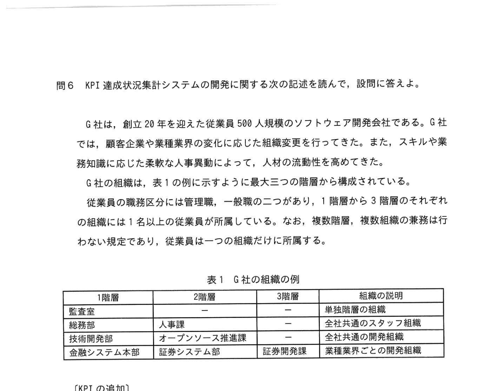
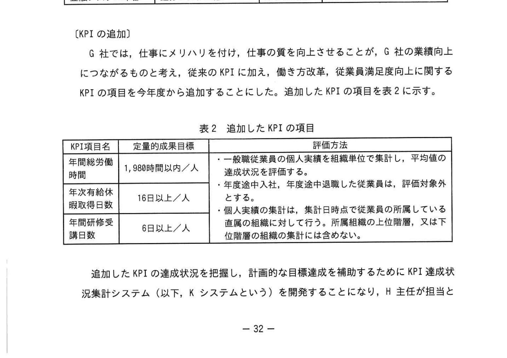
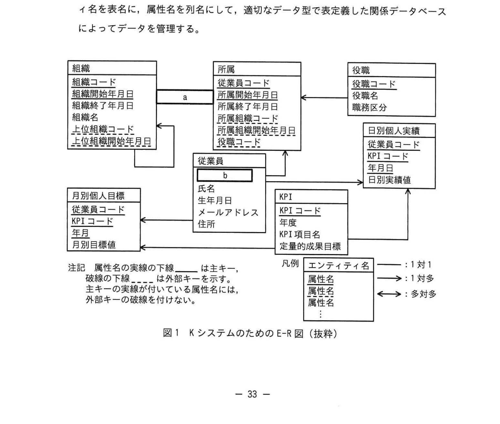
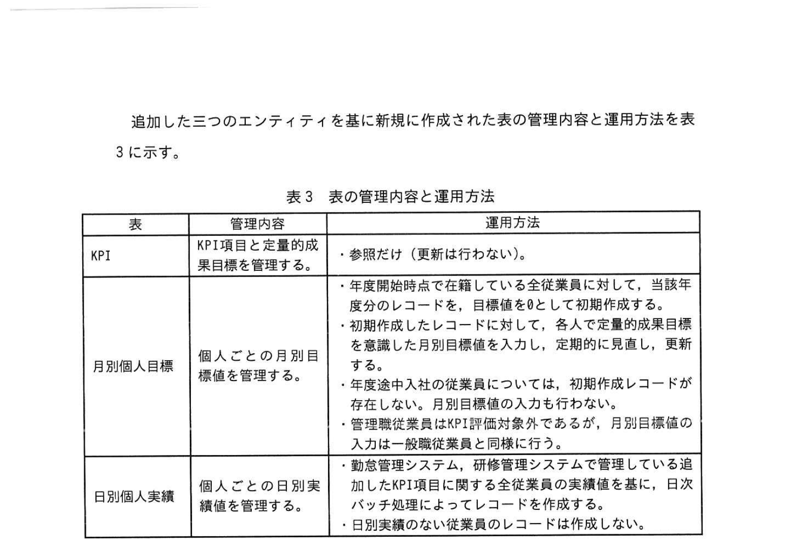
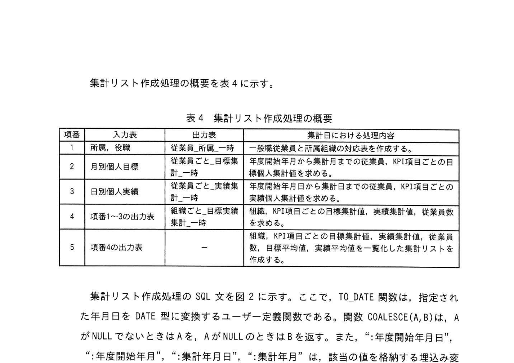
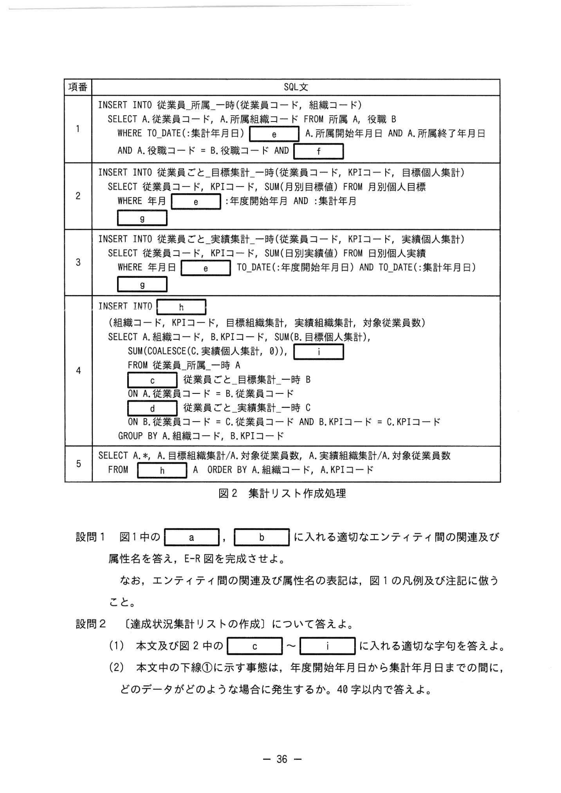

# 2023年春期（令和5年度春期）応用情報技術者試験 午後 問6（選択）
## データベース：KPI達成状況集計システム（INNER/LEFT OUTER JOIN）

---

## 問題文

**問6** KPI達成状況集計システムの開発に関する次の記述を読んで、設問に答えよ。

G社は、創立20年を迎えた従業員500人規模のソフトウェア開発会社である。G社では、顧客企業や業種業界の変化に応じた組織変更を行ってきた。また、スキルや業務知識に応じた柔軟な人事異動によって、人材の流動性を高めている。

G社の組織は、表1の例に示すように最大三つの階層から構成されている。

### 表1 G社の組織の例



> | 1階層 | 2階層 | 3階層 | 組織の説明 |
> |-------|-------|-------|-----------|
> | 総務部 | 人事課 | — | 特定業務の組織 |
> | 技術開発部 | オープンソース推進課 | — | 全社共通のスタッフ組織 |
> | 命令システム本部 | 証券券部 | 証券券発券グループ | 収益業務に関わる組織 |

各従業員は、組織及び所属に関する開始年月日と終了年月日を保有している。組織終了年月日が将来に及ぶまたはNULLの場合はその時点で在籍していることを示す。

---

### 〔KPIの追加〕

G社では、仕事にメリハリを付け、仕事の質を向上させることが、G社の業績向上につながるものと考え、従来のKPIに加え、働き方改革に関するKPIを今年度から追加することにした。追加したKPIの項目を表2に示す。

### 表2 追加したKPIの項目



> | KPI項目名 | 定量的成果目標 | 評価方法 |
> |-----------|--------------|---------|
> | 年間総労働時間 | 1,980時間以内/人 | 一般職従業員の個人実績を全組織委集計し、当月末分のKPI値の状況を評価する |
> | 年次有給休暇取得日数 | 16日以上/人 | ・初作成では全ての対象従業員の目標値を確定した上で、以後は年始(1月)の年次月別個人目標に入力し、定期的に見直し、更新する。・年度途中の入社は退職員の場合はこのレコードは作成しない |
> | 年間研修受講日数 | 6日以上/人 | ・勤怠管理システム・研修管理システムで管理している適適合日次バッチ処理に続けて、日次バッチ処理によって、処理結果を一時表に出力して後処理に連携する |

追加したKPIの達成状況を把握し、計画的な目標達成を補助するためにKPI達成状況集計システム（以下、Kシステムという）を開発することになり、H主任が担当となった。

---

### 〔データベースの設計〕

G社は、組織変更と人事異動を管理するためのシステムを以前から運用している。H主任は、このシステムのためのE-R図を基に、KPIとその達成状況を把握するために、KPI・月別個人目標・及び日別個人実績の三つのエンティティを追加して、Kシステムのために作成することにした。

作成したE-R図（抜粋）を図1に示す。Kシステムでは、このE-Rのエンティティ名を表名に、属性名を列名にして、適切なデータ型で表記した関係データベースによってデータを管理する。

### 図1 KシステムのためのE-R図（抜粋）



> **エンティティ構成（抜粋）：**
> 
> **組織**：組織コード（PK）、所属開始年月日、組織終了年月日、組織名、上位組織コード、組織開始年月日、上位組織終了年月日、月別個人目標（FK: 従業員コード, 月別個人目標開始年月日）
> 
> **従業員**：従業員コード（PK）、所属開始年月日、所属組織コード、所属終了年月日、所属変更番号、氏名、生年月日、メールアドレス、住所、役職コード（FK）
> 
> **役職**：役職コード（PK）、役職名、職務区分
> 
> **KPI**：KPIコード（PK）、年度、KPI項目名、定量的成果目標
> 
> **月別個人目標**：従業員コード（PK/FK）、KPIコード（PK/FK）、年度（PK）、月（PK）、月別目標値
> 
> **日別個人実績**：従業員コード（PK/FK）、KPIコード（PK/FK）、年度（PK）、月（PK）、日（PK）、日別実績値
>
> 注記：属性名の下線\_\_はスーパーキー、破線の下線は外部キーを示す。スーパーキーのない実績表には、主キーに加えて外部キーを持っている。

---

### 〔表の管理内容と運用方法〕

追加した三つのエンティティを基に新規に作成された表の管理内容と運用方法を表3に示す。

### 表3 表の管理内容と運用方法



> | 表 | 管理内容 | 運用方法 |
> |----|----------|---------|
> | KPI | KPI項目と定量的成果の目標値を管理する | ・参照だけ（更新行なない） |
> | 月別個人目標 | 個人ごとの月別目標値を管理する | ・年度開始時に在籍している全従業員について、当月末分のレコードを目標値8として初作成する。・初作成では全ての対象従業員の目標値を確定した上で、以後は月別個人目標の入力により、定期的に見直し、更新する。・年度途中入社した従業員は、退職した従業員に関するレコードは作成しない |
> | 日別個人実績 | 個人ごとの日別実績を管理する | ・勤怠管理システム、研修管理システムで管理している実績値を日次バッチ処理によって、処理結果を一時表に出力して後処理に連携する方式で行うことにした。・日次実績のない従業員のレコードは作成しない |

組織、所属、従業員、及び役職の各表は、以前から運用しているシステムから継承したものである。組織表と所属表には、組織及び所属に関する開始年月日と終了年月日を含む。組織終了年月日が将来に及ぶ場合、値はNULLを設定する。

なお、組織表の「上位組織コード」「上位組織開始年月日」は、1階層組織ではNULL、2階層組織と3階層組織では1つ上位の組織の組織コードと組織開始年月日を設定する。また、役職表の「職務区分」の値は、管理職の場合に'01'、一般職の場合に'02'とする。

---

### 〔達成状況集計リストの作成〕

H主任は、各組織がKPI達成状況を評価するために、毎月末に達成状況集計リスト（以下、集計リストという）を提示することにした。

集計リストの作成は、オンライン停止時間帯の日次バッチ処理終了後の月次バッチ処理によって、処理結果を一時表に出力して後処理に連携する方式で行うことにした。

集計リスト作成処理の概要を表4に示す。

### 表4 集計リスト作成処理の概要



> | 項番 | 入力表 | 出力表 | 集計リストにおける処理内容 |
> |------|--------|--------|--------------------------|
> | 1 | 組織、従業員、所属 | 従業員ごと_所属一時 | 集計年月の年月日1日から年月日末日まで所属した全ての従業員を出力する |
> | 2 | 月別個人目標 | 従業員ごと_目標集計_一時 | 集計年月の年間開始月から集計年月末日までの全ての従業員のKPI項目ごとの目標を集計する |
> | 3 | 日別個人実績 | 従業員ごと_実績集計_一時 | 集計年月の年間開始月から集計年月末日まで当該従業員の全てのKPI項目の実績を集計する |
> | 4 | 項番1〜3の出力表 | 組織ごと_目標実績集計_一時 | 結果：KPI項目ごとの目標値集計、実績値集計、従業員数 |
> | 5 | 項番4の出力表 | 集計リスト | A.組織コード、A.目標組織集計数、A.対象従業員数、A.実績組織集計数、A.対象従業員数 |

集計リスト作成処理のSQL文を図2に示す。

### 図2 集計リスト作成処理



> ```sql
> -- 項番1：従業員ごと_所属_一時
> INSERT INTO 従業員ごと_所属_一時（従業員コード、組織コード、役職B）
>   SELECT A.従業員コード, A.所属組織コード, A.役職B
>   FROM 所属 A
>   WHERE TO_DATE(:集計年月日) [e] A.所属開始年月日 AND A.所属終了年月日
>   AND A.役職コード = B.役職コード AND [f]
> 
> -- 項番2：従業員ごと_目標集計_一時
> INSERT INTO 従業員ごと_目標集計_一時（従業員コード、KPIコード、目標個人集計）
>   SELECT 従業員コード, KPIコード, SUM(日別実績値) FROM 月別個人目標
>   WHERE 年月 [e] :年度開始年月 AND :集計年月
>   [g]
> 
> -- 項番3：従業員ごと_実績集計_一時
> INSERT INTO 従業員ごと_実績集計_一時（従業員コード、KPIコード、実績個人集計）
>   SELECT 従業員コード, KPIコード, SUM(日別実績値) FROM 日別個人実績
>   WHERE 年月 [e] :年度開始年月 AND :集計年月
>   [g]
> 
> -- 項番4：組織ごと_目標実績集計_一時
> INSERT INTO [h]（組織コード、KPIコード、目標組織集計、実績組織集計、対象従業員数）
>   SELECT A.組織コード, B.KPIコード, SUM(B.目標個人集計), SUM(C.実績個人集計), [i]
>   FROM 従業員ごと_所属_一時 A
>     [c] 従業員ごと_目標集計_一時 B ON A.従業員コード = B.従業員コード
>     [d] 従業員ごと_実績集計_一時 C ON B.従業員コード = C.従業員コード
>       AND B.KPIコード = C.KPIコード
>   GROUP BY A.組織コード, B.KPIコード
> 
> -- 項番5：集計リスト
> SELECT A.a, A.目標組織集計数, A.対象従業員数, A.実績組織集計数, A.対象従業員数
>   FROM [h] A
>   ORDER BY A.組織コード, A.KPIコード
> ```

---

## 設問

### 設問1 図1中の `[　a　]` と `[　b　]` に入れる適切なエンティティ間の関連及び属性名を答えよ。

なお、エンティティ間の関連及び属性名の表記は、図1の凡例及び注記に従うこと。

### 設問2 〔達成状況集計リストの作成〕について答えよ。

**(1)** 本文及び図2中の `[　c　]` ～ `[　i　]` に入れる適切な字句を答えよ。

**(2)** 本文中の下線①について、年度途中に入社した従業員でこのような状況が発生するのは、どのような場合か。40字以内で答えよ。

---

## 解答と解説

### 設問1

**(1) 正解：a = →（多対多）、b = 従業員コード**

E-R図のリレーションシップについて：
- **a**：月別個人目標と役職の関連は「→」（多対多または1対多の方向矢印）。KPIと月別個人目標の関連も多対多（→）。
- **b**：日別個人実績テーブルと月別個人目標テーブルを結ぶ外部キーは「従業員コード」。

---

### 設問2

**(1) 正解**

| 空欄 | 正解 | 解説 |
|------|------|------|
| **c** | INNER JOIN | 所属一時と目標集計一時の結合。目標がある従業員のみ対象のため内部結合 |
| **d** | LEFT OUTER JOIN | 目標集計一時と実績集計一時の結合。実績がない従業員のレコードもNULLで残すため左外部結合 |
| **e** | BETWEEN | 年月が年度開始年月〜集計年月の範囲内であることを条件とする |
| **f** | B.職務区分 = '02' | 一般職（職務区分'02'）の従業員のみを対象とする条件 |
| **g** | GROUP BY 従業員コード, KPIコード | 従業員・KPI項目ごとの目標値・実績値を集計するためのグループ化 |
| **h** | 組織ごと_目標実績集計_一時 | 項番4の出力先一時表 |
| **i** | COUNT(*) | 対象従業員数を集計する集合関数 |

**各空欄の詳細解説：**

**c = INNER JOIN**  
「従業員ごと_所属_一時」と「従業員ごと_目標集計_一時」を結合する際、月別個人目標がある従業員のみ（年度途中入社・退職者を除く）を対象とするため、INNER JOINを使用。

**d = LEFT OUTER JOIN**  
「従業員ごと_目標集計_一時」と「従業員ごと_実績集計_一時」の結合。実績データがない従業員（日次実績なしの場合、レコードが存在しない）でも目標値の集計行を残すためLEFT OUTER JOINを使用。実績値はNULLとなる。

**e = BETWEEN**  
年月が年度開始年月から集計年月までの範囲内であることを条件とする場合に`BETWEEN`を使用する（`BETWEEN :年度開始年月 AND :集計年月`）。

**f = B.職務区分 = '02'**  
役職表の職務区分が'02'（一般職）の従業員のみが集計対象となる。管理職('01')は除外。

**g = GROUP BY 従業員コード, KPIコード**  
従業員ごと・KPI項目ごとに目標値と実績値をSUMで集計するためのGROUP BY句。

**h = 組織ごと_目標実績集計_一時**  
項番4の処理は「組織ごと_目標実績集計_一時」に集計結果を格納する。

**i = COUNT(*)**  
組織・KPI項目ごとの対象従業員数を数える集合関数。

**(2) 正解：該当従業員のKPI項目に対する実績データが、1件も存在しない場合（30字）**

年度途中に入社した従業員は月別個人目標のレコードが作成されない（表3の運用方法）。目標値がないためINNER JOINで月別個人目標と結合する項番4のSQLに含まれず、集計対象外となる。これにより、実績があってもCOUNT(*)に含まれない場合が生じる。

日別個人実績の運用方法（表3）では「日次実績のない従業員のレコードは作成しない」ため、日別実績が0件の場合、一時表にレコードが存在しない。LEFT OUTER JOINによって実績がNULLになり、対象従業員カウントの扱いが問題になる。

---

## 参考：主要キーワード

| 用語 | 説明 |
|------|------|
| KPI（Key Performance Indicator） | 重要業績評価指標。目標達成度を測るための定量的な指標 |
| INNER JOIN | 内部結合。両方のテーブルに一致するレコードのみを返す |
| LEFT OUTER JOIN | 左外部結合。左テーブルの全レコードを残し、右テーブルに一致しない場合はNULLを返す |
| BETWEEN A AND B | A以上B以下の範囲条件を指定するSQL演算子 |
| GROUP BY | 指定した列でグループ化し、集合関数（SUM/COUNT等）を適用する |
| COUNT(*) | テーブルの行数を数える集合関数。NULL行も含む |
| SUM() | 数値列の合計を返す集合関数 |
| COALESCE(A, B) | AがNULLの場合にBを返す関数。NULLを0などに置換する際に使用 |
| 一時表 | 処理中間結果を格納する一時的なテーブル。バッチ処理で多用 |
| E-R図（Entity-Relationship Diagram） | エンティティ（表）とそのリレーションシップ（関連）を表す設計図 |
