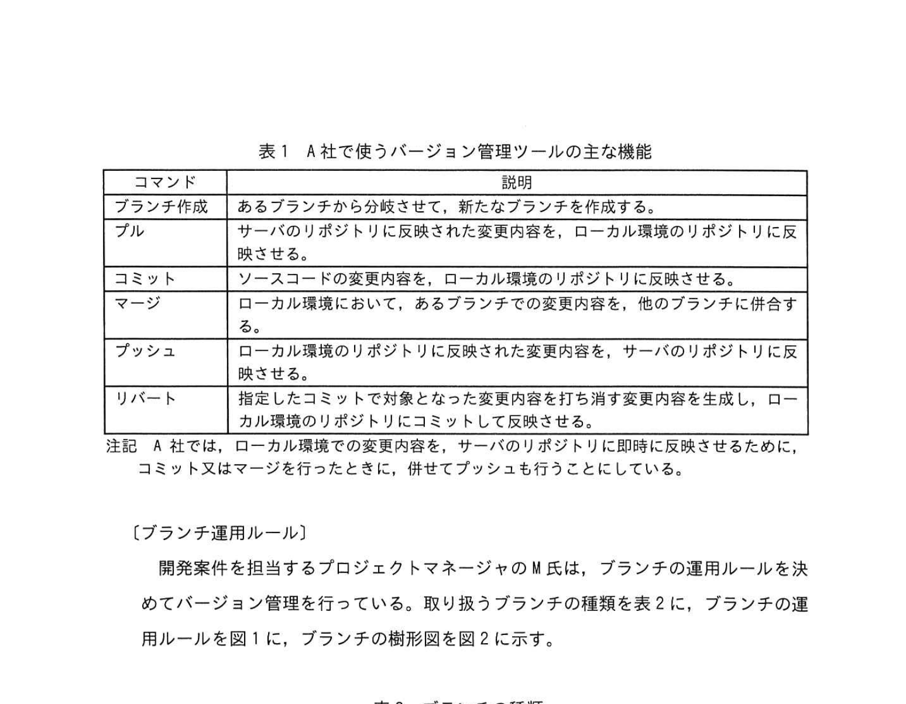
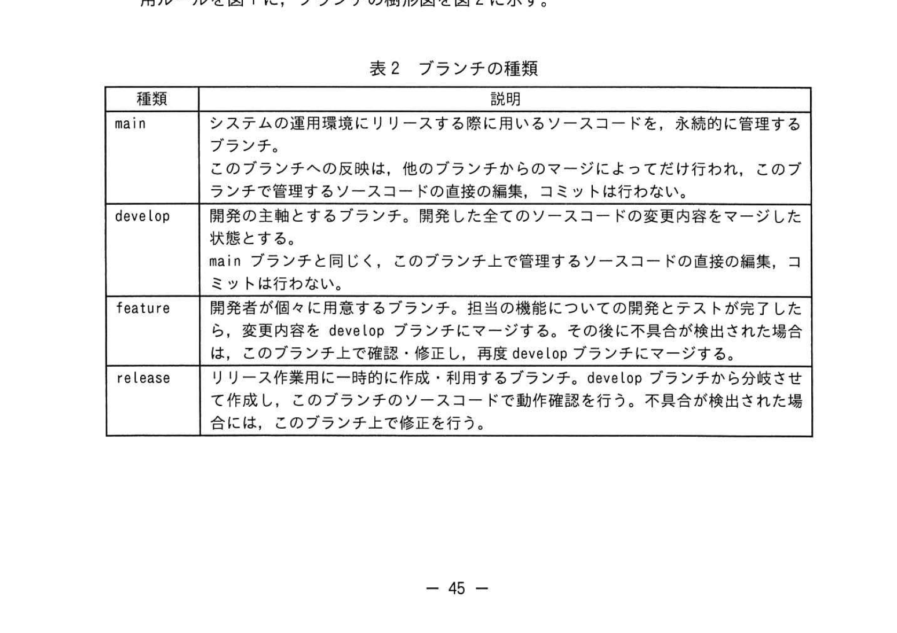
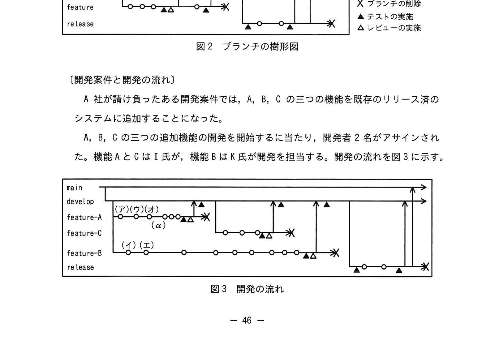
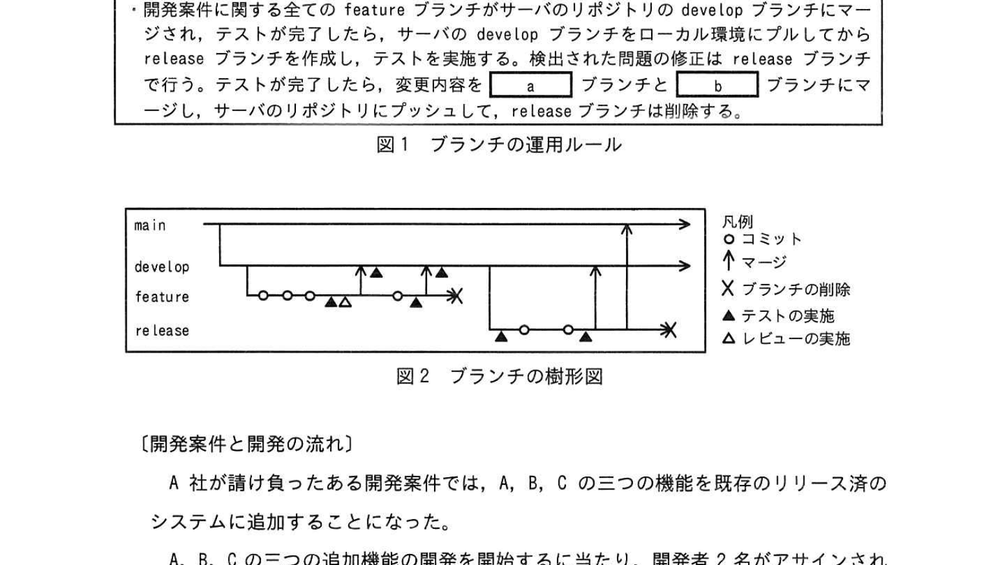
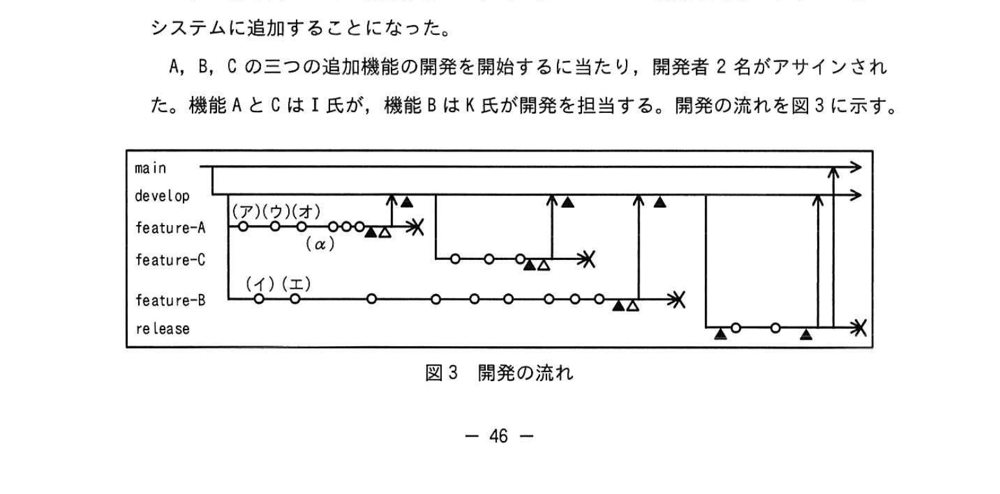

# 2023年春期（令和5年度春期）応用情報技術者試験 午後 問8（選択）
## 情報システム開発：バージョン管理ツールの運用（ブランチ運用ルール）

---

## 問題文

**問8** バージョン管理ツールの運用に関する次の記述を読んで、設問に答えよ。

A社は、業務システムの開発を行う企業で、システムの新規開発のほか、リリース後のシステムの運用保守や機能追加の案件も請け負っている。A社では、ソースコードの管理のために、バージョン管理ツールを利用している。

バージョン管理ツールには、1人の開発者がファイルの編集を開始するときにロックを獲得し、他者による編集を禁止する方式（以下、ロック方式という）と、編集は複数の開発者が任意のタイミングで行い、編集完了後に他者による編集内容とマージする方式（以下、コピー・マージ方式という）がある。また、バージョン管理ツールには、ある時点以降のソースコードの変更内容の履歴を分岐させて管理する機能がある。以降、分岐元、及び分岐して管理される、変更内容の履歴をブランチと呼ぶ。

ロック方式では、編集開始時にロックを獲得し、他者による編集を禁止する。編集終了時には変更内容をリポジトリに反映し、ロックを解除する。ロック方式では、一つのファイルを同時に1人しか編集できないので、複数の開発者で開発する際に変更箇所の競合が発生しない一方、①**開発者間で作業の待ちが発生してしまう場合がある**。

A社では、規模の大きな改修に複数人で取り組むことも多いので、コピー・マージ方式のバージョン管理ツールを採用している。A社で採用しているバージョン管理ツールでは、開発者は、社内に設置されているバージョン管理ツールのサーバ（以下、サーバという）のリポジトリの複製を、開発者のPC上のローカル環境のリポジトリとして取り込んで開発作業を行う。編集時にソースコードに施した変更内容は、ローカル環境のリポジトリに反映される。ローカル環境のリポジトリに反映された変更内容は、編集完了時にサーバのリポジトリに反映させる。サーバのリポジトリに反映された変更内容を、別の開発者が自分のローカル環境のリポジトリに取り込むことで、変更内容の開発者間での共有が可能となる。

コピー・マージ方式では、開発者間で作業の待ちが発生することはないが、他者の変更箇所と同一の箇所に変更を加えた場合には競合が発生する。その場合には、ソースコードの変更内容をサーバのリポジトリに反映させる際に、競合を解決する必要がある。競合の解決とは、同一箇所が変更されたソースコードについて、それぞれの変更内容を確認し、必要に応じてソースコードを修正することである。

A社で使うバージョン管理ツールの主な機能を表1に示す。

### 表1 A社で使うバージョン管理ツールの主な機能

> | コマンド | 説明 |
> |----------|------|
> | ブランチ作成 | あるブランチから分岐させて、新たなブランチを作成する。 |
> | プル | サーバのリポジトリに反映された変更内容を、ローカル環境のリポジトリに反映させる。 |
> | コミット | ソースコードの変更内容を、ローカル環境のリポジトリに反映させる。 |
> | マージ | ローカル環境において、あるブランチでの変更内容を、他のブランチに併合する。 |
> | プッシュ | ローカル環境のリポジトリに反映された変更内容を、サーバのリポジトリに反映させる。 |
> | リバート | 指定したコミットで対象となった変更内容を打ち消す変更内容を生成し、ローカル環境のリポジトリにコミットして反映させる。 |
>
> 注記：A社では、ローカル環境での変更内容を、サーバのリポジトリに即時に反映させるために、コミット又はマージを行ったときに、併せてプッシュも行うことにしている。

---

### 〔ブランチ運用ルール〕

開発案件を担当するプロジェクトマネージャのM氏は、ブランチの運用ルールを決めてバージョン管理を行っている。取り扱うブランチの種類を表2に、ブランチの運用ルールを図1に、ブランチの樹形図を図2に示す。

### 表2 ブランチの種類

> | 種類 | 説明 |
> |------|------|
> | main | システムの運用環境にリリースする際に用いるソースコードを、永続的に管理するブランチ。 このブランチへの反映は、他のブランチからのマージによってだけ行われ、このブランチで管理するソースコードの直接の編集、コミットは行わない。 |
> | develop | 開発の主軸とするブランチ。開発した全てのソースコードの変更内容をマージした状態とする。 mainブランチと同じく、このブランチ上で管理するソースコードの直接の編集、コミットは行わない。 |
> | feature | 開発者が個々に用意するブランチ。担当の機能についての開発とテストが完了したら、変更内容をdevelopブランチにマージする。その後に不具合が検出された場合は、このブランチ上で確認・修正し、再度developブランチにマージする。 |
> | release | リリース作業用に一時的に作成・利用するブランチ。developブランチから分岐させて作成し、このブランチのソースコードで動作確認を行う。不具合が検出された場合には、このブランチ上で修正を行う。 |

### 図1 ブランチの運用ルール

> - 開発案件開始時に、mainブランチからdevelopブランチを作成し、サーバのリポジトリに反映させる。
> - 開発者は、サーバのリポジトリの複製をローカル環境に取り込み、ローカル環境でdevelopブランチからfeatureブランチを作成する。ブランチ名は任意である。
> - featureブランチで機能の開発が終了したら、開発者自身がローカル環境でテストを実施する。
> - 開発したプログラムについてレビューを実施し、問題がなければfeatureブランチの変更内容をローカル環境のdevelopブランチにマージしてサーバのリポジトリにプッシュする。
> - サーバのdevelopブランチのソースコードでテストを実施する。問題が検出されたら、ローカル環境のfeatureブランチで修正し、変更内容をdevelopブランチに再度マージしサーバのリポジトリにプッシュする。テスト完了後、featureブランチは削除する。
> - 開発案件に関する全てのfeatureブランチがサーバのリポジトリのdevelopブランチにマージされ、テストが完了したら、サーバのdevelopブランチをローカル環境にプルしてからreleaseブランチを作成し、テストを実施する。検出された問題の修正はreleaseブランチで行う。テストが完了したら、変更内容を `[　a　]` ブランチと `[　b　]` ブランチにマージし、サーバのリポジトリにプッシュして、releaseブランチは削除する。

### 図2 ブランチの樹形図

> ブランチ（上から）：main、develop、feature、release
>
> - developはmainから分岐。featureはdevelopから分岐し、コミット（○）を重ね、テスト（▲）・レビュー（△）の後にdevelopへマージ（↑）し、削除（✕）される。
> - releaseはdevelopから分岐し、テスト（▲）・コミット（○）の後、main及びdevelopへマージ（↑）し、削除（✕）される。
>
> 凡例：○コミット、↑マージ、✕ブランチの削除、▲テストの実施、△レビューの実施

---

### 〔開発案件と開発の流れ〕

A社が請け負ったある開発案件では、A、B、Cの三つの機能を既存のリリース済のシステムに追加することになった。

A、B、Cの三つの追加機能の開発を開始するに当たり、開発者2名がアサインされた。機能AとCはI氏が、機能BはK氏が開発を担当する。開発の流れを図3に示す。

### 図3 開発の流れ

> ブランチ（上から）：main、develop、feature-A、feature-C、feature-B、release
>
> - **feature-A**（I氏）：コミット（ア）（ウ）（オ）…（α）のタイミングを経て、テスト（▲）・レビュー（△）の後にdevelopへマージし、削除。
> - **feature-C**（I氏）：feature-Aの後に開発。コミットを重ね、テスト・レビューの後developへマージし、削除。
> - **feature-B**（K氏）：コミット（イ）（エ）…と長期間開発。テスト・レビューの後developへマージし、削除。
> - **release**：全featureのマージ後、developから分岐。テスト（▲）・コミット（○）の後、main及びdevelopへマージし、削除。
>
> 凡例：○コミット、↑マージ、✕ブランチの削除、▲テストの実施、△レビューの実施

I氏は、機能Aの開発のために、ローカル環境で `[　a　]` ブランチからfeature-Aブランチを作成し開発を開始した。I氏は、機能Aについて(ア)、(ウ)、(オ)の3回のコミットを行ったところで、(ウ)でコミットした変更内容では問題があることに気が付いた。そこでI氏は、(α)のタイミングで、②**(ア)のコミットの直後の状態に滞りなく戻すための作業**を行い、編集をやり直すことにした。プログラムに必要な修正を加えた上で `[　c　]` した後、③**テストを実施**し、問題がないことを確認した。その後、レビューを実施し、 `[　a　]` ブランチにマージした。

機能Bは機能Aと同時に開発を開始したが、規模が大きく、開発の完了は機能A、Cの開発完了後になった。K氏は、機能Bについてのテストとレビューの後、ローカル環境上の `[　a　]` ブランチにマージし、サーバのリポジトリにプッシュしようとしたところ、競合が発生した。サーバのリポジトリから `[　a　]` ブランチをプルし、その内容を確認して競合を解決した。その後、ローカル環境上の `[　a　]` ブランチを、サーバのリポジトリにプッシュしてからテストを実施し、問題がないことを確認した。

全ての変更内容をdevelopブランチに反映後、releaseブランチをdevelopブランチから作成して④**テストを実施**した。テストで検出された不具合を修正し、releaseブランチにコミットした後、再度テストを実施し、問題がないことを確認した。修正内容を `[　a　]` ブランチと `[　b　]` ブランチにマージし、 `[　b　]` ブランチの内容でシステムの運用環境を更新した。

---

### 〔運用ルールについての考察〕

feature-Bブランチのように、ブランチ作成からマージまでが長いと、サーバのリポジトリ上のdevelopブランチとの差が広がり、競合が発生しやすくなる。そこで、レビュー完了後のマージで競合が発生しにくくするために、随時、サーバのリポジトリからdevelopブランチをプルした上で、⑤**ある操作**を行うことを運用ルールに追加した。

---

## 設問

### 設問1

本文中の下線①について、他の開発者による何の操作を待つ必要が発生するのか。10字以内で答えよ。

### 設問2

図1及び本文中の `[　a　]` ～ `[　c　]` に入れる適切な字句を答えよ。

### 設問3

本文中の下線②で行った作業の内容を、表1中のコマンド名と図3中の字句を用いて40字以内で具体的に答えよ。

### 設問4

本文中の下線③、④について、実施するテストの種類を、それぞれ解答群の中から選び記号で答えよ。

**解答群：**
- ア 開発機能と関連する別の機能とのインタフェースを確認する結合テスト
- イ 開発機能の範囲に関する、ユーザーによる受入れテスト
- ウ プログラムの変更箇所が意図どおりに動作するかを確認する単体テスト
- エ 変更箇所以外も含めたシステム全体のリグレッションテスト

### 設問5

本文中の下線⑤について、追加した運用ルールで行う操作は何か。表2の種類を用いて、40字以内で答えよ。

---

## 解答と解説

### 設問1 正解：ロックの解除

ロック方式では、あるファイルを編集中の開発者がロックを保持しているため、同じファイルを編集したい他の開発者は、そのロックが解除されるまで作業を待つ必要がある。コピー・マージ方式にはこの制約がない。

---

### 設問2

| 空欄 | 正解 | 解説 |
|------|------|------|
| **a** | develop | feature-Aブランチはdevelopブランチから作成し、マージ先もdevelopブランチ。releaseもdevelopへマージする |
| **b** | main | releaseブランチの変更内容はmainとdevelopにマージし、mainブランチの内容で運用環境を更新する |
| **c** | コミット | 修正後にローカル環境のリポジトリへ変更内容を反映させるコマンドはコミット |

---

### 設問3 正解：(オ)のコミットをリバートし、次に(ウ)のコミットをリバートする。（33字）

「(ア)のコミットの直後の状態に戻す」とは、(ア)より後に行った(ウ)と(オ)のコミットを打ち消すことを意味する。リバートは指定したコミットの変更内容を打ち消す変更を生成するコマンドなので、時系列の逆順に適用する必要がある。直近の(オ)のコミットをリバートし、次に(ウ)のコミットをリバートすることで、(ア)直後の状態に戻せる。

---

### 設問4

| 下線 | 正解 | 解説 |
|------|------|------|
| **下線③** | ウ（単体テスト） | featureブランチ上での、開発者自身による開発機能のテスト。変更箇所が意図どおりに動作するかを確認する単体テスト |
| **下線④** | エ（リグレッションテスト） | releaseブランチでの、リリース前のシステム全体の検証。変更箇所以外も含めたリグレッションテスト |

---

### 設問5 正解：developブランチの内容をfeatureブランチにマージする。（28字）

developブランチの最新状態をfeatureブランチにマージして取り込むことで、featureブランチとdevelopブランチの差分を小さく保てる。これにより、後のfeature→developへのマージ時の競合発生を抑えられる。

---

## 参考：主要キーワード

| 用語 | 説明 |
|------|------|
| バージョン管理ツール | ソースコードの変更履歴を管理するツール。ブランチ管理・マージが可能 |
| ロック方式 | 編集開始時にロックを獲得し、他者の編集を禁止する方式 |
| コピー・マージ方式 | 複数人が任意のタイミングで編集し、後でマージする方式 |
| ブランチ | ソースコードの変更内容の履歴を分岐させて管理する仕組み |
| コミット | ローカルリポジトリに変更内容を反映する操作 |
| プッシュ | ローカルリポジトリの変更をサーバのリポジトリに反映する操作 |
| プル | サーバのリポジトリの変更をローカルリポジトリに反映する操作 |
| マージ | あるブランチの変更内容を別のブランチに併合する操作 |
| リバート | 指定コミットの変更を打ち消す新たなコミットを生成する操作 |
| 競合（コンフリクト） | 複数人が同一箇所を変更した際に発生するマージ衝突 |
| リグレッションテスト | 変更によって既存機能が壊れていないかを確認する回帰テスト |
