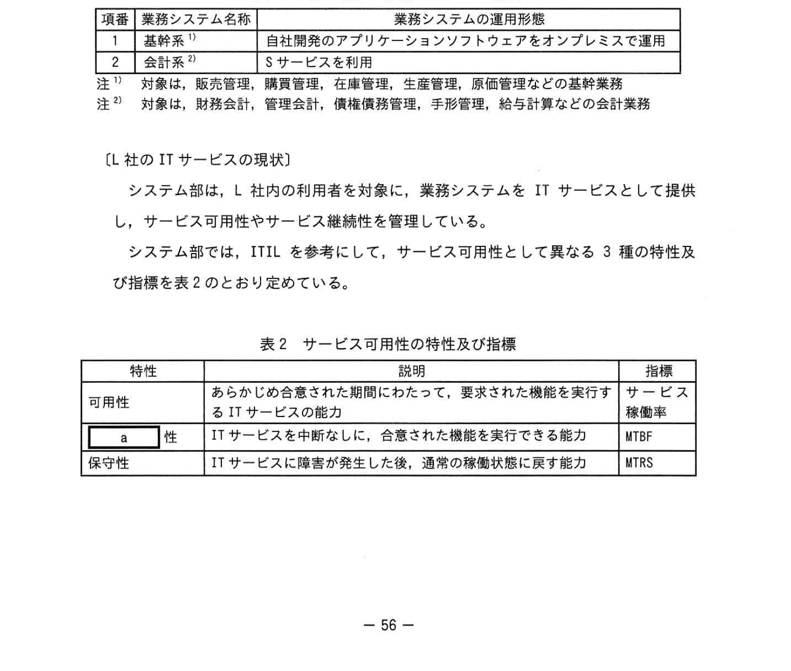
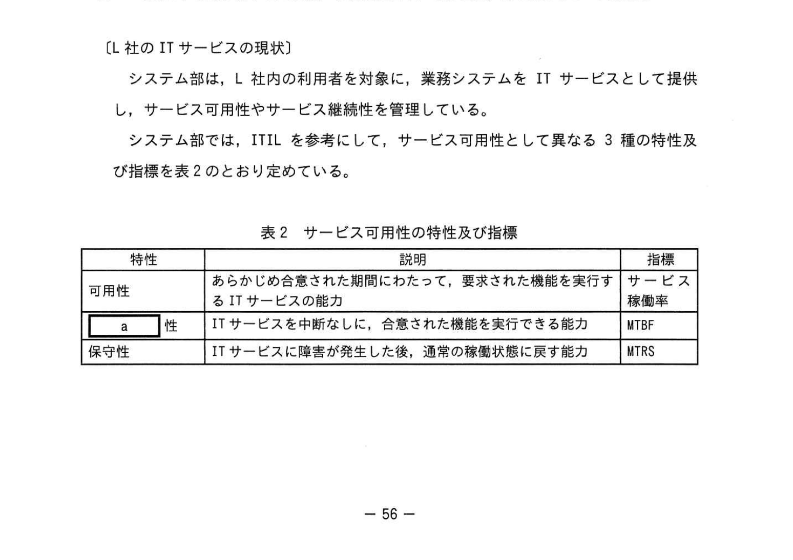
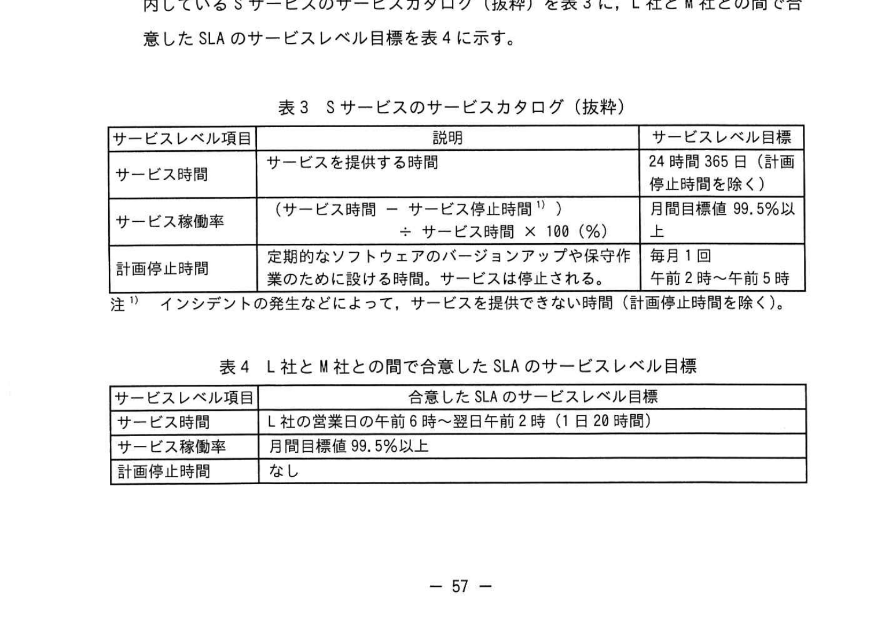
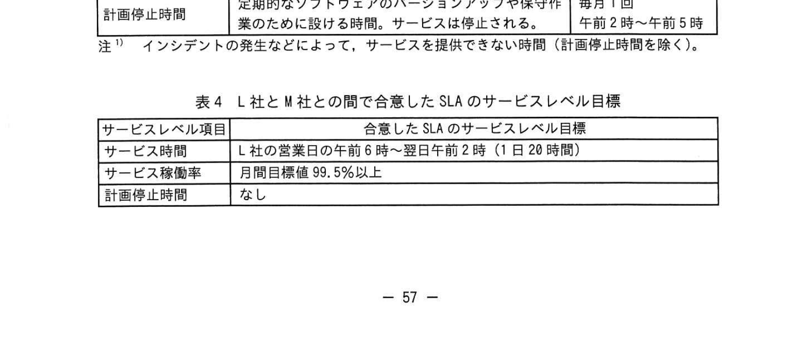

# 2023年春期（令和5年度春期）応用情報技術者試験 午後 問10（選択）
## サービスマネジメント：クラウドサービスのサービス可用性管理

---

## 問題文

**問10** クラウドサービスのサービス可用性管理に関する次の記述を読んで、設問に答えよ。

L社は、大手の自動車部品製造販売会社である。2023年4月現在、全国に八つの製造拠点をもち、L社の製造部は、昼勤と夜勤の2交替制で部品を製造している。L社の経理部は、基本的に昼勤で経理業務を行っている。L社のシステム部では、基幹系業務システムを、L社本社の設備を使って、オンプレミスで運用している。また、会計系業務システムは、2023年1月に、オンプレミスでの運用からクラウド事業者M社の提供するSaaS（以下、Sサービスという）に移行した。L社の現在の業務システムの概要を表1に示す。

### 表1 L社の現在の業務システムの概要

> | 項番 | 業務システム名称 | 業務システムの運用形態 |
> |------|--------------|----------------------|
> | 1 | 基幹系 注1) | 自社開発のアプリケーションソフトウェアをオンプレミスで運用 |
> | 2 | 会計系 注2) | Sサービスを利用 |
>
> 注1) 対象は、販売管理、購買管理、在庫管理、生産管理、原価管理などの基幹業務
> 注2) 対象は、財務会計、管理会計、債権債務管理、手形管理、給与計算などの会計業務

---

### 〔L社のITサービスの現状〕

システム部は、L社内の利用者を対象に、業務システムをITサービスとして提供し、サービス可用性やサービス継続性を管理している。

システム部では、ITILを参考にして、サービス可用性として異なる3種の特性及び指標を表2のとおり定めている。

### 表2 サービス可用性の特性及び指標

> | 特性 | 説明 | 指標 |
> |------|------|------|
> | 可用性 | あらかじめ合意された期間にわたって、要求された機能を実行するITサービスの能力 | サービス稼働率 |
> | `[　a　]`性 | ITサービスを中断なしに、合意された機能を実行できる能力 | MTBF |
> | 保守性 | ITサービスに障害が発生した後、通常の稼働状態に戻す能力 | MTRS |

基幹系業務のITサービスは、生産管理など事業が成功を収めるために不可欠な重要事業機能を支援しており、高可用性の確保が必要である。基幹系業務システムでは、L社本社建屋内にシステムを2系統用意してあり、本番系システムのサーバの故障や定期保守などの場合は、予備系のサーバに切り替えてITサービスの提供を継続できるシステム構成を採っている。また、ストレージに保存されているユーザーデータファイルがマルウェアによって破壊されるリスクに備え、定期的にユーザーデータファイルのフルバックアップを磁気テープに取得している。バックアップを取得する磁気テープは2組で、1組は本社建屋内に保存し、もう1組は災害に対する脆弱性を考える必要があるので、遠隔地に保管している。

---

### 〔Sサービスのサービス可用性〕

システム部のX氏は、会計系業務システムにSサービスを利用する検討を行った際、M社のサービスカタログを基にサービス可用性に関する調査を行い、その後、L社とM社との間でSLAに合意し、2023年1月からSサービスの利用を開始した。M社が案内しているSサービスのサービスカタログ（抜粋）を表3に、L社とM社との間で合意したSLAのサービスレベル目標を表4に示す。

### 表3 Sサービスのサービスカタログ（抜粋）

> | サービスレベル項目 | 説明 | サービスレベル目標 |
> |------------------|------|-------------------|
> | サービス時間 | サービスを提供する時間 | 24時間365日（計画停止時間を除く） |
> | サービス稼働率 | （サービス時間 − サービス停止時間 注1)）÷ サービス時間 × 100（%） | 月間目標値99.5%以上 |
> | 計画停止時間 | 定期的なソフトウェアのバージョンアップや保守作業のために設ける時間。サービスは停止される。 | 毎月1回 午前2時〜午前5時 |
>
> 注1) インシデントの発生などによって、サービスを提供できない時間（計画停止時間を除く）。

### 表4 L社とM社との間で合意したSLAのサービスレベル目標

> | サービスレベル項目 | 合意したSLAのサービスレベル目標 |
> |------------------|-------------------------------|
> | サービス時間 | L社の営業日の午前6時〜翌日午前2時（1日20時間） |
> | サービス稼働率 | 月間目標値99.5%以上 |
> | 計画停止時間 | なし |

2023年1月は、Sサービスでインシデントが発生してサービス停止した日が3日あったが、サービス停止の時間帯は3日とも表4のサービス時間の外だった。よって、表4のサービス稼働率は100%である。仮に、サービス停止の時間帯が3日とも表4のサービス時間の内の場合、サービス停止の月間合計時間が `[　b　]` 分以下であれば、表4のサービス稼働率のサービスレベル目標を達成する。ここで、1月のL社の営業日の日数を30とする。

3月は、表4のサービス時間の内にSサービスでインシデントが発生した日が1日あった。復旧作業に時間が掛かったので、表4のサービス時間の内で90分間サービス停止した。3月のL社の営業日の日数を30とすると、サービス稼働率は99.75%となり、3月も表4のサービスレベル目標を達成した。しかし、このインシデントは月末繁忙期の日中に発生したので、L社の取引先への支払業務に支障を来した。

X氏は、サービス停止しないことはもちろんだが、サービス停止した場合に迅速に対応して回復させることも重要だと考えた。そこで、X氏はM社の責に帰するインシデントが発生してサービス停止したときの①**サービスレベル項目**を表4に追加できないか、M社と調整することにした。

また、今後、経理部では、勤務時間を製造部に合わせて、交替制で夜勤を行う勤務体制を採って経理業務を行うことで、業務のスピードアップを図ることを計画している。この場合、会計系業務システムのサービス時間を見直す必要がある。そこで、X氏は、表4のサービスレベル目標の見直しが必要と考え、表3のサービスカタログを念頭に、②**経理部との調整**を開始することにした。

---

### 〔基幹系業務システムのクラウドサービス移行〕

2023年1月に、L社はBCPの検討を開始し、システム部は地震が発生して基幹系業務システムが被災した場合でもサービスを継続できるようにする対策が必要になった。X氏が担当になって、クラウドサービスを利用してBCPを実現する検討を開始した。

X氏は、まずM社が提供するパブリッククラウドのIaaS（以下、Iサービスという）を調査した。Iサービスのサービスカタログでは、サービスレベル項目としてサービス時間及びサービス稼働率の二つが挙げられていて、サービスレベル目標は、それぞれ24時間365日及び月間目標値99.99%以上になっていた。Iサービスでは、物理サーバ、ストレージシステム、ネットワーク機器などのIT基盤のコンポーネント（以下、物理基盤という）は、それぞれが冗長化されて可用性の対策が採られている。また、ハイパーバイザー型の仮想化ソフト（以下、仮想化基盤という）を使って、1台の物理サーバで複数の仮想マシン環境を実現している。

次に、X氏は、Iサービスを利用した災害対策サービスについて、M社に確認した。災害対策サービスの概要は次のとおりである。

- M社のデータセンター（DC）は、同時に被災しないように東日本と西日本に一つずつある。通常時は、L社向けのIサービスは東日本のDCでサービスを運営する。東日本が被災して東日本のDCが使用できなくなった場合は、西日本のDCでIサービスが継続される。
- 西日本のDCのIサービスにもユーザーデータファイルを保存し、東日本のDCのIサービスのユーザーデータファイルと常時同期させる。東日本のDCの仮想マシン環境のシステムイメージは、システム変更の都度、西日本のDCにバックアップを保管しておく。

M社の説明を受け、X氏は次のように考えた。

- 地震や台風といった広範囲に影響を及ぼす自然災害に対して有効である。
- 災害対策だけでなく、物理サーバに機器障害が発生した場合でも業務を継続できる。
- 西日本のDCのIサービスのユーザーデータファイルは、東日本のDCのIサービスのユーザーデータファイルと常時同期しているので、現在行っているユーザーデータファイルのバックアップの遠隔地保管を廃止できる。

X氏は、上司にM社の災害対策サービスを採用することで効果的にサービス可用性を高められる旨を報告した。しかし、上司から、③**X氏の考えの中には見直すべき点がある**と指摘されたので、X氏は修正した。

さらに、上司はX氏に、M社に一任せずに、M社と協議して実質的な改善を継続していくことが重要だと話した。そこで、X氏は、サービス可用性管理として、サービスカタログに記載されているサービスレベル項目のほかに、④**可用性に関するKPI**を設定することにした。また、基幹系業務システムの災害対策を実現するに当たって、コストの予算化が必要になる。X氏は、災害時のサービス可用性確保の観点でサービス継続性を確保するコストは必要だが、コストの上昇を抑えるために災害時に基幹系業務システムを一部縮退できないか検討した。そして、事業の視点から捉えた機能ごとの⑤**判断基準**に基づいて継続する機能を決める必要があると考えた。

---

## 設問

### 設問1 〔L社のITサービスの現状〕について答えよ。

**(1)** 表2中のMTBF及びMTRSについて、適切なものを解答群の中から選び、記号で答えよ。

**解答群：**
- ア MTBFの値は大きい方が、MTRSの値は小さい方が望ましい。
- イ MTBFの値は大きい方が、MTRSの値も大きい方が望ましい。
- ウ MTBFの値は小さい方が、MTRSの値は大きい方が望ましい。
- エ MTBFの値は小さい方が、MTRSの値も小さい方が望ましい。

**(2)** 表2中の `[　a　]` に入れる適切な字句を、5字以内で答えよ。

### 設問2 〔Sサービスのサービス可用性〕について答えよ。

**(1)** 本文中の `[　b　]` に入れる適切な数値を答えよ。なお、計算結果で小数が発生する場合、答えは小数第1位を四捨五入して整数で求めよ。

**(2)** 本文中の下線①について、X氏は、M社の責に帰するインシデントが発生してサービス停止したときのサービスレベル項目を追加することにした。追加するサービスレベル項目の内容を20字以内で答えよ。

**(3)** 本文中の下線②について、経理部と調整すべきことを、30字以内で答えよ。

### 設問3 〔基幹系業務システムのクラウドサービス移行〕について答えよ。

**(1)** Iサービスを使ってL社が基幹系業務システムを運用する場合に、M社が構築して管理する範囲として適切なものを、解答群の中から全て選び、記号で答えよ。

**解答群：**
- ア アプリケーションソフトウェア
- イ 仮想化基盤
- ウ ゲストOS
- エ 物理基盤
- オ ミドルウェア

**(2)** 本文中の下線③について、上司が指摘したX氏の考えの中で見直すべき点を、25字以内で答えよ。

**(3)** 本文中の下線④について、クラウドサービスの可用性に関連するKPIとして適切なものを解答群の中から選び、記号で答えよ。

**解答群：**
- ア M社が提供するサービスのサービス故障数
- イ M社起因のインシデントの問題を解決する変更の件数
- ウ M社のDCで実施した災害を想定した復旧テストの回数
- エ M社のサービスデスクが回答した問合せ件数
- オ SLAのサービスレベル目標が達成できなかった原因のうち、ストレージ容量不足に起因する件数

**(4)** 本文中の下線⑤の判断基準とは何か。本文中の字句を用いて、15字以内で答えよ。

---

## 解答と解説

### 設問1

**(1) 正解：ア（MTBFの値は大きい方が、MTRSの値は小さい方が望ましい）**

- **MTBF（Mean Time Between Failures）**：平均故障間隔。値が大きいほど障害が発生しにくく、信頼性が高い＝望ましい。
- **MTRS（Mean Time to Restore Service）**：平均サービス回復時間。値が小さいほど素早く復旧でき、保守性が高い＝望ましい。

**(2) 正解：a = 信頼（2字）**

ITILにおけるサービス可用性の3特性は「可用性」「信頼性」「保守性」。中断なしにサービスを継続する能力が「信頼性（Reliability）」で、指標はMTBF。

---

### 設問2

**(1) 正解：b = 180（分）**

- 表4のサービス時間：1日20時間（午前6時〜翌日午前2時）
- 1か月（30営業日）のサービス時間：20時間 × 30日 = 600時間 = 36,000分
- サービス稼働率99.5%以上を達成する許容停止時間：36,000分 ×（1 − 0.995）= 36,000 × 0.005 = **180分**

したがって、サービス停止の月間合計時間が180分以下であれば目標を達成する。

**(2) 正解：サービス回復までの最大時間（13字）**

サービス停止した場合に迅速に回復させることを重視するため、インシデント発生からサービス回復までの最大時間（MTRSに相当する回復時間の上限）をサービスレベル項目として追加する。

**(3) 正解：計画停止時間を考慮して経理部の勤務時間を定めること（26字）**

経理部が夜勤を含む交替制になると、Sサービスの計画停止時間（毎月1回、午前2時〜5時）と経理業務時間が重なるおそれがある。そこで、計画停止時間を考慮して経理部の勤務時間帯を定めることを調整する必要がある。

---

### 設問3

**(1) 正解：イ（仮想化基盤）、エ（物理基盤）**

IaaS（Infrastructure as a Service）では、物理基盤（物理サーバ・ストレージ・ネットワーク等）とその上の仮想化基盤（ハイパーバイザー）までをクラウドベンダーが構築・管理する。ゲストOS・ミドルウェア・アプリケーションソフトウェアは利用者（L社）が管理する。よってM社が管理する範囲は**物理基盤（エ）**と**仮想化基盤（イ）**。

**(2) 正解：バックアップの遠隔地保管を廃止すること（18字）**

X氏は、東西DC間でユーザーデータファイルを常時同期しているので磁気テープの遠隔地保管を廃止できると考えた。しかし、遠隔地保管はマルウェアによるデータ破壊への備えでもあり、DC間同期では同期先も破壊が波及し得るため、遠隔地保管の廃止は見直すべき点である。

**(3) 正解：ア（M社が提供するサービスのサービス故障数）**

可用性に関連するKPIは、サービスの故障の発生状況を測る指標が適切である。よって「M社が提供するサービスのサービス故障数（ア）」が該当する。イ（変更件数）・ウ（復旧テスト回数）・エ（問合せ件数）・オ（ストレージ容量不足起因の件数）は可用性のKPIとして不適。

**(4) 正解：重要事業機能の支援度合い（12字）**

災害時に基幹系業務システムを一部縮退する際、継続する機能は、事業の視点から捉えた機能ごとの「重要事業機能の支援度合い」を判断基準として決める。

---

## 参考：主要キーワード

| 用語 | 説明 |
|------|------|
| サービス可用性（Availability） | 合意された期間にわたってサービスを提供できる能力。指標はサービス稼働率 |
| 信頼性（Reliability） | 中断なしにサービスを継続提供できる能力。指標はMTBF |
| 保守性（Maintainability） | 障害発生後に通常状態に戻す能力。指標はMTRS |
| MTBF（Mean Time Between Failures） | 平均故障間隔。値が大きいほど信頼性が高い |
| MTRS（Mean Time to Restore Service） | 平均サービス回復時間。値が小さいほど保守性が高い |
| SLA（Service Level Agreement） | サービス提供者と利用者の間で合意するサービスレベルの取り決め |
| SaaS（Software as a Service） | アプリケーションをクラウドで提供するサービス形態 |
| IaaS（Infrastructure as a Service） | インフラをクラウドで提供するサービス形態 |
| BCP（Business Continuity Plan） | 事業継続計画。災害時でも重要業務を継続するための計画 |
| 計画停止時間 | メンテナンスのために予定されたサービス停止時間。サービス稼働率の算定から除外される |
