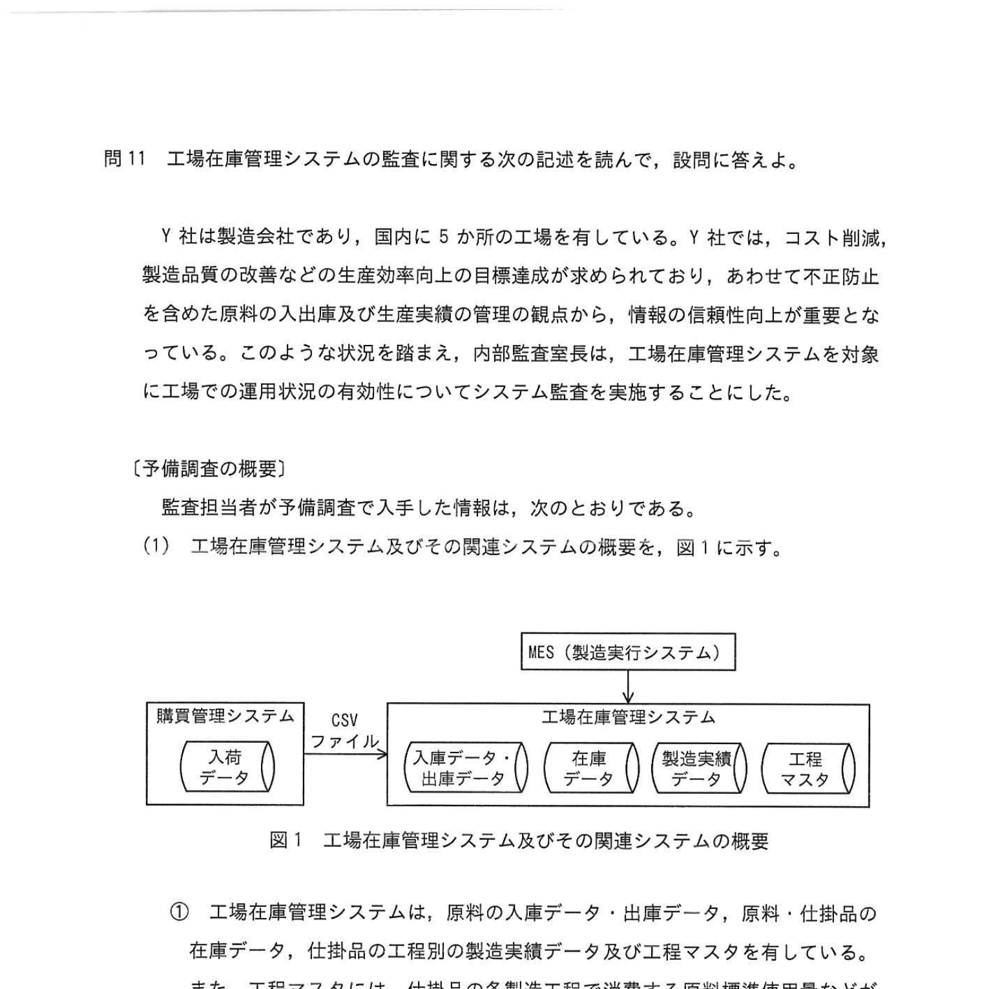
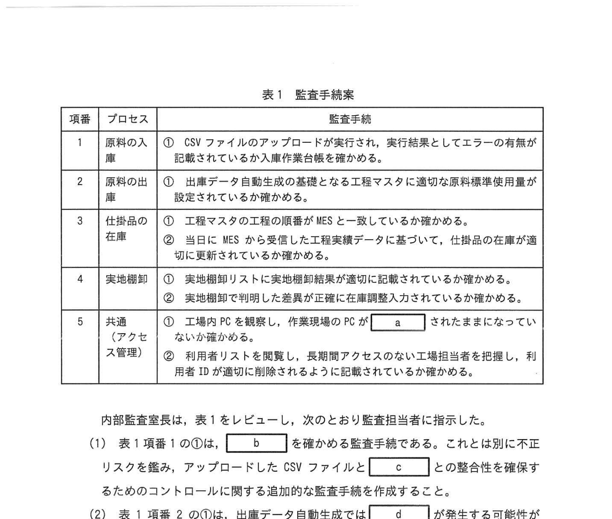

# 2023年春期（令和5年度春期）応用情報技術者試験 午後 問11（選択）
## システム監査：工場在庫管理システムの監査（不正リスク評価）

---

## 問題文

**問11** 工場在庫管理システムの監査に関する次の記述を読んで、設問に答えよ。

Y社は製造会社であり、国内に5か所の工場を有している。Y社では、コスト削減、製造品質の改善などの生産効率向上の目標達成が求められており、あわせて不正防止を含めた原料の入出庫及び生産廃棄の管理観点から、情報の信頼性向上が重要となっている。このような状況を踏まえ、内部監査室は、工場在庫管理システムを対象に工場での運用状況の有効性についてシステム監査を実施することにした。

---

### 〔予備調査の概要〕

監査担当者が予備調査で入手した情報は、次のとおりである。

**(1)** 工場在庫管理システム及びその関連システムの概要を、図1に示す。

### 図1 工場在庫管理システム及びその関連システムの概要

> **購買管理システム** → CSVファイル → **工場在庫管理システム**  
> 入荷データ → 入庫データ・出庫データ → 製造実績データ → 工程マスタ  
> MES（製造実行システム）も連携  
>  
> ① 工場在庫管理システムは、原料の入庫データ・出庫データ、仕掛品の在庫データ、仕掛品の各工程別の製造実績データ及び工程マスタを有している。また、工程マスタには、仕掛品の各製造工程で消費する原料標準使用量などが登録されている。
>
> ② 原料の入庫データは、購買管理データから入手する。また、製造実績データは、製造工程を制御・管理している MES の工程実績データから入手する。
>
> ③ 工程マスタ、入庫データ・出庫データなどの入力権限は、工場在庫管理システムの個人別の利用者IDとパスワードで制御している。過去の内部監査においても、工場の作業現場のPCが利用後もログインされたまま、複数の工場担当者が利用していたことが指摘されていた。
>
> ④ 工場在庫管理システムの開発・運用業務は、本社のシステム部が行っている。

**(2)** 工場在庫管理システムに関するプロセスの概要は、次のとおりである。

① 工場担当者が購買管理システムの当日の入荷データをCSVファイルにダウンロードし、仕訳と内容を確認して工場在庫管理システムにアップロードすると、入庫データの生成及び在庫データの更新が行われる。工場担当者は、作業実施結果が記録されているか及び入庫数にエラーがある場合を入力作業後に確認する。また、仕掛品データの生成処理は、工場在庫管理システムの出庫データを基に行われる。

② 製造で消費された原料の出庫データは、製造実績データ及び工程マスタの原料標準使用量に基づいて自動生成（以下、出庫データ自動生成という）される。このため、実際の消費量は工場在庫管理システムに入力する必要はない。また、工程マスタは、目標生産効率を考慮して、適宜、見直しされる。

③ 工場担当者が実地棚卸を年次で行い、工場在庫管理システムのデータに基づいて日次の棚卸バッチ処理で、製造実績データ及び仕在庫データが更新される。

④ 工場では、実地棚卸リストで、保管場所・在庫種別ごとに在庫データから実績データを抽出し、実地棚卸リストを出力する。工場担当者は、実地棚卸リストに基づいて実地棚卸を実施し、差異がある場合には工場在庫管理システムに棚卸調整入力を行う。この入力に基づいて、原料の出庫データ及び原料・仕掛品の在庫データの更新が行われる。

⑤ 工場では、工場在庫管理システムから利用者ID、利用者名、権限、ID登録日、最終利用日などの情報を年次で行う次の年次定期確認を実施する。この確認結果として、不要な利用者IDが発見された場合は、利用者IDが削除されるように利用者リストに追記する。

---

### 〔監査手続の作成〕

監査担当者が作成した監査手続案を表1に示す。

### 表1 監査手続案

> | 項番 | プロセス | 監査手続 |
> |------|----------|---------|
> | 1 | 原料の入庫 | ① CSVファイルのアップロードが実行され、実行結果としてエラーの有無が記録されているか及び入荷CSVファイルと `[　c　]` の整合性を確保するためのコントロールに関する追加的な監査手続を作成すること。 |
> | 2 | 原料の出庫 | ① 出庫データ自動生成の基となる工程マスタに適切な原料標準使用量が設定されているかを確認する。②当日にMESから受信した工程実績データに基づいて、仕掛品の在庫が適切に記録されているかを確認する。 |
> | 3 | 仕掛品の在庫 | ① 工程マスタの元の工程の正確さが高いのか、設定される工程マスタの妥当性についての確認をすること。 `[　d　]` が発生する工程マスタの妥当性についての確認をすること。 |
> | 4 | 実地棚卸 | ①実地棚卸リストに実地棚卸結果が正確に記録されているか確認する。②当日に明細された指示として、 `[　f　]` に記載された `[　g　]` の照合を適切に確認する監査手続を作成すること。 |
> | 5 | 共通（アクセス管理） | ①工場内のPCを観察し、共有端末のPCが `[　a　]` されていないことを確認する。②利用者リストを照会し、最後尾アクセスのない利用者を抽出し、利用者リストに `[　h　]` を利用してアクセスしている利用者も検出するための追加的な監査手続を作成すること。 |

内部監査室長は、表1をレビューし、次のとおり監査担当者に指摘した。

(1) 表1項番1の①は、 `[　b　]` を確かめる監査手続である。これとは別に不正リスクを踏み、アップロードしたCSVファイルと `[　c　]` の整合性を確保するためのコントロールに関する追加的な監査手続を作成すること。

(2) 表1項番2の①は、出庫データ自動生成の基となる工程マスタに適切な原料標準使用量が設定されているかを確認する。 `[　d　]` が発生する工程マスタの妥当性についての確認をすること。今回の監査目的を超えることを踏まえて実施の要否を検討すること。

(3) 表1項番3の②は、 `[　e　]` を確かめる監査手続なので、今回の監査目的を踏まえて実施の要否を検討すること。

(4) 表1項番4の①には、 `[　f　]` に記載された `[　g　]` の照合性が確かめられているかについても確認する必要がある。

(5) 表1項番4の②には、在庫の差異に基づいた棚卸調整入力が、 `[　g　]` に従在庫管理システムのデータに基づいて適切に行われているかを確認する手続を追加すること。

(6) 表1項番5の①は、不要な利用者IDだけでなく、 `[　h　]` を利用してアクセスしている利用者も検出するための追加的な監査手続を作成すること。

---

## 設問

### 設問1 〔監査手続の作成〕の `[　a　]` に入れる適切な字句を5字以内で答えよ。

### 設問2 〔監査手続の作成〕の `[　b　]`、`[　c　]` に入れる最も適切な字句の組み合わせを解答群の中から選び、記号で答えよ。

**解答群：**

| | b | c |
|--|--|--|
| ア | 自動処理の正確性・網羅性 | 工場在庫管理システムの在庫データ |
| イ | 自動処理の正確性・網羅性 | 工場在庫管理システムの入荷データ |
| ウ | 自動処理の正確性・網羅性 | 購買管理システムの入荷データ |
| エ | 手作業の正確性・網羅性 | 工場在庫管理システムの在庫データ |
| オ | 手作業の正確性・網羅性 | 工場在庫管理システムの入荷データ |
| カ | 手作業の正確性・網羅性 | 購買管理システムの入荷データ |

### 設問3 〔監査手続の作成〕の `[　d　]` に入れる最も適切な字句を解答群の中から選び、記号で答えよ。

**解答群：**
- ア 工程間違い
- イ 在庫の差異
- ウ 製造実績の差異
- エ 入庫の差異

### 設問4 〔監査手続の作成〕の `[　e　]` に入れる最も適切な字句を解答群の中から選び、記号で答えよ。

**解答群：**
- ア 自動化統制
- イ 全社統制
- ウ 手作業統制
- エ モニタリング

### 設問5 〔監査手続の作成〕の `[　f　]` ～ `[　h　]` に入れる適切な字句を、それぞれ10字以内で答えよ。

---

## 解答と解説

### 設問1 正解：a = ログイン（4字）

工場の作業現場のPCが利用後もログインされたまま複数の担当者が使用していた（予備調査③）。「ログイン」状態のままになっていないことを確認する監査手続が必要。正確には「ログインしたまま放置」していないことの確認。

---

### 設問2 正解：カ（b = 手作業の正確性・網羅性、c = 購買管理システムの入荷データ）

- **b = 手作業の正確性・網羅性**：CSVファイルのダウンロード、確認、アップロードは工場担当者が手動で行う作業（プロセス①）。自動処理ではなく手作業の正確性・網羅性を確かめる手続。
- **c = 購買管理システムの入荷データ**：CSVファイルは購買管理システムからダウンロードしたもの。アップロードしたCSVファイルの整合性を確認する対象は、元データである購買管理システムの入荷データ。

---

### 設問3 正解：d = イ（在庫の差異）

出庫データは原料標準使用量に基づいて自動生成される。実際の消費量と標準使用量が異なると、在庫の差異（実際在庫と帳簿在庫の乖離）が発生する。工程マスタの妥当性確認で確かめるべきリスクは「在庫の差異」。

---

### 設問4 正解：e = ア（自動化統制）

MESからの工程実績データに基づく出庫データ自動生成は、システムが自動的に処理する「自動化統制」。出庫データが自動生成されることで仕掛品の在庫が自動更新される仕組みの確認。

---

### 設問5

| 空欄 | 正解 | 解説 |
|------|------|------|
| **f** | 実地棚卸リスト | 実地棚卸の基礎となるリスト。保管場所・在庫種別ごとに在庫データから出力される |
| **g** | 在庫データ | 実地棚卸リストと照合する対象は工場在庫管理システムの在庫データ |
| **h** | 他人の利用者ID | 他人のIDでアクセスしている不正利用を検出するための監査手続 |

**詳細解説：**

- **f（実地棚卸リスト）**：実地棚卸の際に保管場所・在庫種別ごとに出力されるリスト。棚卸調整入力の根拠となる。
- **g（在庫データ）**：実地棚卸リストに記載された在庫データとの照合確認が必要。
- **h（他人の利用者ID）**：過去の監査で「複数担当者が同一PCを共用」が指摘されており、他人のIDでログインしている不正アクセスのリスクに対応する手続が必要。

---

## 参考：主要キーワード

| 用語 | 説明 |
|------|------|
| システム監査 | 情報システムの信頼性・安全性・効率性を第三者が評価する活動 |
| 内部監査 | 組織内部の監査部門が実施する監査。業務プロセスの有効性を評価 |
| 自動化統制 | システムが自動的に処理・制御するコントロール（入力チェック・自動計算等） |
| 手作業統制 | 人間が手動で実施するコントロール（承認・照合・確認等） |
| 不正リスク | 意図的な不正行為（横領・改ざん等）が発生するリスク |
| 実地棚卸 | 実際に在庫を数えて帳簿と照合する棚卸手続 |
| 棚卸調整 | 実地棚卸での差異を帳簿に反映させる処理 |
| 利用者ID管理 | 不要なIDの削除・共用ID禁止等、アクセス権を適切に管理すること |
| MES（Manufacturing Execution System） | 製造実行システム。生産工程を制御・管理するシステム |
| 工程マスタ | 各製造工程で消費する原料の標準使用量等を登録したマスタデータ |
