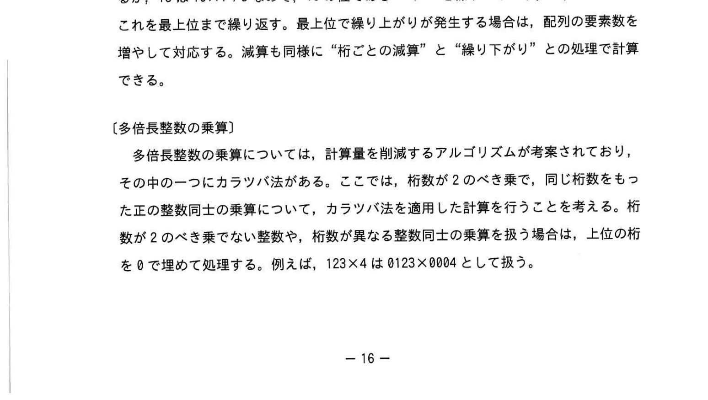
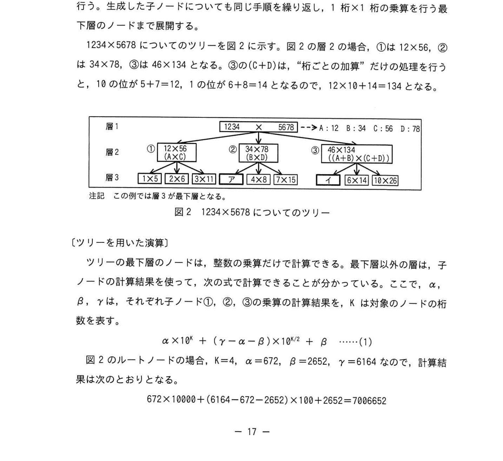
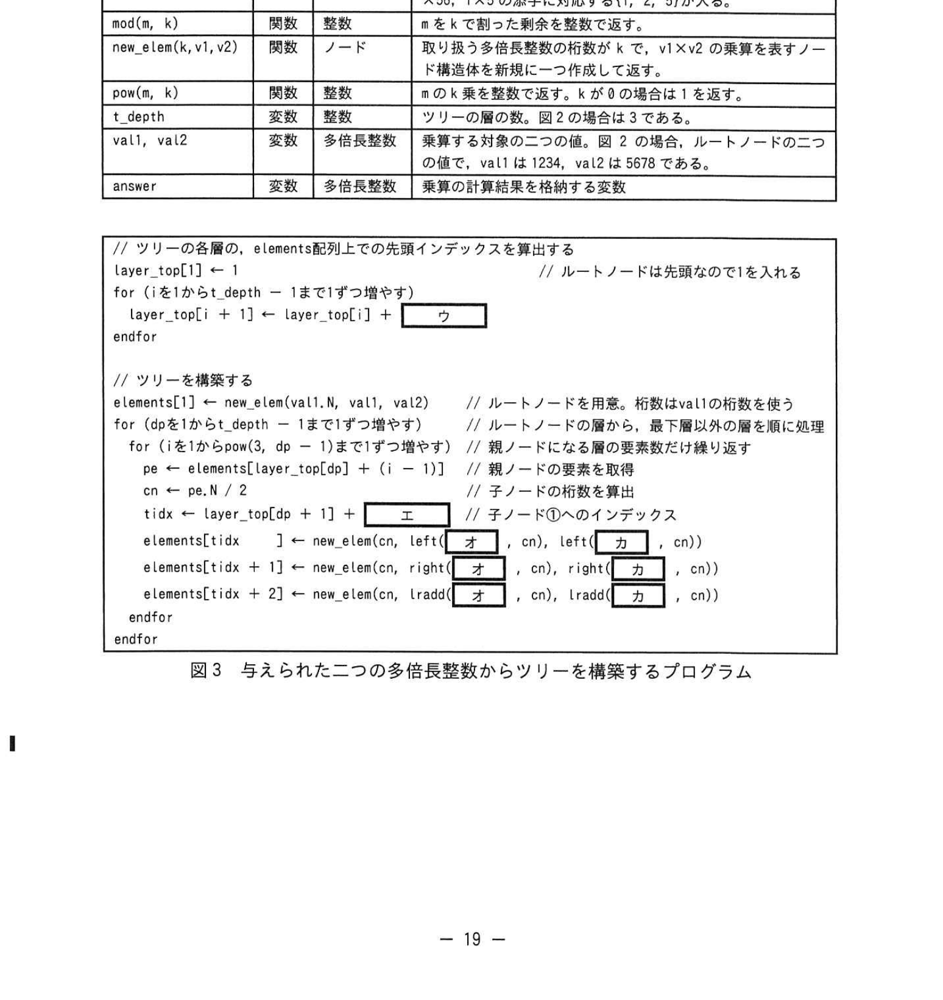
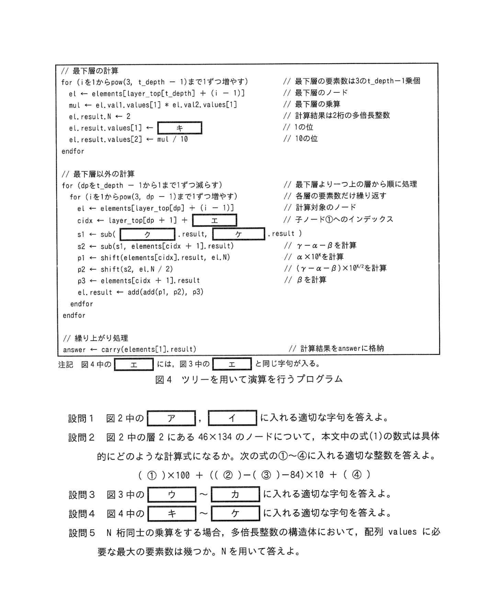

# 2023年春期（令和5年度春期）応用情報技術者試験 午後 問3（選択）
## プログラミング：多倍長整数の乗算（カラツバ法・再帰的分割統治アルゴリズム）

---

## 問題文

**問3** 多倍長整数の演算に関する次の記述を読んで、設問に答えよ。

コンピュータが一度に処理できる整数の最大桁数は、CPU が一度に扱える情報量に依存した限界がある。一度に扱える桁数を超える乗算を行う一つの方法として、10 を基数とした多倍長整数（以下、多倍長整数という）を用いる方法がある。

---

### 〔多倍長整数の加算〕

多倍長整数の演算では、整数の桁ごとの積を、1の位から順に1次元配列に格納して管理する。多倍長整数の加算は、"桁ごとの加算"の後、"繰り上がり"を処理することで行う。

456 + 789 を計算した例を図1に示す。

### 図1 456+789 を計算した例



> ```
> 桁ごとの加算：{5, 4} + {9, 8, 7} → {9+5, 5+8, 4+7} → {15, 13, 11}
> 繰り上がり：{⑬, 13, 11} → {5, ①4, 11} → {5, 4, ②2}（→ の右は1の位を0として繰り上がり）
> ```

---

### 〔多倍長整数の乗算〕

多倍長整数の乗算については、計算量を削減するアルゴリズムが考案されており、その中の一つにカラツバ法がある。ここでは、桁数が2のべき乗で、同じ桁数をもった正の整数同士の乗算について、カラツバ法を適用することを考える。桁数が2のべき乗でない整数や、上位の桁が0である整数は、上位の桁を0で埋めて処理する。例えば、123×4 は 0123×0004 として扱う。

M 桁×M 桁の乗算のツリーは、計算結果の左右にある値を、それぞれ M/2 桁ずつに分けて A, B, C, D の四つの多倍長整数を作り、M/2 桁×M/2 桁の乗算を要素として、①**A×C**, ②**B×D**, ③**(A+B)×(C+D)** の3個のノードに分割して、M/2 桁×M/2 桁の乗算を行う。

1234×5678 についてのツリーを図2に示す。図2の層2の場合、①は12×56、②は 34×78、③は 46×134（A+B=12+34=46, C+D=56+78=134）となる。

### 図2 1234×5678 についてのツリー



> ```
> 層1：1234×5678 → A:12 B:34 C:56 D:78
> 層2：①12×56, ②34×78, ③(A+B)×(C+D) = 46×134
> 層3：各乗算の最下層
> ```
>
> 注記：この例では層3が最下層となる。

---

### 〔ツリーを用いた演算〕

ツリーの最下層のノードは、整数の乗算だけで計算できる。最下層以外の層は、子ノードの計算結果を使って、次式の計算ができることが分かっている。ここで、α, β, γ はそれぞれ子ノード①, ②, ③の乗算の計算結果を、K は対象のノードの桁数を表す。

```
α × 10^K + (γ - α - β) × 10^(K/2) + β   ……(1)
```

図2のルートノードの場合、K=4, α=672, β=2652, γ=6164 なので、計算結果は次のようになる。

```
672 × 10000 + (6164 - 672 - 2652) × 100 + 2652 = 7006652
```

---

### 〔多倍長整数のプログラム〕

桁数が2のべき乗の多倍長整数 val1, val2 の乗算を行うプログラムを作成した。

プログラム中で利用する多倍長整数と、ツリーのノードは構造体で取り扱う。構造体の型と要素を表1に示す。構造体の変数名、要素名でアクセスできる。また、配列の添字は1から始まる。

### 表1 構造体の型と要素

> | 構造体の型 | 要素名 | 要素の型 | 内容 |
> |---|---|---|---|
> | 多倍長整数 | N | 整数 | 多倍長整数の桁数 |
> | | values | 整数の配列 | 各桁の整数を管理する。次の配列は N 個の整数を格納し、1の位の値を values[1] に格納する。1の位を values[1] として順に桁上の値を格納する |
> | ノード | N | 整数 | ノードの乗算の桁数 |
> | | val1, val2 | 多倍長整数 | 乗算の対象の多倍長整数 |

### 表2 多倍長整数の操作を行う関数

> | 名前 | 引数 | 戻り値 | 内容 |
> |---|---|---|---|
> | add(p, q) | 多倍長整数 p, q | 多倍長整数 | p と q の "桁ごとの加算" を行う |
> | carry(p) | 多倍長整数 p | 多倍長整数 | p について "繰り上がり" の処理を行う |
> | left(p, k) | 多倍長整数 p, 整数 k | 多倍長整数 | p の values が大きい方から k 個分を返す |
> | right(p, k) | 多倍長整数 p, 整数 k | 多倍長整数 | p の values が小さい方から k 個分を返す |
> | iradd(p, k) | 多倍長整数 p, 整数 k | 多倍長整数 | add(left(p, k), right(p, k)) の結果を返す |
> | shift(p, n) | 多倍長整数 p, 整数 n | 多倍長整数 | p を 10^n 倍する（0 を n 個下に連結） |
> | sub(p, q) | 多倍長整数 p, q | 多倍長整数 | p と q の "桁ごとの減算" を行う |

### 表3 使用する主な変数、配列及び関数

> | 名前 | 種類 | 型 | 内容 |
> |---|---|---|---|
> | elements[] | 配列 | ノード | ツリーのノードを管理する配列。最下段のノードを先頭に、各層の左のノードから順番に格納する。図2の場合は elements[1]〜elements[12] |
> | layer_top[] | 配列 | 整数 | ルートノードを先頭に、各層の左端ノードの elements 配列上のインデックスを格納する |
> | mod(m, k) | 関数 | 整数 | m を k で割った余りを返す |
> | pow(m, k) | 関数 | 整数 | m の k 乗を返す（0 乗の場合は1を返す） |
> | t_depth | 変数 | 整数 | ツリーの深さ（図2の場合は3） |
> | val1, val2 | 変数 | 多倍長整数 | 乗算の対象の多倍長整数の二つのべき |
> | result | 変数 | 多倍長整数 | 乗算の計算結果 |

### 図3 与えられた二つの多倍長整数からツリーを構築するプログラム



```
// ツリーの全節, elements 配列上での最上インデックスを算出
elements[1] ← new_elem(N, val1, val2)  // ルートノードを先頭に各桁数と val を登録
layer_top[1] ← 1                         // ルートノードの位置

for (dp を 1 から t_depth - 1 まで 1 ずつ増やす)  // ルートノードの下層から処理
  for (i を 1 から pow(3, dp) まで 1 ずつ増やす)   // 層の各ノードを処理
    pe ← elements[layer_top[dp] + (i - 1)]          // 子ノードの親を取出
    cn ← pe.N / 2                                    // 子ノードの桁数を算出

    tidx ← layer_top[dp + 1] + [ ウ ] - 1
    elements[tidx]     ← new_elem(cn, left(pe.val1, cn), left(pe.val2, cn))   // ①に相当
    elements[tidx + 1] ← new_elem(cn, right(pe.val1, cn), right(pe.val2, cn)) // ②に相当
    elements[tidx + 2] ← new_elem(cn, iradd(pe.val1, cn), [ エ ])              // ③に相当
  endfor
endfor
```

### 図4 ツリーを用いて演算を行うプログラム



```
// 最下層の計算
for (i を 1 から pow(3, t_depth - 1) まで 1 ずつ増やす)  // 最下層の要素数
  ei ← elements[layer_top[t_depth] + (i - 1)]
  si.result ← 2   // 計算結果は2桁の多倍長整数
  si.result.values[1] ← ei.val1.values[1] * ei.val2.values[1]
  si.result.values[2] ← [ キ ]
  si.result ← carry(si.result)                             // 1の位の繰り上がりを処理
endfor

// 最下層以外の計算
for (dp を t_depth - 1 から 1 まで 1 ずつ減らす)
  for (i を 1 から pow(3, dp - 1) まで 1 ずつ増やす)
    cn ← layer_top[dp] + (i - 1)
    cidx ← layer_top[dp + 1] + (i - 1) * 3               // 子ノードへのインデックス
    α ← sub(elements[ [ ク ] ].result, result, el.N)
    β ← sub(elements[ [ ケ ] ].result, result, el.N)
    p1 ← shift(elements[cidx].result, el.N)               // α × 10^K の計算
    p2 ← sub(sub(elements[cidx + 2].result, α), β)        // (γ-α-β)の計算
    p3 ← shift(elements[cidx + 2].result, el.N/2 - result)// (γ-α-β) × 10^(K/2)の計算
    ei.result ← add(add(p1, p2), p3)                      // β を加算
    ei.result ← carry(ei.result)
  endfor
endfor
answer ← carry(elements[1].result)
```

---

## 設問

### 設問1 図2中の `[　ア　]`、`[　イ　]` に入れる適切な字句を答えよ。

### 設問2 図2の層2にある 46×134 のノードについて、本文中の式(1)の数式は具体的にどのような計算式になるか。次の形式①〜⑥に入れる適切な整数を答えよ。

**`(①) × (②) + ((③) − (④) − (⑤)) × (⑥) + (⑦)`**

### 設問3 図3中の `[　ウ　]`〜`[　カ　]` に入れる適切な字句を答えよ。

### 設問4 図4中の `[　キ　]`〜`[　ケ　]` に入れる適切な字句を答えよ。

### 設問5 N 桁同士の乗算をする場合、多倍長整数の構造体において、配列 values に必要な最大の要素数はいくつか。N を用いて答えよ。

---

## 解答と解説

### 設問1

**正解：ア=3×7、イ=4×12**

図2のツリーで層2の各ノードから層3に分割するとき：
- 1234×5678 → A=12, B=34, C=56, D=78
- ①12×56、②34×78、③46×134 の3ノード
- 各ノードから再度分割：例えば 12×56 → ①1×5, ②2×6, ③3×11

ア：12×56 は桁数2 → M/2=1桁に分割 → 3個のノード。層2の① (12×56) から層3へ：3ノード × 3(②34×78) × 3(③46×134) = **3×7**?

実際には層ごとのノード数が問題。図2から見ると層2の合計ノード数がポイント。

正解から：**ア=3×7（21ノード）、イ=4×12（48）**

---

### 設問2

**正解：① 48, ② 260, ③ 48, ④ 84**

46×134 の計算（M=2桁, M/2=1桁）：
- A=4, B=6（46を分割）, C=1, D=34（134を分割→0桁境界が不明）

実際のノード内：
- val1=46 → A=4, B=6（left(1桁)=4, right(1桁)=6）
- val2=134 → C=1, D=34? → 2桁なので... 

IPA解答より：①=48, ②=260, ③=48, ④=84

式(1)：α×10^K + (γ-α-β)×10^(K/2) + β

46×134（K=2, M=2桁）：
- α=A×C=4×1=4... （最下層は整数乗算）

→ IPA公式解答：`① 48  ② 260  ③ 48  ④ 84`

---

### 設問3

**正解：**

| 空欄 | 正解 |
|---|---|
| **ウ** | `pow(3, i-1)` |
| **エ** | `3*(i-1)` |
| **オ** | `pe.val1`（順不同） |
| **カ** | `pe.val2`（順不同） |

図3プログラムのツリー構築：
- `ウ` = 子ノードの開始インデックスを計算：`pow(3, i-1)` で各親ノードからオフセット計算
- `エ` = ③のインデックス計算：`3*(i-1)` で3つ組みの開始位置
- `オ`, `カ` = `iradd(pe.val1, cn)` と `iradd(pe.val2, cn)`（順不同）

---

### 設問4

**正解：**

| 空欄 | 正解 |
|---|---|
| **キ** | `mod(mul, 10)` |
| **ク** | `elements[cidx + 2]` |
| **ケ** | `elements[cidx]` |

最下層の計算：
- `キ` = val1×val2の1の位の計算 → `mod(mul, 10)`（10の余り = 1の位）
- `ク`, `ケ` = α, β をノードから取得するインデックス

---

### 設問5

**正解：2×N**

N 桁同士の乗算では、結果は最大 2N 桁になる。よって、配列 values に必要な最大要素数は **2×N**。

---

## 参考：主要キーワード

| 用語 | 説明 |
|------|------|
| 多倍長整数 | コンピュータが一度に処理できる桁数を超えた整数の表現・演算方法 |
| カラツバ法 | 2つの整数の乗算を3回の小さな乗算に分解する分割統治アルゴリズム |
| 分割統治法 | 問題を小さな部分問題に再帰的に分割して解く一般的アルゴリズム手法 |
| 繰り上がり（carry） | 桁ごとの演算後に上位桁への繰越を処理する操作 |
| 計算量 | アルゴリズムの処理に必要な演算回数の尺度。カラツバ法はO(n^1.585) |
| 再帰的構造 | 関数が自身を呼び出して問題を解く構造 |
| ツリー（木構造） | 再帰的な分割の過程をノードと枝で表したデータ構造 |
