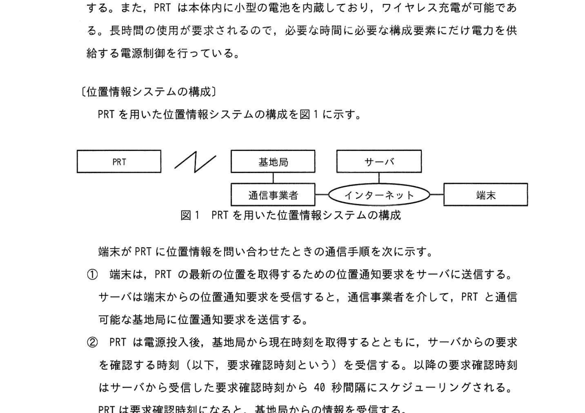
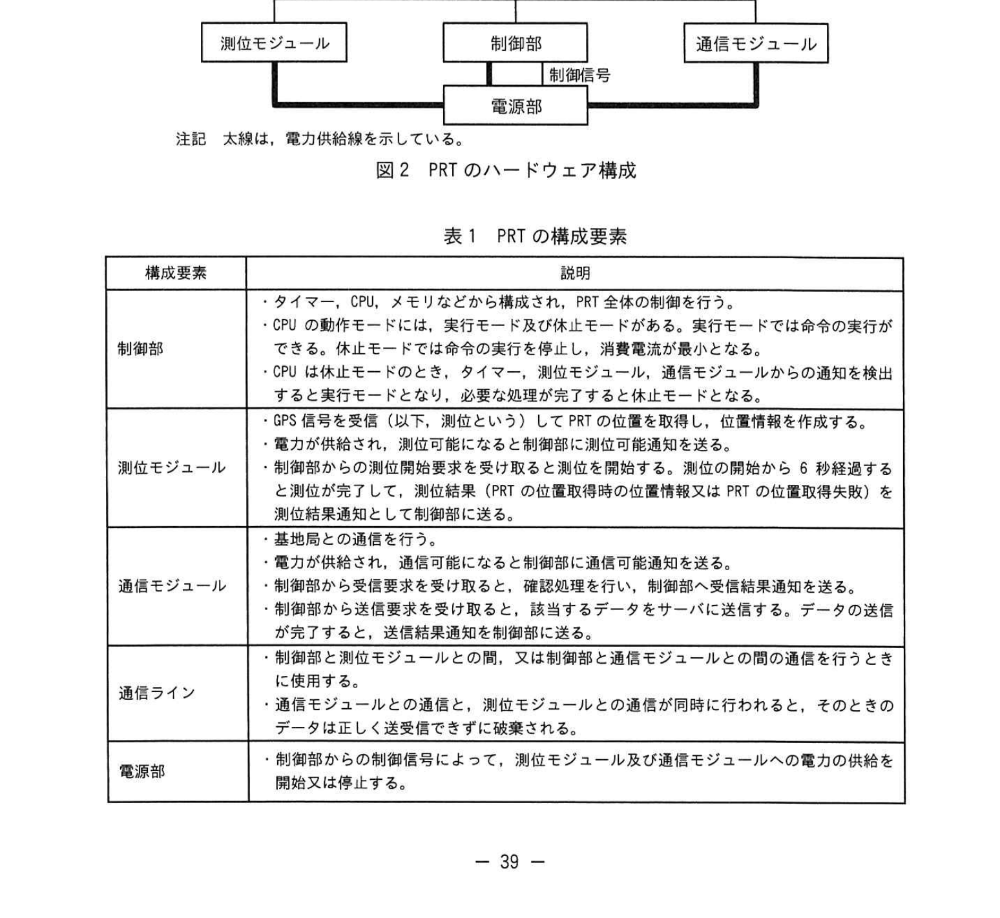
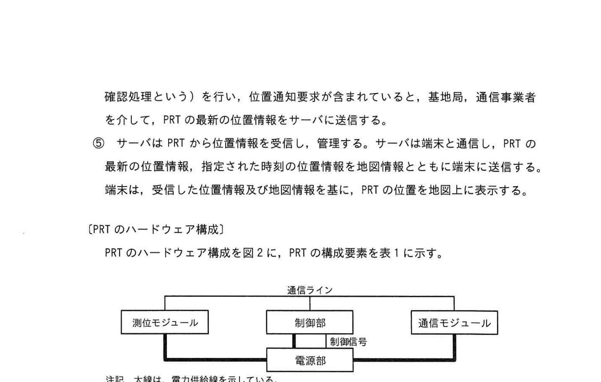
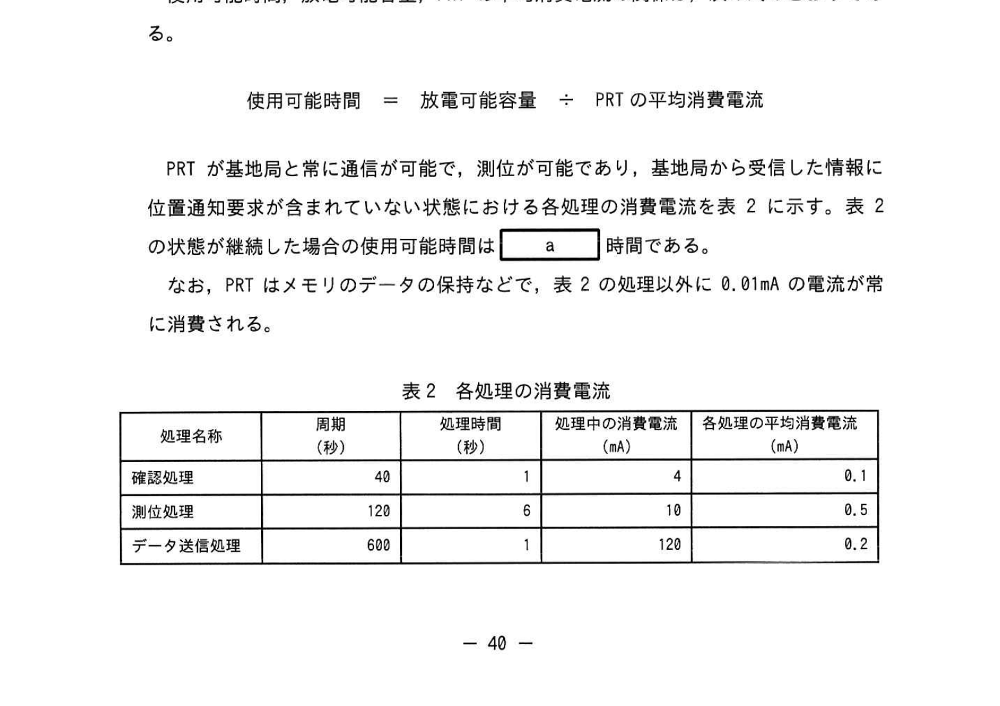
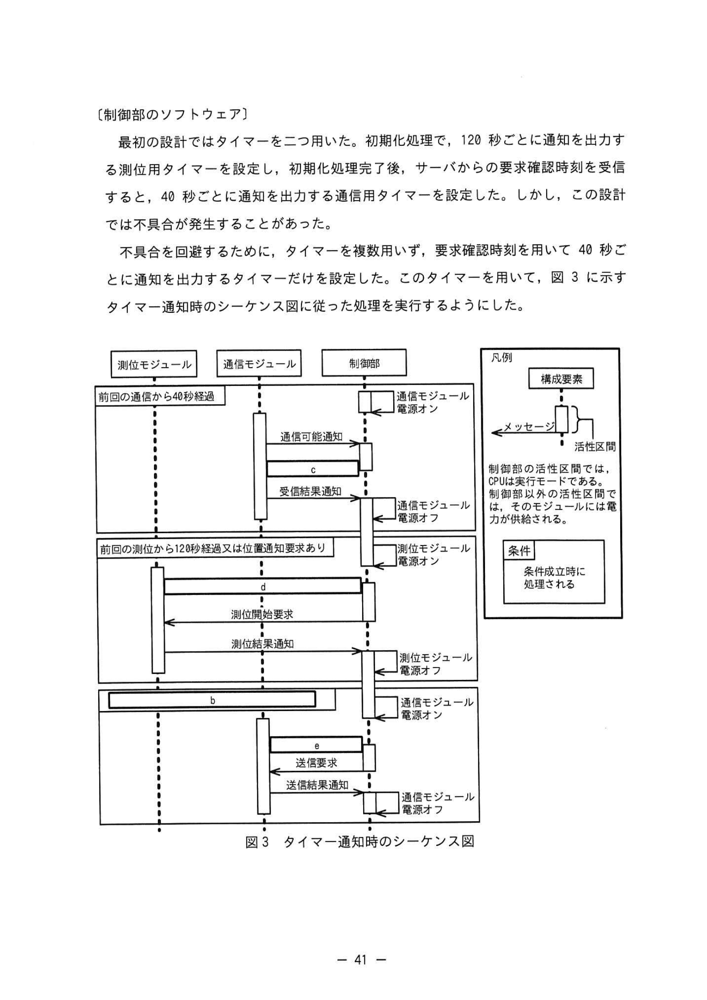

# 2023年春期（令和5年度春期）応用情報技術者試験 午後 問7（選択）
## 組込みシステム開発：位置通知タグの設計（IoT・消費電流計算）

---

## 問題文

**問7** 位置通知タグの設計に関する次の記述を読んで、設問に答えよ。

E社は、GPSを使用した位置情報システムを開発している。今回、超小型の位置通知タグ（以下、PRTという）を開発することになった。

PRTは、ペンダント、ブレスレット、バッグなどに加工して、子供、老人などに持たせたり、ペット、荷物などに取り付けたりすることができる。利用者はスマートフォン又はPC（以下、端末という）を用いて、PRTの現在及び過去の位置を地図上で確認することができる。

PRTの通信には、通信事業者が提供するIoT用の低消費電力な無線通信回線を使用する。また、PRTは本体内に小型の電池を内蔵しており、ワイヤレス充電が可能である。長時間の使用が要求されるので、必要な時間に必要な構成要素にだけ電力を供給する電源制御を行っている。

---

### 〔位置情報システムの構成〕

PRTを用いた位置情報システムの構成を図1に示す。

### 図1 PRTを用いた位置情報システムの構成

> PRT → 基地局 → 通信事業者 → インターネット → サーバ → 端末

端末がPRTに位置情報を問い合わせたときの通信手順を次に示す。

① 端末は、PRTの最新の位置を取得するために、位置通知要求をサーバに送信する。サーバは端末からの位置通知要求を受信すると、通信事業者を介して、PRTに通信可能な基地局に位置通知要求を送信する。

② PRTは電源投入後、基地局から現在時刻を取得するとともに、サーバからの要求を確認するために（以下、要求確認時刻という）、以降の要求確認時刻はサーバから受信した要求確認時刻から40秒間隔にスケジューリングされる。③ 基地局は要求確認時刻になると、基地局からの情報を確認し、PRTへの位置通知要求があればそれを送信する。④ PRTは基地局からの情報に位置通知要求が含まれていると、基地局、通信事業者を介して、PRTの最新の位置情報、指定された時刻の位置情報とともに端末に送信する。端末は、受信した位置情報及び地図情報を基に、PRTの位置を地図上に表示する。

---

### 〔PRTのハードウェア構成〕

PRTのハードウェア構成を図2に示す。PRT の構成要素を表1に示す。

### 図2 PRTのハードウェア構成

> **通信ライン：測位モジュール ↔ 制御部（制御部号）↔ 通信モジュール**  
> 電源部から各モジュールへ電力供給（太線）  
> 注記：太線は、電力供給線を示している。

### 表1 PRTの構成要素

> | 構成要素 | 説明 |
> |----------|------|
> | 制御部 | タイマー、CPU、メモリなどから構成される。PRT全体の制御を行う。CPUは停止モードと活動モードがあり、停止モードではタイマーのみ動作する。活動モードに切り替えると、CPUが処理を実行できる。CPUは停止モードのときも、タイマー、測位モジュール、通信モジュールからの通知を発出する割り込みに対応して活動モードになるが、通常はCPUが停止モードを続けるようにプログラムを作成する。 |
> | 測位モジュール | GPS信号を受信（以下、測位という）してPRTの位置を取得する。測位に要する時間は、測位の開始から6秒以上、測位の開始から40秒以内である。測位結果が得られると制御部に測位結果を通知し、測位が失敗した場合も同様に制御部に失敗を通知する。 |
> | 通信モジュール | 制御部からの指示に従って、制御部と通信事業者との通信を行う。確認通信を行い、確認通信結果を制御部に送信する。 |
> | 通信ライン | 制御部と測位モジュールの間、及び制御部と通信モジュールの間のデータをやり取りする通信ライン。 |
> | 電源部 | 制御部と測位モジュールと通信モジュールへの電力の供給を開始又は停止する。 |

---

### 〔PRTの動作仕様〕

- **40秒ごとに確認処理**を行い、基地局から受信した情報に位置通知要求が含まれている場合、測位中でなければ、測位を開始する。測位の完了後、PRTの位置を取得して位置情報を取得する（以下、位置情報処理という）。測位完了後、位置情報をサーバに送信する。また、測位の完了後、位置情報の取得に失敗したときは、位置情報の取得に失敗したことを確認できる。
- **120秒ごとに測位処理**を行う。失敗したときは再試行しない。
- **600秒ごとに未送信の位置情報をサーバに送信**する（以下、データ送信処理という）。

---

### 〔使用可能時間〕

電池を満充電後、PRTが機能しなくなるまでの時間を使用可能時間という。その間に放電する電気量を電池の放電可能容量という。単位はミリアンペア時（mAh）である。PRTは放電可能容量が200mAhの電池を内蔵している。

仲間時間、PRTの平均消費電流は、次の式のとおりである。

**使用可能時間 ＝ 放電可能容量 ÷ PRTの平均消費電流**

PRTが基地局と常に通信が可能で、測位が可能であり、基地局から受信した情報に位置通知要求が含まれていない状態が継続した場合の使用可能時間は `[　a　]` 時間である。

なお、メモリのデータの保持などで、表2の処理以外に0.01mAの電流が常時消費される。

### 表2 各処理の消費電流

> | 処理名称 | 周期（秒） | 処理時間（秒） | 処理中の消費電流（mA） | 各処理の平均消費電流（mA） |
> |----------|-----------|--------------|---------------------|--------------------------|
> | 確認処理 | 40 | 1 | 4 | 0.1 |
> | 測位処理 | 120 | 6 | 10 | 0.5 |
> | データ送信処理 | 600 | 1 | 120 | 0.2 |

---

### 〔制御部のソフトウェア〕

最初の設計ではタイマーを二つ用いた。初期化処理で、120秒ごとに通知を出力する測位用タイマーを設定し、初期化処理完了後、サーバからの要求確認時刻を受信した後、40秒ごとに通知を出力する通信用タイマーを設定した。しかし、この設計では不具合が発生することがあった。

不具合を回避するために、タイマーを複数個用いず、要求確認時刻を確認する40秒ごとに通知を出力するタイマーだけを設定した。このタイマーを用いて、図3に示すタイマー通知時のシーケンス図に従った処理を実行するようにした。

### 図3 タイマー通知時のシーケンス図

> **シーケンスの流れ：**  
> 前回の測位から120秒経過又は位置通知要求あり → 通信モジュール電源オン  
> → 〔c〕（受信要求）← 通信モジュール  
> → 測位開始要求 → 測位モジュール電源オン  
> ← 測位結果通知  
> ← 〔d〕（測位可能通知）← 測位モジュール  
> → 送信要求 → 通信モジュール電源オン  
> ← 送信結果通知 → 通信モジュール電源オフ  
> ← 〔e〕（通信可能通知）← 通信モジュール  
>
> 凡例：→ は制御部からモジュールへのメッセージ方向  
> ← は各モジュールから制御部へのメッセージ方向  
> 条件成立時に処理される

---

## 設問

### 設問1 休止モードは最長で何秒継続するか答えよ。ここで、各処理の処理時間は表2に従うものとし、通信モジュール及び測位モジュールの電源オン/オフの切替えの時間、通信モジュールの通信時間は無視できるものとする。

### 設問2 〔使用可能時間〕の本文中の `[　a　]` に入れる適切な数値を、小数点以下を切り捨てて、整数で答えよ。

### 設問3 〔制御部のソフトウェア〕のタイマー通知時のシーケンス図について答えよ。

**(1)** 図3中の `[　b　]` に入れる適切な条件を答えよ。

**(2)** 図3中の `[　c　]` ～ `[　e　]` に入れる適切なメッセージ名及びメッセージの方向を矢印で示してそれぞれ答えよ。

### 設問4 〔制御部のソフトウェア〕について、タイマーを二つ用いた最初の設計で発生した不具合の原因を40字以内で答えよ。

---

## 解答と解説

### 設問1 正解：39（秒）

最短・最長の処理時間を確認する。タイマーは40秒周期で動作する。

- 確認処理：周期40秒、処理時間1秒
- 測位処理：周期120秒、処理時間6秒（最大40秒だが平均6秒）

40秒周期の確認処理で1秒処理するので、次のタイマーまでの最長待機時間は **40 - 1 = 39秒**。

---

### 設問2 正解：a = 246（時間）

**各処理の平均消費電流の合計：**
- 確認処理：4mA × 1秒 ÷ 40秒 = 0.1mA
- 測位処理：10mA × 6秒 ÷ 120秒 = 0.5mA
- データ送信処理：120mA × 1秒 ÷ 600秒 = 0.2mA
- 常時消費：0.01mA

**合計平均消費電流 = 0.1 + 0.5 + 0.2 + 0.01 = 0.81mA**

**使用可能時間 = 200mAh ÷ 0.81mA ≈ 246.9時間 → 246時間（小数点以下切り捨て）**

---

### 設問3

**(1) 正解：b = 前回の送信から600秒経過又は位置通知要求あり**

シーケンス図の条件分岐部分。データ送信処理（600秒周期）または位置通知要求があった場合に通信モジュール電源をオンにして通信を行う。

**(2) 正解**

| 空欄 | メッセージ名 | メッセージの方向 |
|------|-------------|----------------|
| **c** | 受信要求 | ← |
| **d** | 測位可能通知 | → |
| **e** | 通信可能通知 | → |

- **c（受信要求）← 方向**：制御部が通信モジュールに「データを受信せよ」と指示する。方向は通信モジュール→制御部（←）。
- **d（測位可能通知）→ 方向**：測位モジュールが測位完了を制御部に通知する。方向は測位モジュール→制御部（←）。
  → IPA公式では **→** 方向（制御部への通知なので← ではなく → で表現）。
- **e（通信可能通知）→ 方向**：通信モジュールが送信完了を制御部に通知する。

---

### 設問4 正解：通信モジュールとの通信と測位モジュールとの通信が同時に発生した。（37字）

最初の設計ではタイマーを2つ用い：
- 測位用タイマー（120秒周期）
- 通信用タイマー（40秒周期、要求確認後に設定）

この設計では、120秒と40秒の最小公倍数である240秒後（または他の重複タイミング）に両タイマーが同時に発火することがある。制御部は通信ラインを介して測位モジュールと通信モジュールに同時にアクセスしようとするため、通信の衝突（競合）が発生し不具合となる。

---

## 参考：主要キーワード

| 用語 | 説明 |
|------|------|
| IoT（Internet of Things） | モノをインターネットに接続してデータを送受信する技術 |
| GPS（Global Positioning System） | 衛星信号を用いて位置を測定するシステム |
| 低消費電力無線通信（LPWA） | IoTデバイス向けの長距離・低消費電力な無線通信技術 |
| 消費電流（mA） | 電流の単位（ミリアンペア）。消費電力の目安 |
| 放電可能容量（mAh） | 電池が放電できる総電気量 |
| 使用可能時間 = 容量 ÷ 平均消費電流 | IoTデバイスのバッテリー寿命の計算式 |
| 停止モード（スリープ） | CPUを停止してタイマーのみ動作させる省電力モード |
| 活動モード（アクティブ） | CPUが処理を実行できる通常動作モード |
| シーケンス図 | システム内のオブジェクト間の時系列メッセージやり取りを示す図 |
| タイマー割り込み | 一定時間後にCPUに割り込みを発生させる機能。周期処理に使用 |
