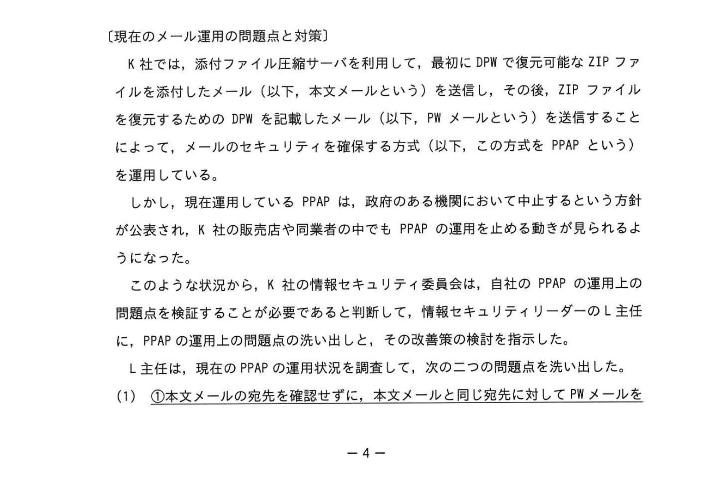
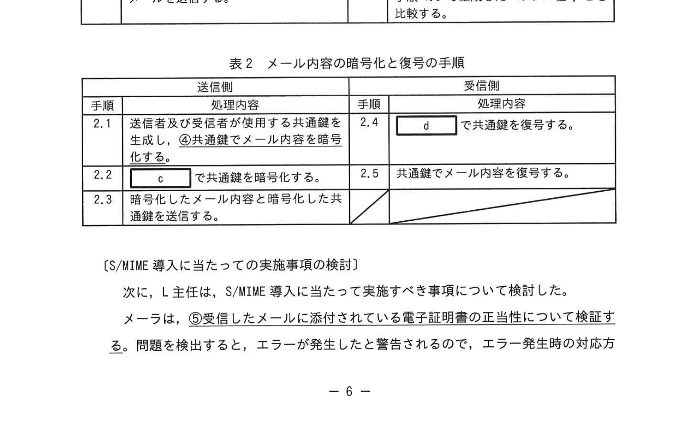
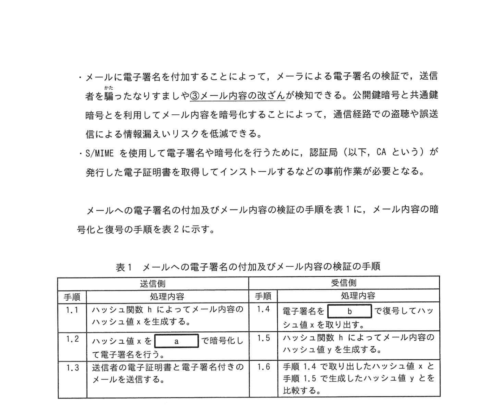

# 2023年秋期（令和5年度秋期）応用情報技術者試験 午後 問1（必須）
## 情報セキュリティ：電子メールのセキュリティ対策（PPAP廃止・S/MIME導入）

---

## 問題文

**問1** 電子メールのセキュリティ対策に関する次の記述を読んで、設問に答えよ。

K社は、IT製品の卸売会社であり、300社の販売店に製品を卸している。K社では、8年前に従業員が、ある販売店向けの奨励金額が記載されたプロモーション企画書ファイルを添付した電子メール（以下、メールという）を、担当する全販売店の担当者宛てに誤送信するというセキュリティ事故が発生した。そこで、メールの添付ファイルを、使い捨てのパスワード（以下、DPW という）によって復元可能な ZIP ファイルに変換する添付ファイル圧縮サーバを導入した。

添付ファイル圧縮サーバ導入後のメール送信手順を図1に示す。

### 図1 添付ファイル圧縮サーバ導入後のメール送信手順

> **手順：**
> - (i) 添付ファイル付きメール
> - (ii) 添付ファイルが ZIP ファイルに変換されたメール
> - (iii) DPW を記載したメール
> - (iv) PW 記載のメール
>
> 凡例 → : メールの転送方向を示す

---

### 〔現在のメール運用の問題点と対策〕

K社では、添付ファイル圧縮サーバを利用して、最初に DPW で復元可能な ZIP ファイルを添付したメール（以下、本メールという）を送信することになった。この場合、ZIP ファイルを復元するための DPW を記載したメール（以下、PW メールという）を送信することによって、メールのセキュリティを確保する方式（以下、この方式を PPAP という）を運用している。

現在の運用状況として PPAP は、政府の各省庁においても中止とする方針が公表され、K社の販売店や同業者の中でも PPAP の運用を止める動きが見られるようになった。

L主任は、現在の PPAP の運用状況を調査して、次の二つの問題点を洗い出した。

①**本文メールの宛先を確認せずに、本文メールと同じ宛先に対して PW メールを送信している。**

**(2)** ほとんどの従業員が、PW メールを本文メールと同じメールシステムを使用して送信している。したがって、本文メールが通信経路上で何らかの手段によって盗聴された場合、PW メールも盗聴されるおそれがある。

L主任は(1)及び(2)、ともに情報漏えいにつながるリスクがある。(1)の問題点を改善しても、(2)の問題点が残ることから、L主任は(2)の問題点の改善策を考えた。運用面の改善策によっては情報漏えいリスクを低減するための意識が薄れ、改善策が実施されなくなるおそれもある。そこで、L主任は、より高度なセキュリティ対策を実施して、情報漏えいリスクをより低減させる必要があると考え、安全なメール送受信方式を調査した。

---

### 〔安全なメール送受信方式の検討〕

L主任は、調査に当たって安全なメール送受信方式の選定の要件として、次の(ⅰ)〜(ⅲ)を設定した。

- **(ⅰ)** メールの本文及び添付ファイル（以下、メール内容という）を暗号化できること
- **(ⅱ)** メール内容は、送信端末と受信端末との間の全ての区間で暗号化されていること
- **(ⅲ)** 誤送信されたメールの受信者には、メール内容の復号が困難なこと

これら三つの要件を満たす技術について調査した結果、S/MIME（Secure/Multipurpose Internet Mail Extensions）が該当することが分かった。S/MIME は、K社や販売店で使用している PC のメールソフトウェア（以下、メーラという）が対応しており導入しやすいと L 主任は考えた。

---

### 〔S/MIME の調査〕

L主任は S/MIME について調査した。調査によって分かった内容を次に示す。

S/MIME は、メールに電子署名を付加したり、メール内容を暗号化したりすることによってメールの安全性を高める標準規格の一つである。

メールに電子署名を付加することによって、メーラによる受信者の電子証明書の正当性の検証で、送信者の身元やメール内容が改竄されていないことを確認できる。公開鍵暗号と共通鍵暗号を利用してメール内容を暗号化することによって、通信経路での盗聴や誤送信による情報漏えいのリスクを低減できる。

S/MIME を使用して電子署名や暗号化を行うために、認証局（以下、CA という）が発行した電子証明書を取得してインストールするなどの事前作業が必要となる。

---

### 表1 メールへの電子署名の付加及びメール内容の検証の手順

> | 送信側 | 手順 | 受信側 |
> |---|---|---|
> | 1.1 ハッシュ関数kにてメール内容のハッシュ値xを生成する | → | 1.4 電子署名xを復号してハッシュ値xを取り出す |
> | 1.2 送信者の秘密鍵で電子署名（xを暗号化）をする | → | 1.5 手順1.4で生成したハッシュ値xと比べる |
> | 1.3 送信者の電子証明書付きの電子署名付きメールを送信する | → | 1.6 電子署名xを復号してハッシュ値xを比較する |

---

### 表2 メール内容の暗号化と復号の手順

> | 送信側 | 手順 | 受信側 |
> |---|---|---|
> | 2.1 送信者及び受信者が使用する共通鍵を生成し、共通鍵でメール内容を暗号化する | → | 2.4 受信者の秘密鍵で復号する |
> | 2.2 `[　c　]` で共通鍵を暗号化する | → | 2.5 共通鍵でメール内容を復号する |
> | 2.3 暗号化したメール内容と暗号化した共通鍵を送信する | → | |

---

### 〔S/MIME 導入に当たっての実施事項の検討〕

次に、L主任は S/MIME 導入に当たって実施すべき事項について検討した。

メーラは、受信したメールに添付されている電子証明書の正当性を検証する。問題を検出すると、エラーが発生したと警告されるので、エラー発生時の対方法をまとめておく必要がある。

---

## 設問

### 設問1 〔現在のメール運用の問題点と対策〕について答えよ。

**(1)** 本文中の下線①によって発生する、①情報漏えいにつながる問題を30字以内で答えよ。

**(2)** 本文中の下線②について、遠隔による情報漏えいリスクを低減させる運用を30字以内で答えよ。

### 設問2 〔S/MIME の調査〕について答えよ。

**(1)** 表1中の手順1.6に示した検証のために、メーラが送信者の電子証明書から取得する数値を答えよ。

**(2)** 表2中の `[　a　]` 〜 `[　d　]` に入れる適切な字句を解答群の中から選び、記号で答えよ。

**解答群：**
- ア CAの公開鍵  イ 受信者の公開鍵  ウ 受信者の秘密鍵  エ 送信者の秘密鍵  オ 送信者の公開鍵  カ 送信者の秘密鍵

**(3)** 本文中の下線③について、メール内容の暗号化に公開鍵ではなく共通鍵を利用する理由を、20字以内で答えよ。

### 設問3 電子証明書の正当性の検証に必要となる鍵の種類を解答群の中から選び、記号で答えよ。

**解答群：**
- ア CAの公開鍵  イ 受信者の公開鍵  ウ 送信者の公開鍵

---

## 解答と解説

### 設問1

**(1) 正解：本文メールを誤送信すると、DPW も誤送信した相手に届いてしまう。**

本文メールの宛先確認なしに同じ宛先へ PW メールを送ることで、誤送信があった場合も DPW が漏れてしまう。

**(2) 正解：DPW を、電話や携帯メールなど異なった手段で伝える。**

同じメールシステムで PW メールを送るため、盗聴リスクが同一。電話など別チャネルで DPW を伝えることで漏えいリスクを低減できる。

---

### 設問2

**(1) 正解：1.6**

電子証明書には送信者の公開鍵が含まれる。受信側は送信者の公開鍵でハッシュ値 x を復号して改竄確認を行う（手順 1.4 〜 1.6 の対応）。

**(2)**

| 空欄 | 正解 | 解説 |
|---|---|---|
| **a** | カ（送信者の秘密鍵） | 電子署名：送信者の秘密鍵で暗号化（署名） |
| **b** | オ（送信者の公開鍵） | 受信側：送信者の公開鍵で署名を復号 |
| **c** | ウ（受信者の公開鍵） | 共通鍵の暗号化に受信者の公開鍵を使う |
| **d** | エ（送信者の秘密鍵） | 受信側：自分の秘密鍵で共通鍵を復号 |

**(3) 正解：暗号化と復号の処理速度が速いから（18字）**

公開鍵暗号は処理が重い。大きなメール本文の暗号化には高速な共通鍵暗号を使い、共通鍵自体のみを公開鍵で保護するハイブリッド暗号方式が S/MIME の仕組み。

---

### 設問3

**正解：ア（CA の公開鍵）**

電子証明書の正当性（CA の署名）を検証するには CA の公開鍵が必要。CA の公開鍵はルート証明書としてメーラに組み込まれている。

---

## 参考：主要キーワード

| 用語 | 説明 |
|------|------|
| PPAP | Password Protected / Archived PDF（パスワード付き ZIP ＋ PW 別送）方式。現在廃止が進む |
| S/MIME | Secure/Multipurpose Internet Mail Extensions。電子署名・暗号化に対応したメール規格 |
| 電子署名 | 送信者の秘密鍵でハッシュ値を暗号化したもの。改竄検知・なりすまし防止に使用 |
| ハイブリッド暗号 | 共通鍵でデータを暗号化し、その共通鍵を公開鍵暗号で保護する方式 |
| 公開鍵暗号 | 公開鍵で暗号化・秘密鍵で復号（RSA 等）。処理が遅いため鍵交換に利用 |
| 共通鍵暗号 | 同じ鍵で暗号化・復号（AES 等）。処理が速いためデータ暗号化に利用 |
| 認証局（CA） | 電子証明書を発行・管理する信頼された第三者機関 |
| 電子証明書 | CA が発行する公開鍵を含む証明書。公開鍵の正当性を保証する |
| DPW（使い捨てパスワード） | ZIP ファイルを展開するための一時的なパスワード |
| 盗聴リスク | 通信経路上でデータが第三者に傍受されるリスク |
