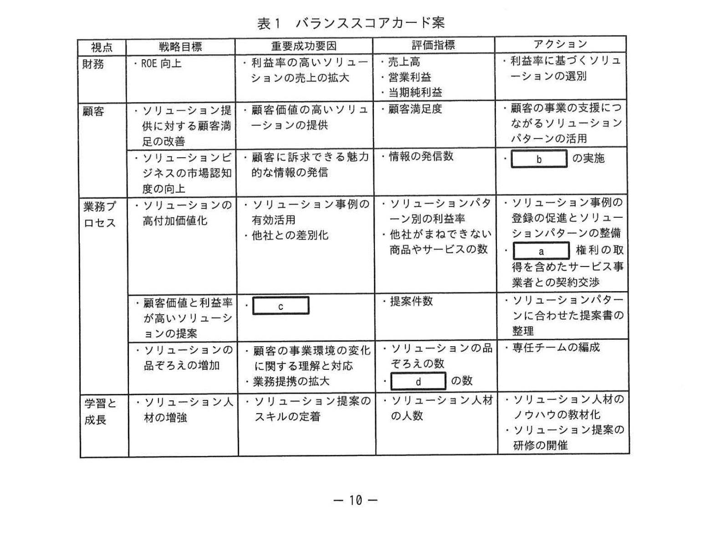
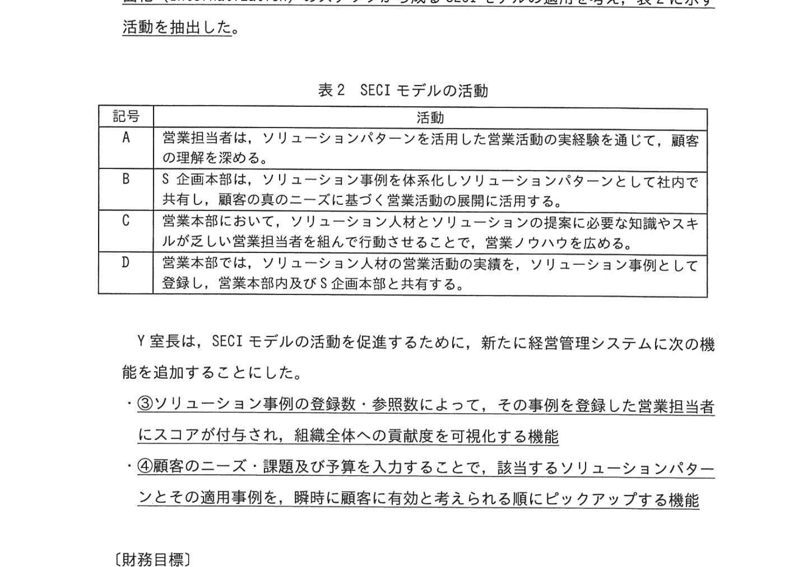
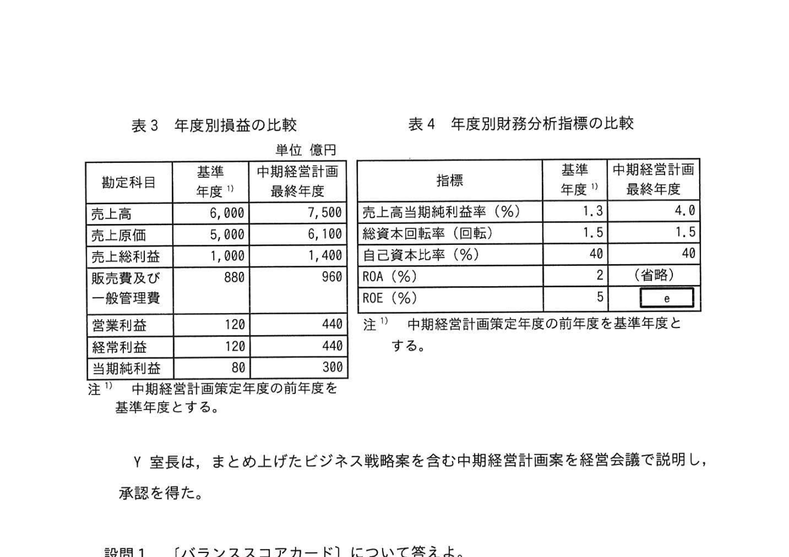

# 2023年秋期（令和5年度秋期）応用情報技術者試験 午後 問2（選択）
## 経営戦略：バランススコアカードを用いたビジネス戦略策定

---

## 問題文

**問2** バランススコアカードを用いたビジネス戦略策定に関する次の記述を読んで、設問に答えよ。

X社は、大手の事務機器販売会社である。複写機をはじめ、様々な事務機器を顧客に提供してきた。顧客の事業環境の急激な変化や市場の成熟化によって、X社の利益率は低下傾向であった。そこで、X社の経営陣は、数年前に複数のIT関連の商品やサービスを組み合わせてソリューションとして提供することで、顧客の事業を支援するビジネス（以下、ソリューションビジネスという）を開始し、利益率向上を目指してきた。ソリューションビジネスは拡大し、売上高は全社売上高の60%以上を占めるまでになったが、思うように利益率が向上していない。X社の経営陣は、利益率を向上させて現在5%のROEを10%以上に高め、投資家の期待に応える必要があると考えている。

X社の組織体制には、経営企画室、人材開発本部、ソリューション企画本部（以下、S企画本部という）、営業本部などがある。人事評価制度として、目標管理制度を導入しており、営業担当者は売上高を目標に設定し、達成度を管理している。営業本部がビジネス戦略を立案し、S企画本部が、IT関連の商品やサービスを提供する企業（以下、サービス事業者という）と協業してソリューションを開発していたが、X社の経営陣は、全社レベルで統一され、各本部が組織を横断して連携するビジネス戦略が必要と考えた。

X社の経営陣は、次期の中期経営計画の策定に当たって、経営企画室のY室長にソリューションビジネスを拡大し、X社の利益率を向上させるビジネス戦略を立案するよう指示した。

---

### 〔ソリューションビジネスの現状分析〕

Y室長は、X社の現状を分析し、次のように認識した。

- ソリューションの品ぞろえが少なく、また、顧客価値の低いソリューションや利益率の低いソリューションがある。
- 新しい商品やサービスを取り扱っても、すぐに競合他社から同じ商品やサービスが販売され、差別化できない。
- ソリューションの提案活動では、多くのソリューション事例の知識及び顧客の事業に関する知識を活用し、顧客の真のニーズを聞き出すスキルが求められるが、そのような知識やスキルをもつ人材（以下、ソリューション人材という）が不足している。その結果、顧客満足度調査では、ソリューション提案を求めても期待するような提案が得られないとの回答もみられる。
- X社のソリューションビジネスの市場認知度を高める必要があるが、現状では、顧客に訴求できるような情報の発信力が不足している。
- 提案活動の参考になる過去のソリューション事例を、サーバに登録することにしている。しかし、営業担当者は、自らの経験を公開することが人事評価にはつながらないので登録に積極的でなく、現在は蓄積されている件数が少ない。また、有益な情報があっても探すのに時間が掛かり、提案のタイミングを逸して失注している。

---

### 〔ビジネス戦略の施策〕

現状分析を踏まえて、Y室長はビジネス戦略の施策を次のようにまとめ、これらの施策を実施することによって、ROEを10%以上に伸長させることとした。

**(1) 人材開発**
- ソリューション人材を育成する仕組みを確立する。具体的には、ソリューション人材の営業ノウハウを形式知化して社内で共有するとともに、ソリューション提案の研修を開催し、ソリューションの知識や顧客の真のニーズを聞き出すスキル、課題を発見・解決するスキルが乏しい営業担当者の教育に活用する。
- 人事評価制度を見直し、営業担当者は売上高の目標達成に加えて、ソリューション事例の登録数など、組織全体の営業力を高めることへの貢献度を評価する。また、S企画本部の担当者に対しては、ソリューションごとの顧客満足度と販売実績の利益率を評価する。さらに、人材開発本部の担当者に対しては、開催した研修によって育成したソリューション人材の人数を評価する。

**(2) ソリューション開発**
- 顧客の事業環境の変化に対応してソリューションの品ぞろえを増やすため、専任チームを立ち上げ、多様な商品やサービスをもつサービス事業者との業務提携を拡大する。業務提携に当たっては、 `[　a　]` 権利を、そのサービス事業者から適法に取得することによって他社との差別化を図る。
- 利益率の高いソリューション事例を抽出し、類似する顧客のニーズ・課題及び同規模の予算に適合するソリューションのパターン（以下、ソリューションパターンという）を整備する。

**(3) 営業活動**
- ソリューションパターンの提案を増やすことによって、顧客価値と利益率が高いソリューションの売上拡大を図る。
- X社のソリューションの市場認知度を高めるために、ソリューション事例を顧客に訴求できる魅力的な情報として発信するなど、コンテンツマーケティングを行う。
- 顧客の真のニーズを満たす顧客価値を提供するために、営業本部とS企画本部とが協力して開発するソリューションを活用して、営業活動を展開する。

---

### 〔バランススコアカード〕

Y室長は、ビジネス戦略の施策を具体化するために、①**各部門の中期経営計画策定担当者を集めて**、表1に示すバランススコアカード案を作成した。

### 表1 バランススコアカード案

> | 視点 | 戦略目標 | 重要成功要因 | 評価指標 | アクション |
> |---|---|---|---|---|
> | 財務 | ・ROE向上 | ・利益率の高いソリューションの売上の拡大 | ・売上高 ・営業利益 ・当期純利益 | ・利益率に基づくソリューションの選別 |
> | 顧客 | ・ソリューション提供に対する顧客満足の改善 | ・顧客価値の高いソリューションの提供 | ・顧客満足度 | ・顧客の事業の支援につながるソリューションパターンの活用 |
> | 顧客 | ・ソリューションビジネスの市場認知度の向上 | ・顧客に訴求できる魅力的な情報の発信 | ・情報の発信数 | ・ `[　b　]` の実施 |
> | 業務プロセス | ・ソリューションの高付加価値化 | ・ソリューション事例の有効活用 ・他社との差別化 | ・ソリューションパターン別の利益率 ・他社がまねできない商品やサービスの数 | ・ソリューション事例の登録の促進とソリューションパターンの整備 ・ `[　a　]` 権利の取得を含めたサービス事業者との契約交渉 |
> | 業務プロセス | ・顧客価値と利益率が高いソリューションの提案 | ・ `[　c　]` | ・提案件数 | ・ソリューションパターンに合わせた提案書の整理 |
> | 業務プロセス | ・ソリューションの品ぞろえの増加 | ・顧客の事業環境の変化に関する理解と対応 ・業務提携の拡大 | ・ソリューションの品ぞろえの数 ・ `[　d　]` の数 | ・専任チームの編成 |
> | 学習と成長 | ・ソリューション人材の増強 | ・ソリューション提案のスキルの定着 | ・ソリューション人材の人数 | ・ソリューション人材のノウハウの教材化 ・ソリューション提案の研修の開催 |

---

### 〔SECIモデルの適用〕

Y室長は、バランススコアカードのアクションを組織的に推進する仕組みとして、②**共同化（Socialization）、表出化（Externalization）、連結化（Combination）、内面化（Internalization）のステップから成るSECIモデルの適用**を考え、表2に示す活動を抽出した。

### 表2 SECIモデルの活動

> | 記号 | 活動 |
> |---|---|
> | A | 営業担当者は、ソリューションパターンを活用した営業活動の実経験を通じて、顧客の理解を深める。 |
> | B | S企画本部は、ソリューション事例を体系化しソリューションパターンとして社内で共有し、顧客の真のニーズに基づく営業活動の展開に活用する。 |
> | C | 営業本部において、ソリューション人材とソリューションの提案に必要な知識やスキルが乏しい営業担当者を組んで行動させることで、営業ノウハウを広める。 |
> | D | 営業本部では、ソリューション人材の営業活動の実績を、ソリューション事例として登録し、営業本部内及びS企画本部と共有する。 |

Y室長は、SECIモデルの活動を促進するために、新たに経営管理システムに次の機能を追加することにした。

- ③**ソリューション事例の登録数・参照数によって、その事例を登録した営業担当者にスコアが付与され、組織全体への貢献度を可視化する機能**
- ④**顧客のニーズ・課題及び予算を入力することで、該当するソリューションパターンとその適用事例を、瞬時に顧客に有効と考えられる順にピックアップする機能**

---

### 〔財務目標〕

Y室長は、バランススコアカードに基づき、3か年の中期経営計画の最終年度の財務目標を設定し、表3の年度別損益の比較と表4の年度別財務分析指標の比較を作成した。

### 表3 年度別損益の比較（単位：億円）

> | 勘定科目 | 基準年度 注1) | 中期経営計画最終年度 |
> |---|---|---|
> | 売上高 | 6,000 | 7,500 |
> | 売上原価 | 5,000 | 6,100 |
> | 売上総利益 | 1,000 | 1,400 |
> | 販売費及び一般管理費 | 880 | 960 |
> | 営業利益 | 120 | 440 |
> | 経常利益 | 120 | 440 |
> | 当期純利益 | 80 | 300 |
>
> 注1) 中期経営計画策定年度の前年度を基準年度とする。

### 表4 年度別財務分析指標の比較

> | 指標 | 基準年度 注1) | 中期経営計画最終年度 |
> |---|---|---|
> | 売上高当期純利益率（%） | 1.3 | 4.0 |
> | 総資本回転率（回転） | 1.5 | 1.5 |
> | 自己資本比率（%） | 40 | 40 |
> | ROA（%） | 2 | （省略） |
> | ROE（%） | 5 | `[　e　]` |
>
> 注1) 中期経営計画策定年度の前年度を基準年度とする。

Y室長は、まとめ上げたビジネス戦略案を含む中期経営計画案を経営会議で説明し、承認を得た。

---

## 設問

### 設問1 〔バランススコアカード〕について答えよ。

**(1)** 本文中の下線①について、バランススコアカード案の作成に当たり、各部門の中期経営計画策定担当者を集めた狙いは何か。本文中の字句を用いて25字以内で答えよ。

**(2)** 〔ビジネス戦略の施策〕の本文及び表1中の `[　a　]` に入れる適切な字句を、15字以内で答えよ。

**(3)** 表1中の `[　b　]`、`[　d　]` に入れる適切な字句を、それぞれ15字以内で答えよ。

**(4)** 表1中の `[　c　]` に入れる適切な字句を解答群の中から選び、記号で答えよ。

**解答群：**
- ア 顧客への訪問回数を増やす営業活動
- イ サービス事業者との協業によるソリューション開発
- ウ ソリューションパターンを活用した営業活動
- エ 利益率を重視した営業活動

### 設問2 〔SECIモデルの適用〕について答えよ。

**(1)** 本文中の下線②について、表2の記号A〜Dを、SECIモデルの共同化、表出化、連結化、内面化のステップの順序に「,」で区切って並べて答えよ。

**(2)** 本文中の下線③について、この機能は、営業担当者のどのような行動を促進できるか。15字以内で答えよ。

**(3)** 本文中の下線④について、この機能は、営業担当者の提案活動において、どのような効果を期待できるか。40字以内で答えよ。

### 設問3 表4中の `[　e　]` に入れる適切な数値を、小数第1位を四捨五入して整数で答えよ。

---

## 解答と解説

### 設問1

**(1) 正解：全社レベルで統一されたビジネス戦略を描くこと**

各部門の中期経営計画策定担当者を集めることで、財務・顧客・業務プロセス・学習と成長の4視点を全社横断的に整合させ、全社レベルで統一されたビジネス戦略を描くことができる。

**(2) 正解：a = 独占的に販売できる（9字）**

サービス事業者との業務提携で、そのサービスを「独占的に販売できる」権利（専売権等）を適法に取得することで、他社との差別化を図る。

**(3) 正解**
- **b = コンテンツマーケティング**：顧客に訴求できる魅力的な情報を発信し、市場認知度を高めるアクション。
- **d = 業務提携するサービス事業者**：ソリューションの品ぞろえ増加のための評価指標で、業務提携するサービス事業者の数を測る。

**(4) 正解：c = ウ（ソリューションパターンを活用した営業活動）**

業務プロセス視点で「顧客価値と利益率が高いソリューションの提案」を実現する重要成功要因は、ソリューションパターンを活用した営業活動である。

---

### 設問2

**(1) 正解：C, D, B, A**

- **共同化（S）**：C（ソリューション人材と経験の浅い営業担当者を組ませ、暗黙知としての営業ノウハウを共有）
- **表出化（E）**：D（営業活動の実績をソリューション事例として登録＝暗黙知を形式知化）
- **連結化（C）**：B（事例を体系化しソリューションパターンとして社内共有＝形式知の組合せ）
- **内面化（I）**：A（ソリューションパターンを活用した実経験を通じて顧客理解を深める＝形式知を実践で体得）

**(2) 正解：事例を登録する行動**

登録数・参照数に応じてスコアが付与され貢献度が可視化されることで、営業担当者は自らの事例を積極的に登録する行動を促される。

**(3) 正解：顧客の真のニーズに合ったソリューションをタイムリーに提案できる。（30字）**

顧客のニーズ・課題・予算を入力するだけで有効なソリューションパターンと適用事例が即座に提示されるため、探す時間を要さず、適切なタイミングで顧客に合った提案ができる。

---

### 設問3 正解：e = 15

ROE ＝ 売上高当期純利益率 × 総資本回転率 ÷ 自己資本比率
＝ 4.0% × 1.5回転 ÷ 0.40 ＝ 6.0% ÷ 0.40 ＝ **15（%）**

（ROE ＝ ROA ÷ 自己資本比率 ＝ 6.0 ÷ 0.40 ＝ 15 とも求められる）

---

## 参考：主要キーワード

| 用語 | 説明 |
|------|------|
| バランススコアカード（BSC） | 財務・顧客・業務プロセス・学習と成長の4視点から戦略を管理するフレームワーク |
| 重要成功要因（CSF） | 戦略目標の達成に欠かせない要因 |
| 評価指標（KPI） | 目標達成度を測定する定量的な指標 |
| SECIモデル | 野中・竹内が提唱した知識創造モデル（共同化→表出化→連結化→内面化） |
| 共同化（Socialization） | 暗黙知を体験・共感を通じて他者に伝達するプロセス |
| 表出化（Externalization） | 暗黙知を言語・図式などの形式知に変換するプロセス |
| 連結化（Combination） | 形式知同士を組み合わせて新たな形式知を生み出すプロセス |
| 内面化（Internalization） | 形式知を実践を通じて暗黙知として体得するプロセス |
| ROE | Return on Equity。自己資本利益率 ＝ 当期純利益 ÷ 自己資本 |
| デュポン分析 | ROEを売上高利益率×総資本回転率÷自己資本比率に分解する財務分析手法 |
| コンテンツマーケティング | 有益なコンテンツを提供して顧客を引き付けるマーケティング手法 |
| ソリューションパターン | 顧客課題に対応した解決策のテンプレート |
