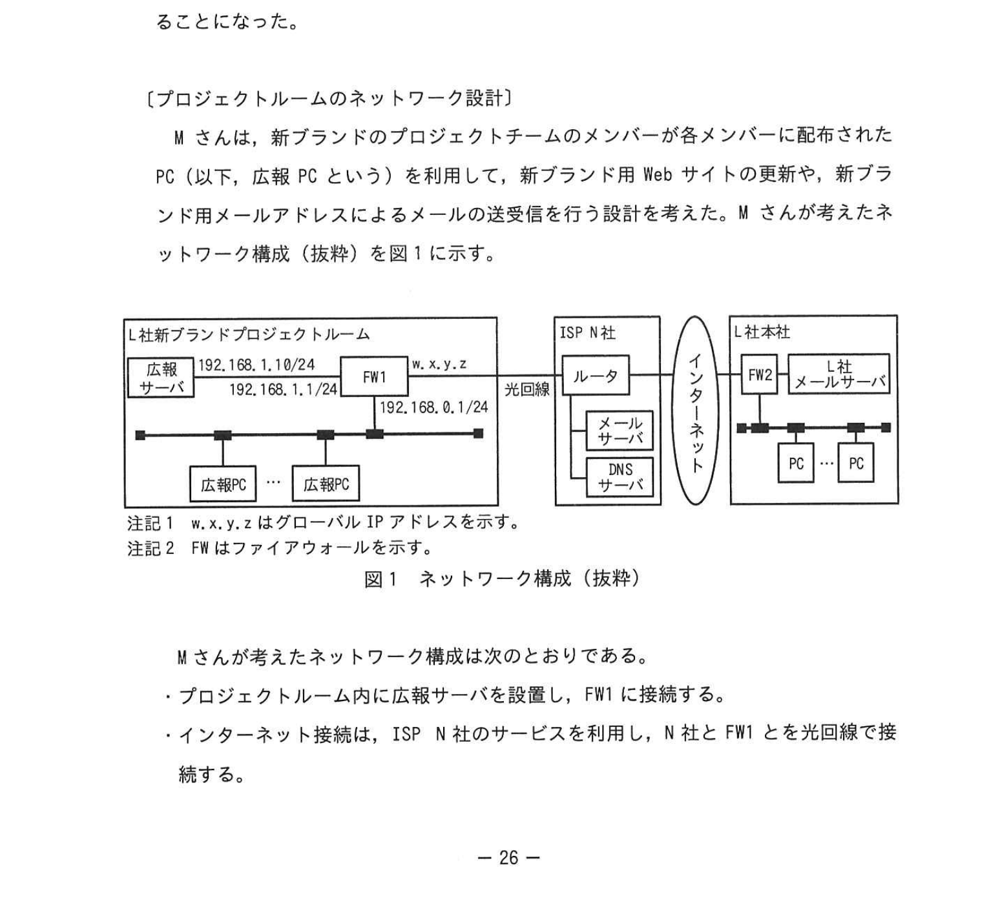
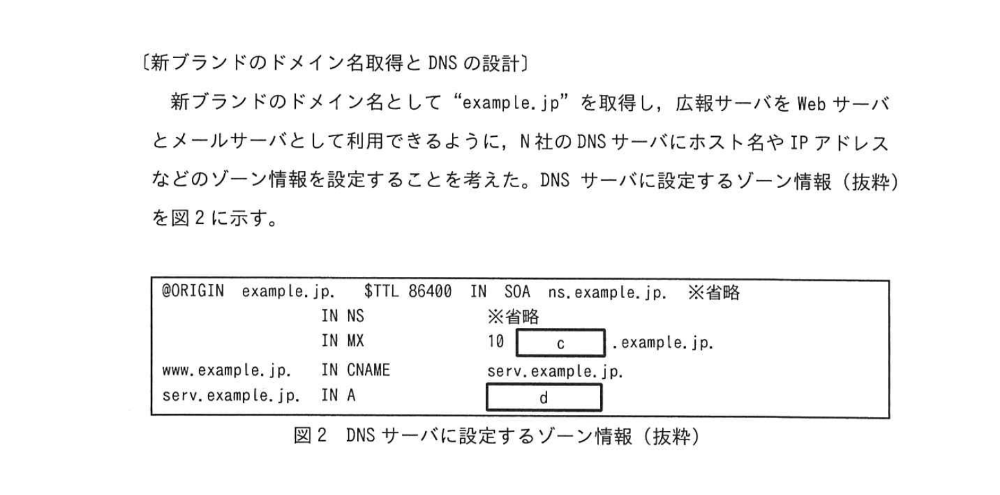

# 2023年秋期（令和5年度秋期）応用情報技術者試験 午後 問5（選択）
## ネットワーク：新ブランド向けメールサーバ構築（DNS・NAPT・SMTP認証）

---

## 問題文

**問5** メールサーバの構築に関する次の記述を読んで、設問に答えよ。

L社は、複数の衣料品ブランドを手がけるアパレル会社である。L社では、顧客層を拡大するために、新しい衣料品ブランド（以下、新ブランドという）を立ち上げることにした。新ブランドの立ち上げに向けて、L社の社員20名で構成するプロジェクトチームを結成し、都内のオフィスビルにプロジェクトルームを新設した。新ブランドの知名度向上のために新ブランド用 Web サイトと新ブランド用メールアドレスを利用した電子メール（以下、メールという）による広報を計画しており、プロジェクトチームのMさんが、Web サーバ機能とメールサーバ機能を有する広報サーバを構築することになった。

---

### 〔プロジェクトルームのネットワーク設計〕

M さんは、プロジェクトチームのメンバーが各メンバーに配布された PC（以下、広報 PC という）を利用して、新ブランド用 Web サイトの更新や、新ブランド用メールアドレスによるメールの送受信を行う予定を考えた。M さんが考えたネットワーク構成（抜粋）を図1に示す。

### 図1 ネットワーク構成（抜粋）



> **構成：**
> - L社新ブランドプロジェクトルーム
>   - 広報サーバ（192.168.1.10/24）
>   - FW1（192.168.1.1/24、192.168.0.1/24、外側 w.x.y.z）
>   - 広報PC（192.168.0.0/24 ネットワーク）
> - ISP N社：ルータ・メールサーバ・DNS サーバ
> - L社本社：FW2 → L社メールサーバ／PC
>
> 注記1：w.x.y.z はグローバル IP アドレスを示す。
> 注記2：FW はファイアウォールを示す。

M さんが考えたネットワーク構成は次のとおりである。

- プロジェクトルームに広報サーバを設置し、FW1 に接続する。
- インターネット接続は、ISP N社のサービスを利用し、N社と FW1 を光回線で接続する。
- 広報サーバのメールサーバ機能は、SMTP（Simple Mail Transfer Protocol）によるメール送信機能と POP（Post Office Protocol）によるメール受信機能の二つの機能を実装する。
- FW1 に NAPT（Network Address Port Translation）の設定と、インターネット上の機器から広報サーバにメールと Web の通信だけができるように、インターネットから FW1 宛てに送信された IP パケットのうち、`[　a　]` ポート番号が 25、80、又は `[　b　]` の IP パケットだけを、広報サーバの IP アドレスに転送する設定を行う。
- N社のインターネット接続サービスでは、N社の DNS サーバを利用した名前解決の機能と、N社のメールサーバを中継サーバとして N社のネットワーク外へメールを転送する機能が提供されている。

---

### 〔新ブランドのドメイン名取得と DNS の設計〕

新ブランドのドメイン名として "example.jp" を取得し、広報サーバを Web サーバとメールサーバとして利用できるように、N社の DNS サーバにホスト名や IP アドレスなどのゾーン情報を設定することを考えた。DNS サーバに設定するゾーン情報（抜粋）を図2に示す。

### 図2 DNS サーバに設定するゾーン情報（抜粋）



```
$ORIGIN example.jp.   $TTL 86400   IN SOA   ns.example.jp.   ※省略
                      IN NS        ※省略
                      IN MX        10   [　c　].example.jp.
www.example.jp.       IN CNAME     serv.example.jp.
serv.example.jp.      IN A         [　d　]
```

> - NS レコード：ドメインの権威 DNS サーバを示す
> - MX レコード：メール受信サーバのホスト名を指定
> - CNAME：www.example.jp → serv.example.jp のエイリアス
> - A レコード：serv.example.jp の IP アドレス（`[　d　]` = FW1 のグローバル IP）
> - `[　c　]` = serv または www（メールサーバのホスト名）

---

### 〔メール送受信のテスト〕

M さんの設計が承認され、ネットワークの工事及び広報サーバの設定が完了した。新ブランドのメール受信のテストのために、M さんは、L 社本社の PC を用いて L 社の自分のメールアドレスから新ブランドの自分のメールアドレスである syainM@example.jp へメールを送信し、エラーなくメールが送信できることを確認した。次に、新ブランドプロジェクトルームの広報 PC のメールソフトウェアに受信メールサーバとして serv.example.jp、POP3 のポート番号として 110 番ポートを設定し、メール受信のテストを行った。しかし、メールソフトウェアのメール受信ボタンを押してもエラーが発生し、メールを受信できなかった。広報サーバのログを確認したところ、広報 PC からのアクセスはログに記録されていなかった。

M さんは、設定の誤りに気づき、①**メールの受信エラーの問題を修正して**メールが受信できることを確認した後に、広報 PC からメール送信のテストを行った。テストの結果、新ブランドの管理者のメールアドレスである kanriD@example.jp から syainM@example.jp 宛てのメールは届いたが、kanriD@example.jp からインターネット上の他ドメインのメールアドレス宛てのメールは届かなかった。広報サーバのログを確認したところ、N 社のネットワークを経由した宛先ドメインのメールサーバへの TCP コネクションの確立に失敗したことを示すメッセージが記録されていた。

調査の結果、他ドメインのメールアドレス宛てのメールが届かなかった事象は、N社の②**OP25B（Outbound Port 25 Blocking）**と呼ばれる対策によるものであることが分かった。OP25B は、N社からインターネット宛てに送信される宛先ポート番号が 25 の IP パケットのうち、N社のメールサーバ以外から送信された IP パケットを遮断する対策である。

このセキュリティ対策に対応するため、③**広報サーバに必要な設定**を行い、インターネット上の他ドメインのメールアドレス宛てのメールも届くことを確認した。

---

### 〔メールサーバのセキュリティ対策〕

広報サーバが大量のメールを送信する踏み台サーバとして不正利用されないために、メールの送信を許可する接続元のネットワークアドレスとして `[　e　]` /24 を広報サーバに設定する対策を行った。また、プロジェクトチームのメンバーのメールアドレスとパスワードを利用して、広報 PC からメール送信時に広報サーバで SMTP 認証を行う設定を追加した。

その後、M さんは広報サーバとネットワークの構築を完了させ、L 社は新ブランドの広報を開始した。

---

## 設問

### 設問1 本文中の `[　a　]`、`[　b　]` に入れる適切な字句を解答群の中から選び、記号で答えよ。

**解答群：**
- ア 21  イ 22  ウ 23  エ 443  オ 宛先  カ 送信元

### 設問2 図2中の `[　c　]`、`[　d　]` に入れる適切な字句を、図1及び図2の字句を用いて答えよ。

### 設問3 〔メール送受信のテスト〕について答えよ。

**(1)** 本文中の下線①について、エラーの問題を修正するために変更したメールソフトウェアの設定項目を15字以内で答えよ。また、変更後の設定内容を図1及び図2の字句を用いて答えよ。

**(2)** 本文中の下線②について、OP25B によって軽減できるサイバーセキュリティ上の脅威は何か、最も適切なものを解答群の中から選び、記号で答えよ。

**解答群：**
- ア 広報PCが第三者のWebサービスへのDDoS攻撃の踏み台にされる。
- イ 広報PCに外部からアクセス可能なバックドアを仕掛けられる。
- ウ 広報サーバが受信したメールを不正に参照される。
- エ スパムメールの送信に広報サーバが利用される。

**(3)** 本文中の下線③について、広報サーバに行う設定を、図1中の機器名を用いて35字以内で答えよ。

### 設問4 本文中の `[　e　]` に入れる適切な字句を答えよ。

---

## 解答と解説

### 設問1

| 空欄 | 正解 | 解説 |
|---|---|---|
| **a** | オ（宛先） | NAPT では**宛先**ポート番号で転送先を判断する |
| **b** | エ（443） | HTTPS（443）、HTTP（80）、SMTP（25）に加え、HTTPS の 443 番ポートが必要 |

---

### 設問2

| 空欄 | 正解 | 解説 |
|---|---|---|
| **c** | serv または www | MX レコードでメール受信サーバのホスト名を指定（serv.example.jp） |
| **d** | w.x.y.z | serv.example.jp の A レコードに FW1 のグローバル IP アドレスを設定 |

---

### 設問3

**(1)**
- **設定項目：受信メールサーバ（8字）**
- **変更後の設定内容：192.168.1.10（広報サーバのプライベート IP）**

プロジェクトルーム内の広報 PC から受信メールサーバへのアクセスは、インターネット経由ではなくプライベートネットワーク内を通じて行う。FW1 のグローバル IP ではなく、広報サーバの内部アドレスを指定する必要があった。

**(2) 正解：エ（スパムメールの送信に広報サーバが利用される）**

OP25B（Outbound Port 25 Blocking）は、ISP（N社）からインターネット宛てに送信される宛先ポート番号25のIPパケットのうち、N社のメールサーバ以外から送信されたものを遮断する対策。これにより、マルウェア等に乗っ取られた広報サーバが外部の宛先へ直接スパムメールを大量送信することを防げる。

**IPA公式：エ**

**(3) 正解：N社のメールサーバを中継サーバとしてメールを送信する設定（27字）**

OP25Bによって広報サーバからインターネット宛ての直接のメール送信（宛先ポート25）は遮断される。そこで、広報サーバに、N社のメールサーバを中継サーバ（スマートホスト）として経由してメールを送信する設定を行えば、正規のメールを送信できる。

**IPA公式：N社のメールサーバを中継サーバとしてメールを送信する設定**

---

### 設問4

**正解：e=192.168.0.0**

プロジェクトルームの広報 PC が接続されているサブネット（192.168.0.0/24）のみからのメール送信を許可することで、踏み台利用を防止する。

---

## 参考：主要キーワード

| 用語 | 説明 |
|------|------|
| SMTP（Simple Mail Transfer Protocol） | メール送信プロトコル。ポート番号25 |
| POP3（Post Office Protocol 3） | メール受信プロトコル。ポート番号110 |
| NAPT（Network Address Port Translation） | プライベートIPとグローバルIPをポート番号で区別して変換する技術 |
| DNS（Domain Name System） | ドメイン名を IP アドレスに変換するシステム |
| MX レコード | メール受信サーバのホスト名を指定する DNS レコード |
| A レコード | ホスト名に IP アドレスを対応付ける DNS レコード |
| CNAME レコード | ホスト名に別名（エイリアス）を設定する DNS レコード |
| OP25B（Outbound Port 25 Blocking） | ISP が外部への25番ポートを遮断し、スパムメール対策を行う仕組み |
| SMTP 認証 | メール送信時に ID/パスワードで認証し、不正利用を防止する仕組み |
| スマートホスト | メールを中継して送信する ISP のメールサーバ |
| 踏み台サーバ | 攻撃者に悪用され、スパムや攻撃の発信元にされるサーバ |
