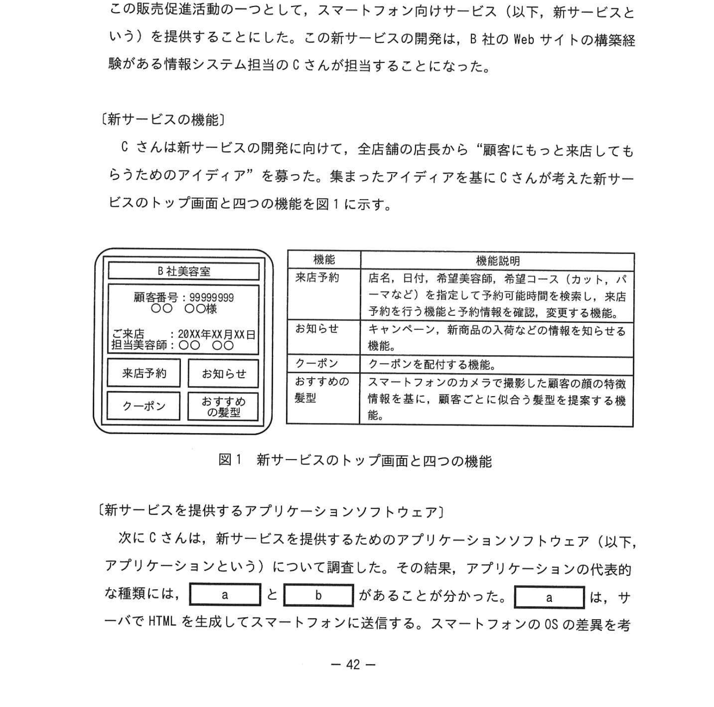
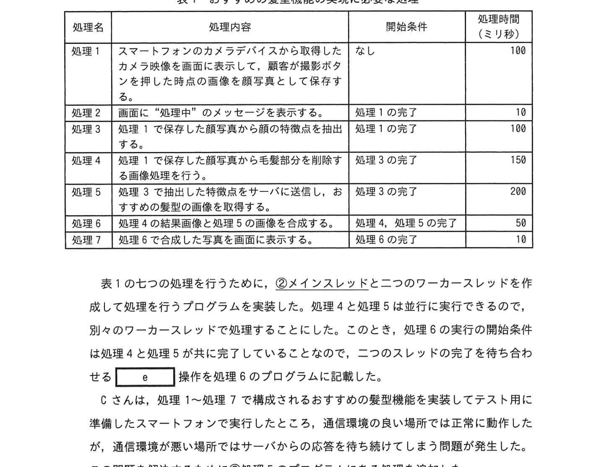

# 2023年秋期（令和5年度秋期）応用情報技術者試験 午後 問8（選択）
## 情報システム開発：美容室向けスマートフォンアプリ開発（マルチスレッド・ネイティブアプリ）

---

## 問題文

**問8** スレッド処理に関する次の記述を読んで、設問に答えよ。

B社は、首都圏に約50店の美容室を運営する美容室チェーンである。B社では顧客に顧客カードを発行し、B社の各店舗で顧客カードを持参した割引価格でサービスを提供している。近年、テレワークなどで外出機会が減ったことによって、顧客の来店回数が減少しており、売上げが減少の傾向にある。

そこで B 社では、顧客に美容室に来てもらうために販売促進活動を行うことにした。この販売促進活動の一つとして、スマートフォン向けサービス（以下、新サービスという）を提供することにした。この新サービスの開発は、B社の Web サイトの構築経験がある情報システム担当の C さんが担当することになった。

---

### 〔新サービスの機能〕

C さんは新サービスの開発に向けて、全店舗の店長から "顧客にもっと来店してもらうためのアイデア"を募った。集まったアイデアを基に C さんが考えた新サービスのトップ画面と四つの機能を図1に示す。

### 図1 新サービスのトップ画面と四つの機能

> | 機能 | 機能説明 |
> |---|---|
> | 来店予約 | 店名、日付、希望施術内容、希望コース（カット、パーマなど）を指定して予約可能時間を検索し、来店予約を行う機能及び予約情報を確認・変更する機能 |
> | お知らせ | キャンペーン、新商品のお知らせなどの情報を顧客に知らせる機能 |
> | クーポン | クーポンを配付する機能 |
> | おすすめの髪型 | スマートフォンのカメラを使って顧客顔の特徴情報を基に、顧客ごとに似合う髪型を提案する機能 |

---

### 〔新サービスを提供するアプリケーションソフトウェア〕

C さんは、新サービスを提供するためのアプリケーションソフトウェア（以下、アプリケーションという）について調査した。この結果、アプリケーションの代表的な種類には、`[　a　]` と `[　b　]` があることが分かった。`[　a　]` は、サーバで HTML を生成してスマートフォンに送信する。スマートフォンの OS の差異を考慮した開発は不要だが、カメラや GPS などのデバイスの利用が一部制限される。一方 `[　b　]` は、それ自体をスマートフォンにインストールして実行するもの（以下、スマホアプリという）。OS の差異を考慮した開発が必要であるが、カメラや GPS などのデバイスを制限なく利用できる。

この調査結果から C さんは、新サービスは `[　b　]` として開発することを提案し、上司の承認を得た。

---

### 〔トップ画面の開発〕

C さんは、Java 言語を用いてスマホアプリのトップ画面の開発に着手した。トップ画面を表示する画面処理環境の中で、顧客番号等の関連付けを行うとともに来店予約名、来店日付、担当美容師名などの情報をサーバから取得して画面に表示する処理を行うようにした。しかし、このスマホアプリの実行をしたところ、並列処理（例外）が発生し、スマホアプリの実行が中断された。

このエラーの原因を究明するために、スマートフォン上で動作する GUI アプリケーションにおける並行処理を行う仕組みについて調査を行った。スマートフォンの OS では、画面描画、画面操作などに関する処理を行う `[　c　]` をメインスレッドとし、メインスレッドと並行して比較的処理時間が長い処理を行う①**バックグラウンドスレッド（以下、ワーカースレッドという）**を分けて実行する必要があることが分かった。また、ワーカースレッドから画面ユーザーインタフェースに関する処理を行うことは②**禁止**されていることが分かった。

そこで、トップ画面の処理をメインスレッドとワーカースレッドとに分けて実装することに、トップ画面を完成させた。

---

### 〔おすすめ髪型機能の開発〕

C さんはおすすめ髪型機能の開発に着手した。おすすめ髪型機能の実現に必要な処理を表1に示す。なお、表1中の開始条件は当該処理の実行を開始するための必要な条件であり、処理時間は当該処理の実行に必要なスマートフォン内の計算時間と標準的な通信時間の合計時間である。

### 表1 おすすめ髪型機能の実現に必要な処理

> | 処理名 | 処理内容 | 開始条件 | 処理時間（ミリ秒） |
> |---|---|---|---|
> | 処理1 | スマートフォンのカメラデバイスから取得したカメラ画像を画面に表示して、顧客が撮影ボタンを押した時点の画面を静止画として保存する | なし | 100 |
> | 処理2 | 画面に "処理中" のメッセージを表示する | 処理1が完了 | 10 |
> | 処理3 | 保存した静止画から顔部分の情報を抽出する | 処理1が完了 | 100 |
> | 処理4 | 保存した静止画から毛髪部分を削除する | 処理3が完了 | 150 |
> | 処理5 | 処理3で抽出した特徴点をサーバに送信し、おすすめ髪型の候補を取得する | 処理3が完了 | 200 |
> | 処理6 | 処理4の合成画像と処理5の情報を合成する | 処理4・処理5が完了 | 50 |
> | 処理7 | 処理6の合成した画像を画面に表示する | 処理6が完了 | 10 |

表1の七つの処理を行うために、②**メインスレッドと二つのワーカースレッドを作成して処理を行うプログラムを実装した**。処理4と処理5は並行して実行できるので、別々のワーカースレッドで処理することとした。このとき、二つのスレッドの完了条件は処理4と処理5が共に完了していることなので、二つのスレッドの完了を待ち合わせる `[　e　]` 操作を行う。

C さんは、処理1〜7で構成されるおすすめ髪型機能を実装してテストに準備したスマートフォンで実行したところ、通信環境の良い場所では正常に動作したが、通信環境が悪い場所ではサーバからの応答を待ち続けてしまう問題が発生した。

この問題を解決するために③**処理5のプログラムにある処理を追加した**。その後、C さんはスマホアプリの全ての機能の開発とテストを完了させ、B 社は新サービスを用いた販売促進活動を開始した。

---

## 設問

### 設問1 本文中の `[　a　]`、`[　b　]` に入れる適切な字句を解答群の中から選び、記号で答えよ。

**解答群：**
- ア Java アプレット
- イ Web アプリケーション
- ウ コンソールアプリケーション
- エ ネイティブアプリケーション

### 設問2 〔トップ画面の開発〕について答えよ。

**(1)** 本文中の `[　c　]`、`[　d　]` に入れる適切な字句を解答群の中から選び、記号で答えよ。

**解答群：** ア イベント  イ ウィンドウ  ウ スレッド  エ プロセス

**(2)** 本文中の下線②について、ワーカースレッドで実行すべきでない処理を、解答群の中から選び、記号で答えよ。

**解答群：**
- ア サーバから取得した情報を画面に表示する処理
- イ サーバへのリクエストを送信する処理
- ウ ホスト名から IP アドレスを取得し TCP コネクションを確立する処理

### 設問3 〔おすすめ髪型機能の開発〕について答えよ。

**(1)** 本文中の下線①について、表1中の処理2〜処理7のうちメインスレッドで実行すべき処理名を全て答えよ。

**(2)** 本文中の `[　e　]` に入れる適切な操作を解答群の中から選び、記号で答えよ。

**解答群：** ア break  イ fork  ウ join  エ wait

**(3)** 本文中の下線③について、C さんが追加した処理の内容を20字以内で答えよ。

**(4)** おすすめ髪型機能を実行するために必要な処理時間は何ミリ秒か。ここで、通信は標準的な時間で実行できる。表1に記載の処理時間以外については無視できるものとする。

---

## 解答と解説

### 設問1

| 空欄 | 正解 | 解説 |
|---|---|---|
| **a** | イ（Web アプリケーション） | サーバで HTML 生成、カメラ等のデバイス利用が制限される |
| **b** | エ（ネイティブアプリケーション） | スマートフォンにインストール、カメラ・GPS など全デバイスを利用可 |

---

### 設問2

**(1)**

| 空欄 | 正解 | 解説 |
|---|---|---|
| **c** | エ（プロセス） | GUI アプリのメインスレッドを担うメインの実行単位 |
| **d** | ウ（スレッド） | ワーカースレッドはバックグラウンドのスレッド |

**(2) 正解：ア（サーバから取得した情報を画面に表示する処理）**

ワーカースレッドから GUI（画面ユーザーインタフェース）の更新は禁止されている。サーバ通信や計算処理はワーカースレッドで行い、画面更新はメインスレッドで行う。

---

### 設問3

**(1) 正解：処理2、処理7**

- **処理2**：画面に "処理中" メッセージを表示（GUI 操作 → メインスレッド必須）
- **処理7**：合成画像を画面に表示（GUI 操作 → メインスレッド必須）

**(2) 正解：ウ（join）**

join 操作は、スレッドの完了を待ち合わせる操作。処理4と処理5が共に完了してから処理6を開始するために使用する。

**(3) 正解：一定時間でタイムアウトする処理**

通信環境が悪い場所でサーバからの応答を無限に待ち続ける問題を解決するため、処理5（サーバへの送信・応答待ち）にタイムアウト処理を追加する。

**(4) 正解：460（ミリ秒）**

処理の依存関係を整理：
- 処理1（100ms）→ 処理3（100ms）→ 処理4（150ms）┐ → 処理6（50ms）→ 処理7（10ms）
- 処理1（100ms）→ 処理3（100ms）→ 処理5（200ms）┘
- 処理2（10ms）は処理1完了後すぐ（非クリティカルパス）

クリティカルパス：処理1 + 処理3 + 処理5（最長）+ 処理6 + 処理7
= 100 + 100 + 200 + 50 + 10 = **460ms**

---

## 参考：主要キーワード

| 用語 | 説明 |
|------|------|
| ネイティブアプリケーション | スマートフォンにインストールして動作するアプリ。カメラ等のデバイス利用が可能 |
| Web アプリケーション | サーバで処理してブラウザに HTML を返す形式のアプリ |
| マルチスレッド | 一つのプロセス内で複数のスレッドを並行実行する仕組み |
| メインスレッド | GUI の描画・操作を担当するスレッド。ユーザーからの入力を処理する |
| ワーカースレッド（バックグラウンドスレッド） | 時間のかかる処理をメインスレッドとは別に実行するスレッド |
| join 操作 | 別スレッドの処理完了を待ち合わせる操作 |
| タイムアウト | 一定時間応答がない場合に処理を中断する仕組み |
| クリティカルパス | 処理全体の中で最も時間のかかる処理の連鎖 |
| PWM | 関係なし（問7参照） |
| 競合状態（Race Condition） | 複数スレッドが共有資源に同時アクセスし不整合が生じる状態 |
