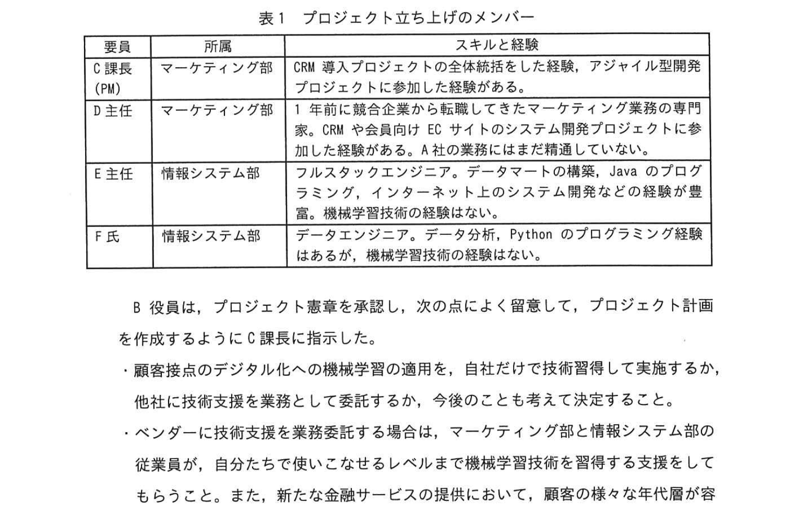
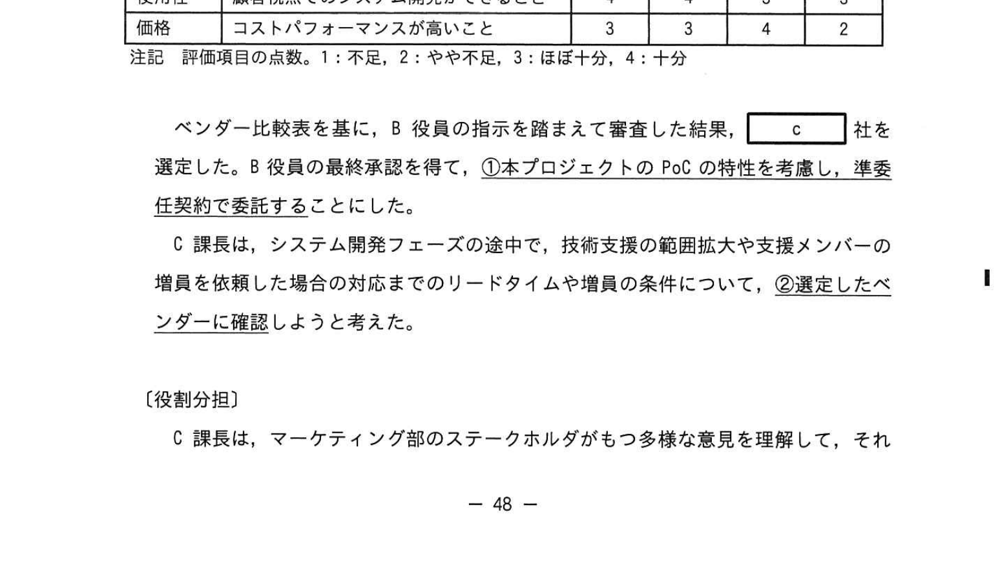

# 2023年秋期（令和5年度秋期）応用情報技術者試験 午後 問9（選択）
## プロジェクトマネジメント：金融サービス向け機械学習システム開発（PoC・アジャイル・ベンダー選定）

---

## 問題文

**問9** 新たな金融サービスを提供するシステム開発プロジェクトに関する次の記述を読んで、設問に答えよ。

A社は、様々な金融商品を扱う金融サービス業である。これまで、全国の支店網を通じて顧客を獲得・維持してきたが、ここ数年、顧客接点のデジタル化を進めた競合他社に顧客が流出している。そこで、A社は顧客流出を防ぐため、店頭での対面接客に加えて、認知・検索・行動・共有などの顧客接点をデジタル化し、顧客関係性を強化する新たな金融サービスを提供するために、新システムを開発するプロジェクト（以下、本プロジェクトという）の立ち上げを決定した。本プロジェクトはA社の取締役会で承認され、マーケティング部と情報システム部を統括する B役員がプロジェクト責任者となり、プロジェクトマネージャ（PM）にはマーケティング部の C課長が任命された。C課長は、本プロジェクトの立ち上げに着手した。

---

### 〔プロジェクトの立ち上げ〕

C課長は、プロジェクト憲章を次のとおりまとめた。

- **プロジェクトの目的：** 顧客接点をデジタル化することで、顧客関係性を強化する新たな金融サービスを提供する。
- **マイルストーン：** 本プロジェクト立ち上げ後6か月以内に、ファーストリリースする。ファーストリリース後の顧客との関係性強化の状況を評価して、その後のプロジェクトの計画を検討する。
- **スコープ：** 機械学習技術を採用し、スマートフォンを用いて顧客の好みやニーズに合わせた新たな金融サービスを提供する。マーケティング部のステークホルダは新たな金融サービスについて多様な意見をもち、プロジェクト実行中はその影響を受けるので頻繁なスコープの変更を想定する。
- **プロジェクトフェーズ：** 過去に経験が少ない新たな金融サービスの提供に、経験のない新たな技術である機械学習技術を採用するので、システム開発に先立ち、新たなサービスの提供と新たな技術の採用の両面で実現性を検証するPoCのフェーズを設ける。PoCフェーズの評価基準には、顧客関係性の強化の達成状況など、定量的な評価が可能な重要成功要因の指標を用いる。
- **プロジェクトチーム：** 表1のメンバーでプロジェクトを立ち上げ、適宜メンバーを追加する。

### 表1 プロジェクト立ち上げのメンバー

> | 要員 | 所属 | スキルと経験 |
> |---|---|---|
> | C課長（PM） | マーケティング部 | CRM 導入プロジェクトの全体統括をした経験、アジャイル型開発プロジェクトに参加した経験がある。 |
> | D主任 | マーケティング部 | 1年前に競合企業から転職してきたマーケティング業務の専門家。CRM や会員向け EC サイトのシステム開発プロジェクトに参加した経験がある。A社の業務にはまだ精通していない。 |
> | E主任 | 情報システム部 | フルスタックエンジニア。データマートの構築、Java のプログラミング、インターネット上のシステム開発などの経験が豊富。機械学習技術の経験はない。 |
> | F氏 | 情報システム部 | データエンジニア。データ分析、Python のプログラミング経験はあるが、機械学習技術の経験はない。 |

B 役員は、プロジェクト憲章を承認し、次の点によく留意して、プロジェクト計画を作成するように C課長に指示した。

- 顧客接点のデジタル化への機械学習の適用を、自社だけで技術習得して実施するか、他社に技術支援を業務として委託するか、今後のことも考えて決定すること。
- ベンダーに技術支援を業務委託する場合は、マーケティング部と情報システム部の従業員が、自分たちで使いこなせるレベルまで機械学習技術を習得する支援をしてもらうこと。また、新たな金融サービスの提供において、顧客の様々な年代層が容易に利用できるシステムの開発を支援できるベンダーを選定すること。なお、PoC では、技術面の検証業務を実施し、成果として検証結果をまとめたレポートを作成してもらうこと。
- 同業者から、自社だけで機械学習技術を習得しようとしたが、習得に2年掛かったという話も聞いたので、進め方には留意すること。

C課長は、B役員の指示を受けてメンバーと検討した結果、本プロジェクトは PoC を実施する点と、リリースまでに6か月しかない点、`[　a　]` 点を考慮し、アジャイル型開発アプローチを採用することにした。

C課長は、顧客接点のデジタル化への機械学習の適用を、自社だけで実施するか、他社に技術支援を業務委託するかを検討した。その結果、自社にリソースがない点と、`[　b　]` 点を考慮し、PoC とシステム開発の両フェーズで機械学習に関する技術支援をベンダーに業務委託することにした。

また、C課長は、PoC を実施しても、既知のリスクとして特定できない不確実性が残るので、プロジェクトが進むにつれて明らかになる未知のリスクへの対策として、プロジェクトの回復力（レジリエンス）を高める対策が必要と考えた。

---

### 〔ベンダーの選定〕

C課長は、機械学習技術に関する技術支援への対応が可能なベンダー7社について、ベンダーから提示された情報を基に、機械学習技術に関する現在の対応状況を調査した。

この調査に基づき、C課長は、技術習得とシステム開発の支援の提案を依頼するベンダーを4社に絞り込んだ。その上で、ベンダーからの提案書に対して五つの評価項目を定め、ベンダーを評価することとした。ベンダー4社に対して、提案を依頼し、提出された提案を基に、プロジェクトメンバーで評価項目について評価を行い、表2のベンダー比較表を作成した。

### 表2 ベンダー比較表

> | 評価項目 | 評価の観点 | P社 | Q社 | R社 | S社 |
> |---|---|---|---|---|---|
> | 事例数 | 金融サービス業の適用事例が豊富なこと | 3 | 3 | 3 | 4 |
> | 定着化 | 習得した機械学習技術の定着化サポートを含むこと | 2 | 4 | 3 | 4 |
> | 提案内容 | 他社と差別化できる技術であること | 4 | 3 | 4 | 3 |
> | 使用性 | 顧客視点でのシステム開発ができること | 4 | 4 | 3 | 3 |
> | 価格 | コストパフォーマンスが高いこと | 3 | 3 | 4 | 2 |
>
> 注記：評価項目の点数。1：不足、2：やや不足、3：ほぼ十分、4：十分

ベンダー比較表を基に、B役員の指示を踏まえて審査した結果、`[　c　]` 社を選定した。B役員の最終承認を得て、①**本プロジェクトの PoC の特性を考慮し、準委任契約で委託する**ことにした。

C課長は、システム開発フェーズの途中で、技術支援の範囲拡大や支援メンバーの増員を依頼した場合の対応までのリードタイムや増員の条件について、②**選定したベンダーに確認**しようと考えた。

---

### 〔役割分担〕

C課長は、マーケティング部のステークホルダがもつ多様な意見を理解して、それを本プロジェクトのプロダクトバックログとして設定するプロダクトオーナーの役割が重要であると考えた。C課長は、③**D主任が、プロダクトオーナーに適任であると考え**、D主任に担当してもらうことにした。

C課長は、プロジェクトチームのメンバーと協議して、PoC では、D主任の設定した仮説に基づき、プロダクトバックログを定め、プロジェクトの開発メンバーがベンダーの技術支援を受けて MVP（Minimum Viable Product）を作成することにした。そして、マーケティング部のステークホルダに試用してもらい、④**あるものを測定する**ことにした。

---

## 設問

### 設問1 〔プロジェクトの立ち上げ〕について答えよ。

**(1)** 本文中の `[　a　]` に入れる適切な字句を20字以内で答えよ。

**(2)** 本文中の `[　b　]` に入れる適切な字句を20字以内で答えよ。

### 設問2 〔ベンダーの選定〕について答えよ。

**(1)** 本文中の `[　c　]` に入れる適切な字句を、アルファベット1字で答えよ。また、`[　c　]` 社を選定した理由を、表2の評価項目の字句を使って20字以内で答えよ。

**(2)** 本文中の下線①について、準委任契約で委託することにしたのは本プロジェクトの PoC の特性として何を考慮したからか、適切なものを解答群の中から選び、記号で答えよ。

**解答群：**
- ア 既知のリスクとして特定できない不確実性が残る
- イ 実現性を検証することが目的である
- ウ 評価基準に重要成功要因の指標を用いる
- エ マーケティング部が MVP を試用する

**(3)** 本文中の下線②について、C課長が、ベンダーに確認する目的は何か、25字以内で答えよ。

### 設問3 〔役割分担〕について答えよ。

**(1)** 本文中の下線③について、D主任がプロダクトオーナーに適任だと考えた理由は何か、30字以内で答えよ。

**(2)** 本文中の下線④について、測定するものとは何か、15字以内で答えよ。

---

## 解答と解説

### 設問1

**(1) 正解：頻繁なスコープの変更を想定する（15字）**

プロジェクト憲章のスコープに「頻繁なスコープの変更を想定する」とあり、この点を考慮してアジャイル型開発アプローチを採用した（PoC実施・リリースまで6か月・頻繁なスコープ変更の3点）。

**IPA公式：頻繁なスコープの変更を想定する**

**(2) 正解：機械学習技術の習得の時間がない（15字）**

同業他社が技術習得に2年かかった話を踏まえ、リリースまで6か月しかない本プロジェクトでは自社で機械学習技術を習得する時間がないため、外部委託する根拠となる。

---

### 設問2

**(1) 正解：c=Q、定着化と使用性の両方が最高点だから**

B役員の指示は、従業員が使いこなせるレベルまでの習得支援（＝**定着化**）と、顧客の様々な年代層が容易に利用できるシステム開発（＝**使用性**）。この両項目とも4点なのはQ社のみ。したがってc=Q。

**IPA公式：c=Q、定着化と使用性の両方が最高点だから**

**(2) 正解：イ（実現性を検証することが目的である）**

PoC（概念実証）は、技術・サービスの実現可能性を検証することが目的。完成物の納入を保証する「請負契約」ではなく、作業の遂行を依頼する「準委任契約」が適切。

**(3) 正解：システム開発フェーズの回復力を確かめるため**

未知のリスクへの対策としてプロジェクトの回復力（レジリエンス）を高める必要がある。システム開発フェーズで技術支援の範囲拡大や増員に迅速に対応できるか（＝回復力）をベンダーに確認しておく。

**IPA公式：システム開発フェーズの回復力を確かめるため**

---

### 設問3

**(1) 正解：マーケティング業務と開発プロジェクト参加の経験があるから**

D主任はマーケティング業務の専門家であり、かつCRMや会員向けECサイトのシステム開発プロジェクトに参加した経験がある。この両方の経験があるため、プロダクトオーナーに適任である。

**IPA公式：マーケティング業務と開発プロジェクト参加の経験があるから**

**(2) 正解：重要成功要因の指標の値／顧客関係性の強化の達成状況**

MVPを試用した後、プロジェクト憲章に定めたPoCフェーズの評価（定量的な評価が可能な重要成功要因の指標の値、すなわち顧客関係性の強化の達成状況）を測定する。

**IPA公式：重要成功要因の指標の値（又は 顧客関係性の強化の達成状況）**

---

## 参考：主要キーワード

| 用語 | 説明 |
|------|------|
| PoC（Proof of Concept：概念実証） | 新技術・サービスの実現可能性を小規模に検証するフェーズ |
| アジャイル型開発 | 短いイテレーションを繰り返してプロダクトを段階的に完成させる開発手法 |
| MVP（Minimum Viable Product） | 顧客に提供できる最小限の機能を持つ製品・プロトタイプ |
| プロダクトオーナー | アジャイル開発でバックログを管理し、ステークホルダの要求を整理する役割 |
| プロダクトバックログ | アジャイル開発で優先順位付けられた機能・要件の一覧 |
| 準委任契約 | 作業・サービスの遂行を依頼する契約。成果物の完成責任なし |
| 請負契約 | 成果物の完成・納入を約束する契約。完成責任あり |
| レジリエンス（回復力） | 予期しないリスクが発生しても回復・適応できる能力 |
| 機械学習 | データからパターンを自動的に学習するAI技術 |
| 重要成功要因（KSF） | 目標達成に欠かせない要因。PoC 評価基準として活用 |
