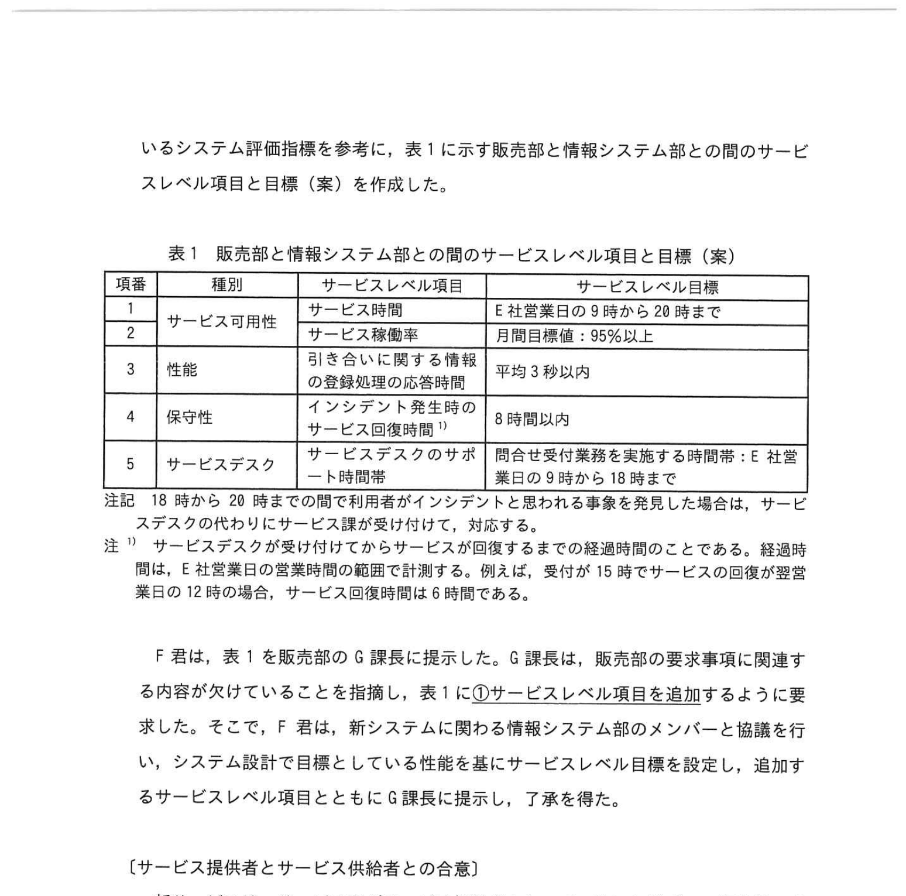
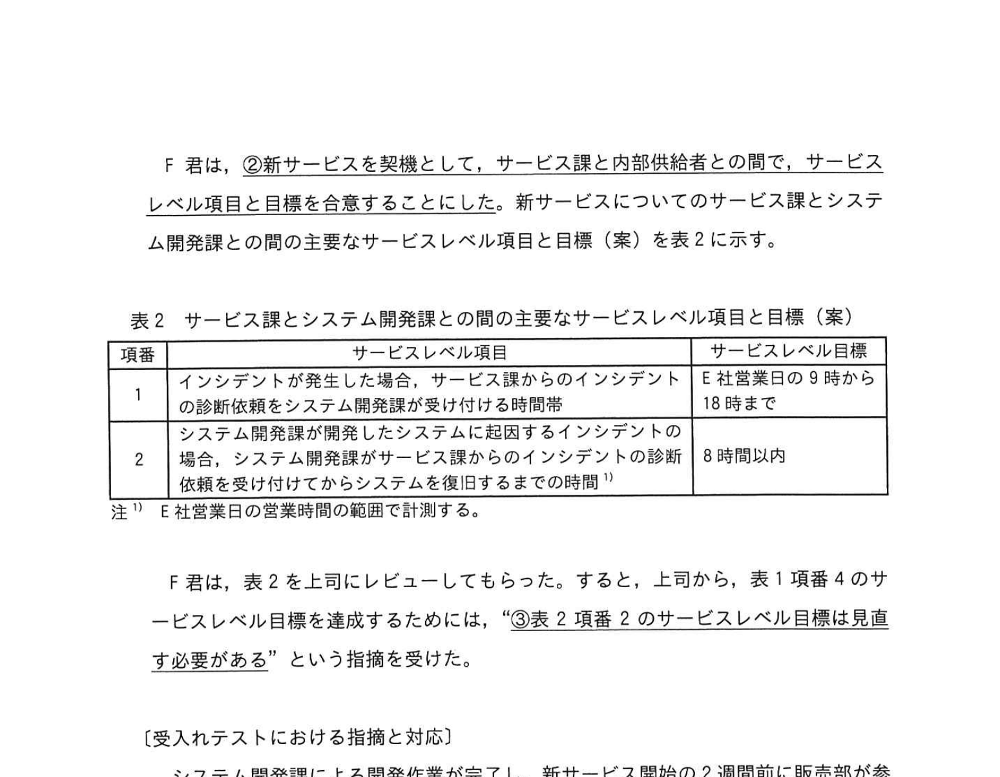

# 2023年秋期（令和5年度秋期）応用情報技術者試験 午後 問10（選択）
## サービスマネジメント：販売管理システム刷新に伴う SLA・サービスレベル管理（内部供給者との合意）

---

## 問題文

**問10** サービスレベルに関する次の記述を読んで、設問に答えよ。

E社は防犯カメラ、入退室認証機器、監視モニターなどのオフィス用セキュリティ機器を製造販売する中堅企業である。E社の販売部の販売担当者は、E社営業日の営業時間である9時から18時までの間、販売活動を行っている。E社の情報システム部では、販売管理システム（以下、現システムという）、製品管理システム、社内 Web システムなどを開発、運用し、社内の利用者にサービスを提供している。現システムは、納入先の所在地、納入先との取引履歴などの納入先情報を管理し、製品管理システムは、製品の仕様、在庫などの情報を管理する。社内 Web システムは24時間365日運用されており、E社の従業員は、業務に役立つ情報を、社内 Web システムを用いて、いつでも参照することができる。

情報システム部には、サービス課、システム開発課及びシステム運用課がある。サービス課には複数のサービスチームが存在し、サービスレベル管理など、サービスマネジメントを行う。システム開発課は、システムの開発及び保守を担当する。システム運用課は、システムの運用及び IT 基盤の管理を担当する。

販売担当者を利用者として提供される販売管理サービス（以下、現サービスという）は現システムによって実現されている。販売担当者は、納入先から製品の引き合いがあった場合、まず現システムで納入先情報を検索して、引き合いに関する情報を登録する作業を行う。次に、現システムと製品管理システムの両システムに何度もアクセスして情報を検索したり、情報を登録したりする作業があり、最後に表示される納期と価格の情報を取り込んだ納入先への提案に時間が掛かっている。販売部は16時までに受けた引き合いは、当日の営業時間内に納入先に納期と価格の提案を行うことを目標にしているが、引き合いが多いと納入先への提案まで2時間以上掛かることもあり、目標が達成できなくなる。販売部が行う納入先への提案は販売部の重要な事業機能であるので、販売部は現サービスの改善を要求事項として情報システム部に提示していた。

そこで、情報システム部は、販売部の要求事項に対応するため、現システムに改修を加えたものを新システムとし、来年1月から新サービスとして提供することになった。

---

### 〔新サービスとサービスマネジメントの概要〕

販売部のG課長が業務要件を取りまとめ、システム開発課が現システムを改修し、システム運用課が IT 基盤を用いて新システムを運用する。販売担当者が現サービスと同様に引き合いに関する情報を新システムに登録して、提案情報作成を新システムに要求すると、新サービスでは新システムと製品管理システムとが連動して処理を実行し、提案に必要となる納期と価格の情報を表示する。

新サービスのサービスマネジメントについては、現サービス同様に、サービス課販売サービスチームの F 君が担当する。サービス課では、従来からサービスデスク機能をコールセンター会社の Y 社に委託しており、新サービスについても、利用者からの問合せは、サービスデスクが直接受け付けて、利用者に回答を行う。問合せの内容が、インシデント発生に関わる内容の場合は、サービスデスクから販売サービスチームにエスカレーションされ、情報システム部で対応し、対応完了後、販売サービスチームは、サービスデスクに対応完了の連絡をする。例えば、一部のストレージ障害が疑われる場合は、販売サービスチームはシステム運用課にインシデントの診断を依頼し、システム運用課が障害箇所を特定する。その後、システム運用課で当該ストレージを復旧させ、販売サービスチームに復旧の連絡を行う。販売サービスチームはサービスデスクに連絡し、サービスデスクでは、サービスが利用できることを利用者に確認してサービス回復とする。

---

### 〔サービスレベル項目と目標の設定〕

社内に提供するサービスについて、これまで情報システム部は、社内の利用部門との間で SLA を合意していなかったが、新サービスではサービスレベル項目と目標を明確にし、販売部と情報システム部との間で SLA を合意することにした。そこで、情報システム部が情報システム部長の指示のもとで、販売部の要求事項と実現可能性を考慮しながらサービスレベル項目と目標の案を作成し、新サービスの利害関係者と十分にレビューを行って合意内容を決定することとなった。F君が新サービスの SLA を作成する責任者となり、販売部との合意の前に、新システムの開発及び運用を担うシステム開発課及びシステム運用課のメンバーと協力して SLA のサービスレベル項目と目標を作成することにした。

F君は、システム開発課がシステム設計を完了する前に、現システムで測定されているシステム評価指標を参考に、表1に示す販売部と情報システム部との間のサービスレベル項目と目標（案）を作成した。

### 表1 販売部と情報システム部との間のサービスレベル項目と目標（案）

> | 項番 | 種別 | サービスレベル項目 | サービスレベル目標 |
> |---|---|---|---|
> | 1 | サービス可用性 | サービス時間 | E社営業日の9時から20時まで |
> | 2 | （サービス可用性） | サービス稼働率 | 月間目標値：95%以上 |
> | 3 | 性能 | 引き合いに関する情報の登録処理の応答時間 | 平均3秒以内 |
> | 4 | 保守性 | インシデント発生時のサービス回復時間¹⁾ | 8時間以内 |
> | 5 | サービスデスク | サービスデスクのサポート時間帯 | 問合せ受付業務を実施する時間帯：E社営業日の9時から18時まで |
>
> 注記：18時から20時までの間で利用者がインシデントと思われる事象を発見した場合は、サービスデスクの代わりにサービス課が受け付けて、対応する。
> 注1)：サービスデスクが受け付けてからサービスが回復するまでの経過時間のことである。経過時間は、E社営業日の営業時間の範囲で計測する。例えば、受付が15時でサービスの回復が翌営業日の12時の場合、サービス回復時間は6時間である。

F君は、表1を販売部の G 課長に提示した。G 課長は、販売部の要求事項に関連する内容が欠けていることを指摘し、表1に①**サービスレベル項目を追加するように要求した**。そこで、F 君は、新システムに関わる情報システム部のメンバーと協議を行い、システム設計で目標としている性能を基にサービスレベル目標を設定し、追加するサービスレベル項目とともに G 課長に提示し、了承を得た。

---

### 〔サービス提供者とサービス供給者との合意〕

新サービスは、サービス課がサービス提供者となって、SLA に基づいて販売部にサービス提供される。サービス提供に際しては、外部供給者としてY社が、内部供給者としてシステム開発課及びシステム運用課が関与する。

サービスデスクについてのサービスレベル目標の合意は、従来、サービス課とY社との間で `[　a　]` として文書化されている。この中で、サービス課は、合意の前提となる問合せ件数が大きく増減する場合は、1か月前に Y社に件数を提示することになっている。Y社は、提示された問合せ件数に基づき作業負荷を見積もり、サービスデスク要員の体制を確保する。

F 君は、②**新サービスを契機として、サービス課と内部供給者との間で、サービスレベル項目と目標を合意することにした**。新サービスについてのサービス課とシステム開発課との間の主要なサービスレベル項目と目標（案）を表2に示す。

### 表2 サービス課とシステム開発課との間の主要なサービスレベル項目と目標（案）

> | 項番 | サービスレベル項目 | サービスレベル目標 |
> |---|---|---|
> | 1 | インシデントが発生した場合、サービス課からのインシデントの診断依頼をシステム開発課が受け付ける時間帯 | E社営業日の9時から18時まで |
> | 2 | システム開発課が開発したシステムに起因するインシデントの場合、システム開発課がサービス課からのインシデントの診断依頼を受け付けてからシステムを復旧するまでの時間¹⁾ | 8時間以内 |
>
> 注1)：E社営業日の営業時間の範囲で計測する。

F 君は、表2を上司にレビューしてもらった。すると、上司から、表1項番4のサービスレベル目標を達成するためには、③**表2項番2のサービスレベル目標は見直す必要がある**という指摘を受けた。

---

### 〔受入テストにおける指摘と対応〕

システム開発課による開発作業が完了し、新サービス開始の2週間前に販売部が参画する新サービスの受入れテストを開始した。受入れテストを行った結果、販売部から情報システム部に対して、次の評価と指摘が挙がった。

- 機能・性能とも大きな問題はなく、新サービスを開始してよいと判断できる。
- 新サービスの操作方法を説明したマニュアルは整備されているが、提案情報作成を要求する処理に関してはサービスデスクへの問合せが多くなると想定される。

F君は、サービスデスクへの問合せ件数が事前の想定よりも多くなる懸念を感じた。Y社担当者とも検討し、④**新サービス開始時点の問合せ件数を削減する対応が必要と考えた**。そこで、利用者が参照できる⑤**FAQ を社内 Web システムに掲載する**ことによって、新サービスの操作方法についてマニュアルで解決できない疑問が出た場合は、利用者自身で解決できるように準備を進めることにした。

---

## 設問

### 設問1 〔サービスレベル項目と目標の設定〕について、本文中の下線①でG課長が追加するよう要求したサービスレベル項目として適切な内容を解答群の中から選び、記号で答えよ。

**解答群：**
- ア 製品の引き合いを受けてから提案するまでに要する時間
- イ 納入先情報の検索時間
- ウ 販売担当者が提案情報作成を新システムに要求してから納期と価格の情報が表示されるまでに要する時間
- エ 販売担当者が提案情報作成を新システムに要求するときの新システムにおける同時処理可能数

### 設問2 〔サービス提供者とサービス供給者との合意〕について答えよ。

**(1)** 本文中の `[　a　]` に入れる適切な字句を解答群の中から選び、記号で答えよ。

**解答群：** ア 契約書  イ サービスカタログ  ウ サービス要求の実現に関する指示書  エ リリースの受入れ基準書

**(2)** 本文中の下線②で、F君が、サービス課と内部供給者との間でサービスレベル項目と目標を合意することにした理由を、40字以内で答えよ。

**(3)** 本文中の下線③でサービスレベル目標を見直すべき理由は何か、40字以内で答えよ。

### 設問3 〔受入テストにおける指摘と対応〕について答えよ。

**(1)** 本文中の下線④について、F君が、問合せ件数を削減する対応が必要と考えた理由は何か、サービスデスク運用の観点から、25字以内で答えよ。

**(2)** 本文中の下線⑤の方策は、サービスデスクへの問合せ件数が削減されるだけでなく、利用者にとっての利点も期待できる。利用者にとっての利点を40字以内で答えよ。

---

## 解答と解説

### 設問1

**正解：ウ（販売担当者が提案情報作成を新システムに要求してから納期と価格の情報が表示されるまでに要する時間）**

G課長の要求事項は「引き合いの当日に納期と価格の提案を行う」こと。表1に抜けている性能指標は、新システムで提案情報作成を要求してから納期と価格の情報が表示されるまでの応答時間である。

---

### 設問2

**(1) 正解：ア（契約書）**

Y社は外部のコールセンター会社（外部供給者）であり、サービス課とY社との間のサービスレベル目標の合意は**契約書**として文書化される。OLA（運営レベル合意書）は組織内部の部門間で合意するものなので、外部委託先のY社との間では不適。

**IPA公式：ア（契約書）**

**(2) 正解：表1のサービスレベル目標の達成には、内部供給者との目標の合意が必要だから（38字）**

外部のサービスレベル（SLA）を達成するために、内部供給者（システム開発課・運用課）との間でも同等の目標（OLA）を合意する必要がある。

**(3) 正解：サービス回復時間にはシステム開発課以外で実施する作業の時間も含まれるから（38字）**

表2のサービスレベル目標（8時間以内でシステム復旧）と表1のサービスレベル目標（8時間以内のサービス回復）が同じ8時間では、サービスデスクへの連絡やユーザー確認の時間を含む余裕がない。

---

### 設問3

**(1) 正解：サービスデスク要員の体制が確保できないから（22字）**

Y社への問合せ件数は1か月前に提示するが、実際に想定より多くなると体制確保が間に合わない。問合せ件数を削減することで体制超過のリスクを低減する必要がある。

**(2) 正解：サービスデスクのサポート時間帯以外でも、利用者が疑問を解決できる。**

FAQ を社内 Web システムに掲載することで、サービスデスクの対応時間外（18時以降など）でも利用者が自己解決できるようになる。

---

## 参考：主要キーワード

| 用語 | 説明 |
|------|------|
| SLA（Service Level Agreement） | サービス提供者と利用者の間で合意するサービスレベルの文書 |
| OLA（Operational Level Agreement） | 組織内部の部門間で合意するサービスレベルの文書 |
| サービスレベル目標 | SLA で定める個々の指標の目標値 |
| サービス稼働率 | サービスが利用可能だった時間の割合（= 稼働時間 / 計画時間） |
| サービス回復時間 | 障害発生（受付）からサービス回復確認までの経過時間 |
| インシデント | サービスの停止・品質低下を引き起こす予期しない事象 |
| エスカレーション | 一次対応で解決できない問合せを上位の専門部門に引き継ぐプロセス |
| サービスデスク | 利用者からの問合せ・インシデントを一元受付するコンタクトポイント |
| FAQ | Frequently Asked Questions。よくある質問と回答集 |
| 内部供給者 | サービス提供者の内部でサービス実現を担う部門（システム開発課等） |
