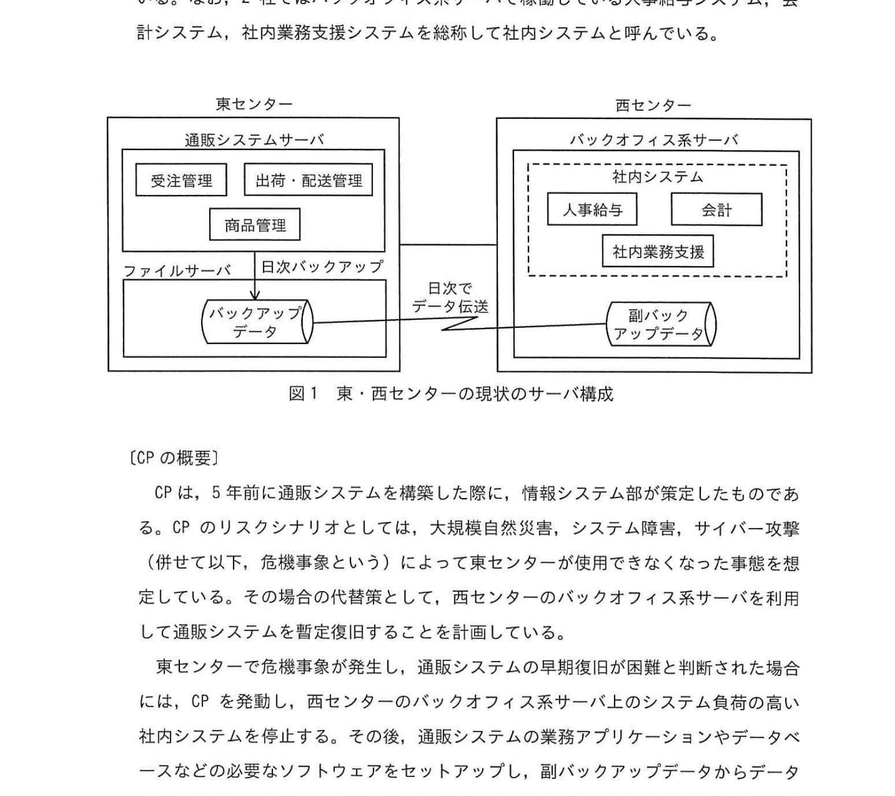
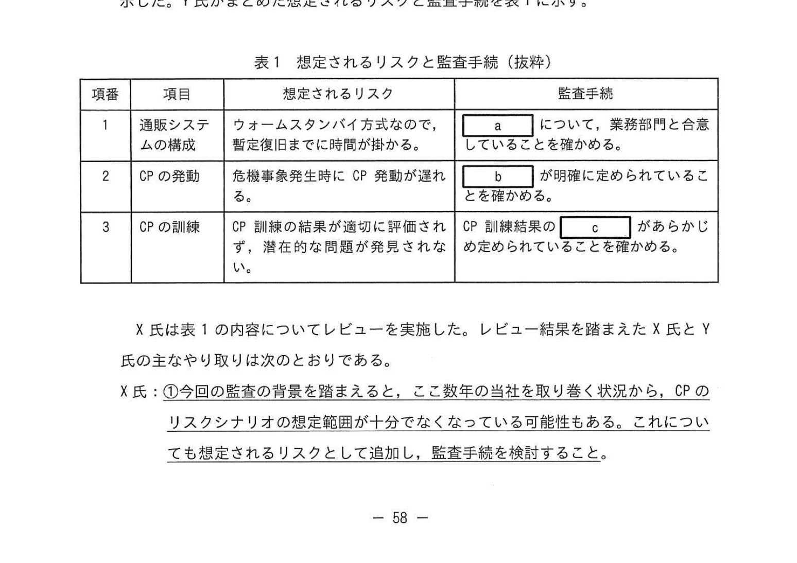

# 2023年秋期（令和5年度秋期）応用情報技術者試験 午後 問11（選択）
## システム監査：通販システムのコンティンジェンシー計画の実効性監査

---

## 問題文

**問11** 情報システムに係るコンティンジェンシー計画の実効性の監査に関する次の記述を読んで、設問に答えよ。

Z社は、中堅の通信販売業者である。ここ数年、通信販売需要の増加を追い風に顧客数及び売上げが増え、業績については概ね良好に推移している。その一方で、システム障害発生時の影響の拡大、サイバー攻撃（総称して、危機事象という）によって東センターが使用できなくなった事態を想定している。そのような危機事象の総合的代替策として、西センターのバックオフィス系サーバを利用して通販システムを暫定復旧することを計画している。

Z社では情報システム部にサービスを利用する従業員などを対象に情報システム部が管理する通販システム、バックオフィス系サーバに関する各種対応を行っている。また、Z社ではバックオフィス系サーバで稼働している人事給与システム、会計システム、社内業務支援システムを総称して社内システムと呼んでいる。

---

### 図1 東・西センターの現状のサーバ構成

> **東センター：**
> - 通販システムサーバ（受注管理・出荷・配送管理・商品管理）
> - ファイルサーバ（日次バックアップデータ）
>
> **西センター：**
> - バックオフィス系サーバ（社内システム：人事給与・会計・社内業務支援）
> - 副バックアップデータ
>
> 日次でデータ転送（東→西）

---

### 〔CPの概要〕

CP（コンティンジェンシー計画）は、5年前に通販システムを構築した際に、情報システム部が策定したものである。CP のリスクシナリオとしては、大規模自然災害、システム障害、サイバー攻撃（総称して、危機事象という）によって東センターが使用できなくなった事態を想定している。

東センターで危機事象が発生し、通販システムの稼働継続が困難になった場合は、CP を発動し、西センターのバックオフィス系サーバにシステム負荷の高い社内システムの稼働を停止した後、通販システムの業務アプリケーションやデータベースなどの必要なソフトウェアをセットアップし、副バックアップデータからデータベースを復元する。また、ネットワークの切替えを含む必要な環境設定を行い、通販システムを暫定起動するためが計画になっている。5年前の通販システム稼働後に、CP を発動した実績はない。

---

### 〔CPの訓練状況〕

5年前の通販システム稼働直前に、西センターのバックオフィス系サーバにおいて、復旧テストを実施した。復旧テストでは、副バックアップデータからデータベースが正常に復元できることを確認している。また、最悪の場合に必要な処理能力が後続できることを確認している。

通販システム稼働後の CP の訓練は、訓練計画に従い、あらかじめ作成された訓練シナリオを基に、毎年実施訓練を実施している。具体的には、西センターで稼働中の社内システムの業務アプリケーションとデータベースなどの必要なソフトウェアをセットアップし、副バックアップデータを使用したデータベースの復元訓練を実施している。さらに、ネットワークの切替えを含む必要な環境設定を行い、通販システムを暫定起動するところまで行っている。CP の発動以降の訓練結果は、大きな問題は見つかっていない。CP の見直しは行われていない。

内部監査室は、予備調査の結果を基に本調査に向けた準備を開始した。

---

### 〔本調査に向けた準備〕

X 氏は、Y 氏に予備調査結果から想定されるリスクと監査手続を整理するように指示した。X氏がまとめた監査手続（抜粋）を表1に示す。

### 表1 想定されるリスクと監査手続（抜粋）

> | 項番 | 項目 | 想定されるリスク | 監査手続 |
> |---|---|---|---|
> | 1 | 通販システムの構成 | フォームスタンバイ方式などで、暫定起動までに時間がかかることを確認する | `[　a　]` について、業務部門と合意していることを確認する。 |
> | 2 | CP の発動 | 危機事象発生時に CP が発動できないリスク | `[　b　]` が明確に定められていることを確認する。 |
> | 3 | CP の訓練 | CP 訓練計画が適切に策定されず、潜在的な問題が発見されないリスク | CP 訓練内容に、`[　c　]` があらかじめ定められていることを確認する。 |

X 氏は表1の内容についてレビューを実施した。レビュー結果を踏まえた X 氏と Y 氏の主なやり取りは次のとおりである。

- X 氏：①**今回の監査の背景を踏まえると、ここ数年当社の売り上げ状況から、CP のリスクシナリオの想定が不十分となっている可能性がある。これについても想定されるリスクとして追加し、監査手続を検討すること。**
- Y 氏：承知した。
- X 氏：CP の訓練に関連して、西センターでの復旧テストの実施時期がシステム稼働前であり、その後の変更状況を考慮すると、CP 発動時に暫定復旧後の通販システムで問題が発生するリスクが考えられる。これについても監査手続を作成すること。
- Y 氏：承知した。監査手続で確認すべき具体的なポイントとしては、通販システムが確認できることを `[　d　]` していることを、同様に考えられる。
- X 氏：それよりも、現在の CP の訓練内容について、CP 発動時に暫定復旧が円滑に実施できないリスクがあるので、監査手続を作成すること。
- Y 氏：それよりも、最低限刷上上での可能でない `[　e　]` という問題ないかを確認する。
- X 氏：さらに、通販システムの暫定復旧計画において、バックオフィス系サーバの社内システムを停止することによる影響が懸念されるので、それについても確認しておいた方がよい。

レビューの結果を受けて、Y 氏は監査手続の見直しに着手した。

---

## 設問

### 設問1 表1中の `[　a　]` ～ `[　c　]` に入れる最も適切な字句を解答群の中から選び、記号で答えよ。

**解答群：**
- ア CP 訓練
- イ CP 発動基準
- ウ 環境設定
- エ 機能要件
- オ 評価項目
- カ 目標復旧時間

### 設問2 本文中の下線①について、監査手続の検討時に考慮すべきリスクを二つ挙げ、それぞれ25字以内で答えよ。

### 設問3 本文中の `[　d　]`、`[　e　]` に入れる適切な字句を、それぞれ15字以内で答えよ。

### 設問4 本文中の `[　f　]` に入れる適切な字句を、25字以内で答えよ。

### 設問5 本文中の下線②について、どのような影響が懸念されるか、25字以内で答えよ。

---

## 解答と解説

### 設問1

| 空欄 | 正解 | 解説 |
|---|---|---|
| **a** | カ（目標復旧時間） | CP 発動後の通販システム暫定起動までの目標時間を業務部門と合意しておく必要がある |
| **b** | イ（CP 発動基準） | CP をいつ・どの条件で発動するかを明確に定めておかないと発動できない |
| **c** | ア（CP 訓練） | 訓練内容・評価基準などがあらかじめ計画に含まれていることを確認する |

---

### 設問2

**正解：（二つのうちいずれか）**

① **通販システムの処理量増大により、西センターのバックオフィス系サーバの処理能力が不足するリスク（42字）**

→ ここ数年で売上げ・顧客数が増大しており、5年前の復旧テスト時と比べてシステム負荷が大幅に増加している可能性がある。

② **通販システムの拡張や機能追加により、CP のリスクシナリオが陳腐化しているリスク（39字）**

→ 5年間 CP を見直していないため、現在の通販システム構成や業務要件に対応できていない可能性がある。

---

### 設問3

| 空欄 | 正解 | 解説 |
|---|---|---|
| **d** | 現在の通販システムで確認 | 5年前の構成と現在の構成の差分を検証する必要がある |
| **e** | 現在の環境で実施できること | 現在のバックオフィス系サーバで CP 訓練が実施できるか確認 |

---

### 設問4

**正解：バックオフィス系サーバの処理能力が通販システムに十分か（27字）**

CP 発動時に通販システムをバックオフィス系サーバに移行するが、処理能力（キャパシティ）が現在の通販システムの負荷に耐えられるかを確認する必要がある。

---

### 設問5

**正解：社内システムが停止することによる業務への影響（22字）**

CP 発動時に西センターのバックオフィス系サーバで稼働している人事給与・会計・社内業務支援システムを停止するため、社内業務が停止するリスクがある。

---

## 参考：主要キーワード

| 用語 | 説明 |
|------|------|
| コンティンジェンシー計画（CP） | 危機事象発生時の事業継続・システム復旧のための対応計画 |
| BCP（Business Continuity Plan） | 業務継続計画。CP はシステムに特化した BCPの一部 |
| RTO（目標復旧時間） | システム障害から復旧するまでの目標時間 |
| RPO（目標復旧時点） | データを復旧する際の目標となる時点（どこまで巻き戻りを許容するか） |
| ウォームスタンバイ | 予備サーバを起動状態で保持し切替えに短時間で対応できる方式 |
| 副バックアップデータ | 西センターに日次転送されたバックアップデータ |
| フォームスタンバイ | 予備システムが停止状態で起動まで時間がかかる方式 |
| システム監査 | 情報システムのリスク管理・統制状況を第三者が評価・検証すること |
| 予備調査 | 本調査に先立ち、監査対象の概要を把握するための調査 |
| 訓練シナリオ | CP 訓練で使用する手順・想定シナリオ。定期的な見直しが必要 |
