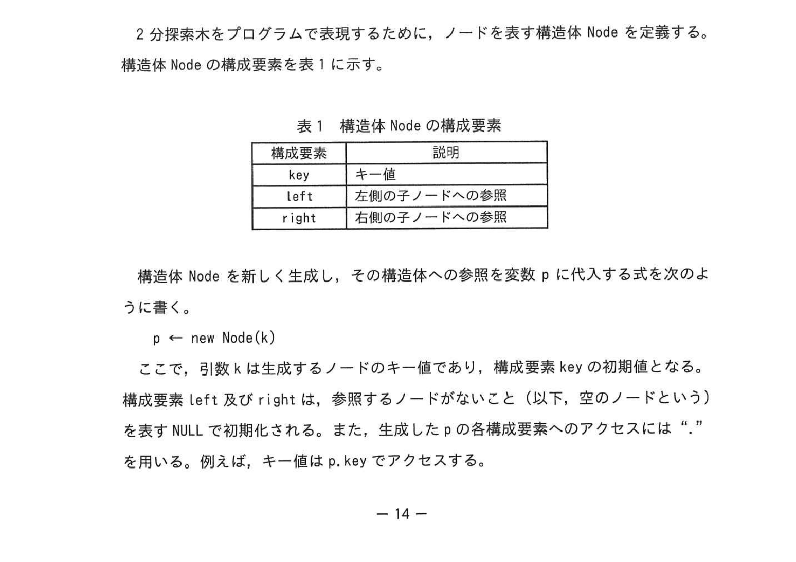
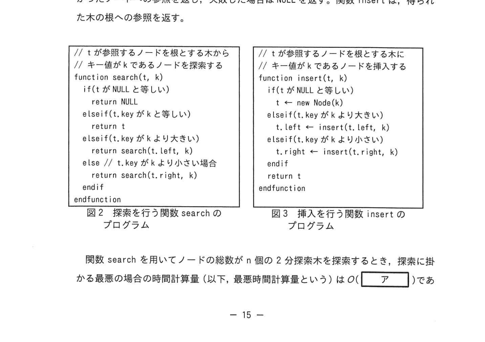
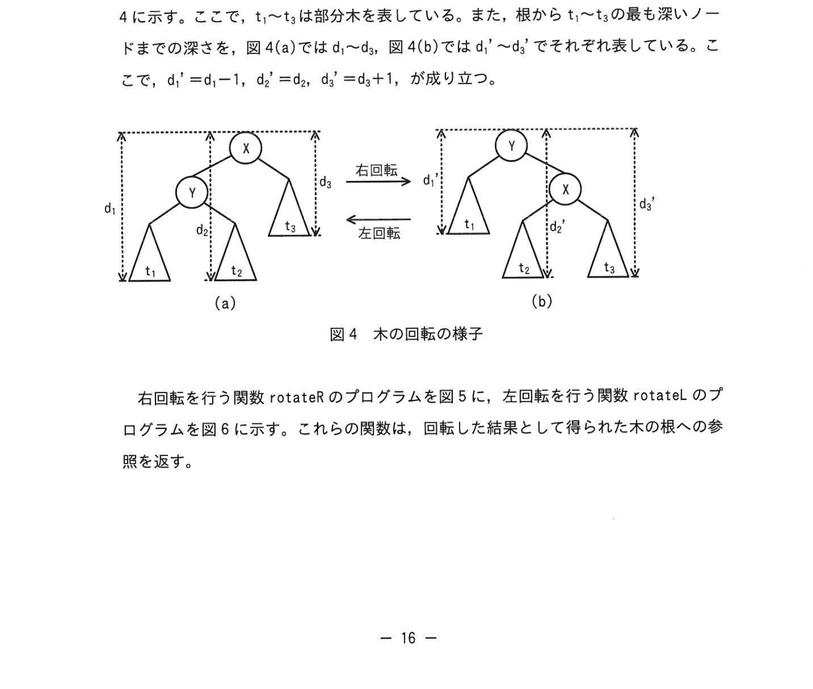
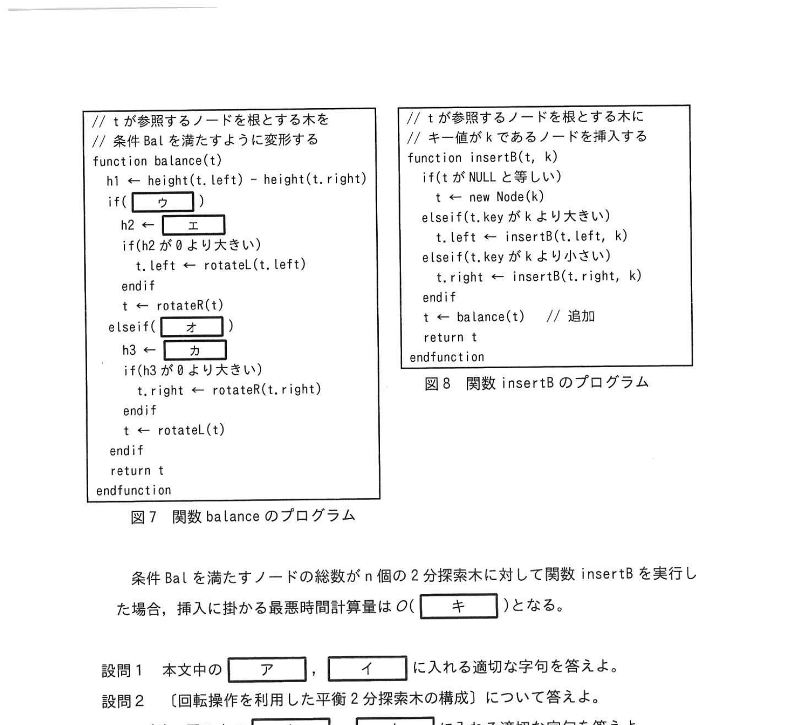

# 2023年秋期（令和5年度秋期）応用情報技術者試験 午後 問3（選択）
## プログラミング：AVL木（平衡2分探索木）の探索・挿入・回転操作

---

## 問題文

**問3** 2分探索木に関する次の記述を読んで、設問に答えよ。

2分探索木とは、木に含まれる全てのノードがキー値をもち、各ノードNが次の二つの条件を満たす2分木のことである。ここで、重複したキー値をもつノードは存在しないものとする。

- Nの左側の部分木にある全てのノードのキー値は、Nのキー値よりも小さい。
- Nの右側の部分木にある全てのノードのキー値は、Nのキー値よりも大きい。

### 図1 2分探索木の例



> 根=6、左=3（左子=1、右子=5）、右=9

---

### 〔2分探索木におけるノードの探索・挿入〕

**構造体 Node の構成要素：**

| 構成要素 | 説明 |
|---|---|
| key | キー値 |
| left | 左側の子ノードへの参照 |
| right | 右側の子ノードへの参照 |

ノードを新しく生成し、その構造体への参照を変数 p に代入する式：
```
p ← new Node(k)
```

**キー値 k をもつノードの探索・挿入手順（再帰的アルゴリズム）：**

1. 探索対象の2分探索木の根を参照する変数を t とする。
2. t が空のノードであれば、探索失敗と判断して探索を終了する。
   - t のキー値 = k の場合、探索成功と判断して探索を終了する。
   - t.key < k の場合、t の右側の子ノードを新たな t として(2)から処理を行う。
   - t.key > k の場合、t の左側の子ノードを新たな t として(2)から処理を行う。

---

### 図2 探索を行う関数 search・図3 挿入を行う関数 insert のプログラム



```
// tが参照するノードを根とする木から       // tが参照するノードを根とする木に
// キー値がkであるノードを探索する          // キー値がkであるノードを挿入する
function search(t, k)                      function insert(t, k)
  if(t が NULL と等しい)                     if(t が NULL と等しい)
    return NULL                                t ← new Node(k)
  elseif(t.key が k と等しい)               elseif(t.key が k より大きい)
    return t                                   t.left ← insert(t.left, k)
  elseif(t.key が k より小さい)             else
    return search(t.left, k)                   t.right ← insert(t.right, k)
  else                                       endif
    return search(t.right, k)               return t
  endif                                    endfunction
endfunction
```

関数 search を用いて n 個の2分探索木を探索するとき、探索に掛かる最悪の場合の時間計算量（以下、最悪時間計算量という）は O(`[　ア　]`) である。

---

### 〔2分探索木における回転操作〕

全てのノードについて左右の部分木の高さの差が1以下という条件（以下、条件 Bal という）を考える。条件 Bal を満たす木は、完全に近い2分探索木なので高速に探索できる。

2分探索木中のノード X と X の左側の子ノード Y について、X を Y の右側の子に、Y の右側の部分木を X の左側の部分木にする変形操作を**右回転**といい、逆の操作を**左回転**という。

### 図4 木の回転の様子



> - (a) → 右回転 → (b)：X が根、Y が左側の子。右回転後は Y が根、X が右側の子になる
> - d₁' = d₁, d₂' = d₂, d₃' = d₃+1 の関係が成り立つ

---

### 〔回転操作を利用した平衡2分探索木の構成〕

条件 Bal を満たすために次の手順に従って変形する：

**(1) T の左側の部分木の高さが T の右側の部分木の高さより2大きい場合**
T を根とする部分木に対して右回転を行う。ただし、T の左側の子ノード V について、V の右側の部分木の方が V の左側の部分木より高い場合、先に V を根とする部分木に対して左回転を行う。

**(2) T の右側の部分木の高さが T の左側の部分木の高さより2大きい場合**
T を根とする部分木に対して左回転を行う。ただし、T の右側の子ノード V について、V の左側の部分木の方が V の右側の部分木より高い場合、先に V を根とする部分木に対して右回転を行う。

### 図7 関数 balance・図8 関数 insertB のプログラム



```
// tが参照するノードを根とする木を        // tが参照するノードを根とする木に
// 条件Balを満たすように変形する           // キー値kであるノードを挿入する
function balance(t)                       function insertB(t, k)
  h1 ← height(t.left) - height(t.right)    if(t が NULL と等しい)
  h2 ← [　ウ　]                              t ← new Node(k)
  if(h2 が大きい)                           elseif(t.key が k より大きい)
    t.left ← rotateL(t.left)                 t.left ← insertB(t.left, k)
  endif                                     else
  t ← rotateR(t)                            t.right ← insertB(t.right, k)
  elseif[　オ　]                           endif
    h3 ← [　カ　]                           t ← balance(t)  // 追加
    if(h3 が大きい)                         return t
      t.right ← rotateR(t.right)          endfunction
    endif
    t ← rotateL(t)
  endif
  return t
endfunction
```

条件 Bal を満たすノードの総数が n 個の2分探索木に対して、関数 insertB を実行した場合、挿入に掛かる最悪時間計算量は O(`[　キ　]`) となる。

---

## 設問

### 設問1 本文中の `[　ア　]`、`[　イ　]` に入れる適切な字句を答えよ。

### 設問2 〔回転操作を利用した平衡2分探索木の構成〕について答えよ。

**(1)** 図7中の `[　ウ　]` 〜 `[　カ　]` に入れる適切な字句を答えよ。

**(2)** 図1の2分探索木の根を参照する変数を r としたとき、次の処理を行うことで生成される2分探索木を図示せよ。2分探索木は図1に倣って表現すること。

```
insertB(insertB(r, 4), 8)
```

**(3)** 本文中の `[　キ　]` に入れる適切な字句を答えよ。なお、図7中の関数 height の処理時間は無視できるものとする。

---

## 解答と解説

### 設問1

| 空欄 | 正解 | 解説 |
|---|---|---|
| **ア** | n | 線形探索に退化した場合（片側に偏った木）、全ノードをたどるためO(n) |
| **イ** | log n | 完全2分木では深さが log n となり、探索はO(log n) |

---

### 設問2

**(1)**

| 空欄 | 正解 | 解説 |
|---|---|---|
| **ウ** | h1 が 2 と等しい | 左部分木が右より2高い場合に右回転を行う条件 |
| **エ** | height(t.left.right) - height(t.left.left) | 左の子ノードの右部分木の高さ - 左部分木の高さ（二重回転判定） |
| **オ** | h1 が -2 と等しい | 右部分木が左より2高い場合に左回転を行う条件 |
| **カ** | height(t.right.left) - height(t.right.right) | 右の子ノードの左部分木の高さ - 右部分木の高さ（二重回転判定） |

**(2) 正解：insertB(insertB(r, 4), 8) の結果：根=5、左=3（左子=1、右子=4）、右=8（左子=6、右子=9）**

```
     5
    / \
   3   8
  / \ / \
 1  4 6  9
```

手順：
- r（根=6）に4を挿入 → 6→3→5に4を挿入、balance操作後 根=5
- さらに8を挿入 → 5→8を右に挿入、9も確認してbalance操作

**(3) 正解：log n**

平衡2分探索木（AVL木）では高さが O(log n) に保たれるため、挿入もO(log n)。

---

## 参考：主要キーワード

| 用語 | 説明 |
|------|------|
| 2分探索木 | 左部分木 < 根 < 右部分木 の条件を満たす木構造 |
| AVL木 | 全ノードで左右部分木の高さの差が1以下の平衡2分探索木 |
| 平衡条件（条件Bal） | 左右部分木の高さの差が1以下という条件 |
| 右回転（rotateR） | ノードXとその左の子Yについて、YをXの上に持ち上げる操作 |
| 左回転（rotateL） | ノードXとその右の子Yについて、YをXの上に持ち上げる操作 |
| 二重回転 | 単純な回転で条件Balを満たせない場合に行う2回の回転操作 |
| 高さ（height） | 根から最も深い葉までのパスの長さ |
| 時間計算量O(log n) | AVL木での探索・挿入の計算量。nが2倍になっても操作回数は1増えるだけ |
| 時間計算量O(n) | 退化した2分木（線形リスト状）での最悪探索時間 |
| 再帰的アルゴリズム | 関数が自分自身を呼び出す形式のアルゴリズム |
