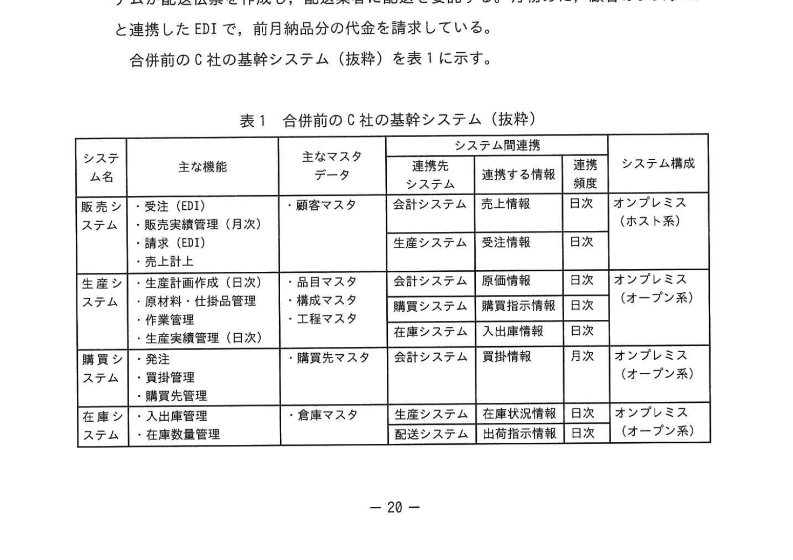
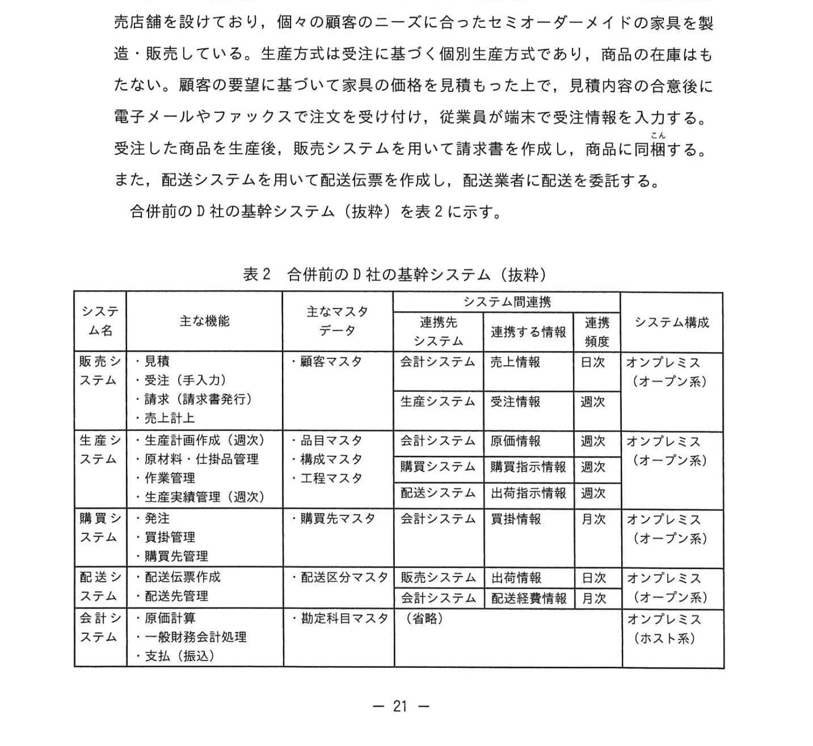
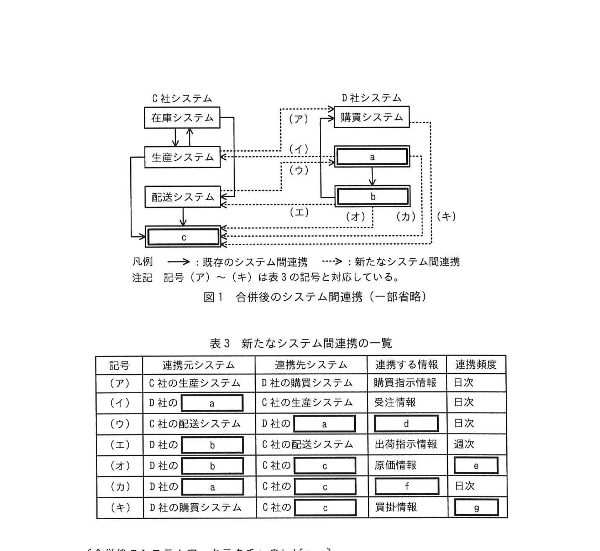
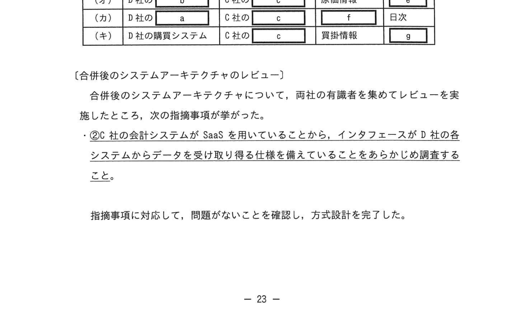

# 2023年秋期（令和5年度秋期）応用情報技術者試験 午後 問4（選択）
## システムアーキテクチャ：C社・D社合併後の基幹システム統合方式設計

---

## 問題文

**問4** システム統合の方式設計に関する次の記述を読んで、設問に答えよ。

C社と D社は中堅の家具製造販売業者である。市場シェアの拡大と利益率の向上を図るため、両社は合併することになった。名細会社は C社とするものの、対等な立場での合併である。合併に伴う基幹システムの統合は、段階的に進める方針である。将来的には基幹システムを全面的に刷新して業務の統合をしていく機構が必要になるが、より早期に合併の効果を出すために、両社の既存システムを極力活用して、業務への影響を最小限に抑えることにした。

---

### 〔合併前の C 社の基幹システム〕

C社は全国のショッピングセンターを顧客とする販売網を構築しており、安価な価格帯の家具を量産・販売している。生産方式は見込み生産方式である。生産した商品は在庫として倉庫に入荷する。顧客は、別々のシステムで生産方式が異なる方法で注文し、受注員が端末から受注情報を入力する。

合併前の C 社の基幹システム（抜粋）を表1に示す。

### 表1 合併前の C 社の基幹システム（抜粋）

> | システム名 | 主な機能 | 主なマスタデータ | 連携先システム | 連携する情報 | 連携頻度 | システム構成 |
> |---|---|---|---|---|---|---|
> | 販売システム | 受注（EDI）・販売実績管理（月次）・請求（EDI） | 顧客マスタ | 生産システム | 売上情報 | 日次 | オンプレミス（ホスト系） |
> | 生産システム | 生産計画立案(適正)・品目マスタ・構成マスタ・工程マスタ | 会計システム | 受注情報 | 日次 | オンプレミス（ホスト系） |
> | 購買システム | 受注・購買管理 | 購買先マスタ | 会計システム | 購買情報 | 月次 | オンプレミス（オープン系） |
> | 在庫システム | 入出庫管理・在庫数管理 | 倉庫マスタ | 生産システム | 在庫情報 | 日次 | オンプレミス（オープン系） |
> | 会計システム | 一般勘定会計処理・支払（振込・手形） | 勘定科目マスタ | 配送システム | 配送経費情報 | 月次 | クラウドサービス（SaaS） |
> | 配送システム | 配送伝票作成・配送管理 | 配送区分マスタ | 出荷情報 | 日次 | オンプレミス（オープン系） |

---

### 〔合併前の D 社の基幹システム〕

D社は大手百貨店やハウスメーカーのインテリア展示場にショールームを兼ねた販売店舗を設けており、個々の顧客のニーズに合ったセミオーダーメイドの家具を製造・販売している。生産方式は受注生産方式（受注後に生産計画の立案）である。顧客の要望と基づいて家具の価格を積算したうえで、見積書を発行し、顧客が承認すると受注する。また、配送システムを用いて配送伝票を作成し、配送業者を使って配送を依頼する。

合併前の D 社の基幹システム（抜粋）を表2に示す。

### 表2 合併前の D 社の基幹システム（抜粋）

> | システム名 | 主な機能 | 主なマスタデータ | 連携先システム | 連携する情報 | 連携頻度 | システム構成 |
> |---|---|---|---|---|---|---|
> | 販売システム | 受注・見積（受注入力）・請求（請求書発行）・売上上げ | 顧客マスタ | 会計システム | 売上情報 | 日次 | オンプレミス（オープン系） |
> | 生産システム | 生産計画立案（適量）・品目マスタ・構成マスタ・工程マスタ・生産実績管理（適量） | 会計システム | 受注情報 | 日次 | オンプレミス（オープン系） |
> | 購買システム | 受注・購買管理 | 購買先マスタ | 会計システム | 購買情報 | 週次 | オンプレミス（オープン系） |
> | 在庫システム | 入出庫管理・在庫数管理 | 倉庫マスタ | 配送システム | 出荷情報 | 日次 | オンプレミス（オープン系） |
> | 会計システム | 一般勘定会計処理・支払（振込） | 勘定科目マスタ | 配送システム | 配送経費情報 | 月次 | オンプレミス（オープン系） |
> | 配送システム | 配送伝票作成・配送管理 | 配送区分マスタ | 出荷情報 | 日次 | オンプレミス（オープン系） |

---

### 〔合併後のシステムの方針〕

両社のシステム統合に向けて、次の方針を策定した。

- 重複するシステムのうち、**販売システム・購買システム・配送システム及び会計システム**は、両社どちらかのシステムを廃止し、もう一方のシステムを継続利用する。
- 両社の**生産システム**は合否方式には変更しないので、両社の生産システムを存続させた上で、極力修正を加えずに継続利用する。
- **在庫システム**は、C社のシステムを存続させた上で、極力修正を加えずに継続利用する。
- 今後の保守の容易性やコストを考慮し、汎用機を用いたホスト系システムは廃止する。
- ①**廃止するシステムの固有の機能については、処理の仕様を変更せず、継続利用するシステムに移植する。**
- 両社のシステム間で新たな連携が必要となる場合は、インタフェースを新たに開発する。
- マスタデータについては、継続利用するシステムで用いているコード体系に統一する。重複するデータについては、重複を除いた上で、継続利用するシステム側のマスタへ集約する。

---

### 〔合併後のシステムアーキテクチャ〕

合併後のシステムの方針に従ってシステムアーキテクチャを整理した。

### 図1 合併後のシステム間連携（一部省略）

> **システム構成：**
> - C社側：在庫システム → 生産システム → 配送システム
> - D社側：(ア)購買システム → (a) → 
> - 凡例：既存のシステム間連携 →→ 新たなシステム間連携

### 表3 新たなシステム間連携の一覧

> | 記号 | 連携元システム | 連携先システム | 連携する情報 | 連携頻度 |
> |---|---|---|---|---|
> | (ア) | C社の販売システム | D社の購買システム | 出荷情報 | 日次 |
> | (イ) | D社のシステム | `[　a　]` | 受注情報 | 日次 |
> | (ウ) | C社の配送システム | C社 | 配送指示情報 | 日次 |
> | (エ) | C社の | C社の配送システム | (省略) | 日次 |
> | (オ) | D社の | C社の | 原価情報 | (省略) |
> | (カ) | D社の `[　a　]` | C社の `[　c　]` | `[　f　]` | 日次 |
> | (キ) | D社の購買システム | C社の | 買掛情報 | `[　g　]` |

---

### 〔合併後のシステムアーキテクチャのレビュー〕

合併後のシステムアーキテクチャについて、両社の有識者を集めてレビューを実施したところ、次の指摘事項が挙がった。

②**C社の会計システムが SaaS を用いているところから、インタフェースが D 社の各システムからデータを受け取り仕様を整えていることをあらかじめ調査すること。**

指摘事項に対応して、問題がないことを確認し、方式設計を完了した。

---

## 設問

### 設問1 〔合併後のシステムアーキテクチャ〕について答えよ。

**(1)** 図1及び表3中の `[　a　]` 〜 `[　c　]` に入れる適切な字句を答えよ。

**(2)** 表3中の `[　d　]` 〜 `[　g　]` に入れる適切な字句を答えよ。

### 設問2 本文中の下線①について答えよ。

**(1)** 移植先は、どちらの会社のどのシステムか。会社名とシステム名を答えよ。

**(2)** 移植する機能を、表1及び表2の主な機能の列に記載されている用語を用いて全て答えよ。

### 設問3 本文中の下線②の指摘事項が挙がった理由を、オンプレミスのシステムとの違いの観点から40字以内で答えよ。

---

## 解答と解説

### 設問1

**(1)**

| 空欄 | 正解 | 解説 |
|---|---|---|
| **a** | 販売システム | D社の販売システムから連携（受注情報） |
| **b** | 生産システム | C社の生産システムへ連携（配送指示情報） |
| **c** | 会計システム | D社から C社の会計システムへ集約 |

**(2)**

| 空欄 | 正解 | 解説 |
|---|---|---|
| **d** | 出荷情報 | D社の購買→配送連携で出荷情報を連携 |
| **e** | 週次 | D社の購買システムは週次連携 |
| **f** | 売上情報 | D社販売→C社会計への売上情報 |
| **g** | 月次 | 買掛情報は月次 |

---

### 設問2

**(1) 正解：会社名=D社、システム名=販売システム**

廃止されるC社のホスト系販売システムの固有機能を移植する先は、継続利用するD社の販売システム。

**(2) 正解：受注（EDI）、販売実績管理（月次）、請求（EDI）**

C社の販売システム固有の機能はEDIを使った受注・請求と月次の販売実績管理。D社の販売システムにはない機能なので移植が必要。

---

### 設問3

**正解：C社の会計システムはSaaSなので、個別の会社向けの仕様変更が困難だから（38字）**

オンプレミスのシステムは自社でカスタマイズできるが、SaaSは共通の仕様で提供されるため、インタフェース仕様がD社のシステムに合わせられるかを事前に確認する必要がある。

---

## 参考：主要キーワード

| 用語 | 説明 |
|------|------|
| 基幹システム統合 | 合併・統合に伴い複数の基幹システムを統合すること |
| 見込み生産 | 需要予測に基づき事前に生産する方式（C社の方式） |
| 受注生産 | 受注後に生産計画を立てる方式（D社の方式） |
| EDI（Electronic Data Interchange） | 企業間の受注・請求データを電子的に交換する仕組み |
| SaaS（Software as a Service） | ソフトウェアをクラウドで提供するサービス。個別仕様変更が困難 |
| オンプレミス | 自社のサーバで運用するシステム。カスタマイズ自由度が高い |
| ホスト系システム | メインフレームを中核としたシステム。保守コストが高い |
| インタフェース | 異なるシステム間でデータを受け渡すための接続仕様 |
| マスタデータ統合 | 合併時に両社のマスタデータのコード体系を統一すること |
| 移植 | あるシステムの機能を別のシステムに転換・実装すること |
