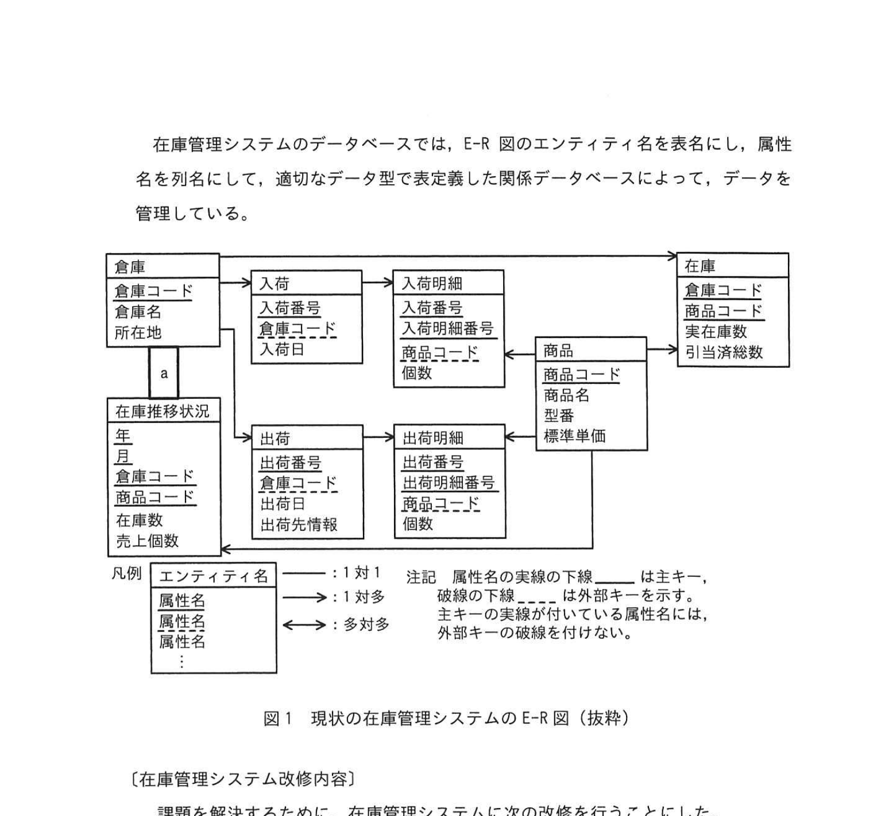
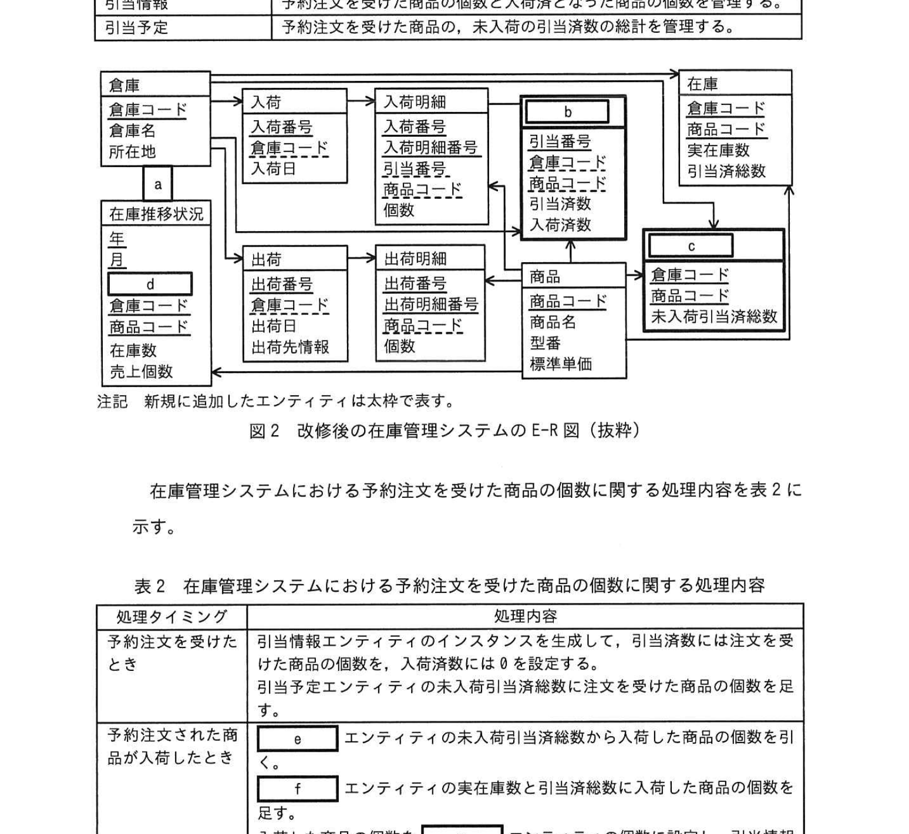
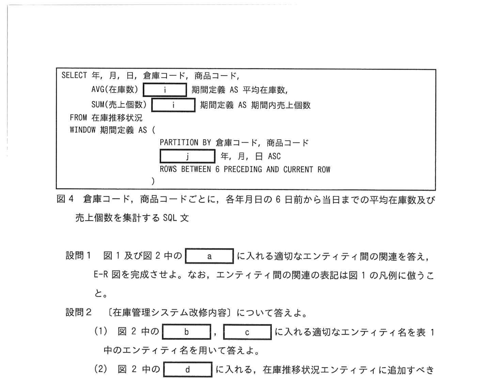

# 2023年秋期（令和5年度秋期）応用情報技術者試験 午後 問6（選択）
## データベース：在庫管理システム改修（予注文・引当処理・OLAPウィンドウ関数）

---

## 問題文

**問6** 在庫管理システムに関する次の記述を読んで、設問に答えよ。

M社は、ネットショップで日用雑貨の販売を行う企業である。M社では、在庫管理について次の課題を抱えている。

- 在庫が足りない場合は、注文を受けることができず、機会損失につながっている。
- 商品の仕入れの間隔や個数を調整する管理サイクルが長く、余剰な在庫を抱える傾向にある。

---

### 〔現状の在庫管理〕

現在、在庫管理を次のように行っている。

- 商品の注文を受けた段階で、出荷に最も近い倉庫を見つけて、その倉庫の在庫から注文個数を引き当てる。この引き当てられた注文個数を引当済総数という。各倉庫において、引き当てられた合計数を引当済総数として管理し、引当済総数を実在庫数から引くことでどれだけの商品が引き当てられているかが分かる。
- 実在庫数から引当済総数を引いたものを在庫数といい、在庫数以下の注文個数の場合、合わせた注文を受け付ける。
- 商品が倉庫に入荷すると、入荷した商品の個数を実在庫数に足し込む。
- 倉庫から商品を出荷すると、出荷個数を実在庫数から引くとともに引当済総数からも引く。これによって、引き当ての消込みを行う。

M社では、月次の月次バッチ処理で毎月の締めの在庫数と売上個数を記録した分析用の表を用いて、商品ごとの在庫数と売上個数の推移を詳細している。

また、期末に商品の在庫回転日数を集計して、来期の仕入れの間隔や個数を調整している。

M社では、商品の在庫回転日数を、簡易的に次の式で計算している。

**在庫回転日数 ＝ 期間内の平均在庫数 × 期間内の日数 ÷ 期間内の売上個数**

在庫回転日数の計算において、現状では、期間内の平均在庫数として12か月分の締めの在庫数の平均値を使用している。

---

### 図1 現状の在庫管理システムのE-R図（抜粋）



> **エンティティ：**
> - 倉庫（倉庫コード, 倉庫名, 所在地）
> - 入荷（入荷番号, 貨費コード, 商品コード, 入荷明細番号, 入荷明細数量）
> - 在庫（倉庫コード, 商品コード, 実在庫数, 引当済総数）
> - 在庫推移状況（年, 月, 倉庫コード, 商品コード, 在庫数, 個数）
> - 出荷（出荷番号, 出荷明細番号, 出荷明細数量, 出荷日, 出荷先情報）
> - 商品（商品コード, 商品名, 型番, 標準単価）

---

### 〔在庫管理システム改修内容〕

課題を解決するために、在庫管理システムに次の改修を行うことにした。

- 在庫数が足りない場合は、在庫からは引当をせず、予約注文として受け付ける。なお、予約注文ごとに商品を発注する。注文を受けた段階では引当情報を作成しない。
- 商品の仕入れの間隔や個数を調整する管理サイクルを短くするために、在庫の評価を月次から日次処理の記録に変更して、毎日の締めの在庫数と売上個数を在庫推移状況エンティティに記録する。

現状では、在庫が足りない商品の予約注文を受けたとしても、在庫引当を行う余裕在庫数より引当済総数の方が多くなってしまい、注文に応じられなくなっていた。そこで、E-R図の予約注文用と入荷確認タイミングに合わせるために、E-R図に予約注文用の二つのエンティティを追加することにした。追加するエンティティを表1に示す。

---

### 表1 追加するエンティティ

> | エンティティ名 | 内容 |
> |---|---|
> | 引当情報 | 予約注文を受けた商品の品数の個数と入荷済となった商品の個数を管理する |
> | 引当予定 | 予約注文を受けた商品の、未入荷の引当済総数の合計を管理する |

---

### 図2 改修後の在庫管理システムのE-R図（抜粋）



> **追加エンティティ（太枠）：**
> - 引当情報（`[　b　]`, 入荷番号, 商品コード, 在庫数, 引当済総数, 入荷済数）
> - 引当予定（`[　c　]`, 商品コード, 在庫数, 引当済総数）
> - 在庫推移状況エンティティに属性 `[　d　]` を追加

---

### 〔在庫管理システム改修後の予約注文を受けた商品の個数に関する処理内容〕

在庫管理システムにおける予約注文を受けた商品の個数に関する処理内容を表2に示す。

> **表2 処理内容（抜粋）：**
>
> | 処理タイミング | 処理内容 |
> |---|---|
> | 予約注文を受けたとき | 引当情報エンティティのインスタンスを生成して、引当済総数に予約注文として受け付けた商品の個数を設定する |
> | 予約注文した商品が入荷したとき | `[　e　]` エンティティの未入荷引当済総数から入荷した商品の個数を引当情報エンティティの `[　f　]` の個数に更新する。`[　g　]` エンティティの在庫数と引当済総数に入荷した商品の個数を `[　h　]` する。入荷した商品の個数を引当情報エンティティの入荷済数に設定し、引当情報エンティティの `[　h　]` に応じる。 |
> | 予約注文された商品を出荷したとき | 引当予定エンティティを出荷先確認のエンティティに設定し、在庫エンティティの実在庫数及び引当済総数から引く。 |

---

### 〔在庫の評価〕

より正確かつ迅速に在庫回転日数を把握するために、在庫推移状況エンティティから、期間を1週間（7日間）として、倉庫コード、商品コードごとに、各年月日の6日前から当日までの平均在庫数及び売上個数を在庫回転日数集計することにする。

可読性を高くするために、SQL 文にはウィンドウ関数を使用することにする。

ウィンドウ関数を使う際には、FROM 句で指定した表の各行ごとに集計が可能であり、各行ごとに集計問い合わせをなるような移動平均も簡単に求めることができる。

### 図3 ウィンドウ関数で使用する構文（抜粋）

```
〈ウィンドウ関数〉::=
  〈ウィンドウ関数名〉(引数) OVER (〈ウィンドウ名〉)
  | 〈ウィンドウ関数名〉(引数) OVER (〈ウィンドウ指定〉)

WINDOW 句 ::=
  WINDOW (ウィンドウ名) AS (〈ウィンドウ指定〉) [, 〈ウィンドウ名〉 AS (〈ウィンドウ指定〉) ...]

〈ウィンドウ指定〉::=
  [PARTITION BY 句] [ORDER BY 句] [〈ウィンドウ枠〉]
  
〈PARTITION BY 句〉::= PARTITION BY 〈列名〉 [...]
```

> - 注記1：OVER の後に (〈ウィンドウ指定〉) を記載する代わりに、 (〈ウィンドウ名〉) で参照できる
> - 注記2：PARTITION BY 句はグループ化。ORDER BY 句はウィンドウ内の並び順
> - 注記3：ウィンドウ枠として ROWS BETWEEN N PRECEDING AND CURRENT ROW の形式を使用
> - 注記4：「...」は省略可能な要素を示す

---

### 図4 倉庫コード、商品コードごとに、各年月日の6日前から当日までの平均在庫数及び売上個数を集計するSQL文



```sql
SELECT 年, 月, 日, 倉庫コード, 商品コード,
       AVG(在庫数) [　i　] 期間平均在庫数 AS 平均在庫数,
       SUM(売上個数) [　j　] 期間内売上個数 AS 期間内売上個数
FROM 在庫推移状況
WINDOW 期間平均在庫数 AS (
  PARTITION BY 倉庫コード, 商品コード
  ORDER BY 年, 月, 日
  ROWS BETWEEN 6 PRECEDING AND CURRENT ROW
),
期間内売上個数 AS (...)
```

---

## 設問

### 設問1 図1及び図2中の `[　a　]` に入れる適切なエンティティ間の関係を答えよ。E-R図を完成させよ。なお、エンティティ間の関係図は図1の凡例に倣うこと。

### 設問2 〔在庫管理システム改修内容〕について答えよ。

**(1)** 図2中の `[　b　]`、`[　c　]` に入れる適切なエンティティ名を図1中のエンティティ名を用いて答えよ。

**(2)** 図2中の `[　d　]` に入れる、在庫推移状況エンティティに追加すべき適切な属性名を答えよ。なお、属性名の表記は図1の凡例に倣うこと。

**(3)** 表2中の `[　e　]` 〜 `[　h　]` に入れる適切な字句を答えよ。

### 設問3 図4中の `[　i　]`、`[　j　]` に入れる適切な字句を答えよ。

---

## 解答と解説

### 設問1

**正解：a=↓（多対多の関係。在庫推移状況は倉庫・商品に対して多数の記録を保持）**

在庫推移状況は倉庫と商品の組み合わせごとに毎日の記録があるため、多対多の関係（多側が在庫推移状況）。

---

### 設問2

**(1)**

| 空欄 | 正解 | 解説 |
|---|---|---|
| **b** | 引当情報 | 引当情報エンティティの主キーとして入荷番号・商品コードを使う |
| **c** | 引当予定 | 引当予定エンティティで未入荷の引当済総数を管理 |

**(2) 正解：d=旦（売上個数）**

月次から日次に変更するため、在庫推移状況エンティティには「日」属性を追加する必要がある（年・月に加えて「日」が必要）。

**(3)**

| 空欄 | 正解 | 解説 |
|---|---|---|
| **e** | 引当予定 | 未入荷の引当済総数を持つエンティティ |
| **f** | 在庫 | 入荷した商品の在庫数に設定する |
| **g** | 入荷明細 | 入荷した商品の明細 |
| **h** | 入荷済数 | 入荷した商品の個数を入荷済数として記録 |

---

### 設問3

| 空欄 | 正解 | 解説 |
|---|---|---|
| **i** | OVER | ウィンドウ関数の OVER キーワード |
| **j** | ORDER BY | ウィンドウ内の並び順を指定する ORDER BY 句 |

AVG・SUM などのウィンドウ関数は `関数名() OVER (ウィンドウ指定)` の構文で使用し、PARTITION BY でグループ化、ORDER BY で並び順を指定してから ROWS BETWEEN で集計範囲（ウィンドウ枠）を設定する。

---

## 参考：主要キーワード

| 用語 | 説明 |
|------|------|
| 在庫引当 | 受注した商品数を在庫から予約・確保すること |
| 引当済総数 | 受注により確保されている在庫数の合計 |
| 実在庫数 | 倉庫に実際に存在する在庫数 |
| 在庫回転日数 | 在庫が売れるまでの平均日数。在庫の効率性を示す指標 |
| ウィンドウ関数 | SQL でグループ全体ではなく行ごとに集計を行う関数（OLAP関数） |
| OVER 句 | ウィンドウ関数でウィンドウの範囲を指定するキーワード |
| PARTITION BY | ウィンドウ関数でグループ（パーティション）を定義する句 |
| ORDER BY（ウィンドウ） | ウィンドウ関数でパーティション内の並び順を定義する句 |
| ROWS BETWEEN | ウィンドウ枠の行範囲を指定する（例：6 PRECEDING AND CURRENT ROW） |
| 移動平均 | 直近N件の平均を日次・週次などで計算する統計手法 |
| E-R図（Entity-Relationship Diagram） | エンティティとその関係を表すデータモデリング図 |
